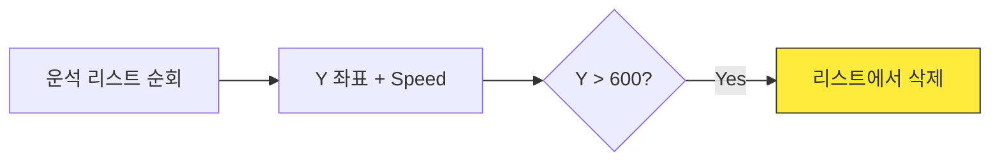

# Marp 레이아웃 패턴 예시

## 1. 기본형 (Single Column Flow)
대부분의 슬라이드에 권장되는 표준 방식입니다. 위에서 아래로 물 흐르듯 읽히는 구조입니다.

```markdown
<!-- _class: slide-section -->
# 2.1.1. 운석 낙하 원리

- 중력에 의해 운석의 Y 좌표가 증가합니다.
- 화면 밖으로 나가면 메모리 절약을 위해 삭제해야 합니다.
- 삭제하지 않으면 컴퓨터가 느려집니다!


```

## 2. 코드와 설명 (Vertical Stack)
코드 블록과 그에 대한 설명을 위아래로 배치하여 코드가 잘리지 않게 합니다.

```markdown
<!-- _class: slide-section -->
# 2.2.1. 리스트에 운석 추가하기

- `meteors` 리스트를 생성합니다.
- 일정 주기마다 새 운석 위치를 리스트에 넣습니다. [A]

<div class="code-window">

```python
meteors = [] # 리스트 초기화

# [A] 새 운석 추가
if timer > spawn_rate:
    new_meteor = [x, y]
    meteors.append(new_meteor)
```

</div>
```

## 3. Mermaid Flowchart 연동
로직 시각화가 필요한 경우에도 수직 흐름을 유지하되, Mermaid 크기를 적절히 조절합니다.

```markdown
<!-- _class: slide-section -->
# 2.2.3. 운석 처리 프로세스

1. **Update:** 모든 운석의 Y 좌표를 증가시킵니다.
2. **Check:** 화면 끝(600)을 넘었는지 확인합니다. [A]



<div class="callout tip">
[A] 화면 바닥(600)을 넘어가는 순간 <code>remove()</code>를 호출합니다.
</div>
```

## 4. 특수한 경우 (slide-2column)
이미지와 텍스트를 반드시 병렬로 대조해야 할 때만 최소한으로 사용합니다.

```markdown
<!-- _class: slide-section -->
# 1.2.1. 테두리 속성 비교
<div class="slide-2column ratio-50">
<div>

- **left:** 왼쪽 끝점
- **right:** 오른쪽 끝점

</div>
<div>


</div>
</div>
```
