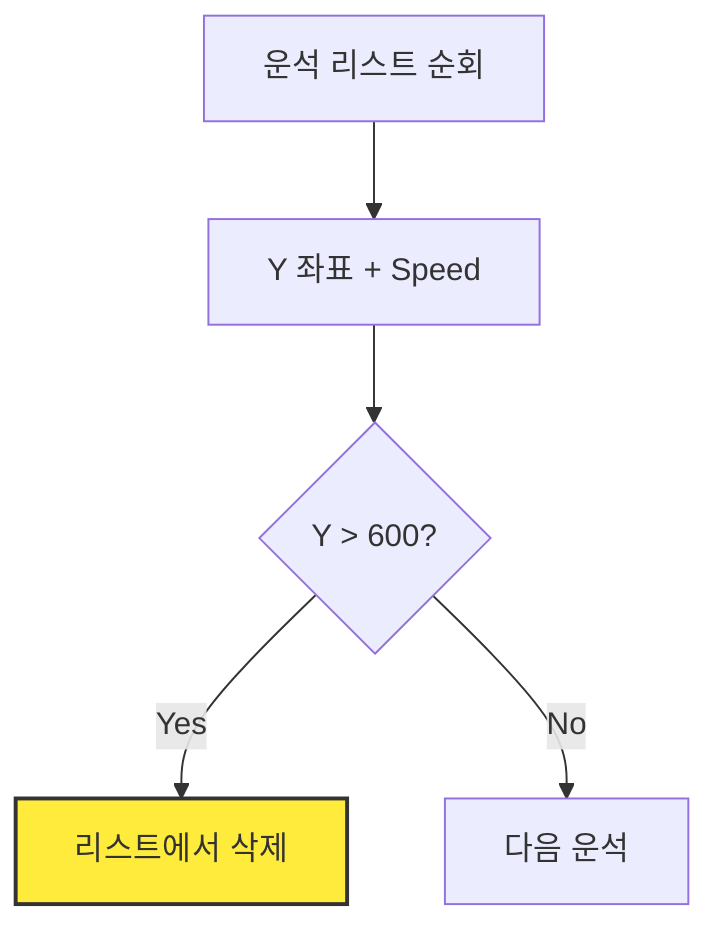

# Marp 레이아웃 패턴 예시

## 1. ratio-64 (설명 강조형)
텍스트 설명이 많고, 이미지는 개념을 보조하는 용도일 때 사용합니다.

```markdown
<!-- _class: slide-section -->
# 2.1.1. 운석 낙하 원리
<div class="slide-2column ratio-64">
<div>

- 중력에 의해 운석의 Y 좌표가 증가합니다.
- 화면 밖으로 나가면 메모리 절약을 위해 삭제해야 합니다.
- 삭제하지 않으면 컴퓨터가 느려집니다!

</div>
<div>


</div>
</div>
```

## 2. ratio-55 (대등 균형형)
텍스트와 코드/이미지의 비중이 비슷할 때 가장 안정적인 레이아웃입니다.

```markdown
<!-- _class: slide-section -->
# 2.2.1. 리스트에 운석 추가하기
<div class="slide-2column ratio-55">
<div>

- `meteors` 리스트를 생성합니다.
- 일정 주기마다 새 운석 위치를 리스트에 넣습니다. [A]
- `append()` 함수를 사용합니다. [B]

</div>
<div>

<div class="code-window">

```python
meteors = [] # 리스트 초기화

# [A] 새 운석 추가
if timer > spawn_rate:
    new_meteor = [x, y]
    meteors.append(new_meteor) # [B]
```

</div>
</div>
</div>
```

## 3. ratio-46 (코드 강조형)
실제 조립해야 할 코드가 길거나 상세한 코드 분석이 필요할 때 사용합니다.

```markdown
<!-- _class: slide-section -->
# 2.3.2. 운석 이동 및 삭제 로직
<div class="slide-2column ratio-46">
<div>

- 모든 운석을 하나씩 꺼내어 처리합니다.
- 화면 하단을 넘어가면 리스트에서 제거합니다.
- **의도적 실패:** 삭제 조건(`???`)을 완성하세요.

</div>
<div>

<div class="code-window">

```python
for m in meteors[:]:
    m[1] += speed # 운석 낙하
    
    # 화면 밖으로 나갔는지 체크
    if m[1] > ???: 
        meteors.remove(m)
```

</div>
</div>
</div>
```

## 4. Mermaid Flowchart (로직 시각화형)
복잡한 알고리즘이나 상태 전환을 시각적으로 보여줄 때 사용합니다.

```markdown
<!-- _class: slide-section -->
# 2.2.3. 운석 처리 프로세스
<div class="slide-2column ratio-55">
<div>

1. **Update:** 모든 운석의 Y 좌표를 증가시킵니다.
2. **Check:** 화면 끝(600)을 넘었는지 확인합니다.
3. **Remove:** 넘었다면 목록에서 지웁니다.

</div>
<div>



</div>
</div>
```
