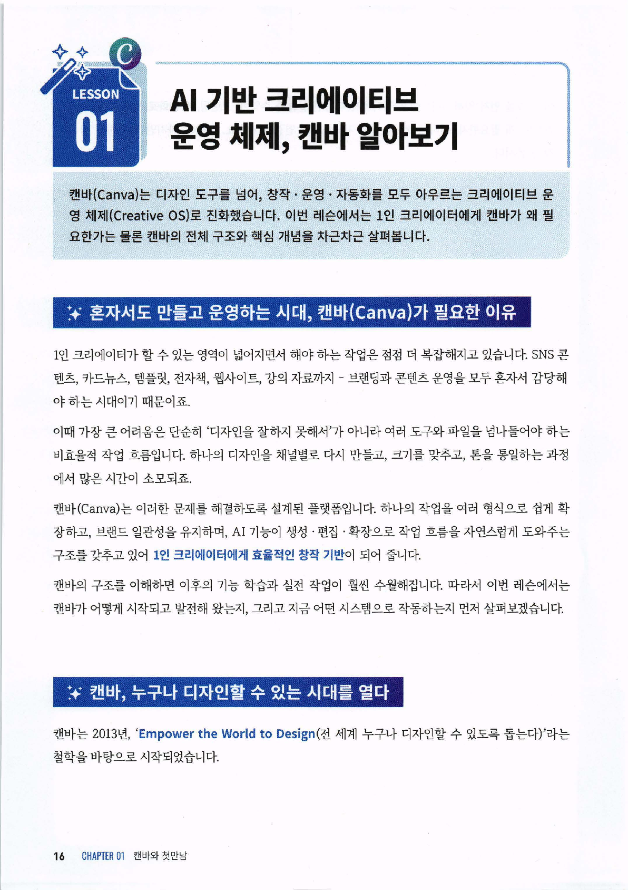

###### Al 기반크리에이티브 운영 체재, 캔바 알아보기

###### · ·

1

###### | |

1인 크리에이터가 할 수 있는 영역이 넓어지면서 해야 하는 작업은 점점 더 복잡해지고 있습니다. SNS 콘 텐츠, 카드뉴스, 템플릿, 전자책, 웹사이트, 강의 자료까지 - 브랜딩과 콘텐츠 운영을 모두 혼자서 감당해

야 하는 시대이기 때문이죠.

이때 가장 큰 어려움은 단순히 ‘디자인을 잘하지 못해서’가 아니라 여러 도구와 파일을 넘나들어야 하는

###### 비효율적 작업 흐름입니댜 하나의 디자인을 채널별로 다시 만들고, 크기를 맞추고, 톤을 통일하는 과정

에서 많은 시간이 소모되죠.

캔바 (Canva)는 이러한 문제를 해결하도록 설계된 플랫폼입니다. 하나의 작업을 여러 형식으로 쉽게 확

장하고, 브랜드 일관성을 유지하며, AI 기능이 생성 · 편집 · 확장으로 작업 흐름을 자연스럽게 도와주는

구조를 갖추고 있어 1인 크리에이터에게 효율적인 창작 기반이 되어 줍니다.

캔바의 구조를 이해하면 이후의 기능 학습과 실전 작업이 훨씬 수월해집니다. 따라서 이번 레슨에서는 캔바가 어떻게 시작되고 발전해 왔는지, 그리고 지금 어떤 시스템으로 작동하는지 먼저 살펴보겠습니다.

###### | |

캔바는 2013년, ‘Empower the World to Design(전 세계 누구나 디자인할 수 있도록 돕는다)’라는

철학을 바탕으로 시작되었습니다.

16 CHAPTER 01 캔바와 젓만남

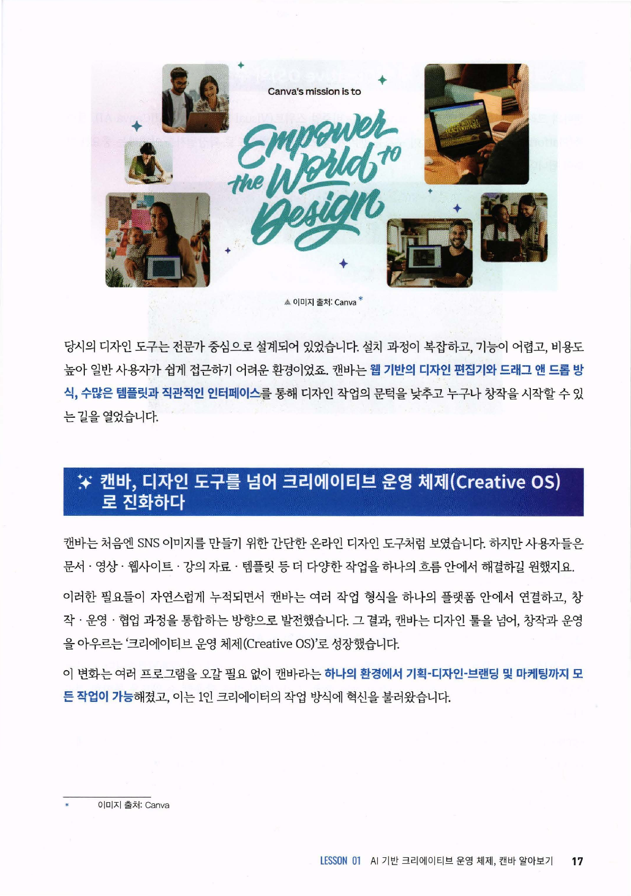

令

令

Canva's mission Is to

令

♦

令

令

令

.... 이미지 줄처: Canva *

###### 당시의 디자인 도구는 전문가 중심으로 설계되어 있었습니다. 설치 과정이 복잡하고, 기능이 어렵고, 비용도

높아 일반 사용자가 쉽게 접근하기 어려운 환경이었죠. 캔바는 디자인 드래그 드롭 방

###### 식, 수많은 를 통해 디자인 작업의 문턱을 낮추고 누구나 창작을 시작할 수 있

는길을열었습니다.

#### | 운영체제( os) I

###### 캔바는 처음엔 SNS 이미지를 만들기 위한 간단한 온라인 디자인 도구처럼 보였습니다. 하지만 사용자들은

문서 · 영상 · 웹사이트 · 강의 자료 · 템플릿 등 더 다양한 작업을 하나의 흐름 안에서 해결하길 원했지요.

이러한 필요들이 자연스럽게 누적되면서 캔바는 여러 작업 형식을 하나의 플랫폼 안에서 연결하고, 창 작 · 운영 · 협업 과정을 통합하는 방향으로 발전했습니다. 그 결과; 캔바는 디자인 툴을 넘어, 창작과 운영

을 아우르는 ‘크리에이티브 운영 체제 (Creative OS)’로 성장했습니다.

이 변화는 여러 프로그램을 오갈 필요 없이 캔바라는 하나의 모

해졌고, 이는 1인 크리에이터의 작업 방식에 혁신을 불러왔습니다.

* 이미지 출처: Canva

LESSON 01 A| 기반 크리에이티브 운영 제제, 캔바 알아보기 17

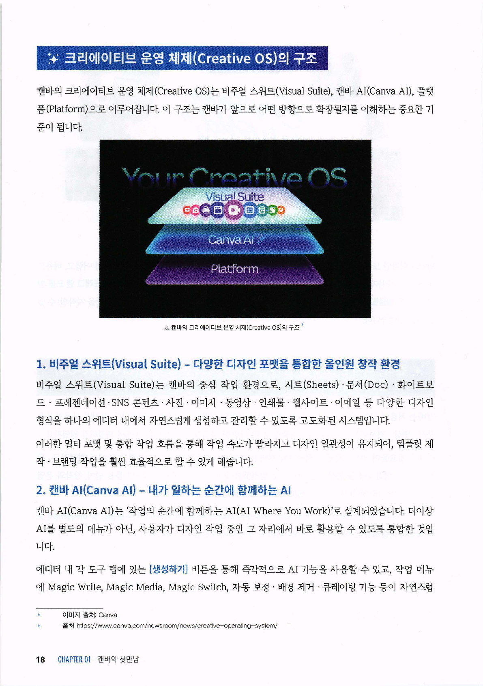

###### | |

캔바의 크리에이티브 운영 체제(Creative OS)는 비주얼 스위트(Visual Suite), 캔바 AI(Canva AI), 플랫

폼(Platform)으로 이루어집니다. 이 구조는 캔바가 앞으로 어떤 방향으로 확장될지를 이해하는 중요한 기

준이 됩니다.

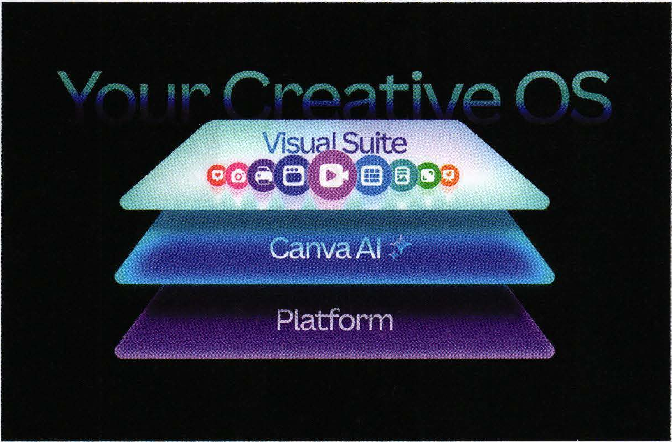

... 캔바의 크리에이티브 운영 제제(Creative OS)의 구조 *

- 1. 스위트(Visual Suite) - 디자인 비주얼 스위트(Visual Suite)는 캔바의 중심 작업 환경으로, 시트(Sheets) ·문서 (Doc) · 화이트보 드 · 프레젠테이션 ·SNS 콘텐츠 · 사진 · 이미지 · 동영상 · 인쇄물 · 웹사이트 · 이메일 등 다양한 디자인 형식을 하나의 에디터 내에서 자연스럽게 생성하고 관리할 수 있도록 고도화된 시스템입니다.

이러한 멀티 포맷 및 통합 작업 흐름을 통해 작업 속도가 빨라지고 디자인 일관성이 유지되어, 템플릿 제 작 · 브렌딩 작업을 훨씬 효율적으로 할 수 있게 해줍니다.

- 2. 캔바 Al{Canva Al) - 내가 일하는 순간에 함께하는 Al 캔바 AI(Canva AI)는 ‘작업의 순간에 함께하는 AI(AI Where You Work)’로 설계되었습니다. 더이상 AI를 별도의 메뉴가 아닌, 사용자가 디자인 작업 중인 그 자리에서 바로 활용할 수 있도록 통합한 것입 니다.

###### 에디터 내 각 도구 탭에 있는 [생성하기] 버튼을 통해 즉각적으로 AI 기능을 사용할 수 있고, 작업 메뉴 에 Magic Write, Magic Media, Magic Switch, 자동 보정 · 배경 제거 · 큐레이팅 기능 등이 자연스럽

- * 이미지 출처: Canva
- * 출처 https://www.canva.com/newsroom/news/creative-operating-system/

###### 18 CHAPTER 01 캔바와 젓만남

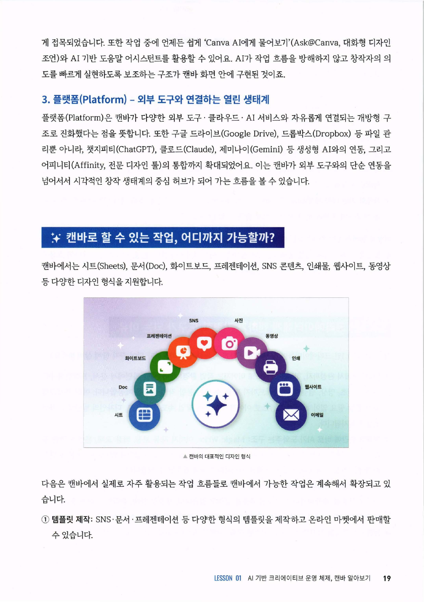

게 접목되었습니댜 또한 작업 중에 언제든 쉽게 ‘Canva AI에게 물어보기’(Ask@Canva, 대화형 디자인 조언)와 AI 기반 도움말 어시스턴트를 활용할 수 있어요. Al가 작업 흐름을 방해하지 않고 창작자의 의

도를 빠르게 실현하도록 보조하는 구조가 캔바 화면 안에 구현된 것이죠.

###### 3. 플랫폼(Platform) - 외부 도구와 생태계

플랫폼(Platform)은 캔바가 다양한 외부 도구 · 클라우드 · AI 서비스와 자유롭게 연결되는 개방형 구 조로 진화했다는 점을 뜻합니댜 또한 구글 드라이브(Google Drive), 드롭박스(Dropbox) 등 파일 관 리뿐 아니라, 챗지피티 (ChatGPT), 클로드(Claude), 제미나이 (Gemini) 등 생성형 AI와의 연동, 그리고

어피니티 (Affinity, 전문 디자인 툴)의 통합까지 확대되었어요. 이는 캔바가 외부 도구와의 단순 연동을

넘어서서 시각적인 창작 생태계의 중심 허브가 되어 가는 흐름을 볼 수 있습니다.

###### | 캔바로 |

캔바에서는 시트(Sheets), 문서 (Doc), 화이트보드, 프레젠테이션, SNS 콘텐츠, 인쇄물, 웹사이트, 동영상

등 다양한 디자인 형식을 지원합니다.

SNS 사진

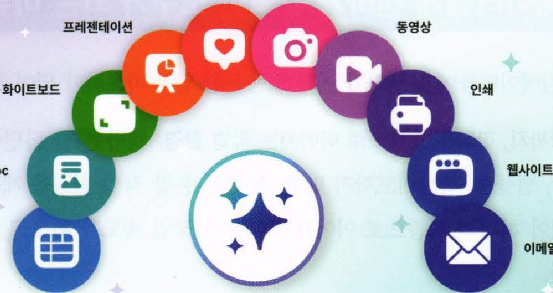

Doc

시트

... 캔바의 대표적인 디자인 형식

다음은 캔바에서 실제로 자주 활용되는 작업 흐름들로 캔바에서 가능한 작업은 계속해서 확장되고 있 습니댜 ® 템플릿 제작: SNS·문서 ·프레젠테이션 등 다양한 형식의 템플릿을 제작하고 온라인 마켓에서 판매할

수있습니다.

LESSON 01 Al 기반 크리에이티브 운영 제제, 캔바 알아보기 19

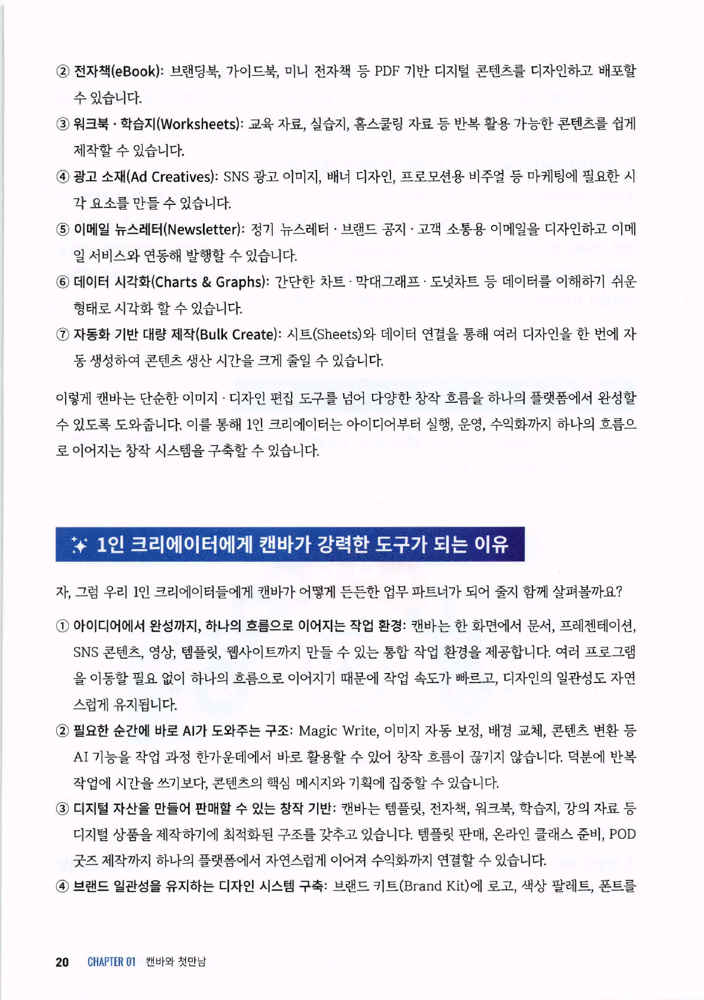

###### ® 전자책(eBook): 브랜딩북, 가이드북, 미니 전자책 등 PDF 기반 디지털 콘텐츠를 디자인하고 배포할

수있습니다.

###### ® 워크북 · 학습지(Worksheets): 교육 자료, 실습지, 홈스쿨링 자료 등 반복 활용 가능한 콘텐츠를 쉽게

제작할수있습니다.

® 광고 소재(Ad Creatives): SNS 광고 이미지, 배너 디자인, 프로모션용 비주얼 등 마케팅에 필요한 시

각 요소를 만들 수 있습니다.

® 이메일 뉴스레터(Newsletter): 정기 뉴스레터 ·브랜드 공지 ·고객 소통용 이메일을 디자인하고 이메

일 서비스와 연동해 발행할 수 있습니댜

® 데이터 시각화(Charts & Graphs): 간단한 차트 · 막대그래프 ·도넛차트 등 데이터를 이해하기 쉬운

형태로시각화할수있습니댜

® 자동화 기반 대량 제작(Bulk Create): 시트(Sheets)와 데이터 연결을 통해 여러 디자인을 한 번에 자

동 생성하여 콘텐츠 생산 시간을 크게 줄일 수 있습니다.

이렇게 캔바는 단순한 이미지 · 디자인 편집 도구를 넘어 다양한 창작 흐름을 하나의 플랫폼에서 완성할

수 있도록 도와줍니다. 이를 통해 1인 크리에이터는 아이디어부터 실행, 운영, 수익화까지 하나의 흐름으 로 이어지는 창작 시스템을 구축할 수 있습니다.

###### | 이유 |

자, 그럼 우리 1인 크리에이터들에게 캔바가 어 떻게 든든한 업무 파트너가 되어 줄지 함께 살펴볼까요?

® 아이디어에서 완성까지, 하나의 흐름으로 이어지는 작업 환경: 캔바는 한 화면에서 문서, 프레젠테이션, SNS 콘텐츠, 영상, 템플릿, 웹사이트까지 만들 수 있는 통합 작업 환경을 제공합니다. 여러 프로그램

올 이동할 필요 없이 하나의 흐름으로 이어지기 때문에 작업 속도가 빠르고, 디자인의 일관성도 자연

스럽게유지됩니다.

® 필요한 순간에 바로 Al가 도와주는 구조: Magic Write, 이미지 자동 보정, 배경 교체, 콘텐츠 변환 등 AI 기능을 작업 과정 한가운데에서 바로 활용할 수 있어 창작 흐름이 끊기지 않습니다. 덕분에 반복

작업에 시 간을 쓰기 보다, 콘텐츠의 핵심 메시 지와 기획에 집중할 수 있습니 다.

® 디지털 자산을 만들어 판매할 수 있는 창작 기반: 캔바는 템플릿, 전자책, 워크북, 학습지, 강의 자료 등 디지털 상품을 제작하기에 최적화된 구조를 갖추고 있습니댜 템플릿 판매, 온라인 클래스 준비, POD

굿즈 제작까지 하나의 플랫폼에서 자연스럽게 이어져 수익화까지 연결할 수 있습니다.

® 브랜드 일관성을 유지하는 디자인 시스템 구축: 브랜드 키트(Brand Kit)에 로고, 색상 팔레트, 폰트를

20 CHAPTER 01 캔바와 첫만남

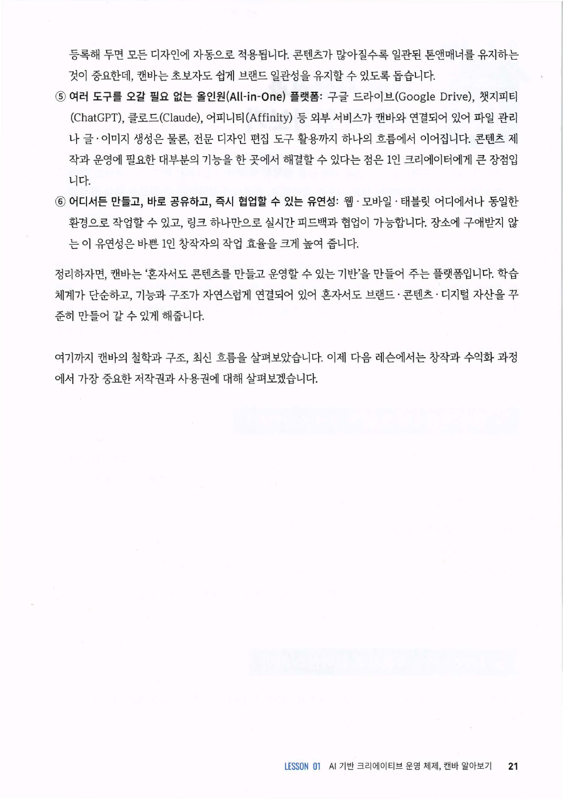

###### 등록해 두면 모든 디자인에 자동으로 적용됩니다. 콘텐츠가 많아질수록 일관된 톤앤매너를 유지하는

것이 중요한데, 캔바는 초보자도 쉽게 브랜드 일관성을 유지할 수 있도록 돕습니다.

® 여러 도구를 오갈 필요 없는 올인원(All-in-One) 플랫폼: 구글 드라이브(Google Drive), 챗지피티 (ChatGPT), 클로드(Claude)， 어피니티 (Affinity) 등 외부 서비스가 캔바와 연결되어 있어 파일 관리 나 글 · 이미지 생성은 물론, 전문 디자인 편집 도구 활용까지 하나의 흐름에서 이어집니다. 콘텐츠 제

작과 운영에 필요한 대부분의 기능을 한 곳에서 해결할 수 있다는 점은 1인 크리에이터에게 큰 장점입

니댜

® 어디서든 만둘고, 바로 공유하고, 즉시 협업할 수 있는 유연성: 웹 ·모바일 · 태블릿 어디에서나 동일한

환경으로 작업할 수 있고, 링크 하나만으로 실시간 피드백과 협업이 가능합니다. 장소에 구애받지 않

는 이 유연성은 바쁜 1인 창작자의 작업 효율을 크게 높여 줍니다.

###### 정리하자면, 캔바는 ‘혼자서도 콘텐츠를 만들고 운영할 수 있는 기반’을 만들어 주는 플랫폼입니다. 학습

###### 체계가 단순하고, 기능과 구조가 자연스럽계 연결되어 있어 혼자서도 브랜드 · 콘텐츠 · 디지털 자산을 꾸

준히 만들어 갈 수 있게 해줍니댜

###### 여기까지 캔바의 철학과 구조, 최신 흐름을 살펴보았습니다. 이제 다움 레슨에서는 창작과 수익화 과정 에서 가장 중요한 저작권과 사용권에 대해 살펴보겠습니댜

LESSON 01 Al 기반 크리에이티브 운영 제제, 캔바 알아보기 21

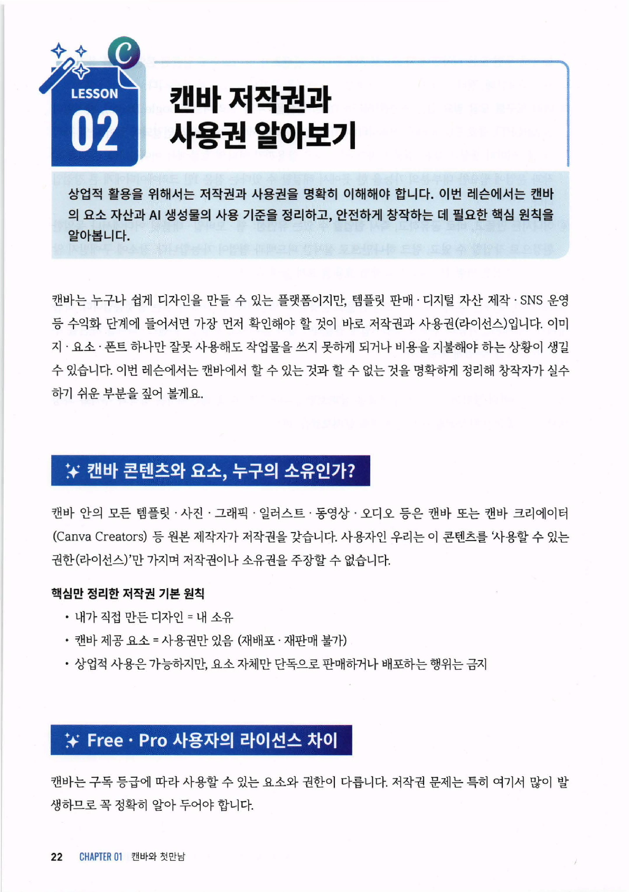

###### 캔바저작권과 사용권알아보기

상업적 의 요소 자산과 Al 기준을 정리하고, 데 필요한 핵심 원칙을

알아봅니다.

캔바는 누구나 쉽게 디자인을 만들 수 있는 플랫폼이지만, 템플릿 판매 · 디지털 자산 제작 · SNS 운영 등 수익화 단계에 들어서면 가장 먼저 확인해야 할 것이 바로 저작권과 사용권(라이선스)입니다. 이미 지 · 요소 · 폰트 하나만 잘못 사용해도 작업물을 쓰지 못하게 되거나 비용을 지불해야 하는 상황이 생길

수 있습니다. 이번 레슨에서는 캔바에서 할 수 있는 것과 할 수 없는 것을 명확하게 정리해 창작자가 실수 하기 쉬운 부분을 짚어 볼게요.

###### | |

###### 캔바 안의 모든 템플릿 · 사진 · 그래픽 · 일러스트 · 동영상 · 오디오 등은 캔바 또는 캔바 크리에이터

###### (Canva Creators) 등 원본 제작자가 저작권을 갖습니다. 사용자인 우리는 이 콘텐츠를 ‘사용할 수 있는 권한(라이선스)＇만 가지며 저작권이나 소유권을 주장할 수 없습니다.

핵심만 정리한 저작권 기본 원칙

- • 내가 직접 만든 디자인 = 내 소유
- • 캔바 제공 요소 = 사용권만 있음 (재배포 · 재판매 불가)
- • 상업적 사용은 가능하지만, 요소 자체만 단독으로 판매하거나 배포하는 행위는 금지

###### | |

캔바는 구독 등급에 따라 사용할 수 있는 요소와 권한이 다릅니다. 저작권 문제는 특히 여기서 많이 발

생하므로 꼭 정확히 알아 두어야 합니다.

22 CHAPTER 01 캔바와 첫만남

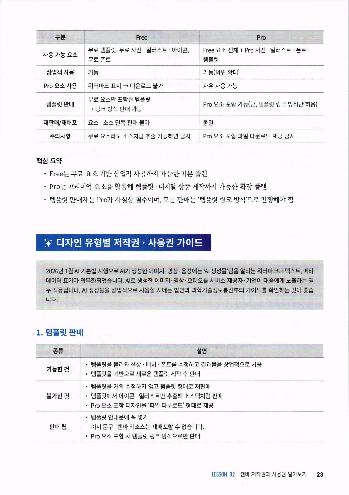

###### I

|I|I|Pro I’ ’|
|---|---|---|
|사용가능요소|무료 템플릿, 무료 사진 · 일러스트 · 아이콘,  무료폰트|Free 요소 전제 + Pro 사진 · 일러스트 · 폰트 ·  템플릿|
|상업적사용|7梅|가능(범위 확대)|
|Pro 요소사용|워터마크 표시 ➔ 다운로드 물가|자유사용가능|
|템플릿판매|무료 요소만 포함된 템플릿  一링크방식 판매가능|Pro 요소 포함 가능(단, 템플릿 링크 방식만 허용)|
|재판매/재배포|요소 · 소스단독판매불가|동일|
|주의사항|무료 요소라도 소스처럼 주줄 가능하면 금지|Pro 요소 포함 파일 다운로드 제공 금지|

핵심요약

- • Free는 무료 요소 기반 상업적 사용까지 가능한 기본 플렌
- • Pro는 프리미엄 요소를 활용해 템플릿 · 디지털 상품 제작까지 가능한 확장 플렌
- • 템플릿 판매자는 Pro가 사실상 필수이며, 모든 판매는 템플릿 링크 방식’으로 진행해야 함

###### | • |

Al 기본법 시행으로 ·

Al로 서비스

Al 것이

###### 1.

-

- • 템플릿을 불러와 색상 · 배지 · 폰트를 수정하고 결과물을 상업적으로 사용
- • 템플릿을 기반으로 새로운 템플릿 제작 후 판매

가능한것

- • 템플릿을 거의 수정하지 않고 템플릿 형태로 재판매
- • 템플릿에서 아이콘 · 일러스트만 주출해 소스팩처럼 판매
- • Pro 요소 포함 디자인을 ‘파일 다운로드’ 형태로 제공
- • 템플릿 안내문에 꼭 넣기 예시 문구: ‘캔바 리소스는 재배포할 수 없습니다.'
- • Pro 요소 포함 시 템플릿 링크 방식으로만 판매

불가한것

판매팁

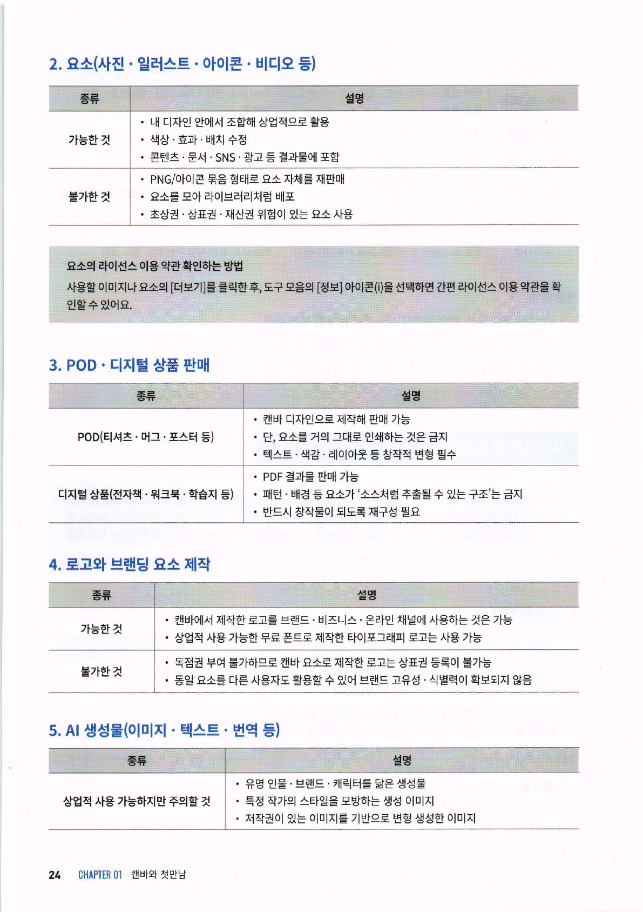

###### 2. 요소(사진 • 일러스트 • 아이콘 • 비디오 등)

###### 1

• 내 디자인 안에서 조합해 상업적으로 활용 가능한것 • 색상 · 효과 · 배지 수정

- • 콘텐츠 · 문서 · SNS · 광고 등 결과물에 포함
- • PNG/아이콘 묶음 형태로 요소 자제를 재판매

불가한것 • 요소를모아라이브러리처럼 배포

• 조상권 · 상표권 · 재산권 위험이 있는 요소 사용

확

###### 3. POD • 판매

• 캔바 디자인으로 제작해 판매 가능

POD(티셔츠 • 머그 • 포스터 등) • 단, 요소를 거의 그대로 인쇄하는 것은 금지

- • 텍스트 · 색감 · 레이아웃 등 장작적 변형 필수
- • PDF 결과물 판매 가능

디지털 상품(전자책 ·워크북·학습지 등) | · 패턴 ·배경 등요소가‘소스처럼 주출될 수 있는구조’는 금지

• 반드시 장작물이 되도록 재구성 필요

###### 4 요소 제작

- • 캔바에서 제작한 로고를 브랜드 · 비즈니스 · 온라인 채널에 사용하는 것은 가능
- • 상업적 사용 가능한 무료 폰트로 제작한 타이포그래피 로고는 사용 가능

가능한것

- • 독점권 부여 불가하므로 캔바 요소로 제작한 로고는 상표권 등록이 불가능
- • 동일 요소를 다른 사용자도 활용할 수 있어 브랜드 고유성 · 식별력이 확보되지 않음

불가한것

###### 5. Al 생성물(이미지 • 텍스트 • 번역 등)

- • 유명 인물 · 브랜드 · 캐릭터를 닮은 생성물 상업적 사용 가능하지만 주의할 것 • 특정 작가의 스타일을 모방하는 생성 이미지
- • 저작권이 있는 이미지를 기반으로 변형 생성한 이미지

24 캔바와 첫만남

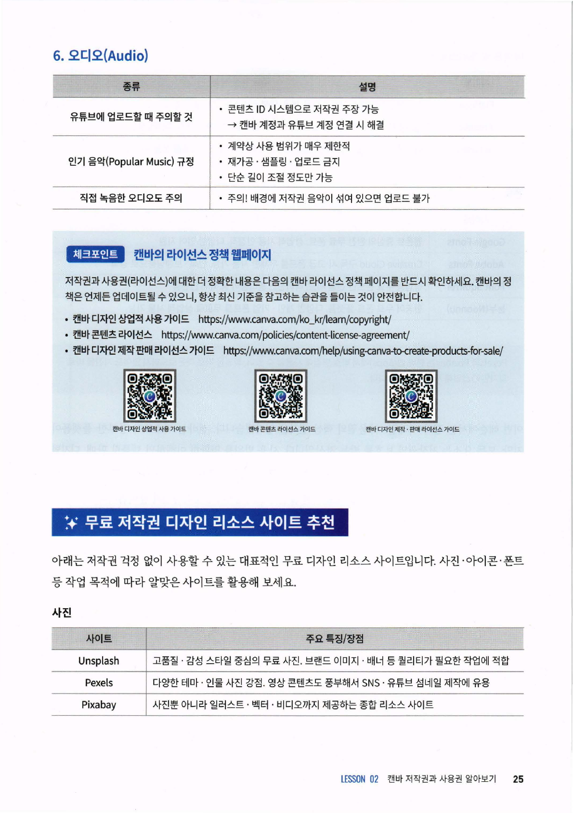

###### 6. 오디오(Audio)

_ _-

• 콘텐츠 |D 시스템으로 저작권 주장 가능

유튜브에 업로드할 때 주의할 것

➔ 캔바계정과유튜브계정 연결 시 해결

- • 계약상 사용 범위가 매우 제한적
- • 재가공 · 샘플링 · 업로드 금지
- • 단순길이조절정도만가능

인기 음악(Popular Music) 규정

직접 녹음한 오디오도 주의 • 주의! 배경에 저작권 음악이 섞여 있으면 업로드 불가

###### 캔바의 라이선스정책웹페이지

저작권과사용권(라이선스)에 더 정확한 다음의 캔바 라이선스 정책 페이지를 . 수 , 들이는 .

- • 캔바 디자인 상업적 사용가이드 https://www.canva.com/ko_kr/leam/copyright/
- • 캔바 https://www.canva.com/policies/content-license-agreement/
- • 디자인 제작판매 라이선스가이드 https://www.canva.com/help/using-canva-to-create-products-for-sale/

캔바 디자인 사용

· 가이드

| 리소

아래는 저작권 걱정 없이 사용할 수 있는 대표적인 무료 디자인 리소스 사이트입니다. 사진 ·아이콘 ·폰트

등 작업 목적에 따라 알맞은 사이트를 활용해 보세요.

사진

사01트 I

Unsplash Pexels

고품질 · 감성 스타일 중심의 무료 사진. 브랜드 이미지 · 배너 등 퀄리티가 필요한 작업에 적합

다양한 테마 · 인물 사진 강점. 영상 콘텐츠도 풍부해서 SNS · 유튜브 섬네일 제작에 유용

Pixabay 사진뿐 아니라 일러스트 · 벡터 · 비디오까지 제공하는 종합 리소스 사이트

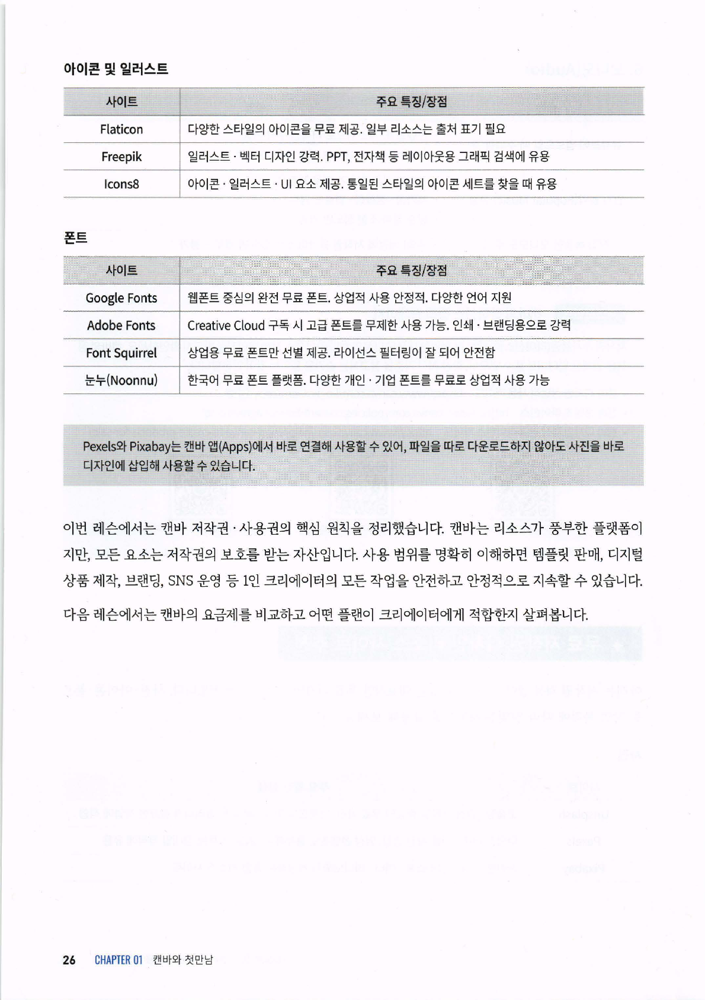

아이콘및일러스트

~_

트

Flaticon 다양한 스타일의 아이콘을 무료 제공. 일부 리소스는 줄처 표기 필요 Freepik lcons8

일러스트 · 벡터 디자인 강력. PPT, 전자책 등 레이아웃용 그래픽 검색에 유용 아이콘 · 일러스트 · UI 요소 제공. 통일된 스타일의 아이콘 세트를 잦을 때 유용

폰트

###### Google Fonts Adobe Fonts

웹폰트 중심의 완전 무료 폰트. 상업적 사용 안정적. 다양한 언어 지원

Creative Cloud 구독 시 고급 폰트를 무제한 사용 가능. 인쇄 · 브랜딩용으로 강력 Font Squirrel 상업용 무료 폰트만 선별 제공. 라이선스 필터링이 잘 되어 안전함

눈누(Noonnu) 한국어 무료 폰트 플랫폼. 다양한 개인 · 기업 폰트를 무료로 상업적 사용 가능

수

이번 레슨에서는 캔바 저작권 · 사용권의 핵심 원칙을 정리했습니다. 캔바는 리소스가 풍부한 플랫폼이 지만, 모든 요소는 저작권의 보호를 받는 자산입니댜 사용 범위를 명확히 이해하면 템플릿 판매, 디지털 상품 제작, 브랜딩, SNS 운영 등 1인 크리에이터의 모든 작업을 안전하고 안정적으로 지속할 수 있습니다.

다움 레슨에서는 캔바의 요금제를 비교하고 어떤 플랜이 크리에이터에게 적합한지 살펴봅니다.

26 캔바와 첫만남

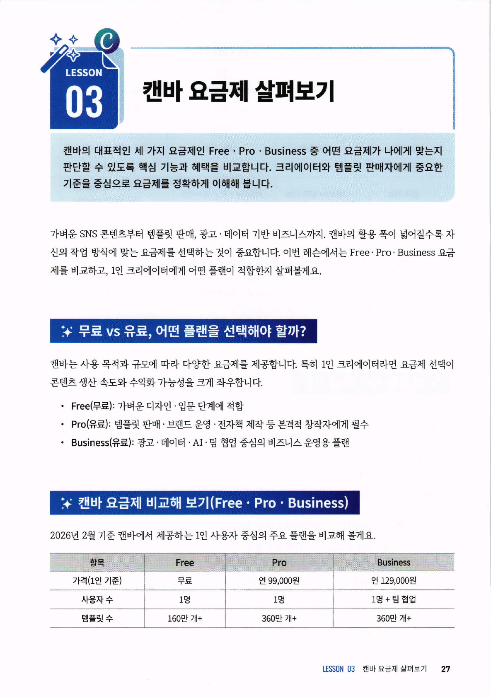

###### 캔바요금재살펴보기

###### 세 가지 나에게

핵심 기능과 크리에이터와 중요한 정확하게

가벼운 SNS 콘텐츠부터 템플릿 판매, 광고 · 데이터 기반 비즈니스까지. 캔바의 활용 폭이 넓어질수록 자

###### 신의 작업 방식에 맞는 요금제를 선택하는 것이 중요합니댜 이번 레슨에서는 Free · Pro · Business 요금

제를 비교하고, 1인 크리에이터에게 어떤 플랜이 적합한지 살펴볼게요.

###### | |

캔바는 사용 목적과 규모에 따라 다양한 요금제를 제공합니다. 특히 1인 크리에이터라면 요금제 선택이

콘텐츠 생산 속도와 수익화 가능성을 크게 좌우합니다.

- • Free(무료)： 가벼운 디자인 · 입문 단계에 적합
- • Pro(유료)： 템플릿 판매 ·브랜드운영 ·전자책 제작등본격적 창작자에게 필수
- • Business(유료)： 광고·데이터 ·AI· 팀 협업 중심의 비즈니스운영용플랜

###### | • |

###### 2026년 2월 기준 캔바에서 제공하는 1인 사용자 중심의 주요 플렌을 비교해 볼게요.

| | | | |
|---|---|---|---|
|가격(1인 기준)|무료|연 99,000원|연 129,000원|
|사용자수|1명|1명|1명 + 팀 협업|
|템플릿수|160만 개+|360만개+|360만 개+|

LESSON 03 캔바 요금제 살펴보기 27

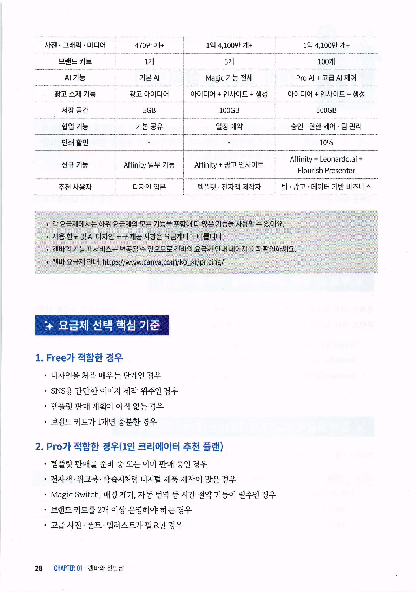

사진·그래픽·미디어 470만 개+ 1억 4,100만 개+ 1억 4,100만개+

브랜드키트 1개 5개 100개

Al 기능 기본 Al Magic 기능전제 ProAl +고급 Al 제어

광고소재기능 광고아이디어 아이디어+인사이트+생성 아이디어+인사이트+생성

저장공간 5GB 100GB 500GB 협업기능 기본공유 일정예약 승인 ·권한제어 · 관리 인쇄할인 10%

Affinity + Leonardo.ai + Flourish Presenter

신규기능 Affinity 일부 기능 Affinity +광고 인사이트

주천사용자 디자인입문 템플릿·전자책제작자 팀 · 광고 · 데이터 기반비즈니스

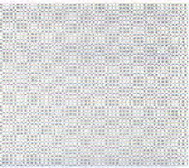

- • .
- • 수
- • :

I

- 1. Free가 적합한 경우

- • 디자인을 처음 배우는 단계인 경우
- • SNS용 간단한 이미지 제작 위주인 경우
- • 템플릿 판매 계획이 아직 없는 경우
- • 브렌드키트가 1개면충분한경우

- 2. Pro가 적합한 크리에이터 주천

- • 템플릿 판매를준비 중또는이미 판매중인경우
- • 전자책 · 워크북· 학습지처럼디지털제품제작이많은경우
- • Magic Switch, 배경 제거, 자동 번역 등 시간 절약 기능이 필수인 경우
- • 브렌드 키트를 2개 이상 운영해야 하는 경우
- • 고급사진·폰트· 일러스트가필요한경우

28 CHAPTER 01 캔바와첫만남

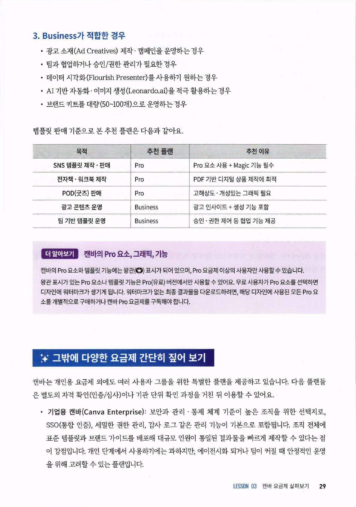

###### 3. Business가 적합한 경우

- • 광고 소재(Ad Creatives) 제작· 캠페인을 운영하는 경우
- • 팀과협업하거나승인1권한관리가필요한경우
- • 데이터 시각화(Flourish Presenter)를 사용하기 원하는 경우
- • AI 기반 자동화· 이미지 생성 (Leonardo.ai)을 적극 활용하는 경우
- • 브랜드 키트를 대량(50~100개)으로 운영하는 경우

템플릿 판매 기준으로 본 추천 플랜은 다음과 같아요.

I

|I| | |
|---|---|---|
|SNS 템플릿 제작 · 판매|Pro|Pro 요소 사용 + Magic 기능 필수|
|전자책·워크북제작|Pro|PDF 기반 디지털 상품 제작에 죄적|
|POD(굿즈) 판매|Pro|고해상도 · 개성있는 그래픽 필요|
|광고콘텐츠운영|Business|광고 인사이트 + 생성 기능 포함|
|팀 기반템플릿운영|Business|승인 · 권한제어 등협업 기능제공|

- Pro

캔바의 Pro요소와 기능에는 표시가 있으며, Pro요금제 이상의 사용자만 수 왕관 표시가 있는 Pro 요소나 기능은 Pro(유료) 버전에서만 수 있어요. 무료 사용자가 Pro 요소를 디자인에 워터마크가 생기게 됩니다. 워터마크가 없는 사용된 모든 Pro 요 소를 Pro 구독해야합니다.

###### | ;

캔바는 개인용 요금제 외에도 여러 사용자 그룹을 위한 특별한 플랜울 제공하고 있습니다. 다음 플랜들

은 별도의 자격 확인(인증1심사)이나 기관 단위 확인 과정을 거친 뒤 이용할 수 있어요.

- • 기업용 캔바(Canva Enterprise): 보안과 관리 · 통제 체계 기준이 높은 조직을 위한 선택지로, SSO(통합 인증)， 세밀한 권한 관리, 감사 로그 같은 관리 기능이 기본으로 포함됩니댜 조직 전체에 표준 템플릿과 브랜드 가이드를 배포해 대규모 인원이 통일된 결과물을 삐르게 제작할 수 있다는 점 이 강점입니다. 개인 단계에서 사용하기에는 과하지만, 에이전시화 되거나 팀이 커질 때 안정적인 운영 울 위해 고려할 수 있는 플랜입니다.

LESSON 03 캔바 요금제 살펴보기 29

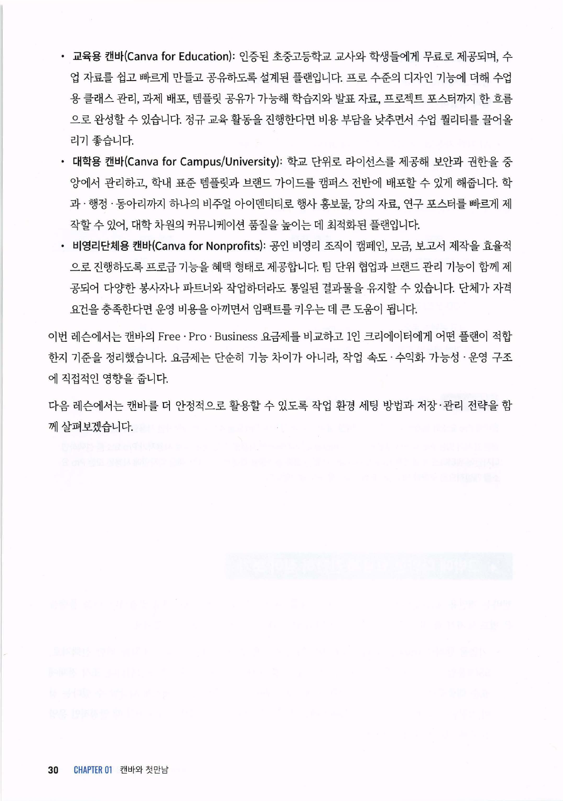

- • 교육용 캔바(Canva for Education): 인증된 초중고등학교 교사와 학생들에게 무료로 제공되며, 수 업 자료를 쉽고 빠르게 만들고 공유하도록 설계된 플랜입니다. 프로 수준의 디자인 기능에 더해 수업 용 클래스 관리, 과제 배포, 템플릿 공유가 가능해 학습지와 발표 자료, 프로젝트 포스터까지 한 흐름 으로 완성할 수 있습니다. 정규 교육 활동을 진행한다면 비용 부담을 낮추면서 수업 퀄리티를 끌어올 리기 좋습니다.
- • 대학용 캔바(Canva for Campus/University): 학교 단위로 라이선스를 제공해 보안과 권한을 중 앙에서 관리하고, 학내 표준 템플릿과 브랜드 가이드를 캠퍼스 전반에 배포할 수 있게 해줍니다. 학 과 · 행정 · 동아리까지 하나의 비주얼 아이덴티티로 행사 홍보물, 강의 자료, 연구 포스터를 빠르게 제 작할 수 있어, 대학 차원의 커뮤니케이션 품질을 높이는 데 최적화된 플랜입니다.
- • 비영리단제용 캔바(Canva for Nonprofits): 공인 비영리 조직이 캠페인, 모금, 보고서 제작을 효율적 으로 진행하도록 프로급 기능을 혜택 형태로 제공합니다. 팀 단위 협업과 브랜드 관리 기능이 함께 제 공되어 다양한 봉사자나 파트너와 작업하더라도 통일된 결과물을 유지할 수 있습니다. 단체가 자격 요건을충족한다면 운영 비용을아끼면서 임팩트를키우는데 큰도움이 됩니다.

이번 레슨에서는 캔바의 Free · Pro · Business 요금제를 비교하고 1인 크리에이터에게 어떤 플랜이 적합

한지 기준을 정리했습니댜 요금제는 단순히 기능 차이가 아니라, 작업 속도 · 수익화 가능성 · 운영 구조 에 직접적인 영향을 줍니다.

다움레슨에서는캔바를더 안정적으로활용할수있도록작업 환경 세팅 방법과저장 · 관리 전략을함

께살펴보겠습니댜

30 CHAPTER 01 캔바와 첫만남

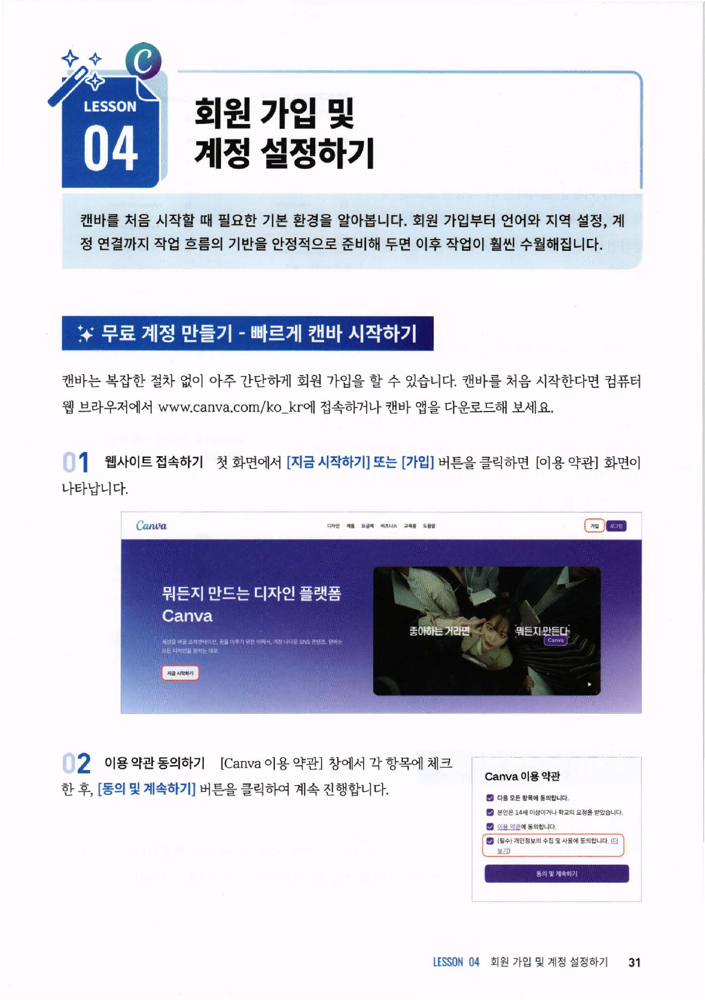

###### 회원가입및 계정설정하기

캔바를 처음 시작할 때 기본 알아봅니다. 지역 설정, 계

정

###### | - 바 |

캔바는 복잡한 절차 없이 아주 간단하게 회원 가입을 할 수 있습니다. 캔바를 처음 시작한다면 컴퓨터

웹 브라우저에서 www.canva.com/ko_kr에 접속하거나 캔바 앱을 다운로드해 보세요.

###### 1 웹사이트접속하기 첫화면에서 [지금시작하기]또는[가입] 버튼을클릭하면 [이용약관] 화면이

나타납니댜

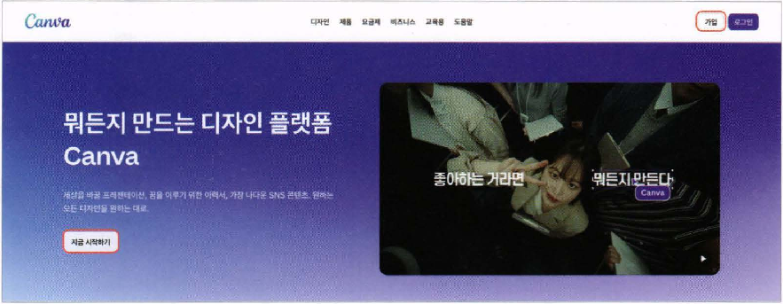

Gm" 디자연 "'. .글"' .,죠니스 교.틀 도"

###### 2 이용약관동의하기 [Canva이용약관] 창에서 각항목에 체크

Canva 이용약관

한 후, ［ 계속하기] 버튼을 클릭하여 계속 진행합니다.

O 다움모든항목에등의합니다. O 본인은 14세 이싱이거나학교의 요청을받았습니다. O 이유 약관에등의압니다

-

(필수) 개인정보의 수집 및 사용에 동의합니다. 터 부간)

LESSON 04 회원 가입 및 계정 설정하기 31

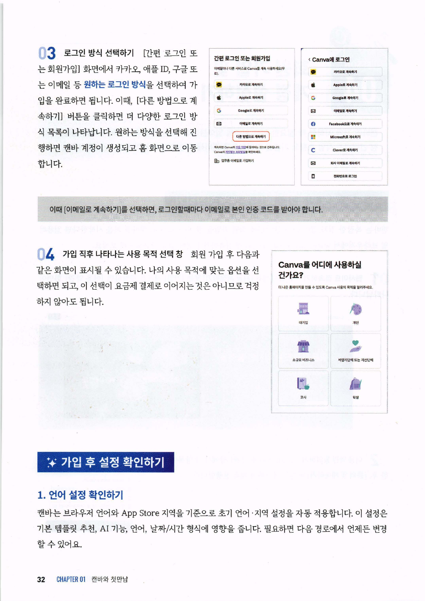

###### 3

###### 三

로그인 방식 선택하기 [간편 로그인 또

간편 로그인 또는

<C타wa에로그인

###### 다른 C.nva•게*

는회원가입] 화면에서 카카오,애플 ID, 구글또

••

皇)•

••

는 이메일 등 원하는 로그인 방식을 선택하여 가 입을 완료하면 됩니다. 이때, ［다른 방법으로 계 속하기] 버튼을 클릭하면 더 다양한 로그인 방

G

Apple

G

E

Goo&le로

E

0

o"＇일로게*하기

Facobo어간므更 게속하기

식 목록이 나타납니다. 원하는방식을선택해 진

컵

###### ( 다른mi의며"m )

MIcm"h로 계書하’l

###### c

행하면 캔바 계정이 생성되고 홈 화면으로 이동 합니댜

저書확 익찌 것으 。빼 기언더부서라慣일••언＂세요

CI.vr로게속하기

駐 업ffOI떼일로가입혀기

E3

화사 OI빼일로 게속확,,

g

###### 4

가입 직후 나타나는 사용 목적 선택 창 회원가입 후다음과

Canva를

같은 화면이 표시될 수 있습니다. 나의 사용 목적에 맞는 옵션을 선

건?K요?

택하면 되고, 이 선택이 요금제 결제로이어지는것은아니므로걱정

더 나은 홑 민들 수 있도~ c라wa 사용의 욕적을 .

하지 않아도됩니댜

대기업 게인.~

또는 자선단체

교시 학생

###### | 후 |

###### 1. 설정확인하기

캔바는 브라우저 언어와 App Store 지역을 기준으로 초기 언어 지역 설정을 자동 적용합니다. 이 설정은

###### 기본 템플릿 추천, AI 기능, 언어, 날짜/시간 형식에 영향을 줍니다. 필요하면 다음 경로에서 언제든 변경

할수있어요.

32 CHAPTER 01 캔바와첫만남

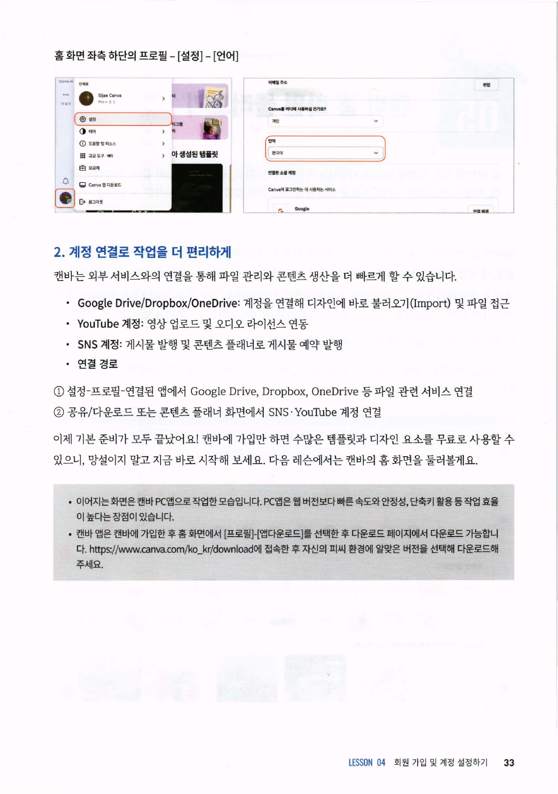

홈 화면 좌측 하단의 프로필 - [설정] - ［언어]

g.

ii

###### v 터 않

g

어"11 주소

###### 뜨

C

###### g0

###### 뇨

게언

) 리

/\

g

二

iii

二

g

###### 학

>

i

포

1

旺

CnV1에 ·그언騎는 대 서바스

＿

###### 연겁...—

r. Goo&I•

###### 2. 계정 작업을 더

캔바는 외부 서비스와의 연결을 통해 파일 관리와 콘텐츠 생산을 더 빠르게 할 수 있습니다.

- • Google Drive/Dropbox/OneDrive: 계정을 연결해 디자인에 바로 불러오기(Import) 및 파일 접근
- • YouTube 계장 영상 업로드 및 오디오 라이선스 연동
- • SNS 계장 게시물 발행 및 콘텐츠 플래너로 게시물 예약 발행
- • 연결경로

® 설정_프로필-연결된 앱에서 Google Drive, Dropbox, OneDrive 등 파일 관련 서비스 연결 ® 공유/다운로드 또는 콘텐츠 플래너 화면에서 SNS·YouTube 계정 연결

이제 기본 준비가 모두 끝났어요! 캔바에 가입만 하면 수많은 템플릿과 디자인 요소를 무료로 사용할 수 있으니, 망설이지 말고 지금 바로 시작해 보세요. 다음 레슨에서는 캔바의 홈 화면을 둘러볼게요.

•

이

• 앱은 캔바에 홈

다. 후

LESSON 04 회원 가입 잊 계정 설정하기 33

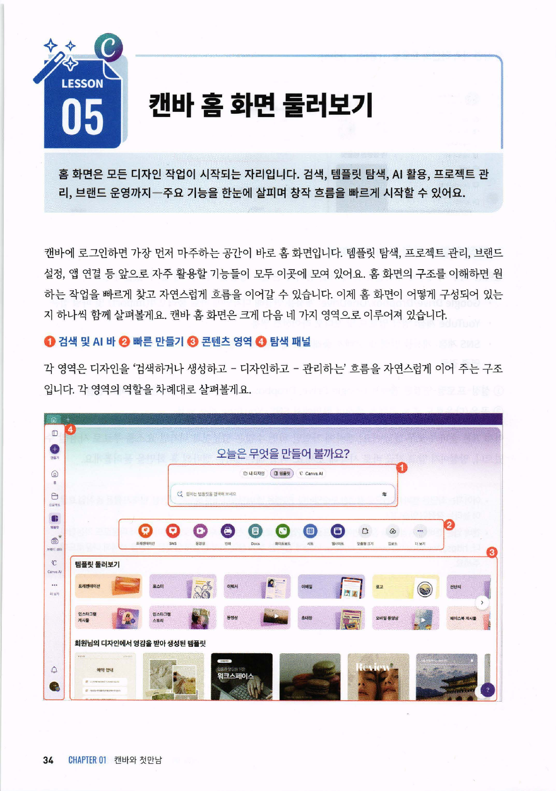

###### 캔바홀화면틀러보기

디자인 자리입니다. 검색, Al 리,

캔바에 로그인하면 가장 먼저 마주하는 공간이 바로 홈 화면입니다. 템플릿 탐색, 프로젝트 관리, 브렌드 설정, 앱 연결 등 앞으로 자주 활용할 기능들이 모두 이곳에 모여 있어요. 홈 화면의 구조를 이해하면 원 하는 작업을 빠르게 찾고 자연스럽게 흐름을 이어갈 수 있습니댜 이제 홈 화면이 어떻게 구성되어 있는

지 하나씩 함께 살펴볼게요. 캔바 홈 화면은 크게 다음 네 가지 영역으로 이루어져 있습니다.

###### O 검색 및 Al 바 O 빠른 만들기 O 콘텐츠 영역 O 탐색 패널

각 영역은 디자인을 ‘검색하거나 생성하고 - 디자인하고 - 관리하는' 흐름을 자연스럽게 이어 주는 구조

Eml—

입니다. 각 영역의 역할을 차례대로 살펴볼게요.

O t

®•

###### `

0 내디자인 C C&nvaAI

혹

Q 원11는g!I럿을겁색빠 보세요

은)

../

###### o i

###### o i 0SNS

o g 0}

###### o g Oi

..뺄•

###### ...1;

###### 。

###### EI

###### G

~

슌*

寶•볼크기

업료드 더보기

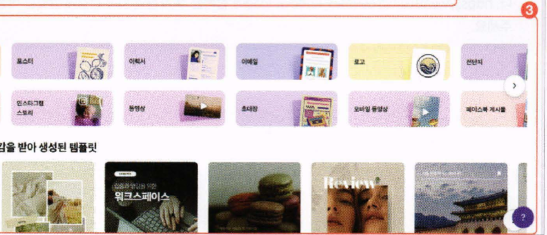

브뺀드 혼며

·C

###### 척

###### @

C"

‘’

..

01핵서

皇고

미 .,,

게시. 스토리

회원님의 디자인에서 받아 생성된 템플릿

。

###### ·It---fiI

·

34 CHAPTER 01 캔바와 첫만남

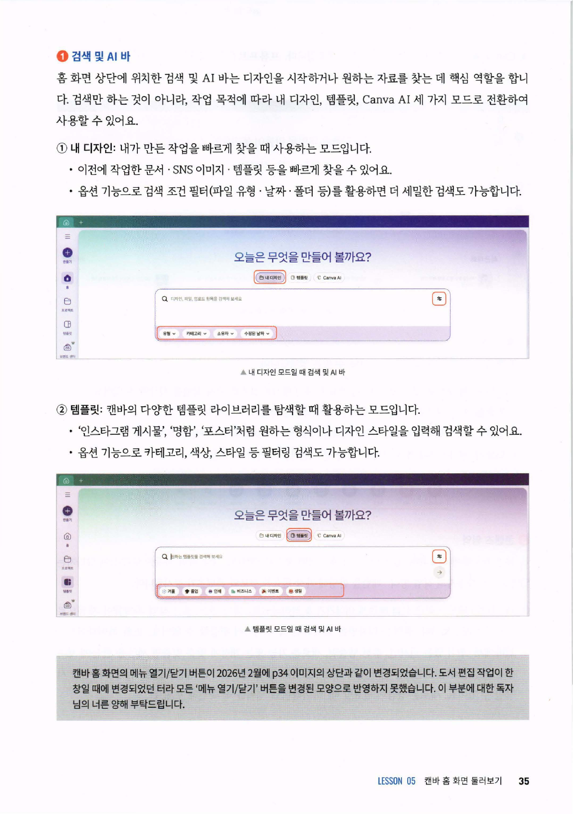

###### 검색 및 Al 바

홈 화면 상단에 위치한 검색 및 AI 바는 디자인을 시작하거나 원하는 자료를 찾는 데 핵심 역할을 합니 다. 검색만 하는 것이 아니라, 작업 목적에 따라 내 디자인, 템플릿, Canva AI 세 가지 모드로 전환하여

사용할수있어요.

® 내 디자인: 내가 만든 작업을 빠르게 찾을 때 사용하는 모드입니댜

- • 이전에 작업한 문서 · SNS 이미지 · 템플릿 등을 빠르게 찾을 수 있어요.
- • 옵션 기능으로 검색 조건 필터 (파일 유형 · 날짜 · 폴더 등)를 활용하면 더 세밀한 검색도 가능합니다.

###### O

@ 야를밋 {:CanvaAl

O ‘ B

###### ....

a. 미지인리입,업으’)""뻬보" 。

CB

"엇 - 유혈 v 멘마 *的 v 뀝던날짜 v

®

~ 내 디자인 모드일 때 검색 및 Al 바

® 템플릿: 캔바의 다양한 템플릿 라이브러리를 탐색할 때 활용하는 모드입니다.

- • ‘인스타그램 게시물’, ‘명함', ‘포스터'처럼 원하는 형식이나 디자인 스타일을 입력해 검색할 수 있어요.
- • 옵션 기능으로 카테고리, 색상, 스타일 등 필터링 검색도 가능합니다.

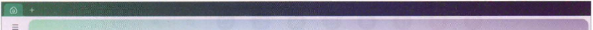

O i @‘

은 만들어 볼까요?

e,내디畑 C CanvaAI

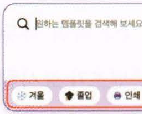

###### ....

e) 。

➔

鬱

잇 • • 틀 언뻬 • 비츠니스 » 년皇 · 생일 @..

• • 뺀

~ 템플릿모드일 때 검색 및 Al 바

###### 홈 화면의

캔바 홈 화면 둘러보기 35

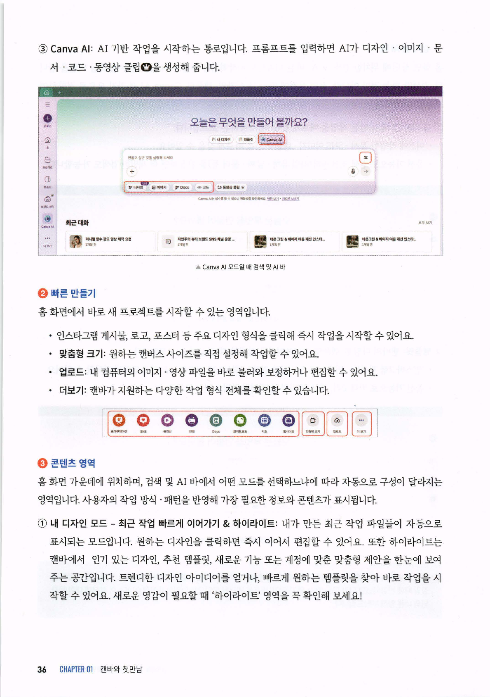

@ Canva Al: AI 기반 작업을 시작하는 통로입니댜 프롬프트를 입력하면 AI가 디자인 · 이미지 · 문

서 · 코드 · 동영상 클립CHt 생성해 줍니댜

###### .nn

@ ‘ O내며언 (B템틀밋

e i

。

실은 것을 일명뻬 보세요

+

9 ➔

@

""*'

`q자연 컬' Docs 아» 코드 ...

....

CN는 ti♦•• · 미C빽 Y내기

모두보기

C·^'

###### ...

E) SNS 운뺄 ~

네온 빼어지어.11t! ~

내온그던 • 여를빼션 -

꽤딱

"＂'론

l재혈진

1게혈론

"＂'훈

,，.기

.& Canva AI 모드일 때 검색 및 Al 바

###### 빠른만믈7

홈 화면에서 바로 새 프로젝트를 시작할 수 있는 영역입니다.

• 인스타그램 게시물, 로고, 포스터 등 주요 디자인 형식을 클릭해 즉시 작업을 시작할 수 있어요.

맞즘형 크기: 원하는 캔버스 사이즈를 직접 설정해 작업할 수 있어요.

업로드: 내 컴퓨터의 이미지 · 영상 파일을 바로 불러와 보정하거나 편집할 수 있어요. 더보기: 캔바가지원하는다양한작업 형식 전체를확인할수있습니다.

o g

###### o _

o g 0g

o

e ~

i 。꼬 인]::二

¢`

—

O 콘텐츠영역 홈 화면 가운데에 위치하며, 검색 및 AI 바에서 어떤 모드를 선택하느냐에 따라 자동으로 구성이 달라지는

영역입니다. 사용자의 작업 방식 ·패턴을 반영해 가장 필요한 정보와 콘텐츠가 표시됩니다. ® 내 디자인 모드 - 최근 작업 빠르게 이어가기 & 하이라이트: 내가 만든 최근 작업 파일들이 자동으로

표시되는 모드입니다. 원하는 디자인을 클릭하면 즉시 이어서 편집할 수 있어요. 또한 하이라이트는 캔바에서 인기 있는 디자인, 추천 템플릿, 새로운 기능 또는 계정에 맞춘 맞춤형 제안을 한눈에 보여 주는 공간입니다. 트렌디한 디자인 아이디어를 얻거나, 빠르게 원하는 템플릿을 찾아 바로 작업을 시 작할 수 있어요. 새로운 영감이 필요할 때 ‘하이라이트’ 영역을 꼭 확인해 보세요!

36 캔바와첫만남

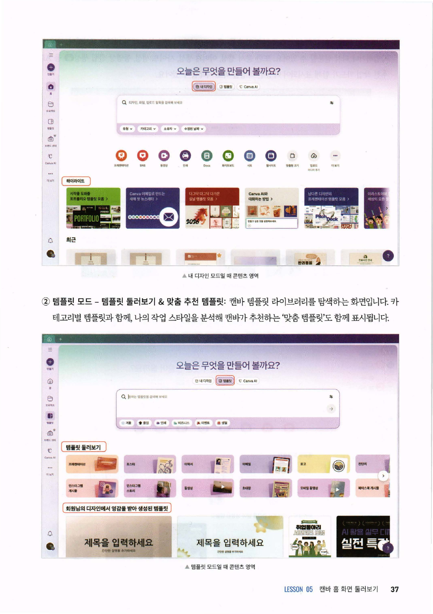

###### 。

던f기

"‘밋 C Onv·AI

•

a. ti~,파일,입탸:mI걸"'민4l!

*

은i

·量빼I

CB

••*

유혈 v 카대고리 v 소유지 v 수칭딘날빼 v

숟*

모를드안어

I ·\'.!

###### oo o o o o oo 。 。

-··

0x. .어皇鼠도 시ll ll 1f··크기 업量 여JUI

Cu

묘 e SN "일 언嶋

이m )

드

| ［세검',’ 만'\

>

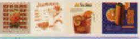

###### I...........◄•

- *

O

###### ·요... .

... 내 디자인 모드일 때 콘텐츠 영역

® 템플릿 모드 - 템플릿 둘러보기 & 맞춤 주천 템플릿: 캔바 템플릿 라이브러리를 탐색하는화면입니다. 카

테고리별 템플릿과 함께, 나의 작업 스타일을 분석해 캔바가 추천하는 ‘맞춤 템플릿'도 함께 표시됩니다.

O

@·

e,내디자언 'C CanvaAI

r

w

e

Q 距I는 뗄"II 겉색..브세R

’

f.

... 거. • @언뻬 •바츠니스 »아던. •샐혈

鬱

l

낱

훈)

••드··

·C 들러보기 )

‘ . 어"

皇

q"

언스

인 타::,.

모

1스.께All

皇'"'

틀.`

“시.

o.

받아 템플릿 )

一

S

C倉""....

~ 템플릿 모드일 때 콘텐츠 영역

LESSON 05 캔바 홈 화면 둘러보기 37

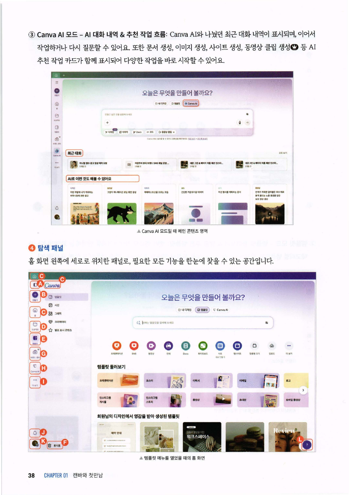

@ Canva Al 모드 - Al 대화 내역 & 주전 작업 흐름: Canva AI와 나눴던 최근 대화 내역이 표시되며, 이어서 작업하거나 다시 질문할 수 있어요. 또한 문서 생성, 이미지 생성, 사이트 생성, 동영상 클립 생성O 등 Al 추천 작업 카드가함께표시되어 다양한작업을바로시작할수있어요.

。

®•

e내玉 1JI”

0gCB"

근 살 !..... 볼.... 零

9 ➔

+

"'맥…～지 ,.,1lo<S

"표 O ＊

©W C`W•“.•••••••니.......,..억’`기• ,'I'I

###### :” 로

묘•기

•·....d안스q_

내그먼•빼 이• • 8 업스타떠•

l\` 떠• 틀리•틀도

""“널흩`-

""'·

###### 〔

###### ."

자선.....,..Ole...,

... 어

나

훌수 ...

간단연"‘量야타

고를어 "'"d.딜

＿오

틀게.드는 ....결1달은

빼．시 !!tiI고

###### ....""

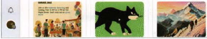

_. Canva AI 모드일 때 메인 콘텐츠 영역

###### 탐색패널

홈 화면 왼쪽에 세로로 위치한 패널로, 필요한 모든 기능을 한눈에 찾을 수 있는 공간입니다.

g《

간

” 밋

###### 오늘은 만들어

畑겨

포꿉:

e,내디자연 @ c cmv"'

gwll

q k며~Ill밋을겁따빼보세9

###### *

###### oo o o o o o o 。

。

인대 Ex. ..,.” 시皇 ·사아皇 엿촐＂크기

표쉐안마어산 SNS 를일싱

업" 더 嵐기

섀量던1기

고

###### 플

###### 어"서

프대뺀때•I신

어

###### ·고

.

·옐싱

龜대강

모야 •

“시1

###### 회원님의 받아

예’'안

... 템플릿 메뉴를 열었율 때의 홍 화면

###### 38 CHAPTER 01 캔바와 첫만남

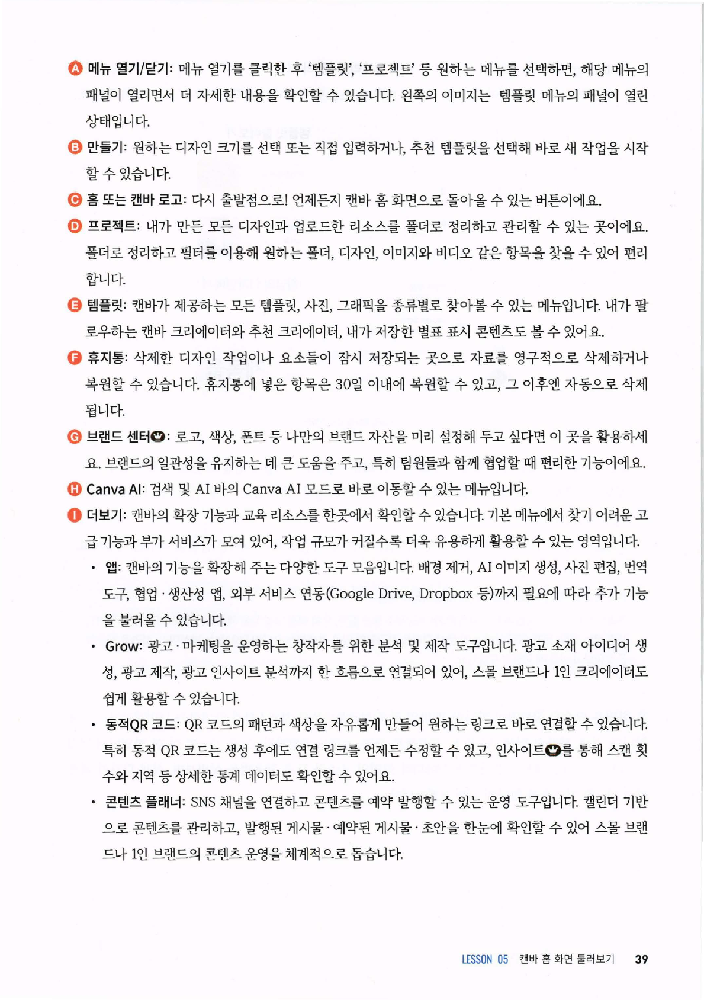

###### O 메뉴 열기/닫기: 메뉴 열기를 클릭한 후 템플릿', ‘프로젝트’ 등 원하는 메뉴를 선택하면, 해당 메뉴의

패널이 열리면서 더 자세한 내용을 확인할 수 있습니다. 왼쪽의 이미지는

템플릿 메뉴의 패널이 열린

상태입니댜

###### O 만들기: 원하는 디자인 크기를 선택 또는 직접 입력하거나, 추천 템플릿을 선택해 바로 새 작업을 시작

할수있습니다.

###### O 흠 또는 캔바 로고: 다시 출발점으로! 언제든지 캔바 홈 화면으로 돌아올 수 있는 버튼이에요. O 프로젝트: 내가 만든 모든 디자인과 업로드한 리소스를 폴더로 정리하고 관리할 수 있는 곳이에요.

폴더로 정리하고 필터를 이용해 원하는 폴더, 디자인, 이미지와 비디오 같은 항목을 찾을 수 있어 편리 합니다.

###### e 템플릿: 캔바가제공하는모든 템플릿, 사진, 그래픽을종류별로 찾아볼수 있는 메뉴입니다. 내가팔

로우하는 캔바 크리에이터와 추천 크리에이터, 내가 저장한 별표 표시 콘텐츠도 볼 수 있어요.

O 휴지통: 삭제한 디자인 작업이나 요소들이 잠시 저장되는 곳으로 자료를 영구적으로 삭제하거나

복원할 수 있습니다. 휴지통에 넣은 항목은 30일 이내에 복원할 수 있고, 그 이후엔 자동으로 삭제

됩니다.

O 브랜드 센터O: 로고, 색상, 폰트 등 나만의 브랜드 자산을 미리 설정해 두고 싶다면 이 곳을 활용하세

요. 브랜드의 일관성을 유지하는 데 큰 도움을 주고, 특히 팀원들과 함께 협업할 때 편리한 기능이에요.

«D Canva Al: 검색 및 AI 바의 Canva AI 모드로 바로 이동할 수 있는 메뉴입니댜 O 더보기: 캔바의 확장기능과교육리소스를한곳에서 확인할수있습니다.기본메뉴에서 찾기 어려운고

급 기능과 부가 서비스가 모여 있어, 작업 규모가 커질수록 더욱 유용하게 활용할 수 있는 영역입니다.

앱 캔바의 기능을확장해 주는다양한도구모음입니다. 배경 제거, AI 이미지 생성, 사진 편집, 번역 도구, 협업 ·생산성 앱, 외부 서바스 연동(Google Drive, Dropbox 등)까지 필요에 따라 추가 기능

을불러올수있습니댜

Grow: 광고 · 마케팅을 운영하는 창작자를 위한 분석 및 제작 도구입니다. 광고 소재 아이디어 생 성, 광고 제작, 광고 인사이트 분석까지 한 흐름으로 연결되어 있어, 스몰 브랜드나 1인 크리에이터도

쉽게 활용할 수 있습니다.

동적QR 코드: QR 코드의 패턴과 색상을 자유롭게 만들어 원하는 링크로 바로 연결할 수 있습니다. 특히 동적 QR 코드는 생성 후에도 연결 링크를 언제든 수정할 수 있고, 인사이트CH} 통해 스캔 횟

수와지역 등상세한통계 데이터도확인할수있어요.

콘텐츠 플래너 : SNS 채널을 연결하고 콘텐츠를 예약 발행할 수 있는 운영 도구입니다. 캘린더 기반 으로 콘텐츠를 관리하고, 발행된 계시물 · 예약된 게시물 ·초안을 한눈에 확인할 수 있어 스몰 브랜

드나 1인 브랜드의 콘텐츠 운영을 체계적으로 돕습니다.

LESSON 05 캔바 홈화면 둘러보기 39

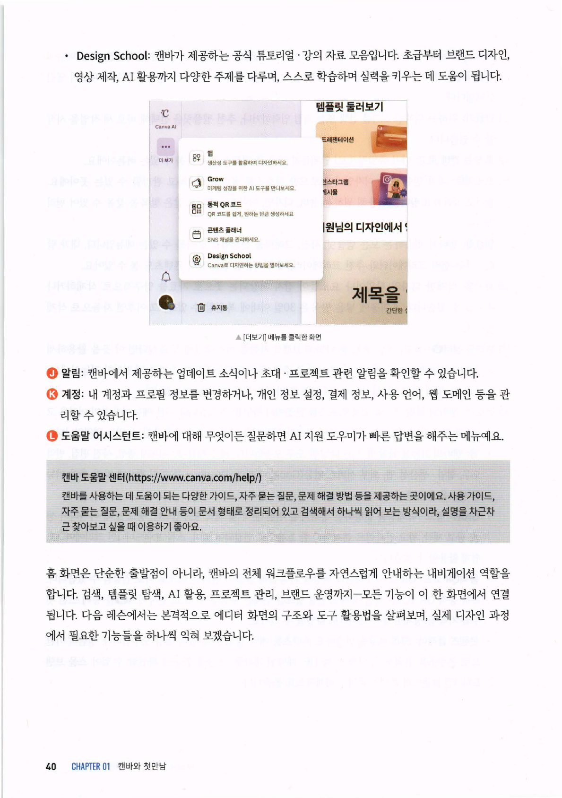

• Design School: 캔바가 제공하는 공식 튜토리얼 ·강의 자료 모음입니다. 초급부터 브랜드 디자인, 영상 제작, AI 활용까지 다양한 주제를 다루며, 스스로 학습하며 실력을 키우는 데 도움이 됩니다.

###### ·'C

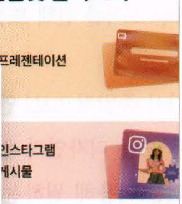

Canva At

더보기 8~ 엡

생산싱 도구틀

3 Grow

스타그 텁

Al .

따3 동적 QR 코드

□IIi QR 원하는 생성61세요

른 SNS 래견리하세요너 .

® Designschool

Canva.l탑 디자인하는

。

지통

~ [더보기] 메뉴를 클릭한화면

O 알림: 캔바에서 제공하는 업데이트 소식이나 초대 ·프로젝트 관련 알림을 확인할 수 있습니다. O 계장 내 계정과 프로필 정보를 변경하거나, 개인 정보 설정, 결제 정보, 사용 언어, 웹 도메인 등을 관

리할 수 있습니다.

O 도움말 어시스턴트: 캔바에 대해 무엇이든 질문하면 AI 지원 도우미가빠른 답변을 해주는 메뉴예요.

캔바

를 사용하는 데 ,

묻는 , 문제

근 때

홈 화면은 단순한 출발점이 아니라, 캔바의 전체 워크플로우를 자연스럽게 안내하는 내비게이션 역할을

합니다. 검색, 템플릿 탐색, AI 활용, 프로젝트 관리, 브렌드 운영까지―모든 기능이 이 한 화면에서 연결

됩니댜 다음 레슨에서는 본격적으로 에디터 화면의 구조와 도구 활용법을 살펴보며, 실제 디자인 과정

에서 필요한 기능들을 하나씩 익혀 보겠습니다.

40 CHAPTER 01 캔바와 첫만남

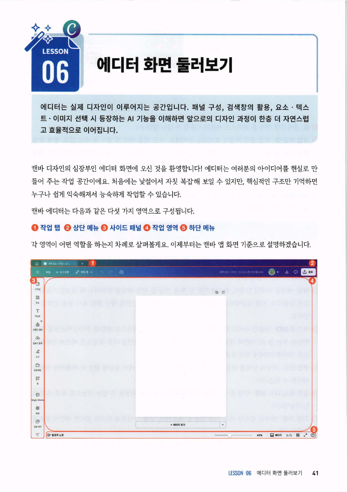

###### 에디터화면톨러보기

에디터는 구성, 활용, 요소 · 텍스 트 • 이미지 선택 시 Al 기능을 이해하면 디자인 과정이 더

고 이어집니다.

캔바 디자인의 심장부인 에디터 화면에 오신 것을 환영합니다! 에디터는 여러분의 아이디어를 현실로 만 들어 주는 작업 공간이에요. 처음에는 낯설어서 자칫 복잡해 보일 수 있지만, 핵심적인 구조만 기억하면 누구나 쉽게 익숙해져서 능숙하게 작업할 수 있습니다.

캔바 에디터는 다음과 같은 다섯 가지 영역으로 구성됩니다.

###### 작업 탭 상단메뉴 사이드패널 O 작업 하단메뉴

각 영역이 어떤 역할을 하는지 차례로 살펴볼게요. 이제부터는 캔바 앱 화면 기준으로 설명하겠습니다.

- 。 -_ 1

q"" I © C

認

홑

###### T

빽스.

낱’

###### .......

@

。

·뜨•.

###### ‘

###### ......el

8?

###### •

十..........o

뻬•

###### 곤 노

###### /g

+

J 45% 닳빼01지 1/1 88 ••

LESSON 06 에디터 화연 둘러보기 41

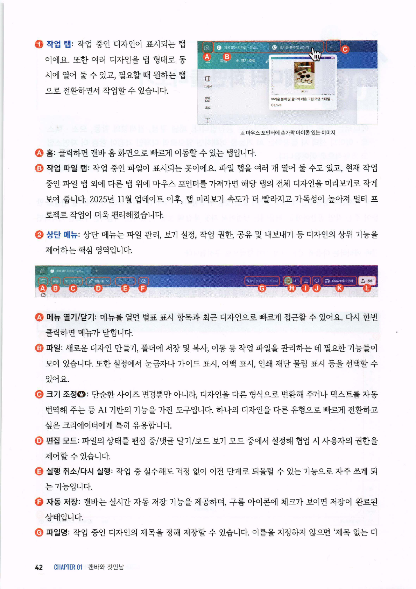

O 작업 텝 작업 중인 디자인이 표시되는 탭

이에요. 또한 여러 디자인을 탭 형태로 동

###### 시에 열어 둘수있고, 필요할때 원하는탭

###### .

으로 전환하면서 작업할 수 있습니다. OAco

..

브라운 틀텍 및 글드와 내온그민 모던 _

a

Canva

###### T

... 마우스 포인터에 손가락 아이콘 있는 이미지

O 홈 클릭하면 캔바 홈 화면으로 빠르게 이동할 수 있는 탭입니다. O 작업 파일 텝 작업 중인 파일이 표시되는 곳이에요. 파일 탭을 여러 개 열어 둘 수도 있고, 현재 작업

중인 파일 탭 외에 다른 탭 위에 마우스 포인터를 가져가면 해당 탭의 전체 디자인을 미리보기로 작게

###### 보여 줍니댜 2025년 11월 업데이트 이후, 탭 미리보기 속도가 더 빨라지고 가독성이 높아져 멀티 프

로젝트 작업이 더욱 편리해졌습니다.

O 상단 메뉴: 상단 메뉴는 파일 관리, 보기 설정, 작업 권한, 공유 및 내보내기 등 디자인의 상위 기능을

제어하는 핵심 영역입니댜

###### 'e '

·. :

###### .. a -... ...._I '

O 메뉴 열기/닫기: 메뉴를 열면 별표 표시 항목과 최근 디자인으로 빠르게 접근할 수 있어요. 다시 한번

클릭하면 메뉴가 닫힙니다.

O 파일: 새로운 디자인 만들기, 폴더에 저장 및 복사, 이동 등 작업 파일을 관리하는 데 필요한 기능들이

모여 있습니댜 또한 설정에서 눈금자나 가이드 표시, 여백 표시, 인쇄 재단 물림 표시 등을 선택할 수 있어요.

###### O 크기 조정O: 단순한 사이즈 변경뿐만 아니라, 디자인을 다른 형식으로 변환해 주거나 텍스트롤 자동

번역해 주는 등 AI 기반의 기능을 가진 도구입니다. 하나의 디자인을 다른 유형으로 빠르게 전환하고

싶은 크리에이터에게 특히 유용합니다.

###### O 편집 모드: 파일의 상태를 편집 중/댓글 달기/보드 보기 모드 중에서 설정해 협업 시 사용자의 권한을

제어할수있습니댜

O 실행 쥐소/다시 실행: 작업 중 실수해도 걱정 없이 이전 단계로 되돌릴 수 있는 기능으로 자주 쓰게 되

는기능입니다.

###### 자동 저장: 캔바는 실시간 자동 저장 기능을 제공하며, 구름 아이콘에 체크가 보이면 저장이 완료된

상태입니댜

O 파일명: 작업 중인 디자인의 제목을 정해 저장할 수 있습니다. 이름을 지정하지 않으면 ‘제목 없는 디

42 CHAPTER 01 캔바와첫만남

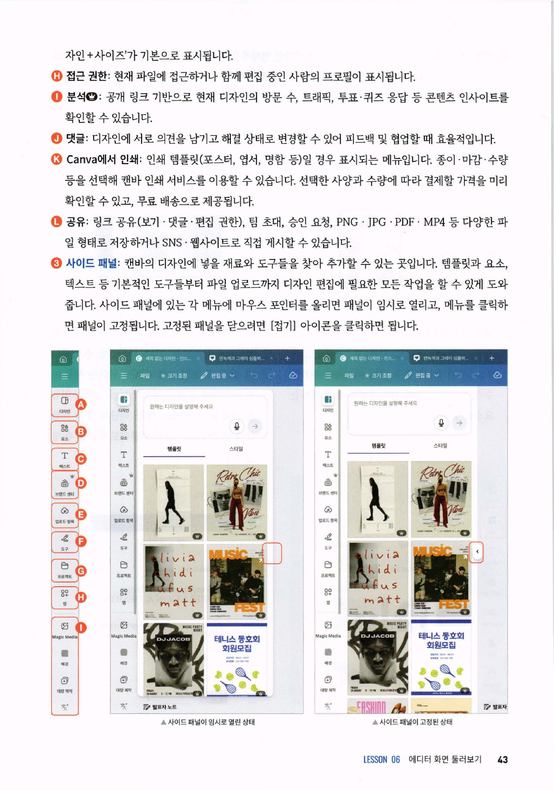

자인 +사이즈’가 기본으로 표시됩니다.

O 접근 권한: 현재 파일에 접근하거나 함께 편집 중인 사람의 프로필이 표시됩니다. O 분석O: 공개 링크기반으로현재 디자인의 방문수, 트래픽, 투표·퀴즈응답등콘텐츠 인사이트롤

확인할수있습니다.

O 댓글: 디자인에 서로 의견을 남기고해결 상태로 변경할 수 있어 피드백 및 협업할 때 효율적입니다.

0 Canva에서 인쇄: 인쇄 템플릿(포스터, 엽서, 명함 등)일 경우 표시되는 메뉴입니댜 종이 ·마감·수량

등을 선택해 캔바 인쇄 서비스를 이용할 수 있습니다. 선택한 사양과 수량에 따라 결제할 가격을 미리 확인할 수 있고, 무료 배송으로 제공됩니댜

O 공유: 링크 공유(보기 ·댓글 ·편집 권한), 팀 초대, 승인 요청, PNG · JPG · PDF · MP4 등 다양한 파

일 형태로 저장하거나 SNS · 웹사이트로 직접 게시할 수 있습니다.

- O 사이드 패널: 캔바의 디자인에 넣을 재료와 도구들을 찾아 추가할 수 있는 곳입니다. 템플릿과 요소,

텍스트 등 기본적인 도구들부터 파일 업로드까지 디자인 편집에 필요한 모든 작업을 할 수 있게 도와

줍니다. 사이드 패널에 있는 각 메뉴에 마우스 포인터를 올리면 패널이 임시로 열리고, 메뉴를 클릭하 면 패널이 고정됩니다. 고정된 패널을 닫으려면 [접기] 아이콘을 클릭하면 됩니다.

|i: 01 0

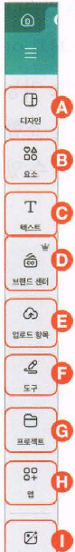

원하는디자인을설명해주세요 •= 원하는디자인을설명혜주세요

디지인

0□^0 Q ➔ g0g0 ~ ➔

브:센터 ` :L; '| 택,센터

요소 요스

템플릿 스타일 템플릿 스타일

T T

*il ·도--·= • * 1 .죠"-·

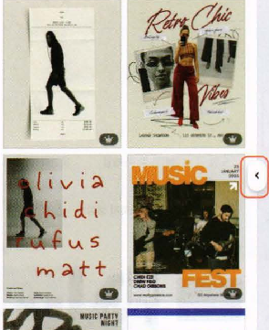

빼스트 l 빼

업요~ 틸I^르: 「 업:II혹

- aL=::__,:-·국二二·0 오

도구 -一 __i - （一기 도구

꼬꼬e I1 `k` i d` _i 꼬은빽!.!.

ooo+ - u S ooo+ 엽 l matt 엽

독노턴 °

@

###### M.，i鬱cM";.I Magi畵cMedIa 멸꿉외 鬱c ｀" "'/ 멋읊::오1

뻬겅 빼겅 뻬겁 |

q,안,| |函: 、`- 떼: 5 、\.

느 참. ”파묘 :lf.. t,'‘ -- 尹발표자

~ 사이드 패널이 임시로 열린 상태 ~ 사이드 패널이 고정된 상태

###### LESSON 06 에디터 화연 둘러보기 43

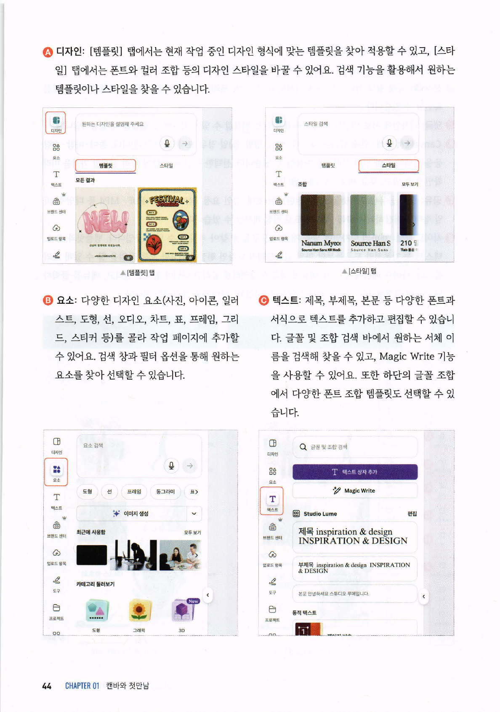

O 디자인: ［템플릿] 탭에서는 현재 작업 중인 디자인 형식에 맞는 템플릿을 찾아 적용할 수 있고, ［스타

###### 일] 탭에서는 폰트와 컬러 조합 등의 디자인 스타일을 바꿀 수 있어요. 검색 기능을 활용해서 원하는

템플릿이나 스타일을 찾을 수 있습니다.

###### :

###### : 원하는디자인을설명해주세요

###### 函

스타일검색

디자인

###### 9 ➔

욥 ➔

g8

g8

요

요소

T 템

스타

###### T

모든 결과

텍스트 모두보기

텍스트

슝*

###### *'

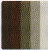

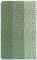

' 수

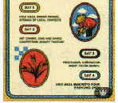

브랜드센터

브!!드

G

###### G

\

업로드일록

1 S ~

L~

三

' l S0U『C. H•n Sans 1\abH c

一"""m" O

[스타일]

~ [템플릿]탭

O 요소: 다양한 디자인 요소(사진, 아이콘, 일러

O 텍스트: 제목, 부제목, 본문 등 다양한 폰트과

서식으로 텍스트를 추가하고 편집할 수 있습니

스트, 도형, 선, 오디오, 차트, 표, 프레임, 그리

###### 드, 스티커 등)를 골라 작업 페이지에 추가할

다. 글꼴 및 조합 검색 바에서 원하는 서체 이

름을 검색해 찾을 수 있고, Magic Write 기능

수 있어요. 검색 창과 필터 옵션을 통해 원하는

요소를 찾아 선택할 수 있습니다.

을 사용할 수 있어요. 또한 하단의 글꼴 조합

###### 에서 다양한 폰트 조합 템플릿도 선택할 수 있

습니다.

「2

: 9 ➔ g8

- ·~Magic Write

Q 글꼴및조합겁색

요소검

디자인

도형 선 프 □I 표) :

요소

T

+•이미지생성 V

텍스트

{® Studio Lume

슝* @

*

###### inspiration & design INSPIRATION & DESIGN

###### 최근대사용합 W山C소

브린드센터

。

G

부 inspiration & design INSPIRATION & DES

오 오

도구

도구

본문 안녕하세요 스튜디오 루

###### 은) ri!1,1

;,,.__ ..- ii

「히 은l

...... t

텍스트

도형 그래픽 30 L국_m_

Q

###### 44 캔바와 첫만남

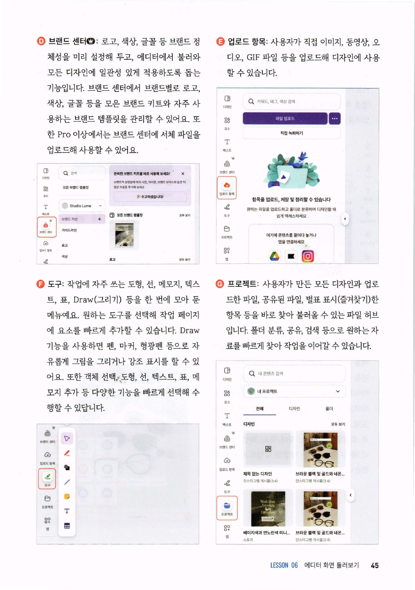

###### O 브랜드 센터0: 로고, 색상, 글꼴 등 브랜드 정 O 업로드 항목: 사용자가 직접 이미지, 동영상, 오

###### 체성을 미리 설정해 두고, 에디터에서 불러와 디오, GIF 파일 등을 업로드해 디자인에 사용

모든 디자인에 일관성 있게 적용하도록돕는 기능입니다. 브랜드 센터에서 브랜드별로 로고,

- •

할수있습니댜

e

Q 키워드, 태그, 색상 겁색

###### 函

###### 색상, 글꼴 등을 모은 브랜드 키트와 자주 사

용하는 브랜드 템플릿을 관리할 수 있어요. 또 한 Pro 이상에서는 브랜드 센터에 서체 파일을

g8

요소

T~‘[

칙집녹화하기

업로드해 사용할 수 있어요.

###### ：三

g g Q` 겁색 준비된브뺀드’l!!를바로사을빼보세요!

x

,. 리 , 아어른, ·뺀 보•= 같튼 더

06DO

가뻬보세요

a

T

,} 화

셨e니다!

###### 《因

###### 목을 업로드, 저장 및 수 있습니다

Studio Lum<t

원하는 파일을 업로드하고 폴더로 분류하여 디자인할

g} 모든브뺀드뺄I릿

+

오두보기

브뺀드지신

,2 드라인

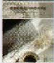

은)

G

프로빽!!. 여기에 꿀어다 눌거나

i

료고

OO0+

·

엽

색상

量

쓰

O 도구: 작업에 자주 쓰는 도형, 선, 메모지, 텍스

O 프로젝트: 사용자가 만든 모든 디자인과 업로

트, 표, Draw(그리기) 등을 한 번에 모아 둔

드한파일, 공유된 파일, 별표표시(즐겨찾기)한 항목 등을 바로 찾아 불러올 수 있는 파일 허브

메뉴예요. 원하는 도구를 선택해 작업 폐이지

에 요소를 빠르게 추가할 수 있습니댜 Draw 기능을 사용하면 펜, 마커, 형광펜 등으로 자

입니다. 폴더 분류, 공유, 검색 등으로 원하는 자 료를빠르게 찾아작업을이어갈 수 있습니다.

유롭게 그림을 그리거나 강조 표시를 할 수 있

g

800a 亨내프로젝트

奭 Q 내콘텐츠검색

어요. 또한 객체 선택,t\.'£.형, 선, 텍스트, 표, 메 모지 추가 등 다양한 기능을 빠르게 선택해 수

행할수있답니댜

전체

###### 디자인

플더

T

디자인

모두보기

@*

V 4

슝*

뺀드 센터

o00

###### 더78

브린드센터

G

· /

업로드할혹二

###### 브라온 블랙 및 골드와 네온...

재목없는디자인

###### :

인스티그댕 게시을(34)

인스타그련 게시몰(34)

巳

T g

프.

ao0+

005 엽

뺀

###### 베이지색과 연노란색 이니...

###### 브라운 틀렉 및 골드와 네온...

인스타그렴 게시믈(34)

스토리

###### LESSON 06 에디터 화면 둘러보기 45

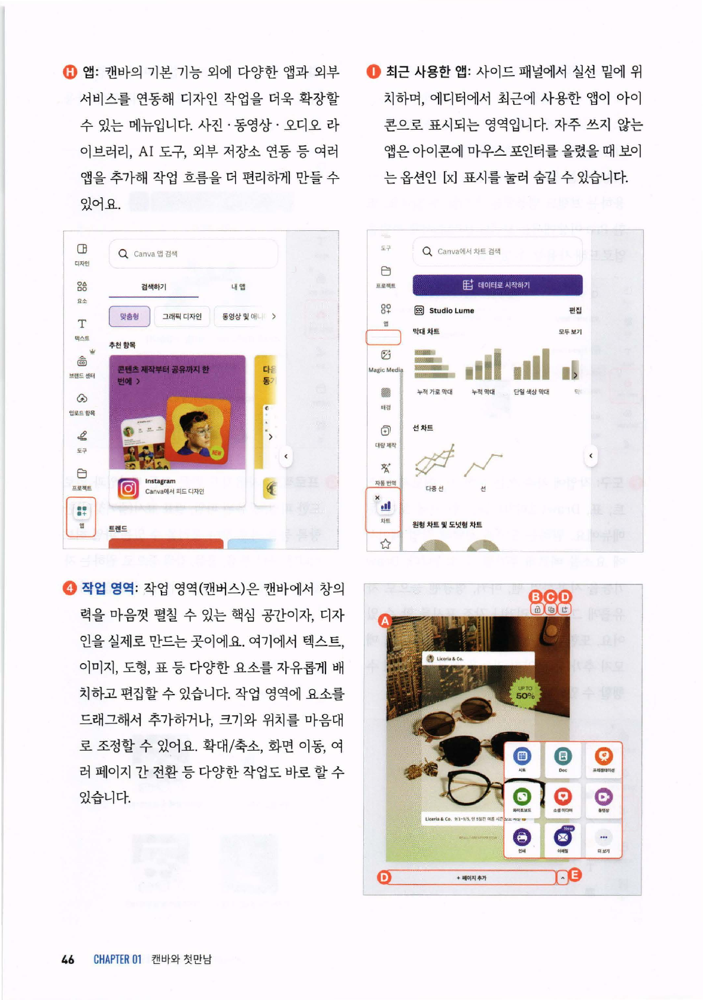

O 죄근 사용한 엡 사이드 패널에서 실선 밑에 위

O 엡 캔바의 기본 기능 외에 다양한 앱과 외부

치하며, 에디터에서 최근에 사용한 앱이 아이

서비스를 연동해 디자인 작업을 더욱 확장할 수 있는 메뉴입니다. 사진 · 동영상 · 오디오 라 이브러리, AI 도구, 외부 저장소 연동 등 여러 앱을 추가해 작업 흐름을 더 편리하게 만들 수

콘으로 표시되는 영역입니다. 자주 쓰지 않는

앱은 아이콘에 마우스 포인터를 올렸을 때 보이

는 옵션인 [x] 표시를 눌러 숨길 수 있습니다.

있어요.

###### ~ Q canva엡검색

-Studio Lume

Q Canva에서 자트 검색

도구

디자인

已

g8

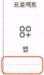

검색하? 내업

요

三

###### 편집

그래픽다자인 동영상및 Offl

###### T

막

모 보기

텍스트

###### ••

@

###### 1111

날

)

다등

###### I t>

M•gic M•di?

畵 g

누적가로막대

단일색싱막대

누적 막대

’

}夕 8

선 차트

。

‘

대말꽤칙

군/

요

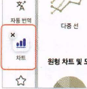

더

선

다종선

차트 및 트

트텐드

O 작업 영역: 작업 영역(캔버스)은 캔바에서 창의

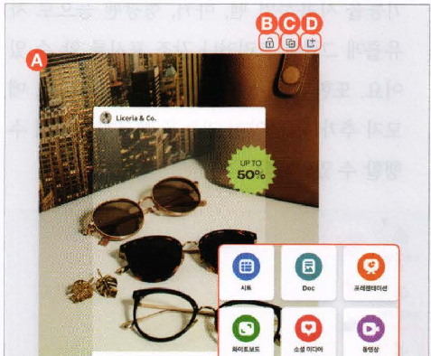

력을 마음껏 펼칠 수 있는 핵심 공간이자, 디자

인을 실제로 만드는 곳이에요. 여기에서 텍스트,

이미지, 도형, 표 등 다양한 요소를 자유롭게 배

치하고 편집할 수 있습니다. 작업 영역에 요소를 드래그해서 추가하거나, 크기와 위치를 마음대

O

。

로 조정할 수 있어요. 확대/축소, 화면 이동, 여

＿

io i

러 페이지 간 전환 등 다양한 작업도 바로 할 수

O g

있습니댜

5心•s•IT”던혈”』아•시론r-

G

###### 소O

『

z

이.

###### 。 E

46 CHAPTER 01 캔바와 첫만남

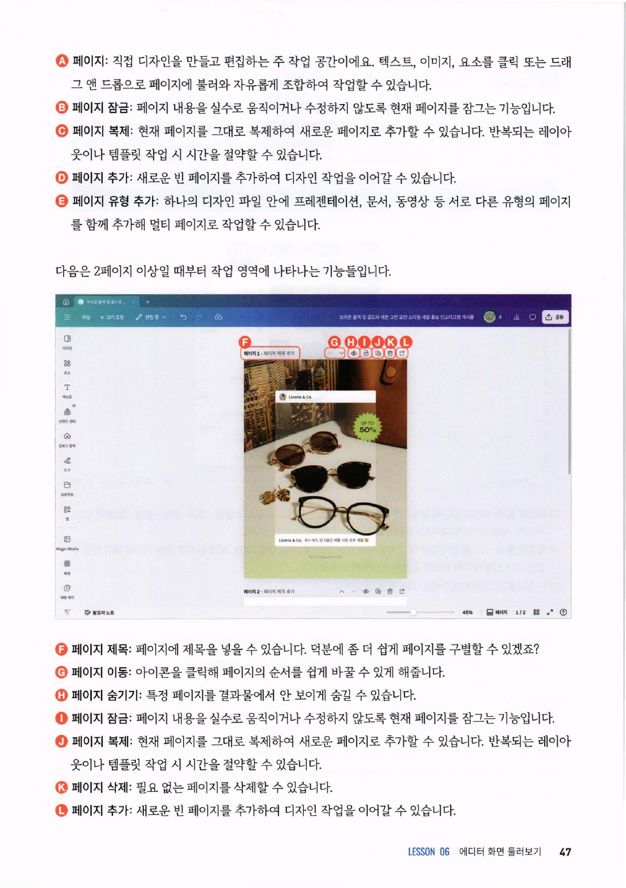

###### O 페이지: 직접 디자인을 만들고 편집하는 주 작업 공간이에요. 텍스트, 이미지, 요소를 클릭 또는 드래

그 앤 드롭으로 페이지에 불러와 자유롭게 조합하여 작업할 수 있습니다.

O 페이지 잠금: 페이지 내용을 실수로 움직이거나수정하지 않도록 현재 폐이지를 잠그는 기능입니다. O 페이지 복제: 현재 페이지를 그대로 복제하여 새로운 페이지로 추가할 수 있습니다. 반복되는 레이아

웃이나 템플릿 작업 시 시간을 절약할 수 있습니다.

O 페이지 주가: 새로운 빈 페이지를 추가하여 디자인 작업을 이어갈 수 있습니다.

e 페이지 유형 주가: 하나의 디자인 파일 안에 프레젠테이션, 문서, 동영상 등서로 다른유형의 페이지

를 함께 추가해 멀티 페이지로 작업할 수 있습니다.

|i: : 소나"': "’

다음은 2페이지 이상일 때부터 작업 영역에 나타나는 기능들입니다.

eg

路

a

T

###### `*l

###### @

브......

G)

###### I•또.••

###### ’]”

###### "..

e!

8?

Ci

###### " •.....

###### ”

빼이지2•빼아지 후기 金 @ o e

。

따뻬•

엉

,; II표지노를 ·5% 닳빼01지 1 88 •• Q)

페이지 제목: 페이지에 제목을 넣을 수 있습니다. 덕분에 좀 더 쉽게 폐이지를 구별할 수 있겠죠?

O 페이지 이동: 아이콘을 클릭해 페이지의 순서를 쉽게 바꿀 수 있게 해줍니다.

0 페이지 숨기기: 특정 폐이지를 결과물에서 안 보이게 숨길 수 있습니다.

O 페이지 잠금: 페이지 내용을 실수로 움직이거나 수정하지 않도록 현재 페이지를 잠그는 기능입니다.

e 페이지 복제: 현재 페이지를 그대로 복제하여 새로운 페이지로 추가할 수 있습니다. 반복되는 레이아

웃이나 템플릿 작업 시 시간을 절약할 수 있습니다.

- 0 페이지 삭제 : 필요없는 페이지를 삭제할수있습니댜

O 페이지 추가: 새로운 빈 페이지를 추가하여 디자인 작업을 이어갈 수 있습니다.

LESSON 06 에디터 화면 둘러보기 47

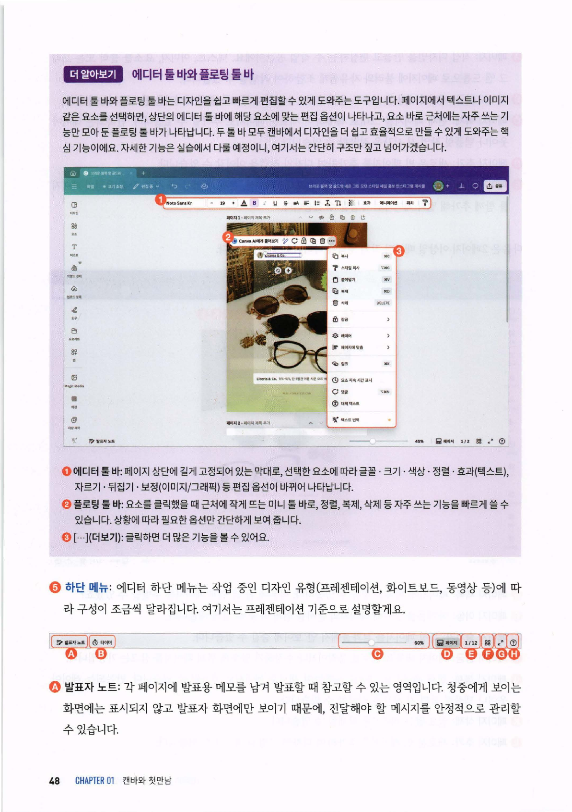

-

같은 요소를 툴 바에 맞는 나타나고, 요소 바로 자주 쓰는 기

둔 툴 바가 나타납니다, 두 툴 바 모두 캔바에서 디자인율 더 쉽고 효율적으로 만들 수 있게 도와주는 핵

기능이에요. 실습에서 짚고

/ v1 。 "‘.'’Mt`"`Y:.,·. ',서•.,,,,·,.,,.• 0 - :::"

".. 1- 꽤톨후가 v o a ® 0 巳

NotO ..mw - D • 스 B r u s 다 ;;:: i三 i n § m ..～신 曲 T

Gi

認 a

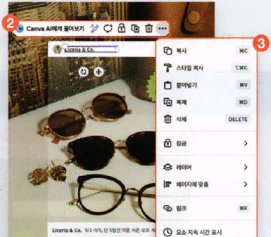

T

`스.

••‘量솁어

。

혈••

쓰"

###### ....e!

005·

Ci

"峰k.....

• ”

O 뎃 W'"

® 대..또

###### e

###### 핫 빽식"`

빠이외2• 빼•I시 후가

..

구· 감11m포 ••” 닳亭지 1/2 誌 «• ®

O 바:페이지 상단에 길게 고정되어 있는막대로, 요소에 ·크기 · 색상 · ·효과(텍스트),

자르기 두1집기 · 보정(이미지/그래픽) 등 바뀌어 나타납니다.

O 바: 때 근처에 작게 뜨는 미니 툴 바로, 정렬, 복제, 삭제 등 자주 쓰는 기능을 빠르게 수

[…］（더보기): 클릭하면 더 많은 기능을 볼 수 있어요.

O 하단 매뉴: 에디터 하단 메뉴는 작업 중인 디자인 유형(프레젠테이션, 화이트보드, 동영상 등)에 따

라 구성이 조금씩 달라집니댜 여기서는 프레젠테이션 기준으로 설명할게요.

###### 따 느 ..,,.〕

O 발표자 노트: 각 페이지에 발표용 메모를 남겨 발표할 때 참고할 수 있는 영역입니댜 청중에게 보이는

화면에는 표시되지 않고 발표자 화면에만 보이기 때문에, 전달해야 할 메시지를 안정적으로 관리할

수있습니다.

###### 48 CHAPTER 01 캔바와 첫만남

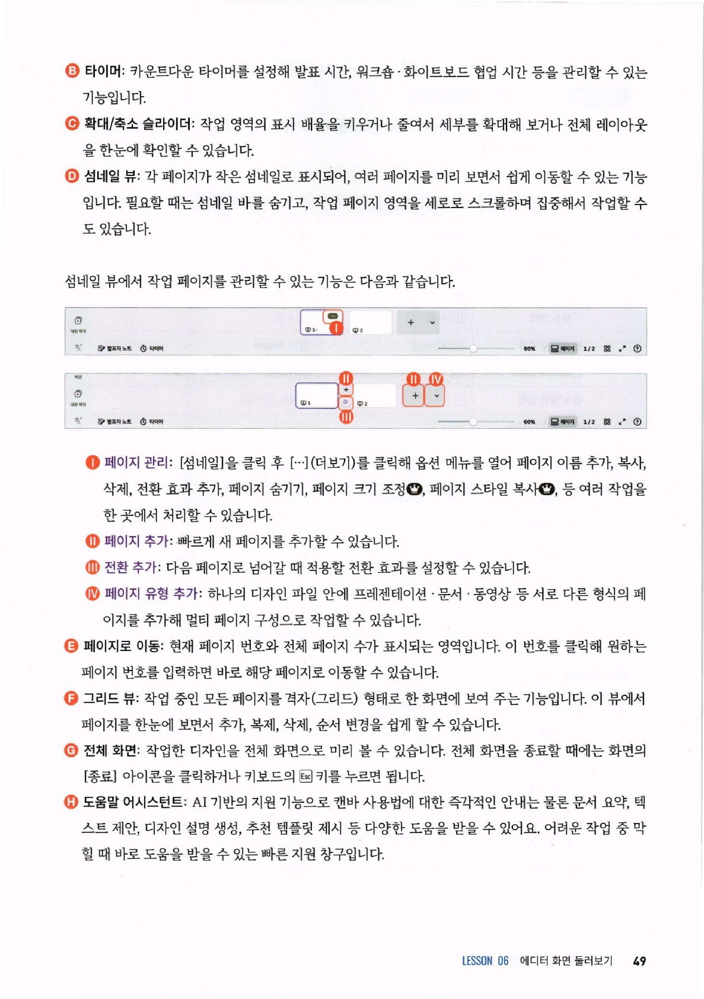

###### O 타이머: 카운트다운 타이머를 설정해 발표 시간, 워크숍·화이트보드 협업 시간 등을 관리할 수 있는

기능입니다.

###### O 확대/축소 슬라이더: 작업 영역의 표시 배율을 키우거나 줄여서 세부를 확대해 보거나 전체 레이아웃

을 한눈에 확인할 수 있습니다.

###### O 섬네일 뷰: 각 페이지가 작은 섬네일로 표시되어, 여러 페이지를 미리 보면서 쉽게 이동할 수 있는 기능

입니다. 필요할 때는 섬네일 바를 숨기고, 작업 페이지 영역을 세로로 스크롤하며 집중해서 작업할 수

도있습니다.

섬네일 뷰에서 작업 페이지를 관리할 수 있는 기능은 다음과 같습니다.

:*츠"지-·- 구.. ~ liil-1/2器＂翼®I

:,.~讐m'포0" ®·· ~

· 磁 딜-- l/2 腐 볼· 이

0 페이지 관리: ［섬네일]을클릭 후 […]（더보기)를클릭해 옵션 메뉴를 열어 페이지 이름추가, 복사,

삭제, 전환 효과 추가, 페이지 숨기기, 페이지 크기 조정0, 페이지 스타일 복사0, 등 여러 작업을 한 곳에서 처리할 수 있습니다.

###### ® 페이지 주가:．빠르게 새 폐이지를 추가할 수 있습니댜 ® 전환 주가: 다움페이지로 넘어갈 때 적용할 전환 효과를 설정할 수 있습니다. ® 페이지 유형 주가: 하나의 디자인 파일 안에 프레젠테이션 ·문서 ·동영상 등 서로 다른 형식의 페

이지를 추가해 멀티 페이지 구성으로 작업할 수 있습니다.

###### O 페이지로 이동: 현재 페이지 번호와 전체 페이지 수가 표시되는 영역입니다. 이 번호를 클릭해 원하는

페이지 번호를 입력하면 바로 해당 페이지로 이동할 수 있습니댜

O 그리드 뷰: 작업 중인 모든 페이지를 격자(그리드) 형태로 한 화면에 보여 주는 기능입니다. 이 뷰에서

페이지를 한눈에 보면서 추가, 복제, 삭제, 순서 변경을 쉽게 할 수 있습니다.

O 전제 화면 작업한 디자인을 전체 화면으로 미리 볼 수 있습니다. 전체 화면을 종료할 때에는 화면의

[종료] 아이콘을 클릭하거나 키보드의 已 키를 누르면 됩니댜

###### O 도움말 어시스턴트: AI 기반의 지원 기능으로 캔바 사용법에 대한 즉각적인 안내는 물론 문서 요약, 텍

###### 스트 제안, 디자인 설명 생성, 추천 템플릿 제시 등 다양한 도움을 받을 수 있어요. 어려운 작업 중 막

###### 힐 때 바로 도움을 받을 수 있는 빠른 지원 창구입니다.

LESSON 06 에디터 화면 둘러보기 49

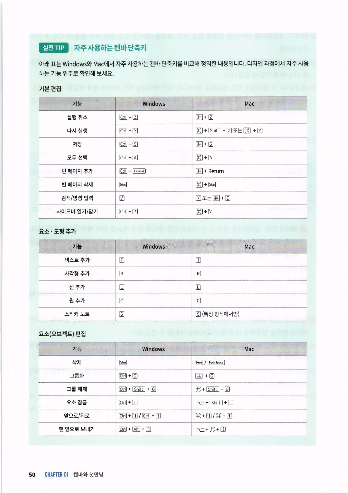

###### 자주사용하는캔바단측키

아래 Windows와 Mac에서 정리한 . 자주 사용

하는 기능 위주로 보세요.

| |Windows| |
|---|---|---|
|실행쥐소|屈 + 묘]|選 + 띠|
|다시실행|臣 + 띠|選 + 雲＋ 띠 또는 던] + 匠|
|저장|區 + 固|選 + 칩|
|모두선택|臣 + 囚|選 + 因|
|빈페이지주가|臣 + 동도크|園] + Return|
|빈페이지삭제|돈|園] + 돈|
|검색1명령 입력|匠|四 또는 뎀8 + 匡|
|사이드바열기/닫기|回 + 四|選 + 띠|

###### !

요소·도형주가

|기능|Windows| |
|---|---|---|
|텍스트주가|띠|띠|
|사각형주가|®|®|
|선주가|떠|띠|
|원주가|回|©|
|스티키노트|區]|固 (특정 형식에서만)|

I

I

요소(오브젝트)편집

| | | |
|---|---|---|
|삭제|돈|듣 | |BaekSpaceI|
|그룹화|回 + 固|選 + 固|
|그룹해제|回 + 匡교디니힙|箕 + E쿄口 + 固|
|요소잠금|區나디|大 + 巨쿄디 + E]|
|앞으로/뒤로|回 + m / 臣 + 띠|箕 + 門 | 箕 + m|
|맨앞으로보내기|回 + 因0 + 四|`＋ 箕 + 띠|

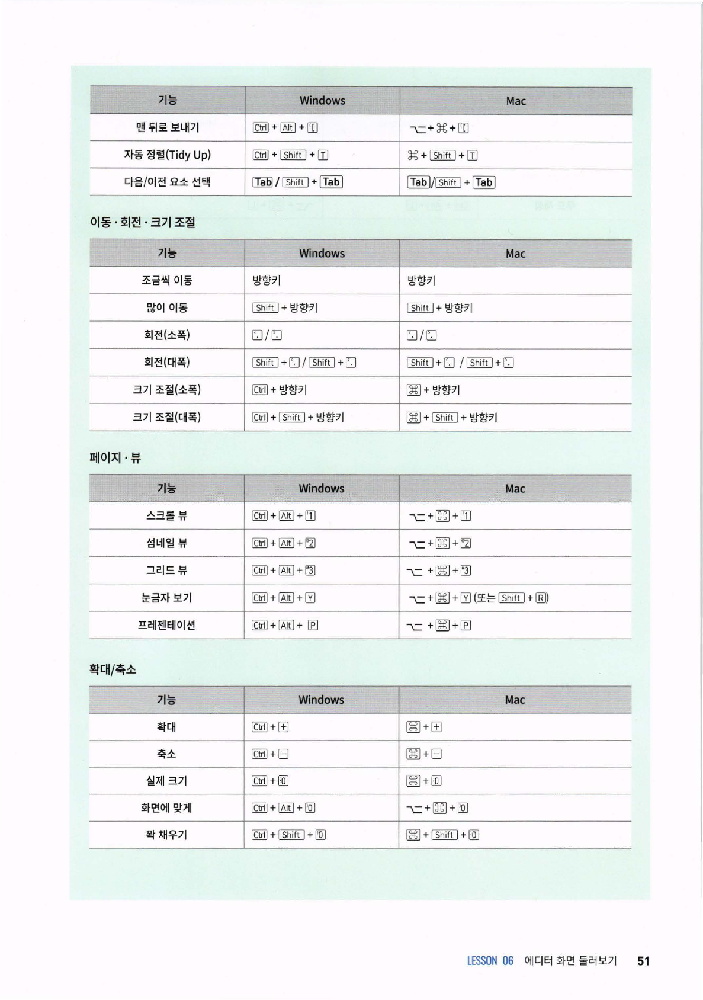

###### I

|I| |Mac|
|---|---|---|
|맨뒤로보내기|回겔 + 卽 + 四l|`＋ 箕 + m|
|자동 정렬(Tidy Up)|回 + 雲 + E|箕 + 匡쿄디 + E]|
|다음/이전요소선택|며 / 호正) + 困|困|函記 +困|

I

I

이동·회전·크기조절

|기능|Windows|Mac|
|---|---|---|
|조금씩이등|방향JI|방향=;I|
|많이이동|麟 +방향키|g硏디 +방향키|
|회전(소폭)|巳 I 亡l|口|巴|
|회전(대폭)|匡펜디 + 巳/匡回티 + El|麟 + 口 /固쿄n + 亡|
|크기 조절(소폭)|[gill+방향키|選 + 방향키|
|크기 조절(대폭)|詞 + 麟 + 방향키|選 + 固西〕＋ 방향키|

###### I

페이지·뷰

|I 기능|Windows|Mac|
|---|---|---|
|스크롤뷰|臣 + rm + l'.D|大 + 選] ＋ El|
|섬네일뷰|回 + (6ilJ + ~|` ＋ 選 + 던]|
|그리드뷰|回 + 卿 + 쩝|` 吐卽 + 정|
|눈금자보기|臣 + 因 + 모|`+選+@（또는匡쿄디+®)|
|프레젠테이션|臣 + 卿 + 떤|大 ＋ 選] + 巴|

###### I

확대/축소

|I 기능| |Mac|
|---|---|---|
|확대|臣 + El|選 + El|
|축소|!ill+El|卿 + E]|
|실제크기|回 +園|選 + 歷]|
|화면에맞게|臣 + 因U + 園|` ＋ 選+園|
|꽉채우기|臣 + 雲 + 區!|選 + 固西〕 ＋ 卽|

###### I

에디터 화면 둘러보기 51

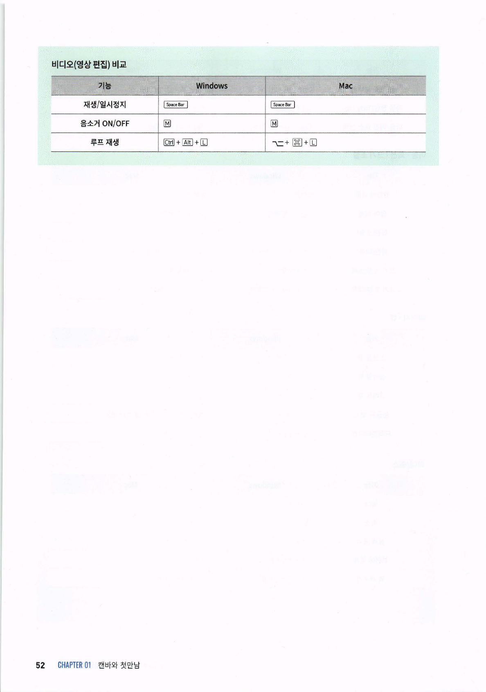

| | | |
|---|---|---|
|재생/일시정지|ISpaceBar |||SpaceBar ||
|음소거 ON/OFF|@|匠l|
|루프재생|回+因D+w|""\::+ 選 +巳|

###### I

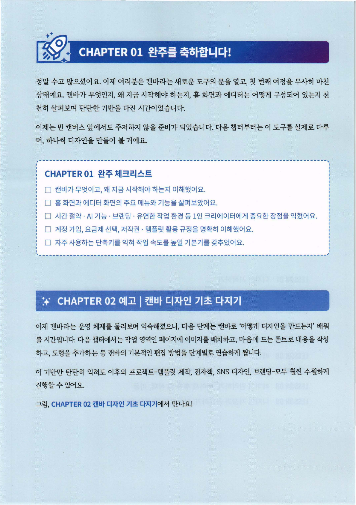

###### CHAPTER 01 |

이제 번째 여정을무사히 마친

상태예요. 캔바가 무엇인지, 왜 지금 시작해야 홈 화면과 에디터는 어떻게 구성되어 있는지 천

천히 살펴보며 기반을 다진

이제는 빈 캔버스 앞에서도 주저하지 않을 준비가 되었습니 다. 다음 챕터부터는 이 도구를 실제로 다루

며, 하나씩 디자인을만들어 볼거예요.

-----------------------------------------------------------------

,

、

CHAPTER Ol 완주 체크리스트

口 무엇이고, 하는지

###### 口

口 · Al 기능 · · 1 口 가입, 선택, · 이해했어요. 口 자주 사용하는 익혀 기본기를

,

-··

`

| ]

이제 캔바라는 운영 둘러보며 익숙해졌으니, 다움 캔바로 ‘어떻게 디자인을 만드는지’ 배워

시간입니다. 다움 챕터에서는 작업 페이지에 이미지를 배치하고, 마음에 드는 폰트로 내용을 작성 하고, 도형을 추가하는 등 캔바의 기본적인 편집 방법을 됩니다.

###### 이 기반만 탄탄히 익혀도 이후의 - SNS 디자인, -모두 수월하게

진행할수있어요.

###### CHAPTER 02 기에서 만나요!

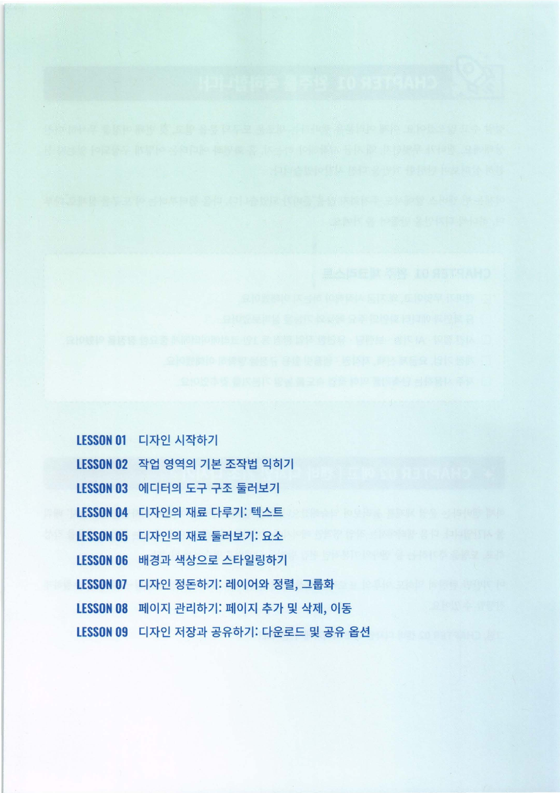

시작하기

- LESSON 02
- LESSON 03 구조 다루기: 텍스트

- LESSON 05 디자인의 재료 둘러보기: 요소
- LESSON 06
- LESSON 07 페이지 관리하기: 페이지 추가 삭제, 이동

LESSON 09 디자인 저장과 다운로드

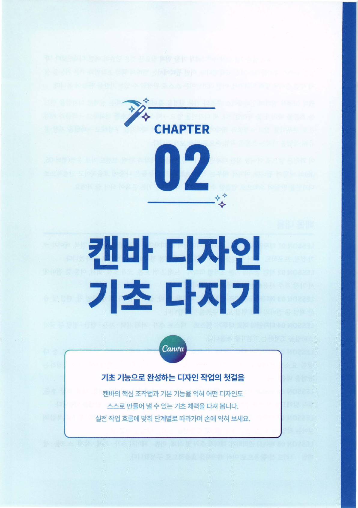

一、수

k?수-

CHAPTER

###### 합

수

캔바디자인

기조다지기

기조 기능으로 디자인

핵심 조작법과 기본 익혀 어떤 디자인도 스스로 만들어 수 있는 기조 체력을 다져 봅니다.

손에 익혀

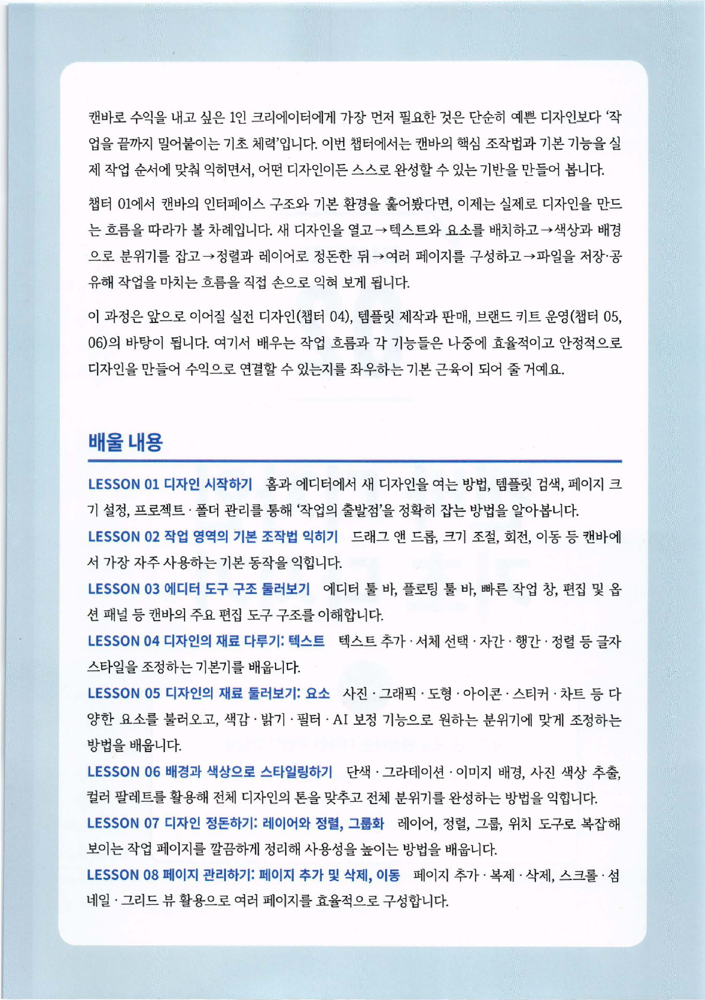

캔바로 수익을 내고 싶은 1인 크리에이터에게 가장 먼저 필요한 것은 단순히 예쁜 디자인보다 ‘작

업을 끝까지 밀어붙이는 기초 체력'입니다. 이번 챕터에서는 캔바의 핵심 조작법과 기본 기능을 실 제 작업 순서에 맞춰 익히면서, 어떤 디자인이든 스스로 완성할 수 있는 기반을 만들어 봅니다.

챕터 01에서 캔바의 인터페이스 구조와 기본 환경을 훑어봤다면, 이제는 실제로 디자인을 만드

는 흐름을 따라가 볼 차례입니다. 새 디자인을 열고一텍스트와 요소를 배치하고一색상과 배경

###### 으로 분위기를 잡고一정렬과 레이어로 정돈한 뒤 一여러 페이지를 구성하고一파일을 저장·공

유해 작업을 마치는 흐름을 직접 손으로 익혀 보게 됩니다. 이 과정은 앞으로 이어질 실전 디자인(챕터 04), 템플릿 제작과 판매, 브랜드 키트 운영(챕터 05,

###### 06)의 바탕이 됩니다. 여기서 배우는 작업 흐름과 각 기능들은 나중에 효율적이고 안정적으로

디자인을만들어 수익으로연결할수있는지를좌우하는기본근육이 되어 줄거예요.

###### 배울내용

LESSON 01 홈과 에디터에서 새 디자인을 여는 방법, 템플릿 검색, 페이지 크

###### 기 설정, 프로젝트 · 폴더 관리를 통해 ‘작업의 출발점'을 정확히 잡는 방법을 알아봅니다.

02 기본 드래그 앤 드롭, 크기 조절, 회전, 이동 등 캔바에 서 가장자주사용하는기본동작을익힙니댜

- LESSON 03 구조 에디터 툴 바, 플로팅 툴 바, 빠른 작업 창, 편집 및 옵 션 패널 등 캔바의 주요 편집 도구 구조를 이해합니다.
- LESSON 04 텍스트 텍스트 추가 · 서체 선택 · 자간 · 행간 · 정렬 둥 글자 스타일을 조정하는 기본기를 배웁니다.
- LESSON 05 사진 · 그래픽 · 도형 · 아이콘 · 스티커 · 차트 등 다 양한 요소를 불러오고, 색감 · 밝기 · 필터 · AI 보정 기능으로 원하는 분위기에 맞게 조정하는 방법을배웁니다. LESSON 단색 · 그라데이션 · 이미지 배경, 사진 색상 추출, 컬러 팔레트를 활용해 전체 디자인의 톤을 맞추고 전체 분위기를 완성하는 방법을 익힙니댜 LESSON 07 레이어와 정렬, 그룹화 레이어, 정렬, 그룹, 위치 도구로 복잡해 보이는 작업 페이지를 깔끔하계 정리해 사용성을 높이는 방법을 배웁니다.

페이지 페이지 주가 삭재, 이동 페이지 추가 · 복제 · 삭제, 스크롤 · 섬 네일 · 그리드 뷰 활용으로 여러 페이지를 효율적으로 구성합니댜

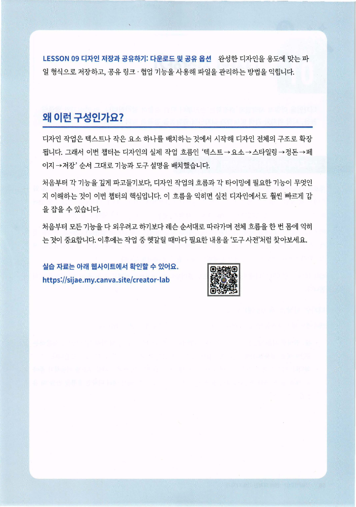

LESSON 09 저장과 완성한 디자인을 용도에 맞는 파

일 형식으로 저장하고, 공유 링크 · 협업 기능을 사용해 파일을 관리하는 방법을 익힙니다.

###### 왜이런구성인가요?

디자인 작업은 텍스트나 작은 요소 하나를 배치하는 것에서 시작해 디자인 전체의 구조로 확장 됩니다. 그래서 이번 챕터는 디자인의 실제 작업 흐름인 텍스트一요소一스타일링 一정돈一폐 이지 一저장' 순서 그대로 기능과 도구 설명을 배치했습니다.

처음부터 각 기능을 깊게 파고들기보다, 디자인 작업의 흐름과 각 타이밍에 필요한 기능이 무엇인

###### 지 이해하는 것이 이번 챕터의 핵심입니다. 이 흐름을 익히면 실전 디자인에서도 훨씬 삐르게 감

을잡을수있습니다.

처음부터 모든 기능을 다 외우려고 하기보다 레슨 순서대로 따라가며 전체 흐름을 한 번 몸에 익히 는 것이 중요합니다. 이후에는 작업 중 헷갈릴 때마다 필요한 내용을 ‘도구 사전'처럼 찾아보세요.

자료는 수 있어요.

###### https://sijae.my.canva.site/creator-lab

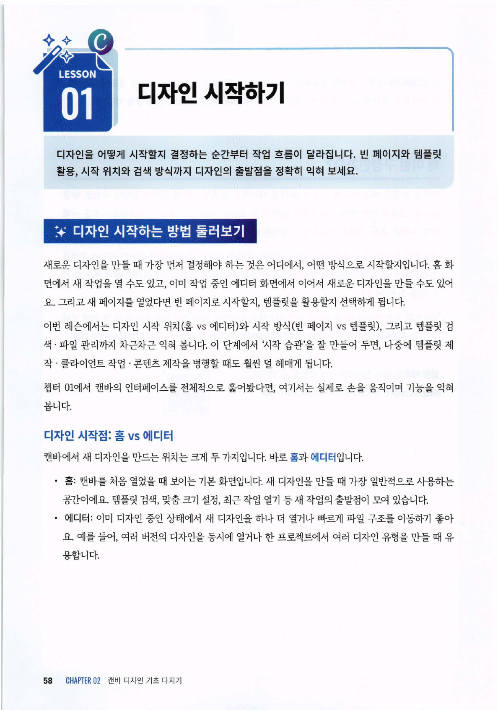

###### 디자인시작하기

###### 시작할지 순간부터 작업 흐름이 달라집니다. 빈 페이지와

시작 검색 방식까지 디자인의 정확히 익혀 보세요.

###### | :-.: I

###### 새로운 디자인을 만들 때 가장 먼저 결정해야 하는 것은 어디에서, 어떤 방식으로 시작할지입니다. 홈 화

면에서 새 작업을 열 수도 있고, 이미 작업 중인 에디터 화면에서 이어서 새로운 디자인을 만들 수도 있어

요. 그리고 새 페이지를 열었다면 빈 폐이지로 시작할지, 템플릿을 활용할지 선택하게 됩니다. 이번 레슨에서는 디자인 시작 위치(홈 vs 에디터)와 시작 방식(빈 폐이지 vs 템플릿)， 그리고 템플릿 검

색 · 파일 관리까지 차근차근 익혀 봅니댜 이 단계에서 ‘시작 습관'올 잘 만들어 두면, 나중에 템플릿 제 작 · 클라이언트 작업 · 콘텐츠 제작을 병행할 때도 훨씬 덜 헤매게 됩니다. 챕터 01에서 캔바의 인터페이스를 전체적으로 훑어봤다면, 여기서는 실제로 손을 움직이며 기능을 익혀

봅니댜

###### vs 에디터

캔바에서 새 디자인을 만드는 위치는 크게 두 가지입니다. 바로 홈과 에디터입니다.

- • 흠 캔바를 처음 열었을 때 보이는 기본 화면입니다. 새 디자인을 만들 때 가장 일반적으로 사용하는 공간이에요. 템플릿 검색, 맞춤 크기 설정, 최근 작업 열기 등 새 작업의 출발점이 모여 있습니다.
- • 에디탸 이미 디자인 중인 상태에서 새 디자인을 하나 더 열거나 빠르게 파일 구조를 이동하기 좋아 요. 예를 들어, 여러 버전의 디자인을 동시에 열거나 한 프로젝트에서 여러 디자인 유형을 만들 때 유 용합니댜

58 CHAPTER 02 캔바 디자인 기조 다지기

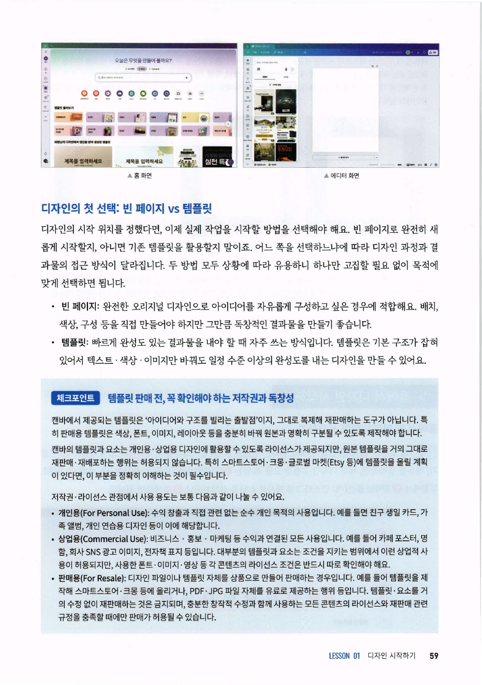

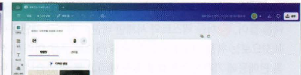

###### ..

e·0‘

。 볼까요?

I!

###### ,i,__~- T ~ -

###### ‘

OO O O O O O O oa -

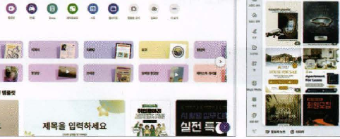

龜.

c 11ff.

1f11l1J1 "........"11H

。

•

- 11- m ■ .• $

... 홍화면

~ 에 디터 화면

###### 빈 vs

디자인의 시작 위치를 정했다면, 이제 실제 작업을 시작할 방법을 선택해야 해요. 빈 페이지로 완전히 새

롭게 시작할지, 아니면 기존 템플릿을 활용할지 말이죠. 어느 쪽을 선택하느냐에 따라 디자인 과정과 결 과물의 접근 방식이 달라집니댜 두 방법 모두 상황에 따라 유용하니 하나만 고집할 필요 없이 목적에 맞게선택하면됩니다.

- • 빈 페이지: 완전한 오리지널 디자인으로 아이디어를 자유롭게 구성하고 싶은 경우에 적합해요. 배치, 색상,구성 등을직접 만들어야하지만그만큼독창적인결과물을만들기 좋습니댜
- • 템플릿: 빠르게 완성도 있는 결과물을 내야 할 때 자주 쓰는 방식입니다. 템플릿은 기본 구조가 잡혀 있어서 텍스트 · 색상 · 이미지만 바꿔도 일정 수준 이상의 완성도를 내는 디자인을 만들 수 있어요.

###### 템플릿 판매 전,

캔바에서 제공되는 ‘아이디어와 빌리는 줄발점'이지, 그대로 복제해 도구가 아닙니다. 특 히 판매용 색상, 폰트, 이미지, 레이아웃 등을 중분히 바꿔 원본과 명확히 구분될 수 있도록 제작해야 합니다.

캔바의 요소는 · 디자인에 수 거의 그대로 않습니다. ·크몽 · 마켓(Etsy 등)에 올릴 계획

이 이

·라이선스 보통 수

- • Personal Use): 수익 관련 순수 . 카드, 가 족 앨범, 디자인 이에
- • 상업용(Commercial Use): 비즈니스 · · 수익과 모든 사용입니다. 예를 들어 카페 포스터, 합 회사 SNS 이미지, 표지 . 대부분의 요소는 지키는 이런 사

사용한폰트 · 이미지 · 영상등 각 라이선스 반드시 따로 확인해야해요.

- • 판매용(For Resale): 디자인 파일이나 자제를 상품으로 경우입니다. 예를 제 작해 ·크몽 올리거나, PDF·JPG 파일 자제를 유료로 제공하는 행위 . 템플릿·요소를 거 의 수정 금지되며, 장작적 수정과 사용하는 라이선스와 재판매 규정을 때에만 수 .

LESSON 01 디자인 시작하기 59

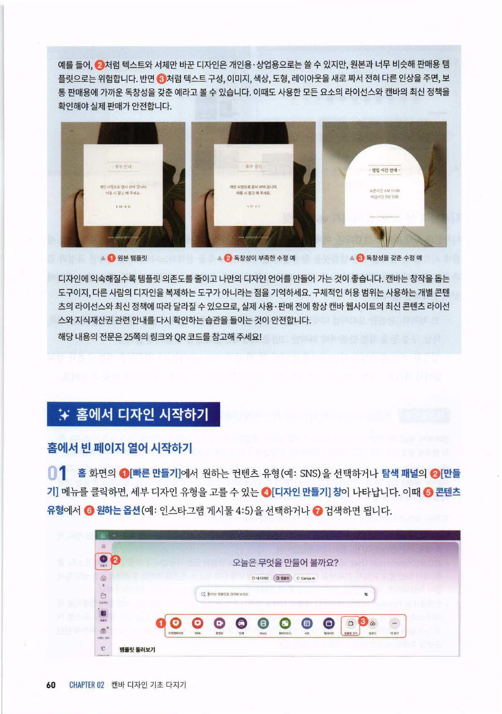

예를 들어, 처럼 텍스트와 서제만 바꾼 디자인은 개인용· 수 있지만, 너무 비슷해 판매용 템 위험합니다. 반면 처럼 텍스트 구성, 이미지, 색상, 도형, 레이아웃을 새로 짜서 전혀 다른 주면, 보

통 가까운 독창성을 갖준 수 있습니다. 사용한 모든 요소의 죄신 정책을

실제 안전합니다.

- • 영업시간안내

오른시간 ^M 1100

- •fl/시간 PM S,OO

팔시 +Iot

게인 사정으로 참시 쉬어 갑니다

미를서섬고..

독창성을갖준 수정 예

원본 템플릿

독창성이 부족한 수정 예

익숙해질수록 줄이고 나만의 디자인 가는 좋습니다. 도구이지, 다른 사람의 디자인을 복제하는 도구가 아니라는 기억하세요. 구제적인 허용 개별 츠의 라이선스와 조|신 정책에 따라 달라질 수 있으므로, 실제 사용 ·판매 전에 항상 캔바 웹사이트의 죄신 콘텐츠 라이선

스와 관련 안내를 다시 들이는 것이

해당 내용의 전문은 링크와 QR 코드를 잠고해 주세요!

###### | 홀에서 |

###### 1 홉화면의 O[빠른만들기]에서 원하는컨텐츠유형(예: SNS)을선택하거나 탐색패널의 O[만들

메뉴를클릭하면, 세부디자인 유형울 고를 수 있는 이 나타납니다. 이때

###### 유형에서 O 원하는옵션 (예: 인스타그램 게시물 4:5) 을 선택하거나 O 검색하면 됩니다.

@. e내_ ¢…N

e) Gk의기"'"紅…心 ―二

.l."'’

###### ...훈)*• q.mu o... o o 0 •아모鷺도 o서를 o巳...퍼,... q.,,

'C 템 릿들러보기

###### 60 CHAPTER 02 캔바 디자인 기조 다지기

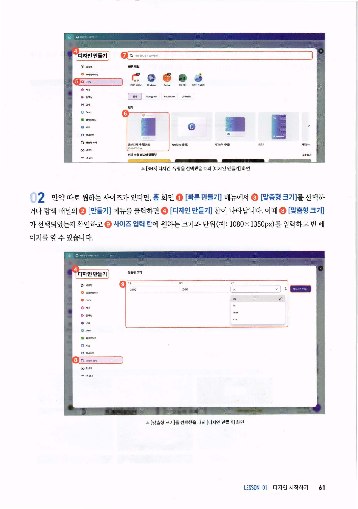

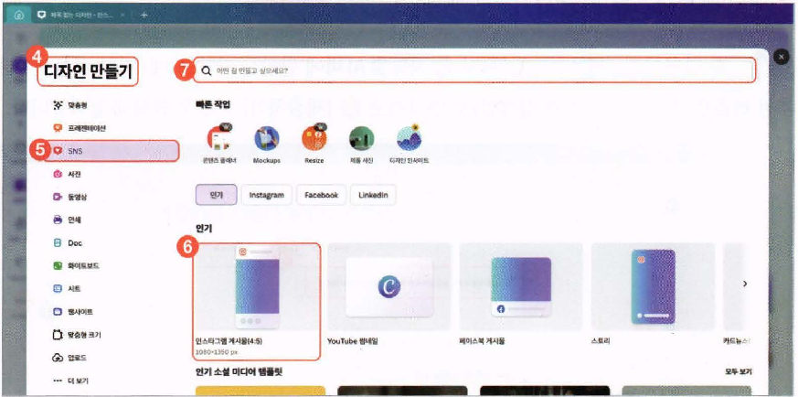

, 費..

。 ..대른"t8

적

###### •

•••• 빼u "E'" ..m. 서· 다자인언서아·

사

°‘ 들.ti

###### 巳 _~，＿～

용 안’

언기

”}

B ooc

###### ®

Ill ......,_

e 시

C)

O .......

°“•크기

wm...

먼스라그. 자시.u:＂ 빼빼게시.

스러 키도"스

I....9 ..

0 업

모투 로기

A [SNS] 디자인 유형율 선택했을 때의 [디자인 만들기] 화면

###### 2 만약따로원하는사이즈가있다면,홈화면O[빠른만들기] 메뉴에서O[맞춤형크기]를선택하

거나탐색 패널의 O [만들기] 메뉴를클릭하면O [디자인 만들기] 창이 나타납니다. 이때O 크기]

가선택되었는지 확인하고 O 사이즈입력 란에 원하는 크기와단위(예 : 1080 X 135Qpx)를입력하고빈 페 이지를열수있습니다.

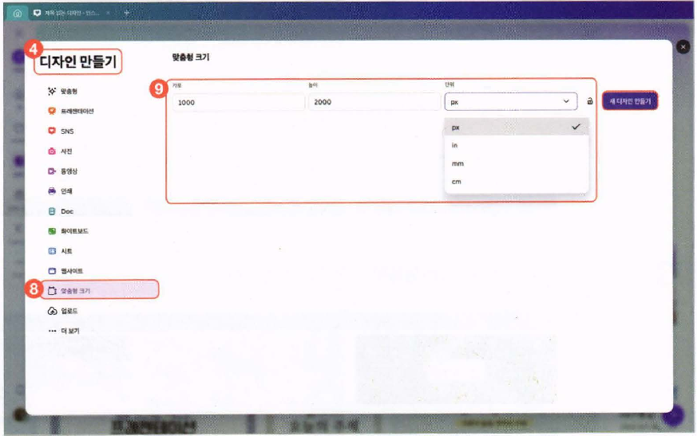

###### r.`". ...

###### ’"‘"

단•

E 二 a

1000 2000

Q ll혜뻔m신

a .m

v/

###### 0 SHS

0 시던 0" 틀옐실

음 면.. 8 Doc

Ill .........

巴 시.

~ [맞중형 크기]를 선택했을 때의 [디자인 만들기] 화면

###### LESSON 01 디자인 시작하기 61

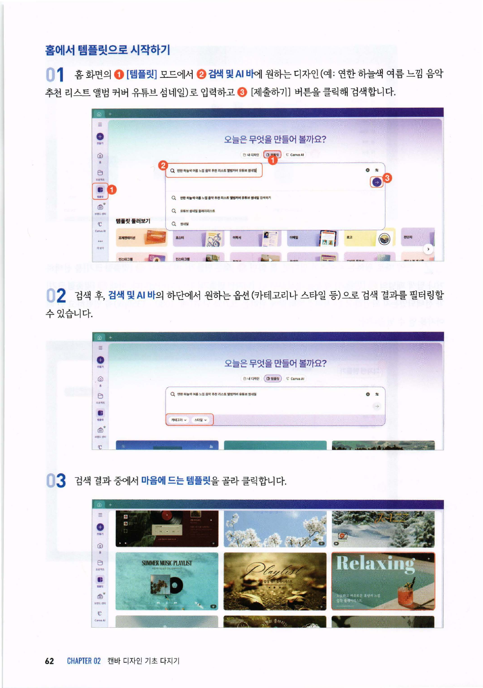

###### 1

홈화면의 O 모드에서 검색 및AI H回l 원하는디자인(예: 연한하늘색 여름느낌 음악

추천 리스트앨범 커버 유튜브섬네일)로입력하고 [제출하기] 버튼을클릭해검색합니다.

- -－·字

0

5 무엇을 볼까요?

®•

e, c c"w."

Q 언""어· 느"""스.”泊""때

Q 미""빼어.느륄•억이저스""H" ..鬱"＇0..빼기

Q n••<tt1...

·'C

tr-.'“'

- -N·”

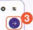

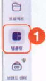

###### 롤

###### Q `"'

###### • @

。

._ ._

지

어

皇스미 아

언스"그•

- 2

검색 후, Al 바의 하단에서 원하는옵션(카테고리나스타일등)으로검색 결과를필터링할

수있습니댜

I

-

0 5

®•

O내디呼 雲 "…"'

*

e”

. ~e

Q 언"""".느륄•".8..스."...`m"＇내 0 $

➔

€

”조

- 03 검색 결과중에서 을골라클릭합니다.

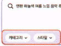

###### ...

###### ."..

춥*

c

Cr-~오^＇’

###### 62 캔바디자인 기조 다지기

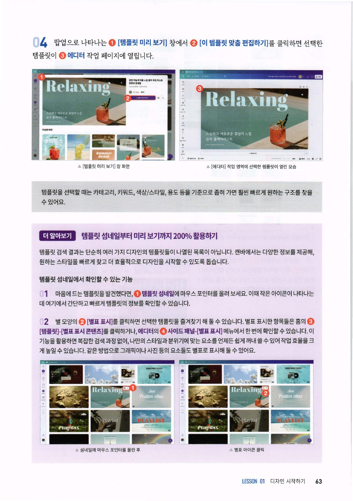

4 팝업으로나타나는O [템플릿미리 보기] 창에서 O [이 템플릿맞춤편집하기]를클릭하면 선택한

템플릿이 O 에디터 작업 페이지에 열립니다.

###### |교7一.，，=

0-·-T

5

• •

。

•-~·- - .,_'"..·"

~ [템폴릿 미리 보기] 장 화연 소 [에디터] 작업 영역에 선택한 템플릿이 열린 모습

카테고리,

수있어요.

###### 템플릿 섬네일부터 미리 보기까지 200%활용하기

검색 단순히 여러 가지 디자인의 템플릿들이 나열된 목록이 아닙니다. 캔바에서는 다양한 제공해, 빠르게 찾고 더 시작할 수 돕습니다.

수 있는 기능

- 1 마음에드는템플릿을발견했다면,0 에 마우스포인터를을려 보세요.이때작은아이콘이 나타나는

데

- 2 별모양의O 를 선택한템플릿을즐겨잦기 해둘수있습니댜 표시한항목들은홍의O

표시 클릭하거나, 의 표시] 메뉴에서 한 번에 확인할수 있습니댜 이

검색 과정 없이, 나만의 스타일과분위기에 맞는요소를 언제든 쉽게 꺼내 쓸수 있어 작업 효율을 크 게 수 요소들도 수 있어요.

•

e-·-•.

i

C·- - 0·

-

마우스 올린 후 별표아이콘클릭

디자인 시작하기 63

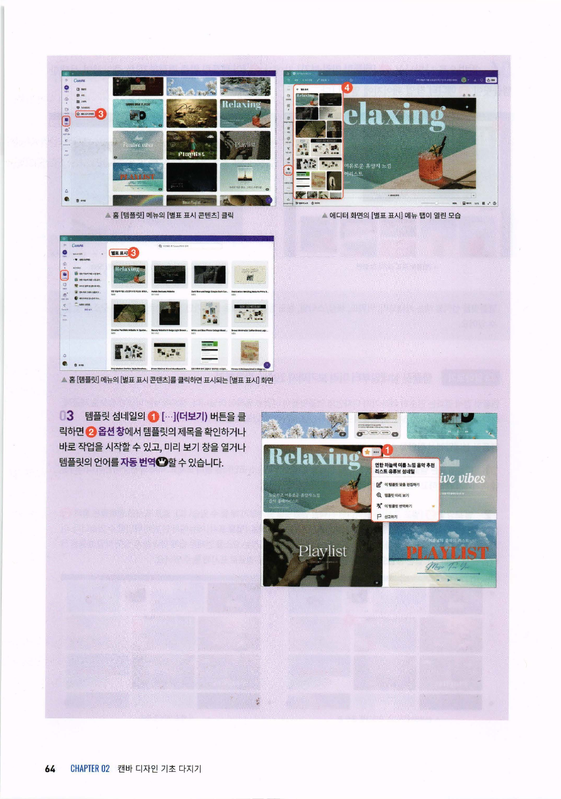

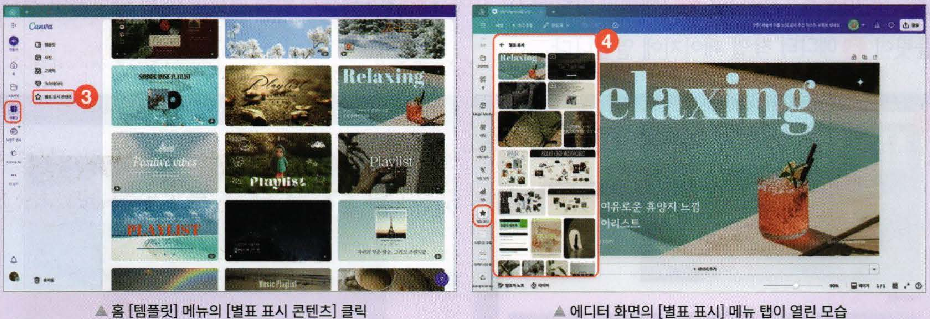

- • & Q ,_．'~～"뻬
- • • 노" •

·•--

"；드군」蒙! -

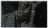

### .R -‘‘ ‘

=---------- m··

:.-""""-"~------

..; ·-·--

c -~--

•.``·--"

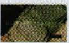

:;---•-:::--•--- :-w-_____-=------

###### ___r??:— 三 ~:\

_...........,__........ _"____ ...._~

###### :。

i,. [템플릿 의 [ 면 표시 [별 ]

3 …

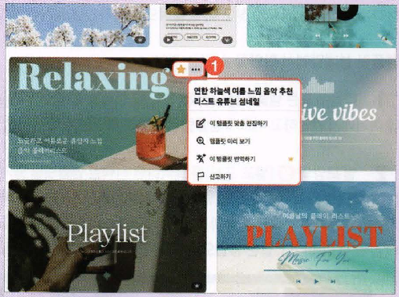

릭하면 O 제목을확인하거나

, 보기

템 릿의 언어를 수 있습니다

,'.

64 CHAPTER 02 캔바 디자인 기조 다지기

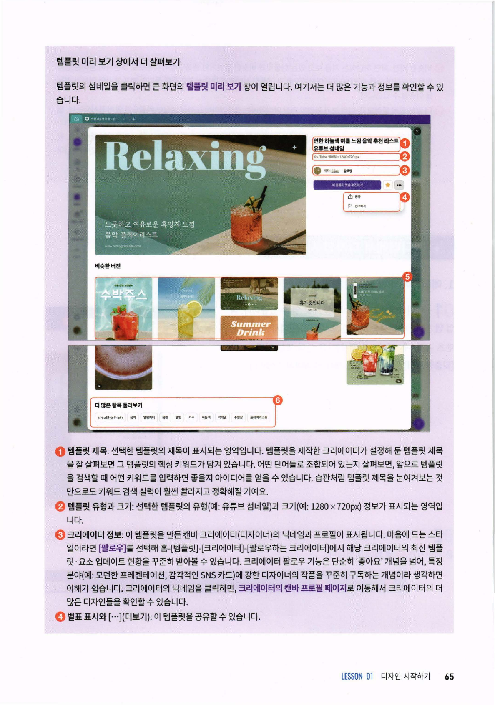

보기 더

큰 장이 더 많은 기능과 수 있

습니댜

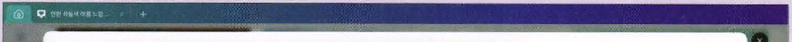

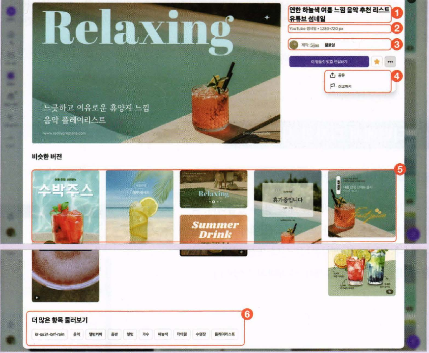

네;틀느낌을악후천 리스트

( 720m

###### (. """ ." O

###### 더많은항특틀러보기

k<·su2'-t>rl·noln 홑혁 ...커버 홑뺀 書법 가수 확．혜 미대혈 수필 ....1러스鳳

O 제목: 선택한 제목이 표시되는영역입니다. 제작한크리에이터가설정해 둔 템플릿 제목

그 담겨 있습니다.

을 검색할 때 키워드를 입력하면 아이디어를 수 있습니다. 습관처럼

만으로도 키워드 검색 빨라지고 거예요.

O 유형과크기: 선택한 유형(예: 유튜브섬네일)과크기(예:1280x720px) 정보가표시되는 영역입

니댜

. 마음에드는스타

선택해 홈-［템플릿]-［크리에이터]-[팔로우하는 크리에이터]에서 해당 크리에이터의 최신

릿 요소 업데이트 꾸준히 수 있습니다 크리에이터 기능은 단순히 ‘좋아요' 넘어, 특정

SNS 강한 꾸준히 개념이라 생각하면 쉽습니다. 프로필 로 크리에이터의 더

수 있습니다.

O별표표시와[…]（더보기)： 이 템플릿을공유할수있습니다.

LESSON 01 디자인 시작하기 65

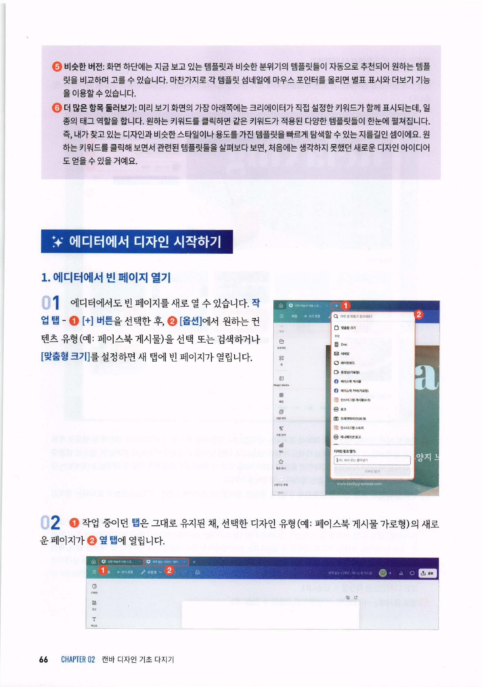

O 버전:화면 하단에는 보고

비교하며 수 있습니다. 마찬가지로 각 섬네일에 마우스 표시와 더보기 기능

율이용할수있습니다.

O더 항목들러보기: 미리 보기 화면의 가장아래쪽에는크리에이터가직접 설정한키워드가함께표시되는데,

종의 태그 원하는 같은

즉, 내가 있는 가진 탐색할 수 지름길인 . 원 하는 클릭해 보면서 보면, 처음에는 아이디어

###### | :-f I

- 1. 에디터에서 페이지

1 에디터에서도빈페이지를새로열수있습니댜작

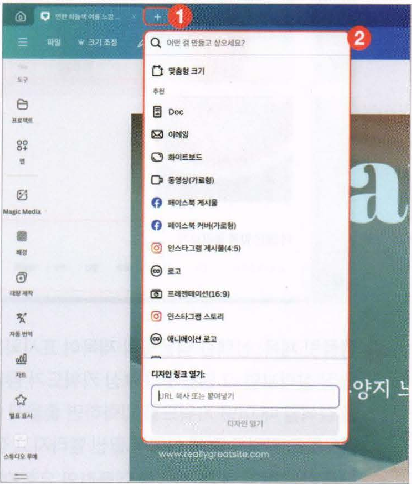

업 - 0 [+] 버튼을 선택한 후, O 에서 원하는 컨

Q 아던걸던를고실으세m

°..“혈크기

텐츠유형(예: 폐이스북게시물)을선택 또는검색하거나

텁 0o<

- E3 0鴻일 0`

°‘혈-·.,

°...,스.1』· °`心.캬mm"

언스타그를"AI.":S)

eu

g 표..三m·'l @l 언스타그뺄스" @ 데니中1선 m

디자인릴크'I11

- F ...wI

크기]를 설정하면 새 탭에 빈 페이지가 열립니다.

###### 느

·

###### .;7x{

설

:i

###### 2 0 작업 중이던 탭은그대로유지된 채,선택한디자인유형(예: 페이스북게시물가로형)의새로

###### 운페이지가 에 열립니다.

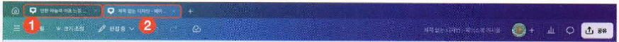

Ol

g

© C

誌

aTg

66 CHAPTER 02 캔바 디자인 기조 다지기

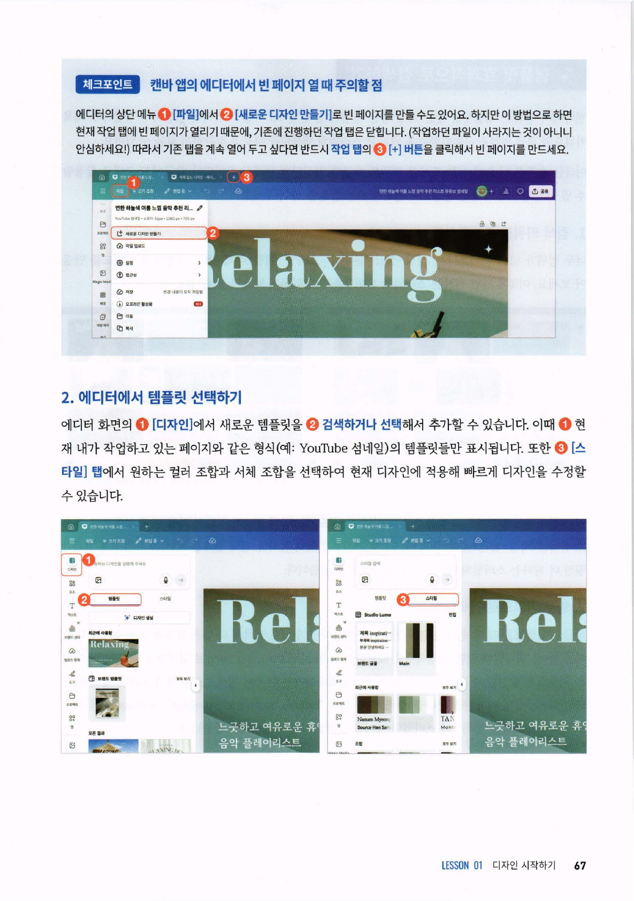

에디터의 상단메뉴O[파일]에서O[새로운디자인만톨기]로빈페이지를만들수도있어요.하지만이 방법으로하면

안심하세요!） 기존 계속 열어 두고 반드시 의 을 클릭해서 빈 페이지를 만드세요.

; ; 스

###### "e,...rg ’

wr....- · ••~ -•-p,•1'0p,

8? O m업포

® "

"......

@ ® 접근성

###### •

0 저장 단률내읽어 mp4월틸

,•"•'4": 활성鶴 C"

.....

o 때

°`

2. 에디터에서 선택하기

에디터 화면의 O 에서 새로운 템플릿을O 선택해서 추가할 수 있습니다. 이때 O 현

재 내가 작업하고 있는 페이지와같은형식(예: YouTube 섬네일)의 템플릿들만표시됩니다. 또한 O [스

타일] 탭에서 원하는 컬러 조합과 서체 조합을 선택하여 현재 디자인에 적용해 빠르게 디자인을 수정할

수있습니다.

I山 빼'c I|'프느-...... ^''결" _I

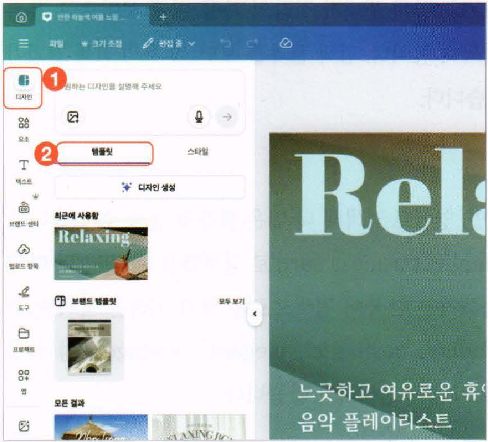

認 언 Q 얹 E 9

###### ”밋 ‘;' 스타일

”

###### : 6三 스C111

T

`포 i:I Studlolu.... 던밉

` ‘“샐상

••‘~..,

*'

”

®

###### ...._....

꽤톨 inspirati·

...딘

.".. ·1lS글. M墨

....

。

。

.量s··

‘구 때•mt."' ....,, 4••

4

###### ".. "..

·근뻬사•• 묘• ..,,

e e)

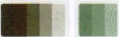

Ei 조" 모•"'' -

00 ~ , ., O•

었 T/J..

s

S Mont

모른II..

Ei

LESS 01 디자인 시작하기 67

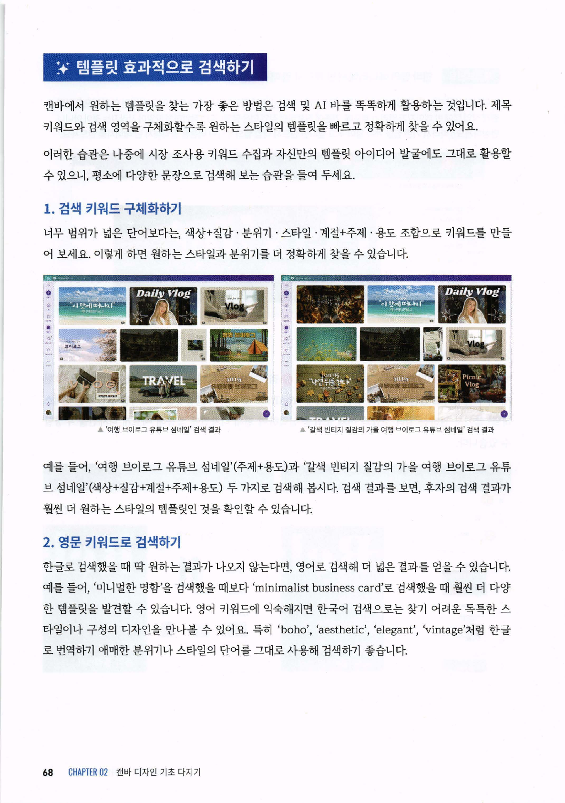

###### [

캔바에서 원하는 템플릿을 찾는 가장 좋은 방법은 검색 및 AI 바를 똑똑하게 활용하는 것입니다. 제목 키워드와 검색 영역을 구체화할수록 원하는 스타일의 템플릿을 빠르고 정확하게 찾을 수 있어요. 이러한 습관은 나중에 시장 조사용 키워드 수집과 자신만의 템플릿 아이디어 발굴에도 그대로 활용할 수있으니, 평소에 다양한문장으로검색해 보는습관을들여 두세요.

###### L 검색 키워드

###### 너무 범위가 넓은 단어보다는, 색상+질감 · 분위기 · 스타일 · 계절+주제 · 용도 조합으로 키워드를 만들

.;으:· .| "1

어 보세요. 이렇게 하면 원하는스타일과분위기를더 정확하게 찾을수있습니댜

든

_m

··•퀄 ’ .•e••

!

습. .;,·

-.. ....이.로. ,그~

c c

- •

^)

... ‘갈색 빈티지 질감의 가율 여행 브이로그 유튜브 섬네일’ 검색 결과

~ ‘여행 브이로그 유튜브 섬네일’ 검색 결과

예를 들어, ‘여행 브이로그 유튜브 섬네일’(주제+용도)과 ‘갈색 반티지 질감의 가을 여행 브이로그 유튜

브 섬네일’(색상+질감+계절+주제+용도) 두 가지로 검색해 봅시다. 검색 결과를 보면, 후자의 검색 결과가

훨씬 더 원하는 스타일의 템플릿인 것을 확인할 수 있습니다.

###### 2. 영문 키워드로 검색하기

한글로검색했을때 딱원하는결과가나오지 않는다면, 영어로검색해 더 넓은결과를얻을수있습니다.

예를 들어, ‘미니멀한 명함'을 검색했을 때보다 ‘minimalist business card’로 검색했을 때 훨씬 더 다양

한 템플릿을 발견할 수 있습니다. 영어 키워드에 익숙해지면 한국어 검색으로는 찾기 어려운 독특한 스

타일이나 구성의 디자인을 만나불 수 있어요. 특히 ‘boho', 'aesthetic', 'elegant', 'vintage'처럼 한글

로 번역하기 애매한 분위기나 스타일의 단어를 그대로 사용해 검색하기 좋습니다.

68 CHAPTER 02 캔바 디자인 기조 다지기

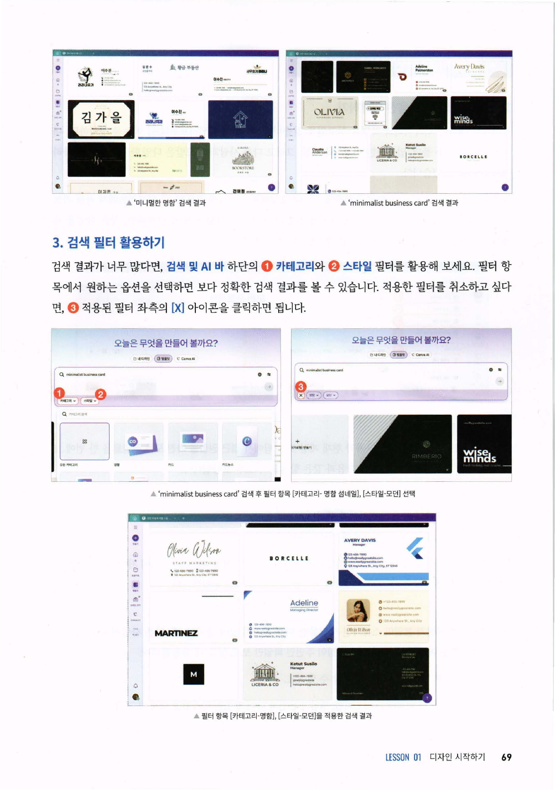

###### ...

--·

•

. t

###### ’‘)

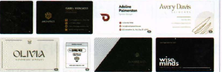

""m··’ U

^W5y IkI心

'’미µ』Ju,""'

아수권

··-·····-- Z’;

###### I==-:’ ’ ... ".8- t

- 0.o

>

[.E

lu • -

- -e
- --‘.C'-

남

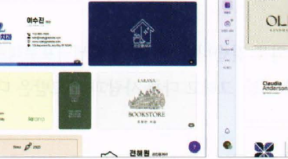

OLl\'l

이수건 -

모"

###### -·

i루.-

.fmf ,1,

I=-’

= |호=-=-

o.

IO•CELLE

###### •

O,"--

· "ll•..

.;. 'minimalist business card' 검색 결과

... ‘미니얼한 명함' 검색 결과

###### 3. 검색 필터

검색 결과가 너무 많다면, 검색 및 Al 바 하단의 O 와 O 스타일 필터를 활용해 보세요. 필터 항

목에서 원하는 옵션을 선택하면 보다 정확한 검색 결과를 볼 수 있습니다. 적용한 필터를 취소하고 싶다

면, O 적용된 필터 좌측의 아이콘을클릭하면 됩니다.

###### 오늘은 무엇을 볼까요?

e내U.. @ cc~”

###### • 零

0내야! @ ¢_시

Q........,.......~

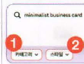

0 •

了

J

Q

\ 타 °

••~뻬 •• “ ".스 ]

@

+

,....기

- II •

'minimalist business card' 검색 후 필터 항목 [카테고라 영함 섬네일], ［스타일-모던 선택

o.Omf"L’,i`".0`"....

###### £

AV£AYOAVIS

###### ¢位낍{요

®

수―::

•

`•0m'""-- --“U°`、'＾,．n"^U--

IORCEllE

ei

＿’

. ie

”

###### 7

·

®··"........

Adeline

###### ·

€ l

0 -

• m··nn•. ""

0 ., _,., ....

0. -。--』－＇. 」

• ,내 ’, ,,, _

(山`”“'＂"＇

O ,藝-· 上_."...

###### 0· 壅二_

.. 필터 항목 [카테고리-영함], ［스타일-모던]을 적용한 검색 결과

###### LESSON 01 디자인 시작하기 69

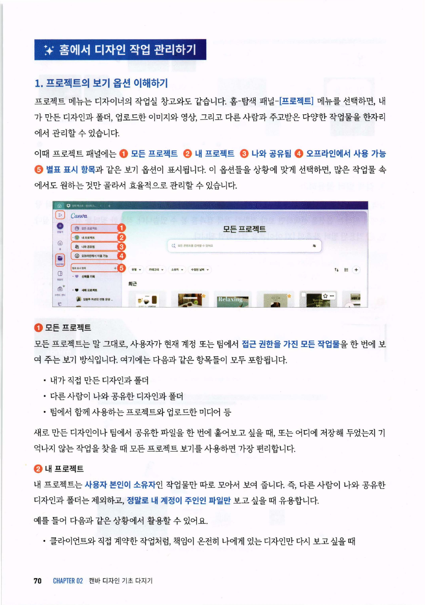

###### | :-f 홀에서 디자인 작업

###### 1. 보기 이해하기

프로젝트 메뉴는 디자이너의 작업실 창고와도 같습니다. 홈-탐색 패널-［프로젝트] 메뉴를 선택하면, 내 가 만든 디자인과 폴더, 업로드한 이미지와 영상, 그리고 다른 사람과 주고받은 다양한 작업물을 한자리 에서 관리할수있습니댜

O O 나와 O 사용

이때 프로젝트 패널에는 O O 표시 항목과 같은 보기 옵션이 표시됩니댜 이 옵션들을 상황에 맞게 선택하면, 많은 작업물 속

에서도원하는것만골라서 효율적으로관리할수있습니다.

G , + o

###### @ wa

"@. g

###### -

연 모ElLi1...

·I!··겉색••었어2

q

###### *

屯

@ 시‘’u,

###### "CB

B ,.v 카고리v

###### 노

" ：三 +

소뮤지 v 令륄던날.. v

·•

###### *@

·• ....프."

i

###### ; 1

L 딥""""일-

€

###### 모든프로젝트

모든 프로젝트는 말 그대로, 사용자가 현재 계정 또는 팀에서 가진 을 한 번에 보

여 주는 보기 방식입니다. 여기에는 다음과 같은 항목들이 모두 포함됩니댜

- • 내가 직접 만든 디자인과 폴더
- • 다른사람이 나와공유한디자인과폴더
- • 팀에서 함께 사용하는 프로젝트와 업로드한 미디어 등

새로 만든 디자인이나 팀에서 공유한 파일을 한 번에 훑어보고 싶을 때, 또는 어디에 저장해 두었는지 기

억나지 않는 작업을 찾을 때 모든 프로젝트 보기를 사용하면 가장 편리합니다.

내프로젝트 내 프로젝트는 인 작업물만 따로 모아서 보여 줍니다. 즉, 다른 사람이 나와 공유한 디자인과 폴더는 제외하고, 보고 싶을 때 유용합니다.

예를 들어 다움과 같은 상황에서 활용할 수 있어요.

• 클라이언트와 직접 계약한 작업처럼, 책임이 온전히 나에게 있는 디자인만 다시 보고 싶을 때

70 CHAPTER 02 캔바 디자인 기조다지기

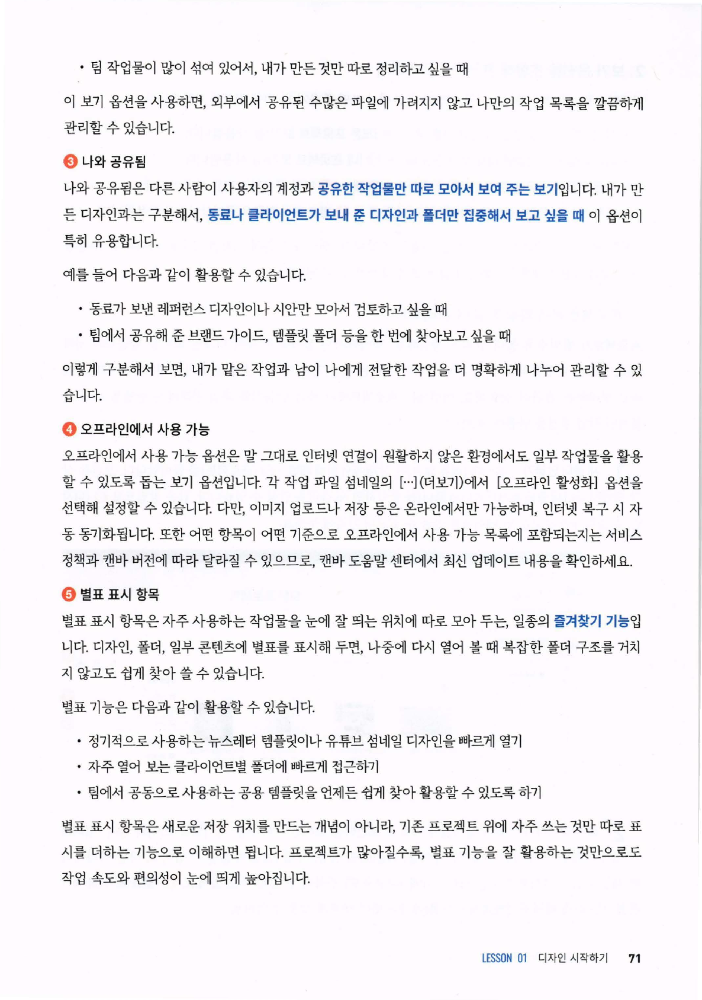

• 팀 작업물이 많이 석여 있어서, 내가 만든 것만 따로 정리하고 싶을 때

###### 이 보기 옵션을 사용하면, 외부에서 공유된 수많은 파일에 가려지지 않고 나만의 작업 목록을 깔끔하게

관리할수있습니다.

###### 나와공유됨

###### 나와 공유됨은 다른 사람이 사용자의 계정과 따로 모아서 보여 주는 보기입니다. 내가 만 든 디자인과는 구분해서, 클라이언트가 보내 준 디자인과 집중해서 보고 싶을 때 이 옵션이

특히유용합니댜

###### 예를 들어 다움과 같이 활용할 수 있습니다.

- • 동료가 보낸 레퍼런스 디자인이나 시안만 모아서 검토하고 싶을 때
- • 팀에서 공유해 준브랜드가이드, 템플릿 폴더 등을한번에 찾아보고싶을때

###### 이렇게 구분해서 보면, 내가 맡은 작업과 남이 나에게 전달한 작업을 더 명확하게 나누어 관리할 수 있

습니다.

###### O 오프라인에서 사용 가능

오프라인에서 사용 가능 옵션은 말 그대로 인터넷 연결이 원활하지 않은 환경에서도 일부 작업물을 활용 할 수 있도록 돕는 보기 옵션입니다. 각 작업 파일 섬네일의 […] （더보기)에서 [오프라인 활성화] 옵션을 선택해 설정할 수 있습니댜 다만, 이미지 업로드나 저장 등은 온라인에서만 가능하며, 인터넷 복구 시 자 동 동기화됩니다. 또한 어떤 항목이 어떤 기준으로 오프라인에서 사용 가능 목록에 포함되는지는 서비스

정책과 캔바 버전에 따라 달라질 수 있으므로, 캔바 도움말 센터에서 최신 업데이트 내용을 확인하세요.

###### 별표표시항목

별표 표시 항목은 자주 사용하는 작업물을 눈에 잘 띄는 위치에 따로 모아 두는, 일종의 즐겨찾기 기능입 니댜 디자인, 폴더, 일부 콘텐츠에 별표를 표시해 두면, 나중에 다시 열어 볼 때 복잡한 폴더 구조를 거치

지 않고도쉽게 찾아쓸수있습니댜

별표 기능은 다음과 같이 활용할 수 있습니다.

- • 정기적으로사용하는뉴스레터 템플릿이나유튜브섬네일 디자인을빠르게 열기
- • 자주열어보는클라이언트별폴더에빠르게접근하기
- • 팀에서 공동으로 사용하는 공용 템플릿을 언제든 쉽게 찾아 활용할 수 있도록 하기

별표 표시 항목은 새로운 저장 위치를 만드는 개념이 아니라, 기존 프로젝트 위에 자주 쓰는 것만 따로 표 시를 더하는 기능으로 이해하면 됩니댜 프로젝트가 많아질수록, 별표 기능을 잘 활용하는 것만으로도 작업 속도와 편의성이 눈에 띄게 높아집니댜

LESSON 01 디자인 시작하기 71

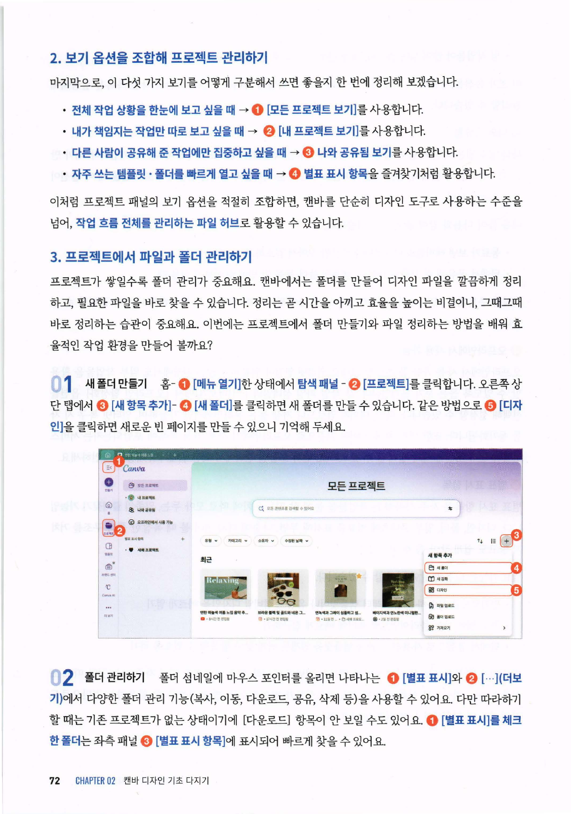

###### 2. 보기

마지막으로, 이 다섯 가지 보기를 어떻게 구분해서 쓰면 좋을지 한 번에 정리해 보겠습니다.

- • 작업 상황을 한눈에 보고 싶을 때 一O [모든 프로젝트 보기]를사용합니다.
- • 내가 책임지는 따로 보고 때 一 0 프로젝트 보기]를사용합니다.
- • 다른 사람이 공유해 준 작업에만 싶을 때 一O 나와 보기를사·용합니다.
- • 쓰는 • 빠르게열고 때 - o별표표시 을즐겨찾기처럼 활용합니다.

이처럼 프로젝트 패널의 보기 옵션을 적절히 조합하면, 캔바를 단순히 디자인 도구로 사용하는 수준을

넘어, 흐름 관리하는 히브로 활용할 수 있습니다.

###### 3. 프로젝트에서 파일과 관리하기

프로젝트가 쌓일수록 폴더 관리가 중요해요. 캔바에서는 폴더를 만들어 디자인 파일을 깔끔하게 정리

하고, 필요한 파일을 바로 찾을 수 있습니댜 정리는 곧 시간을 아끼고 효율을 높이는 비결이니, 그때그때

###### 바로 정리하는 습관이 중요해요. 이번에는 프로젝트에서 폴더 만들기와 파일 정리하는 방법을 배워 효

율적인 작업 환경을 만들어 볼까요?

###### 1 새폴더만들기 홈-O[메뉴열기]한상태에서 탐색패널-O[프로젝트]를클릭합니댜오른쪽상

단 탭에서 O - [새 를클릭하면 새 폴더를만들수있습니다. 같은방법으로 [디자

을 클릭하면 새로운 빈 페이지를 만들 수 있으니 기억해 두세요솔

色 모른 mt"

· 내.......

"지

@

Q 모른 겁미일 令었'""

*

屯 냐""

》 @ 익_사.쟈

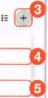

... •• 셰빼끄••

••"" + @

흡• v ”고리 v 소휴지 v ”던널빼 v

©* 최근

e 세.c

·麟

새길파

C

디때

... ."".""嶋...,....어.느륄•**-

8 ""드

”라`."..,신른‘.•“`ii도내그

....tfl”고•­

띠.1l­

印 配""i

• •,,＇단•••

lt • U. .e,...'m

舒 ""-'I

###### 2 폴더관리하기 폴더 섬네일에 마우스포인터를올리면 나타나는 O [별표표시]와O […］（더보

###### 기)에서 다양한 폴더 관리 기능(복사, 이동, 다운로드, 공유, 삭제 등)을 사용할 수 있어요. 다만 따라하기

할때는기존프로젝트가없는상태이기에 [다운로드] 항목이 안보일수도있어요. O

한폴더는좌측패널 O [별표표시 항목]에 표시되어 빠르게 찾을수 있어요을

72 CHAPTER 02 캔바 디자인 기조 다지기

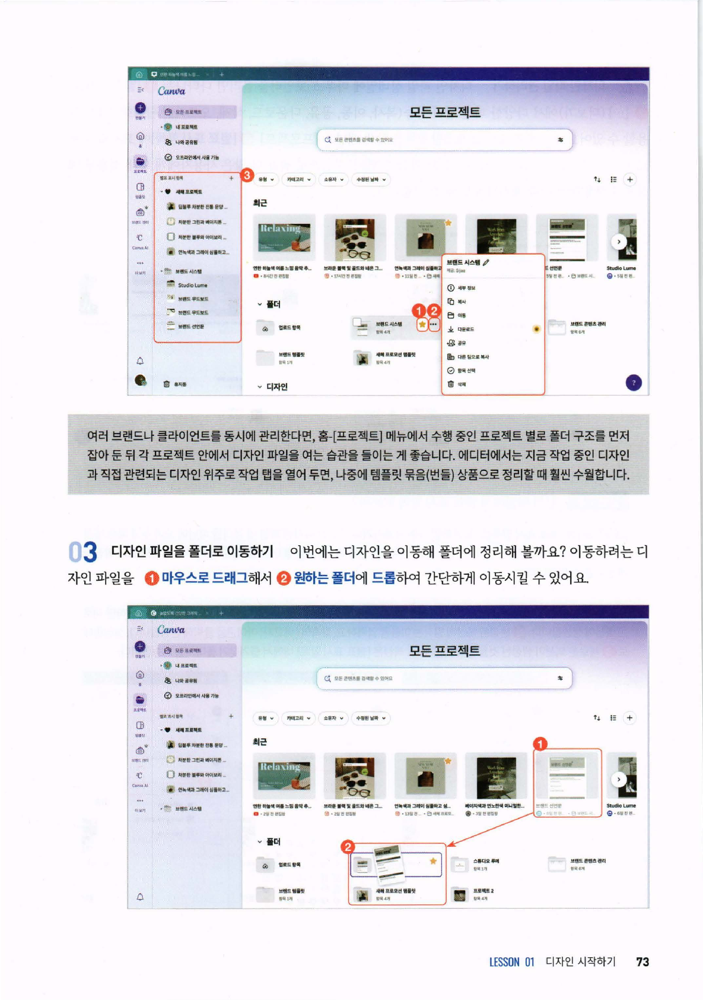

@ o +

-- -

• 연모른""

三 GmAl

..가

내.u"

G 모른른뺄SI‘색할* 었어•

*

###### ........ +

© 요먀鴻서서.”

’`" “떼고리v 소휴지¥ 수.휩닐빼v

t~ +

(]

###### ·• ....ll"

..팔

###### ..,... _

###### 최근

@., 느 ""IH~■H-

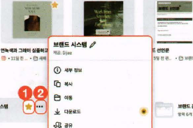

,C 묘·“磁먀-

r『F저^'

• 연｀빽국그嶋어일1”고

“” I .... 皇正팩스.

••S른 .e, •••., Ii·••··

d Stvdlou m"

• ·......... . .,,..,..”

연"｀．색아.느.".... tlll 혈 ·도네e1..

~ StudioL.ume

혈‘’

v

....

_: 브뺀드무으

###### L=_

•

보륄도시스•

0 업量드촬틀

••어

鳳量모신 • • ,

”뺀드 "'

》 다일으.`

••••

。

•••제

o ··선`

回 삭꽤

@ 할

v 디자인

롤 먼저

둔 각 게 디자인

과 수월합니다.

- 3 디자인파일을폴더로이동하기 이번에는디자인을이동해폴더에정리해볼까요?이동하려는디

자인 파일을 O 해서 원하는폴더에 하여 간단하게 이동시킬 수 있어요.

0 ·tS• ' ’,. …、

• 모emmL

三《

"'

. .. ll.11..

Q 모른근면은.길...+硏|2 *)

®

屯 냐곱류.

###### "..

© m

"" v "러 v 소" v "S날빼 v

n !三 +

뺄量量•“ +

###### ...

(]

· • 뻔표••

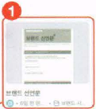

최근

@* 요"""""～

뺑틀C 웹 _

·'C ° """OIO!ll리

C·오^'

• 그빼어 실 2

•·崎.......아·느털•헉.U• － 브•11일률드 그- 연...“그일.＂고쉘- ... .-

'""'u""9-••··

더.기 . - .뺄드 시스"

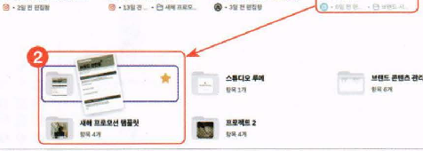

###### v 롤더

··“

o 얼혈틀

··“

。

LESSON 01 디자인 시작하기 73

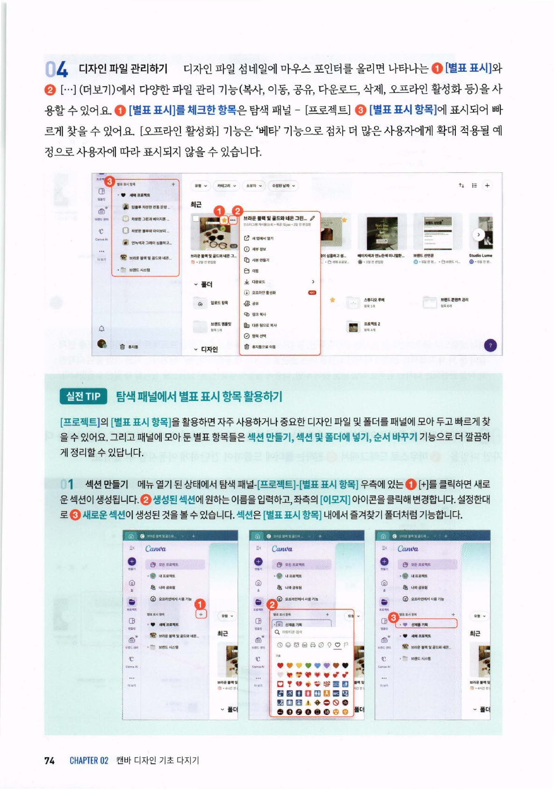

- 4 디자인파일관리하7 디자인파일 섬네일에 마우스포인터를올리면 나타나는O[별표표시]와

O […] （더보기)에서 다양한파일 관리 기능(복사, 이동, 공유, 다운로드, 삭제, 오프라인 활성화 등)을사

용할수있어요. 은탐색 패널 - ［프로젝트] 에 표시되어 뼈­

르게 찾을수있어요. [오프라인활성화] 기능은‘베타' 기능으로점차더 많은사용자에게 확대 적용될예

정으로사용자에 따라표시되지 않을수있습니다.

###### w. v

+

+

”

소흡사 ” "e 날빼 v

껴고려 v

`~ :::....._

###### 최근

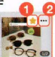

;*

_ /

현그린꽤빼어기른 _

',.,....마4 · •• ． 저""'"'

O 庫"...OfOI翼리-

'C

e ..:E를가

###### ;얀"'？："：책내e::,_I°t ... "서::,,

C도국^'

• 연`색꽤 그....ti.빼고-

###### ...

0····· ·0··도·I

Studio L"""'

~

.­

브리"""텍네e_

###### 9·••··

디볼',

. e,.....

• • 瓚뺑턴C·

e 이틀

. -

) O

土 다은포 ;••?:: 악따언111•

###### v 폴더

• 스"...

브뺀드른면츠간리

··l’,

..”

솔요 골9

。

..보웹드뺄,.

.......빼皇2

역》 밀크 ..시

•

e>다@틸"-"..사

。

°”선빽

@ m

回 m止끄 아를

v

- ]의 표시 을활용하면자주사용하거나중요한디자인파일잊폴더를패널에모아두고빠르게잦

을 수 그리고 둔 순서 더

.

1 섹션만들기 메뉴열기 상태에서 탐색 패널- 표시 우측에 있는O 새로

I—三《

에원하는 이름을입력하고,좌즉의 로 새로운섹션이생성된것을 볼수있습니다. 섹션은 [별표표시항목] 내에서 즐겨잦기폴더처럼기능합니다.

“|_

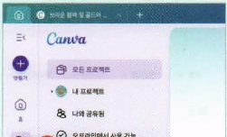

서‘가•’

@따

三(

0 5 @·

O i

.色....꼬""~.

연

꼬 a

###### g

g ggi

色 따:피,...

###### .

내

###### • 내ll...

®.

@

###### 屯@

5g

골리

###### --

###### •

###### 7 ..

a

###### ..-

....

g) 탸라인데서시a,,,.

© ""먀l에서사‘기.

;;

73

+

g

###### 면도

CB :

+)

...시 ..

.. 鳳시 ••

·,,.

••

- • • ""ll..므 宅 따瓚...｀ i!illl내~-
- • - "뺀도 시스.

Q ... ．강엑

w@ i

* .. ....묘.....

@

###### 최근

날

###### i

0©0eSOQ o p

###### ,•.. •••••••

•“','"' 들 """"되네욘_

져

-c

·'C

·C

뵤뺀시스•

C=_2”

c"`.N

오_-－- ＾'

###### ..,,

###### ...

’~f~

..

.

E2?”.‘ J

··기

”電저

0 I 숄 O O OO

v 폴더

v 플더

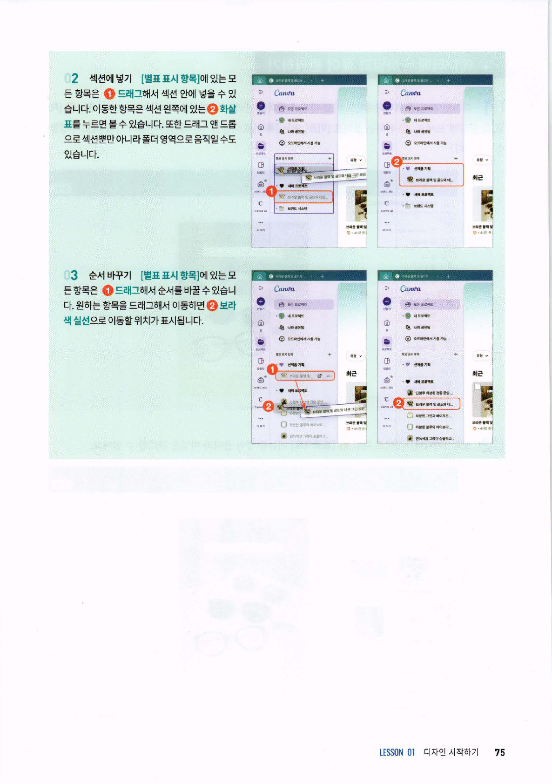

- 2 넣기 [별표표시 에 있는모

든 섹션 안에 수 있 습니다.

를 수 또한 드래그

- 3 순서 바꾸기 표시 항목] 있는 모

’

’’

Gmkl

m"

三

송

"'’

..가

.. .. 꼬빼..

내꼬"

@

@

츠

屯'"틸

###### .... ....... + 휴혈v

©

I...(] ·• 신,..,，•

I -__J

@낳 電·리은""".... 최근

켜 ....一― i 릅

.뺀‘ .. · "

'C .- Xt!도시스릴

..`{

!!다..`

| .;;

··거 一_~4

—

Gm"

三(

드《

다. 항목을 드래그해서 >보라

###### ••O•-

..,

연

던.기

‘’ 내꼬꼬

®

@

屯 냐”헉딜

屯 屯"따

###### ...... + 유틸v

@ 사흘""

”••

###### ...

###### ... ·•

+

v

###### CB

- • 신쾌틀 ’LLF

~ ... 최근

최근

@* 근'

@i · • 세.....빽

.른S ...

"틀’· 셸

딥•• －

4€0 & ·'" l L-

:"0 _

...탈꼴먹네온그린오던

처룬현 그런적寧거지른 _

###### ••기 ;얀2.1

。 ；；크

”" 曲""...,보리-

r‘- 연｀색국 xm싫 고

• 연여潟그데어

###### 01 디자인 시작하기 75

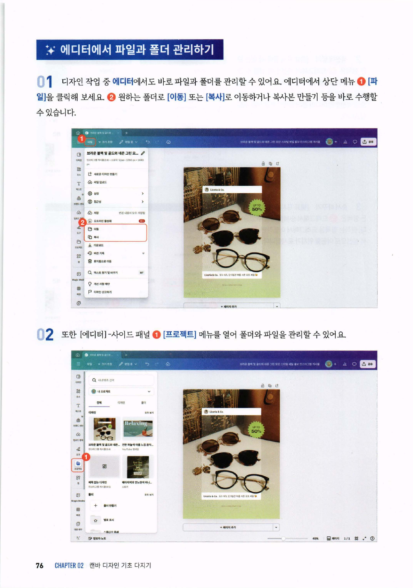

###### I 관리 |

###### 1 디자인 작업 중에디터에서도바로파일과폴더를관리할수있어요.에디터에서 상단메뉴O[파

을 클릭해 보세요. O 원하는 폴더로 또는 로 이동하거나 복사본 만들기 등을 바로 수행할

| .,,;= » G.l m1

먀.!!.라온톨 그린모,,

수있습니댜

q”엽認 ..현식",．專UIa•,•••n- ·lOOO ...l" a ® C

m g 세""口"＇I

•T °”"

~ ® "

."©... ® 접근셜

O 0 저같 내훑어 Al일11 ;.-&.··.; 으려 •설. C e OI틀

m .. °土머!li`

. 멈ml·타어틀

舒 € 버건기. *

-...Q左시.,..,

.,

13 Q 빼색촬기"무기

..

! • p 디짜心빼기

。

♦ 빼

###### 02 또한 [에디터]－사이드패널O[프로젝트] 메뉴를열어 폴더와파일을관리할수있어요

.... ..,';1"‘나',,.?r '"<.,., ••널 0 ,[ m |

Cllg

Q 내론만흔겁섹

a © C

認 •내 llQ

~' ‘

던嶋 디지

T

;::‘ ~ -

中짜 요•·기

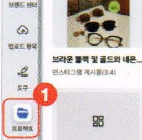

연한續．빼...느털•`-

v"'....．어

舒

일 q자인 嶋꾸지색꽤 던노던뻬 •I니_

연스"그.게서1“외 스••

··보까 山....‘C,, 읽k"'．＂"'..시.......

巳 止`

M..k -

• ”

+ 틀던가

0 ...量

.....

。

♦ “어지"

^．C』O..

' `· 尹뻘m냐 "" 1ii1 1/1 認 ." ® ’

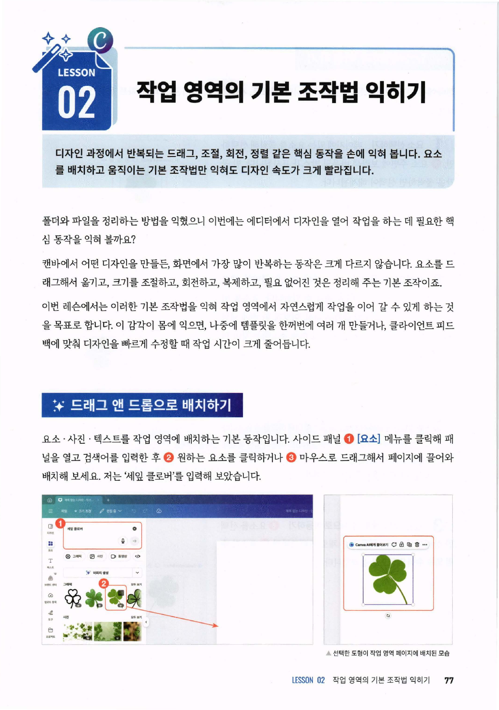

###### 작업 영역의 기븐 조작법 익히기

###### 디자인 반복되는 드래그, 조절, 회전, 익혀 봅니다. 요소

움직이는 기본 익혀도 디자인 속도가 크게 빨라집니다.

폴더와 파일을 정리하는 방법을 익혔으니 이번에는 에디터에서 디자인을 열어 작업을 하는 데 필요한 핵

심 동작을익혀 볼까요?

캔바에서 어떤 디자인을 만들든, 화면에서 가장 많이 반복하는 동작은 크게 다르지 않습니다. 요소를 드 래그해서 옮기고, 크기를 조절하고, 회전하고, 복제하고, 필요 없어진 것은 정리해 주는 기본 조작이죠.

이번 레슨에서는 이러한 기본 조작법을 익혀 작업 영역에서 자연스럽게 작업을 이어 갈 수 있게 하는 것

을목표로합니다. 이 감각이 몸에 익으면, 나중에 템플릿을한꺼번에 여러 개 만들거나, 클라이언트피드

백에 맞춰 디자인을 빠르게 수정할 때 작업 시간이 크게 줄어듭니다.

| |

요소 ·사진 ·텍스트를 작업 영역에 배치하는 기본 동작입니다. 사이드 패널 O [요소] 메뉴를 클릭해 패

널을 열고 검색어를 입력한후O 원하는 요소를 클릭하거나e 마우스로 드래그해서 페이지에 끌어와

배치해 보세요. 저는 ‘세잎 클로버'를 입력해 보았습니댜

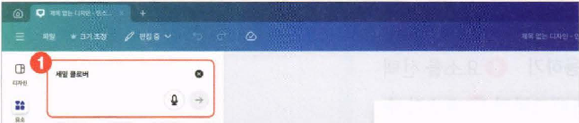

## 룔

O""齡l ca ©白 •••

0 ·`ti </>

고 0 사신

T

`·어어지쉘쉘

...‘ 그빼빼

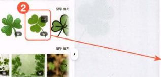

군 옮

,

서

`'

.... r讐

e .＊.,讐

선택한 도형이 작업 영역 페이지에 배지된 모습

###### LESSON 02 작업 영역의 기본 조작법 익히기 77

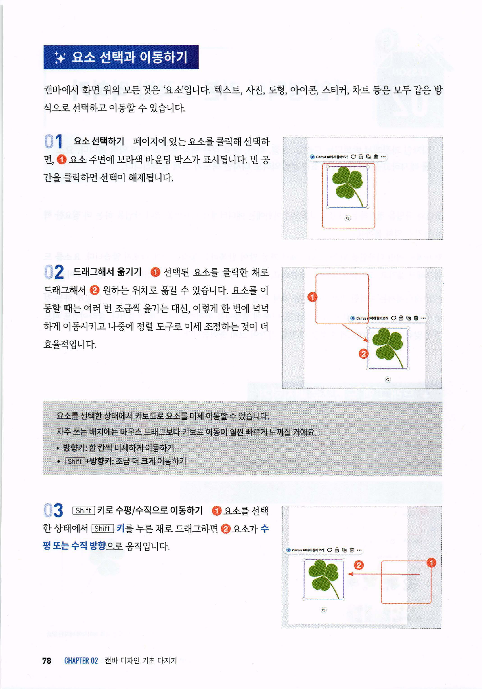

###### I |

캔바에서 화면 위의 모든 것은 ‘요소'입니다. 텍스트, 사진, 도형, 아이콘, 스티커, 차트 등은 모두 같은 방

식으로 선택하고 이동할 수 있습니다.

###### 1 요소선택하기 페이지에있는요소를클릭해선택하

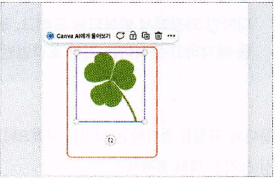

###### 면, 0 요소주변에보라색 바운딩 박스가표시됩니다.빈공

간을클릭하면 선택이 해제됩니다.

###### 2 드래그해서 옮기기 O 선택된 요소를클릭한 채로

###### 드래그해서 O 원하는 위치로 옮길 수 있습니다. 요소를 이

동할 때는 여러 번 조금씩 옮기는 대신, 이렇게 한 번에 넉넉 하게 이동시키고나중에 정렬 도구로미세 조정하는것이 더

야 ’에"@ O 8 @ •••

틀

효율적입니다.

()

.

•

###### 3 조피키로수평/수직으로이동하기 O요소를선택

###### 한 상태에서 匡쿄旦 키를 누른 채로 드래그하면 요소가 수

평또는수직방향으로움직입니다.

canv"＇예,,..追?I 0 a ® 맵 ...

틀°

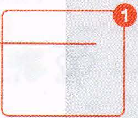

C)

78 CHAPTER 02 캔바 디자인 기조 다지기

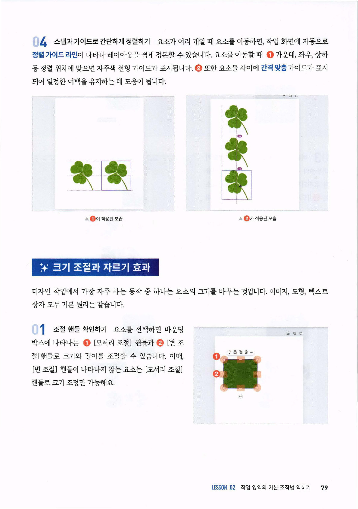

###### 4 스냅과가이드로간단하게정렬하기 요소가여러개일때요소를이동하면,작업화면에자동으로

###### 정렬 가이드라인이 나타나 레이아웃을 쉽게 정돈할수 있습니다. 요소를이동할 때 O 가운데, 좌우, 상하

###### 등정렬 위치에 맞으면 자주색 선형 가이드가표시됩니다. O 또한요소들사이에 간격 맞춤 가이드가표시

되어 일정한여백을유지하는데 도움이 됩니다.

틀

2

###### 틀룔〕

• 이적용된모습 ... 가적용된모습

|

디자인 작업에서 가장 자주 하는 동작 중 하나는 요소의 크기를 바꾸는 것입니다. 이미지, 도형, 텍스트

상자모두기본원리는같습니다.

- 1 조절 핸들 확인하기 요소를 선택하면 바운딩 '

박스에나타나는 O [모서리 조절] 핸들과O [변 조 「

###### a @ c

O rn le 9 ···

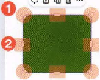

절]핸들로 크기와 길이를 조절할 수 있습니다. 이때,

[변조절] 핸들이 나타나지 않는요소는 [모서리 조절] 핸들로크기 조정만가능해요.

###### "

I

LESSON 02 작업 영역의 기본 조작법 익히기 79

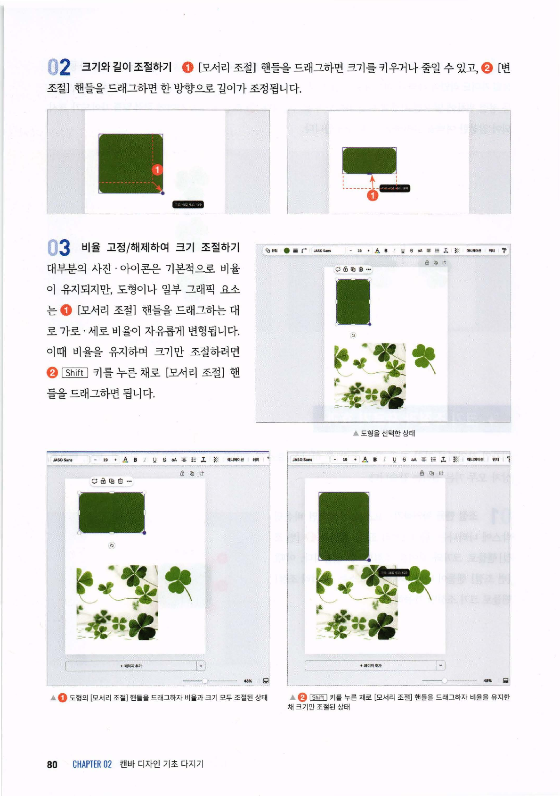

###### 02 크기와길이조절하기 O [모서리 조절] 핸들을드래그하면크기를키우거나줄일수있고,0 [변

조절] 핸들을드래그하면한방향으로길이가조정됩니다.

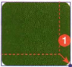

- L_-;-

###### 3

###### ,'

비율

크기 조절하기

고정/해제하여

안른밉 • ii r 』^".....

-n. 스 B l us .. 暮!三요휴 빼’"mg 硏

a © e

c a ©@ ..

대부분의 사진 · 아이콘은 기본적으로 비율

이 유지되지만, 도형이나 일부 그래픽 요소

###### 는 O [모서리 조절] 핸들을 드래그하는 대

7, 틀

”

###### 로가로 · 세로비율이 자유롭게 변형됩니다.

이때 비율을 유지하며 크기만 조절하려면

###### 0 麟 키를누른재로 [모서리 조절] 핸

‘

들을드래그하면 됩니다.

... 도형을선택한상태

`~

1. . 8 I !.! S 러 독 !三 i

###### 1. +

i

B I I.I 6 마 루 ;드 i

예나데아신

위치 JASO S미납

a @ e

8 떤 C

O 8 ® 펜 ...

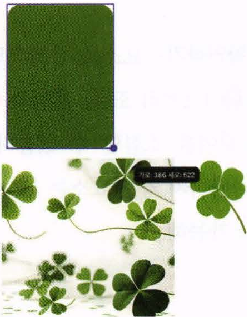

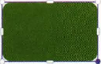

틀

"

I.

♦ 빼01지阜기

###### .." liil

令 빼어지후기 、'

느

41% 닳

一

1,.0 雲 키를 누른 재로 [모서리 조절] 핸들을 드래그하자 비율을 유지한

.&0 도형의 [모서리 조절] 핸들을 드래그하자 비율과 크기 모두 조절된 상태

재 크기만조절된상태

80 CHAPTER 02 캔바 디자인 기조다지기

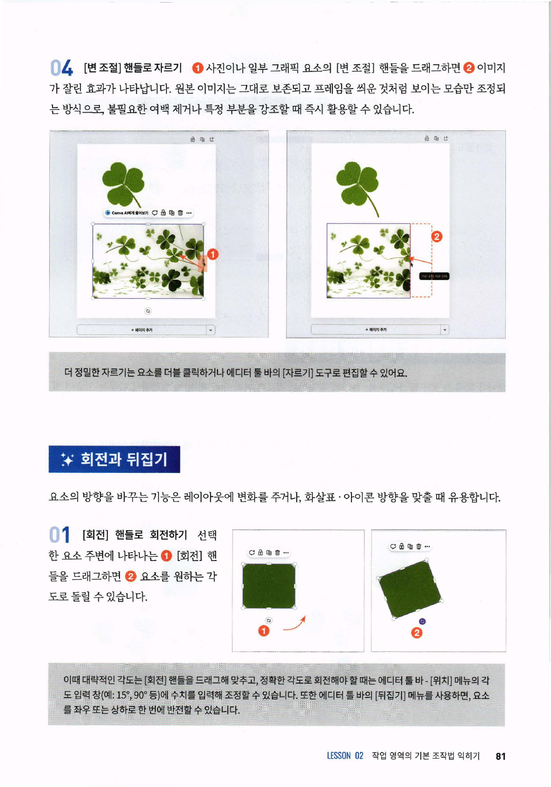

4 [변조절]핸들로자르기 O사진이나일부그래픽 요소의 [변조절] 핸들을드래그하면O이미지

가 잘린 효과가 나타납니다. 원본 이미지는 그대로 보존되고 프레임을 씌운 것처럼 보이는 모습만 조정되

는방식으로, 불필요한여백 제거나특정 부분을강조할때 즉시 활용할수있습니다.

##### 틀

iil IS 巳 a © C

틀~"""IOImI0&®@...

헌

?2 8*b

###### O ,

I^?근:

###### ••

캘

';',

###### ,0

###### 흔

,','

區 ••

__ 조

t

-~-=-노- ;

--'

-

느 -r-

_、

C)

♦

더 자르기는 요소를 툴 수

###### | |

요소의 방향을 바꾸는 기능은 레이아웃에 변화를 주거나, 화살표 · 아이콘 방향을 맞출 때 유용합니다.

###### 1

서」태「

[회전] 핸들로 회전하기

0 iil ~ 8 ...

c a@ @ ...

한 요소 주변에 나타나는O [회전] 핸 들을 드래그하면 O 요소를 원하는 각

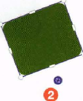

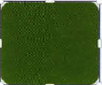

도로돌릴수있습니다.

0°

一

_

바-［위지] 메뉴의 각 도

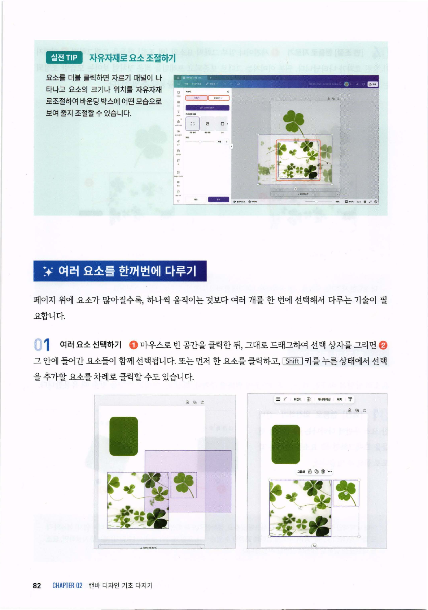

- 자유자재로요소

###### |‘0;-:: ,-·: c m|

나

###### -:”0 --~I` l 1

타나고 요소의 크기나 위지를 자유자재 로조절하여 바운딩 박스에 어떤 모습으로

;;:..e-

o .. e

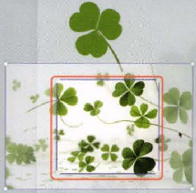

수 있습니다.

" .....

0 ,

###### .. .

”

e,

'~

I!

###### --e

•

..。

###### `· ..

0

·-"

- .i- '" •.• <D

- ...""o-

| 를 J

페이지 위에 요소가 많아질수록, 하나씩 움직이는 것보다 여러 개를 한 번에 선택해서 다루는 기술이 필 요합니댜

1 여러요소선택하기 마우스로빈공간을클릭한뒤,그대로드래그하여 선택 상자를그리면O

그 안에 들어간 요소들이 함께 선택됩니다. 또는 먼저 한 요소를 클릭하고, 匡쿄디 키를 누른 상태에서 선택 을 추가할 요소를 차례로 클릭할 수도 있습니다.

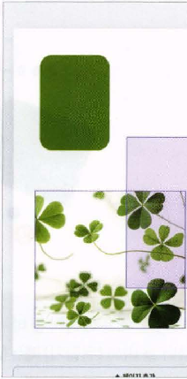

= r 血e,1 장 빼내m신 m T

a @ 巳

a ® C

그"' a ® @ ...

A!

###### 1~

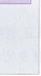

###### "

82 CHAPTER 02 캔바 디자인 기조 다지기

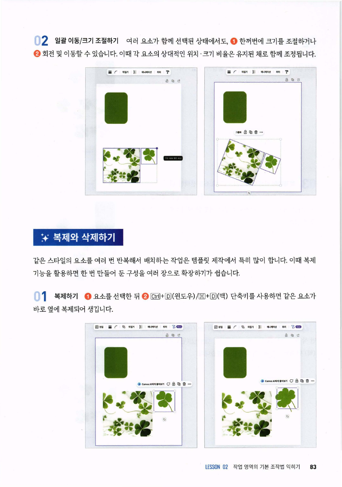

###### 2 일괄이동/크기조절하기 여러 요소가함께 선택된 상태에서도,O한꺼번에 크기를조절하거나

###### 0 회전 및 이동할수있습니댜 이때각요소의 상대적인 위치 ·크기 비율은유지된 채로함께 조정됩니다.

;; r 마집?I x. 빼내빼어선 硏 T

;; r ,i집기 곳 빼내"따j ml ,.

a @ e

a @ c

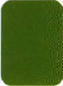

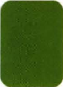

그.If a @ @·••

-

I

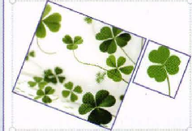

j 1

C>

###### | |

같은 스타일의 요소를 여러 번 반복해서 배치하는 작업은 템플릿 제작에서 특히 많이 합니다. 이때 복제

기능을 활용하면 한 번 만들어 둔 구성을 여러 장으로 확장하기가 쉽습니다.

###### 1 복제하기 O요소를선택한뒤 O臣댑+園(윈도우)／運]＋園(맥) 단축키를사용하면같은요소가

바로옆에 복제되어 생깁니다.

@ll밉 =r n 따밉?I 것. OIL!...1선 硏 ?co

@ml 급들 r t 위입기 ;: 빠뻬01선 위시 Tco

###### a @ c

a @ c

‘

0·서"釣~I 0 a © 而 •••

~”""tlOIJVl c a © @ ...

•

o

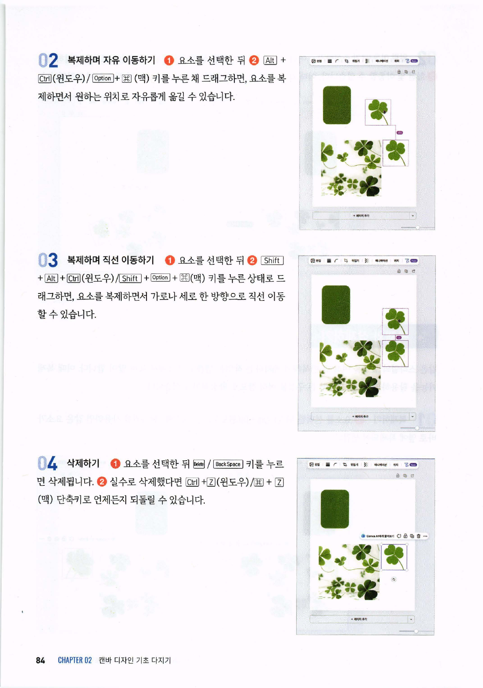

###### @m' =r u"＇기 X’ `. .. 'r.C!lt

’

###### 02 복제하며 자유 이동하기 O 요소를 선택한 뒤 O 因D +

a © l!

@（윈도우)/ 區귤丑 選] （맥) 키를 누른 채 드래그하면, 요소를 복

제하면서 원하는 위치로 자유롭게 옮길 수 있습니다.

들

”

-:."‘

• • 어지"

###### 03 복제하며 직선 이동하기 O 요소를선택한 뒤 O 匡텐口

@·· =r n 祖.,, >! .....아신 硏 T©

a 11!l C

###### +因0+ 草(윈도우)尺近떠+區군丑 選(맥) 키를누른상태로드

래그하면, 요소를 복제하면서 가로나 세로 한 방향으로 직선 이동 할수있습니댜

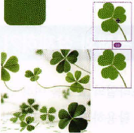

* ．

###### 4 삭제하기 O요소를선택한뒤 -j/공군굳갑키를누르

@던릴 릅: r t "‘기 X 빽*,'"' ＂지 T -

iil 여 C

면 삭제됩니댜 O 실수로 삭제했다면 回테+ll](윈도우)/選 +띠

~"""硏"＇’o a®덟...

(맥) 단축키로 언제든지 되돌릴 수 있습니다.

% ',

·-·가

84 CHAPTER 02 캔바 디자인 기조 다지기

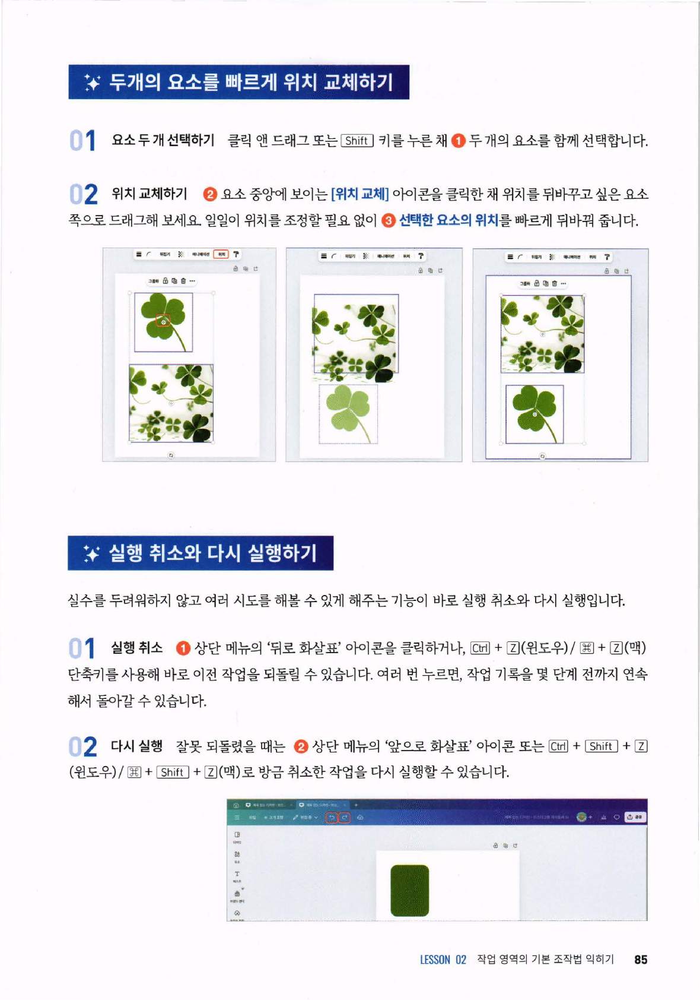

###### | 빠르게 |

01 요소두개선택하기 클릭앤드래그또는區교디 키를누른채O두개의요소를함께선택합니댜 2 위지교제하기 O요소중앙에보이는[위지교체]아이콘을클릭한채위치를뒤바꾸고싶은요소

쪽으로드래그해보세요 일일이 위치를조정할필요없이 를빠르게 뒤바꿔 줍니다.

롤

: r .., 32 - ~ ? ---

즐 r 曲기덧_ ... ?

三 r·" % ·"" .. ?

a Ill C

a S C

iii O C

,.. 여 0···

,•• a © 0 ···

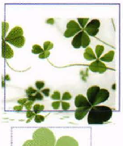

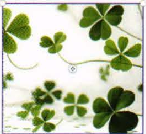

틀

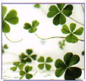

렬틀 |

。 C)

###### 실행 |

실수를 두려워하지 않고 여러 시도를 해볼 수 있게 해주는 기능이 바로 실행 취소와 다시 실행입니다.

1 실행쥐소 O상단메뉴의 ‘뒤로화살표'아이콘을클릭하거나』垣]+ 따(윈도우)／運]+@(맥)

단축키를사용해 바로이전 작업을되돌릴수있습니다. 여러 번누르면, 작업 기록을몇 단계 전까지 연속

해서돌아갈수있습니댜

2 다시 실행 잘못되돌렸을때는 O상단메뉴의 ‘앞으로화살표' 아이콘또는回챕+ 匡교디+己

(윈도우)／ 選l + 匡덴디 + m(맥)로 방금취소한 작업을다시 실행할수 있습니다.

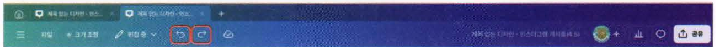

CBf

誌 a o e

3

T

.....‘

G

LESSON 02 작업 영역의 기본 조작법 익히기 85

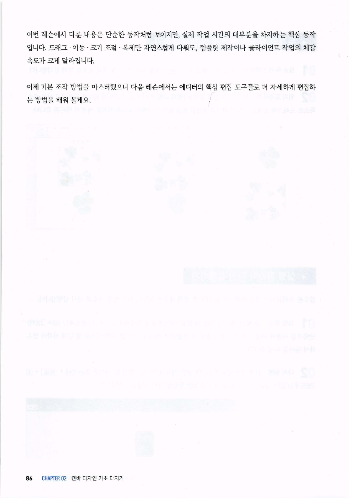

이번 레슨에서 다룬 내용은 단순한 동작처럼 보이지만, 실제 작업 시간의 대부분을 차지하는 핵심 동작 입니다. 드래그 · 이동 · 크기 조절 · 복제만 자연스럽게 다뤄도, 템플릿 제작이나 쿨라이언트 작업의

속도가크게달라집니댜

###### 는방법을배워볼게요. r

이제 기본 조작 방법을 마스터했으니 다음 레슨에서는 에디터의 핵심 편집 도구들로 더 자세하게 편집하

86 CHAPTER 02 캔바 디자인 기조 다지기

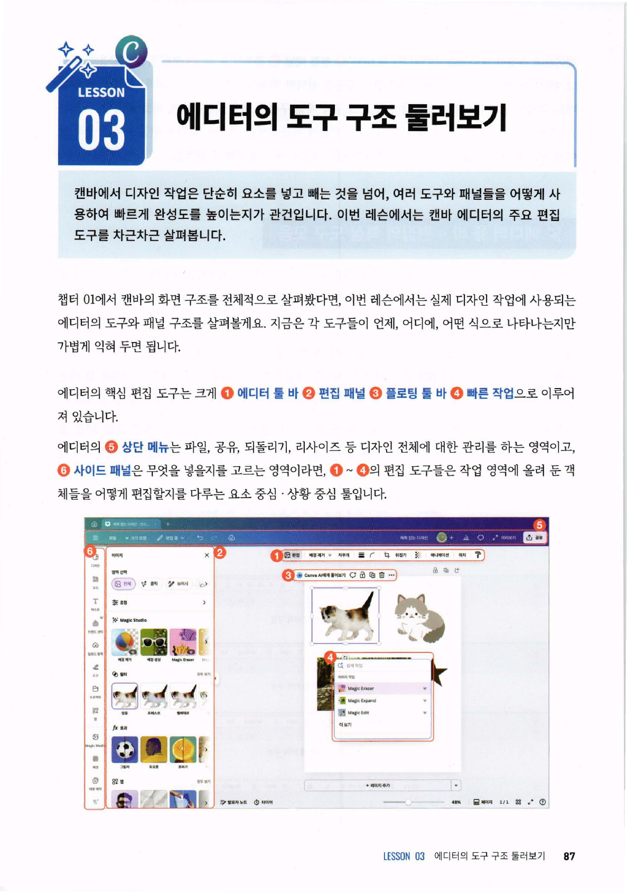

###### 구조 틀러보기

캔바에서 디자인 단순히 요소를 넣고 빼는 것을 넘어, 여러 도구와 패널들을 사 용하여 빠르게 높이는지가 관건입니다. 이번 레슨에서는 편집

도구를 차근차근 살펴봅니다.

챕터 01에서 캔바의 화면 구조를 전체적으로 살펴봤다면, 이번 레슨에서는 실제 디자인 작업에 사용되는

에디터의 도구와 패널 구조를 살펴볼게요. 지금은 각 도구들이 언제, 어디에, 어떤 식으로 나타나는지만 가볍게 익혀 두면 됩니다.

###### 에디터의 핵심 편집 도구는크게 O 에디터 툴 바 패널 툴 바 빠른작업으로이루어

져 있습니다.

에디터의 O 메뉴는 파일, 공유, 되돌리기, 리사이즈 등 디자인 전체에 대한 관리를 하는 영역이고, O 사이드 은 무엇을 넣을지를 고르는 영역이라면, 0 ~ 의 편집 도구들은 작업 영역에 올려 둔 객

체들을 어떻게 편집할지를 다루는 요소 중심 · 상황 중심 툴입니댜

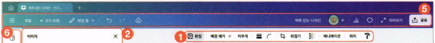

###### 기 a

@ e

”선. 。 0 a 읽 @ …) 誌 @ t •힉 / ..叫 o)

...T *”

|…4격J

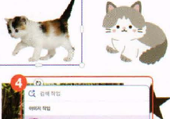

..蟲,... 圈 疆| ) | ~ |

* , .."kSmao

###### .....。

빼1C 빼•• "뻬:lc: tr- M

.,4 Q마’

,． M기

,... *

R다다’) | :;:：：：

e,

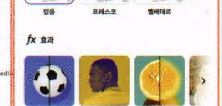

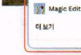

g

•.. 그릴의 ·오른 ••,

'...u

###### 0 i ··"|

T. 」

..구.. ,0 丘r/ F「) "m꼬 0~ )

닳 ｀니지 1/1 誌 «“

LESSON 03 에디터의 도구 구조 둘러보기 87

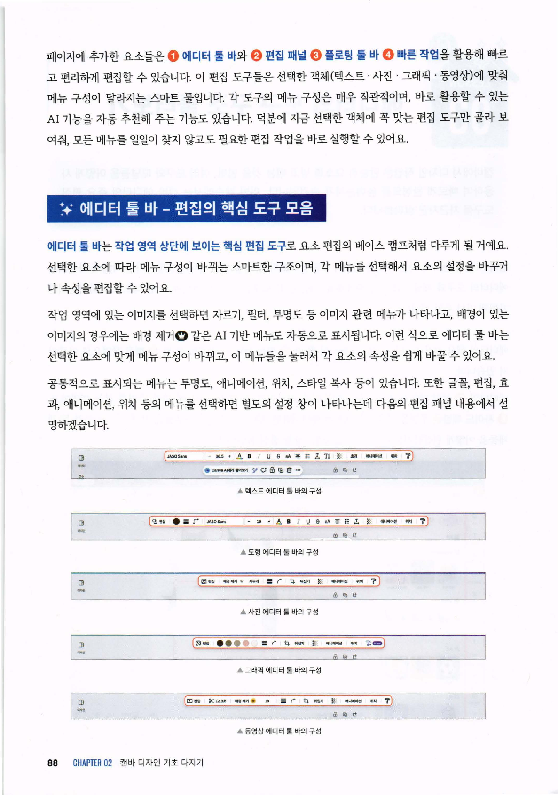

###### 페이지에 추가한 요소들은 O 에디터 바와 O 편집 패널 O 플로팅 툴 바 O 빠른 작업을 활용해 빠르

###### 고 편리하게 편집할 수 있습니댜 이 편집 도구들은 선택한 객체(텍스트 · 사진 · 그래픽 · 동영상)에 맞춰

메뉴 구성이 달라지는 스마트 툴입니다. 각 도구의 메뉴 구성은 매우 직관적이며, 바로 활용할 수 있는

###### AI 기능을 자동 추천해 주는 기능도 있습니댜 덕분에 지금 선택한 객체에 꼭 맞는 편집 도구만 골라 보

여줘, 모든 메뉴를 일일이 찾지 않고도 필요한 편집 작업을 바로 실행할 수 있어요.

###### | - |

에디터 툴 바는 작업 영역 상단에 보이는 핵심 편집 도구로 요소 편집의 베이스 캠프처럼 다루게 될 거예요.

###### 선택한 요소에 따라 메뉴 구성이 바뀌는 스마트한 구조이며, 각 메뉴를 선택해서 요소의 설정을 바꾸거

나속성을편집할수있어요.

작업 영역에 있는 이미지를 선택하면 자르기, 필터, 투명도 등 이미지 관련 메뉴가 나타나고, 배경이 있는

이미지의 경우에는 배경 제거O 같은 AI 기반 메뉴도 자동으로 표시됩니다. 이런 식으로 에디터 툴 바는

선택한 요소에 맞게 메뉴 구성이 바뀌고, 이 메뉴들을 눌러서 각 요소의 속성을 쉽게 바꿀 수 있어요.

공통적으로 표시되는 메뉴는 투명도, 애니메이션, 위치, 스타일 복사 등이 있습니다. 또한 글꼴, 편집, 효

과, 애니메이션, 위치 등의 메뉴를 선택하면 별도의 설정 창이 나타나는데 다음의 편집 패널 내용에서 설

명하겠습니다.

(JASQs.n, - "5* 스 B u e a 字 !三 !. n x m

- e
- f

###### '/ c a®덤... iil @ e `

빼t"＂1t!

~ 텍스트 에디 터 툴 바의 구성

###### (인따 •=r JASOS"닙 lll • II I l.! S aA ::: ：드 i x

'

ef

빼L"＂1닌 "지 ?

a @ c

.

~ 도형 에디터 틀 바의 구성

'

ef

%

###### c 二

( W 자우게 들 r n 따깁기

a " '1')

.

~ 사진 에디터틀바의 구성

'

###### (＠印 ••• =r 다 ~1171

%

Ol f

###### ”

빼tl빼

iii E

.

~ 그래픽 에 디터 톰 바의 구성

###### 口

미

=r 다 위리기

%

0 릅집 氷그3皇 빼곁"" • 1翼

뻬'“ti "지

###### a © E

... 동영상 에디터 툴 바의 구성

88 캔바 디자인기조다지기

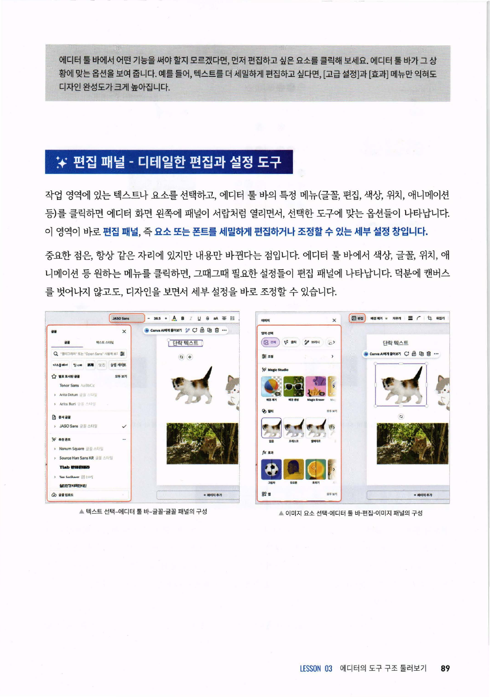

. 바가 그 상 더 [

###### | I

작업 영역에 있는 텍스트나 요소를 선택하고, 에디터 툴 바의 특정 메뉴(글꼴, 편집, 색상, 위치, 애니메이션 등)를 클릭하면 에디터 화면 왼쪽에 패널이 서랍처럼 열리면서, 선택한 도구에 맞는 옵션들이 나타납니다.

이 영역이 바로 , 즉 수

중요한 점은, 항상 같은 자리에 있지만 내용만 바뀐다는 점입니댜 에디터 툴 바에서 색상, 글꼴, 위치, 애 니메이션 등 원하는 메뉴를 클릭하면, 그때그때 필요한 설정들이 편집 패널에 나타납니다. 덕분에 캔버스 를 벗어나지 않고도, 디자인을 보면서 세부 설정을 바로 조정할 수 있습니다.

... )- ,... ♦ 스 ’ - u s 러 零 ;三 •

x ..혈m w ....,. 云 r u "1P1

어

c.,,,,.--,•;, o al ~ 9 ···

###### "

X

" d

###### " ... ~.._. o>

| 스트 .

단릭텍스트

" "스따

Q .•,.그리"~~·o..n"m1""皇

~W•""....,, O iil Cs 9 ···

'l +

蓬 조.

###### ,-......

d소t.... 일.,. .鏞 £& 숄튈 세라모

―c,」

쇼 모루"'

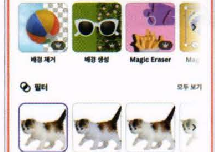

###### L..

Teno< SaM Cc

스

, N"'Dotun

J/

’ ^dta&m

.r

D "ff

v

二

二

.. ..^. .

> JASO S... I스타일

’“른量

###### kmE-

> ""n오pr. > Sourc•HonSansKR 기일

Tlab 廳."-

’ 널-1-II -· iI ,,.i

l|O글볼업_~~....

###### 그.. ••• ..""

三

舒옐 ""'

♦ 빼

^텍스트선택-에디터 툴 바-글꼴-글꼴패널의 구성

~ 이 미지 요소 선택-에디터 툴 바-편집-이 미지 패널의 구성

###### LESSON 03 에디터의 도구 구조 둘러보기 89

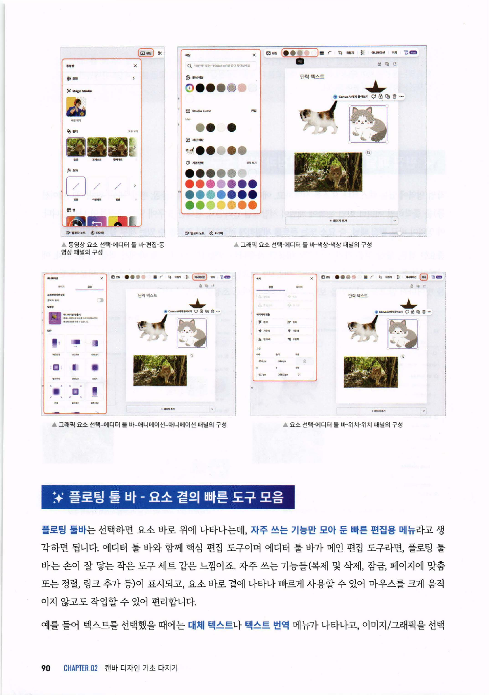

###### " x @른륄 (•••<)= r n .釣 8 `"澤 "" T

@ g

•

###### "‘ a @ c

Q ,"CT

X

'.+}····

SE...,

스트

~"""..,"'』o a

:-o:-......

® O •••

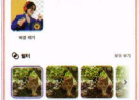

으 “다0Um m:

때때•• •

# ~"C,,••···...,,

()

二

•••••••••••••••••••••

•• ..... T·II

###### 曰.. ...../ /..

hm

###### 었•

###### •....지”

O 쩌어

O

~ 그래픽 요소 선택-에디터 툴 바-색상-색상 패널의 구성

~ 동영상 요소 선택-에디 터 틀 바-편집-동

영상 패 널의구성

F- .. 파.." " : r n- ..-,CD

xl 旺 • • 三 r n _ ,; _ O "...

a • C

”

& • C

····’lU"

... .> 』

단릭덱스!!

릭텍스트

###### .,_..

~.... ...,,』。 ®흡•••

###### .II'"....

--- 0 @111 e ••·

###### .............

ti : ::

l

-

0

툴疆

-'.. ..

Cl」 I

‘"..

###### ·-..

I

~ 그래픽 요소 선택-에디터 틀 바-애니메이션-애니메이션 패널의 구성

~ 요소 선택-에디터 툴 바우|지-위 지 패널의 구성

###### |

는 선택하면 요소 바로 위에 나타나는데, 자주 쓰는 기능만 모아 빠른 메뉴라고 생 각하면 됩니다. 에디터 툴 바와 함께 핵심 편집 도구이며 에디터 툴 바가 메인 편집 도구라면, 플로팅 툴 바는 손이 잘 닿는 작은 도구 세트 같은 느낌이죠. 자주 쓰는 기능들(복제 및 삭제, 잠금, 페이지에 맞춤 또는 정렬, 링크 추가 등)이 표시되고, 요소 바로 곁에 나타나 빠르게 사용할 수 있어 마우스를 크게 움직 이지 않고도 작업할 수 있어 편리합니다.

예를 들어 텍스트를 선택했을 때에는 나 텍스트 번역 메뉴가 나타나고, 이미지 /그래픽을 선택

90 CHAPTER 02 캔바 디자인 기조 다지기

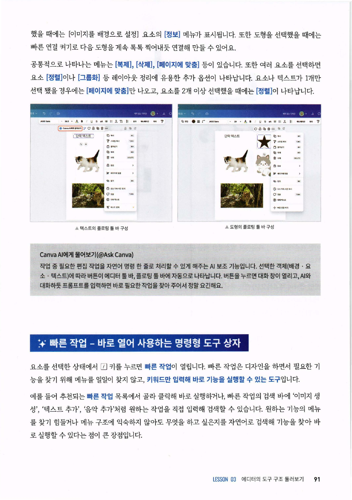

###### 했을 때에는 [이미지를 배경으로 설정] 요소의 [정보] 메뉴가 표시됩니댜 또한 도형을 선택했을 때에는

빠른 연결 켜기로 다음 도형을 계속 톡톡 찍어내듯 연결해 만들 수 있어요.

공통적으로 나타나는 메뉴는 [복재], ［페이지에 등이 있습니다. 또한 여러 요소를 선택하면 요소 이나 등 레이아웃 정리에 유용한 추가 옵션이 나타납니다. 요소나 텍스트가 1개만 선택 됐을 경우에는 만 나오고, 요소를 2개 이상 선택했을 때에는 [정렬]이 나타납니다.

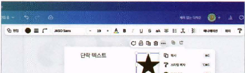

- ..... 스 I US .. ,.;a.r.n3: ..

US 다事 I:i 효

~ … ] Ciii®0.~ a Ill C

###### ::

o a o 솔 ••• Ill I!

*o ..도

T^..~

1 ` Ol』

*

스트

r翼

…..

oO I*‘.. ’

" +

-i

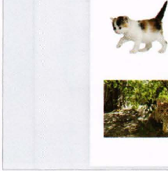

9 ••

o""

8 ••

`‘..,冒-··..

=. I!)..

='． 소.、

i!) ..

`

ir-..

-

###### 。........,....

###### 。.........서

역

###### o" `..

0 •• "..

® ......

O 여또

二

.......＂기

핫 •석!..

E 도형의플로팅 툴 바 구성

^텍스트의 플로팅 톨바구성

· 요 소 · 바, 누르면

###### | 도 |

요소를 선택한 상태에서 띠 키를 누르면 빠른 이 열립니다. 빠른 작업은 디자인을 하면서 필요한 기 능을 찾기 위해 메뉴를 일일이 찾지 않고, 입력해 바로 기능을 수 도구입니다. 예를 들어 추천되는 빠른 목록에서 골라 클릭해 바로 실행하거나, 빠른 작업의 검색 바에 ‘이미지 생

성’, 텍스트 추가', ‘음악 추가'처럼 원하는 작업을 직접 입력해 검색할 수 있습니다. 원하는 기능의 메뉴 를 찾기 힘들거나 메뉴 구조에 익숙하지 않아도 무엇을 하고 싶은지를 자연어로 검색해 기능을 찾아 바 로 실행할 수 있다는 점이 큰 장점입니댜

LESSON 03 에디터의 도구 구조 둘러보기 91

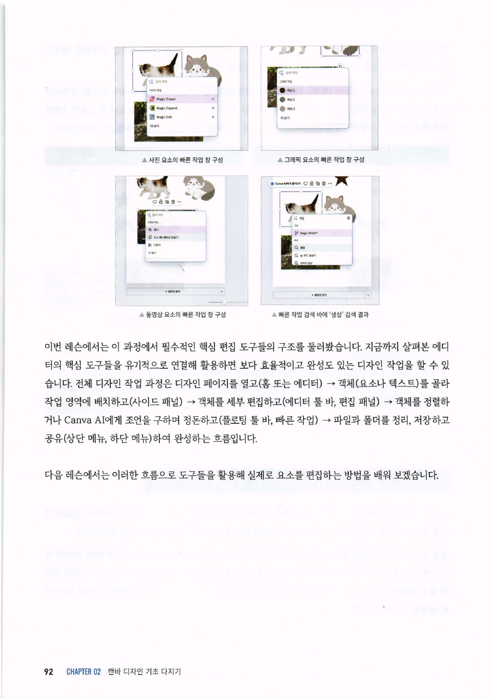

-1~ 7

###### Q""

###### I .,,~-~""

그터...

###### ••...,2...,1

―켜 -m

’

·· -"""'

• 뻬ti3

M"'d•

더"'’

__J

... 사진 요소의 빠른 작업 장구성

..t. 그래픽 요소의 빠른작업 장 구성

!7JI....스.

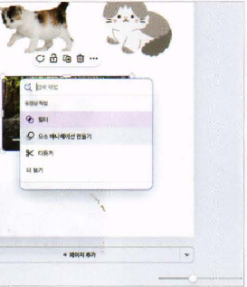

「―一1..,,~ -8 ···

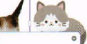

q I·’‘

소

一..

'

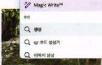

" ··-어선"'’

###### ."

K G"'

###### — ·..."

••텍피"

... 빠른 작업 검색 바에 ‘생성’ 검색 결과

^ 동영상요소의 빠른작업 장구성

이번 레슨에서는 이 과정에서 필수적인 핵심 편집 도구들의 구조를 둘러봤습니다. 지금까지 살펴본 에디

터의 핵심 도구들을 유기적으로 연결해 활용하면 보다 효율적이고 완성도 있는 디자인 작업을 할 수 있

습니다. 전체 디자인 작업 과정은 디자인 페이지를 열고(홈 또는 에디터) 一 객체(요소나 텍스트)를 골라

작업 영역에 배치하고(사이드 패널) 一 객체를 세부 편집하고(에디터 툴 바, 편집 패널) 一 객체를 정렬하

거나 Canva AI에게 조언을 구하며 정돈하고(플로팅 툴 바, 빠른 작업) 一 파일과 폴더를 정리, 저장하고

공유(상단 메뉴, 하단 메뉴)하여 완성하는 흐름입니다.

다움 레슨에서는 이러한 흐름으로 도구들을 활용해 실제로 요소를 편집하는 방법을 배워 보겠습니다.

92 CHAPTER 02 캔바 디자인 기조 다지기

