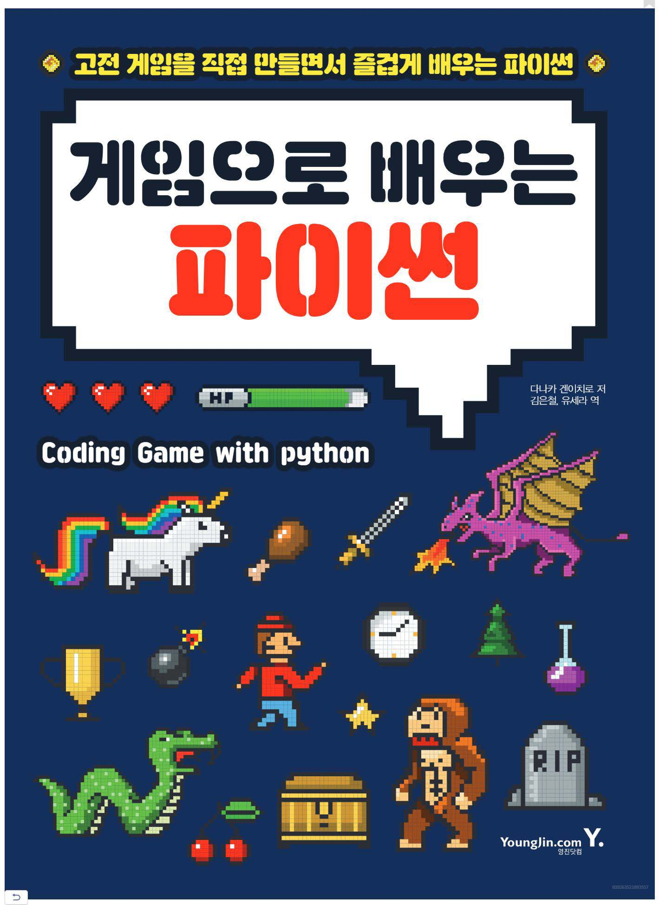

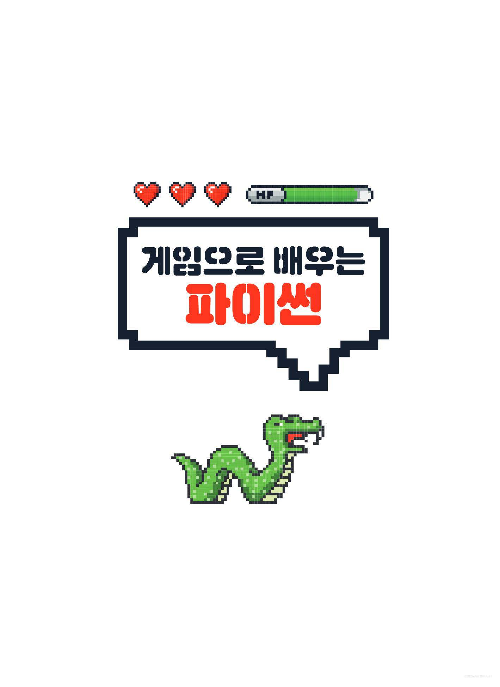

`.

웰' 宅 효

11::1--~ 1111- 노

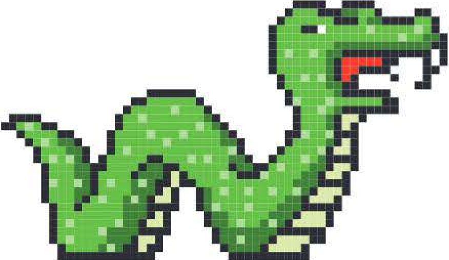

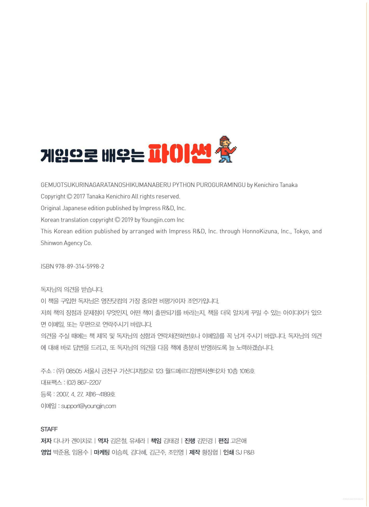

GEMUOTSUKURINAGARATANOSHIKUMANABERU PYTHON PUROGURAMINGU by Kenichiro Tanaka Copyright © 2017 Tanaka Kenichiro All rights reserved. Original Japanese edition published by Impress R&D, Inc. Korean translation copyright © 2019 byYoungjin.com Inc This Korean edition published by arranged with Impress R&D, Inc. through HonnoKizuna, Inc., Tokyo, and Shinwon Agency Co.

###### ISBN 978-89-314-5998-2

독자님의 의견을 받습니댜 이 책을 구입한 독자님은 영진닷컴의 가장 중요한 비평가이자 조언가입니다. 저희 책의 장점과 문제점이 무엇인지, 어떤 책이 출판되기를 바라는지, 책을 더욱 알차게 꾸밀 수 있는 아이디어가 있으 면 이메일. 또는 우편으로 연락주시기 바랍니다. 의견을 주실 때에는 책 제목 및 독자님의 성함과 연락처(전화번호나 이메일滑尸 꼭 남겨 주시기 바랍니다. 독자님의 의견 에 대해 바로 답변을 드리고. 또 독자님의 의견을 다음 책에 충분히 반영하도록 늘 노력하겠습니다.

주소 : （우) 08505 서울시 금천구 가산디지털쵸립 123 월드메르디앙벤처센터2j,~ 10층 1016호

대표팩스 :(02)867—2207

등록 : 2007. 4. 27. 제16-4189호 이메일 : support@youngjin.com

STAFF

저자 다나카 겐이치로 | 역자 김은철, 유세라 | 책임 김태경 | 진행 김민경 | 편집 고은애 영업 박준용, 임용수 | 마케팅 이승희, 김다혜, 김근주, 조민영 | 제작 황장협 | 인쇄 SJ P&B

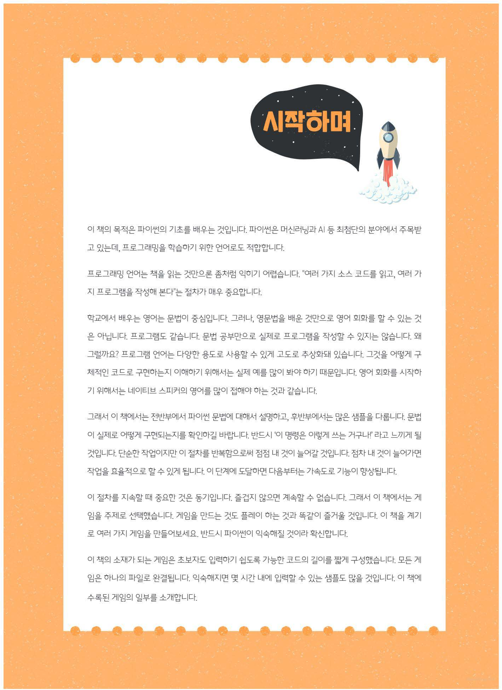

&0

.....

이 젝의 목적은 파이썬의 기조를 배우는 것입니다. 파이썬은 머신러닝과 Al 등 조1점단의 분야에서 주목받

고 있는데, 프로그래밍을 막습하기 우1만 언어로도 적압압니다.

프로고래밍 언어는 잭올 읽는 것만으론 좀처럼 익이기 어렵습니다. ＂여러 가지 소스 코드를 읽고, 여러 가

###### 지 프로그램을 작성애 본다’’는 절차가 매우 중요압니다.

막교에서 배우는 영어는 문법이 중심입니다. 그러나, 영문법을 배운 것만으로 영어 회화를 말 수 있는 것

은 아닙니다. 프로고램도 같습니다. 문법 공부만으로 실제로 프로고램을 작성말 수 있지는 않습니다. 왜

그럴까요? 프로그램 언어는 다양만 용도로 사용말 수 있게 고도로 주상화돼 있습니다. 고것을 어떻게 구

제적인 코드로 구연아는지 이애아기 위애서는 실제 예를 많이 봐야 아기 때문입니다. 영어 외화를 시작아

기 워애서는 네이티브 스피커의 영어를 많이 접애야 아는 것과 같습니다.

###### 그래서 이 책에서는 전반부에서 파이썬 문법에 대에서 설명아고, 후반부에서는 많은 샘플을 다룹니다. 문법

이 실제로 어떻게 구면되는지를 왁인아길 바랍니다. 반드시 ‘이 명령은 이렇게 쓰는 거구나I' 라고 느끼게 될

것입니다. 단순안 작업이지만 이 절차를 반복암으로써 점점 내 것이 늘어갈 것입니다. 점자 내 것이 늘어가면

작업을 표율적으로 알 수 있게 됩니다. 이 단계에 도달아면 다움부터는 가속도로 기능이 앙상됩니다.

이 절자를 지속말 때 중요만 것은 동기입니다. 즐겁지 않으면 계속말 수 없습니다. 고래서 이 책에서는 게

임을 주제로 선택앴습니다. 게임을 만드는 것도 플레이 아는 것과 똑같이 즐거울 것입니다. 이 책을 계기

로 여러 가지 게임을 만들어보세요. 반드시 파이썬이 익숙에질 것이라 왁신압니다.

이 책의 소재가 되는 게임은 조보자도 입력아기 쉽도록 가능만 코드의 길이를 짧게 구성앴습니다 모든 게

임은 아나의 파일로 완결됩니다. 익숙매지면 몇 시간 내에 입력말 수 있는 샘플도 많을 것입니다. 이 책에

수록된 게임의 일부를 소개랍니다.

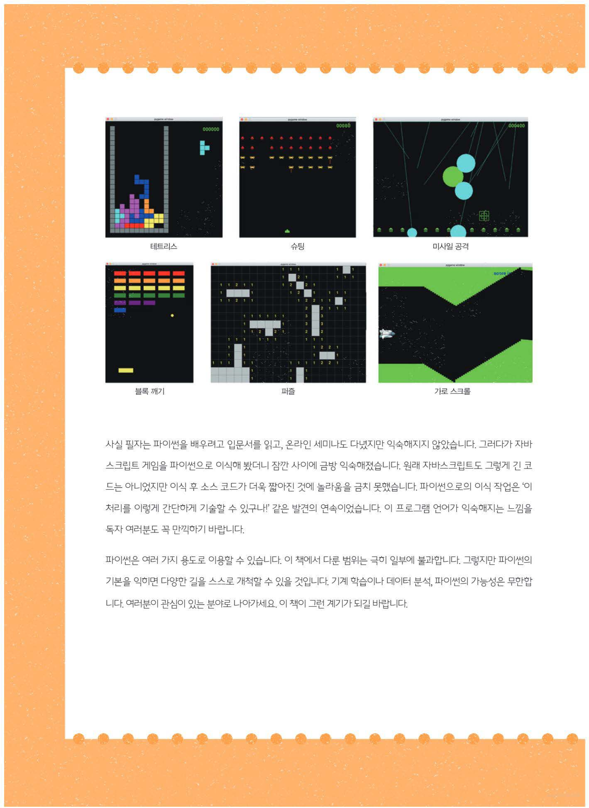

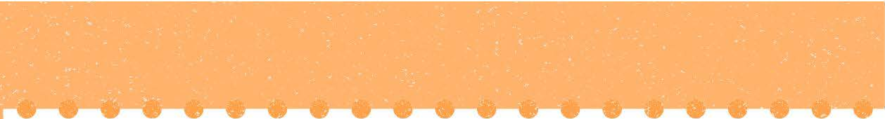

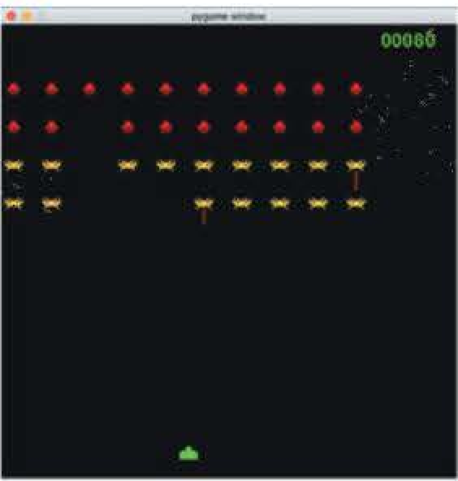

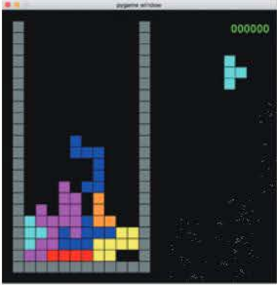

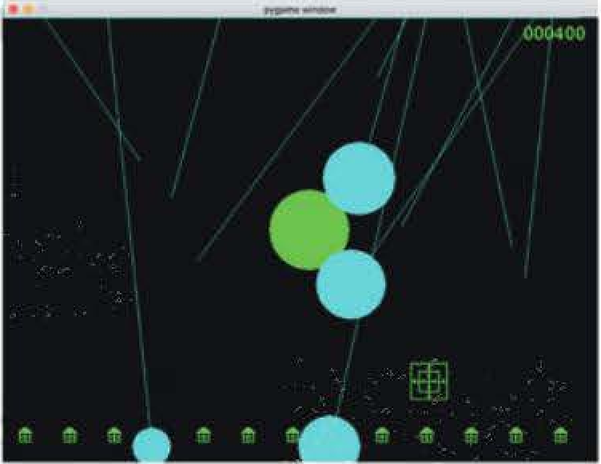

테트리스 슈팅 미사일공격

--

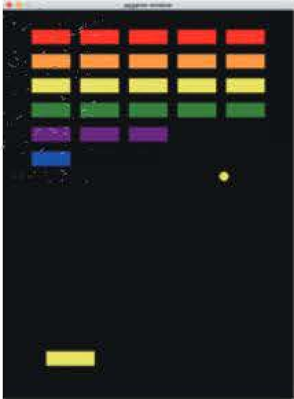

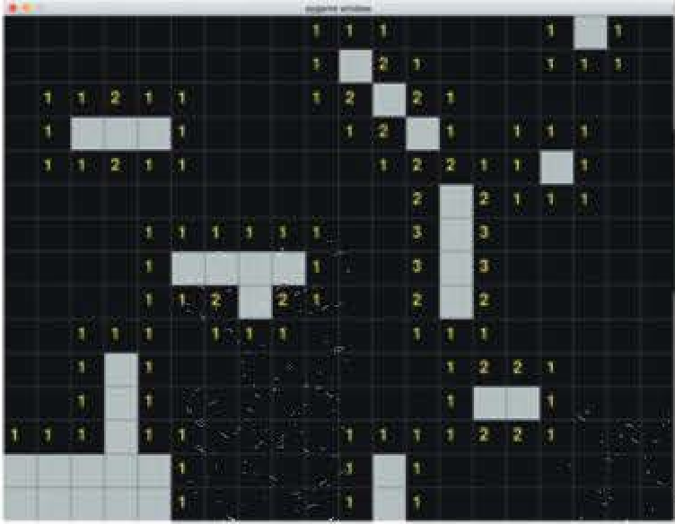

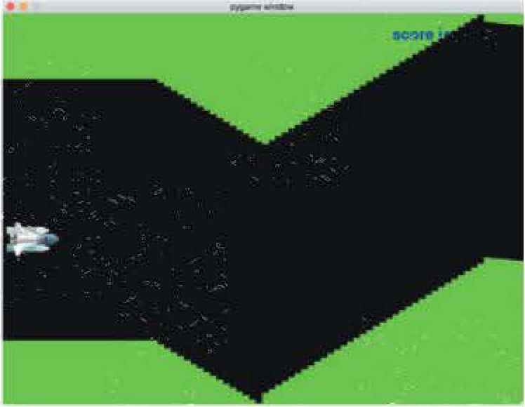

블록깨기 퍼즐 가로스크롤

사실 필자는 파이썬을 배우려고 입문서를 읽고, 온라인 세미나도 다녔지만 익숙에지지 않았습니다. 고러다가 자바

스크립트 게임을 파이썬으로 이식애 봤더니 잠깐 사이에 금방 익숙애졌습니다. 원래 자바스크립트도 고렇게 긴 코

드는 아니었지만 이식 후 소스 코드가 더욱 짧아진 것에 놀라움을 금지 못앴습니다. 파이썬으로의 이식 작업은 ‘이

저리를 이렇게 간단아게 기술말 수 있구나|＇ 같은 발견의 연속이었습니다. 이 프로고램 언어가 익숙매지는 느낌을

독자 여러분도 꼭 만끽아기 바랍니다.

###### 파이썬은 여러 가지 용도로 이용말 수 있습니다. 이 잭에서 다룬 범위는 극이 일부에 불과합니다. 그렇지만 파이썬으|

###### 기본을 익이면 다양만 길을 스스로 개적알 수 있을 것입니다. 기계 악습이나 데이터 분석, 파이썬의 가능성은 무안맙

니다. 여러분이 관심이 있는 분야로 나아가세요. 이 잭이 고린 계기가 되길 바랍니다.

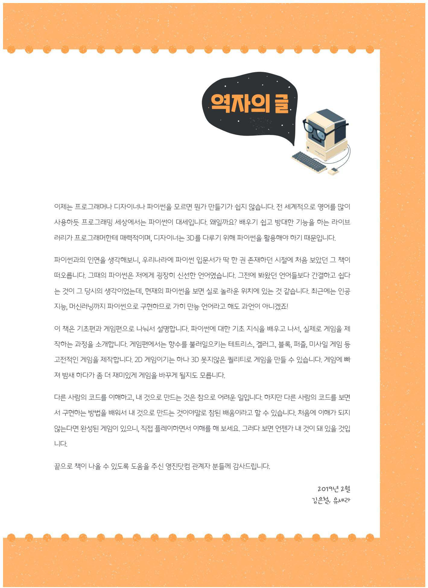

# 』 `

###### 이제는 프로고래머나 디자이너나 파이썬올 모르면 뭔가 만들기가 쉽지 않습니다. 전 세계적으로 영어를 많이

사용마듯 프로그래밍 세상에서는 파이썬이 대세입니다. 왜일까요? 배우기 쉽고 방대만 기능을 아는 라이브

러리가 프로그래머만테 매력적이며, 디자이너는 3D를 다루기 우10서 파이썬을 콸융애야 마기 때문입니다.

파이썬과의 인연을 생각에보니, 우리나라에 파이썬 입문서가 딱 만 권 존재아턴 시절에 저음 보았던 그 책이

떠오름니다. 그때의 파이썬은 저에게 굉장이 신선만 언어였습니다. 그전에 봐왔던 언어들보다 간결아고 쉽다

는 것이 고 당시의 생각이었는데, 연재의 파이썬을 보면 실로 놀라운 위지에 있는 것 같습니다. 죄근에는 인공

지능, 머신러닝까지 파이썬으로 구면아므로 가이 만능 언어라고 애도 과언이 아니겠죠!

이 책은 기조편과 게임펀으로 나눠서 설명압니다. 파이썬에 대만 기조 지식을 배우고 나서, 실제로 게임을 제

작아는 과정을 소개압니다 게임펀에서는 양수를 불러일으키는 테트리스, 겔러고, 블록, 퍼즐, 미사일 게임 등

###### 고전적인 게임을 제작압니다. 20 게임이기는 아나 30 못지않은 퀼리티로 게임을 만들 수 있습니다. 게임에 빠

져 밤새 마다가 좀 더 재미있게 게임올 바꾸게 될지도 모릅니다.

- 다른 사람의 코드를 이애아고, 내 것으로 만드는 것은 잠으로 어려운 일입니다. 아지만 다른 사람의 코드를 보면
- 서 구면아는 방법을 배워서 내 것으로 만드는 것이야말로 참된 배움이라고 말 수 있습니다. 저음에 이애가 되지

않는다면 완성된 게임이 있으니, 직접 플레이아면서 이애를 애 보세요. 고러다 보면 언젠가 내 것이 돼 있을 것입

L|다.

###### 끝으로 책이 나올 수 있도록 도움을 주신 영진닷컴 관계자 분들께 감사드립니다.

2-019년 2왕 강은껑 유J...-1121-

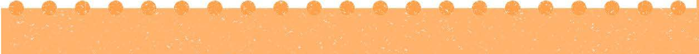

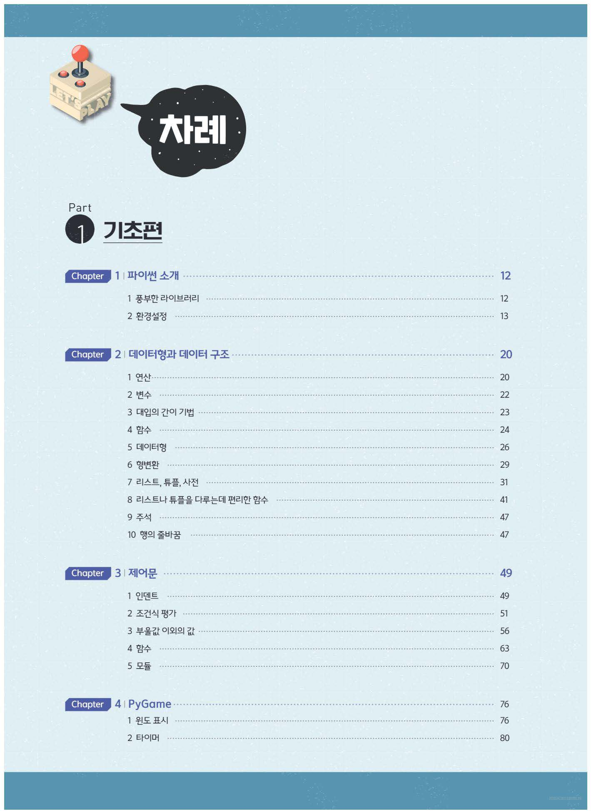

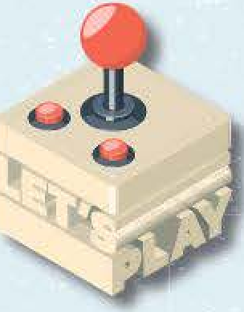

Part

JI조핀

J

- 1 | 파이썬 소개 …………………………………………………………………………………… 12

- 1 풍부만라이브러리 ..…………………………………………………………………·…………………………… 12
- 2 화겨서저L. 020 ······ ·············· ······· ········ ······· 13

- 2 구조 ...…………………………………………………...……………… 20

- 1 여사 느'-……… ……… …………………………·…… ……………………………… ……………………… ..…… …… 20
- 2 변수 ··· ········ ·············· ······· ···· ··· ······· ·· ·· ·············· ························· ······ ········· · ····· 22
- 3 대입의 간이 기법 ·…… ..…………………………······…………………………………………………………... 23
- 4 암수 24
- 5 데이터혀

。 ……… …………………………… ....………………..……… ………………… ……………………… 26

- 6 ~변환。 …………....………………………………………………….....………………………………………… 29
- 7 리스트,튜플,사전 .. 31
- 8 리스트나튜플을다루는데편리만암수 41
- 9 주석 ... 47
- 10 맹의줄바꿈 ..................................................................................................................... 47

- 3 ....……................…………………………………………………………………· 49

- 1 인덴트 ………………………...........…………………………………·………………………………………… 49
- 2 조건식 평가 ..…………………………………………………………………………………....………………… 51
- 3 부울값 이오1의 값 ………………………………..………·………………………………………………………… 56
- 4 암수
- 5 모듈

······················· ·· ·· ···· ·· ····· ····· ······· ······· ········ ·· ·· ····· ·······

63

70

- 4 1PyGame ···………………………………………………..........………………………..... 76

r J

r

r J

- 1 윈도표시 ...................................... 76
- 2 타이머 .... 80

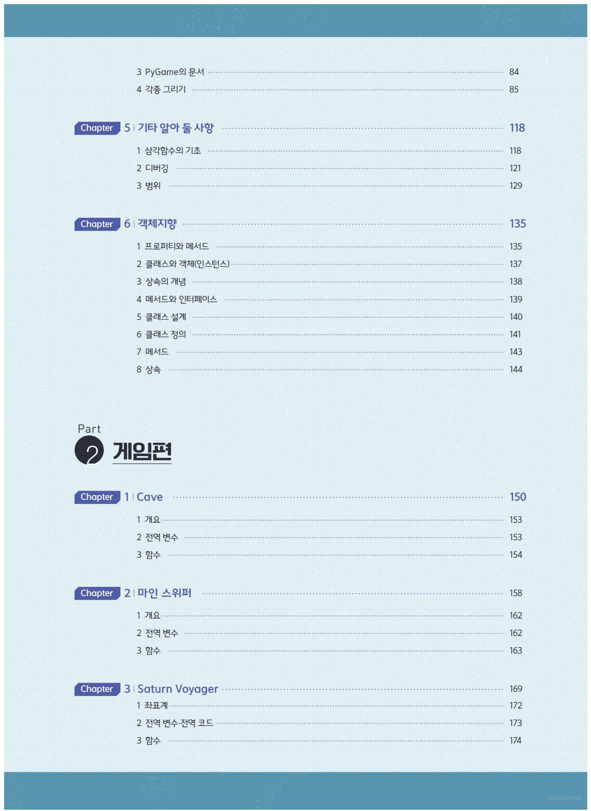

- 3 PyGame의 문서 ....………………………………..……………………………………………………………… 84
- 4 각종그리기 ………………………………………………………………………………………………………… 85

###### J

.......................................................................................

118

- 5 |

- 1 삼각함수의 기조 …………………………………………………….................………………………………· 118
- 2 디버7|

。 .........………………………………………………...……………………… ……… …………………… 121

- 3 범위 ..……………………………………·………………………………………………………………………… 129

- 6 1 ......…………………………………......………………………………………… 135

「

- 1 프로퍼티와메서드
- 2 클래스와객제(인스턴스)..………....……………………………………………………………………………… 137
- 3 상속의 개념 ….……………………..……………………………………………………………………………… 138
- 4 메서드와 인터페이스 ……………………………………………………………………………………………… 139
- 5 클래스 설계 ………………………………………………………………………………………………………… 140
- 6 클래스 정의 ………… ……… ………… ……………...……………………………………… …………………… 141
- 7 메서드 ..…………………………………..……………………………………… ..……………………………… 143
- 8 상속

135

..

###### 144

Part

게임핀

r J

1 1Cave ......................................................................................................

1 개요..……................……………………......….....…………………………........….................………… 153

~i~~~~~~~~~~~~~~一一~~~~~~~~一一~~~~~~~~~~一一~~..····115534

###### 23

r J

·····························································································

###### 158

1

- 1 개요…………....…………………………………………………………………………………·………………… 162
- 2 전역 변수 ............………………..........................................……………… ..................…………… 162
- 3 암수 ..……………………………….....……………………………………….....……………………………… 163

3 1Saturn Voyager …………………………………………………………………………… 169

- 1 좌표계………………………………………………………………………………………………………………… 172
- 2 전역 변수전역 코드 ...………………… ...............……………………...........................………………… 173
- 3 암수 174

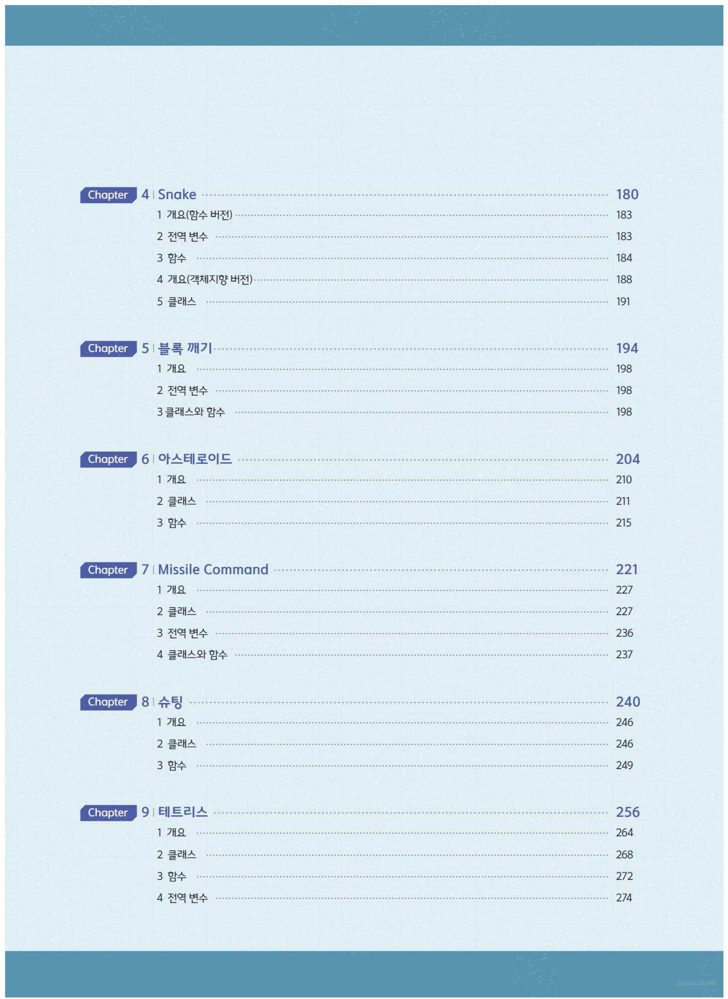

- 4 1Snake ……………………….....…………………………………......•…………………… 180

- 1 개요(암수 버전) ……………………………………………………………………………………………………… 183
- 2 전역 변수 …………………………………………………………………………………………………………… 183
- 3 암수 .......... 184
- 4 개요(객제지양 버전) ........………………….....……………………………………………………….............. 188
- 5 클래스 …..……………………………….....……………………………………………….................……… 191

- 5 깨기 ……………………………………………………………………………………… 194

###### J

- 1 개요 ....................... 198
- 2 저여벼t-, L十A

..………………………………………………………………………….......………………………… 198

- 3 클래스와암수 ............................................................................. 198

###### r J

###### | 아스테로이드 …………………………………………………………………………………

- 1 개요 ………………………………………………………………………………………………………………... 210
- 2 클래스 ……………………………………………………………………………………………………………... 211
- 3 아.A.D+ ………………………………………………………………………………………………………………… 215

###### 7 I Missile Command ………………………………………………………………………… 221

- 1 개요 ………………………………………………………………………………………………………………… 227
- 2 클래스 ........…...............…………….......................……........…………………………..............…· 227
- 3 전역 변수 ………………………………………....…………….......……………………………………………· 236
- 4 클래스와함수 …………………………………… ....…… ..……………………………………………………… 237

###### 8

1

- 1 개요

......................................................................................................... 240

246

- 2 클래스 ……………………………………… .......……………..………………………………………………... 246
- 3 마人DT …………………………….......……………………………………..……………………………………… 249

r J

###### 9 ………………..………………....………………………………………………… 256

- 1 개요 ..………………………………………………………………·……………………………………………… 264
- 2 클래스 ……………………………....………………………….......……………………………………………· 268
- 3 마人DT ……………………… ………....…………………………………..………………… ………………… …… 272
- 4 전역 변수 .....…………………………………………………………………………………………………….... 274

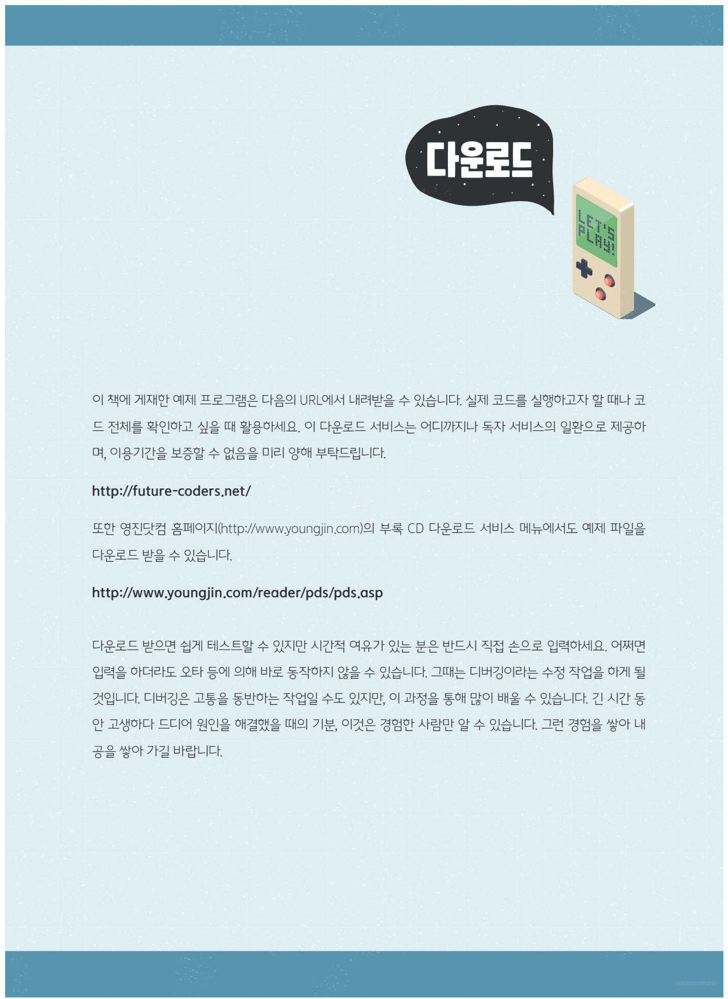

# ` e

이 잭에 게재만 예제 프로고램은 다음의 URL에서 내려받을 수 있습니다. 실제 고드를 실맹아고자 말 때나 고 드 전제를 왁인아고 싶을 때 왈용아세요. 이 다운로드 서비스는 어디까지나 독자 서비스의 일완으로 제공아 며, 이용기간을 보증말 수 없음을 미리 양애 부탁드립니다.

###### http://future-coders.net/

또만 영진닷컴 옴페이지(http://www.youngjin.com)의 부록 CD 다운로드 서비스 메뉴에서도 예제 파일을

다운로드 받을 수 있습니다.

###### http://www.youngjin.com/reader/pds/pds.asp

다운로드 받으면 쉽게 테스트말 수 있지만 시간적 여유가 있는 분은 반드시 직접 손으로 입력아세요. 어쩌면 입력을 아더라도 오타 등에 의애 바로 동작아지 않을 수 있습니다. 그때는 디버깅이라는 수정 작업을 아게 될 것입니다. 디버겅은 고통을 동반아는 작업일 수도 있지만, 이 과정을 통애 많이 배울 수 있습니다. 긴 시간 동 안 고생아다 드디어 원인을 애결앴읊 때의 기분, 이것은 경멍만 사람만 알 수 있습니다. 그런 경임을 쌓아 내 공을 쌓아 가길 바랍니다.

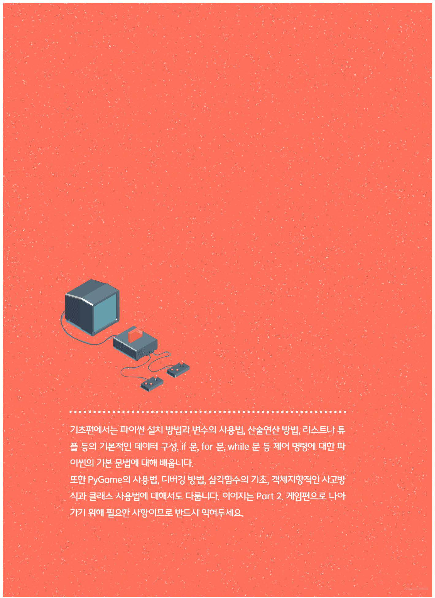

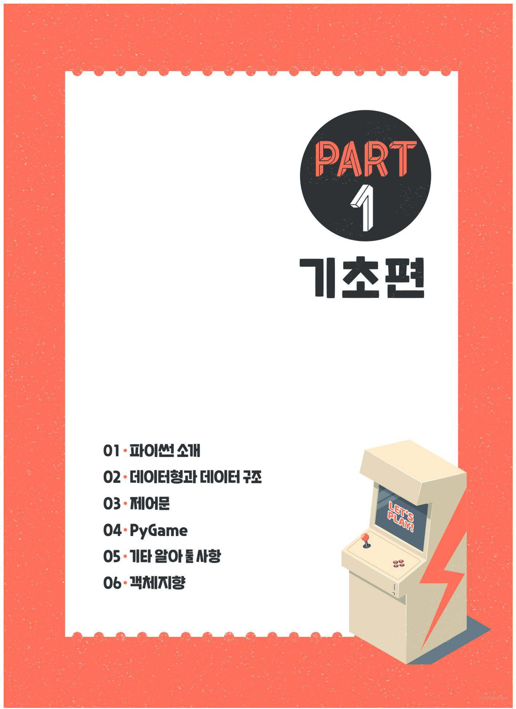

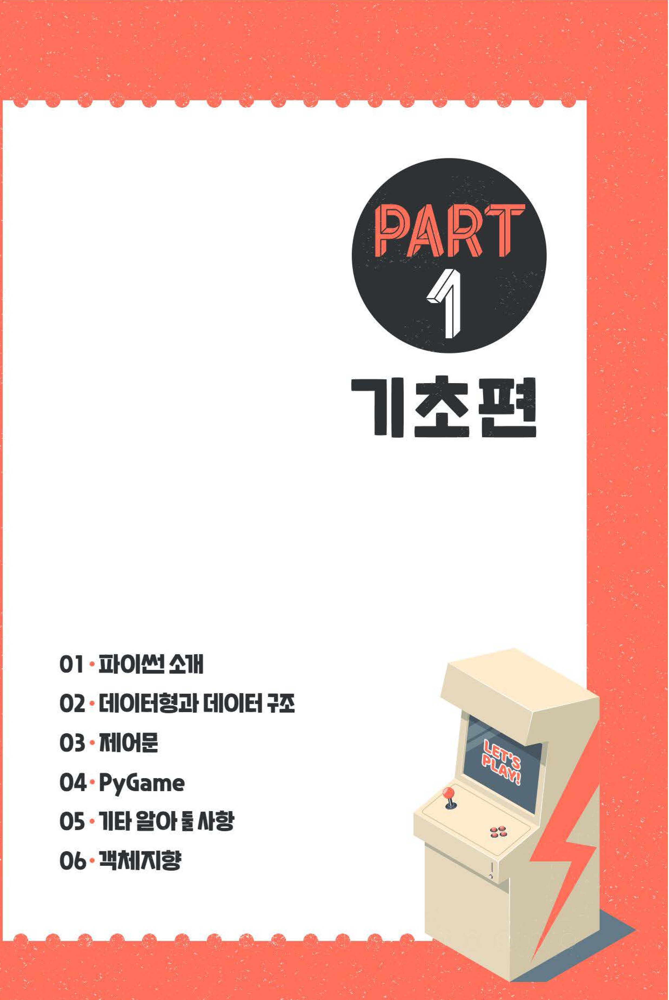

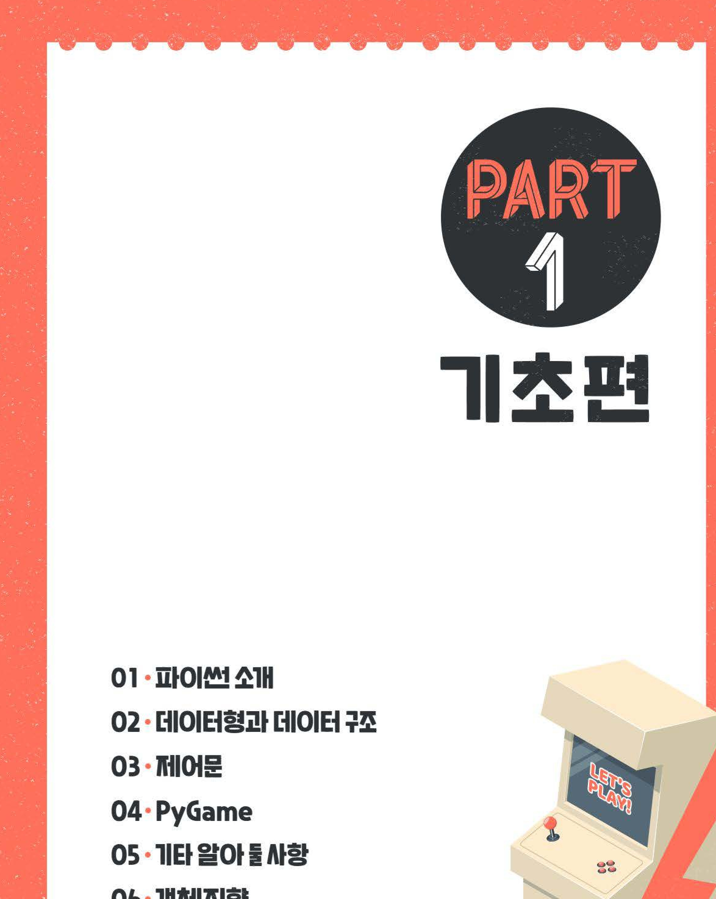

- 01 • 파이썬 ~lH
- 02•CilOIEi형과[ilOIEi구모
- 03 · 1tlot른
- 04·PyGame 05•11Et왈Ot 툴 At할

###### s~

Ob· 객NInI형

＿조_＿ _.- i -._`_ .- :-— - 一-.

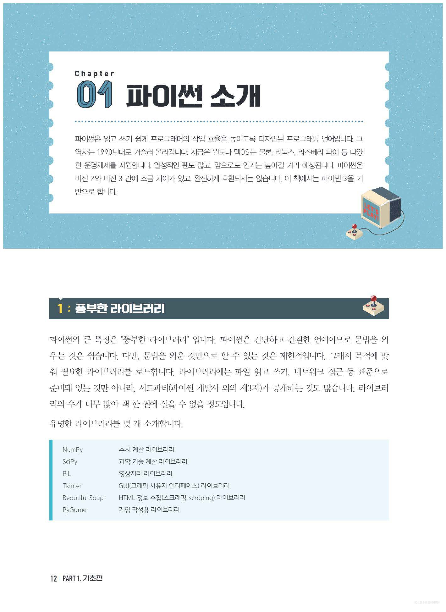

###### Chapte 『

•• • •• • •• • •• • •• • • •••• • • •• •• •• • • • • • • • • •• •• • • • •• •• • • •• •• • •• •• • • • • • • • • •• • • ••• • • •• • • •• • • •• • • •

파이썬은 읽고 쓰기 쉽게 프로T 래머의 작업 효율을 높이도록 디자인된 프로거래밍 언어입니다. 그

###### 역사는 1990년대로 거슬러 올라갑니다. 지금은 윈도나 맥OS는 물론 리눅스, 라즈베리 파이 등 다양 한 운영체저層 지원합니다 열성적인 팬도 많고, 앞으로도 인기는 높아갈 거라 예상됩니다. 표IDI썬은 버전 2와 버전 3 간에 조금 차이가 있고, 완전하게 호환되지는 않습니다. 이 책에서는 파이썬 3을 기

반으로합니댜

t3

3

파이썬의 큰 특징은 명부한 라이브러리” 입니다. 파이썬은 간단하고 간결한 언어이므로 문법을 외 우는 것은 쉽습니다. 다만, 문법을 외운 것만으로 할 수 있는 것은 제한적입니다. 그래서 목적에 맞 춰 필요한 라이브러리를 로드합니다. 라이브러리에는 파일 읽고 쓰기, 네트워크 접근 둥 표준으로

###### 준비돼 있는 것만 아니라, 서드파티(파이썬 개발사 외의 제3자)가 공개하는 것도 많습니다. 라이브러

리의 수가 너무 많아 책 한 권에 실을 수 없을 정도입니다.

유명한 라이브러리를 몇 개 소개합니다.

NumPy 수지 계산 라이브러리 SciPy 과막 기술 계산 라이브러리 PIL 여사00저리라이브러리 Tkinter GU|（그래픽 사용자 인터페이스) 라이브러리 Beautiful Soup HTML 정보 수집(스크래밍; scraping) 라이브러리 PyGame 게임 작성용 라이브러리

###### 12 1PART 1, 기조펀

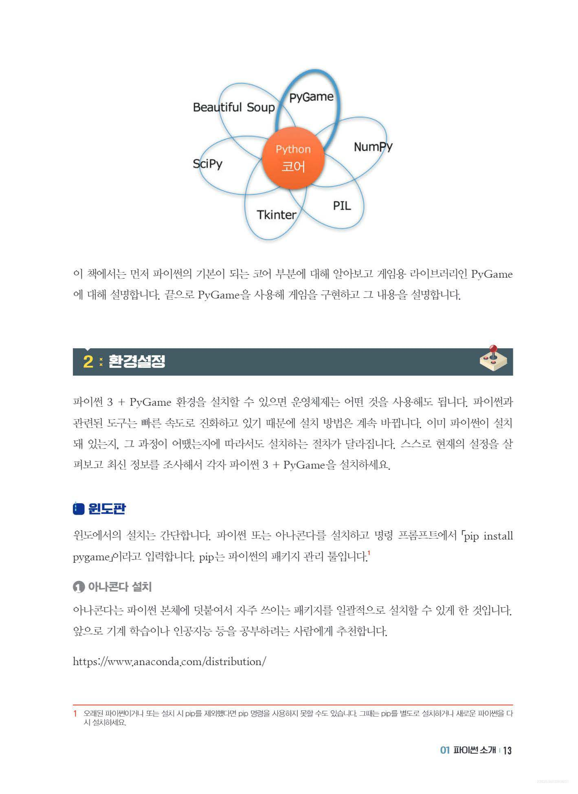

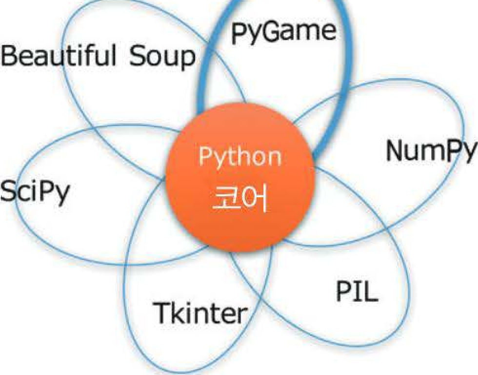

pyGame

Beautiful Soup

###### PIL

이 책에서는 먼저 파이썬의 기본이 되는 코어 부분에 대해 알아보고 게임용 라이브러리인 PyGame

에 대해 설명합니다. 끝으로 PyGame을 사용해 게임을 구현하고 그 내용을 설명합니다.

파이썬 3 + PyGame 환경을 설치할 수 있으면 운영체제는 어떤 것을 사용해도 됩니다. 파이썬과

관련된 도구는 빠른 속도로 진화하고 있기 때문에 설치 방법은 계속 바뀝니다. 이미 파이썬이 설치 돼 있는지, 그 과정이 어됐는지에 따라서도 설치하는 절차가 달라집니다. 스스로 현재의 설정을 살 펴보고 최신 정보를 조사해서 각자 파이썬 3 十 PyGame을 설치하세요.

###### ·윈도판

윈도에서의 설치는 간단합니다. 파이썬 또는 아나콘다를 설치하고 명령 프롬프트에서 「pip install

###### pygame」이라고 입력합니다. pip는 파이썬의 패키지 관리 툴입니다.1

###### 0 아L~다설치아나콘다는 파이썬 본체에 덧붙여서 자주 쓰이는 패키지를 일괄적으로 설치할 수 있게 한 것입니다.앞으로 기계 학습이나 인공지능 둥을 공부하려는 사람에게 추천합니다.

https://,V\vw.anaconda.com/distribution/

###### 1 오래된 파이썬이거니 또는 설치 시 pip률 제외했다면 pip 명령을 사용하지 못할 수도 있습니다. 그때는 pip롤 별도로 설치하거나 새로운 파이썬을 다

시 설치하세요.

###### 01 IItol썬 소개 I 13

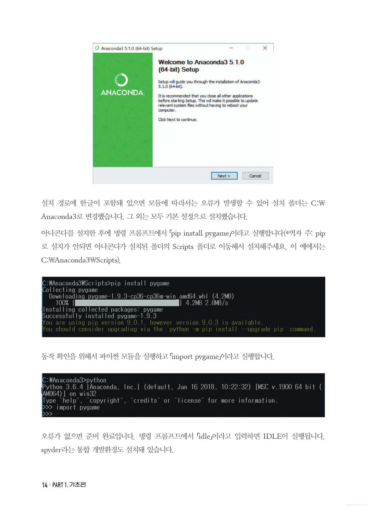

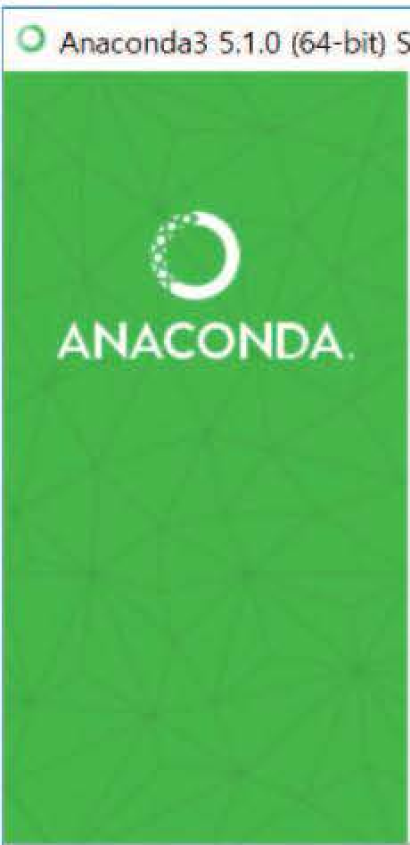

X

..) 5.1.0 (64-bit) Setup

###### Welcome to Anaconda3 5_l _O (64-bit) Setup

Setup떠 g"e mu 虹짜 the nstalal)(W'l ofAnacmda3

5.1.0 "~t). Itis 'fOIJdose

. w make it b updak relevant"st.emffes withouthaving ID reboot

###### G ·

Next to conli'u!.

| …xt> l

설치 경로에 한글이 포함돼 있으면 모듈에 따라서는 오류가 발생할 수 있어 설치 폴더는 c:w

Anaconda3로 변경했습니다. 그 외는 모두 기본 설정으로 설치했습니다.

###### 아나콘다를 설치한 후에 명령 프롬프트에서 「pip install pygame」이라고 실행합니다(＊역자 주: pip 로 설치가 안되면 아나콘다가 설치된 폴더의 Scripts 폴더로 이동해서 설치해주세요. 이 예에서는 C:WAnaconda3WScripts).

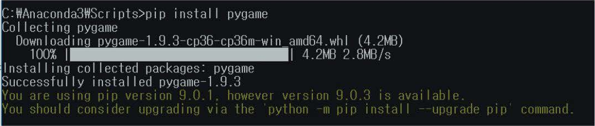

동작 확인을 위해서 파이썬 모듈을 실행하고 「1mport pygame」이라고 실행합니다.

###### ! I

오류가 없으면 준비 완료입니다. 명령 프롬프트에서 「idle」이라고 입력하면 IDLE이 실행됩니다. spyder라는 통합 개발환경도 설치돼 있습니다.

###### 14 1PART 1, 기조펀

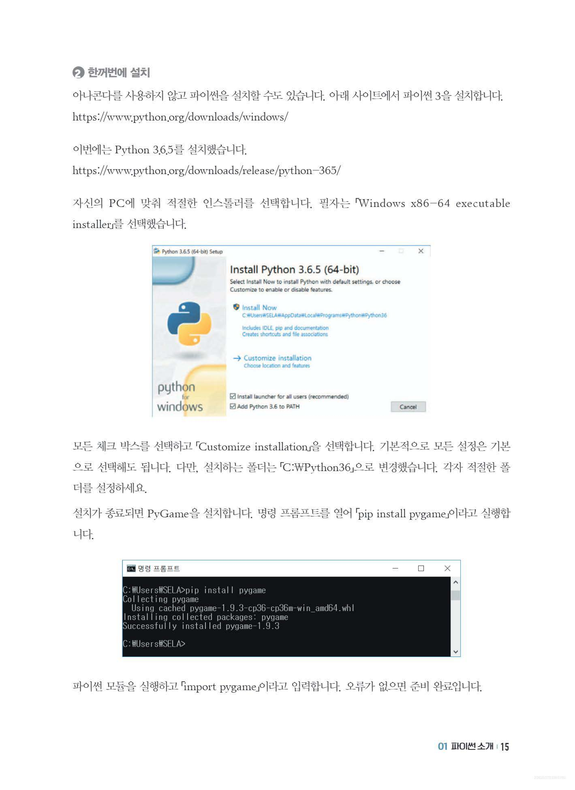

###### O 한꺼번에설치

아나콘디를- 사용하지 않고 파이썬을 설치할 수도 있습니다. 아래 사이트에서 파이썬 3을 설치합니다.

https://,vww.PJrthon.org/downloads/windows/

이번에는 Python 3.6.5를 설치했습니다. https://,vww.python.org/downloads/release/python-365/

자신의 PC에 맞춰 적절한 인스톨러를 선택합니다. 필자는 「Windows x86—64 executable

###### installei:」를 선택했습니다.

x

e 序hon 3.65("曲)Setup

###### Install Python 3.6.5 (64-bit)

Now lo instaQPython With def.ault stlbn따 orchoose Cunomwi to en~e or dlQble fe.atu:res.

$ ln~tall Now

C凱""'"a"A""U훈Loui莊mym華야Py.t(1'3{>

lndudn IOI.£. pp Mid dQWlnlmitlgo

"x"山cx"" 다em"d".ions

###### ➔ Customize install tion

k威""

pyth n

@ In"책 l"mherb 태 usmm mommmd") g Add Wn 35 to PATH 0nc:e!

l

wind ws

모든 체크 박스를 선택하고 「Customize installation」을 선택합니다. 기본적으로 모든 설정은 기본 으로 선택해도 됩니다. 다만, 설치하는 폴더는 「C:WPython36죠頃L 변경했습니다. 각자 적절한 폴

###### 더를설정하세요.

설치가 종료되면 PyGame을 설치합니다. 명령 프롬프트를 열어 「pip install pygame」이라고 실행합

###### 니다.

교 명령 프롬프트 □ X

/ 1 I lll

lll(i64.whI I rn

Hllsm

###### 파이썬 모듈을 실행하고 rimport pygam~」이라고 입력합니다. 오류가 없으면 준비 완료입니다.

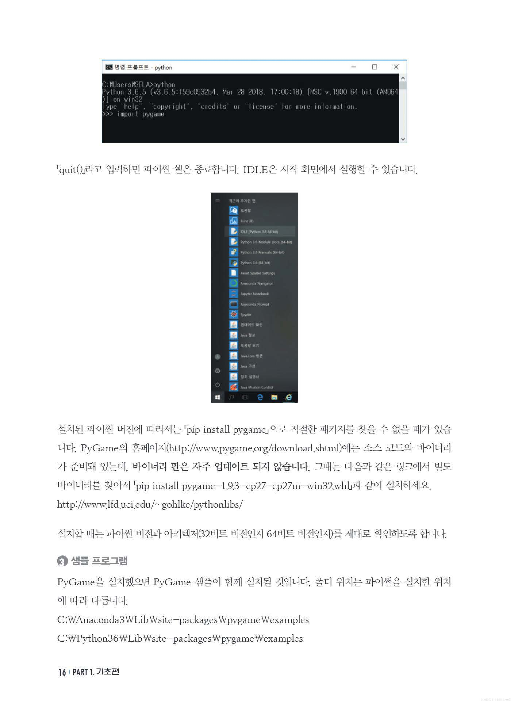

“명령프롬프드•python

###### D X

{ | | , ','/ . I

, l ! !( I

I I, • . ' ,

’,’ ’

###### 1 1 :

1l '.v' i : I ’

l1 I I : i l ‘ ' ,· I I

口 11:. l i

, .

1 I • ,

·' 11: • •I I I , 1 I

###### 「quitO」라고 입력하면 파이썬 쉘은 종료합니다. IDLE은 시작 화면에서 실행할 수 있습니다.

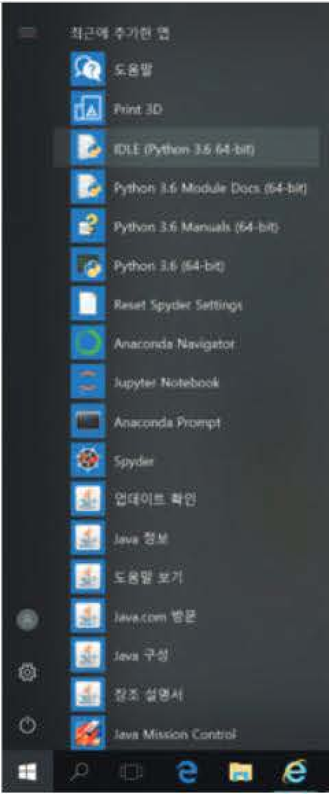

설치된 파이썬 버전에 따라서는 「pip install pygame」으로 적절한 패키지를 찾을 수 없을 때가 있습

###### 니다. PyGame의 홈페이지(http://v."vw.pygame.org/download.shtml)에는 소스 코드와 바이너리

- 가 준비돼 있는데, 바이너리 판은 자주 업데이트 되지 않습니다. 그때는 다음과 같은 링크에서 별도

- 바이너리를 찾아서 「pip install pygame―1.9.3―cp27―cp27m극vin32.whlA 같이 설치하세요. http://www.lfd.uci.edu/rvgohlke/pythonlibs/

설치할 때는 파이썬 버전과 아키텍처(32비트 버전인지 64비트 버전인지)를 제대로 확인하도록 합니다.

O 샐플프로그램

###### PyGame을 설치했으면 PyGame 샘플이 함께 설치될 것입니다. 폴더 위치는 파이썬을 설치한 위치 에 따라다릅니다. C:WAnaconda3WLibWsite—packagesWpygameWexamples C:WPython36WLibWsite—packagesWpygameWexamples

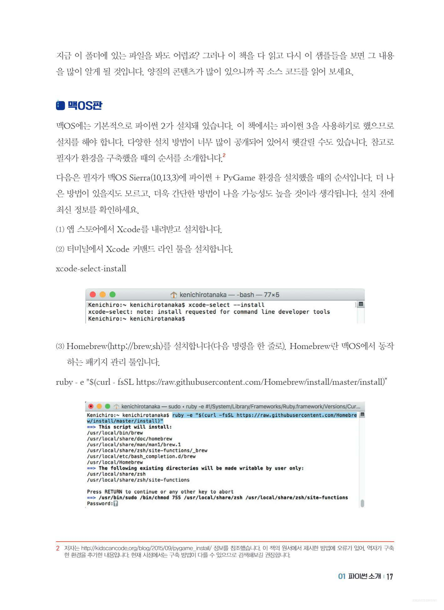

지금 이 폴더에 있는 파일을 봐도 어렵죠? 그러나 이 책을 다 읽고 다시 이 샘플들을 보면 그 내용 울 많이 알게 될 것입니다. 양질의 콘텐츠가 많이 있으니까 꼭 소스 코드를 읽어 보세요.

###### ·빽OS판

맥OS에는 기본적으로 파이썬 2가 설치돼 있습니다. 이 책에서는 파이썬 3을 사용하기로 했으므로 설치를 해야 합니다. 다양한 설치 방법이 너무 많이 공개되어 있어서 헷갈릴 수도 있습니다. 참고로

###### 필자가 환경을 구축했을 때의 순서를 소개합니다.2

###### 다음은 필자가 맥OS Sierra(I0.13.3)에 파이썬 十 P yGame 환경을 설치했을 때의 순서입니다. 더 나

은 방법이 있을지도 모르고, 더욱 간단한 방법이 나올 가능성도 높을 것이라 생각됩니다. 설치 전에 최신 정보를 확인하세요.

- (1) 앱 스토어에서 Xcode를 내려받고 설치합니다.
- (2) 터미널에서 Xcode 커맨드 라인 툴을 설치합니다.

xcode-select-install

• 、kenichirotanaka- - - 77><5 Kenichiro :,., kenichirotanaka$ xcode-select --install xcode- select: note: install requested for command line developer tools Kenichiro:,., kenichirotanaka$

- (3) Homebrew(http://brew.sh)를 설치합니다(다음 명령을 한 줄로). Homebrew란 맥OS에서 동작 하는 패키지 관리 툴입니다.

ruby - e "$(curl - fsSL https://raw.githubusercontent.com/Homebrew/install/master/install)"

kenichirotanaka - sudo • ruby -e #!/System/Library/Frameworks/Ruby.framework/Versions/Cur... Kenichiro:~ kenichirotanaka$ -e ht!ps: . . ■ )"

=-> SC『ipt win instal.\: /usr/tocat/bin/brew /usr/locat/share/doc/homeb rew /usr/tocal/share/man/manl/brew.1 /usr/local/share/zsh/site-functions/_brew /usr/tocat/etc/bash_completion.d/brew /usr/local/Homebrew

=> The fo'ltowing existing directories win be 讚ade writable by user on\y: /usr/tocat/share/zsh /usr/tocat/share/zsh/s1te-functions

Press RETURN to continue or any other key to abort

=> / usr/ bin/ sudo /bin/ch■od 755 /usr/l.ocal./share/zsh / usr/'local./share/zsh/site-functions

Password:() I

2 저자는 http://kidscancode.org/blog/2015/09/pygame_install/ 정보릅 첩초했습니다. 이 잭의 원서에서 제시힌 방법에 오류가 있어 역자기 구축

한 환경을 추기한 내용입니다. 현재 시점에서는 구축 방법이 다릅 수 있으므로 검색해보길 권장합니다.

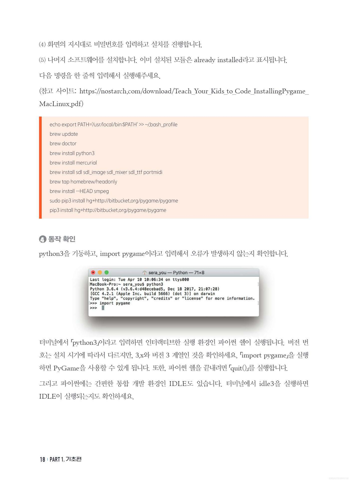

- (4) 화면의 지시대로 비밀번호를 입력하고 설치를 진행합니다.
- (5) 나머지 소프트웨어를 설치합니다. 이미 설치된 모듈은 already installed라고 표시됩니다.

- 다음 명령을 한 줄씩 입력해서 실행해주세요

(참고 사이트: https://nostarch.com/dow nload/Teach_Yom:_Kids_to_Code_InstallingPygame_ M acLinux.pdf)

echo export PATH=1/usr/local/bin:$PATH'» ~/bash_profile brewupdate brew doctor brew install python3 brew install mercurial brew install sdl sdl_image sdl_mixersdl_ttf portmidi brew tap homebrew/headonly brew install--HEAD smpeg sudo pip3installhg+http://bitbucket.org/pygame/pygame pip3 install hg+http://bitbucket.org/pygame/pygame

###### 0 동작확인

python3을 기동하고, import pygame이라고 입력해서 오류가 발생하지 않는지 확인합니다.

• sera_you- Python- 71x8

Last login: Tue Apr 10 10:06:34 on ttys000

IHacBook-Pro :~ sera_youS python3 I Python 3.6.4 (v3.6.4:d48ecebadS, Dec 18 2017, 21:07:28) [GCC 4,2,1 (Apple Inc. build 5666) (dot 3)1 on darwin Type "help", "copyright", "credits" or "license" for more information, I>» import pygame

>»

터미널에서 「python3」이라고 입력하면 인터랙티브한 실행 환경인 파이썬 쉘이 실행됩니다. 버전 번 호는 설치 시기에 따라서 다르지만, 3.x와 버전 3 계열인 것을 확인하세요. rimport pygameA출 실행

###### 하면 PyGame을 사용할 수 있게 됩니다. 또한, 파이썬 쉘을 끝내려면 「quit0」를 실행합니다.

그리고 파이썬예는 간편한 통합 개발 환경인 IDLE도 있습니다. 터미널에서 idle3을 실행하면 IDLE이 실행되는지도 확인하세요.

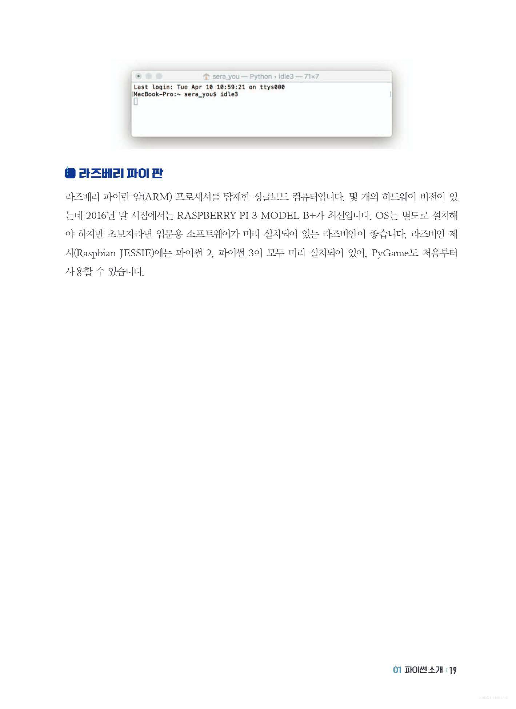

###### - 71><7

Last login: Tue Apr 10 10:59:21 on ttyseee 맙acBook-Pro:"' sera_you$ idle3 I

###### • 라즈"'i!I 파01 판

###### 라즈베리 파이란 암(ARM) 프로세서를 탑재한 성글보드 컴퓨터입니다. 몇 개의 하드웨어 버전이 있

는데 2016년 말 시점에서는 RASPBERRY PI 3 MODEL B+가 최신입니다. OS는 별도로 설치해 야 하지만 초보자라면 입문용 소프트웨어가 미리 설치되어 있는 라즈비안이 좋습니다. 라즈비안 제 시(Raspbian JESSIE)에는 파이썬 2, 파이썬 3이 모두 미리 설치되어 있어, PyGame도 처음부터 사용할수있습니다.

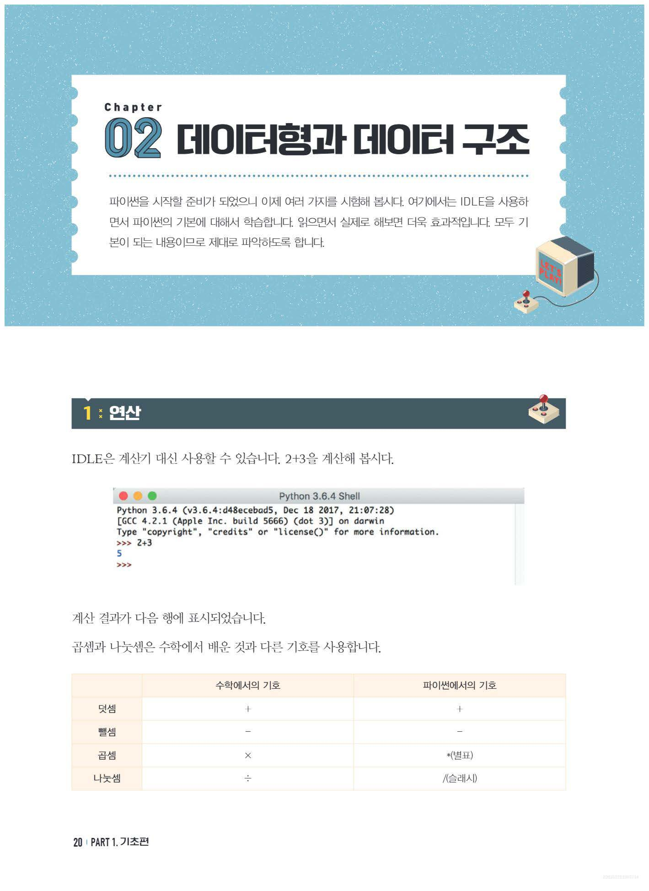

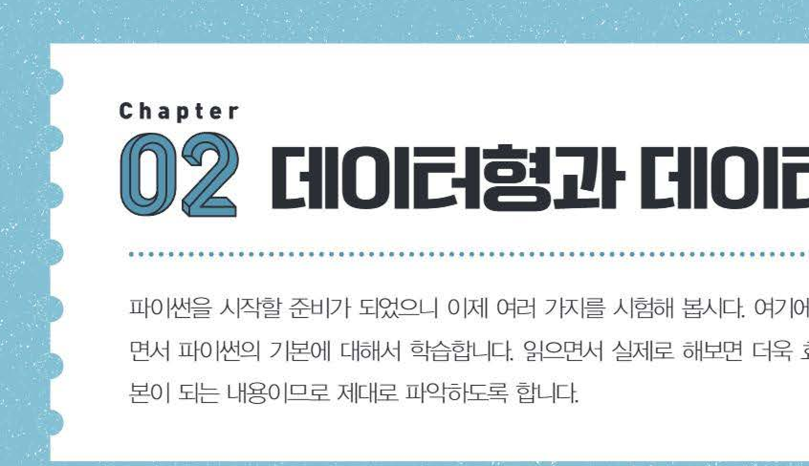

Chapte 『

••••••••••••••••••••••••••••••••••••••••••••••••••••••••••••••••••••••••••••••••••••••••

파이썬을 시작할 준비가 되었으니 이제 여러 가지를 시험해 봅시다 여기에서는 | OLE을 사용하 면서 파이썬의 기본에 대해서 학습합니다. 읽으면서 실제로 해보면 더욱 효과적입니다. 모두 기

본0 1 되는 내용01므로 제대로 파악하도록 합니다.

*3

3

###### IDLE은 계산기 대신 사용할 수 있습니다. 2+3을 계산해 봅시다.

###### ’

. .4 Shell Python 3.6.4 (v3.6.4:d48ecebad5, Dec 18 2017, 21:07:28) [GCC 4 .2. 1 (Apple Inc. bui.ld 5666) (dot 3)] on dorwi.n Type "copyri.ght", "credi.ts" or "license()" for more i.nformoti.on. >» 2+3

5

>>>

계산 결과가 다음 행에 표시되었습니다.

곱셈과 나눗셈은 수학에서 배운 것과 다른 기호를 사용합니다.

수학에서의 기호

파이썬에서의 기호

+

+

더서1

^ c그

111H 서

근 C3

*（별표)

곱셈 X

/（슬래人 )

나눗셈

###### 20 1PART 1. 기조곤

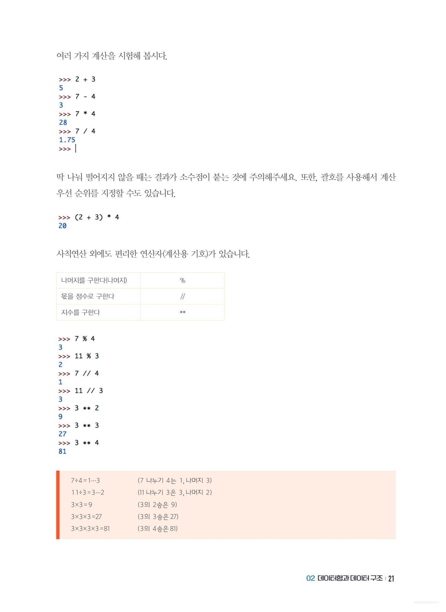

###### 여러 가지 계산울 시험해 봅시다.

>>> 2 + 3

###### 5

###### >>> 7 - 4

3

###### >>> 7 * 4

28

>>> 7 I 4

1.75

>>> I

###### 딱 나눠 떨어지지 않을 때는 결과가 소수점이 붙는 것에 주의해주세요. 또한, 괄호를 사용해서 계산 우선 순위를 지정할 수도 있습니다.

>>> (2 + 3) * 4

###### 20

###### 사칙연산 외에도 편리한 연산자(계산용 기호)가 있습니다.

###### %II

나머지를 구한다(나머지)

몫을정수로구한다

지수를 구한다

###### **

%/***

v>>7171333

4/

VVVVVv

%//***

34234

11

3

>>>>

- 7 V

- 1

v 3

>

- 2 >

- 1

> 3

> 9

V

- 2

V

- 8

7+4=7...3 11+3 =3···2 3X3 =9 3x3x3=27 3x3x3x3 =81

(7 나누기 4는 1, 나머지 3)

###### (11 나누기 3은 3, 나머지 2)

- (3의 2승은 9)
- (3의 3승은 27) ( 3 의 4승은 81)

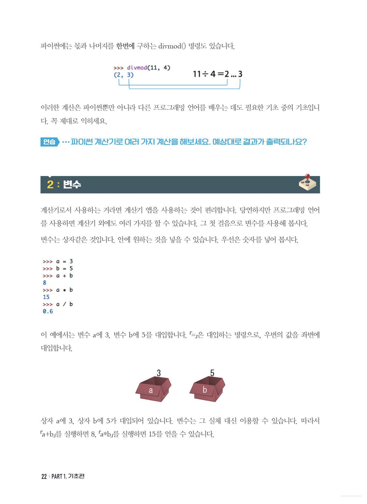

###### 파이썬에는 몫과 냐머지를 한번에 구하는 divmodO 명령도 있습니다.

>>> di.vmod(ll, 4)

11+4=2 ... 3

(2, 3)

l l

니

이러한 계산은 파이썬뿐만 아니라 다른 프로그래밍 언어를 배우는 데도 필요한 기초 중의 기초입니

다. 꼭 제대로 익히세요.

###### …IItOI썬계산기로여러 가지계산을해보세요. 예상[H로결과가즐력되나요?

계산기로서 사용하는 거라면 계산기 앱을 사용하는 것이 편리합니다. 당연하지만 프로그래밍 언어 를 사용하면 계산기 외에도 여러 가지를 할 수 있습니다. 그 첫 걸음으로 변수를 사용해 봅시다.

###### 변수는 상자같은 것입니다. 안에 원하는 것을 넣을 수 있습니다. 우선은 숫자를 넣어 봅시다.

>>> a = 3 >>> b = 5 >>> a + b

###### 8

>>> a * b

15

###### >>> a I b 0 .6

이 예에서는 변수 a에 3, 변수 b에 5를 대입합니다. 「=」은 대입하는 명령으로, 우변의 값을 좌변에

대입합니다.

3

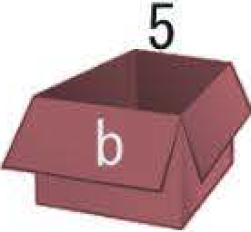

상자 a에 3, 상자 b에 5가 내입되어 있습니다. 변수는 그 실체 대신 이용할 수 있습니다. 따라서 「a+b를 실행하면 8, 「a*b」를 실행하면 15를 얻을 수 있습니다.

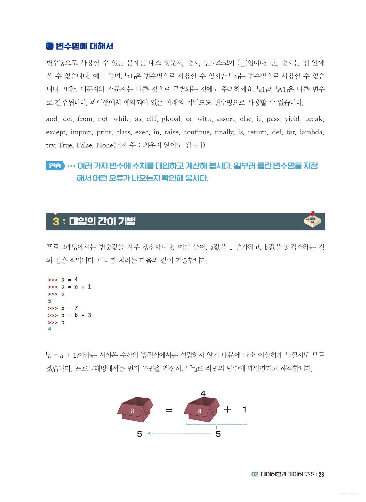

###### • 변수멸OIi [H6HAi

###### 변수명으로 사용할 수 있는 문자는 대소 영문자, 숫자, 언더스코어 (_）입니다. 단, 숫자는 맨 앞에

올 수 없습니다. 예를 들면, ral표폰 변수명으로 사용할 수 있지만 「1a良근 변수명으로 사용할 수 없습 니다. 또한, 대문자와 소문자는 다른 것으로 구별되는 것에도 주의하세요. 「a1戶十 「A1표끈 다른 변수 로 간주됩니다. 파이썬에서 예약되어 있는 아래의 키워드도 변수명으로 사용할 수 없습니다.

and, del, from, not, while, as, elif, global, or, with, assert, else, if, pass, yield, break, except, import, print, class, exec, in, raise, continue, finally, is, return, def, for, lambda, try, True, False, None(역자 주 : 외우지 않아도 됩니다)

EO…01러가지변수메수지를[H입하고계산해봅시다일부러를린 변수염을지점

해서 어떤 오류가 나오는지 확인해 봅시다

프로그래밍에서는 변숫값을 자주 갱신합니다. 예를 들어, a값을 1 증가하고, b값을 3 갑소하는 것

과 같은 식입니다. 이러한 처리는 다음과 같이 기술합니다.

- >>> a = 4

- >>> a = a + 1

- >>> a 5
- >>> b = 7

- >>> b = b - 3

- >>> b 4

「a =a + 1」이라는 서식은 수학의 방정식에서는 성립하지 않기 때문에 다소 이상하게 느낄지도 모르

겠습니다. 프로그래밍에서는 먼저 우변을 계산하고 「=」로 좌변의 변수에 대입한다고 해석합니다.

4

###### + 1

y

}

5

###### 5 ◄

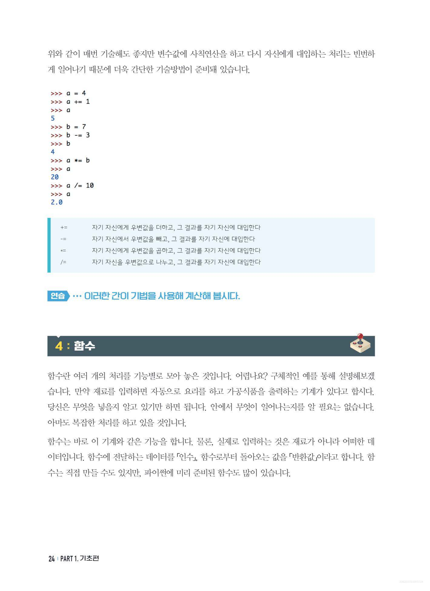

###### 위와 같이 매번 기술해도 좋지만 변수값에 사칙연산을 하고 다시 자신에게 대입하는 처리는 빈번하 게 일어냐기 때문에 더욱 간단한 기술방법이 준비돼 있습니다.

>>> a = 4

- >>> a += 1

- >>> a 5
- >>> b = 7

- >>> b -= 3 >>> b 4 >>> a *= b

>>> a

###### 20

>>> a I= 10 >>> a

###### 2 .0

+=

자기 자신에게 우변값을 더아고, 그 결과를 자기 자신에 대입만다 자기 자신에서 우변값을 빼고, 그 결과를 자기 자신에 대입만다 자기 자신에게 우변값을 곱아고, 그 결과를 자기 자신에 대입만다 자기 자신 을 우변값으로 나누고, 그 결과를 자기 자신에 대입만다

*=

!=

###### … 기법을 봅시다

함수란 여러 개의 처리를 기능별로 모아 놓은 것입니다. 어렵나요? 구체적인 예를 통해 설명해보겠 습니다. 만약 재료를 입력하면 자동으로 요리를 하고 가공식품을 출력하는 기계가 있다고 합시다.

###### 당신은 무엇을 넣을지 알고 있기만 하면 됩니다. 안에서 무엇이 일어냐는지를 알 필요는 없습니다.

아마도 복잡한 처리를 하고 였을 것입니다.

함수는 바로 이 기계와 같은 기능을 합니다. 물론, 실제로 입력하는 것은 재료가 아니라 어떠한 네 이터입니다. 함수에 전달하는 데이터를 「인수」, 함수로부터 돌아오는 값을 「반환값」이라고 합니다. 함 수는 직접 만들 수도 있지만, 파이썬에 미리 준비된 함수도 많이 있습니다.

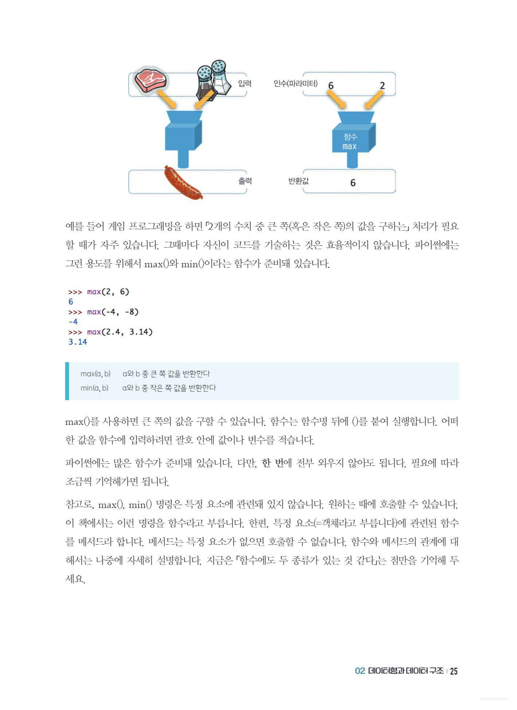

.:""…""••••.••~•............................••....._ .........

###### 뗄덤尻》입력

;

인쉬파라미터) 6 2

’.•................* ........................... - ·······..

###### •••••••••••••촐••••••••••••• .....................................................

,_.................................................. ”""""""•솔,

###### 반환값 6 !

###### I,.•••.•,,•.••.••..••.•..••.••..•.••.••••.

: ;

조키려

눌 -,

'....-................................~...........................)

...............,...........,..싶

###### 예를 들어 게임 프로그래밍을 하면 「2개의 수치 중 큰 쪽(혹은 작은 쪽)의 값을 구하는」 처리가 필요

할 때가 자주 있습니다. 그때마다 자신이 코드를 기술하는 것은 효율적이지 않습니다. 파이썬에는

###### 그런 용도를 위해서 maxO와 minO이라는 함수가 준비돼 있습니다.

>>> max(2, 6) 6 >>> max(-4, -8)

-4 >>> max(2 .4, 3.14) 3.14

max(a, b) min(a, b)

a와 b 중큰쪽값을 반판만다 a와 b 중작은쪽값을반판만다

###### max(）를 사용하면 큰 쪽의 값을 구할 수 있습니다. 함수는 함수명 뒤에 O를 붙여 실행합니다. 어떠

한 값을 함수에 입력하려면 괄호 안에 값이나 변수를 적습니다. 파이썬에는 많은 함수가 준비돼 있습니다. 다만, 한 번에 전부 외우지 않아도 됩니다. 필요에 따라 조금씩 기억해가면 됩니다.

###### 참고로, maxO. minO 명령은 특정 요소에 관련돼 있지 않습니다. 원하는 때에 호출할 수 있습니다.

###### 이 책에서는 이런 명령을 함수라고 부릅니다. 한편 특정 요소(＝객체라고 부릅니다)에 관련된 함수

를 메서드라 합니다. 메서드는 특정 요소가 없으면 호출할 수 없습니다. 함수와 메서드의 관계에 대 해서는 나중에 지세히 설명합니다. 지금은 「함수에도 두 종류가 있는 것 같다」는 점만을 기억해 두 세요.

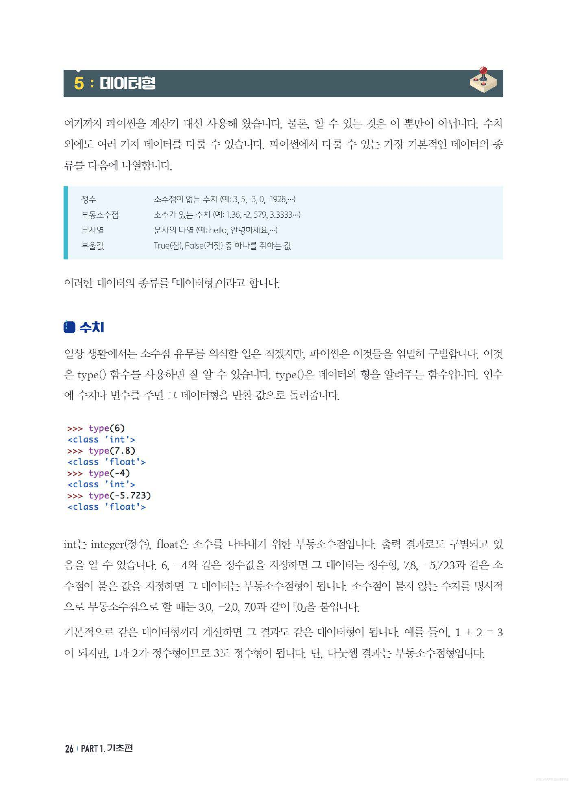

여기까지 파이썬을 계산기 대신 사용해 왔습니다. 물론, 할 수 있는 것은 이 뿐만이 아닙니다. 수치 외에도 여러 가지 데이터를 다룰 수 있습니다. 파이썬에서 다룰 수 있는 가장 기본적인 데이터의 종

###### 류를 다음에 나열합니다.

소수점이 없는 수지 (예: 3, 5, -3, 0, -1928,…) 소수가 있는 수지 (예: 1.36, -2, 579, 3.3333···) 문자의 나열 (예: hello, 안녕아세요,…) True(잠)， False(거짓) 중 아나를 쥐아는 값

정수 부동소수점

문자열 부울값

이러한 데이터의 종류를 「네이터형」이라고 합니다.

###### ·수지

###### 일상 생활에서는 소수점 유무를 의식할 일은 적겠지만, 파이썬은 이것들을 엄밀히 구별합니다. 이것 은 typeO 함수를 사용하면 잘 알 수 있습니다. typeO은 데이터의 형을 알려주는 함수입니다. 인수 에 수치나 변수를 주면 그 데이터형을 반환 값으로 돌려줍니다.

>>> type(6)

<class ' int ' > >>> type(7.8) <class ' float'>

>>> type(-4) <class ' int'> >>> type(-5 .723)

' float '>

###### int는 integer(정수), float은 소수를 나타내기 위한 부동소수점입니다. 출력 결과로도 구별되고 있 음을 알 수 있습니다. 6, ―4와 같은 정수값을 지정하면 그 데이터는 정수형, 7.8, ―5.723과 같은 소

수점이 붙은 값을 지정하면 그 데이터는 부동소수점형이 됩니다. 소수점이 붙지 않는 수치를 명시적

으로 부동소수점으로 할 때는 3.0, —2.0, 7.0과 같이 ~o」을붙입니다.

기본적으로 같은 데이터형끼리 계산하면 그 결과도 같은 데이터형이 됩니다. 예를 들어, 1 十 2 = 3

이 되지만, 1과 2가 정수형이므로 3도 정수형이 됩니다. 단, 나눗셈 결과는 부동소수점형입니다.

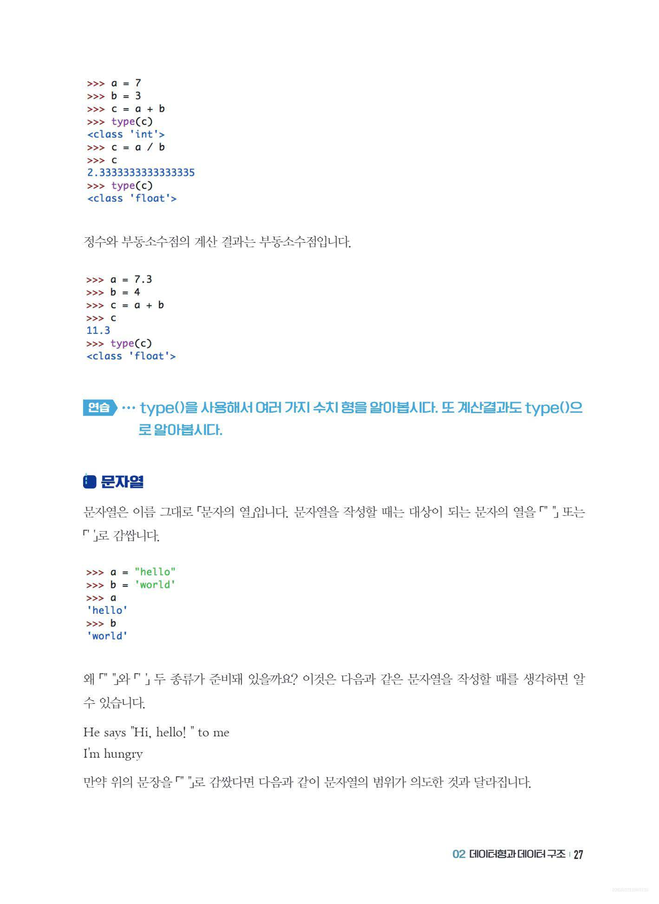

- >>> a = 7
- >>> b = 3
- >>> c = a + b >>> type(c) <class 'i.nt'> >>> c = a I b >>> C

>>> type(c) <class 'float'>

정수와 부동소수점의 계산 결과는 부동소수점입니다.

- >>> a = 7.3
- >>> b = 4
- >>> c = a + b >>> C 11.3 >>> type(c) <class 'float'>

…type( 또

###### ·문자열

문자열은 이름 그대로 「문자의 열」입니다. 문자열을 작성할 때는 대상이 되는 문자의 열을 「“ '\ 또는 「' 酉로 갑쌉니다.

- >>> a = "hello"
- >>> b = 'world'

- >>> a ' hello '
- >>> b ' world'

왜 「“ ’浮十 「' ) 두 종류가 준비돼 있을까요? 이것은 다음과 같은 문자열을 작성할 때를 생각하면 알

###### 수 있습니다.

He says "Hi, hello! " to me I'm hungry

만약 위의 문장을 「“ 'J로 갑쌌다면 다음과 같이 문자열의 범위가 의도한 것과 달라집니다.

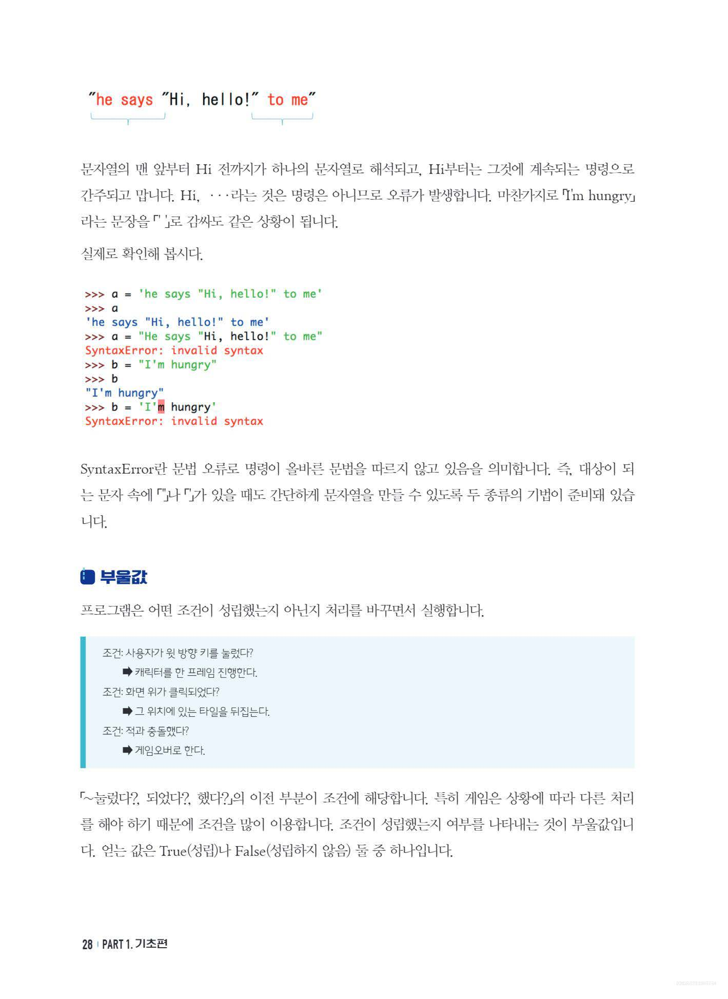

###### "he says "Hi, he I Io!,, to me"

###### , __J

r

1

문자열의 맨 앞부터 Hi 전까지가 하나의 문자열로 해석되고, Hi부터는 그것에 계속되는 명령으로 간주되고 맙니다. Hi, · · ·라는 것은 명령은 아니므로 오류가 발생합니다. 마찬가지로 「「m hungry」

- 라는 문장을 「' 酒로 갑싸도 같은 상황이 됩니다.

실제로확인해봅시다.

- >>> a = 'he says "Hi, hello!" to me'

- >>> a ' he says "Hi , hello!" to me'

- >>> a = says "Hi, hello! " to me"

SyntaxError : invalid syntax

- >>> b = "I'm hungry"

- >>> b "I'm hungry"

- >>> b = 'I 댑 hungry'

SyntaxError: invalid syntax

SyntaxError란 문법 오류로 명령이 올바른 문법을 따르지 않고 있음을 의미합니다. 즉, 대상이 되 는 문자 속에 「'J나 「j가 있을 때도 간단하게 문자열을 만들 수 있도록 두 종류의 기법이 준비돼 있습

니다.

###### ·부을값

###### 프로그램은 어떤 조건이 성립했는지 아닌지 처리를 바꾸면서 실행합니다.

조건: 사용자가 윗 방망 키를 눌렀다?

###### 캐릭터를 만 프레임 진0상만다.

조건: 화면 위가 클릭되었다?

###### • 그 위지에 있는 타일을 두1집는다.

조건:적과중돌했다?

· 게임오버로만다.

「~눌렀다?， 되었다?, 했다?」의 이전 부분이 조건에 해당합니다. 특히 게임은 상황에 따라 다른 처리 를 해야 하기 때문에 조건을 많이 이용합니다. 조건이 성립했는지 여부를 나타내는 것이 부울값입니

###### 다. 얻는 값은 True(성립)나 False(성립하지 않음) 둘 중 하나입니다.

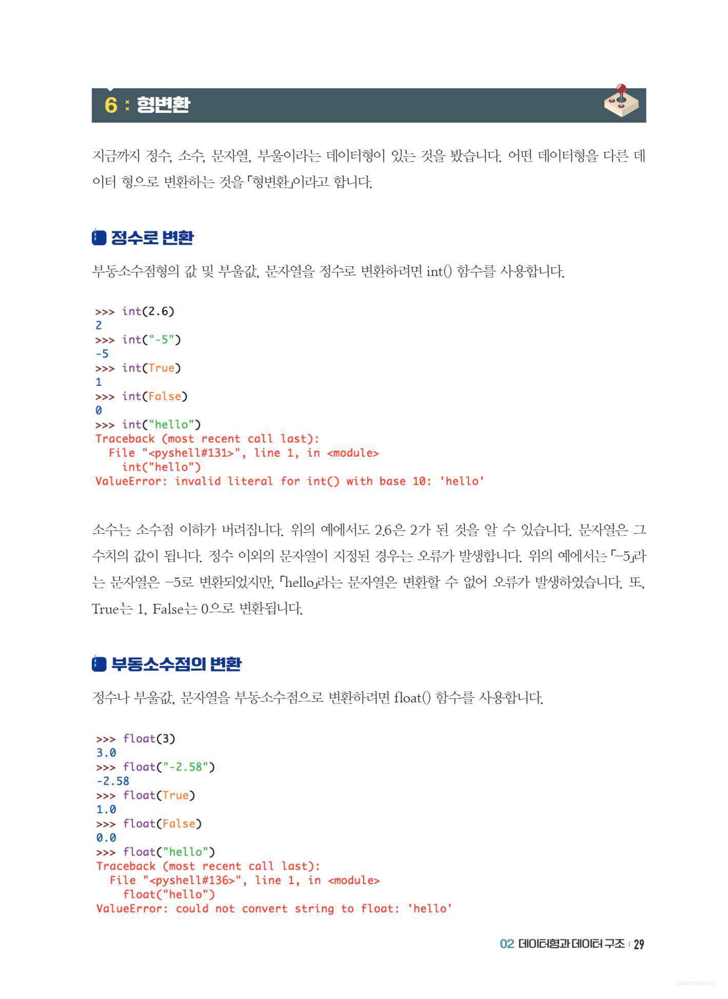

지금까지 정수, 소수, 문자열 부울이라는 데이터형이 있는 것을 봤습니다. 어떤 데이터형을 다른 데 이터 형으로 변환하는 것을 「형변환」이라고 합니다.

###### ·정수로변촨

###### 부동소수점형의 값 및 부울값, 문자열을 정수로 변환하려면 intO 함수를 사용합니다.

###### >>> i.nt(Z .6)

2

>>> i.nt( "-5")

- 5 >>> i.nt(True)

1

>>> i.nt( False) >>> i.nt( "hello") Traceback (most recent call last):

"<pyshell#l31>" , 1, i.n <module> ValueError : i.nvali.d li.teral for i.nt() wi.th base 10: ' hello '

소수는 소수점 이하가 버려집니다. 위의 예에서도 2.6은 2가 된 것을 알 수 있습니다. 문자열은 그 수치의 값이 됩니다. 정수 이외의 문자열이 지정된 경우는 오류가 발생합니다. 위의 예에서는 「_5」라

는 문자열은 ―5로 변환되었지만, 「hello」라는 문자열은 변환할 수 없어 오류가 발생하였습니다. 또, True는 1, False는 0으로 변환됩니다.

###### ·부등소수점의변촨

###### 정수나 부울값, 문자열을 부동소수점으로 변환하려면 float() 함수를 시용힙니다.

>>> float(3)

3. 0 >>> float( "-2. 58")

- 2.58 >>> float( )

1.0

>>> float( False) 0 .0 >>> float("hello") Traceback (most recent call last):

"<pyshell#136>" , li.ne 1, i.n <module> float( "

ValueError: not convert string to float: ' hello'

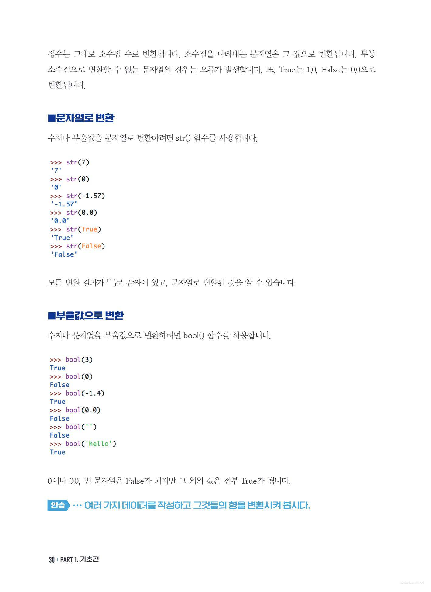

정수는 그대로 소수점 수로 변환됩니다. 소수점을 나타내는 문자열은 그 값으로 변환됩니다. 부동

소수점으로 변환할 수 없는 문자열의 경우는 오류가 발생합니다. 또, True는 1.0, False는 0.0으로

변환됩니다.

###### 문자열로변촨

수치냐 부울값을 문자열로 변환하려면 strO 함수를 사용합니다.

>>> str(7)

' 7 '

>>> str(0) ' 0 ' >>> str(-1. 57) ' -1. 57 ' >>> str(0.0)

' 0 .0'

>>> str(True) 'True' >>> str( False) 'False'

모든 변환 결과가 「' 酉로 갑싸여 있고, 문자열로 변환된 것을 알 수 있습니다.

###### 부을값으로번촨

수치냐 문자열을 부울값으로 변환하려면 boolO 함수를 사용합니다.

>>> bool(3) True >>> bool(0) False >>> bool(-1. 4) True >>> bool(0 .0) False >>> bool(' ' ) False >>> bool(' hello' ) True

0이나 0.0, 빈 문자열은 False가 되지만 그 외의 값은 전부 True가 됩니다.

###### … 가지[ilOIE~를 그것들의 봅시다

30 1PART 1. 기조곤

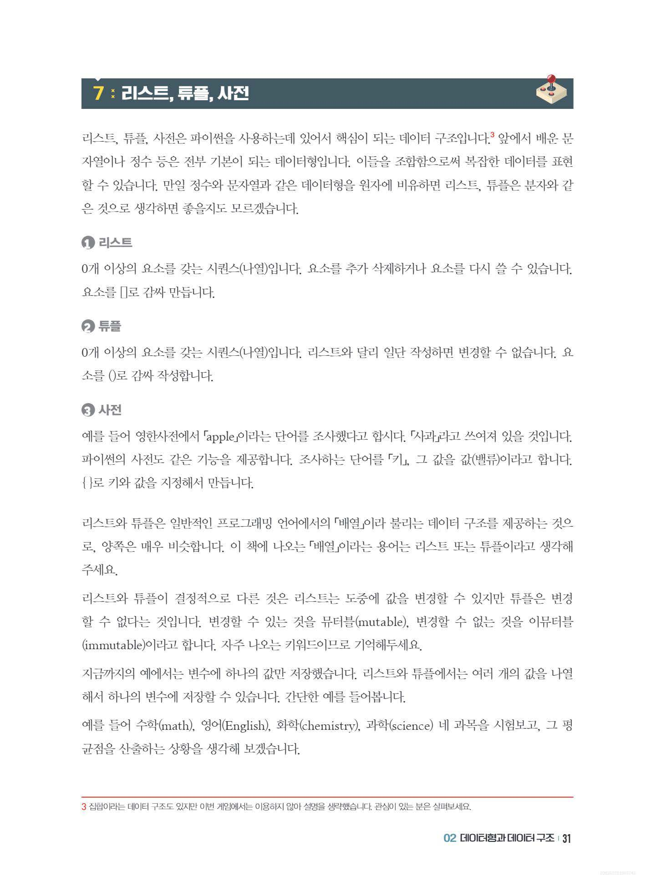

###### 리스트, 튜플 사전은 파이썬을 사용하는데 있어서 핵심이 되는 데이터 구조입니다.3 앞에서 배운 문

- 자열이나 정수 등은 전부 기본이 되는 데이터형입니다. 이들을 조합함으로써 복잡한 데이터를 표현 할 수 있습니다. 만일 정수와 문자열과 같은 데이터형을 원자에 비유하면 리스트. 튜플은 분자와 같 은 것으로 생각하면 좋을지도 모르겠습니다.

0 리스트

0개 이상의 요소를 갖는 시퀀스(나열)입니다. 요소를 추가 삭제하거나 요소를 다시 쓸 수 있습니다.

요소를 D로 갑싸 만듭니다.

Q 튜플

0개 이상의 요소를 갖는 시퀀스(나열)입니다. 리스트와 달리 일단 작성하면 변경할 수 없습니다. 요 소를 O로 갑싸 작성합니다.

O 사전

예를 들어 영한사전에서 「apple」이라는 단어를 조사했다고 합시다. 「사과」라고 쓰여져 있을 것입니다.

- 파이썬의 사전도 같은 기능을 제공합니다. 조사하는 단어를 「키」, 그 값을 값(벨류)이라고 합니다. { ｝로 키와 값을 지정해서 만듭니다.

리스트와 튜플은 일반적인 프로그래밍 언어에서의 「배열」이라 불리는 데이터 구조를 제공하는 것으 로, 양쪽은 매우 비슷합니다. 이 책에 냐오는 「배열」이라는 용어는 리스트 또는 튜플이라고 생각해 주세요.

리스트와 튜플이 결정적으로 다른 것은 리스트는 도중에 값을 변경할 수 있지만 튜플은 변경

###### 할 수 없다는 것입니다. 변경할 수 있는 것을 뮤더블(mutable), 변경할 수 없는 것을 이뮤터블 (immutable)이라고 합니다. 자주 냐오는 키워드이므로 기억해두세요.

지금까지의 예에서는 변수에 하나의 값만 저장했습니다. 리스트와 튜플에서는 여러 개의 값을 냐열 해서 하나의 변수에 저장할 수 었습니다. 간단한 예를 들어봅니다.

###### 예를 들어 수학(math), 영어(English), 화학(chemistry), 과학(science) 네 과목을 시험보고, 그 평

###### 균점을 산출하는 상황을 생각해 보겠습니다.

3 집힙이라는 데이터 구조도 있지만 이번 게임에서는 이용하지 않아 설명을 생략했습니다. 관심이 였는 분은 살펴보서묘、

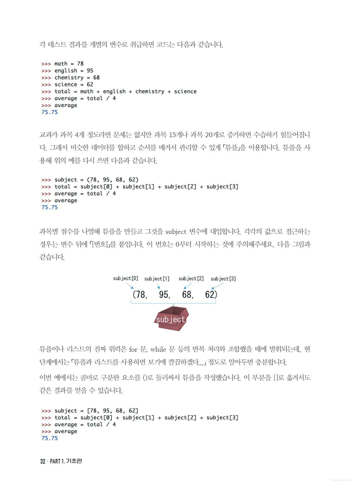

각 데스트 결과를 개별의 변수로 취급하면 코드는 다음과 같습니다.

>>> math = 78 >>> engli.sh = 95 >>> chemi.stry = 68 >>> sci.ence = 62 >>> total = math + engli.sh + chemi.stry + sci.ence >>> average = total / 4 >>> average 75 . 75

교과가 과목 4개 정도라면 문제는 없지만 과목 15개나 과목 20개로 증가하면 수습하기 힘들어집니

다. 그래서 비슷한 데이터를 합하고 순서를 매겨서 관리할 수 있게 「튜플」을 이용합니다. 튜플을 사 용해 위의 예를 다시 쓰면 다음과 같습니다.

>>> subject = (78, 95, 68, 62) >>> total = subject[0] + subject[!] + subject[Z] + subject[3] >>> average = total / 4 >>> average 75 . 75

과목별 점수를 나열해 튜플을 만들고 그것을 subject 변수에 대입합니다. 각각의 값으로 접근하는

경우는 변수 뒤에 「〔번호]훑} 붙입니다. 이 번호는 0부터 시작하는 것에 주의해주세요. 다음 그림과

###### 같습니다.

###### subject [O] subject [1 ]

subject [2] subject [3]

// k /

\龜 \

(78, 95,

68, 62)

느

_」

튜플이나 리스트의 진짜 위력은 for 문, while 문 둥의 반복 처리와 조합했을 때에 발휘되는데, 현

단계에서는 「튜플과 리스트를 사용하면 보기에 깔끔하겠다…」 정도로 알아두면 충분합니다.

###### 이번 예에서는 콤마로 구분한 요소를 O로 둘러싸서 튜플을 직성했습니다. 이 부분을 D로 옮겨서도 같은 결과를 얻을 수 있습니다.

>>> subject = [78, 95, 68, 62] >>> total = subject[0] + subject[l] + subject[ZJ + subject[3] >>> average = total / 4 >>> average 75 . 75

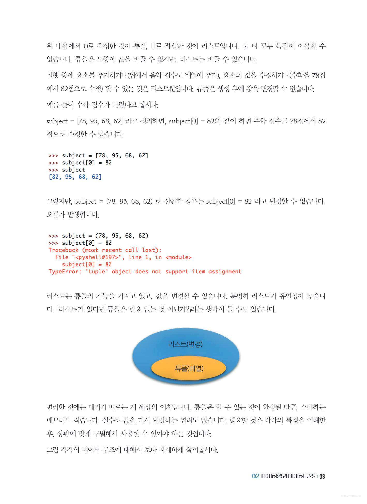

###### 위 내용에서 O로 작성한 것이 튜플, D로 작성한 것이 리스트입니다. 둘 다 모두 똑같이 이용할 수

있습니다. 튜플은 도중에 값을 바꿀 수 없지만, 리스트는 바꿀 수 있습니다.

###### 실행 중에 요소를 추가하거나(뒤에서 음악 점수도 배열에 추가)， 요소의 값을 수정하거나(수학을 78점 에서 82점으로 수정) 할 수 있는 것은 리스트뿐입니다. 튜플은 생성 후에 값을 변경할 수 없습니다.

예를 들어 수학 점수가 틀렸다고 합시다. subject = [78, 95, 68, 62] 라고 정의하면, subject[이 = 82와 같이 하면 수학 점수를 78점에서 82 점으로 수정할 수 있습니다.

>>> subject = [78, 95, 68, 62] >>> subject[0] = 82 >>> subj ect

, 95 , 68 , 62]

그렇지만, subject = (78, 95, 68, 62) 로 선언한 경우는 subject[이 = 82 라고 변경할 수 없습니다.

오류가발생합니다.

>>> subj ect = (78, 95, 68, 62) >>> subject [0] = 82 Traceback (most recent call last):

File "<pyshell#197>" , 1, in <module>

###### =

###### TypeError: 'tuple ' object does not support item assignment

리스트는 튜플의 기능을 가지고 있고, 값을 변경할 수 있습니다. 분명히 리스트가 유연성이 높습니

###### 다. 「리스트가 있다면 튜플은 필요 없는 것 아닌가?」라는 생각이 들 수도 있습니다.

편리한 것에는 대가가 따르는 게 세상의 이치입니다. 튜플은 할 수 있는 것이 한정된 만큼, 소비하는 메모리도 적습니다. 실수로 값을 다시 변경하는 염려도 없습니다. 중요한 것은 각각의 특징을 이해한 후, 상황에 맞게 구별해서 사용할 수 있어야 하는 것입니다.

그럽 각각의 데이터 구조에 대해서 보다 자세하게 살펴봅시다.

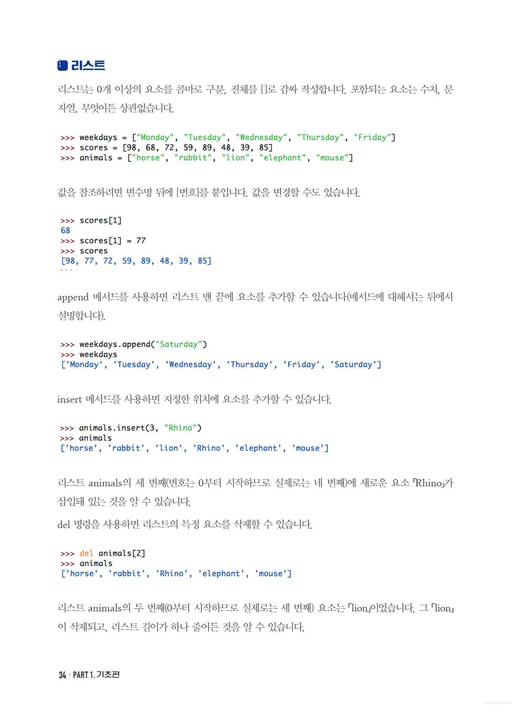

###### ·리스트

리스트는 0개 이상의 요소를 콤마로 구분, 전체를 D로 갑싸 작성합니다. 포함되는 요소는 수치, 문

자열, 무엇이든 상관없습니다.

###### >>> weekdays = ["Monday" , "Tuesday" , "Wednesday" , "Thursday" , "Friday"] >>> scores = [98, 68, 72, 59, 89, 48, 39, 85] >>> animal s = "horse" , "rabbit" , "lion" , "elephant" , "mouse"]

값을 참조하려면 변수명 뒤에 [번호]를 붙입니다. 값을 변경할 수도 있습니다.

>>> scores[1] 68 >>> scores[l] = 77 >>> scores [98 , 77 , 72 , 59 , 89 , 48 , 39 , 85]

append 메서드를 사용하면 리스트 맨 끝에 요소를 추가할 수 있습니다(메서드에 대해서는 뒤에서 설명합니다).

###### >>> weekdays.append("Saturday") >>> weekdays ['Monday' , 'Tuesday' , 'Wednesday' , 'Thursday' , 'Friday' , 'Saturday']

insert 메서드를 사용하면 지정한 위치에 요소를 추가할 수 있습니다.

###### >>> animals. i nsert(3, "Rhino") >>> animals [ ' horse ' , ' rabbit ' , ' lion ' , ' Rhino ' , ' elephant ' , ' mouse ']

###### 리스트 animals의 세 번째(번호는 0부터 시작하므로 실제로는 네 번째)에 새로운 요소 「Rhino」가

삽입돼 있는 것을 알 수 있습니다.

del 명령을 사용하면 리스트의 특정 요소를 삭제할 수 있습니다.

###### >>> del animals[ZJ >>> animals ['horse' , 'rabbit' , 'Rhino' , 'elephant' , 'mouse']

###### 리스트 animals의 두 번째(0부터 시작하므로 실제로는 세 번째) 요소는 「lion」이었습니다. 그 「lion」

이 삭제되고, 리스트 길이가 하나 줄어든 것을 알 수 있습니다.

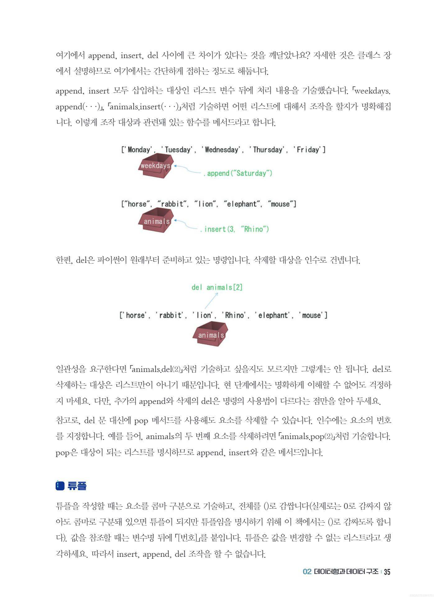

여기에서 append, insert, del 사이에 큰 차이가 있다는 것을 깨달았나요? 자세한 것은 클래스 장 에서 설명하므로 여기에서는 간단하게 접하는 정도로 해둡니다.

append, insert 모두 삽입하는 대상인 리스트 변수 뒤에 처리 내용을 기술했습니다. 「:weekdays. append(· · .）」， 「animals.insert(· · .）」처럽 기술하면 어떤 리스트에 대해서 조작을 할지가 명확해집 니다. 이렇게 조작 대상과 관련돼 있는 함수를 메서드라고 합니다.

###### 『 Monday' ._:__ Tuesday' . ' Wednesday' . ' Thursday' , ' Fr iday' ]

###### . append ("Saturday")

["horse". :_'__rabb it", "Iion", "elephant", "mouse"]

..

. insert (3. "Rh ino")

한편, del은 파이썬이 원래부터 준비하고 있는 명령입니다. 삭제할 대상을 인수로 건넵니다.

###### de I an ima Is[2]

•

###### [' horse' . · rabb it' , · Iion' , ·Rh ino' , · elephant' , ' mouse· ]

일관성을 요구한다면 「animals.del(2)」처럽 기술하고 싶을지도 모르지만 그렇게는 안 됩니다. del로 삭제하는 대상은 리스트만이 아니기 때문입니다. 현 단계에서는 명확하게 이해할 수 없어도 걱정하 지 마세요. 다만, 추가의 append와 삭제의 del은 명령의 사용법이 다르다는 점만을 알아 두세요.

참고로, del 문 내신에 pop 메서드를 사용해도 요소를 삭제할 수 있습니다. 인수에는 요소의 번호 를 지정합니다. 예를 들어, animals의 두 번째 요소를 삭제하려면 「animals.pop(2)J처럽 기술합니다. pop은 대상이 되는 리스트를 명시하므로 append, insert와 같은 메서드입니다.

###### ·튜플

튜플을 작성할 때는 요소를 콤마 구분으로 기술하고, 전체를 O로 갑쌉니다(실제로는 O로 갑싸지 않 아도 콤마로 구분돼 있으면 튜플이 되지만 튜플임을 명시하기 위해 이 책에서는 ()로 갑싸도록 합니

###### 다)． 값을 참조할 때는 변수명 뒤에 「[번호]」를 붙입니다. 튜플은 값을 변경할 수 없는 리스트라고 생

각하세요. 따라서 insert, append, del 조작을 할 수 없습니다.

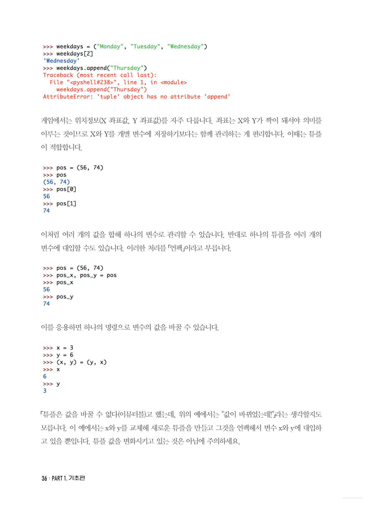

>>> weekdays = ( "Monday" , "Tuesday" , "Wednesday") >>> weekdays[ZJ 'Wednesday' >>> weekdays . append("Thursday")

: "< , 1,

Attri.buteError : ' tuple ' object has no attri.bute 'append'

###### 게임에서는 위치정보(X 좌표값, Y 좌표값)를 자주 다룹니다. 좌표는 X와 Y가 짝이 돼서야 의미를

###### 이루는 것이므로 X와 Y를 개별 변수에 저장하기보다는 함께 관리하는 게 편리합니다. 이때는 튜플 이 적합합니다.

>>> pos = (56, 74) >>> pos (56, 74) >>> pos[0]

>>> pos[l] 74

###### 이처럽 여러 개의 값을 합해 하냐의 변수로 관리할 수 있습니다. 반대로 하냐의 튜플을 여러 개의 변수에 대입할 수도 있습니다. 이러한 처리를 「언팩」이라고 부릅니다.

>>> pos = (56, 74)

>>> pos_x, pos_y = pos

- >>> pos_x 56
- >>> pos_y 74

###### 이를 응용하면 하나의 명령으로 변수의 값을 바꿀 수 였습니다.

>>> X = 3 >>> y = 6 >>> (x, y) = (y, x) >>> X

###### 6

###### >>> y

- 3

###### 「튜플은 값을 바꿀 수 없다(이뮤터블)고 했는데, 위의 예에서는 "값이 바뀌었는데!＇困라는 생각할지도

모릅니다. 이 예에서는 x와 y를 교체해 새로운 튜플을 만들고 그것을 언팩해서 변수 x와 y에 대입하 고 있을 뿐입니다. 튜플 값을 변화시키고 있는 것은 아님에 주의하세요.

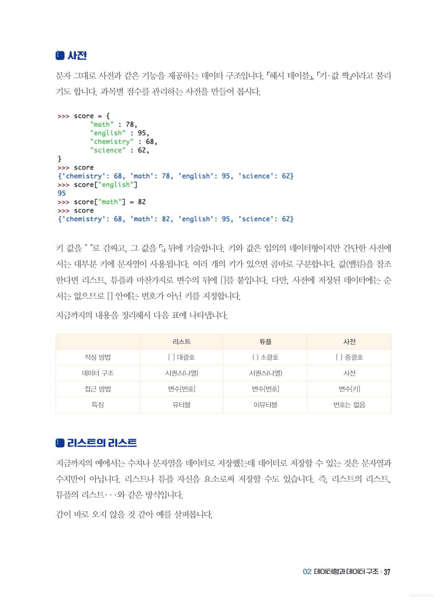

###### ·사전

문자 그대로 사전과 같은 기능을 제공하는 데이터 구조입니다. 「해시 데이블」` 「키 · 값 짝」이라고 불리 기도 합니다. 과목별 점수를 관리하는 사전을 만들어 봅시다.

###### >>> score = {

"math" : 78, "engli.sh" : 95 , "chemistry" : 68 , "sci.ence" : 62,

}

>>> score { ' chemistry' : 68, ' math ' : 78, ' english' : 95, ' science ' : 62} >>> score["english"] 95 >>> score["math"] = 82 >>> score { ' chemistry' : 68, 'math' : 82, ' engli.sh' : 95, 'science' : 62}

키 값을 “ ”로 갑싸고, 그 값을 r'..J 뒤에 기술합니다. 키와 값은 임의의 데이터형이지만 간단한 사전에

###### 서는 대부분 키에 문자열이 사용됩니다. 여러 개의 기가 있으면 콤마로 구분합니다. 값(밸류)을 참조

한다면 리스트, 튜플과 마찬가지로 변수의 뒤에 D를 붙입니다. 다만, 사전에 저장된 데이터에는 순

서는 없으므로 D안에는 번호가 아닌 키를 지정합니다.

지금까지의 내용을 정리해서 다음 표에 냐타냅니다.

리스트

튜플

人R전

[] 대괄호

작성 방법

(）소괄호

###### {｝중괄호

人|린스(나열)

人 린스(나열)

데이 터구조

사전

변수[번호]

변수[번호]

변수[7I]

###### 접근방법

번호는없음

트;.:1-.o

뮤터블

O|뮤터블

·리스트의리스트

###### 지금까지의 예에서는 수치나 문자열을 데이터로 저장했는데 데이터로 저장할 수 있는 것은 문자열과 수치만이 아닙니다. 리스트나 튜플 자신을 요소로써 저장할 수도 있습니다. 즉, 리스트의 리스트,

튜플의 리스트...와 같은 방식입니다.

###### 갑이 바로 오지 않을 것 같아 예를 살펴봅니다.

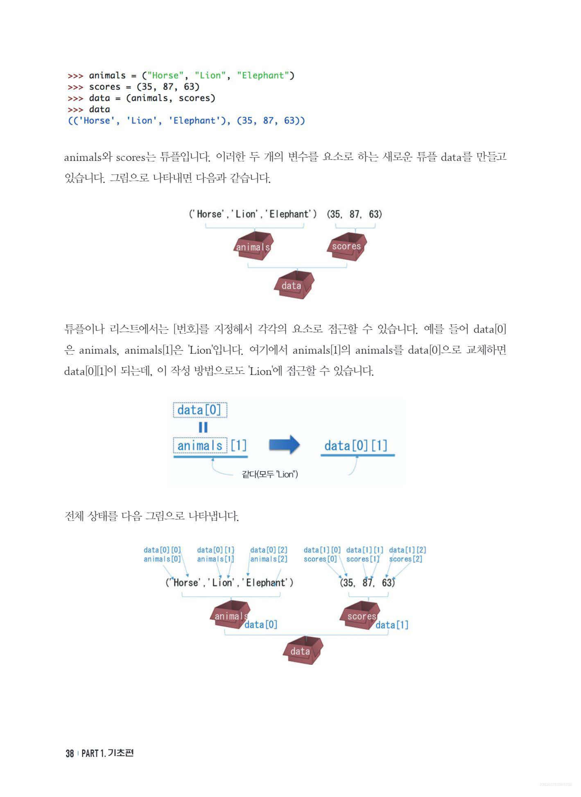

>>> animals = ( "Horse" , "Lion" , "Elephant") >>> scores = (35, 87, 63) >>> data = (animals, scores) >>> data ((' Horse ' , ' Lion ' , ' Elephant ' ) , (35 , 87, 63))

animals와 scores는 튜플입니다. 이러한 두 개의 변수를 요소로 하는 새로운 튜플 data를 만들고 있습니다. 그림으로 나타내면 다음과 같습니다.

###### (' Horse' . · Lion' , ' Elephant' ) (35, 87, 63)

튜플이나 리스트에서는 〔번호]를 지정해서 각각의 요소로 접근할 수 있습니다. 예를 들어 data[O] 은 animals, animals[l]은 'Lion’입니다. 여기에서 animals[l]의 animals를 data[이으로 교체하면 data[O][l]이 되는데, 이 작성 방법으로도 'Lion’에 접근할 수 있습니다.

며냐[§n

| ima”|s|[1]

###### data [OJ [1 ]

같다(모두 'Lion”)

###### 전체 상태를 다음 그림으로 나타냅니다.

data [OJ [OJ data (0) [ I) ,data [O) [2) data [ !) [O) data [I) [I) data [ I) [2] an lma ls ima l s[ !) jani s〔인 scores scores [ I] [2]

###### ('·Ho;se' ' Lro~· ' ' EIephant' ) 쳐5, 첩 6,3}

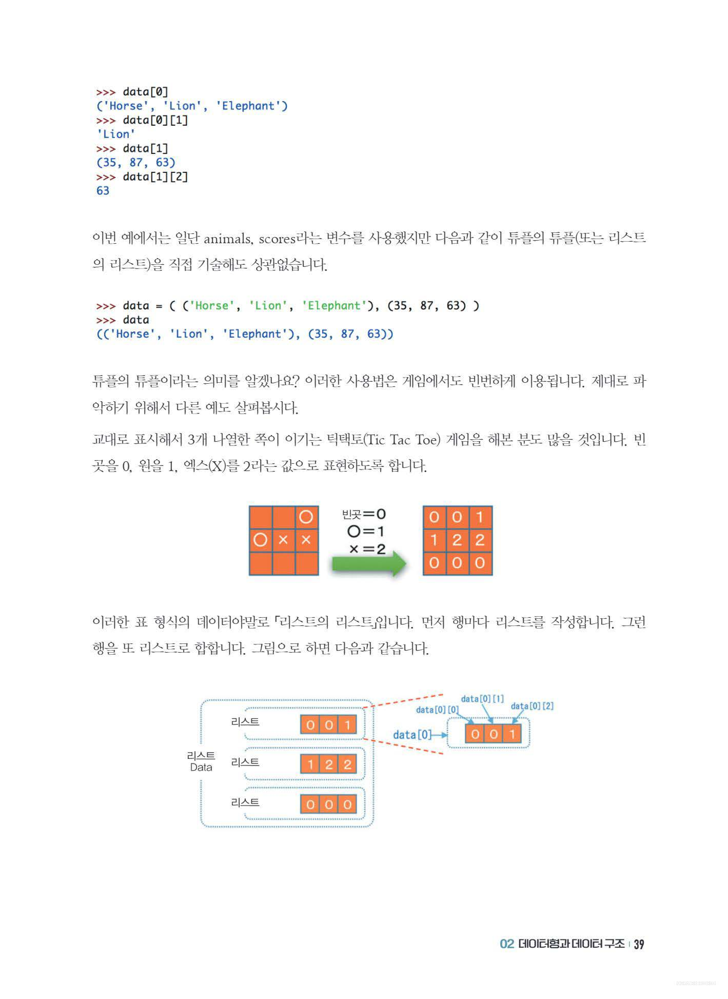

>>> data[0] (' Horse ' , ' Li.on ' , ' Elephant ' )

- >>> data [0] [1] 'Li.on ' >>> data[l] (35, 87, 63)
- >>> data [1] [2] 63

이번 예에서는 일단 animals, scores라는 변수를 사용했지만 다음과 같이 튜플의 튜플(또는 리스트 의 리스트)을 직접 기술해도 상관없습니다.

###### >>> data = ( (' Horse ' , ' Lion ' , ' Elephant' ) , (35, 87, 63) ) >>> data ((' Horse ' , ' Lion ' , ' Elephant ' ) , (35 , 87 , 63))

튜플의 튜플이라는 의미를 알겠나요? 이러한 사용법은 게임에서도 빈번하게 이용됩니다. 제대로 파 악하기 위해서 다른 예도 살펴봅시다.

###### 교대로 표시해서 3개 냐열한 쪽이 이기는 틱택토(Tic Tac Toe) 게임을 해본 분도 많을 것입니다. 빈

###### 곳을 0, 원을 1. 엑스(X)를 2라는 값으로 표현하도록 합니다.

빈곳=O

###### 0=1

###### X=2

이러한 표 형식의 데이터야말로 「리스트의 리스트」입니다. 먼저 행마다 리스트를 작성합니다. 그런 행을 또 리스트로 합합니다. 그림으로 하면 다음과 같습니다.

--- - - - - date[O][I]

...........................................................................

......................................................,.. .,.--

dat8[O) {0l \ data[O] [2]

data[O巨r····ii國;

: ......................................................- ....\.;.

리스트

--

###### ..................................................... ·.--

---

리스트

Data 리스트

....................................................... :

..•........………….......……………….......]

리스트

###### ·......................................................'

\ ..............................................................................

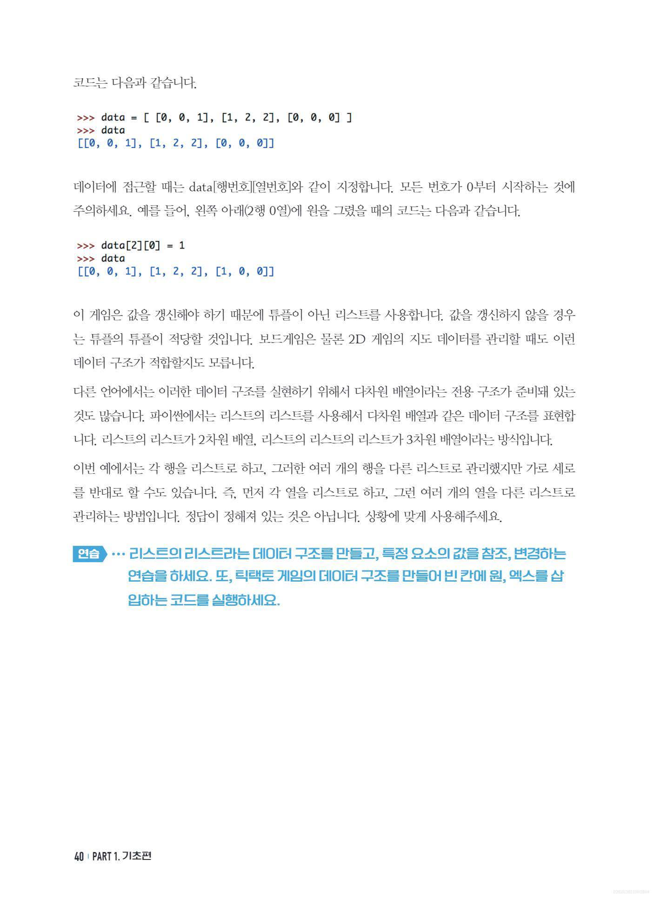

###### 코드는 다음과 같습니다.

>>> data = [ [0 , 0 , 1] , [1, 2, 2] , [0, 0 , 0] ] >>> data [ [0, 0 , 1] , [1, 2 , 2] , , 0 , 0]]

데이터에 접근할 때는 data[행번호]［열번호]와 같이 지정합니다. 모든 번호가 0부터 시작하는 것에

###### 주의하세요. 예를 들어, 왼쪽 아래(2행 0열)에 원을 그렸을 때의 코드는 다음과 같습니다.

>>> data[2] [0] = 1

###### >>> data

[[0, 0, 1] , [1, 2, 2] , [1, 0, 0]]

이 게임은 값을 갱신해야 하기 때문에 튜플이 아닌 리스트를 사용합니다. 값을 갱신하지 않을 경우

는 튜플의 튜플이 적당할 것입니다. 보드게임은 물론 2D 게임의 지도 데이터를 관리할 때도 이런

네이터 구조가 적합할지도 모릅니다.

다른 언어에서는 이러한 네이터 구조를 실현하기 위해서 다자원 배열이라는 전용 구조가 준비돼 있는 것도 많습니다. 파이썬에서는 리스트의 리스트를 사용해서 디치원 배열과 같은 데이터 구조를 표현합 니다. 리스트의 리스트가 2차원 배열, 리스트의 리스트의 리스트가 3치~ 배열이라는 빙식입니다.

이번 예에서는 각 행을 리스트로 하고, 그러한 여러 개의 행을 다른 리스트로 관리했지만 가로 세로 를 반대로 할 수도 있습니다. 즉 먼저 각 열을 리스트로 하고, 그런 여러 개의 열을 다른 리스트로 관리하는 방법입니다. 정답이 정해져 있는 것은 아닙니다. 상황에 맞게 시용-해주세요.

…리스트의리스트라는 쿠조를만들고, 특정 요소의 값를잠조, 변경하는

연습을 하세요. 또, 틱택토 게임의 [ilOIE~ 쿠조를 만들어 빈 칸매 원, 엑스를 삽

코드를 .

40 1PART 1. 기조곤

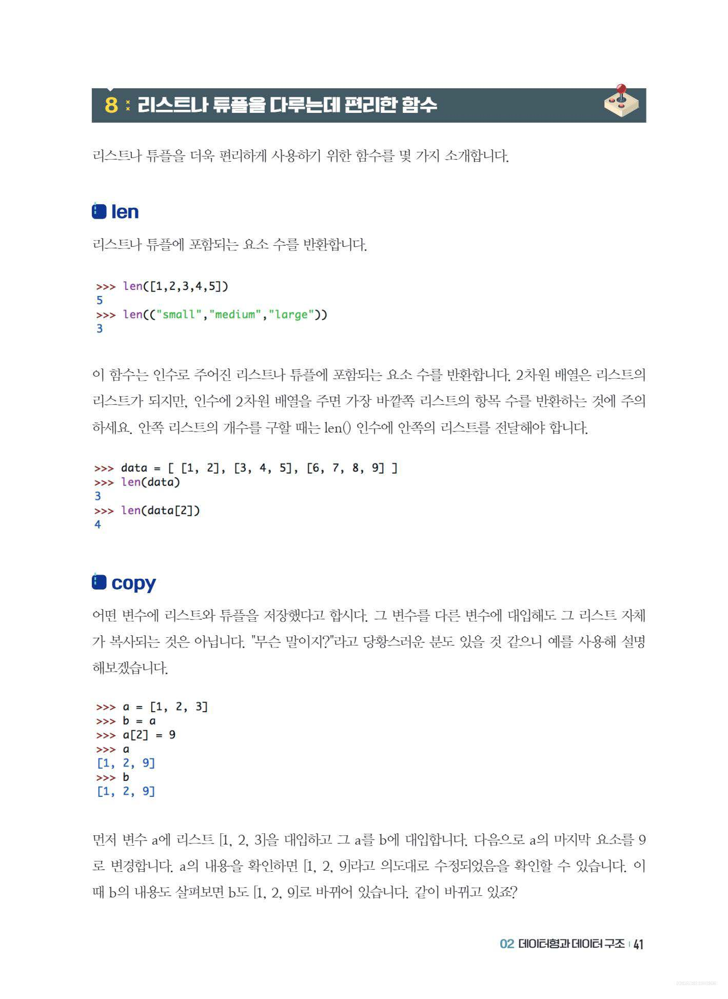

###### 리스트U 투폴틀 [＇루는[ii 편i!I탄

리스트나 튜플을 더욱 편리하게 사용하기 위한 함수를 몇 가지 소개합니다.

###### 111len

리스트나 튜플에 포함되는 요소 수를 반환합니다.

###### >>> len([l,2,3,4,5])

5

###### >>> len(("small" , "medi.um" , "large"))

3

이 함수는 인수로 주어진 리스트나 튜플에 포함되는 요소 수를 반환합니다. 2차원 배열은 리스트의 리스트가 되지만, 인수에 2치운! 배열을 주면 가장 바깥-~ 리스트의 항목 수를 반환하는 것에 주의

###### 하세요. 안쪽 리스트의 개수를 구할 때는 lenO 인수에 안쪽의 리스트를 전딜해야 합니다.

>>> data = [ [1, 2] , [3, 4 , SJ , [6, 7 , 8, 9] ] >>> len(data)

- 3 >>> len(data[ZJ)
- 4

###### ■ copy

어떤 변수에 리스트와 튜플을 저장했다고 합시다. 그 변수를 다른 변수에 대입해도 그 리스트 자체 가 복사되는 것은 아닙니다. ＂무슨 말이지?”라고 당황스러운 분도 있을 것 같으니 예를 사용해 설명 해보겠습니다.

- >>> a = [1, 2, 3]
- >>> b = a >>> a[ZJ = 9

- >>> a [1, 2 , 9]
- >>> b [1, 2 , 9]

###### 먼저 변수 a에 리스트 [1, 2, 3]을 대입하고 그 a를 b에 대입합니다. 다음으로 a의 마지막 요소를 9 로 변경합니다. a의 내용을 확인하면 [1, 2, 9]라고 의도대로 수정되었음을 확인할 수 있습니다. 이 때 b의 내용도 살펴보면 b도 [I, 2, 9]로 바뀌어 있습니다. 같이 바뀌고 있죠?

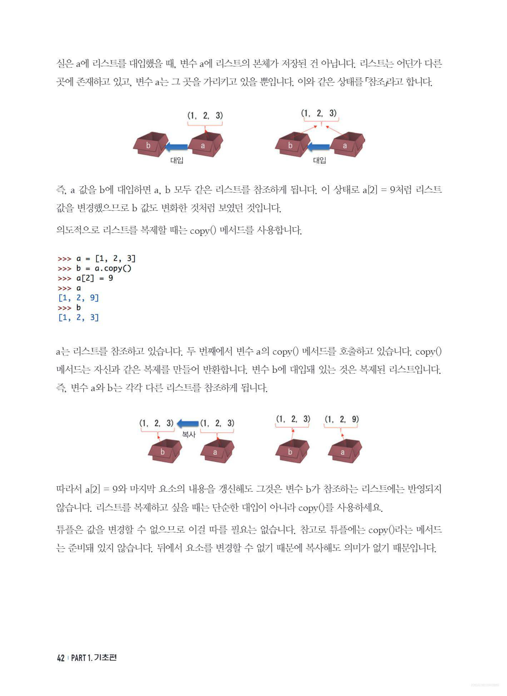

실은 a에 리스트를 대입했을 때, 변수 a에 리스트의 본체가 저장된 건 아닙니다. 리스트는 어딘가 다른 곳에 존재하고 있고, 변수 a는 그 곳을 가리키고 있을 뿐입니다. 이와 같은 상태를 「참조」라고 합니다.

###### (1. 2, 3)

###### (1, 2, 3)

I I

###### / .. r \\

대입

대입

즉 a 값을 b에 대입하면 a, b 모두 같은 리스트를 참조하게 됩니다. 이 상태로 a[2] =9처럽 리스트

값을 변경했으므로 b 값도 변화한 것처럽 보였던 것입니다.

###### 의도적으로 리스트를 복제할 때는 copy0 메서드를 사용합니다.

- >>> a = [1, 2, 3]
- >>> b = a.copy() >>> a [ZJ = 9

- >>> a [1, 2, 9]
- >>> b [1, 2, 3]

###### a는 리스트를 참조하고 있습니다. 두 번째에서 변수 a의 copyQ 메서드를 호출하고 있습니다. copyQ

메서드는 자신과 같은 복제를 만들어 반환합니다. 변수 b에 대입돼 있는 것은 복제된 리스트입니다. 즉, 변수 a와 b는 각각 다른 리스트를 찹조하게 됩니다.

(1, 2, 3) (1. 2, 9)

###### (1. 2. 3) ._(1. 2, 3)

’

1 복사 ’

L

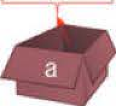

따라서 a[2] =9와 마지막 요소의 내용을 갱신해도 그것은 변수 b가 참조하는 리스트에는 반영되지

않습니다. 리스트를 복제하고 싶을 때는 딘순한 대입이 아니라 copyQ를 사용하세요.

튜플은 값을 변경할 수 없으므로 이걸 띠를- 필요는 없습니다. 참고로 튜플에는 copyQ라는 메서드

는 준비돼 있지 않습니다. 뒤에서 요소를 변경할 수 없기 때문에 복사해도 의미가 없기 때문입니다.

###### 42 1PART1, 기조펀

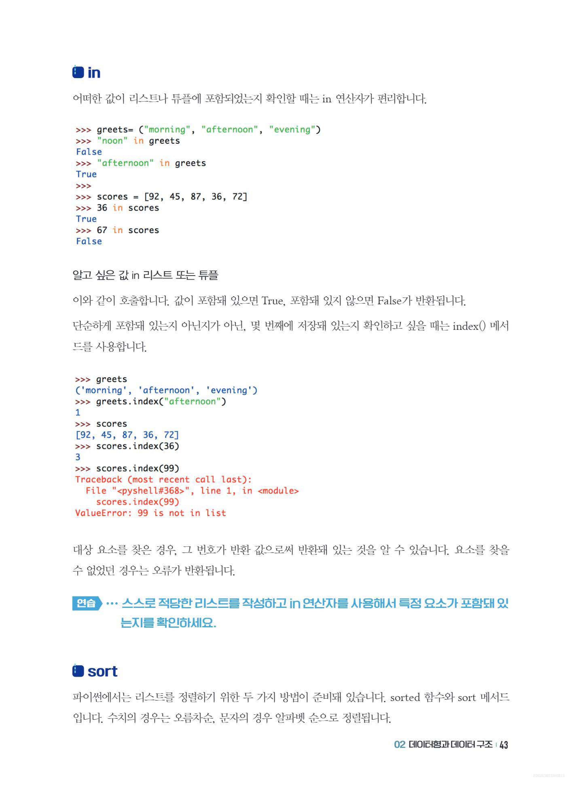

###### (I in

어떠한 값이 리스트냐 튜플에 포함되었는지 확인할 때는 in 연산자가 편리합니다.

>>> greets= ( "morning" , "afternoon" , "evening") >>> "noon" in greets False >>> "afternoon" i n greets True

>>> >>> scores = [92, 45, 87, 36, 72] >>> 36 i n scores True >>> 67 i.n scores False

알고싶은값 in 리스트또는튜플

이와 같이 호출합니다. 값이 포함돼 있으면 True, 포함돼 있지 않으면 False가 반환됩니다. 단순하게 포함돼 있는지 아닌지가 아닌, 몇 번째에 저장돼 있는지 확인하고 싶을 때는 indexO 메서 드를사용합니다.

###### >>> greets (' morning ' , ' afternoon ' , ' evening ' ) >>> greets . index("afternoon")

1

>>> scores [92, 45, 87, 36, >>> scores.index(36) 3 >>> scores.index(99)

recent call

"<pyshell#368>" , 1, <module> scores.index(99)

ValueError: is not in list

대상 요소를 찾은 경우; 그 번호가 반환 값으로써 반환돼 있는 것을 알 수 있습니다. 요소를 찾을

###### 수 없었던 경우는 오류가 반환됩니다.

…스스로적당탄리스트를작성하고in연산자를사응해서특정요소가포합EH있

는지를확인하세요.

###### ■ so『t

파이썬에서는 리스트를 정렬하기 위한 두 가지 방법이 준비돼 있습니다. sorted 함수와 sort 메서드 입니다. 수치의 경우는 오름차순, 문자의 경우 알파벳 순으로 정렬됩니다.

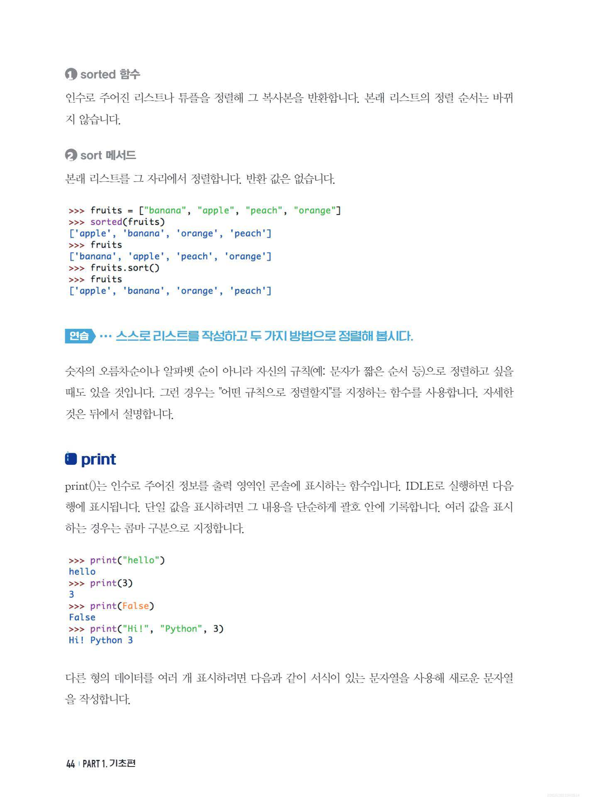

###### C)sorted 합수

인수로 주어진 리스트나 튜플을 정렬해 그 복사본을 반환합니다. 본래 리스트의 정렬 순서는 바뀌

지 않습니다.

###### Qsort 매서드

본래 리스트를 그 자리에서 정렬합니다. 반환 값은 없습니다.

>>> fruits = [ "banana" , "apple" , "peach" , "orange"] >>> sorted(fruits) [ ' apple ' , ' banana ' , ' orange ' , ' peach ' ] >>> fruits [ ' banana ' , ' apple ' , ' peach ' , ' orange ' ] >>> fruits . sort() >>> fruits [ ' apple ' , ' banana ' , ' orange ' , ' peach ' ]

…스스로리스트를작성하고두 방법으로 봅시다

숫자의 오름차순이나 알파벳 순이 아니라 자신의 규칙(예: 문자가 짧은 순서 등)으로 정렬하고 싶을

때도 있을 것입니다. 그런 경우는 “어떤 규칙으로 정렬할지'틀 지정하는 함수를 사용합니다. 자세한

것은 뒤에서 설명합니다.

###### • p『int

###### printO는 인수로 주어진 정보를 출력 영역인 콘솔에 표시하는 함수입니다. IDLE로 실행하면 다음

행에 표시됩니다. 단일 값을 표시하려면 그 내용을 단순하게 괄호 안에 기록합니다. 여러 값을 표시

- 하는 경우는 콤마 구분으로 지정합니다.

>>> print( "hello") hello >>> print(3)

- 3 >>> print( Folse) False >>> print( "Hi!" , "Python" , 3) Hi! Python 3

- 다른 형의 데이터를 여러 개 표시하려면 다음과 같이 서식이 있는 문자열을 시용해 새로운 문자열 을작성합니다.

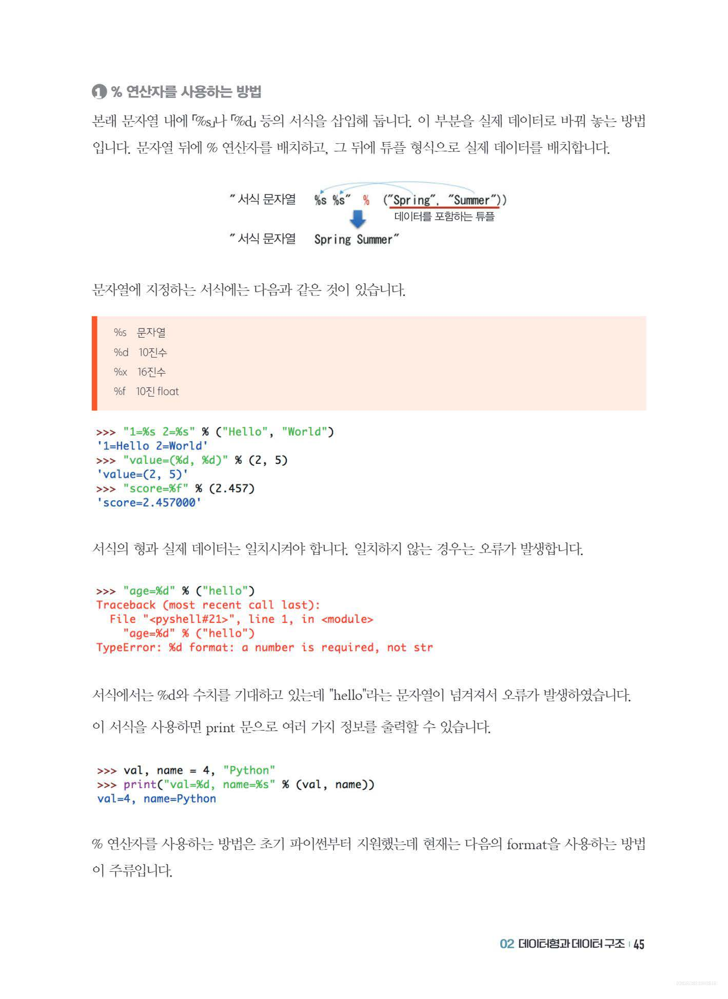

###### 0 % 연산XH를 사용하는 방법

###### 본래 문자열 내에 「%s」나 「%d」 등의 서식을 삽입해 둡니다. 이 부분을 실제 데이터로 바꿔 놓는 방법 입니다. 문자열 뒤에 % 연산자를 배치하고, 그 뒤에 튜플 형식으로 실제 데이터를 배치합니다.

» »

" 서식 문자열 %s %s" % ("Spr ing", "Su1T111er") )

틀 데이터를포함하는튜플

" 서식 문자열 Spring Summer"

###### 문자열에 지정하는 서식에는 다음과 같은 것이 있습니다.

- o/os 문자열
- o/od 10진수
- o/ox 16진수
- o/of 10진 float

>>> "1=%s 2=%s" % ( "Hello" , "World") ' l=Hello 2=World ' >>> "value=(%d, %d)" % (2, 5) 'value=(2, S)' >>> "score=%f" % (2.457) ' score=Z . '

###### 서식의 형과 실제 데이터는 일치시켜야 합니다. 일치하지 않는 경우는 오류가 발생합니다.

>>> "age=%d" % ( "hello") Traceback (most call last):

File "<pyshell#Zl>" , line 1, in <module> "age=%d" %

a is str

###### 서식에서는 %d와 수치를 기대하고 있는데 "hello”라는 문자열이 넘겨져서 오류가 발생하였습니다. 이 서식을 사용하면 print 문으로 여러 가지 정보를 출력할 수 있습니다.

>>> val, name = 4, "Python" >>> print( "val=%d, name=%s" % (val, name)) val=4, name=Python

###### % 연산자를 사용하는 방법은 초기 파이썬부터 지원했는데 현재는 다음의 format을 사용하는 방법 이 주류입니다.

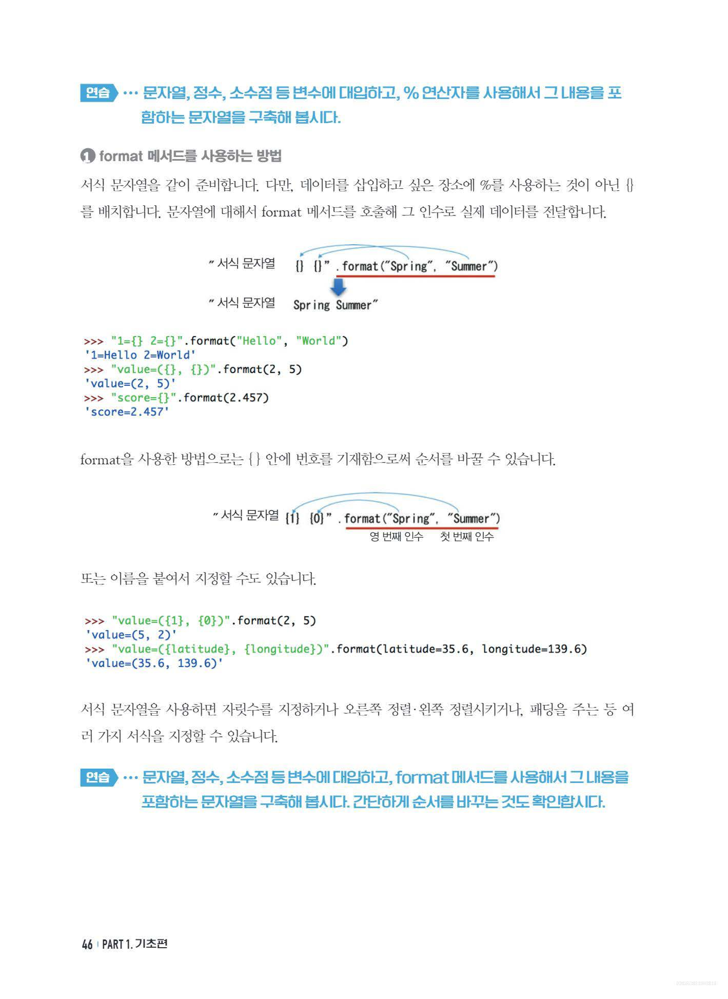

…문자열,정수,소수점 동변수메[H입하고,%연산자를사용해서 그대용을포

람하는 문자옅을 구측해 봅AlE|.

###### C) format 매서드를 사용하는 방법

###### 서식 문자열을 같이 준비합니다. 다만, 데이터를 삽입하고 싶은 장소에 %를 사용하는 것이 아닌 0

를 배치합니다. 문자열에 대해서 format 메서드를 호출해 그 인수로 실제 데이터를 전달합니다.

“ 서식 문자열 {) {) " . format ("Spr ing", "Sunmer")

" 서식 문자열 Spr ing Su11111er"

>>> "1={} 2={}" . format("Hello" , "World") ' l=Hello 2=World ' >>> "value=({} , {})" . format(Z , 5) ' value=(Z, >>> "score={}" .format(Z. 457) ' score=Z .457'

###### format을 사용한 방법으로는 {} 안에 번호를 기재함으로써 순서를 바꿀 수 였습니다.

“서식 문자열 {f} ｛이 "

. format ("Spr ing". ’’Surrrner")

영번째인수 첫번째인수

또는 이름을 붙여서 지정할 수도 있습니다.

>>> "value=({1}, {0})" . format(2, 5) ' value=(S, 2)'

###### >>> "value=({latitude}, {longitude})" .format(latitude=35.6, longitude=139.6) 'value=(35 .6, 139.6)'

서식 문자열을 사용하면 자릿수를 지정하거나 오른쪽 정렬 ·왼쪽 정렬시키거나, 패딩을 주는 등 여

- 러 가지 서식을 지정할 수 있습니다.

··· 정수, 소수점 format 메서드를 그

포합하는 순서를바꾸는 것도학인합시다

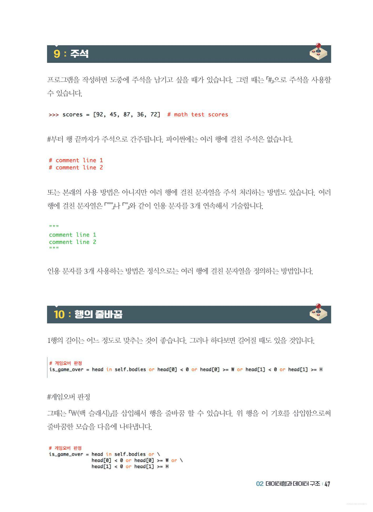

프로그램을 작성하면 도중에 주석을 남기고 싶을 때가 있습니다. 그럴 때는 困으로 주석을 사용할

###### 수 있습니다.

>>> scores = [92, 45, 87, 36, 72] # math test scores

###### #부터 행 끝까지가 주석으로 간주됩니다. 파이썬에는 여러 행에 걸친 주석은 없습니다.

# l i.ne 1 l ne

또는 본래의 사용 방법은 아니지만 여러 행에 걸친 문자열을 주석 처리하는 방법도 있습니다. 여러 행에 걸친 문자열은 「"'＂}나 「간라 같이 인용 문자를 3개 연속해서 기술합니다.

###### ”“”

1 comment line 2

###### """

인용 문자를 3개 사용하는 방법은 정식으로는 여러 행에 걸친 문자열을 정의하는 방법입니다.

1행의 길이는 어느 정도로 맞추는 것이 좋습니다. 그러나 하다보면 길어질 때도 있을 것입니다.

#

is_game_over = head in self.bodies or head[0] < 0 head[0] >; Wor head[l] < 0 or head[l] >= H

###### #게임오버 판정 그때는 「W(백 슬래시)」를 삽입해서 행을 줄바꿈 할 수 었습니다. 위 행을 이 기호를 삽입함으로써 줄바꿈한 모습을 다음에 냐타냅니다.

# 게 오

i.s_game_over = head self.bodies \ head[0] < 0 or head[0] >- Wor \ head[l] < 0 or head[l] >= H

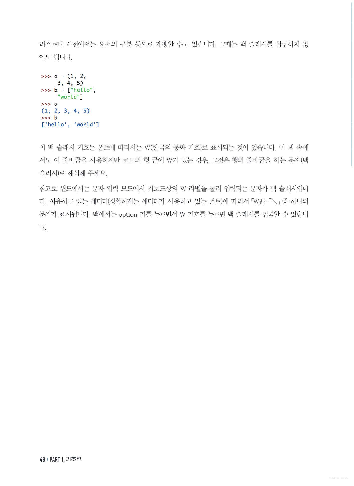

리스트냐 사전에서는 요소의 구분 등으로 개행할 수도 있습니다. 그때는 백 슬래시를 삽입하지 않

- 아도됩니다.

- >>> a = (1, 2,

3, 4, 5)

- >>> b = ["hello" ,

"world"]

>>> a

(1, 2, 3, 4, 5)

>>> b

['hello' , 'world']

이 백 슬래시 기호는 폰트에 따라서는 W(한국의 통화 기호)로 표시되는 것이 있습니다. 이 책 속에

- 서도 이 줄바꿈을 사용하지만 코드의 행 끝에 W가 있는 경우, 그것은 행의 줄바꿈을 하는 문자(백 슬러시)로 해석해 주세요.

참고로 윈도에서는 문자 입력 모드에서 기보드상의 W 라벨을 눌러 입력되는 문자가 백 슬래시입니

###### 다. 이용하고 있는 에디터(정확하게는 에디터가 사용하고 있는 폰트)에 따라서 「WJ나 「\」 중 하나의

문자가 표시됩니다. 맥에서는 option 키를 누르면서 판 기호를 누르면 백 슬래시를 입력할 수 있습니

###### 다.

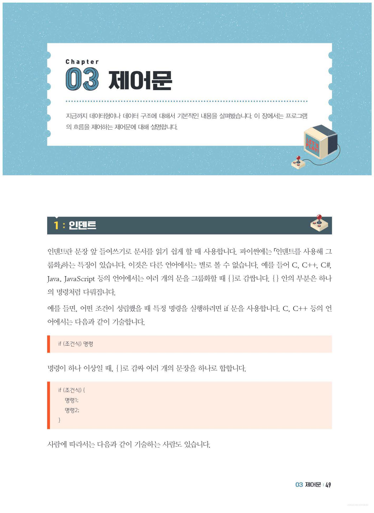

Chapte 『

••••••••••••••••••••••••••••••••••••••••••••••••••••••••••••••••••••••••••••••••••••••••

지금까지 데이터형이나 데이터 구조에 대해서 기본적인 내용을 살펴봤습니다. 이 장에서는 프로그램 의 흐름을 제어하는 제어문에 대해 설명합니다

23

>

인덴트란 문장 앞 들여쓰기로 문서를 읽기 쉽게 할 때 사용합니다. 파이썬에는 「인덴트를 사용해 그

룹화」하는 특징이 있습니다. 이것은 다른 언어에서는 별로 볼 수 없습니다. 예를 들어 C, C++, C#,

###### Java, JavaScript 둥의 언어에서는 여러 개의 문을 그룹화할 때 { }로 갑쌉니다. { } 안의 부분은 하냐

의 명령처럽 다뤄집니다.

예를 들면, 어떤 조건이 성립했을 때 특정 명령을 실행하려면 if 문을 사용합니다. C, C++ 둥의 언

어에서는 다음과 같이 기술합니다.

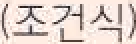

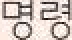

###### 명령이 하나 이상일 때, { ｝로 갑싸 여러 개의 문장을 하냐로 합합니다.

if (조건식) {

- 명령 1 ;
- 명령 2;

}

###### 사람에 따라서는 다음과 같이 기술하는 사람도 있습니다.

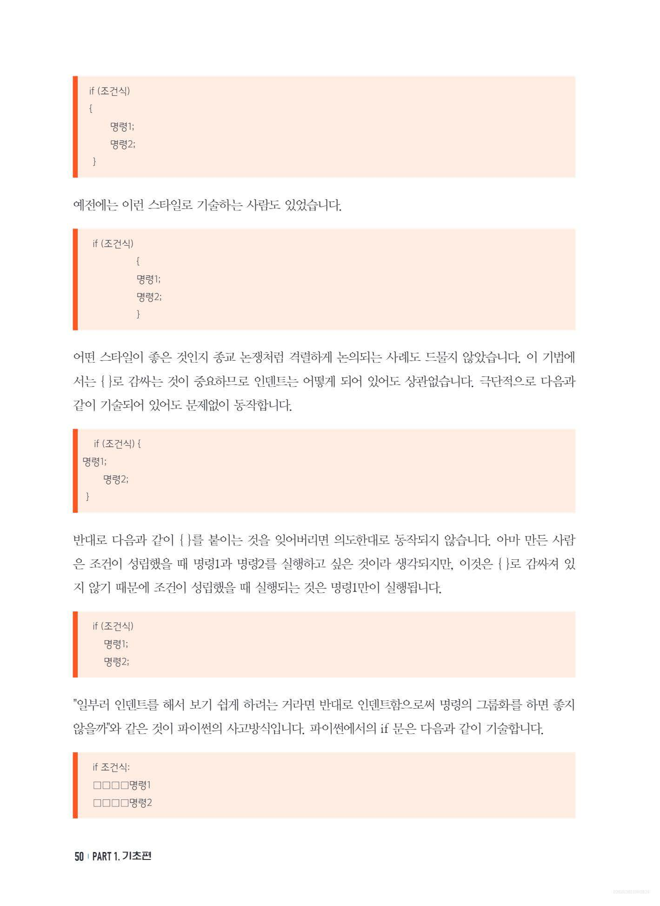

if (조건식)

###### {

- 명령 1 ;
- 명령 2;

###### 뻬

•

•

###### 예전에는 이런 스타일로 기술하는 사람도 였었습니다.

if (조건식)

{

- 명령 1;
- 명령 2; }

- 어떤 스타일이 좋은 것인지 종교 논쟁처럽 격렬하게 논의되는 사례도 드물지 않았습니다. 이 기법에

###### 서는 { ｝로 갑싸는 것이 중요하므로 인덴트는 어떻게 되어 있어도 상관없습니다. 극단적으로 다음과같이 기술되어 있어도 문제없이 동작합니다.

###### if (조건식) {

며己o다1,•

명령 2;

}

###### 반대로 다음과 같이 { ｝를 붙이는 것을 잊어버리면 의도한대로 동작되지 않습니다. 아마 만든 사람 은 조건이 성립했을 때 명령1과 명령2를 실행하고 싶은 것이라 생각되지만, 이것은 { }로 갑싸져 있 지 않기 때문에 조건이 성립했을 때 실행되는 것은 명령1만이 실행됩니다.

if (조건식)

며己디o o1,•

명령 2;

“일부러 인덴트를 해서 보기 쉽게 하려는 거라면 반대로 인덴트함으로써 명령의 그룹화를 하면 좋지

않을까와 같은 것이 파이썬의 사고방식입니다. 파이썬에서의 if 문은 다음과 같이 기술합니다.

if 조건식:

###### □□□□명령 l □□□□명령2

50 1PART 1. 기조곤

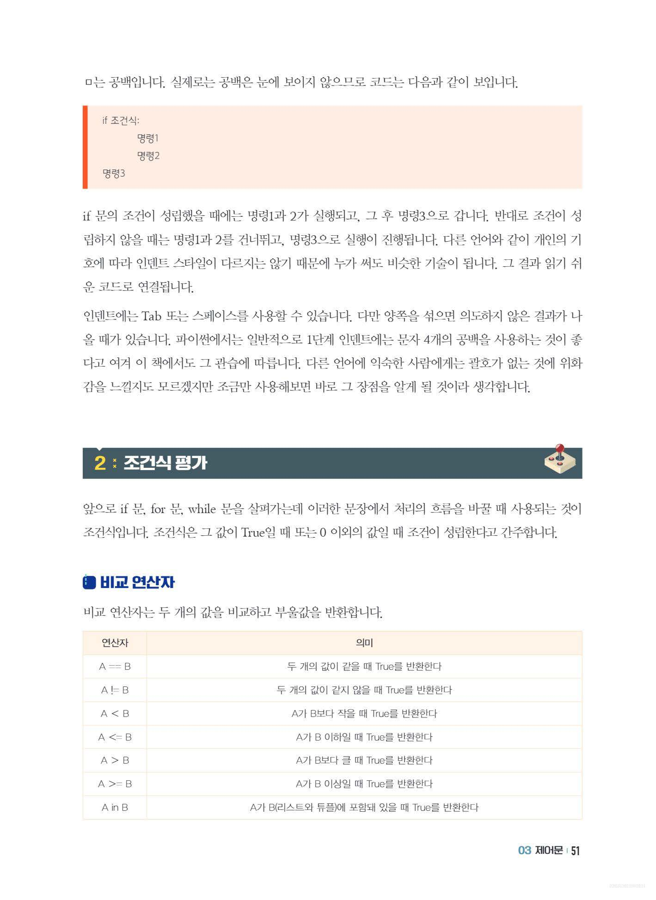

###### 口는 공백입니다. 실제로는 공백은 눈에 보이지 않으므로 코드는 다음과 같이 보입니다.

###### if 조건식:

며己다o o1

2

명령3

if 문의 조건이 성립했을 때에는 명령1과 2가 실행되고, 그 후 명령3으로 갑니다. 반대로 조건이 성

립하지 않을 때는 명령1과 2를 건너뛰고, 명령3으로 실행이 진행됩니다. 다른 언어와 같이 개인의 기 호에 따라 인덴트 스타일이 다르지는 않기 때문에 누가 써도 비슷한 기술이 됩니다. 그 결과 읽기 쉬 운코드로 연결됩니다.

인덴트에는 Tab 또는 스페이스를 시용-할 수 있습니다. 다만 양쪽을 섞으면 의도하지 않은 결과가 나

올 때가 있습니다. 파이썬에서는 일반적으로 1단계 인덴트에는 문자 4개의 공백을 사용하는 것이 좋 다고 여겨 이 책에서도 그 관습에 따릅니다. 다른 언어에 익숙한 사람에게는 괄호가 없는 것에 위화 갑을 느낄지도 모르겠지만 조금만 사용해보면 바로 그 장점을 알게 될 것이라 생각합니다.

앞으로 if 문, for 문, while 문을 살펴가는데 이러한 문장에서 처리의 흐름을 바꿀 때 시용되는 것이 조건식입니다. 조건식은 그 값이 True일 때 또는 0 이외의 값일 때 조건이 성립한다고 간주합니다.

###### • UI.ii! 연산자

###### 비교 연산자는 두 개의 값을 비교하고 부울값을 반환합니다.

연산자

의미

A == B A != B A<B A <= B A>B A > = B

두 개의 값이 같을 때 True를 반환한다

두 개의 값이 같지 않을 때 True를 반환한다

A가 B보다 작을 때 True를 반환한다 A가 B 이하일 때 True를 반환한다

A가 B보다 클 때 True를 반환한다 A가 B 이상일 때 True를 반환한다 A가 B(리스트와 튜플)에 포함돼 있을 때 True를 반환한다

A in B

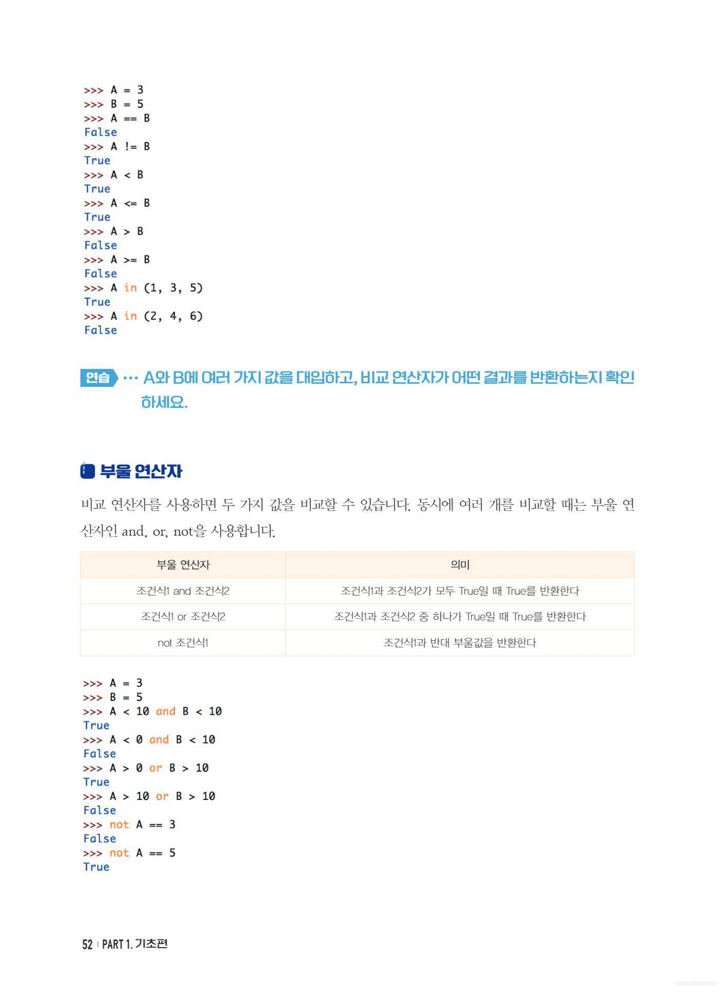

- >>> A = 3
- >>> B = 5 >>> A == B False >>> A != B True >>> A < B True >>> A <= B True >>> A > B False >>> A >= B False >>> A i.n (1, 3, 5) True >>> A in (2, 4, 6) False

… 가지 [H입하고, 확인

###### ·부을연산자

###### 비교 연산자를 사용하면 두 가지 값을 비교할 수 있습니다. 동시에 여러 개를 비교할 때는 부울 연 산자인 and, or, not을 사용합니다.

###### 부울연산자

의미

조건식1 and 조건식2

조건식1과 조건식2가 모두 True일 때 True를 반환한다

조건식1 or 조건식2

조건식1과 조건식2 중 하나가 True일 때 True를 반환한다

not 조건식1

조건식1과 반대 부울값을 반환한다

- >>> A = 3
- >>> B = 5 >>> A < 10 and B < 10 True >>> A < 0 and B < 10 False >>> A > 0 or B > 10

True

>>> A > 10 or B > 10 Fa1se >>> not A == 3 False >>> A == 5

True

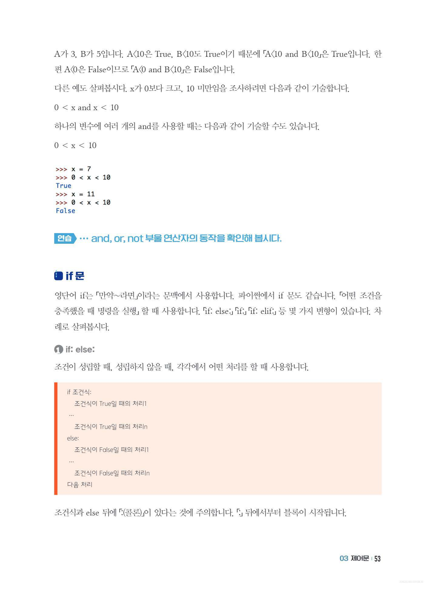

A가 3, B가 5입니다. A〈10은 True, B〈10도 True이기 때문에 「A〈10 and B<10~ True입니다. 한 편 A〈0은 False이므로 「A〈0 and B<10~ False입니다. 다른 예도 살펴봅시다. x가 0보다 크고, 10 미만임을 조사하려면 다음과 같이 기술합니다. 0 < x and x < 10 하나의 변수에 여러 개의 and를 사용할 때는 다음과 같이 기술할 수도 있습니다. 0 < X < 10

>>> X = 7 >>> 0 < X < 10

True

>>> X = 11

>>> 0 < X < 10

###### False

…and, or, not부울연산자의 동작을확인해 봅AlE|.

###### if 문

영단어 if는 「만약~라면」이라는 문맥에서 사용합니다. 파이썬에서 if 문도 같습니다. 「어떤 조건을 충족했을 때 명령을 실행」 할 때 사용합니다. rif: else:J 「if:」 rif: elif'._i 둥 몇 가지 변형이 있습니다. 자 례로살펴봅시다.

C) if: else:

조건이 성립할 때, 성립하지 않을 때, 각각에서 어떤 처리를 할 때 시용힙니다.

if 조건식:

조건식이 True일 때의 저리 1

조건식이 True일 때의 저리 n

###### else:

조건식이 alse일 때의 저리 1

조건식이 False일 때의 저리 n 다음저리

###### 조건식과 else 뒤에 r:(콜론)」이 있다는 것에 주의합니다. r:J 뒤에서부터 블록이 시작됩니다.

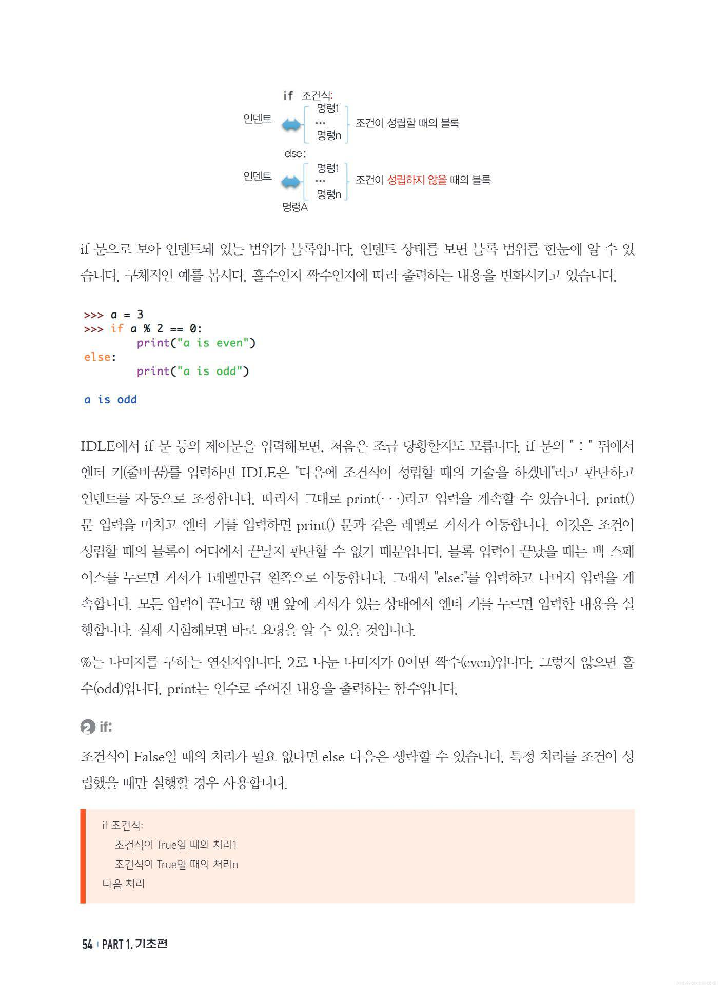

if 조건식:

명령1

인덴트 ••• 조건이성립할때의블록

명령n

else:

명령1

인덴트 ^^- … 조건이 때의 볼록

명령n

명령A

if 문으로 보아 인덴트돼 있는 범위가 블록입니다. 인덴트 상태를 보면 블록 범위를 한눈에 알 수 있

습니다. 구체적인 예를 봅시다. 홀수인지 짝수인지에 따라 출력하는 내용을 변화시키고 있습니다.

>>> a = 3 >>> i. f a % 2 == 0:

pri.nt( "a i.s even") else :

pri.nt( "a i.s odd") a i.s odd

IDLE에서 if 문 둥의 제어문을 입력해보면, 처음은 조금 당황할지도 모릅니다. if 문의 " : “ 뒤에서

###### 엔터 키優바꿈)를 입력하면 IDLE은 “다음에 조건식이 성립할 때의 기술을 하겠네”라고 판단하고 인덴트를 자동으로 조정합니다. 따라서 그대로 print(· · ·)라고 입력을 계속할 수 있습니다. printO 문 입력을 마치고 엔터 키를 입력하면 printO 문과 같은 레벨로 커서가 이동합니다. 이것은 조건이

성립할 때의 블록이 어디에서 끝날지 판단할 수 없기 때문입니다. 블록 입력이 끝났을 때는 백 스페 이스를 누르면 커서가 1레벨만콤 왼쪽으로 이동합니다. 그래서 "else:＇틀 입력하고 나머지 입력을 계 속합니다. 모든 입력이 끝나고 행 맨 앞에 커서가 있는 상태에서 엔티 키를 누르면 입력한 내용을 실 행합니다. 실제 시험해보면 바로 요령을 알 수 있을 것입니다.

%는 나머지를 구하는 연산자입니다. 2로 냐눈 나머지가 0이면 짝수(even)입니다. 그렇지 않으면 홀 수(odd)입니다. print는 인수로 주어진 내용을 출력하는 함수입니다.

###### ~ if:

###### 조건식이 False일 때의 처리가 필요 없다면 else 다음은 생략할 수 있습니다. 특정 처리를 조건이 성 립했을 때만 실행할 경우 사용합니다.

###### if 조건식:

조건식이 True일 때의 저리l 조건식이 True일 때의 저리 n

다음저리

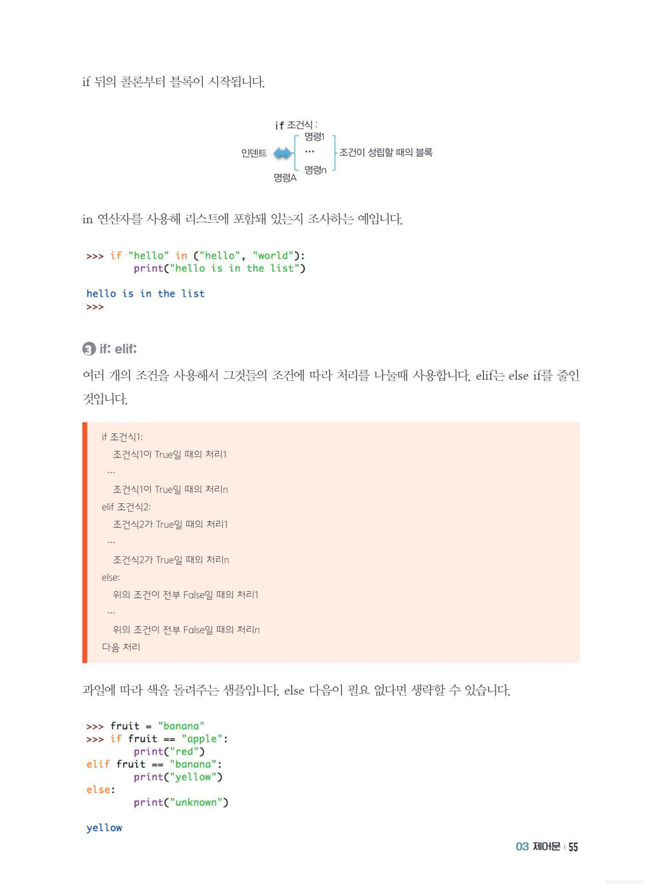

###### if 뒤의 콜론부터 블록이 시작됩니다.

if 조건식 :

명령1

인덴트 .어\ l조건이성립할때의블록

명령n

명령A

in 연산자를 사용해 리스트에 포함돼 있는지 조사하는 예입니다.

>>> if "hello" in ( "hello" , "world"):

print( "hello is in the list") hello is in the list

>>>

###### 0 if: elif:

여러 개의 조건을 사용해서 그것들의 조건에 따라 처리를 나눌때 사용합니다. elif는 else if를 줄인

###### 것입니다.

###### if 조건식1:

- 조건식 1 이 True일 때의 저리 1

- 조건식 1 이 True일 때의 저리 n

elif 조건식2:

- 조건식 2가 True일 때의 저리 1

- 조건식 2가 True일 때의 저리 n

###### else:

위의 조건이 전부 False일 때의 저리 1

우I 의 조건이 전부 False일 때의 저리 n 다음저리

과일에 따라 색을 돌려주는 샘플입니다. else 다음이 필요 없다면 생략할 수 있습니다.

>>> fruit = "banana" >>> if fruit == "apple" :

pri.nt( "red")

eli.f fruit == "banana" :

print( "yellow") else :

pri nt( "unknown") yellow

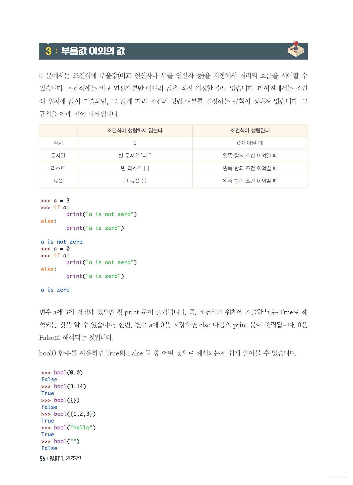

if 문에서는 조건식에 부울값(비교 연산자나 부울 연산자 둥)을 지정해서 처리의 흐름을 제어할 수

있습니다. 조건식에는 비교 연산자뿐만 아니라 값을 직접 지정할 수도 있습니다. 파이썬에서는 조건

식 위치에 값이 기술되면, 그 값에 따라 조건의 성립 여부를 결정하는 규칙이 정해져 있습니다. 그 규칙을 아래 표에 나타냅니다.

조건식이 성립한다

조건식이 성립하지 않는다

수~I

0이 아닐 때

。

빈 문자열 “나'"＇

문天瓚

왼쪽항의조건 이외일 때

빈 리스트 [ ]

###### 왼쪽항의조건 이외일 때

리스트

빈 튜플( )

튜플

왼쪽항의조건 이외일 때

>>> a = 3

>>> i.f a :

pri.nt( "a i.s not zero") else :

pri.nt( "a i.s zero") a i.s not zero

>>> a = 0

>>> i.f a :

pri.nt( "a i.s not zero") else :

pri.nt( "a i.s zero")

a 1s zero

•

변수 a에 3이 저장돼 있으면 첫 print 문이 출력됩니다. 죽, 조건식의 위치에 기술한 「a」는 True로 해 석되는 것을 알 수 있습니다. 한편, 변수 a에 0을 저장하면 else 다음의 print 문이 출력됩니다. 0은 False로 해석되는 것입니다.

boolO 함수를 사용하면 True와 False 둘 중 어떤 것으로 해석되는지 쉽게 알아볼 수 있습니다.

>>> bool(0.0) False >>> boo1(3.14) True >>> bool( {} ) False >>> bool({l,2,3}) True >>> bool( "hello") True

bool( "") False

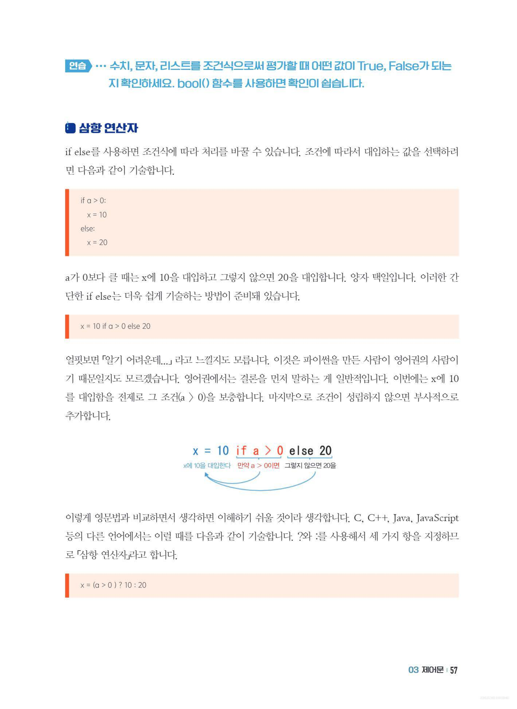

…수지,문자,리스트를조건식으로써평가할[H어떤값01True, False가도1는

지 확인하세요. boolO 랍수를 사용하면 확인01 쉽습LlEL

###### ·삼협연산자

if else를 사용하면 조건식에 따라 처리를 바꿀 수 있습니다. 조건에 따라서 내입하는 값을 선택하려

면 다음과 같이 기술합니다.

if a >0: X = 10

else:

X = 20

a가 0보다 클 때는 x에 10을 대입하고 그렇지 않으면 20을 대입합니다. 양자 택일입니다. 이러한 간

단한 if else는 더욱 쉽게 기술하는 방법이 준비돼 있습니다.

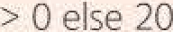

얼핏보면 「알기 어려운데…」 라고 느낄지도 모릅니다. 이것은 파이썬을 만든 사람이 영어권의 사람이

###### 기 때문일지도 모르겠습니다. 영어권에서는 결론을 먼저 말하는 게 일반적입니다. 이번에는 x에 10 를 대입함을 전제로 그 조건(a > O)을 보충합니다. 마지막으로 조건이 성립하지 않으면 부사적으로

추가합니다.

X = 10 if a > else 20

x에 1여울 대입한다 a > O 그렇지 않으면 없욜울

###### 이렇게 영문법과 비교하면서 생각하면 이해하기 쉬울 것이라 생각합니다. C, C++, Java, JavaScript 등의 다른 언어에서는 이럴 때를 다음과 같이 기술합니다. ?와 :를 사용해서 세 가지 항을 지정하므 로 「삼항 연산자」라고 합니다.

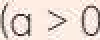

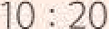

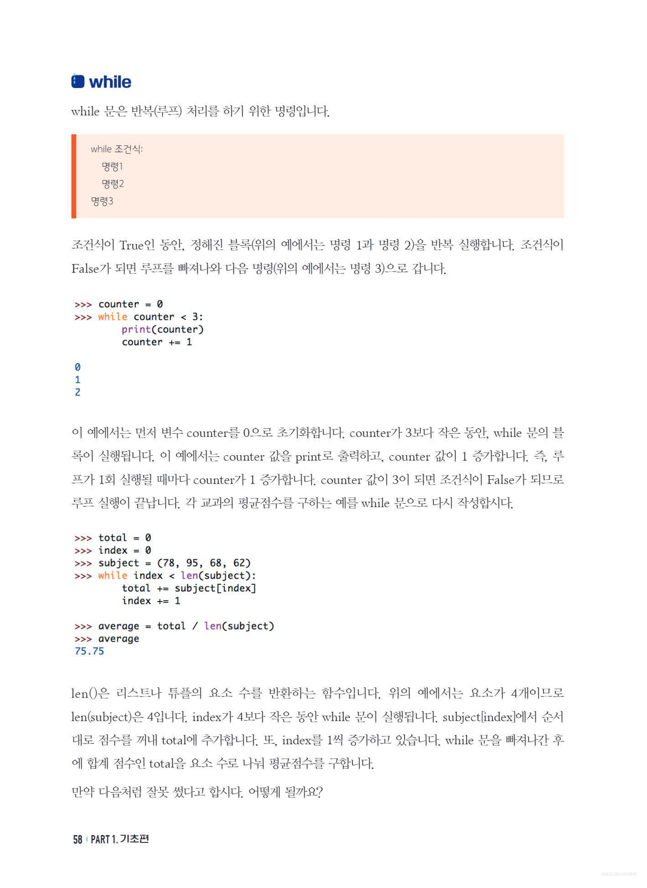

###### ■ while

###### while 문은 반복(루프) 처리를 하기 위한 명령입니다.

while 조건식:

o o1

명령2

명령 3

조건식이 True인 동안, 정해진 블록(위의 예에서는 명령 1과 명령 2)을 반복 실행합니다. 조건식이 False가 되면 루프를 빠져냐와 다음 명령(위의 예에서는 명령 3)으로 갑니다.

>>> counter = 0 >>> whi.le counter < 3:

pri.nt(counter) counter += 1

012

이 예에서는 먼저 변수 counter를- 0으로 초기화합니다. counter가 3보다 작은 동안, while 문의 블 록이 실행됩니다. 이 예에서는 counter 값을 print로 출력하고, counter 값이 l 증가합니다. 즉, 루 프가 1회 실행될 때마다 counter가 1 증가합니다. counter 값이 3이 되면 조건식이 False가 되므로 루프 실행이 끝납니다. 각 교과의 평균점수를 구하는 예를 while 문으로 다시 작성합시다.

>>> total = 0 >>> i.ndex = 0 >>> subject = (78, 95, 68, 62) >>> i.ndex < len(subject):

total += subject[i.ndex] i.ndex += 1

>>> average = total / len(subject) >>> average

75 . 75

###### len(）은 리스트나 튜플의 요소 수를 반환하는 함수입니다. 위의 예에서는 요소가 4개이므로

len(subject)은 4입니다. index가 4보다 직은- 동안 while 문이 실행됩니다. subject[index]에서 순서 대로 점수를 꺼내 total에 추가합니다. 또, index를 1씩 증가하고 있습니다. while 문을 뻐져나간 후 에 합계 점수인 total을 요소 수로 냐눠 평균점수를 구합니다.

만약 다음처럽 잘못 썼다고 합시다. 어떻게 될까요?

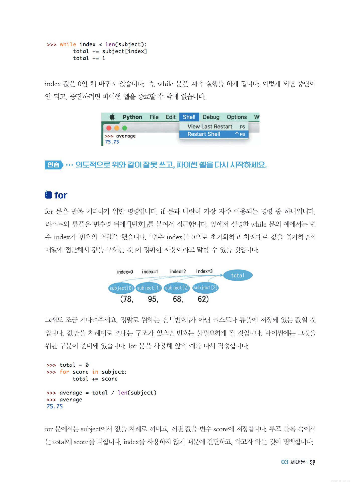

###### >>> i.ndex < len(subject) : total += subject[i.ndex] total += 1

index 값은 0인 재 바뀌지 않습니다. 즉, while 문은 계속 실행을 하게 됩니다. 이렇게 되면 중단이 안 되고, 중단하려면 파이썬 쉘울 종료할 수 밖에 없습니다.

-

S Python File Edit

Debug Options W

’

###### View Last Restart FS

>>> overage

75.

… 잘못쓰고, E|A1 .

###### llfo『

for 문은 반복 처리하기 위한 명령입니다. if 문과 나란히 가장 자주 이용되는 명령 중 하나입니다. 리스트와 튜플은 변수명 뒤에 「[번호]훑} 붙여서 접근합니다. 앞에서 설명한 while 문의 예에서는 변 수 index가 번호의 역할을 했습니다. 「변수 index를 0으로 초기화하고 차례대로 값을 증가하면서 배열에 접근해서 값을 구하는 것」이 정확한 사용이라고 말할 수 있을 것입니다.

index=O index=l index=2 index=3

.'.... -,,

(78, 95, 68, 62)

그래도 조금 기다려주세요. 정말로 원하는 건 「[번호h가 아닌 리스트냐 튜플에 저장돼 있는 값일 것 입니다. 값만을 차례대로 꺼내는 구조가 있으면 번호는 불필요하게 될 것입니다. 파이썬에는 그것을 위한 구문이 준비돼 있습니다. for 문을 시용해 앞의 예를 다시 작성합니다.

>>> total = 0 >>> for score in subject:

total += score

>>> average = total / len(subject) >>> average

75 . 75

for 문에서는 subject에서 값을 차례로 꺼내고, 꺼낸 값을 변수 score에 저장합니다. 루프 블록 속에서 는 total에 score를 더합니다. index를 사용하지 않기 때문에 간단하고, 하고자 하는 것이 명백합니다.

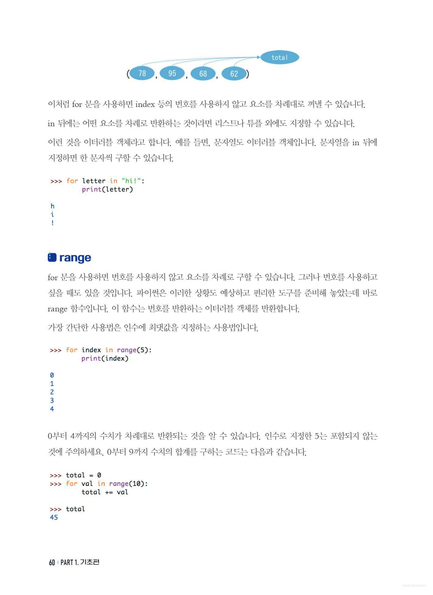

E-．·드---·"··--:::;: '근

( ·········-

·••'

’ ’

###### ’

이처럽 for 문을 사용하면 index 둥의 번호를 사용하지 않고 요소를 차례대로 꺼낼 수 있습니다. in 뒤에는 어떤 요소를 차례로 반환하는 것이라면 리스트나 튜플 외에도 지정할 수 있습니다.

이런 것을 이터러블 객체라고 합니다. 예를 들면, 문자열도 이터러블 객체입니다. 문자열을 in 뒤에 지정하면 한 문자씩 구할 수 있습니다.

###### >>> for letter in "hi !" : print(letter)

h.1,

.

###### .『ange

for 문을 사용하면 번호를 사용하지 않고 요소를 차례로 구할 수 있습니다. 그러나 번호를 사용하고 싶을 때도 있을 것입니다. 파이썬은 이러한 상황도 예상하고 편리한 도구를 준비해 놓았는데 바로 range 함수입니다. 이 함수는 번호를 반환하는 이터러블 객체를 반환합니다.

가장 간단한 사용법은 인수에 최댓값을 지정하는 사용법입니다.

###### >>> for i.ndex i.n range(S) : pri.nt(i.ndex)

01234

0부터 4까지의 수치가 차례대로 반환되는 것을 알 수 있습니다. 인수로 지정한 5는 포함되지 않는 것에 주의하세요. 0부터 9까지 수치의 합계를 구하는 코드는 다음과 같습니다.

>>> total = 0

>>> val range(10) :

total += val >>> total

45

60 1PART 1. 기조곤

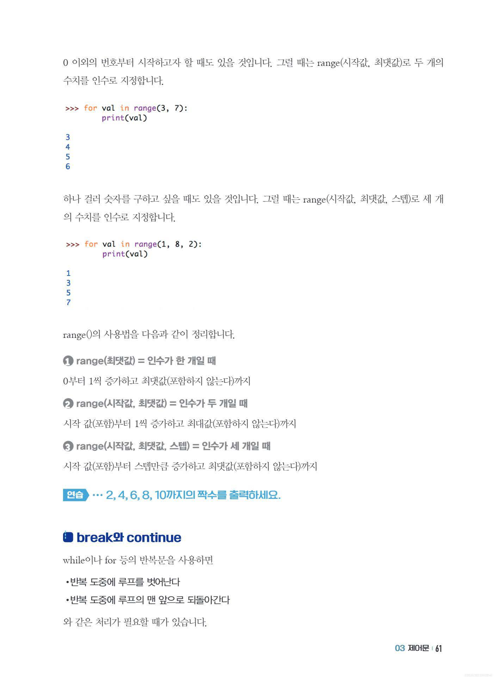

###### 0 이외의 번호부터 시작하고자 할 때도 있을 것입니다. 그럴 때는 range(시작값, 최댓값)로 두 개의

수치를 인수로 지정합니다.

###### >>> for val i.n range(3 , 7) : pri.nt(val)

- 3
- 4
- 5
- 6

###### 하나 걸러 숫자를 구하고 싶을 때도 있을 것입니다. 그럴 때는 range(시직값·, 최댓값, 스탭)로 세 개

의 수치를 인수로 지정합니다.

###### >>> for val i.n range(l, 8, 2): pri.nt(val)

1

3

5

7

rangeO의 사용법을 다음과 같이 정리합니다.

###### O range(최댓값)=인수가한개일 때

0부터 1씩 증가하고 최댓값(포함하지 않는다)까지

###### Q range(시작값, 최댓값)=인수가두개일 때

시작 값(포함)부터 1씩 증가하고 최대값(포함하지 않는다)까지

O range(시작값, 최댓값, 스텝)=인수가세 개일 때

시작 값(포함)부터 스탭만큼 증가하고 최댓값(포함하지 않는다)까지

…2, 4,6, 8,10까지의 짝수를즐력하세요.

break와 continue

·while이나 for 둥의 반복문을 사용하면

•반복 도중에 루프를 벗어난다 ·반복 도중에 루프의 맨 앞으로 되돌아간다

###### 와 같은 처리가 필요할 때가 있습니다.

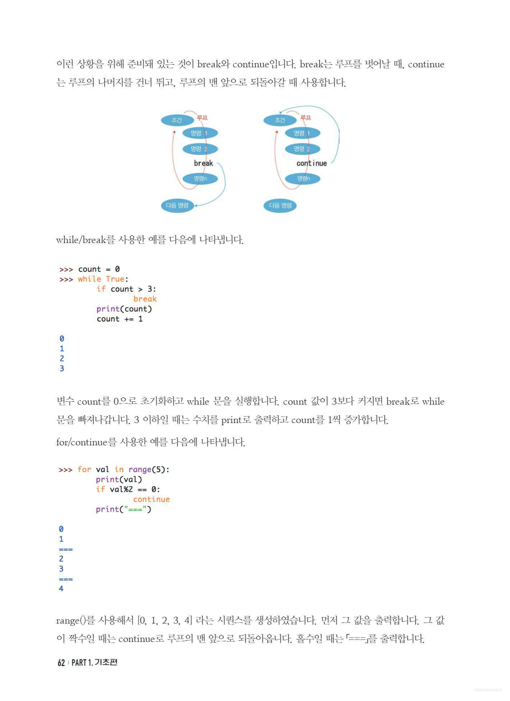

이런 상황을 위해 준비돼 있는 것이 break와 continue입니다. break는 루프를 벗어날 때, continue 는 루프의 냐머지를 건너 뛰고, 루프의 맨 앞으로 되돌아갈 때 사용합니다.

도

continue!

i

br 錢k

i

`一

while/break를 사용한 예를 다음에 냐타냅니다.

>>> count = 0 >>> while True:

i.f count > 3: pri.nt(count) count += 1

0123

변수 count를 0으로 초기화하고 while 문을 실행합니다. count 값이 3보다 커지면 break로 while 문을 빠져나갑니다. 3 이하일 때는 수치를 print로 출력하고 count를 1씩 증가합니다. for/continue를 사용한 예를 다음에 나타냅니다.

>>> for val i.n range(S) : pri.nt(val) i.f val%2 == 0:

continue pri.nt( "===")

01=23=4

###### range(）를 사용해서 [O, 1, 2, 3, 4] 라는 시퀀스를 생성하였습니다. 먼저 그 값을 출력합니다. 그 값

이 짝수일 때는 continue로 루프의 맨 앞으로 되돌아옵니다. 홀수일 때는 「==＝」를 출력합니다.

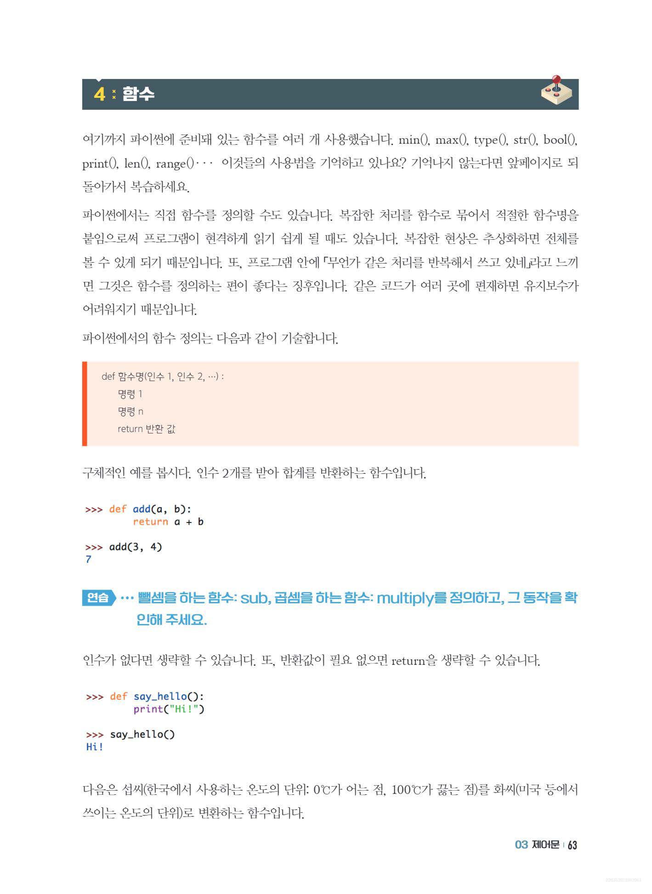

여기까지 파이썬에 준비돼 있는 함수를 여러 개 시용-했습니다. minO, maxO, typeO, strO, boolO, printO, lenO, rangeO· · · 이것들의 시용법을 기억하고 있나요? 기억나지 않는다면 앞페이지로 되 돌아가서 복습하세요.

파이썬에서는 직접 함수를 정의할 수도 있습니다. 복잡한 처리를 함수로 묶어서 적절한 함수명을 붙임으로써 프로그램이 현격하게 읽기 쉽게 될 때도 있습니다. 복잡한 현상은 추상화하면 전체를 볼 수 있게 되기 때문입니다. 또, 프로그램 안에 「무언가 같은 처리를 반복해서 쓰고 있네」라고 느끼 면 그것은 함수를 정의하는 편이 좋다는 징후입니다. 같은 코드가 여러 곳에 편재하면 유지보수가 어려워지기 때문입니다.

파이썬에서의 함수 정의는 다음과 같이 기술합니다.

def 암수명 (인수 1, 인수 2, …)

O:Io 己:lo l

명령 n

return 반판 값

구체적인 예를 봅시다. 인수 2개를 받아 합계를 반환하는 함수입니다.

>>> def add(a, b) :

a + b >>> add(3, 4)

7

###### …뻘셀을하는람수:sub, 하는람수: multiply를장의하고,그동작을확

인해주세요.

- 인수가 없다면 생략할 수 있습니다. 또, 반환값이 필요 없으면 return을 생략할 수 있습니다.

>>> def say_hello():

pri.nt("Hi.!") >>> say_hello()

Hi!

###### 다음은 섭씨(한국에서 사용하는 온도의 단위: 0°C가 어는 점, 100°c가 끓는 점)를 화씨(미국 등에서 쓰이는 온도의 단위)로 변환하는 함수입니다.

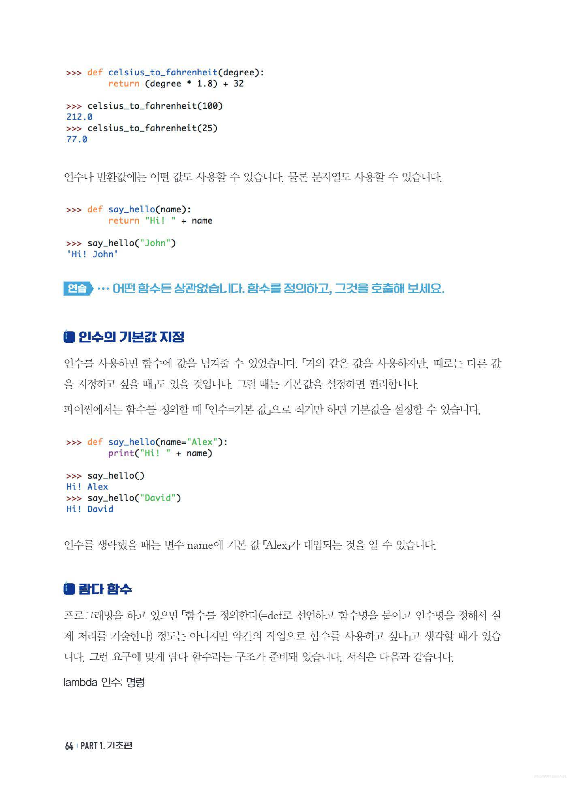

>>> def celsi.us_to_fahrenhei.t(degree): (degree * 1. 8) + 32

>>> celsi.us_to_fahrenhei.t(100) 212.0 >>> celsi.us_to_fahrenhei.t(25)

77 .0

- 인수나 반환값에는 어떤 값도 사용할 수 있습니다. 물론 문자열도 사용할 수 있습니다.

>>> def say_hello(name): "Hi. ! " + name

>>> say_hello("John") ' Hi.! John '

… 그것을 보세요.

###### ·인수의기본값 XI정

인수를 사용하면 함수에 값을 넘겨줄 수 있었습니다. 「거의 같은 값을 사용하지만, 때로는 다른 값 을 지정하고 싶을 때」도 있을 것입니다. 그럴 때는 기본값을 설정하면 편리합니다. 파이썬에서는 함수를 정의할 때 「인수=기본 값죠토료 적기만 하면 기본값을 설정할 수 있습니다.

###### >>> say_hello(name="Alex"): print( "Hi! " + name)

say_hello() Alex say_hello("David") David

>>>

###### Hi. !

>>>

Hi. !

인수를 생략했을 때는 변수 name에 기본 값 「Alex」가 대입되는 것을 알 수 있습니다.

###### ·탑[＇탈수

프로그래밍을 하고 있으면 「함수를 정의한다(=def로 선언하고 함수명을 붙이고 인수명을 정해서 실

###### 제 처리를 기술한다) 정도는 아니지만 약간의 작업으로 함수를 시용-하고 싶다丘l 생각할 때가 있습

###### 니다. 그린 요구에 맞게 람다 함수라는 구조가 준비돼 있습니다. 서식은 다음과 같습니다.

lambda 인수: 명령

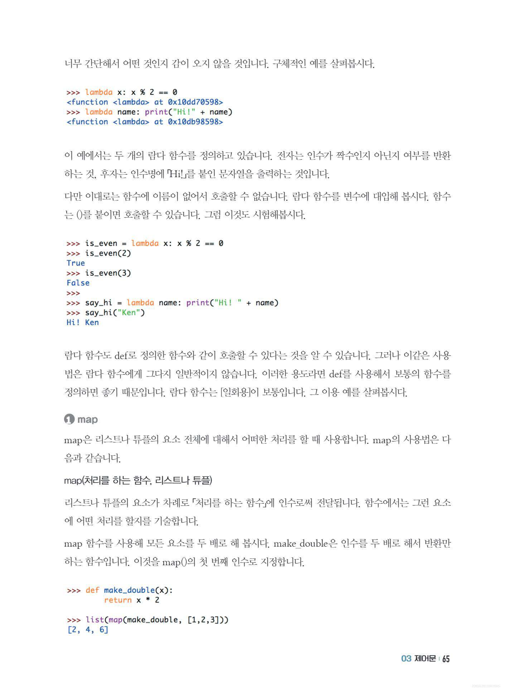

###### 너무 간단해서 어떤 것인지 갑이 오지 않을 것입니다. 구체적인 예를 살펴봅시다.

>>> lambda x: x % 2 == 0 <functi.on <lambda> at >>> lambda name : pri.nt( "Hi.!" + name) <functi.on <lambda> at

이 예에서는 두 개의 람다 함수를 정의하고 있습니다. 전자는 인수가 짝수인지 아닌지 여부를 반환

###### 하는 것, 후자는 인수명에 「Hi!」를 붙인 문자열을 출력하는 것입니다.

다만 이대로는 함수에 이름이 없어서 호출할 수 없습니다. 람다 함수를 변수에 대입해 봅시다. 함수

###### 는 O를 붙이면 호출할 수 있습니다. 그럽 이것도 시험해봅시다.

>>> i.s_even = lambda x: x % 2 == 0 >>> i.s_even(Z) True >>> i.s_even(3) False >>> >>> say_hi. = name: print( "Hi. ! " + name) >>> say_hi.("Ken") Hi! Ken

람다 함수도 def로 정의한 함수와 같이 호출할 수 있다는 것을 알 수 있습니다. 그러나 이같은 사용 법은 람다 함수에게 그다지 일반적이지 않습니다. 이러한 용도라면 def를 사용해서 보통의 함수를 정의하면 좋기 때문입니다. 람다 함수는 [일회용]이 보통입니다. 그 이용 예를 살펴봅시다.

###### Omap

map은 리스트나 튜플의 요소 전체에 대해서 어떠한 처리를 할 때 사용합니다. map의 사용법은 다 음과같습니다. map(처리를 하는 함수, 리스트나 튜플)

리스트나 튜플의 요소가 차례로 「처리를 하는 함수」에 인수로써 전달됩니다. 함수에서는 그런 요소 에 어떤 처리를 할지를 기술합니다. map 함수를 사용해 모든 요소를 두 배로 해 봅시다. make_double은 인수를 두 배로 해서 반환만

###### 하는 함수입니다. 이것을 mapO의 첫 번째 인수로 지정합니다.

>>> def make_double(x):

x * 2

>>> li.st( map(make_double, [1,2,3]))

[2 , 4, 6]

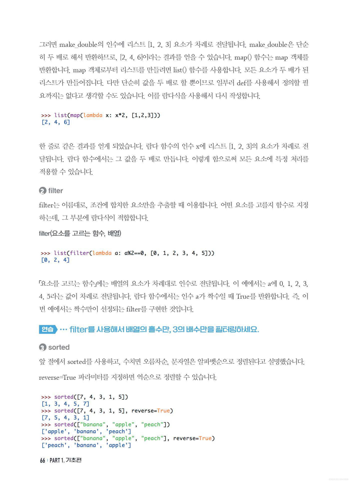

그러면 make_double의 인수에 리스트 [1, 2, 3] 요소가 차례로 전달됩니다. make_double은 딘순

히 두 배로 해서 반환하므로, [2, 4, 6]이라는 결과를 얻을 수 있습니다. mapO 함수는 map 객체를

반환합니다. map 객체로부터 리스트를 만들려면 listO 함수를 사용합니다. 모든 요소가 두 배가 된

리스트가 만들어집니다. 다만 단순히 값을 두 배로 할 뿐이므로 일부러 def를 사용해서 정의할 필 요까지는 없다고 생각할 수도 있습니다. 이를 람다식을 사용해서 다시 작성합니다.

###### >>> list(map(lambda x: x*2, [1 ,2,3]))

[2 , 4 , 6]

한 줄로 같은 결과를 얻게 되었습니다. 람다 함수의 인수 x에 리스트 [1, 2, 3]의 요소가 차례로 전

달됩니다. 람다 함수에서는 그 값을 두 배로 만듭니다. 이렇게 함으로써 모든 요소에 특정 처리를

적용할수있습니다.

###### ~ filte『

filter는 이름대로, 조건에 합치한 요소만을 추출할 때 이용합니다. 어떤 요소를 고를지 함수로 지정 하는데, 그 부분에 람다식이 적합합니다. filter(요소를 고르는 함수 배열)

###### >>> li.st(fi.lter(lambda a: a%2==0, [0, 1, 2, 3, 4, SJ)) [0, 2 , 4]

「요소를 고르는 함수」에는 배열의 요소가 차례대로 인수로 전달됩니다. 이 예에서는 a에 o. 1, 2, 3,

- 4, 5라는 값이 차례로 전달됩니다. 람다 함수에서는 인수 a가 짝수일 때 True를 반환합니다. 즉, 이 번 예에서는 짝수만이 선정되는 filte1를- 구현한 것입니다.

…filter를사용해서배열의를수만,3으1 배수만을필터링하세요.

###### 0 sorted

앞 절에서 sorted를 사용하고, 수치면 오름차순, 문자열은 알파벳순으로 정렬된다고 설명했습니다.

reverse=True 파라미터를 지정하면 역순으로 정렬할 수 있습니다.

###### >>> sorted([?, 4, 3, 1, SJ) [1, 3 , 4 , 7] >>> sorted([?, 4, 3, 1, SJ, reverse=True)

[7, 5 , 4 , 3 , 1]

>>> sorted(["banana" , "apple" , "peach"]) [ ' apple ' , ' banana ' , ' peach ' ] >>> sorted(["banana" , "apple" , "peach"], reverse=True) [ ' peach ' , ' banana ' , ' apple ' ]

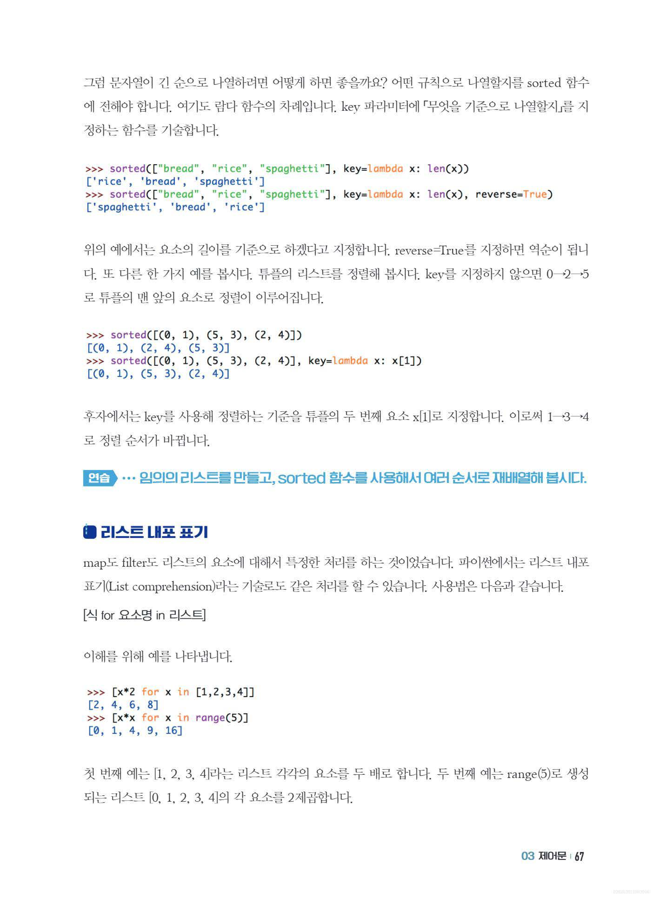

그럽 문자열이 긴 순으로 냐열하려면 어떻게 하면 좋을까요? 어떤 규칙으로 냐열할지를 sorted 함수 에 전해야 합니다. 여기도 람다 함수의 차례입니다. key 파라미터에 「무엇을 기준으로 나열할지」를 지

정하는 함수를 기술합니다.

###### >>> sorted(["bread" , "ri.ce" , "spaghetti."], key=lambda x: len(x)) ['ri.ce' , 'bread' , 'spaghetti. '] >>> sorted(["bread" , "ri.ce" , "spaghetti."], key= x: len(x), reverse=True) [ ' spaghetti. ' , ' bread ' , ' ri. ce'J

위의 예예서는 요소의 길이를 기준으로 하겠다고 지정합니다. reverse=True를 지정하면 역순이 됩니

###### 다. 또 다른 한 가지 예를 봅시다. 튜플의 리스트를 정렬해 봅시다. key를 지정하지 않으면 0一2一5

로 튜플의 맨 앞의 요소로 정렬이 이루어집니다.

###### >>> sorted([(0, 1) , (5 , 3), (2, 4)])

[(0, 1), (2, 4), cs , 3)]

###### >>> sorted([(0, 1), (5 , 3), (2, 4)], key=lambda x: x[l])

[(0, 1), cs , 3), (2, 4)]

###### 후자에서는 key를 사용해 정렬하는 기준을 튜플의 두 번째 요소 x[l]로 지정합니다. 이로써 1一3一4

로 정렬 순서가 바뀝니다.

…임으1으1 리스트를만들고,sorted 랍수를사용해서여근1 순서로재배열해봅시다

###### ·리스트 LH포표기

map도 filter도 리스트의 요소에 대해서 특정한 처리를 하는 것이었습니다. 파이썬에서는 리스트 내포 표기(List comprehension)라는 기술로도 같은 처리를 할 수 있습니다. 사용법은 다음과 같습니다. [식 for 요소명 in 리스트]

이해를 위해 예를 나타냅니다.

###### >>> [x*Z for x i.n [1 , 2 , 3,4]]

[2 , 4 , 6 , 8]

###### >>> [x*x for x i.n range(S)]

[0, 1, 4 , 9 , 16]

###### 첫 번째 예는 [1, 2, 3, 4]라는 리스트 각각의 요소를 두 배로 합니다. 두 번째 예는 range(5)로 생성

되는 리스트 [O, 1, 2, 3, 4]의 각 요소를 2제곱합니다.

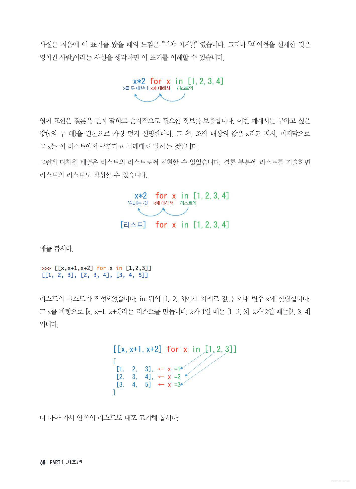

사실은 처음에 이 표기를 봤을 때의 느낌은 "뭐야 이거?!” 였습니다. 그러나 「파이썬을 설계한 것은 영어권 사람」이라는 사실을 생각하면 이 표기를 이해할 수 있습니다.

X*2 for x in [1 , 2, 3, 4]

x를 두 배한다

영어 표현은 결론을 먼저 말하고 순차적으로 필요한 정보를 보충합니다. 이번 예에서는 구하고 싶은

###### 값(x의 두 배)을 결론으로 가장 먼저 설명합니다. 그 후, 조작 대상의 값은 x라고 지시, 마지막으로

그 x는 이 리스트에서 구한다고 차례대로 말하는 것입니다. 그런데 다치원 배열은 리스트의 리스트로써 표현할 수 있었습니다. 결론 부분에 리스트를 기술하면 리스트의 리스트도 작성할 수 있습니다.

X*2 for x in [1 , 2, 3, 4]

원하는 것 x에 대해서 리스트의

[리스트] for x in 1, 2, 3, 4]

예를봅시다.

>>> [[x,x+l,x+Z] for x i.n [1,2 ,3]] [ [1 , 2 , 3] , [2 , 3, 4] , [3 , 4 , SJ]

리스트의 리스트가 작성되었습니다. in 뒤의 [1, 2, 3]에서 차례로 값을 꺼내 변수 x에 할당합니다. 그 x를 바탕으로 [x, X十1, x+2]라는 리스트를 만듭니다. x가 1일 때는 [1, 2, 3], X가 2일 때는[2, 3, 4] 입니다.

[[x,x+1,x+2] for x i,J/ -2;,3]]

[

- [1, 2, 3] , - X =l
- [2, 3, 4] , - =2 區 4, 5] - X =

]

- 더 나아 가서 안쪽의 리스트도 내포 표기해 봅시다.

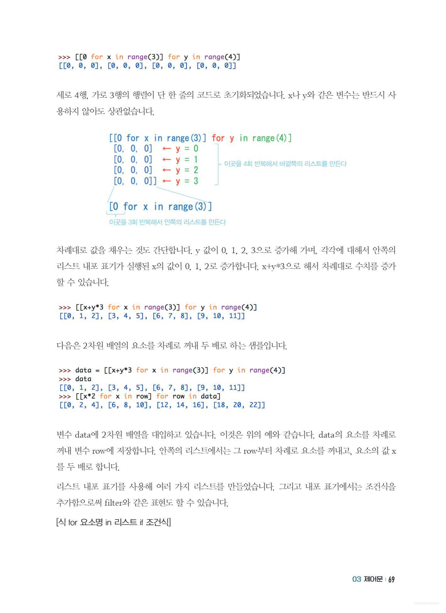

>>> [ [0 for x in range(3)] for y i.n range(4)]

, 0 , 0] , [0, 0 , 0] , , 0 , 0] , , 0 , 0]J

세로 4행, 가로 3행의 행렬이 단 한 줄의 코드로 초기화되었습니다. x냐 y와 같은 변수는 반드시 사

용하지 않아도 상관없습니다.

###### [ [O for x in range ( ) ]

for y in range (4) ]

[O, 0, 0] ~ y =

- [O, 0, 0] ~ y = 1
- [O, 0, 0] ~ y = 2

이곳을 4회 반복해서 바깥쪽의 리스트를 만든다

###### [O, 0, ] ~ y = 3

[O for x in range (3)J

이곳을 3회 반복해서 안쪽의 리스트를 만든다

차례대로 값을 재우는 것도 간단합니다. y 값이 0, 1, 2, 3으로 증가해 가며, 각각에 대해서 안쪽의 리스트 내포 표기가 실행된 x의 값이 0, I, 2로 증가합니다. x+y*3으로 해서 차례대로 수치를 증가 할수였습니다.

>>> [[x+y*3 for x i. range(3)] for y i.n range(4)]

- [[0, 1, 2] , [3, 4, SJ , [6, 7, 8] , [9, 10, 11]]

다음은 2치운l 배열의 요소를 차례로 꺼내 두 배로 하는 샘플입니다.

>>> data = [[x+y*3 for x in range(3)] for y i n range(4)] >>> data

, 1 , 2] , [3 , 4 , SJ , [6 , 7, 8] , , 10, ] >>> [[x*2 x in row] for row i n data]

- [[0, 2, 4] , [6, 8, 10] , [12, 14, 16] , [18, 20, 22]]

변수 data에 2치원 배열을 대입하고 있습니다. 이것은 위의 예와 같습니다. data의 요소를 차례로 꺼내 변수 row에 저장합니다. 안쪽의 리스트에서는 그 row부터 차례로 요소를 꺼내고, 요소의 값 x

###### 를두배로합니다.

리스트 내포 표기를 시용해 여러 가지 리스트를 만들었습니다. 그리고 내포 표기에서는 조건식을 추가함으로써 filter와 같은 표현도 할 수 있습니다. [식 for 요소명 in 리스트 if 조건식]

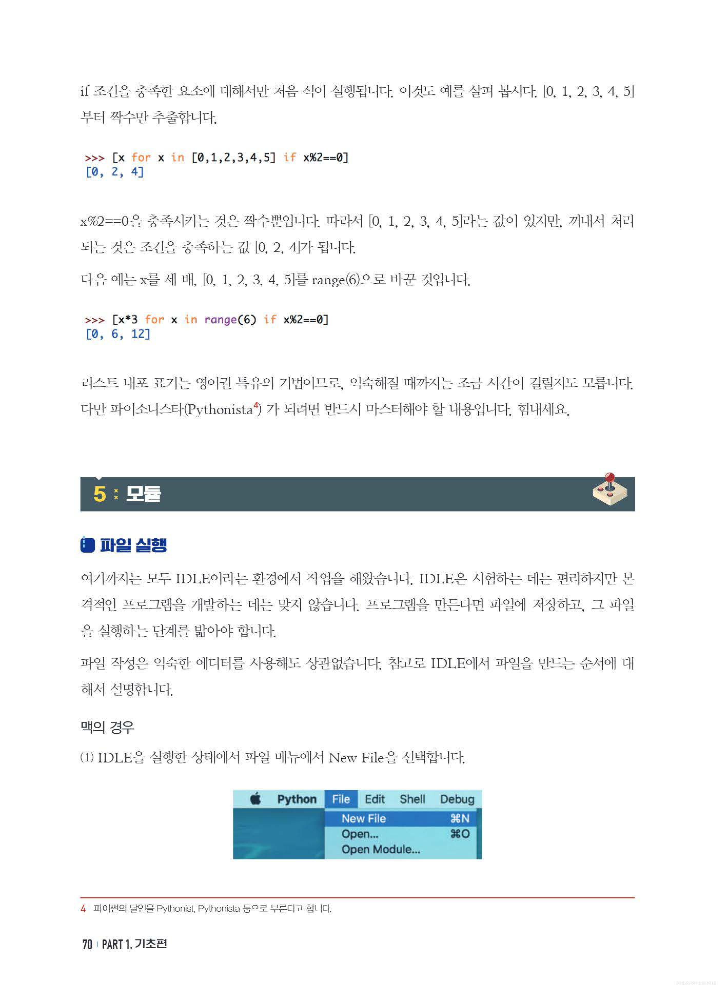

if 조건을 충족한 요소에 대해서만 처음 식이 실행됩니다. 이것도 예를 살펴 봅시다. [O, 1, 2, 3, 4, 5]

부터 짝수만 추출합니다.

###### >>> [x for x in [0,1,2,3,4,5] if x%2==0]

###### [0, 2 , 4]

x%2==0을 충족시키는 것은 짝수뿐입니다. 따라서 [O, 1, 2, 3, 4, 5]라는 값이 있지만, 꺼내서 처리 되는 것은 조건을 총족하는 값 [O, 2, 4]가 됩니다.

###### 다음 예는 x를 세 배, [O, 1, 2, 3, 4, 5]를 range(6)으로 바꾼 것입니다.

###### >>> [x*3 x in range(6) if x%2==0] [0, 6, 12]

리스트 내포 표기는 영어권 특유의 기법이므로, 익숙해질 때까지는 조금 시간이 걸릴지도 모릅니다.

다만 파이소니스타(Pythonista아 가 되려면 반드시 마스터해야 할 내용입니다. 힘내세요.

###### ·파일실웰

여기까지는 모두 IDLE이라는 환경에서 작업을 해왔습니다. IDLE은 시험하는 데는 편리하지만 본 격적인 프로그램을 개발하는 데는 맞지 않습니다. 프로그램을 만든다면 파일에 저장하고, 그 파일

###### 을 실행하는 단계를 밟아야 합니다.

파일 직성은 익숙한 에디터를 사용해도 상관없습니다. 참고로 IDLE에서 파일을 만드는 순서에 대

###### 해서 설명합니다.

맥의경우

(1) IDLE을 실행한 상태에서 파일 메뉴에서 New File을 선택합니다.

ti - Edit Shell

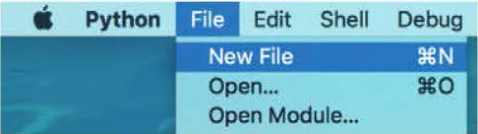

...

...

- 4 파이썬의 달인을 Pythonist. Pythonista 등으로 부른다고 합니다.

###### 70 1PART 1. 기조곤

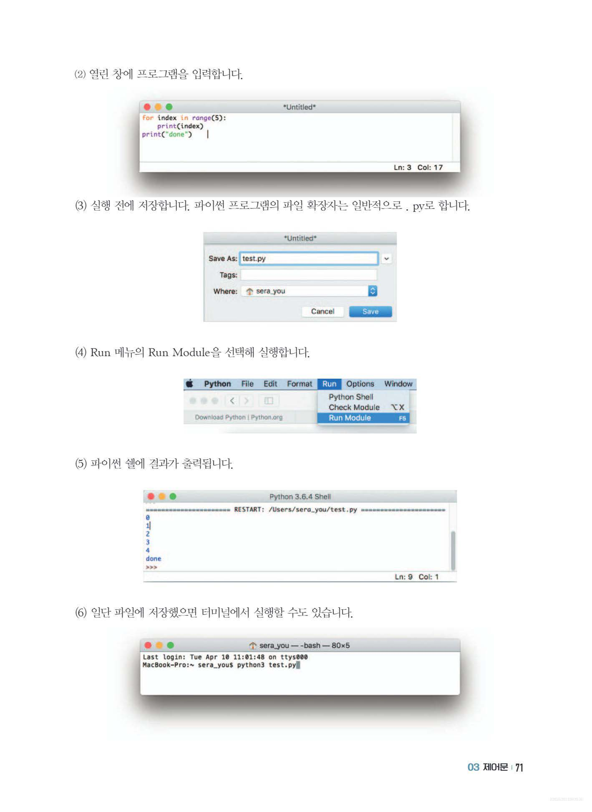

###### (2) 열린 창에 프로그램을 입력합니다.

•Untitled• fo index tn range(S):

pri.nt(i.ndex)

print(" ) I

###### (3) 실행 전에 저장합니다. 파이썬 프로그램의 파일 확장자는 일반적으로 . PY로 합니다.

~

As: test.py a

`/

Where: a ou

Cancel •

###### (4) Run 메뉴의 Run Module을 선택해 실행합니다.

~ 브

nle E Format

Window

<

Pylhon Sne ll

lo

0ol'fnlolld PYthooIP~thon.org I |

###### (5) 파이썬 쉘에 결과가 출력됩니다.

r REST짜:IUsersIscra_you/test.p——

, r- • Python 3.6.4 Shell

»·»

Ln: 9 l: 1

###### (6) 일단 파일에 저장했으면 터미널에서 실행할 수도 있습니다.

1' sera..You - -bash- 801(5

Last togi.n: Tue Apr 1e 11:el: 48 on ttyseee MacBook-Pro:... se ra_you$ python3 test.py

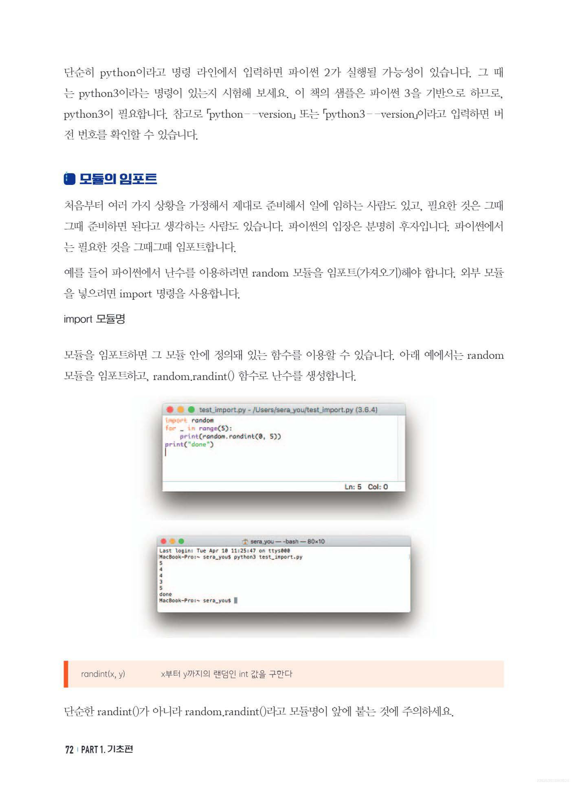

단순히 python이라고 명령 라인에서 입력하면 파이썬 2가 실행될 가능성이 있습니다. 그 때 는 python3이라는 명령이 있는지 시험해 보세요. 이 책의 샘플은 파이썬 3을 기반으로 하므로, python3이 필요합니다. 참고로 「python- ―version,」 또는 「python3 --version,」이라고 입력하면 버

###### 전 번호를 확인할 수 있습니다.

- 처음부터 여러 가지 상황을 가정해서 제대로 준비해서 일에 임하는 사람도 있고, 필요한 것은 그때 그때 준비하면 된다고 생각하는 사람도 있습니다. 파이썬의 입장은 분명히 후자입니다. 파이썬에서 는 필요한 것을 그때그때 임포트합니다.

예를 들어 파이썬에서 난수를 이용하려면 random 모듈을 임포트(가져오기)해야 합니다. 외부 모듈 을 넣으려면 import 명령을 사용합니다.

###### import 모듈명

###### 모듈을 임포트하면 그 모듈 안에 정의돼 있는 함수를 이용할 수 있습니다. 아래 예에서는 random 모듈을 임포트하고, random.randintO 함수로 난수를 생성합니다.

一 -

- .. rangc_ : prt nt("mdow, 5))

r rint('' )

Ln: 5 Col: 0

-r- sera_y어』― -bash —80xt0

\opu,, Apr 51 ◄7 on ro,~· sera_yous

5

4

- 4 3
- 5

done

-l'r() '~,;era_yous

randint(x, y)

X부터 y까지의 int 값을 구만다

###### 단순한 randintO가 아니라 random.randintO라고 모듈명이 앞에 붙는 것에 주의하세요.

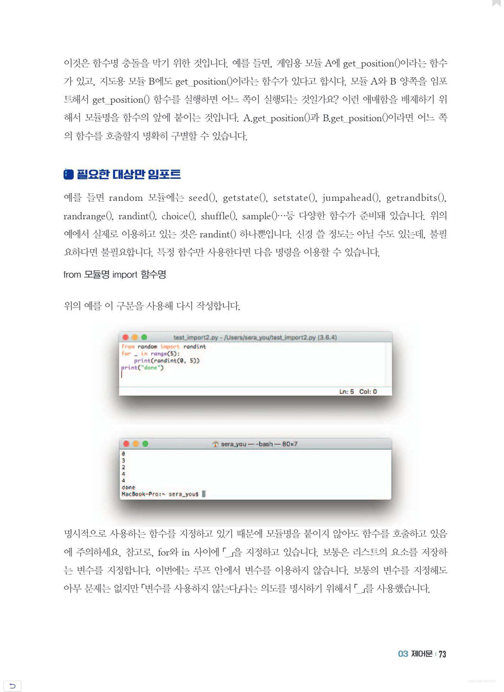

이것은 함수명 충돌을 막기 위한 것입니다. 예를 들면, 게임용 모듈 A에 get_positionO이라는 함수

- 가 있고, 지도용 모듈 B에도 get_positionO이라는 함수가 있다고 합시다. 모듈 A와 B 양쪽을 임포 트해서 get_positionO 함수를 실행하면 어느 쪽이 실행되는 것일가요? 이런 애매함을 배제하기 위 해서 모듈명을 함수의 앞에 붙이는 것입니다. A.get_positionO과 B.get_position(）이라면 어느 쪽 의 함수를 호출할지 명확히 구별할 수 있습니다.

• 필요한 임포트

예를 들면 random 모듈에는 seed(), getstate(), setstate(), jumpahead(), getrandbits(), randrangeO, randintO, choiceO, shuffleO, sampleO…등 다양한 함수가 준비돼 있습니다. 위의 예에서 실제로 이용하고 있는 것은 randintO 하나뿐입니다. 신경 쓸 정도는 아닐 수도 있는데, 불필

요하다면 불필요합니다. 특정 함수만 사용한다면 다음 명령을 이용할 수 있습니다.

from 모듈명 import 함수명

위의 예를 이 구문을 사용해 다시 작성합니다.

tesUTport2 py - 13.6.tl)

ri:-rr i- ~ ,.ange : mmdtnt

(" O, 5)) r nnt( "done")

Ln; 5 Col: 0

•

s타:a,.:y-0u = ~bash =

10

- 3 ,2 ,4
- 4

『IQ ~~g,rijt_;t, 1

명시적으로 사용하는 함수를 지정하고 있기 때문에 모듈명을 붙이지 않아도 함수를 호출하고 있음 에 주의하세요. 참고로, for와 in 사이에 「_貞t 지정하고 있습니다. 보통은 리스트의 요소를 저장하 는 변수를 지정합니다. 이번에는 루프 안에서 변수를 이용하지 않습니다. 보통의 변수를 지정해도

- 아무 문제는 없지만 「변수를 시용-하지 않는다」다는 의도를 명시하기 위해서 「_」를 사용했습니다.

03 제01문 I 73

###### =

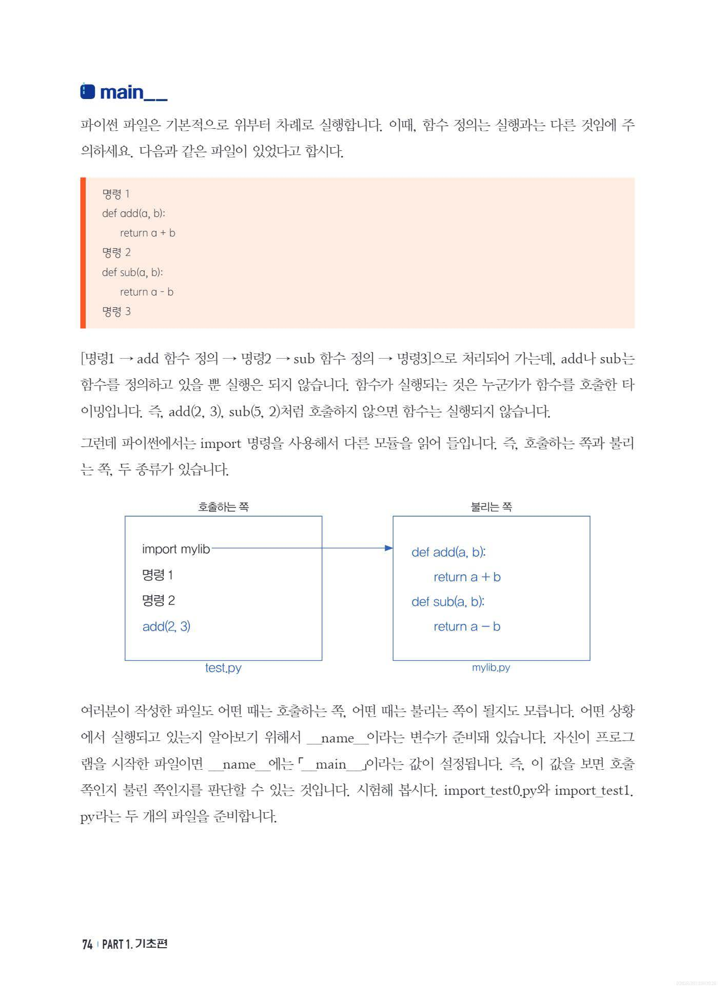

###### main__

###### 파이썬 파일은 기본적으로 위부더 차례로 실행합니다. 이때, 함수 정의는 실행과는 다른 것임에 주 의하세요. 다음과 같은 파일이 있었다고 합시다.

며려o o 1

###### def add(a, bl: return a + b

- 명령 2

def sub(a, b): return a - b

- 명령 3

[명령1 一 add 함수 정의 一 명령2 一 sub 함수 정의 一 명령3]으로 처리되어 가는데, add나 sub는 함수를 정의하고 있을 뿐 실행은 되지 않습니다. 함수가 실행되는 것은 누군가가 함수를 호출한 타 이밍입니다. 죽, add(2, 3), sub(S, 2)처럽 호출하지 않으면 함수는 실행되지 않습니다. 그런데 파이썬에서는 import 명령을 사용해서 다른 모듈을 읽어 들입니다. 즉, 호출하는 쪽과 불리 는 쪽, 두 종류가 있습니다.

호출하는쪽

불리는쪽

###### import mylib

def add(a, b):

return a +b

- 명령 1
- 명령 2

def sub(a, b):

return a —b

add(2, 3)

test.py

mylib.py

여러분이 작성한 파일도 어떤 때는 호출하는 쪽, 어떤 때는 불리는 쪽이 될지도 모릅니다. 어떤 상황

###### 에서 실행되고 었는지 알아보기 위해서 _name—-이라는 변수가 준비돼 있습니다. 자신이 프로그 램을 시작한 파일이면 _name―에는 二_main—」이라는 값이 설정됩니다. 즉, 이 값을 보면 호출 쪽인지 불린 쪽인지를 판단할 수 있는 것입니다. 시험해 봅시다. import―testO.py와 import—testl. PY라는 두 개의 파일을 준비합니다.

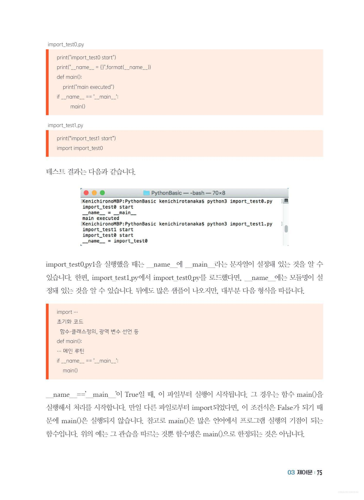

import_testO.py

print("import_testO start") print("_name__ = {}".format(_ name_J) def main():

print("main executed") if __name__ == '__main__':

main()

import_testl.py

print("import_testl start") import import_testO

###### 테스트 결과는 다음과 같습니다.

r

PythonBasic - -bash-70x8 [KenichironoMBP:PythonBasic kenichirotanaka$ python3 import_test0. py import_test0 start

name = main main executed

··I

[KenichironoMBP: PythonBasic kenichirotanaka$ python3 import_testl. py

impo rt_testl start import_test0 start _name_ = import_test0

###### import-testO.pyl을 실행했을 때는 —name―에 —main―라는 문자열이 설정돼 있는 것을 알 수

###### 있습니다. 한편, import-testl.py에서 import_testO.py를 로드했다면, _name―에는 모듈명이 설 정돼 였는 것을 알 수 있습니다. 뒤에도 많은 샘플이 나오지만, 내부분 다음 형식을 따릅니다.

###### import ...

조기화코드

암수클래스정의, 광역 변수 선언 등

###### def main():

... 메인 루틴

if __name__ == '__main '· main()

###### —name—=＝'—main—’이 True일 때, 이 파일부터 실행이 시작됩니다. 그 경우는 함수 main(）을

실행해서 처리를 시작합니다. 만일 다른 파일로부터 import되었다면, 이 조건식은 False가 되기 때

###### 문에 mainO은 실행되지 않습니다. 참고로 mainO은 많은 언어에서 프로그램 실행의 기점이 되는 함수입니다. 위의 예는 그 관습을 따르는 것뿐 함수명은 main(）으로 한정되는 것은 아닙니다.

03 제01문 I 75

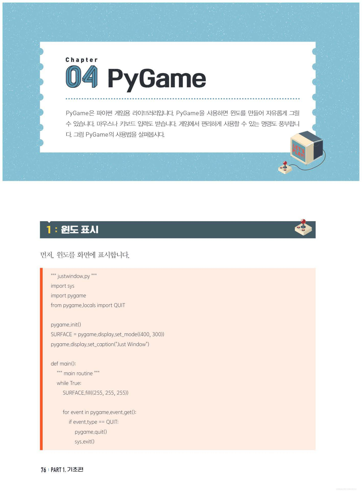

a e

Chapte 『

• ••• • • • • •• • • • • ••• •• •• • • •• • • •• • • • •• • •• • • • • • • • • • •• • • •• ••• •• •• •• • • • • • • •• • •• • • • • • •• • • •• • •• • •

PyGame은 표回썬 게임용 라이브러리입니다. PyGame을 사용하면 윈도를 만들어 자유롭게 그릴 수 있습니다 마우스나 키보드 입력도 받습니다 게임에서 편리하게 사용할 수 있는 명령도 풍부합니 다 그럼 PyGame의 사용법을 살펴봅시다.

- 2s
- 3

###### 먼저, 윈도를 화면에 표시합니다.

""" .ustwindow.py """ import sys import pygame from pygame.locals import QUIT

pygame.initO SURFACE = pygame.display.set_mode((400, 300)) pygame.display.set_caption("Just Window")

def main(): """ mam rout.lne """ while True:

SURFACE.fill((255, 255, 255))

for event in pygame.event.getO:

if event.type == QUIT: pygame.quitO sys.exit()

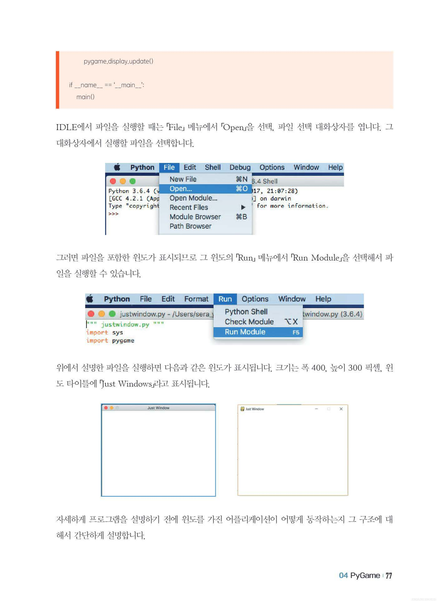

pygame.display.update()

if __name__ == '__main__': main()

IDLE에서 파일을 실행할 때는 「File」 메뉴에서 「Open」을 선택, 파일 선택 대화상자를 엽니다. 고 대화상자에서 실행할 파일을 선택합니다.

###### p"h야 _ Edit Shell Debug Opti.ons Window Help

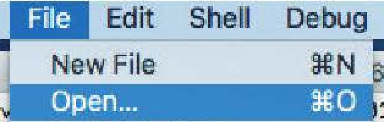

.4 Shell

17, 21 :017 :28)

hol'il 3..6,.4 (,

[GCC 4,뻬.2. 1 (A,p;p n ule... Type "'copyr'igIhtI ecent IFiIes

###### on dammn

►. ! oF moFe 1nFom야'ion』

>>> Module !Browser IBmwser

,

그러면 파일을 포함한 윈도가 표시되므로 그 윈도의 「Run」 메뉴에서 「Run Module_&- 선택해서 파

###### 일을 실행할 수 있습니다.

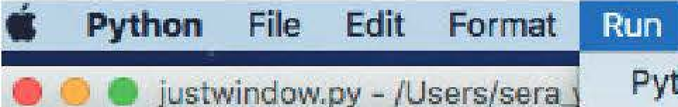

Python I]떠

Window

—:ow.py(3,16,

뇨— ju I""" ·twi..ndow. py """ import sys i py,g(llme

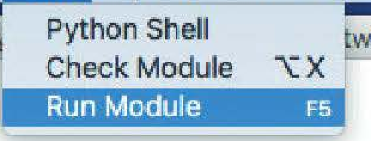

Python SheII

,^.L

위에서 설명한 파일을 실행하면 다음과 같은 윈도가 표시됩니다. 크기는 폭 400, 높이 300 픽셀, 윈 도 타이틀에 rJust Window~」라고 표시됩니다.

• Jus O뇨"w~～ X

자세하게 프로그램을 설명하기 전에 윈도를 가진 어플리케이션이 어떻게 동작하는지 그 구조에 대 해서 간단하게 설명합니다.

###### 04 PyGame 177

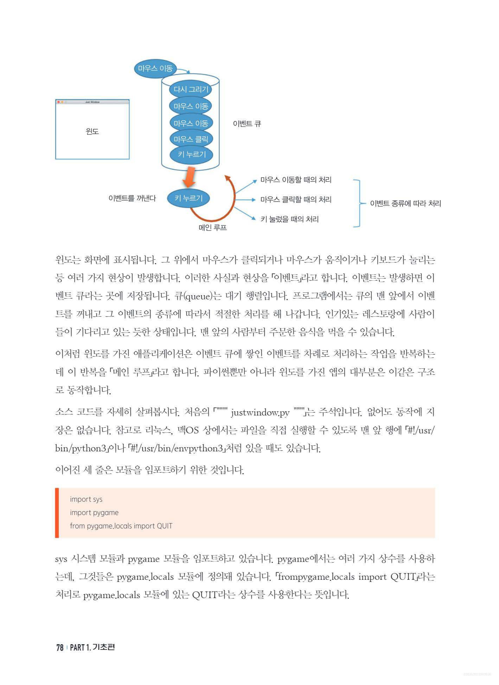

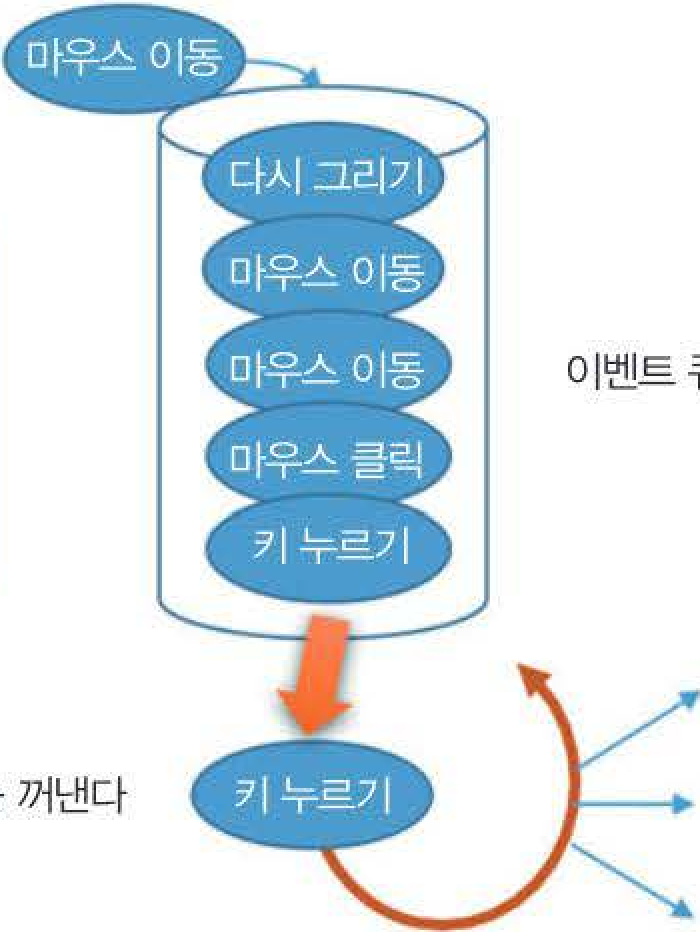

• 드-

이벤트큐

윈도

마우스이동할때의처리

###### 이벤트를꺼낸다

마우스클릭할때의처리

이벤트종류에따라처리

\ *키눌렀을때의처리

메인루프

윈도는 화면에 표시됩니다. 그 위에서 마우스가 클릭되거나 마우스가 움직이거나 키보드가 눌리는 둥 여러 가지 현상이 발생합니다. 이러한 사실과 현상을 「이벤트」라고 합니다. 이벤트는 발생하면 이

###### 벤트 큐라는 곳에 저장됩니다. 큐(queue)는 대기 행렬입니다. 프로그램에서는 큐의 맨 앞에서 이벤

트를 꺼내고 그 이벤트의 종류에 따라서 적절한 처리를 해 나갑니다. 인기있는 레스토랑에 사람이 들이 기다리고 있는 듯한 상태입니다. 맨 앞의 사람부터 주문한 음식을 먹을 수 있습니다.

이처럽 윈도를 가진 애플리게이션은 이벤트 큐에 쌓인 이벤트를 차례로 처리하는 작업을 반복하는 데 이 반복을 「메인 루프」라고 합니다. 파이썬뿐만 아니라 윈도를 가진 앱의 대부분은 이같은 구조 로동작합니다.

소스 코드를 자세히 살펴봅시다. 처음의 「'"＇＂＂ justwindow.py "“二는 주석입니다. 없어도 동작에 지 장은 없습니다. 참고로 리눅스, 맥OS 상에서는 파일을 직접 실행할 수 있도록 맨 앞 행에 「#!／usr/ bin/python3」이나 「#!/usr/bin/envpython3」처럼 있을 때도 있습니다.

이어진 세 줄은 모듈을 임포트하기 위한 것입니다.

import sys import pygame from pygame.locals import QUIT

###### sys 시스템 모듈과 pygame 모듈을 임포트하고 었습니다. pygame에서는 여러 가지 상수를 사용하 는데, 그것들은 pygame.locals 모듈에 정의돼 있습니다. 「frompygame.locals import QUIT」라는 처리로 pygame.locals 모듈에 있는 QUIT라는 상수를 시용한다는 뜻입니다.

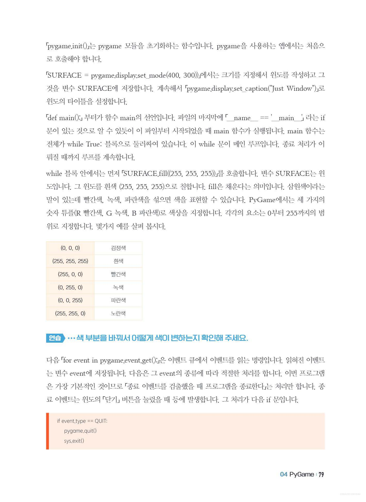

###### 「pygame.initQ」는 pygame 모듈을 초기화하는 함수입니다. pygame을 사용하는 앱에서는 처음으

로호출해야합니다.

###### 「SURFACE = pygame.display.set_mode(400, 300))」에서는 크기를 지정해서 윈도를 작성하고 그 것을 변수 SURFACE에 저장합니다. 계속해서 「pygame.display.set_caption("Just Window")J로

윈도의 타이틀을 설정합니다.

###### 「def mainO:J 부터가 함수 main의 선언입니다. 파일의 마지막에 「—name— == 二-main―〕 라는 if

문이 있는 것으로 알 수 있듯이 이 파일부터 시작되었을 때 main 함수가 실행됩니다. main 함수는 전체가 while True: 블록으로 둘러싸여 있습니다. 이 while 문이 메인 루프입니다. 종료 처리가 이 뤄질 때까지 루프를 계속합니다.

while 블록 안에서는 먼저 「SURFACE.fi11((255, 255, 255)）훑} 호출합니다. 변수 SURFACE는 윈 도입니다. 그 윈도를 흰색 (255, 255, 255)으로 질합니다. fill은 채운다는 의미입니다. 삼원색이라는 말이 있는데 빨간색, 녹색, 파란색을 섞으면 색을 표현할 수 있습니다. PyGame에서는 세 가지의 숫자 튜플(R 빨간색, G 녹색, B 파란색)로 색상을 지정합니다. 각각의 요소는 0부터 255까지의 범 위로 지정합니다. 몇가지 예를 살펴 봅시다.

(0, 0, 0) 7O4大O1人-,H

(255, 255, 255) 흰색

(255, 0, 0) 빨간색

(0, 255, 0) 녹색

(0, 0, 255) 파란색

(255, 255, 0) 노란색

…색 머뛸계 학인해

다음 「for event in pygarne.event.getO:~픈 이벤트 큐에서 이벤트를 읽는 명령입니다. 읽혀진 이벤트

는 변수 event에 저장됩니다. 다음은 그 event의 종류에 따라 적절한 처리를 합니다. 이번 프로그램 은 가장 기본적인 것이므로 「종료 이벤트를 검출했을 때 프로그램을 종료한다」는 처리만 합니다. 종 료 이벤트는 윈도의 「닫기」 버튼을 눌렀을 때 둥에 발생합니다. 그 처리가 다음 if 문입니다.

###### if event.type == QUIT: pygame.quitO sys.exit()

04 PyGame 179

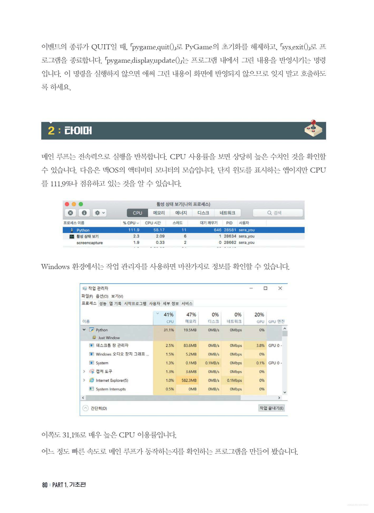

###### 이벤트의 종류가 QUIT일 때, 「pygame.quitO」로 PyGame의 초기회를 해제하고, 「sys.exitO」로 프 로그램을 종료합니다. 「pygame.display.updateO_k곤 프로그램 내에서 그린 내용을 반영시키는 명령

입니다. 이 명령을 실행하지 않으면 애써 그린 내용이 화면에 반영되지 않으므로 잊지 말고 호출하도 록하세요.

메인 루프는 전속력으로 실행을 반복합니다. CPU 사용률을 보면 상당히 높은 수치인 것을 확인할 수 있습니다. 다음은 맥OS의 액티비티 모니터의 모습입니다. 단지 윈도를 표시하는 앱이지만 CPU 를 111.9%나 점유하고 있는 것을 알 수 있습니다.

••i•--

상태 프로세스)

Q 겁색

프로세스 0 %CPU v CPU 시간 스러드 대기 깨우기 PID 사용자

2.3 1.9

2.09 0.33

1 0 28662 sera_you

###### • 기

screcncapture

###### Windows 환경에서는 작업 관리지를 사용하면 마찬가지로 정보를 확인할 수 있습니다.

작업관리자 D X

파입(F) 옵선(0) 보기" 프르세스 성능 기목 시직프로그밉 사용자 세부 성보 서비스

###### 41% 47% 0% 0% 20%

、¢

CPU 메모리 디스크 내드워크 GPU Ic;p~ 언

- J

이름

V Python 31.1% 19.5MB /s 0% ^

G J"t WIndow 데스크톱 징 건리자 2.5% 83.6MB GPU O • Windows 오다오 강지 그레프 .- 1.5% 5. OMB/s 0%

:i: Syst~m 1.3% 0.1MB/s 0.1~ GPU O • > 깁저도구 1.3% 3 MB OMbps G > Int던met Explor‘r{S) 1. 露

i1J System Interrupts 0. 0%

V

< >

/' 갑단히(0) 작업 끝내기(E}

이쪽도 31.1%로 매우 높은 CPU 이용률입니다.

어느 정도 빠른 속도로 메인 루프가 동작하는지를 확인하는 프로그램을 만들어 봤습니다.

###### 80 1PART1. 기조곤

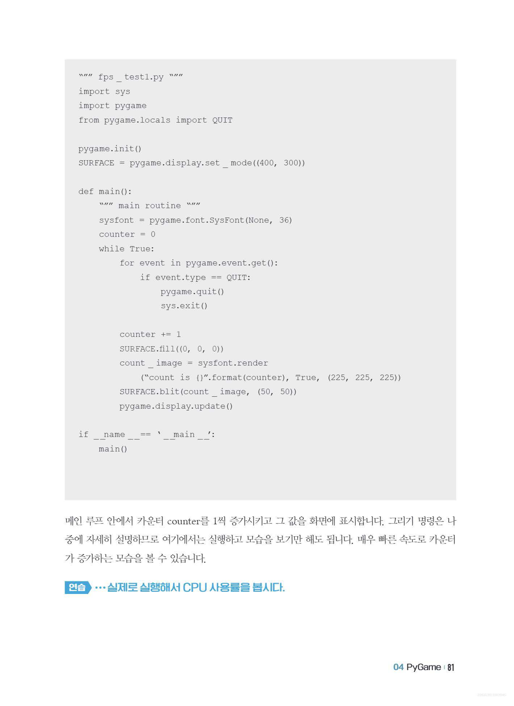

\\Ill/ f ps testl .py

\\ IIII

i mport sys i mport pygame from pygame.locals import QUIT

pygame .i ni t () SURFACE = pygame .d i spl ay. set mode ((400, 300) )

def main() : "1111 mai n r outi ne "'"' sysfont = pygame .font. SysFont (None, 36) counter = 0 while Tr ue:

for event i n pygame .event.get() :

if event .type == QUIT: pygame .quit () sys .exit ()

counter += 1 SURFACE.fil l((0, 0, 0)) count i mage = sysf ont.r ender

("count i s {}". forrnat(counter) , True, (225, 225, 225) ) SURFACE.blit (count _ i mage, (50, 50)) pygarne .di spl ay.update ()

` mai•n '.

if name

ma i n()

‘

메인 루프 안에서 카운터 counter를 1씩 증가시키고 그 값을 화면에 표시합니다. 그리기 명령은 나 중에 자세히 설명하므로 여기에서는 실행하고 모습을 보기만 해도 됩니다. 매우 빠른 속도로 카운터 가 증가하는 모습을 볼 수 있습니다.

###### …실제로실햄해서 CPU사용률을봅시다.

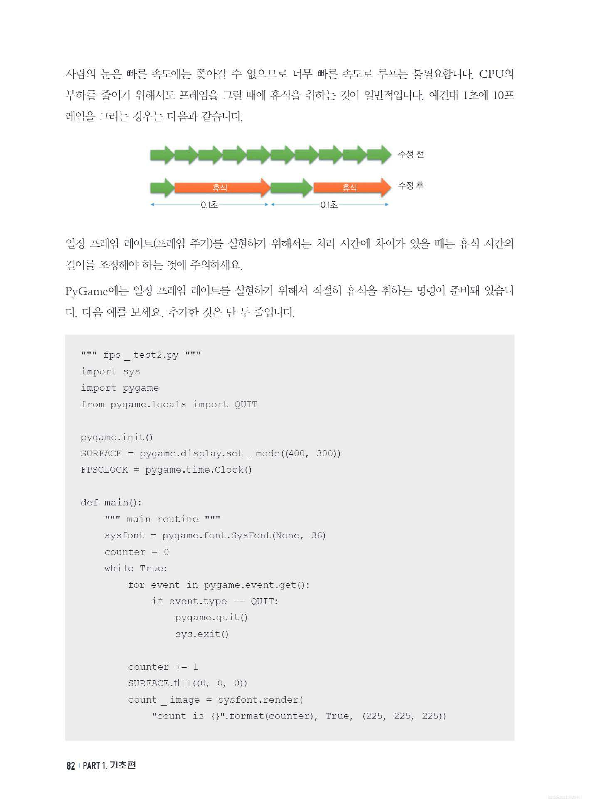

###### 사람의 눈은 빠른 속도에는 쫓아갈 수 없으므로 너무 빠른 속도로 루프는 불필요합니다. CPU의 부하를 줄이기 위해서도 프레임을 그릴 때에 휴식을 취하는 것이 일반적입니다. 예컨대 1초에 10프 레임을 그리는 경우는 다음과 같습니다.

수정전

수정후

►

빼 0.1초 ► ◄ 0.1초

###### 일정 프레임 레이트(프레임 주기)를 실현하기 위해서는 처리 시간에 차이가 었을 때는 휴식 시간의

길이를 조정해야 하는 것에 주의하세요.

PyGame에는 일정 프레임 레이트를 실현하기 위해서 적절히 휴식을 취하는 명령이 준비돼 있습니

###### 다. 다음 예를 보세요. 추가한 것은 단 두 줄입니다.

###### IIIIII fps test2 .py

II II II

import sys import pygame from pygame.locals import QUI T

pygame .init () SURFACE = pygame.display. set mode((400, 300)) FPSCLOCK = pygame.time.Clock()

def main() : 111111 main routine 111111 sysfont = pygame.font. SysFont(None, 36)

counter = 0 while True:

f or event in pygame .event.get() :

i f event .type == QUIT: pygame .quit () sys .exit()

counter += 1 SURFACE.fill((O, 0, 0)) count image = sysfont.render(

"count is {}". forrnat(counter) , True, (225, 225, 225) )

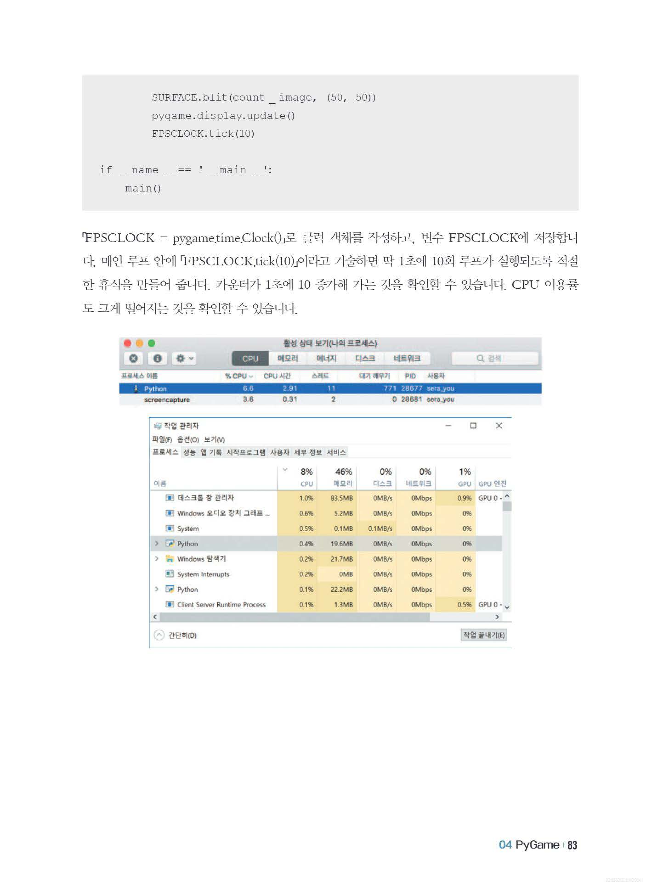

SURFACE.blit(count i mage, (50, 50) ) pygame.display.update () FPSCLOCK.t i ck(lO)

###### ’

I •

mal n ••

if name main’ ()

「FPSCLOCK = pygame.time.Clock0」로 클럭 객체를 작성하고, 변수 FPSCLOCK:에 저장합니

다. 메인 루프 안에 「FPSCLOCK.tick(lO)」이라고 기술하면 딱 1초에 10회 루프가 실행되도록 적절

한 휴식을 만들어 줍니다. 카운터가 1초에 10 증가해 가는 것을 확인할 수 있습니다. CPU 이용률

도 크게 떨어지는 것을 확인할 수 있습니다.

-

v 시긴 대기

###### 2

• 작업관라자 D X

파일(f) 옵선(0) 보기N) 프로세스 엽 기옥 시작프로그덩 세부 정보 서비스

`' 8% 46% 0% 0% 1%

이롭 CPU 대모리 다스크 내드위크 GPU GPU 연진 五 데스크톱창전리자 1 GPU O - A

windows 오디오 강지 그데프 .- OMB/s 璋

■ System o,5% 0. OMbps 0*

> Python o.4% 19.6MB OMB/s OMbps ) L Wi떠OW$ 딩색기 0.296 OM8/s OMbps

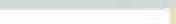

으 System Interrupts Q2% 0*

> c;;' Python OMbps 露

T CUenl Sen/er Runtime Process 0.1W. 1.3MB OMbps GPU O • ..,

###### ( >

r 간단8 (0) 작업 (E)

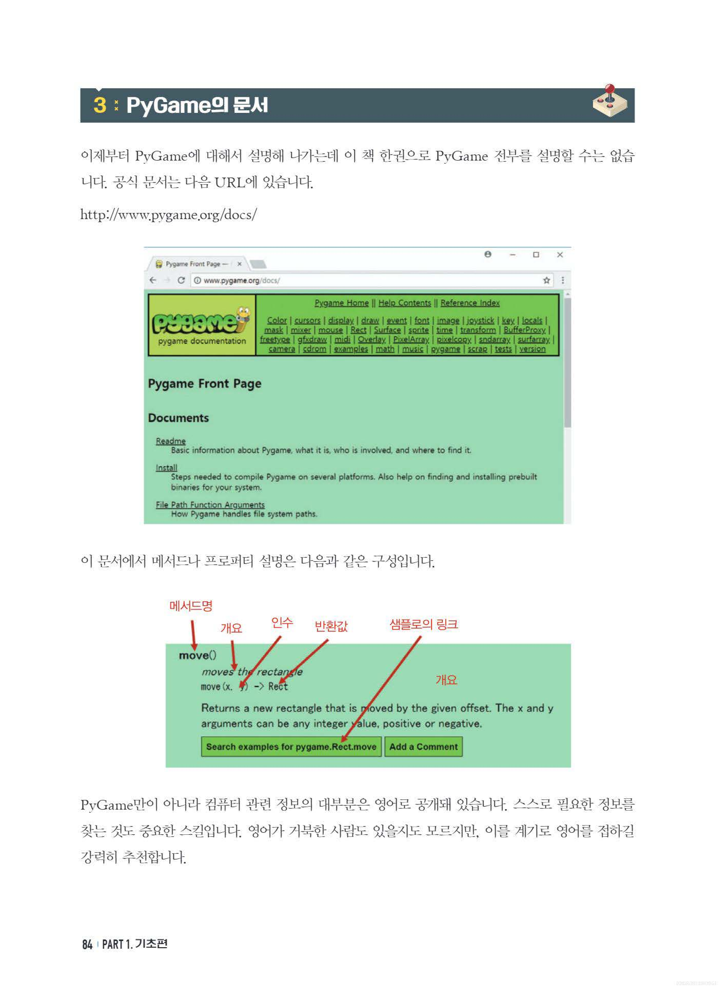

이제부터 PyGame에 대해서 설명해 나가는데

###### 이 책 한권으로 P y Game 전부를 설명할 수는 없습

###### 니다. 공식 문서는 다음 URL에 있습니다.

http://www.pygame.org/docs/

###### x

e 。

eL C (i)WWW.py9mm'•.Orgfd"입

內 fronIP" ―

* :

•

ll Htl9 ‘SIDSIDSl 11 庫11mI l며1K .

###### .

I I l I I I

pygame documentation

l

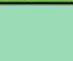

information about Py911mt,whet 1t 1s.who 1s involved. and whtrt to find it

Steps needed to compile Pygam• on several platforms. Also htlp on find,ng and installing prebu,lt binaries for your 하stem.

"' Fµnq,9n Nqum@nE

How Pygame handles file system paths

이 문서에서 메서드나 프로퍼티 설명은 다음과 같은 구성입니다.

i mov

반환값

개요

e(``,'

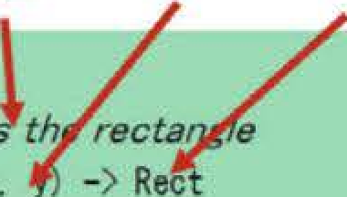

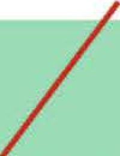

'e:

C

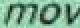

- > Re

move(x.

Returns a new rectangle that z ved by t he given offset. The x and y arguments can be any integer ifl ue. positive or negative.

Searchexemp區for py~o.R t.movoI| |

PyGame만이 아니라 컴퓨터 관련 정보의 대부분은 영어로 공개돼 있습니다. 스스로 필요한 정보를 찾는 것도 중요한 스킬입니다. 영어가 거북한 사람도 었을지도 모르지만, 강력히 추천합니다.

이를 계기로 영어를 접하길

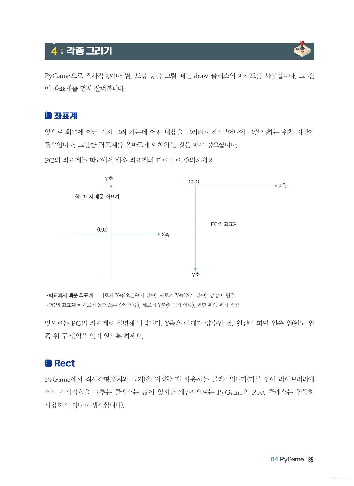

PyGame으로 직사각형이나 원, 도형 등을 그릴 때는 draw 클래스의 메서드를 사용합니다. 그 전 에 좌표계를 먼저 살펴봅니다.

###### ·좌표계

앞으로 화면에 여러 가지 그려 가는데 어떤 내용을 그리려고 해도 「어디에 그릴까」하는 위치 지정이 필수입니다. 그만큼 좌표계를 올바르게 이해하는 것은 매우 중요합니다. PC의 좌표계는 학교에서 배운 좌표계와 다르므로 주의하세요.

yr

(0,0)

x축

학교에서배운좌표계

PC의 좌표계

(0,0)

x축

Y축

·학교에서 배운 좌표계 =가로가 X축(오른쪽이 양수). 세로가Y축(위가 양수)． 중앙이 원점

•PC의 좌표계 = 가로가 X축(오른쪽이 양수). 세로가Y축(아래가 양수). 화면 왼쪽 위가 원점

앞으로는 PC의 좌표계로 설명해 냐갑니다. Y축은 아래가 양수인 것, 원점이 화면 왼쪽 위(윈도 왼 쪽 위 구석)임을 잊지 않도록 하세요.

###### ■ Rect

###### PyGame에서 직사각형(위치와 크기)을 지정할 때 사용하는 클래스입니다(다른 언어 라이브러리에

서도 직사각형을 다루는 클래스는 많이 있지만 개인적으로는 PyGame의 Rect 클래스는 월등히

사용하기 쉽다고 생각합니다).

###### 04 PyGame 185

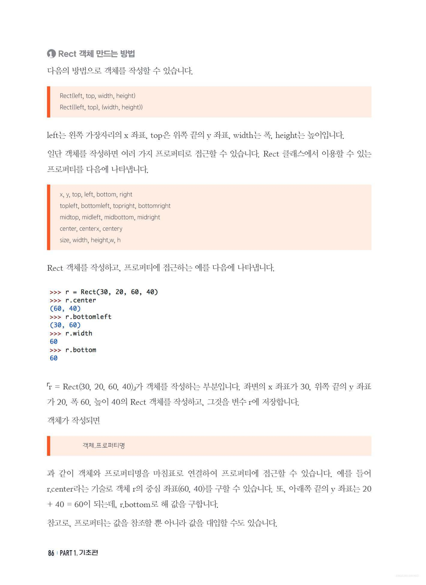

###### C) Rect 객체 만드는 방법

###### 다음의 방법으로 객체를 작성할 수 였습니다.

Rect(left, top, width, height) Rect((left, top), (width, height))

left는 왼쪽 가장자리의 x 좌표, top은 위쪽 끝의 y 좌표, width는 폭, height는 높이입니다. 일단 객체를 작성하면 여러 가지 프로퍼티로 접근할 수 있습니다. Rect 클래스에서 이용할 수 있는 프로퍼티를 다음에 나타냅니다.

x, y, top, left, bottom, right topleft, bottomleft, topright, bottomright midtop, midleft, midbottom, midright center, centerx, centery size, width, height,w, h

###### Rect 객체를 작성하고, 프로퍼티에 접근하는 예를 다음에 나타냅니다.

>>> r = Rect(30, 20, 60, 40) >>> r.center (60, 40) >>> r.bottomleft (30, 60) >>> r . wi.dth

>>> r.bottom 60

rr =Rect(30, 20, 60, 40)」가 객체를 작성하는 부분입니다. 좌변의 x 좌표가 30, 위쪽 끝의 y 좌표

- 가 20, 폭 60, 높이 40의 Rect 객체를 작성하고, 그것을 변수 r에 저장합니다.

객체가작성되면

객재프로퍼티명

과 같이 객체와 프로퍼티명을 마침표로 연결하여 프로퍼티에 접근할 수 있습니다. 예를 들어

###### r.center라는 기술로 객체 r의 중심 좌표(60, 40)를 구할 수 있습니다. 또, 아래쪽 끝의 y 좌표는 20

十 40 =60이 되는데, r.bottom로 해 값을 구합니다.

참고로, 프로퍼티는 값을 참조할 뿐 아니라 값을 대입할 수도 있습니다.

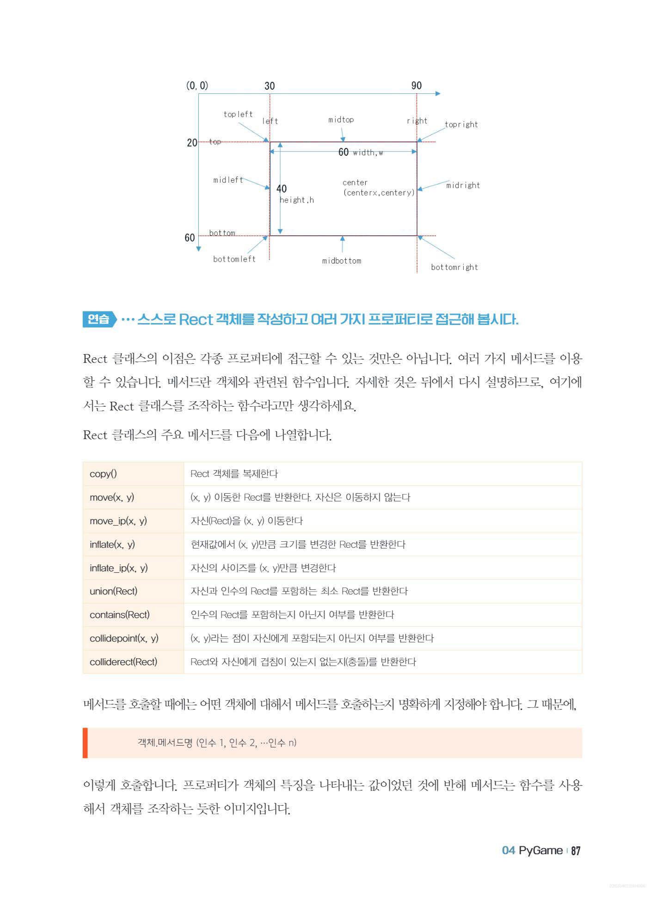

###### 90

###### (0. 0) 30

_ ?_

:

\

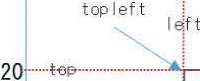

midtop

r lt ht

topr ight

·-..

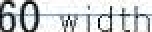

rn id lef O Ie

center (centerx.centery)

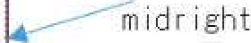

4`

· 天 4`‘`

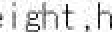

． `·

4 ‘·4·‘·

6。LhQtlon

一/

4 ` 4 4

••••••••

bottomleft midbottom

bot tomr ight

###### …스스로Rect객체를작성하고여러가지 프로퍼El로접근해봅AIE|.

Rect 클래스의 이점은 각종 프로퍼티에 접근할 수 있는 것만은 아닙니다. 여러 가지 메서드를 이용

할 수 있습니다. 메서드란 객체와 관련된 함수입니다. 지세한 것은 뒤에서 다시 설명하므로, 여기에 서는 Rect 클래스를 조작하는 함수라고만 생각하세요. Rect 클래스의 주요 메서드를 다음에 나열합니다.

copy()

Rect 객체를 복제한다

move(x. y)

(x, y) 이동한 Reel를 반환한다 자신은 이동하지 않는다

move_ip(x. y)

자신(Reel)을 (x, y) 이동한다 현재값에서 (x, Y)만큼 크기를 변경한 Rect를 반환한다 자신의 사이즈를 (x. Y)만큼 변경한다 자신과 인수의 Rect를 포함하는 최소 Rect를 반환한다 인수의 Rect를 포함하는지 아닌지 여부를 반환한다 (x, Y)라는 점이 자신에게 포함되는지 아닌지 여부를 반환한다 Rect와 자신에게 겹침이 있는지 없는지(충돌)를 반환한다

inflate(x. y)

inflate_ip(x, y)

union(Rect)

contains(Rect)

collidepoint(x. y)

colliderect(Rect)

###### 메서드를 호출할 때에는 어떤 객체에 대해서 메서드를 호출하는지 명획하게 지정해야 합니다. 그 때문에,

객재메서드명 (인수 1, 인수 2, ..인수 n)

###### 이렇게 호출합니다. 프로퍼티가 객체의 특징을 냐타내는 값이었던 것에 반해 메서드는 함수를 사용 해서 객체를 조작하는 듯한 이미지입니다.

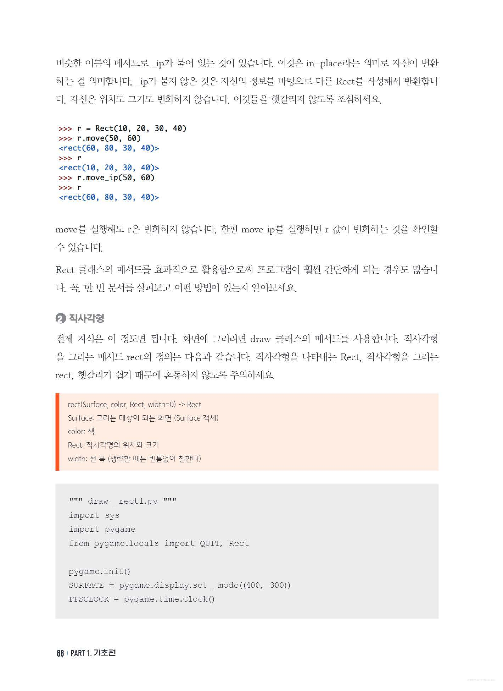

비슷한 이름의 메서드로 _ip가 붙어 였는 것이 있습니다. 이것은 in―place라는 의미로 자신이 변환

- 하는 걸 의미합니다. _ip가 붙지 않은 것은 자신의 정보를 바탕으로 다른 Rect를 작성해서 반환합니

다. 자신은 위치도 크기도 변화하지 않습니다. 이것들을 헷갈리지 않도록 조심하세요.

>>> r = Rect(10, 20, 30, 40) >>> r.move(50, 60) <rect(60, 80, 30, 40)> >>> r <rect(10 , 20, 30, 40)> >>> r.move_i.p(50, 60) >>> r <rect(60, 80, 30, 40)>

move를 실행해도 r은 변화하지 않습니다. 한편 move―ip를 실행하면 r 값이 변화하는 것을 확인할 수있습니다. Rect 클래스의 메서드를 효과적으로 활용함으로써 프로그램이 훨씬 간단하게 되는 경우도 많습니

다. 꼭, 한 번 문서를 살펴보고 어떤 방법이 있는지 알아보세요.

###### Q 직사각형

전제 지식은 이 정도면 됩니다. 화면에 그리려면 draw 클래스의 메서드를 사용합니다. 직사각형 을 그리는 메서드 rect의 정의는 다음과 같습니다. 직사각형을 나타내는 Rect, 직사각형을 그리는 rect, 헷갈리기 쉽기 때문에 혼동하지 않도록 주의하세요.

rect(Surface, color, Rect, width=O) -> Rect Surface: 그리는 대상이 되는 화면 (Surface 객제) color: 색 Rect: 직사각명의 위지와 크기 width: 선 폭 (생략말 때는 빈틈없이 질만다)

""" draw —rectl.py import sys import pygarne

###### ”""

from pygame .locals import QUI T, Rect

pygarne .init () SURFACE = pygarne.display.set mode((400, 300)) FPSCLOCK = pygarne.time.Clock()

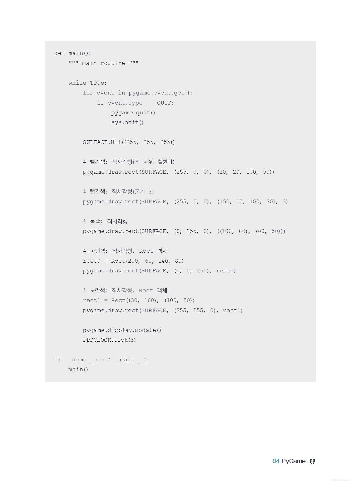

def main() : 111111 ma i n routi ne 111111

while Tr ue: for event i n pygame .event.get () :

i f event .type == QUIT: pygame .qui t () sys .exit()

SURFACE .fil l ((255, 255, 255))

# 빨간색: 직사각형 (꽉 채워 칠한다)

###### pygarne .draw.rect (SURFACE, (255, 0, 0) , (10, 20, 100, 50) )

# 빨간색: 직사각형(굵기 3)

###### pygame .draw. r ect (SURFACE, (255, 0, 0) , (150, 10, 100, 30) , 3)

# 녹색: 직사각형

pygarne .draw. r ect (SURFACE, (0, 255, 0) , ( (100, 80) , (80, 50) ))

# 파란색: 직사각형, Rect 객체 r ect o = Rect (200, 60, 140, 80) pygarne .draw. r ect (SURFACE, (0, 0, 255) , r ectO)

# 노란색: 직사각형, Rect 객체 rectl = Rect ((30, 160), (100, 50) ) pygarne .draw.rect (SURFACE, (255, 255, 0) , r ect l)

pygarne .d i spl ay.updat e () FPSCLOCK.t i ck(3)

’ mai• n ’••

if name ma i’ n ()

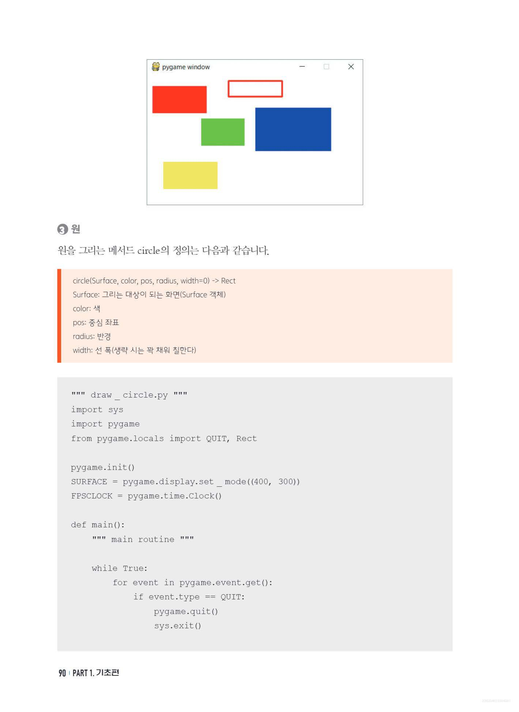

##### — l

Q pygame window X

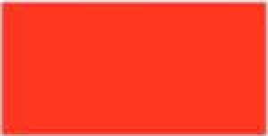

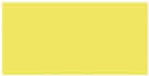

###### 0 원

###### 원을 그리는 메서드 circle의 정의는 다음과 같습니다.

circle(Surface, color, pos, radius, width=O) -> Rect Surface: 그리는 대상이 되는 화면(Surface 객제) color: 색 pos: 중심 좌표 radius: 반경 width: 선 폭(생략 시는 꽉 재워 질만다)

111111 draw circle.py """ import sys import pygame from pygame.locals import QUI T, Rect

pygarne .init () SURFACE = pygarne.display.set mode((400, 300)) FPSCLOCK = pygarne.time.Clock()

def main () : 111111 main routine 111111

while True: for event in pygame.event.get() :

if event .type == QUIT: pygame .quit() sys.exit()

90 1PART 1. 기조곤

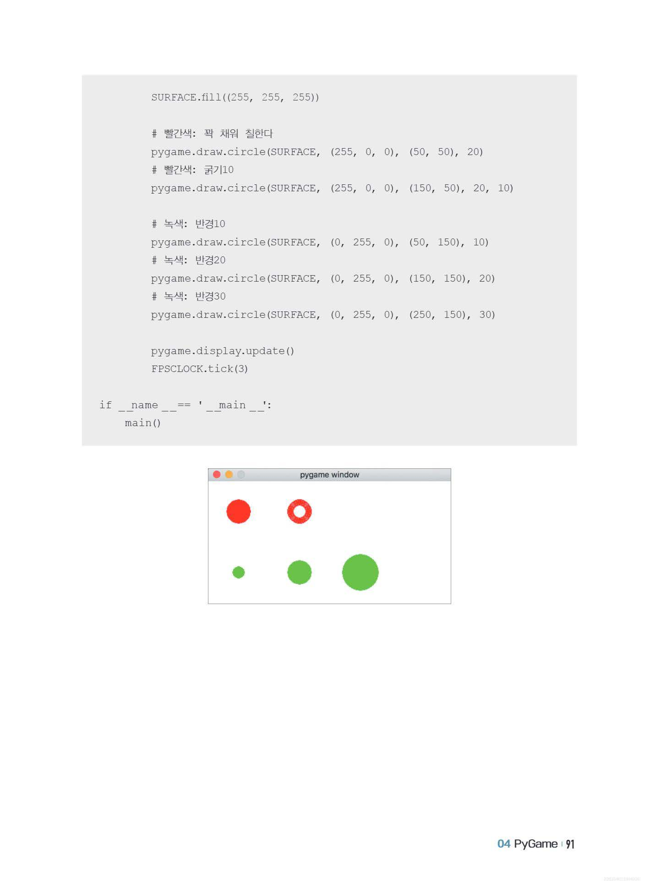

###### SURFACE .fill((255, 255, 255))

# 빨간색: 꽉 채워 칠한디

###### pygarne .draw.c i rcl e (SURFACE, (255, 0, 0) , (50, 50) , 20)

# 빨간색: 굵기10

###### pygarne .draw.c i rcl e (SURFACE, (255, 0, 0) , (150, 50) , 20, 10)

# 녹색: 반경10

###### pygarne .draw.c i rcl e(SURFACE, (0, 255, 0) , (50, 150) , 10)

# 녹색: 반경20

###### pygarne .draw.c i rcl e (SURFACE, (0, 255, 0) , (150, 150) , 20)

# 녹색: 반경30

pygarne .draw.c i rcl e (SURFACE, (0, 255, 0) , (250, 150) , 30)

pygarne .d i spl ay.updat e () FPSCLOCK.t i ck(3)

’ mai• n ’••

if name

ma i’ n ()

#### •

pygame window

。

# •

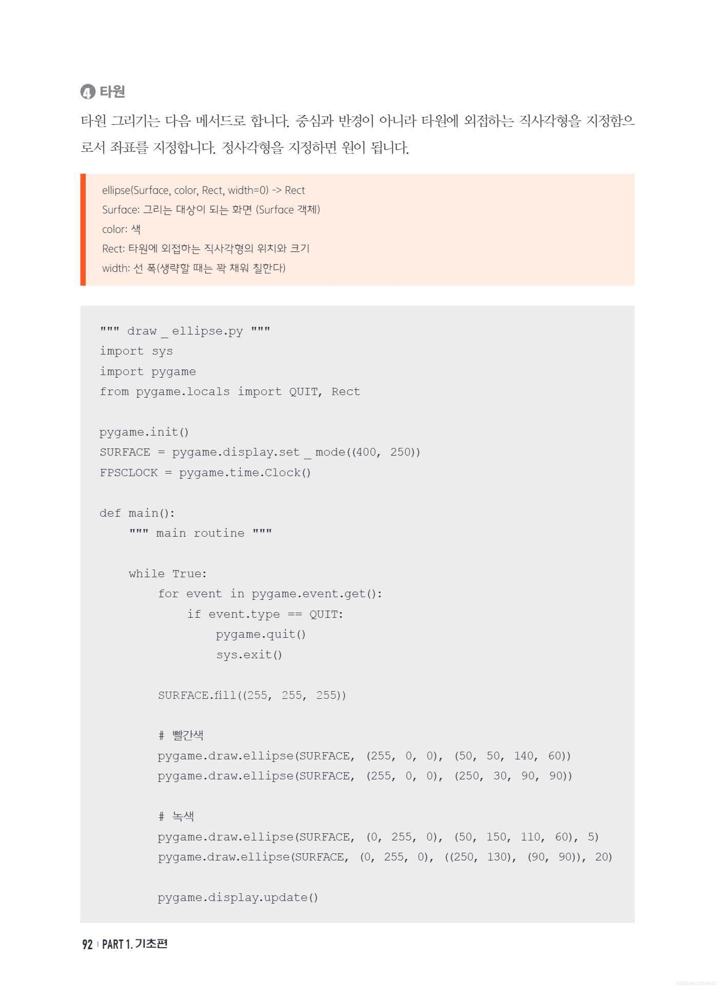

###### 8 Etf:!

###### 타원 그리기는 다음 메서드로 합니다. 중심과 반경이 아니라 티~ 외접하는 직사각형을 지정함으 로서 좌표를 지정합니다. 정사각형을 지정하면 원이 됩니다.

ellipse(Surface, color, Rect, width=Ol -> Rect Surface: 그리는 대상이 되는 화면 (Surface 객제) color: 색 Rect: 타원에 외접아는 직사각명의 위지와 크기 width: 선 폭(생략말 때는 꽉 재워 질만다)

""" draw ellipse.py """ import sys import pygarne from pygame.locals import QUI T, Rect

pygame.init() SURFACE = pygame .display.set mode((400, 250)) FPSCLOCK = pygame.time.Clock()

###### def main() : 111111 main routine 111111

while True: for event in pygame .event.get() :

i f event .type == QUIT: pygame .quit () sys .exit()

SURFACE.fill ((255, 255, 255) )

# 빨간색

###### pygame .draw.ellipse (SURFACE, (255, 0, 0) , (50, 50, 140, 60) ) pygame .draw.ellipse (SURFACE, (255, 0, 0) , (250, 30, 90, 90) )

# 노재-, -,

pygame .draw.ellipse (SURFACE, (0, 255, 0) , (50, 150, 110, 60) , 5) pygame.draw.ellipse(SURFACE, (0, 255, 0), ((250, 130), (90, 90)), 20)

pygame .display.update ()

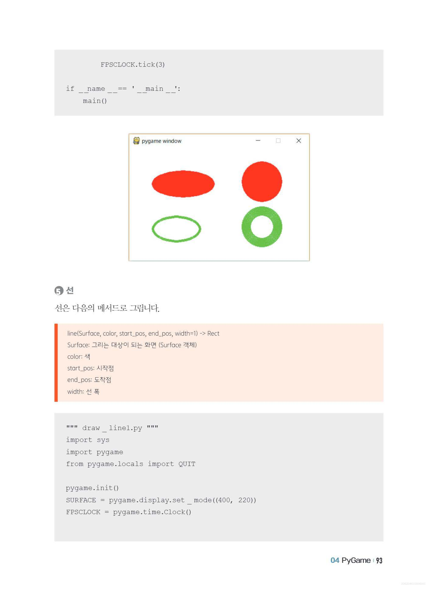

FPSCLOCK.t i ck(3)

’ mai• n ’••

if name main’ ()

fJ pygame window X

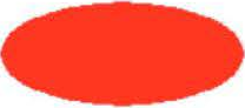

###### 0 선

###### 선은 다음의 메서드로 그립니다.

line(Surface, color, start_pos, end_pos, width=l) -> Rect Surface: 그리는 대상이 되는 화면 (Surface 객제) color: 색 start_pos: 시작점 end_pos: 도작점 width: 선 폭

111111 draw linel.py """ import sys import pygame from pygame.locals import QUIT

pygarne .i nit () SURFACE = pygarne.di splay.set rnode ((400, 220) ) FPSCLOCK = pygarne.time.Clock()

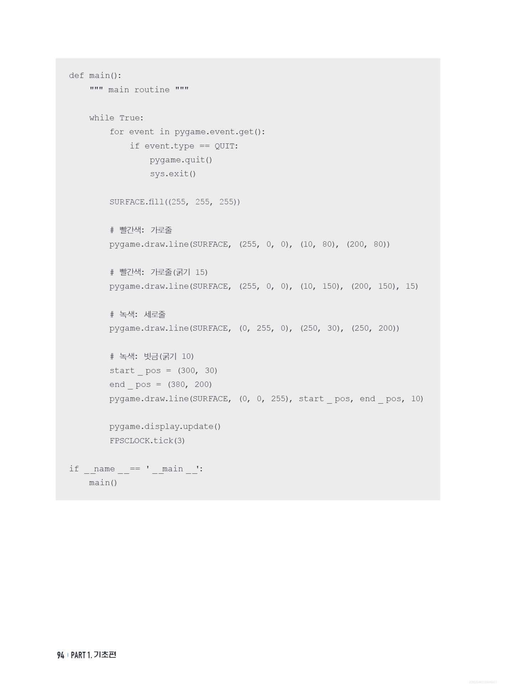

def main() : 111111 main routine 111111

while True: for event in pygame.event.get() :

if event .type == QUIT: pygame .quit () sys.exit()

SURFACE .fill ((255, 255, 255) )

# 빨간색: 가로줄

pygame .draw.line (SURFACE, (255, 0, 0) , (10, 80) , (200, 80) )

# 빨간색: 가로줄(굵기 15) pygame .draw.line (SURFACE, (255, 0, 0) , (10, 150) , (200, 150) , 15)

# 녹색: 세로줄

pygame .draw.line (SURFACE, (0, 255, 0) , (250, 30) , (250, 200) )

# 녹색: 빗금(굵기 10) start pos = (300, 30) end pos = (380, 200) pygame .draw.line (SURFACE, (0, 0, 255) , start pos, end pos, 10)

pygame .display.update O FPSCLOCK.tick (3)

###### ’ •

if name main()•

###### maln

I •

•

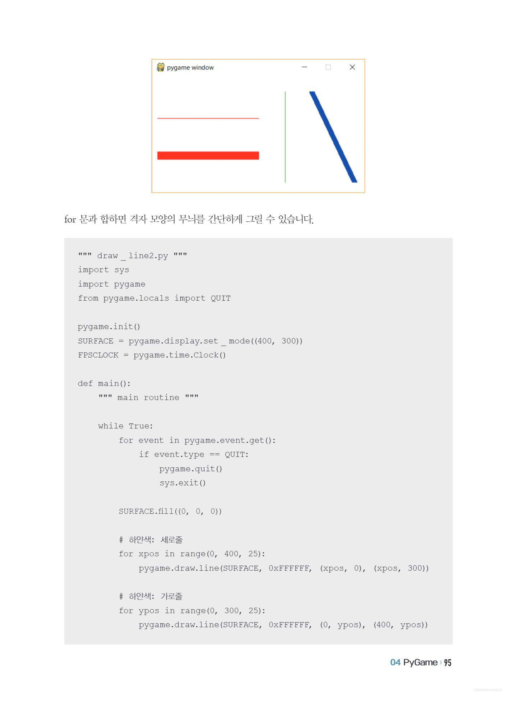

[ X

Q pygame window

for 문과 합하면 격자 모양의 무늬를 간단하게 그릴 수 있습니다.

111111 draw line2.py """ import sys import pygame from pygame .locals import QUIT

pygame .init () SURFACE = pygame .display. set mode ((400, 300) ) FPSCLOCK = pygame.time.Clock()

def main() :

" "" main routine " ""

while True: for event in pygame .event.get() :

if event.type == QUIT: pygame .quit () sys .exit()

SURFACE.fill((0, 0, 0))

# 하얀색: 세로줄

###### for xpos in range (0, 400, 25) : pygarne.draw.line(SURFACE, OxFFFFFF, (xpos, 0), (xpos, 300))

# 하얀색: 가로줄

###### for ypos in range (0, 300, 25) : pygarne .draw.line (SURFACE, OxFFFFFF, (0, ypos) , (400, ypos) )

04 PyGame 195

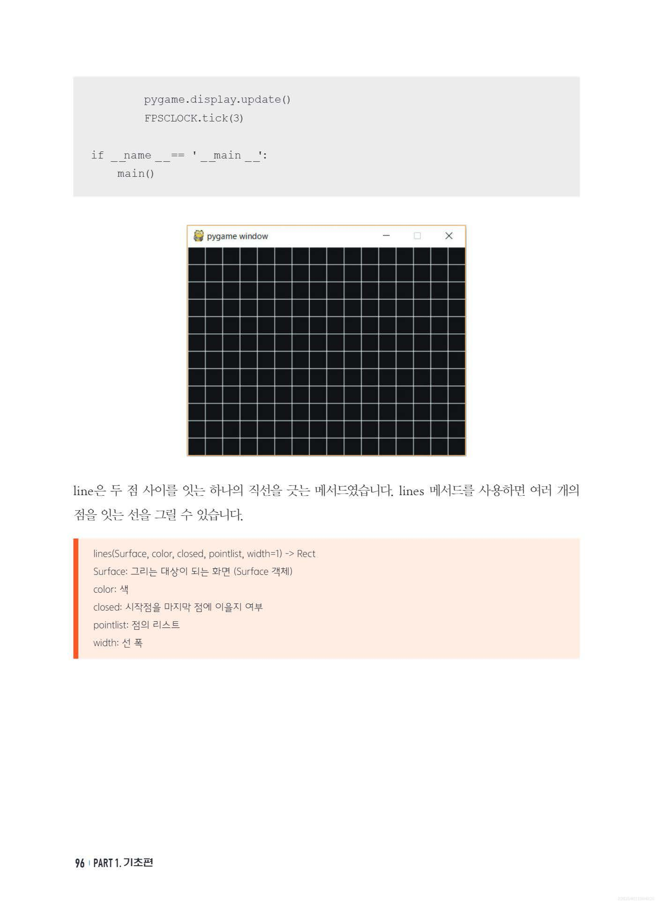

pygarne .display.updat e () FPSCLOCK.tick (3)

###### ’

’ maln• ••

if name mai n()

fapygame window X

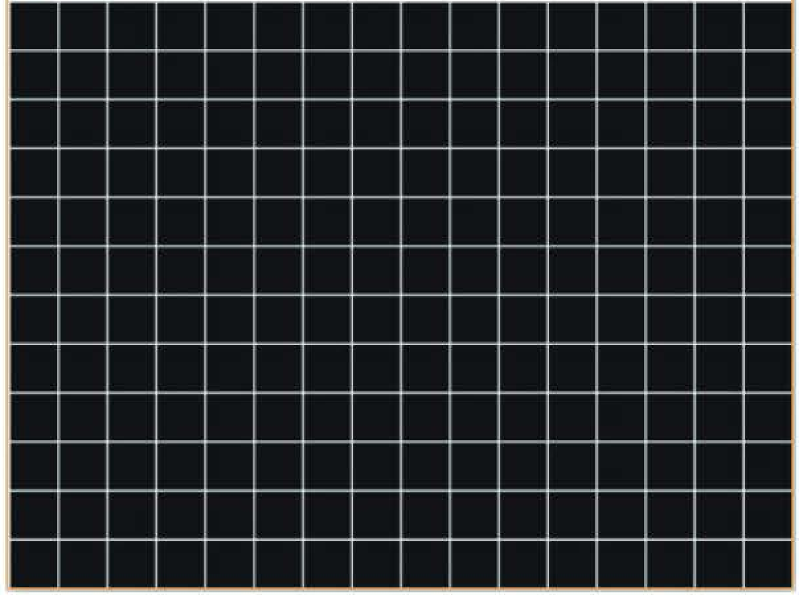

line은 두 점 사이를 잇는 하나의 직선을 긋는 메서드였습니다. lines 메서드를 사용하면 여러 개의

###### 점을 잇는 선을 그릴 수 있습니다.

lines(Surface, color, closed, pointlist, width=l) -> Rect Surface: 그리는 대상이 되는 화면 (Surface 객제) color: 색 closed: 시작점을 마지막 점에 이을지 여부 pointlist: 점의 리스트 width: 선 폭

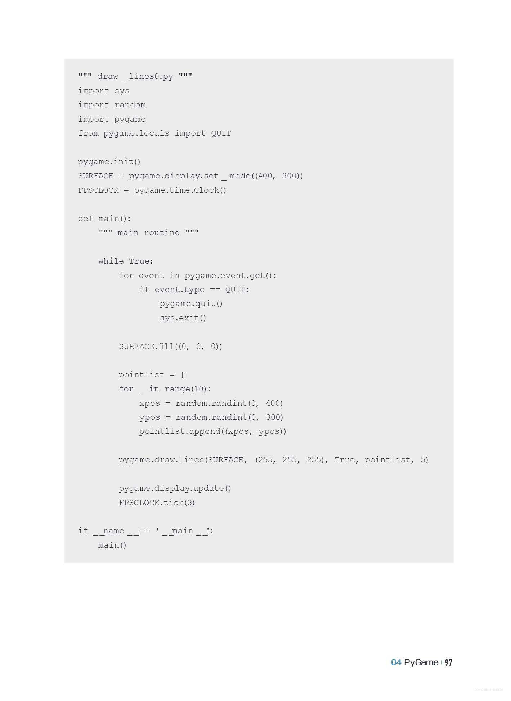

111111 draw linesO.py """ import sys import random import pygame from pygame.locals import QUIT

pygame .i ni t () SURFACE = pygame .d i spl ay. set mode ((400, 300) ) FPSCLOCK = pygame .time.Cl ock()

def main() : """ main routi ne """

while Tr ue: for event i n pygame .event.get() :

if event .type == QUIT: pygame .qui t () sys .exit ()

SURFACE.fil l((0, 0, 0))

poi ntlist = [] for i n range (10) :

xpos = random.r a ndi nt (0, 400) ypos = randorn.randint(O, 300) pointlist. append ((xpos, ypos) )

pygarne .draw.lines (SURFACE, (255, 255, 255) , True, poi ntlist, 5)

pygame .d i spl ay.update () FPSCLOCK.t i ck(3)

I mal• n ’••

if name ma i’ n ()

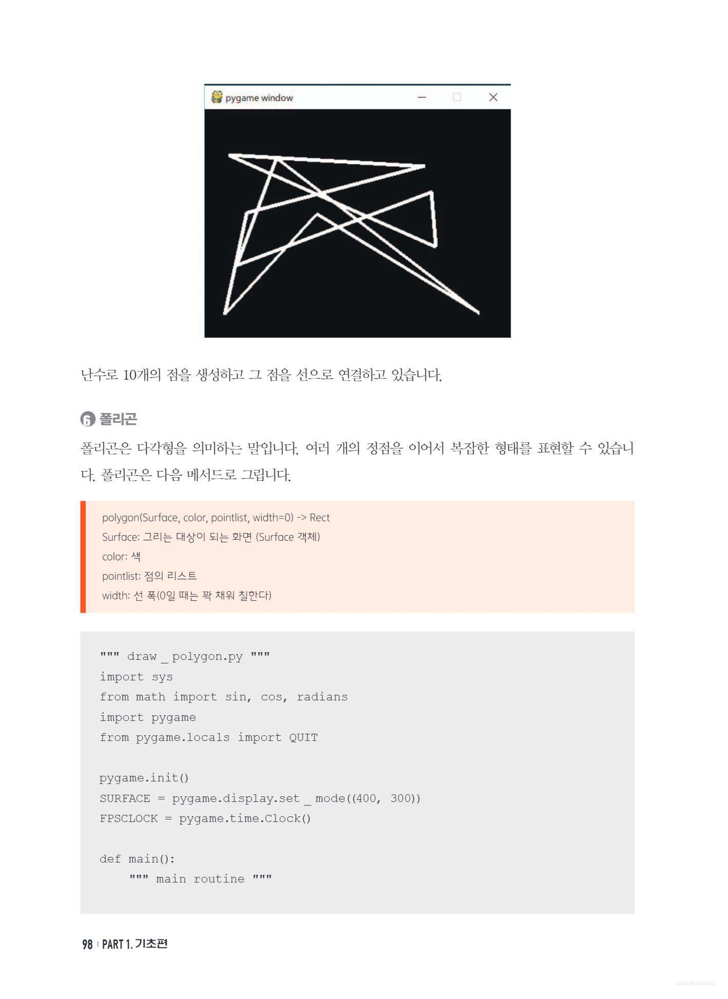

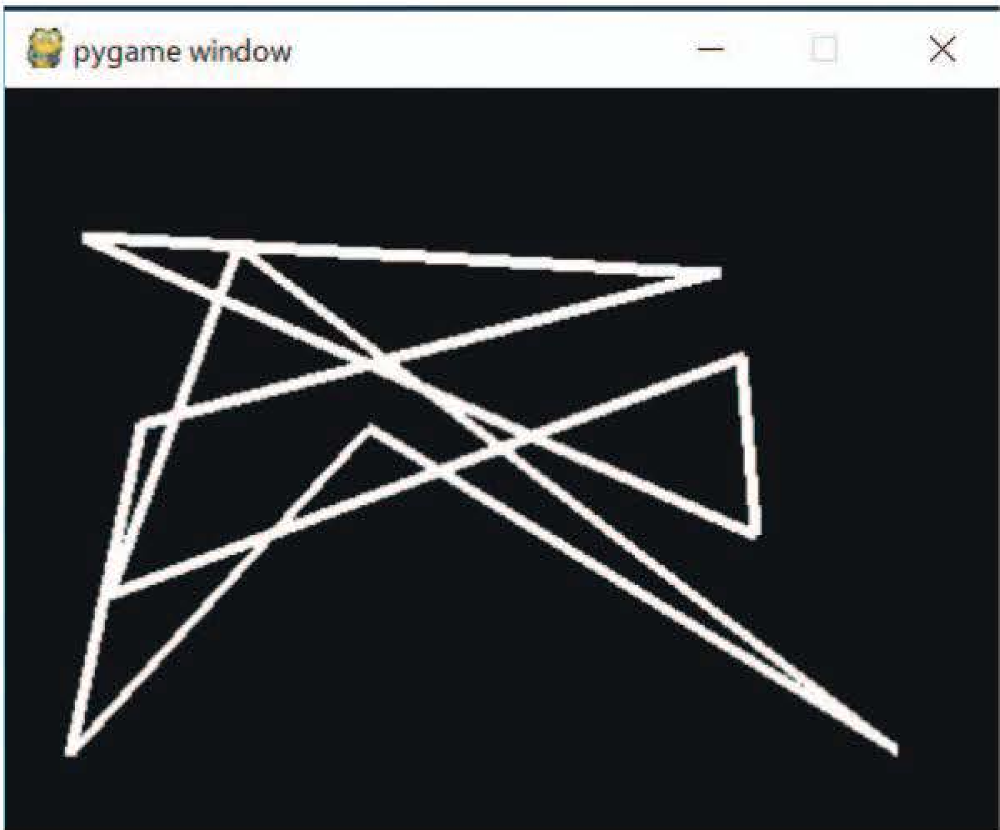

###### Q i X

난수로 10개의 점을 생성하고 그 점을 선으로 연결하고 있습니다.

###### O 폴리곤

폴리곤은 다각형을 의미하는 말입니다. 여러 개의 정점을 이어서 복잡한 형태를 표현할 수 있습니

다. 폴리곤은 다음 메서드로 그립니다.

polygon(Surface, color, pointlist, width=O) ->Rect Surface: 그리는 대상이 되는 화면 (Surface 객제) color: 색 pointlist: 점의 리스트 width: 선 폭(0일 때는 꽉 재워 질만다)

###### ”””

'""' d raw polygon.py import sys from math import import pygame

•

’ cos, radians

Sln

from pygame .local s import QUI T

pygame. init () SURFACE = pygame.displ ay.set mode((400, 300)) FPSCLOCK = pygame.time.Clock()

def main() : 111111 mai n routine 111111

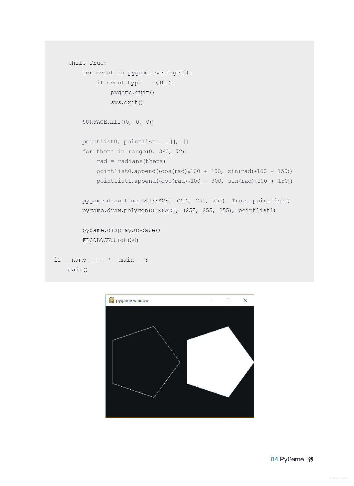

while Tr ue: for event i n pyga rne .event.get() :

if event .type == QUIT: pygarne .qui t () sys .exit ()

SURFACE .fil l((O, 0, 0))

poi ntlistO, pointlistl = [], [] for theta in r ange (0, 360, 72) :

rad = radians (theta)

pointlistO.append((cos (rad) *100 + 100, s i n (rad) *lOO + 150)) pointlistl. append ((cos (rad) *100 + 300, s i n(r ad)*l OO + 150) )

pygarne .draw.lines (SURFACE, (255, 255, 255) , True, poi ntlistO) pygarne .draw.pol ygon (SURFACE, (255, 255, 255) , pointlistl )

pygarne .d i spl ay.updat e () FPSCLOCK.t i ck(30)

###### ’

’ mai• n ••

if name mai’ n()

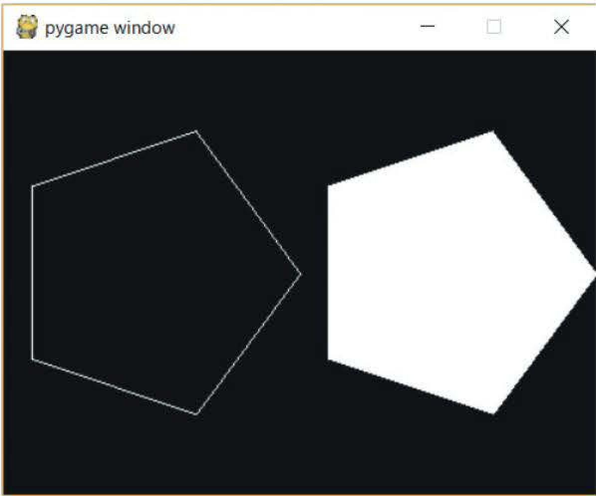

pygame window X

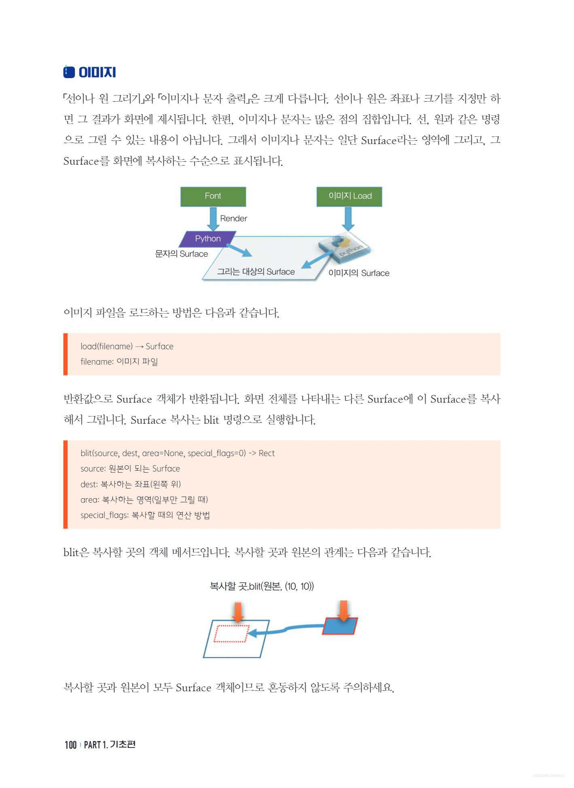

###### ■ 0101~1

「선이나 원 그리기fl-l- 「이미지나 문자 출력哀폰 크게 다릅니다. 선이나 원은 좌표나 크기를 지정만 하

###### 면 그 결과가 화면에 제시됩니다. 한편, 이미지나 문자는 많은 점의 집합입니다. 선, 원과 같은 명령

###### 으로 그릴 수 있는 내용이 아닙니다. 그래서 이미지냐 문자는 일단 Surface라는 영역에 그리고, 그 Surface를 화면에 복사하는 수순으로 표시됩니다.

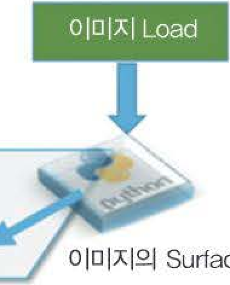

O o n ao

###### •

###### 문자의 Surface

그리는 대상의 Surface 이미지의 Surface

###### 이미지 파일을 로드하는 방법은 다음과 같습니다.

load(filename) 一 Surface filename: 이 미지 파일

반환값으로 Surface 객체가 반환됩니다. 화면 전체를 나타내는 다른 Surface에 이 Surface를 복사

해서 그립니다. Surface 복사는 blit 명령으로 실행합니다.

blit(source, dest, area=None, special_flags=O) -> Rect source: 원본이 되는 Surface dest: 복사아는 좌표(왼쪽 위) area: 복샤아는 영역(일부만 그릴 때) special_flags: 복사말 때의 연산 방법

###### blit은 복사할 곳의 객체 메서드입니다. 복사할 곳과 원본의 관계는 다음과 같습니다.

###### 복사할 곳blit(원본, (10, 10))

ii~~•••••••••••••

•

••

`...•••

•

•

복사할 곳과 원본이 모두 Surface 객체이므로 혼동하지 않도록 주의하세요.

###### 100 1PART 1, 기조곤

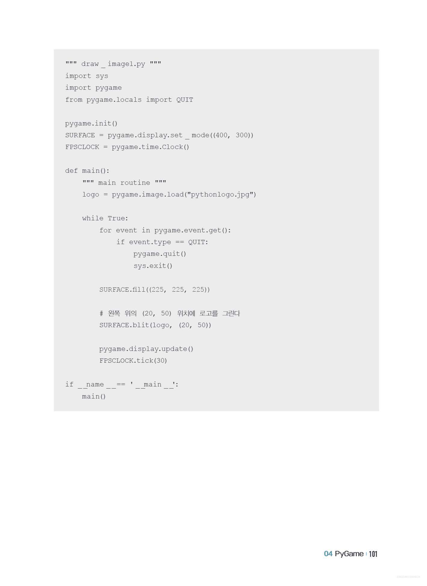

111111 draw imagel.py ””” import sys import pygame from pygame.locals import QUIT

pygame .i ni t () SURFACE = pygame .d i spl ay. set mode ((400, 300) ) FPSCLOCK = pygame .time.Cl ock()

def main() : """ main routi ne """ l ogo = pygame.i mage.load("pyt honl ogo.j pg")

while Tr ue: for event i n pygame .event.get() :

if event .type == QUIT: pygame .qui t () sys .exit ()

###### SURFACE.fil l((225, 225, 225))

# 왼쪽 위의 (20, 50) 위치에 로고를 그린다 SURFACE.blit (l ogo, (20, 50))

pygarne .d i spl ay.update () FPSCLOCK.t i ck(30)

’ mal• n ’••

if name ma i’ n()

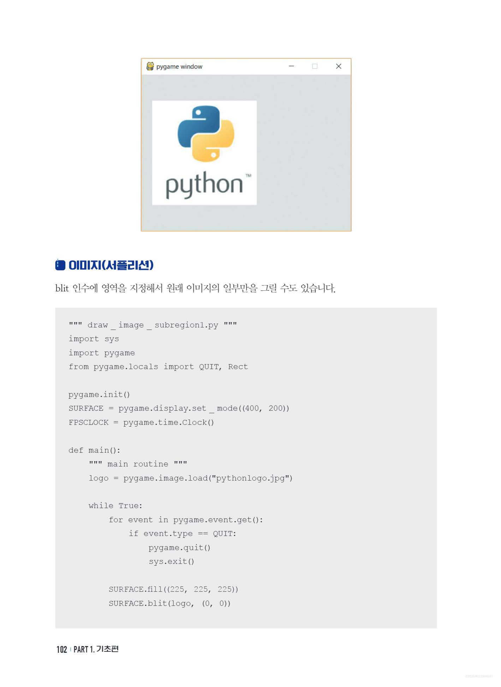

f) pygame window

X

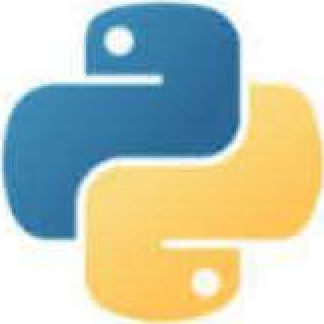

###### aOIDIXI(서플리신)

###### blit 인수에 영역을 지정해서 원래 이미지의 일부만을 그럴 수도 있습니다.

draw image subregionl.py

II II II

II II II

i mport sys i mport pygame from pygame .locals import QUI T, Rect

pygarne .init () SURFACE = pygarne.d i spl ay.set mode((400, 200)) FPSCLOCK = pygarne.time.Clock()

def main() : 111111 main routine 1111 11 logo = pygame. image.load("pythonlogo.jpg")

while True: f or event in pygame.event.get() :

i f event .type == QUIT: pygame .quit () sys.exit()

SURFACE .fill ((225, 225, 225) ) SURFACE.blit (logo, (0, 0))

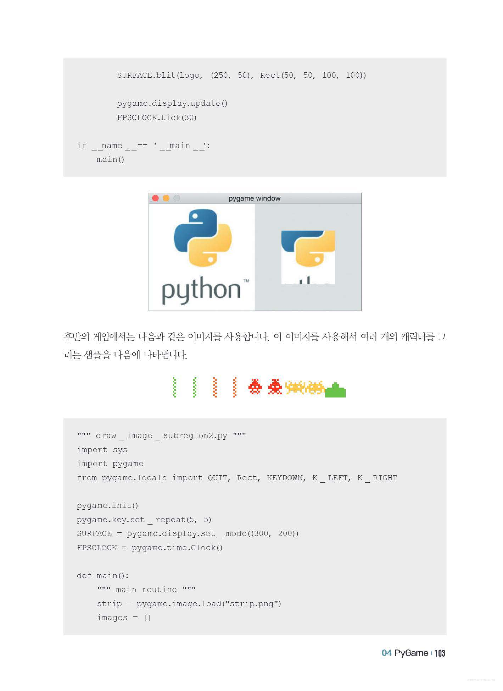

SURFACE.blit (l ogo, (250, 50) , Rect (50, 50, 100, 100) )

pygarne .d i spl ay.updat e () FPSCLOCK.t i ck(30)

I mal• n ’••

if name mai’ n ()

• pygame window

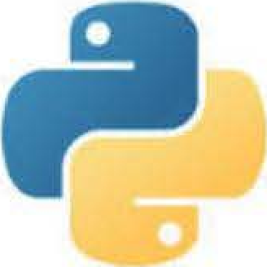

'’

후반의 게임에서는 다음과 같은 이미지를 사용합니다. 이 이미지를 사용해서 여러 개의 캐릭터를 그 리는 샘플을 다음에 나타냅니다.

..;........&~全

..

\.......

....

f

•• f`

•• 8f/

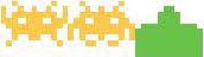

.

••

f

111111 draw

im• age subregion2 .py 1111 11

import sys import pygame from pygame.locals import QUIT, Rect, KEYDOWN, K LEFT, K RIGHT

pygarne . i ni t () pygarne .key.set r epeat (5, 5) SURFACE = pygarne .di spl ay.set mode ((300, 200) ) FPSCLOCK = pygarne .time.Cl ock()

def main() : """ ma i n routi ne '""' stri p = pygame .image.load("strip.png") images = []

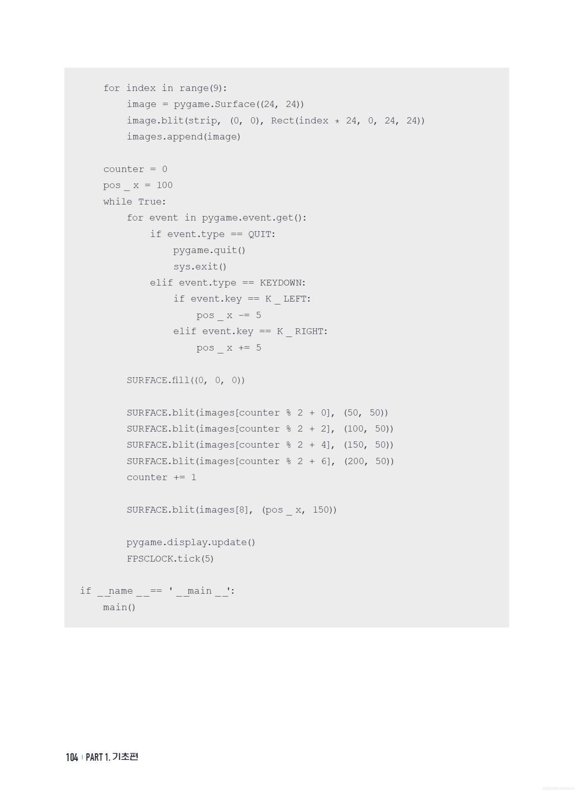

for index i n range (9) : image = pygarne.Surface((24, 24))

irnage.blit(strip, (0, 0) , Rect(index * 24, 0, 24, 24))

images .append(image)

counter = 0 pos x = 100 while True:

f or event in pygame.event.get() :

if event .type == QUIT: pygame .quit () sys.exit()

elif event .type == KEYDOWN: i f event. key == K LEFT: pos x -= 5 elif event . key == K RIGHT: pos x += 5

###### SURFACE.fill((0, 0, 0))

SURFACE.blit(images [counter % 2 + OJ, (50, 50) ) SURFACE.blit (images [counter % 2 + 2] , (100, 50) ) SURFACE.blit (images [counter % 2 + 4], (150, 50) ) SURFACE.blit (images [counter % 2 + 6], (200, 50) ) counter += 1

SURFACE.blit (irnages [8], (pos x, 150))

pygame .display.update O FPSCLOCK.tick (5)

I main•

if name rnaln(• )

I •

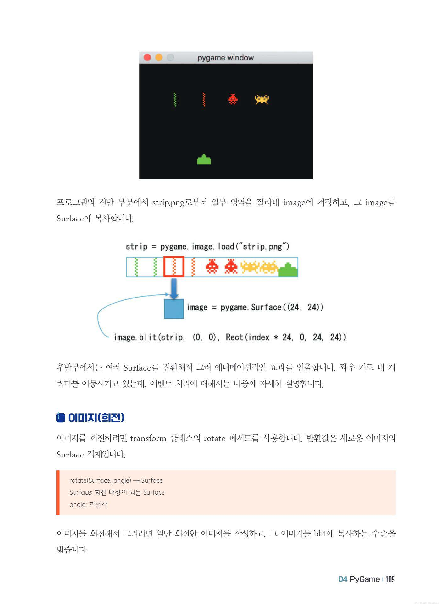

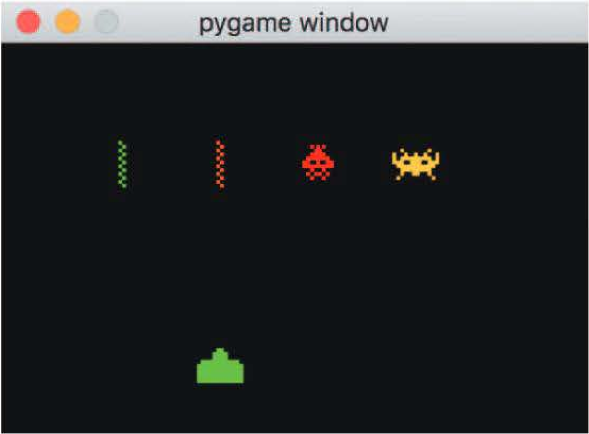

###### pygame window

프로그램의 전반 부분에서 strip.png로부터 일부 영역을 잘라내 image에 저장하고, 그 image를 Surface에 복사합니다.

.....••• b.\....\ w

strip = pygame. i업..mage.&Ioad全("strip.png")

-.....`

image = pygame. Surface ((24, 24))

image. bI it (str ip, (0, 0) , Rect (index * 24, 0, 24, 24))

후반부에서는 여러 Surface를 전환해서 그려 애니메이션적인 효과를 연출합니다. 좌우 키로 내 캐 릭터를 이동시키고 있는데, 이벤트 처리에 대해서는 나중에 자세히 설명합니다.

###### ■ OIDIXI(회전)

이미지를 희전하려면 transform 클래스의 rotate 메서드를 사용합니다. 반환값은 새로운 이미지의 Surface 객체입니다.

###### rotate(Surface, angle) 一 Surface Surface: 외전 대상이 되는 Surface angle: 외전각

이미지를 회전해서 그리려면 일단 회전한 이미지를 작성하고, 그 이미지를 blit에 복사하는 수순을

밟습니다.

###### 04 PyGame 1105

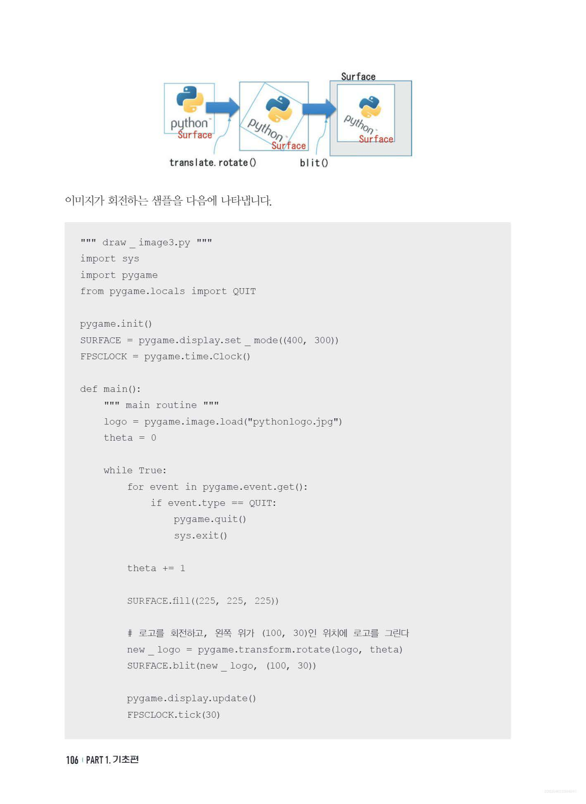

,.,

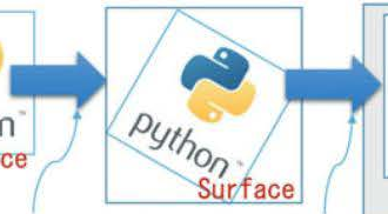

른. 鼻

p9tIJ

p盆n

OF}

ce

trans Iate. rotate ()

###### bl it0

이미지가 회전하는 샘플을 다음에 나타냅니다.

""" draw irnage3.py import sys import pygarne

###### ”““

from pygame.locals import QUI T

pygame .init ()

SURFACE = pygame.d i spl ay. set mode ((400, 300) ) FPSCLOCK = pygame.time.Clock()

def main() : 111111 mai n routine 111111 logo = pygame. image.load("pythonl ogo.jpg") theta = 0

while True: for event in pygame .event.get() :

if event .type == QUIT: pygame .quit () sys .exi t()

theta += 1

SURFACE .fill((225, 225, 225))

# 로고를 회전하고, 왼쪽 워가 (100, 30)인 워치에 로고를 그린다 new logo = pygame.transform.rotate(logo, theta) SURFACE.blit (new logo, (100, 30) )

pygame .display.update () FPSCLOCK.tick (30)

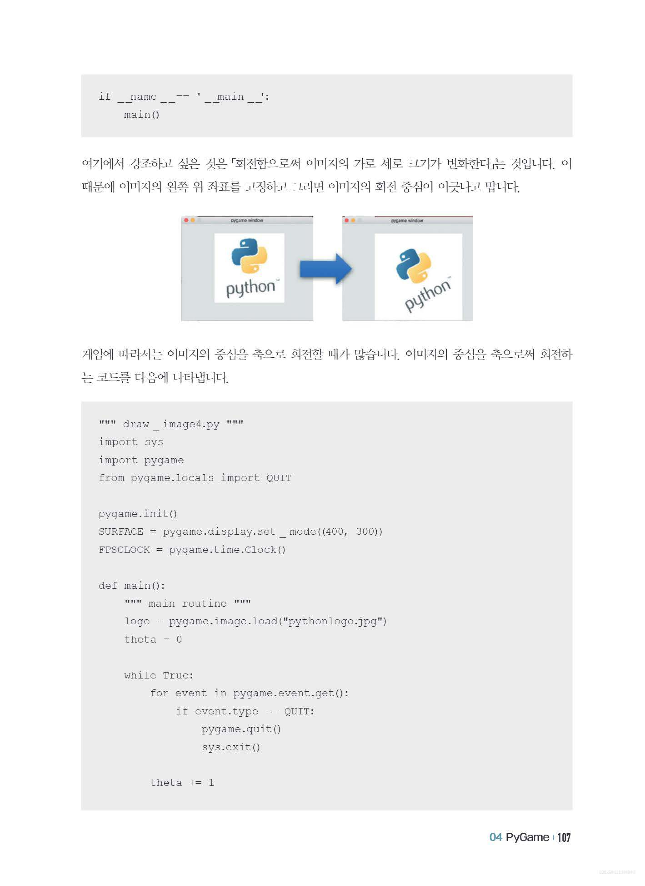

I maln• ’••

if name main()’

여기에서 강조하고 싶은 것은 「희전함으로써 이미지의 가로 세로 크기가 변화한다」는 것입니다. 이 때문에 이미지의 왼쪽 위 좌표를 고정하고 그리면 이미지의 회전 중심이 어긋냐고 맙니다.

~. 00

• "리

른

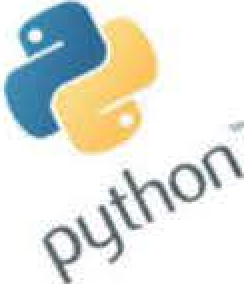

p니thon

게임에 따라서는 이미지의 중심을 축으로 회전할 때가 많습니다. 이미지의 중심을 축으로써 회전하 는 코드를 다음에 나타냅니다.

111111 draw image4.py """ import sys import pygame from pygame.locals import QUIT

pygame .init () SURFACE = pygame .display. set rnode ((400, 300) ) FPSCLOCK = pygame.tirne.Clock()

def main() : """ main routine """ l ogo = pygame.i mage.load("pythonlogo.j pg") theta = 0

while Tr ue: for event in pygarne .event.get() :

if event.type == QUIT: pygarne .quit () sys .exit()

theta += 1

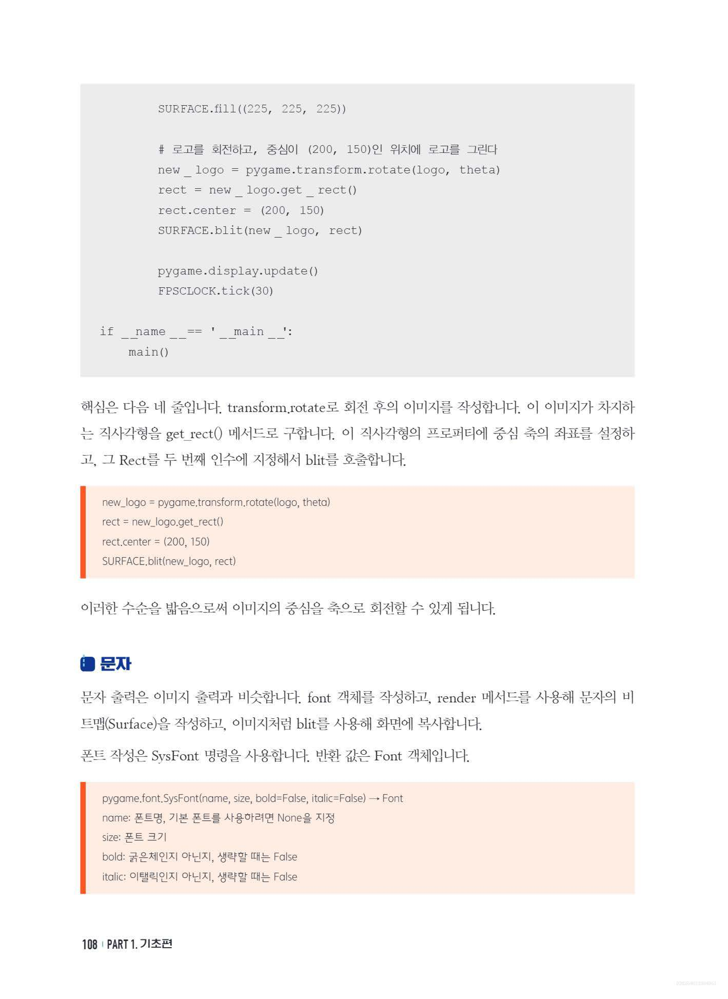

SURFACE .fill((225, 225, 225))

# 로고를 회전하고, 종심이 (200, 150)인 위치에 로고를 그린다 new logo = pygame.transform.rotate(logo, theta) rect = new logo.get rect() rect .center = (200, 150) SURFACE. blit (new logo, rect)

pygame .display.update () FPSCLOCK.tick (30)

’ main• ’..

if name main()•

핵심은 다음 네 줄입니다. transform.rotate로 회전 후의 이미지를 작성합니다. 이 이미지가 차지하

###### 는 직사각형을 get_rectO 메서드로 구합니다. 이 직사각형의 프로퍼티에 중심 축의 좌표를 설정하

###### 고, 그 Rect를 두 번째 인수에 지정해서 blit를 호출합니다.

new_logo = pygame.transform.rotate(logo, theta) rect = new_logo.get_rect() rect.center = (200, 150) SURFACE. blit(new_logo, rect)

이러한 수순을 밟음으로써 이미지의 중심을 축으로 회전할 수 있게 됩니다.

###### ·문자

문자 출력은 이미지 출력과 비슷합니다. font 객체를 작성하고, render 메서드를 사용해 문자의 비

###### 트맵(Surface)을 직성하고, 이미지처럼 blit를 시용해 화면에 복사합니다.

###### 폰트 작성은 SysFont 명령을 사용합니다. 반환 값은 Font 객체입니다.

pygame.font.SysFont(name, size, bold=False, italic=False) 一 Font name: 폰트명, 기본 폰트를 사용아려면 None을 지정 size: 폰트 크기 bold: 굵은제인지 아닌지 , 생략말 때는 False italic: 이탤릭인지 아닌지, 생략말 때는 False

###### 108 1PART1, 기조핀

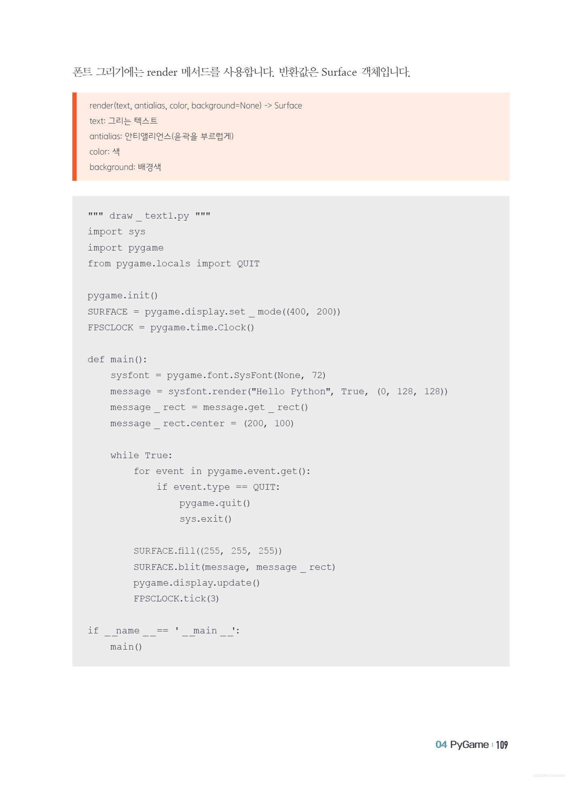

폰트 그리기에는 render 메서드를 사용합니다. 반환값은 Surface 객체입니다.

render(text, antialias, color, background=None) -> Surface text: 그리는 텍스트 antialios: 안티앨리언스(윤곽을 부르럽게) color: 색 background:

111111 draw textl.py """ i mport sys i mport pygame from pygame.locals import QUIT

pygarne .i ni t () SURFACE = pygarne .d i spl ay. set mode ((400, 200) ) FPSCLOCK = pygarne .tirne.Cl ock()

def main() : sysfont = pygarne .font. SysFont(None, 72) message = sysf ont .render ("Hello Python", True, (0, 128, 128)) message rect = message.get r ect() message rect.center = (200, 100)

while Tr ue: for event i n pygame .event.get () :

if event.type == QUIT: pygame .qui t () sys .exit()

SURFACE .fil l((255, 255, 255)) SURFACE.blit(rnessage, message rect) pygarne .di spl ay.update () FPSCLOCK.t i ck(3)

’ mal• n

if name

I •

•

ma i n()

‘

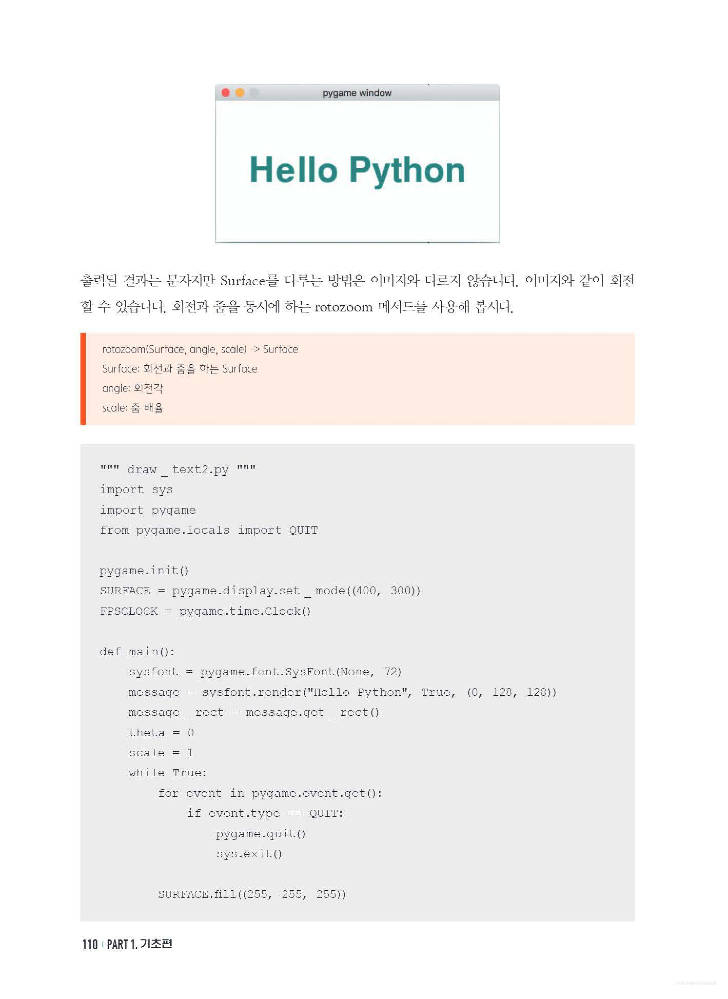

•

pygame window

## Hello Python

출력된 결과는 문자지만 Surface를 다루는 방법은 이미지와 다르지 않습니다. 이미지와 같이 회전 할 수 있습니다. 회전과 줌울 동시에 하는 rotozoom 메서드를 사용해 봅시다.

rotozoom(Surface, angle, scale) -> Surface Surface: 회 전과 줌을 아는 Surface angle: 회전각 scale: 줌 배

""" draw text2 .py

II II

import sys import pygarne from pygame.local s import QUI T

pygame .init () SURFACE = pygame.displ ay.set mode ((400, 300)) FPSCLOCK = pygame.t ime .Clock()

def main() : sysfont = pygarne.font. SysFont(None, 72) message = sysfont.render("Hello Python", True, (0, 128, 128)) message rect = message .get rect ()

theta = 0 scale = 1 while True:

f or event in pygarne.event.get() :

if event.type == QUIT: pygame .quit () sys.exit()

SURFACE.fill((255, 255, 255))

###### 110 1PART 1, 기조핀

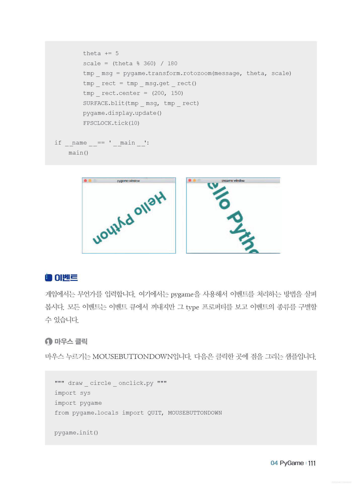

theta += 5 scale = (theta % 360) / 180 trnp rnsg = pygarne.transforrn.rotozoorn(rnessage, theta, scale) trnp rect = trnp rnsg.get rect() trnp _ rect.center = (200, 150) SURFACE.blit(trnp _ rnsg, trnp rect) pygarne.display.update () FPSCLOCK.t i ck(10)

I main• ’••

if name main’ ()

*.· wg;',.,n

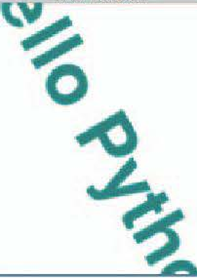

·이벤트

게임에서는 무언가를 입력합니다. 여기에서는 pygame을 사용해서 이벤트를 처리하는 방법을 살펴 봅시다. 모든 이벤트는 이벤트 큐에서 꺼내지만 그 type 프로퍼티를 보고 이벤트의 종류를 구별할

수있습니다.

###### 0 마우스클릭

마우스 누르기는 MOUSEBUTTONDOWN입니다. 다음은 클릭한 곳에 점을 그리는 샘플입니다.

1111 11 draw circle import sys import pygame from pygame.locals import QUIT, MOUSEBUTTONDOWN

onclick.py

II II II

pygame .i nit ()

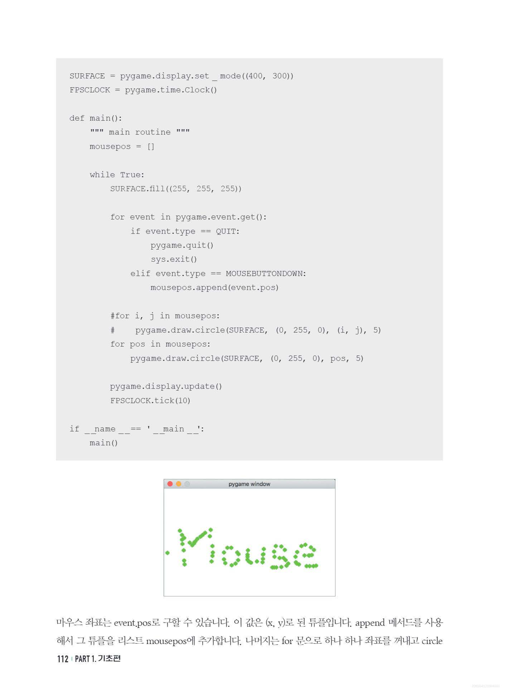

SURFACE = pygame .display.set mode((400, 300)) FPSCLOCK = pygame.time.Clock()

def main() : 111111 main routine 111111 rnousepos = []

while True: SURFACE .fill((255, 255, 255))

for event in pygarne .event.get():

i f event .type == QUIT: pygarne .quit() sys .exit()

elif event.type == MOUSEBUTTONDOWN:

rnousepos .append(event .pos)

#for i, J• in• mousepos : # pygarne .draw.circle(SURFACE, (0, 255, 0), (i, j), 5) for pos in mousepos :

pygame .draw.circle (SURFACE, (0, 255, 0) , pos, 5)

pygame .display.update () FPSCLOCK.tick (10)

main ’..

’ •

if name

main()

’

•r pygame window

.,✓

••• s·

.. s ;....:l.i_.‘`죠::....

•

마우스 좌표는 event.pos로 구할 수 있습니다. 이 값은 (x, y)로 된 튜플입니다. append 메서드를 사용 해서 그 튜플을 리스트 mousepos에 추가합니다. 냐머지는 for 문으로 하나 하나 좌표를 꺼내고 circle

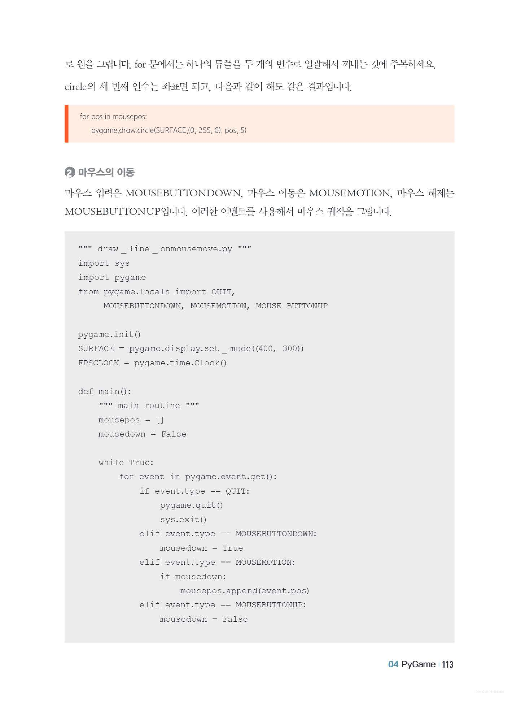

로 원을 그립니다. for 문예서는 하나의 튜플을 두 개의 변수로 일괄해서 꺼내는 것에 주목하세요.

circle의 세 번째 인수는 좌표면 되고, 다음과 같이 해도 같은 결과입니다.

for pos in mousepos: pygame.draw.circle(SURFACE,(O, 255, 0), pos, 5)

Q 마우스의이둥

###### 마우스 입력은 MOUSEBUTTONDOWN, 마우스 이동은 MOUSEMOTION, 마우스 해제는

MOUSEBUTTONUP입니다. 이러한 이벤트를 사용해서 마우스 궤적을 그립니다.

draw line onrnousernove.py ””” import sys import pygame from pygame.locals import QUIT,

II II II

MOUSEBUTTONDOWN, MOUSEMOTION, MOUSE BUTTONUP

pygame .init () SURFACE = pygame .d i splay. set mode ((400, 300) ) FPSCLOCK = pygame. time.Clock()

def main() : " "" mai n routine " "" rnousepos = [ ] rnousedown = False

while True: for event in pygame .event .get() :

i f event.type == QUIT : pygame .qui t () sys .exit()

elif event.type == MOUSEBUTTONDOWN:

mousedown = True

elif event.type == MOUSEMOTI ON: if mousedown:

mousepos . append(event .pos) elif event.type == MOUSEBUTTONUP:

mousedown = False

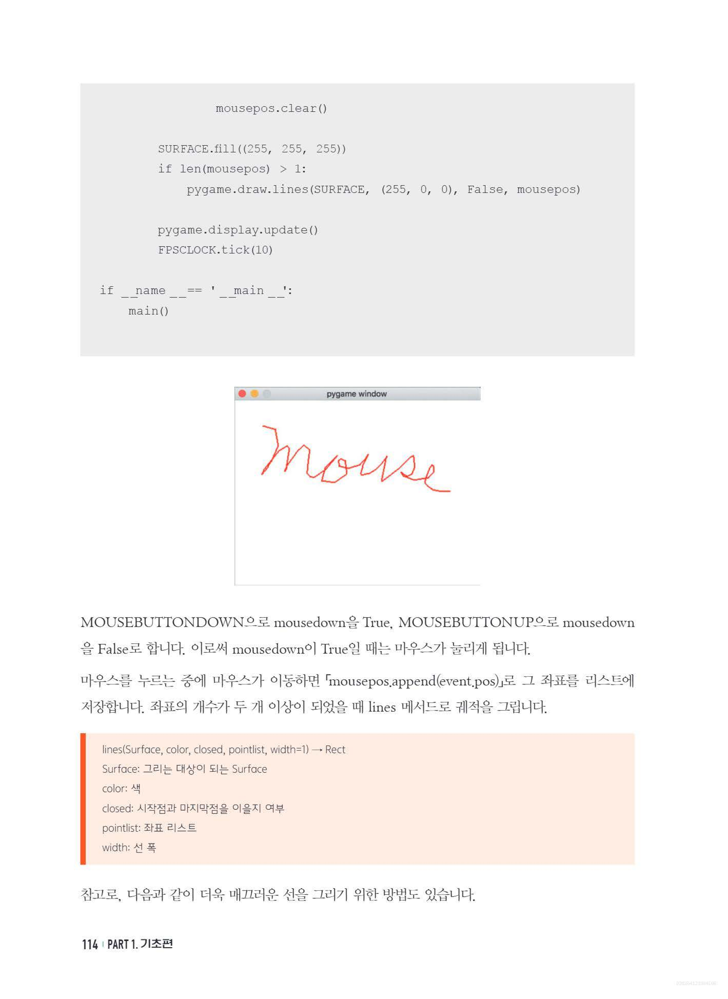

rnousepos .clear ()

SURFACE.fill((255, 255, 255)) if len(mousepos) > 1:

pygame .draw.lines (SURFACE, (255, 0, 0) , False, mousepos)

pygame .display.update () FPSCLOCK.tick (10)

main ’..

’ •

if name

•

main()

• pygame window

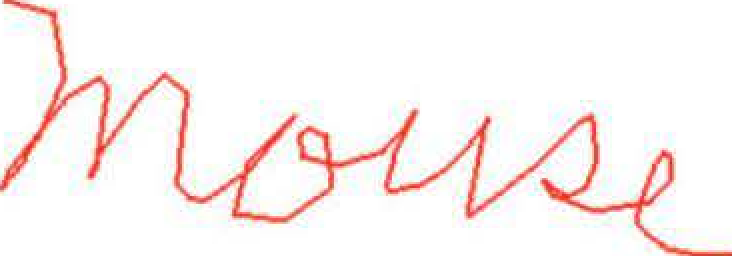

MOUSEBUTTONDOWN으로 mousedown을 True, MOUSEBUTTONUP으로 mousedown

을 False로 합니다. 이로써 mousedown이 True일 때는 마우스가 눌리게 됩니다.

###### 마우스를 누르는 중에 마우스가 이동하면 rmousepos.append(event.pos)J로 그 좌표를 리스트에

저장합니다. 좌표의 개수가 두 개 이상이 되었을 때 lines 메서드로 궤적을 그립니다.

lines(Surface, color, closed, pointlist, width=l) ---+ Rect Surface: 그리는 대상이 되는 Surface color: 색 closed: 시작점과 마지막점을 이을지 여부 pointlist: 좌표 리스트 width: 선 폭

참고로, 다음과 같이 더욱 매끄러운 선을 그리기 위한 방법도 있습니다.

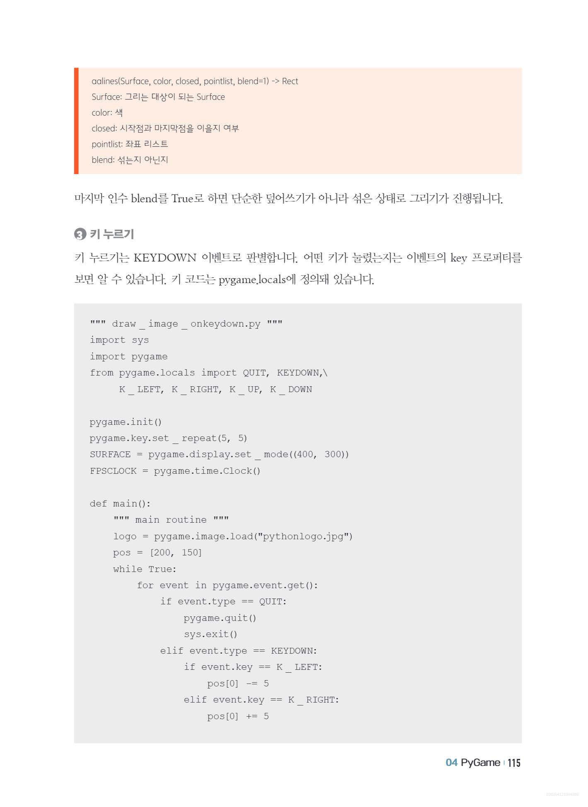

aalines(Surface, color, closed, pointlist, blend=l) -> Rect Surface: 그리는 대상이 되는 Surface color: 색 closed: 시작점과 마지막점을 이을지 여부 pointlist: 좌표 리스트 blend: 섞는지 아닌지

마지막 인수 blend를 True로 하면 단순한 덮어쓰기가 아니라 섞은 상태로 그리기가 진행됩니다.

###### O 키누르기

키 누르기는 KEYDOWN 이벤트로 판별합니다. 어떤 키가 눌렸는지는 이벤트의 key 프로퍼티를

보면 알 수 있습니다. 키 코드는 pygame.locals에 정의돼 였습니다.

””” draw image onkeydown.py ””” import sys import pygame from pygame.locals import QUIT, KEYDOWN,\

###### K LEFT, K RIGHT, K UP, K DOWN

pygame .i ni t () pygame .key. set repeat (5, 5) SURFACE = pygame .d i spl ay. set mode ((400, 300) ) FPSCLOCK = pygame .time.Cl ock()

def main() : """ main routi ne """ logo = pygame.i mage .load("pythonl ogo.jpg") pos = (200, 150] while Tr ue:

for event i n pygame .event.get () :

if event.type == QUIT: pygame .quit () sys .exit()

elif event.type == KEYDOWN: if event . key == K LEFT: pos [0] -= 5 elif event. key == K RIGHT: pos [0] += 5

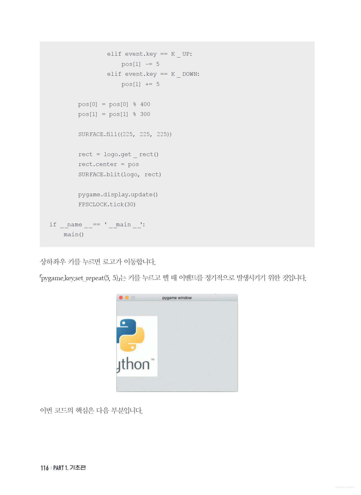

elif event.key == K UP: pos[l] -= 5 elif event.key == K DOWN: pos[l] += 5

pos[0] = pos[0] % 400 pos[l] = pos[l] % 300

SURFACE .fill((225, 225, 225))

rect = logo.get rect() rect.center = pos SURFACE.bli t(logo, rect)

pygame .display.update () FPSCLOCK.tick (30)

’ maln• '.

if

name main()

•

상하좌우 키를 누르면 로고가 이동합니다.

###### 「pygame.key.set_repeat(5, 5)走 키를 누르고 뗄 때 이벤트를 정기적으로 발생시키기 위한 것입니다.

• pygame window

thon'M

이번 코드의 핵심은 다음 부분입니다.

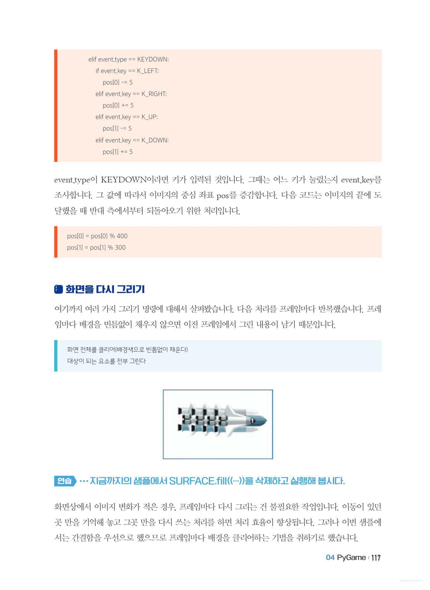

elif event.type == KEYOOWN: if event.key == K_LEFT:

###### pos[O] -= 5

elif event.key == K_RIGHT:

###### pos[O] += 5

elif event.key == K_UP:

###### pos[l] -= 5

elif event.key == K_OOWN:

pos[l] += 5

event.type이 KEYDOWN이라면 키가 입력된 것입니다. 그때는 어느 키가 눌렀는지 event.key를 조사합니다. 그 값에 따라서 이미지의 중심 좌표 pos를 증갑합니다. 다음 코드는 이미지의 끝에 도 달했을 때 반대 측에서부터 되돌아오기 위한 처리입니다.

pos[O] = pos[O] % 400 pos[l] = pos[l] % 300

###### • 화면를 EUI 그리JI

###### 여기까지 여러 가지 그리기 명령에 내해서 살펴봤습니다. 다음 처리를 프레임마다 반복했습니다. 프레 임마다 배경을 빈틈없이 재우지 않으면 이전 프레임에서 그린 내용이 남기 때문입니다.

화면 전제를 클리어(배경색으로 빈틈없이 재운다) 대상이 되는 요소를 전부 그린다

# , ..

###### …XI글까지으1 샘플메서SURFACE.fill(（…））을삭제하고실햄해봅시다

화면상에서 이미지 변화가 적은 경우 프레임마다 다시 그리는 건 불필요한 작업입니다. 이동이 있던 곳 만을 기억해 놓고 그곳 만을 다시 쓰는 처리를 하면 처리 효율이 향상됩니다. 그러나 이번 샘플에 서는 간결함을 우선으로 했으므로 프레임마다 배경을 클리어하는 기법을 취하기로 했습니다.

###### 04 PyGame 1117

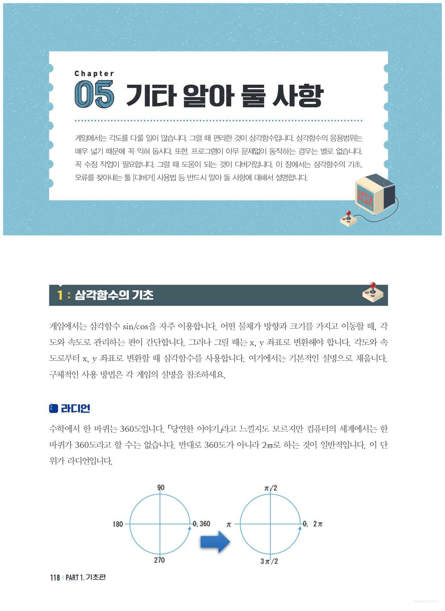

Chapte 『

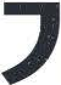

••••••••••••••••••••••••••••••••••••••••••••••••••••••••••••••••••••••••••••••••••••••••

###### 게임에서는 각도를 다룰 일이 많습니다. 그럴 때 편리한 것이 삼각함수입니다 삼각함수의 응용범위는

매우 넓기 때문에 꼭 익혀 둡시다. 또한 프로그램이 아무 문제없이 동작하는 경우는 별로 없습니다.

꼭 수정 작업이 필요합니다. 그럴 때 도움이 되는 것이 디버거입니다. 이 장에서는 삼각함수의 기초, 오류를 찾아내는 툴 [디버거] 사용법 등 반드시 알아 둘 사항에 대해서 설명합니다.

###### 오

게임에서는 삼각함수 sin/cos을 자주 이용합니다. 어떤 물체가 방향과 크기를 가지고 이동할 때, 각 도와 속도로 관리하는 편이 간단합니다. 그러나 그릴 때는 X, y 좌표로 변환해야 합니다. 각도와 속 도로부터 x, y 좌표로 변환할 때 삼각함수를 사용합니다. 여기에서는 기본적인 설명으로 재웁니다. 구체적인 사용 방법은 각 게임의 설명을 찹조하세요.

###### • 근'E1인

###### 수학에서 한 바퀴는 360도입니다. 「당연한 이야기」라고 느낄지도 모르지만 컴퓨터의 세계에서는 한 바퀴가 360도라고 할 수는 없습니다. 반대로 360도가 아니라 2m로 하는 것이 일반적입니다. 이 단 위가라디언입니다.

。

TCt/2

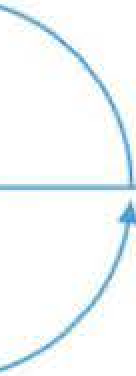

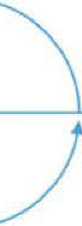

###### 180 'e360 TC . 27r

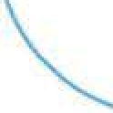

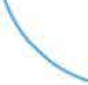

210 31C1/ 2

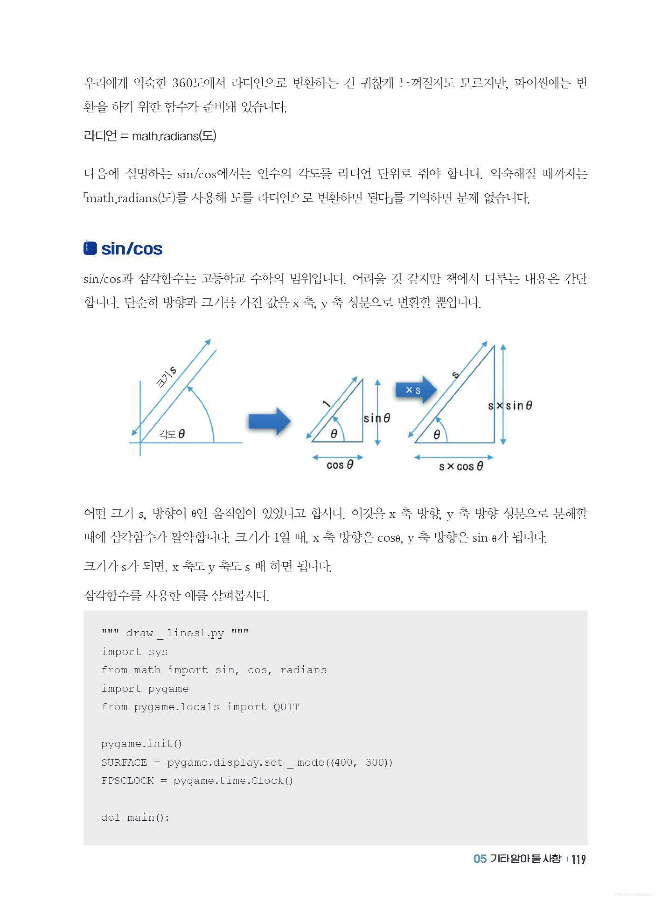

우리에게 익숙한 360도에서 라디언으로 변환하는 건 귀찮게 느껴질지도 모르지만, 파이썬에는 변 환을 하기 위한 함수가 준비돼 있습니다. 라디언 = math.radians(도)

다음에 설명하는 sin/cos에서는 인수의 각도를 라디언 단위로 줘야 합니다. 익숙해질 때까지는 「math.radians(도)를 사용해 도를 라디언으로 변환하면 된다」를 기억하면 문제 없습니다.

###### II sin/cos

sin/cos과 삼각함수는 고등학교 수학의 범위입니다. 어려울 것 같지만 책에서 다루는 내용은 간단

합니다. 단순히 방향과 크기를 가진 값을 x 축, y 축 성분으로 변환할 뿐입니다.

~

^

SI저sine

si~0

w ••

각도 8

###### 빼' »

솔 ~

cos 0

###### SX COS0

어떤 크기 s, 방향이 0인 움직임이 있었다고 합시다. 이것을 x 축 방향, y 축 방향 성분으로 분해할 때에 삼각함수가 활익힙니다. 크기가 1일 때, x 축 방향은 cose, y 축 방향은 sin e가 됩니다. 크기가 s가되면, x 축도 y 축도 s 배 하면 됩니다. 삼각함수를 사용한 예를 살펴봅시다.

111111 draw linesl.py 111111 import sys from math import sin, import pygame

cos, radians

from pygame.locals import QUIT

pygame .init () SURFACE = pygarne.display.set _ mode ((400, FPSCLOCK = pygame.tirne.Clock()

300) )

###### def main() :

05 기타알아둘사랑 I 119

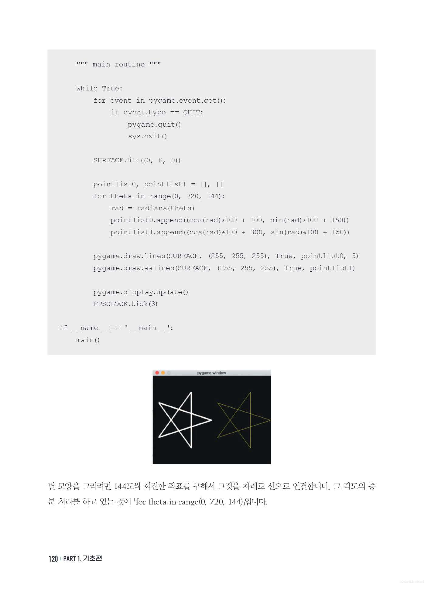

111111 main routine 111111

while True: for event in pygame.event.get() :

i f event .type == QUIT: pygame .quit () sys .exit()

SURFACE .fill((0, 0, 0))

pointlistO, pointlistl = [] , [] for theta in range (0, 720, 144) :

rad = radians (theta) pointlistO.append((cos(rad)*100 + 100, sin(rad)*lOO + 150)) pointlistl.append((cos (rad)*lOO + 300, sin (rad) *lOO + 150))

pygarne .draw.lines (SURFACE, (255, 255, 255) , True, pointlistO, 5) pygarne .draw.aalines (SURFACE, (255, 255, 255) , True, pointlistl)

pygame .display.update O FPSCLOCK.t ick (3 )

###### ’

’ main• ••

if name

•

main()

별 모양을 그리려면 144도씩 회전한 좌표를 구해서 그것을 차례로 선으로 연결합니다. 그 각도의 증

분 처리를 하고 있는 것이 「for theta in range(O, 720, 144)」입니다.

###### 120 1PART 1, 기조핀

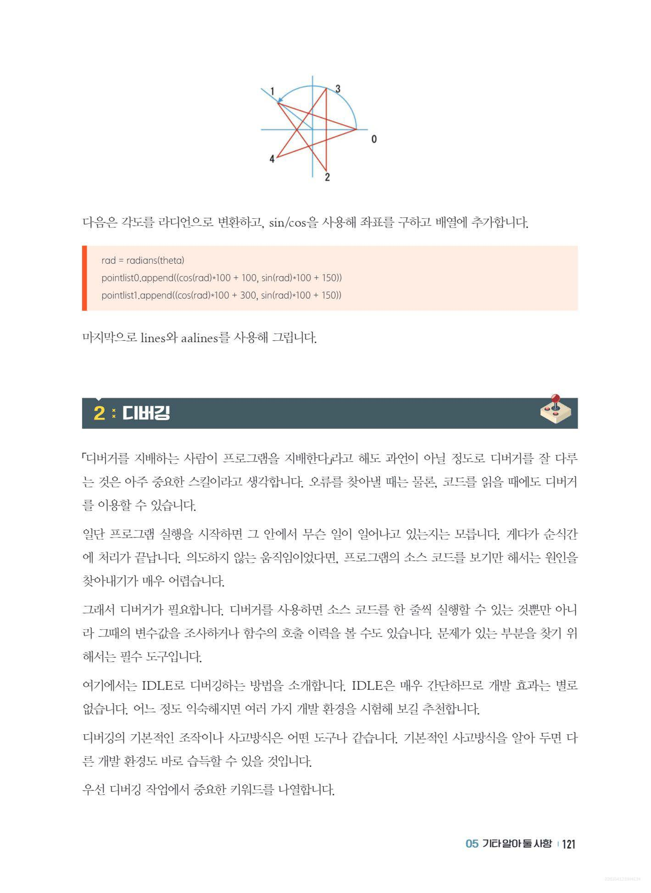

。

2

다음은 각도를 라디언으로 변환하고, sin/cos을 사용해 좌표를 구하고 배열에 추가합니다.

rad = radians(theta) pointlistO.append((cos(radHOO + 100, sin(radHOO + 150)) pointlistl.append((cos(radHOO + 300, sin(radHOO + 150))

마지막으로 lines와 aalines를 사용해 그립니다.

「디버거를 지배하는 사람이 프로그램을 지배한다」라고 해도 과언이 아닐 정도로 디버거를 잘 다루 는 것은 아주 중요한 스킬이라고 생각합니다. 오류를 찾아낼 때는 물론, 코드를 읽을 때에도 디버거

###### 를이용할수있습니다.

일단 프로그램 실행을 시작하면 그 안에서 무슨 일이 일어나고 있는지는 모릅니다. 게다가 순식간 에 처리가 끝납니다. 의도하지 않는 움직임이었다면, 프로그램의 소스 코드를 보기만 해서는 원인을 찾아내기가 매우 어렵습니다.

그래서 디버거가 필요합니다. 디버거를 사용하면 소스 코드를 한 줄씩 실행할 수 있는 것뿐만 아니 라 그때의 변수값을 조사하거나 함수의 호출 이력을 볼 수도 있습니다. 문제가 있는 부분을 찾기 위 해서는 필수 도구입니다.

여기에서는 IDLE로 디버깅하는 방법을 소개합니다. IDLE은 매우 간단하므로 개발 효과는 별로 없습니다. 어느 정도 익숙해지면 여러 가지 개발 환경을 시험해 보길 추천합니다. 디버깅의 기본적인 조작이나 사고방식은 어떤 도구냐 같습니다. 기본적인 사고빙식을 알아 두면 다 른 개발 환경도 바로 습독할 수 있을 것입니다. 우선 디버깅 작업에서 중요한 키워드를 나열합니다.

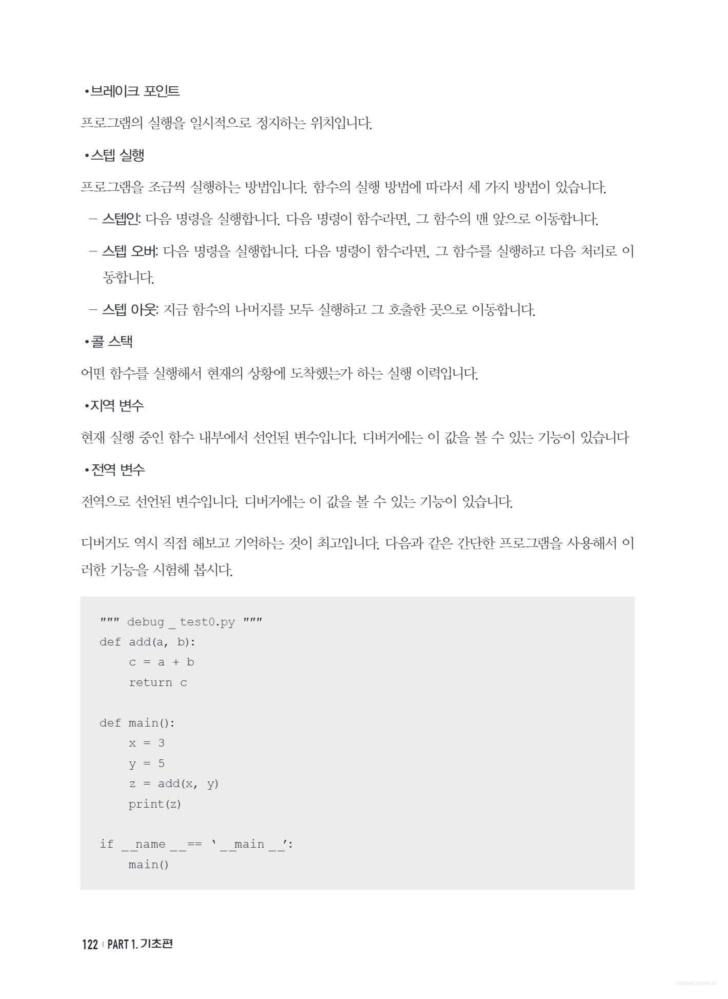

•브레이크포인트

###### 프로그램의 실행을 일시적으로 정지하는 위치입니다.

•스텝실행

프로그램을 조금씩 실행하는 방법입니다. 함수의 실행 방법에 따라서 세 가지 방법이 있습니다.

—스텝안 다음 명령을 실행합니다. 다음 명령이 함수라면, 그 함수의 맨 앞으로 이동합니다.

—스텝 오버: 다음 명령을 실행합니다. 다음 명령이 함수라면, 그 함수를 실행하고 다음 처리로 이

###### 동합니다.

###### —스텝 아웃: 지금함수의 나머지를 모두 실행하고 고 호출한곳으로 이동합니다.

•콜스택

###### 어떤 함수를 실행해서 현재의 상황에 도착했는가 하는 실행 이력입니다.

•지역변수

###### 현재 실행 중인 함수 내부에서 선언된 변수입니다. 디버거에는 이 값을 볼 수 있는 기능이 있습니다

•전역변수

전역으로 선언된 변수입니다. 디버거에는 이 값을 볼 수 있는 기능이 있습니다.

디버거도 역시 직접 해보고 기억하는 것이 최고입니다. 다음과 같은 간단한 프로그램을 사용해서 이 러한 기능을 시험해 봅시다.

""" debug _ testO.py """ def add(a, b) :

c = a + b ret urn c

def main() :

X = 3 y = 5 z = add(x, y)

pri nt (z)

` main• ••

I

if name

•

mai n()

###### 122 1PART 1. 기조편

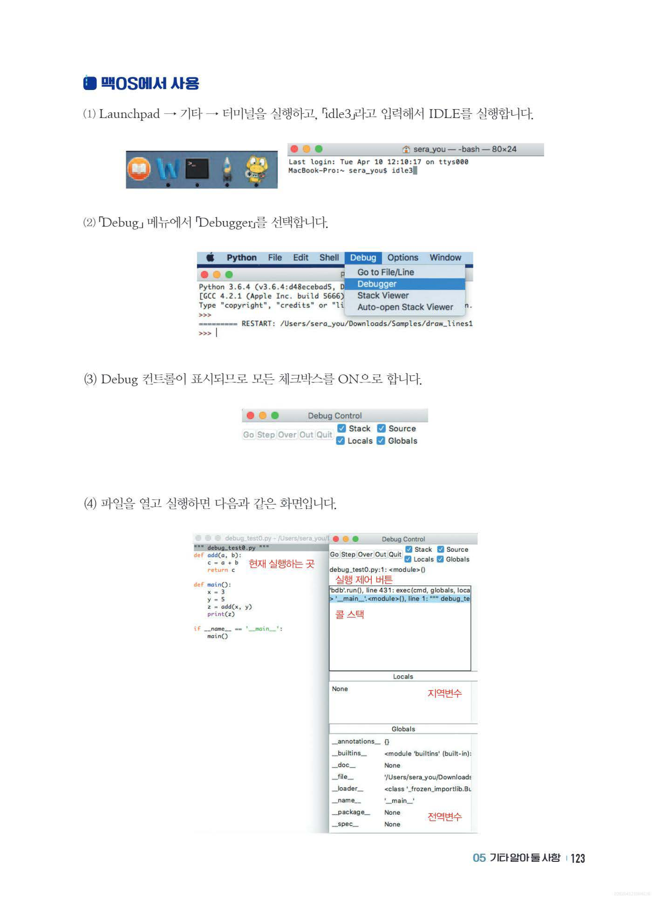

###### • 빽OSDIIA.i 사응

###### (1) Launchpad 一 기타 一 터미널을 실행하고, ridle3」라고 입력해서 IDLE를 실행합니다.

---------

sera_you - -bash - 80x24

＼—

Last login: Tue Apr 10 12:10:17 on ttys000 MacBook-Pro:~ sera_you$ idle3

###### (2) 「Debug」 메뉴에서 「bebugge1:.i를 선택합니다.

File Edit Shell~ Options Window...

• Python

’•

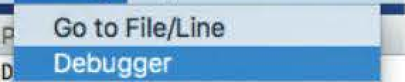

Python 3. 6 .4 (v3 . 6. 4 :d48ecebod5, i [GCC 4 . 2 .1 e I nc . build 5666) Type "copyright", "credits" or "li Auto-openStackViewer n• >>>

,...,••,..,•••'’’,.,

RESTART: /User s/ sera_you/Downloads/Samples/ draw_ sl

»> I

###### (3) D ebug 컨트롤이 표시되므로 모든 체크박스를 ON으로 합니다.

’ 0 •

Stack ti Source Locals ti Globals

Go Step Over Out Quit

###### (4) 파일을 열고 실행하면 다음과 같은 화면입니다.

•

j

l' ,L노 3) IU3ersIsera.y 』r·

Debug Convol Go Step Over Out Quit

Stack l'J Source

-_ _ __ _ ——l'JLocals Globals

二국iebuLteste.p-兄 •• '’

odd(o, b):

c - a + b

debug_testO.py:1: <module>()

return c def main():

bdb'.run(l, line 431: exec(cmd, globals, loca ' in_ '. , line 1: """ g_te

X - 3

'Yz -- add5 (x, y) print(z)

###### 콜스택

if _ nome__ - '_moi n_ ' : mai n()

Locals None

Globals _ annotations_ 。

—builtins_ <module'builtins'(built-in): _ doc_ _ file_ _ loader_ _ name_

None

'/Users/sera.Yau/Download! <class •_trozen_importlib.BL _ main_'

_ package_ None _ spec_ None

###### 전역변수

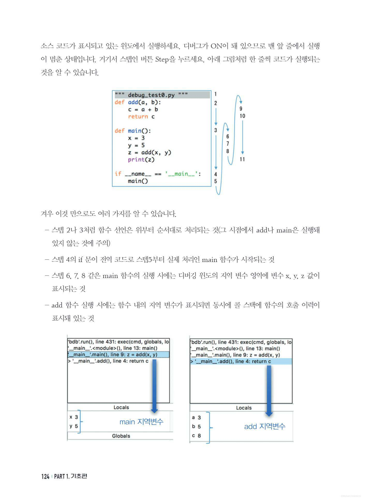

소스 코드가 표시되고 있는 윈도에서 실행하세요. 디버그가 ON이 돼 있으므로 맨 앞 줄에서 실행 이 범춘 상태입니다. 거기서 스뎁인 버튼 Step을 누르세요. 아래 그림처럽 한 줄씩 코드가 실행되는

###### 것을알수있습니다.

111111 debug_test0.py """ I 1

add(a , b) : 2 c = a + b 9

eh n c 10 def main() : 3

###### X = 3 6

- y = 5 7
- z = add(x, y) 8

”

print(z) I \ /

4 5

if __name_ == '_main_' : main()

겨우 이것 만으로도 여러 가지를 알 수 있습니다.

—스텝 2냐 3처럽 함수 선언은 위부터 순서대로 처리되는 것(그 시점에서 add나 main은 실행돼

있지 않는것에주의)

—스텝 4의 if문이 전역 코드로 스텝5부터 실제 처리인 main 함수가 시작되는 것

—스텝 6, 7, 8 같은 main 함수의 실행 시에는 디버깅 윈도의 지역 변수 영역에 변수 x, y, z 값이

표시되는것

—add 함수 실행 시에는 함수 내의 지역 변수가 표시되면 동시에 콜 스택에 함수의 호출 이력이

표시돼 있는것

bdb'.run(), line 431: exec(cmd, globals, lo

bdb'.run(), line 431: exec(cmd, globals, lo '_main_'.<module>(), line 13: main()

,_main__'.<module>(), line 13: main()

_ main_'.main(), line 9: z =add(x, y)

in_'. i Z , > '_main_'.add(), line 4: return c

> '_main_'. :

Locals • Locals

-

- X 3 a 3
- Y 5 main 지역변수 b 5 卜 add 지역변수 Globals L=---8

###### 124 1PART 1.기조편

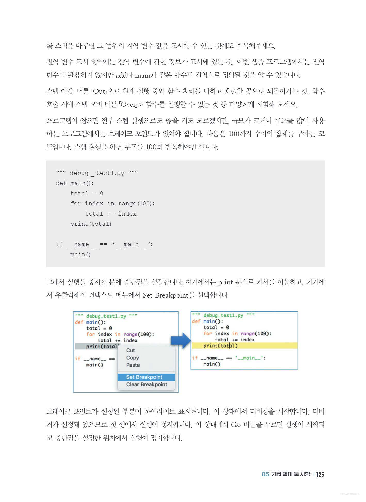

콜 스택을 바꾸면 그 범위의 지역 변수 값을 표시할 수 있는 것에도 주목해주세요.

전역 변수 표시 영역에는 전역 변수에 관한 정보가 표시돼 있는 것. 이번 샘플 프로그램에서는 전역

###### 변수를 활용하지 않지만 add나 main과 같은 함수도 전역으로 정의된 것을 알 수 있습니다.

스텝 아웃 버튼 「Out죠특: 현재 실행 중인 함수 처리를 다하고 호출한 곳으로 되돌아가는 것, 함수 호출 시에 스텝 오버 버튼 「0ve11로 함수를 실행할 수 있는 것 둥 다양하게 시험해 보세요. 프로그램이 짧으면 전부 스텝 실행으로도 좋을 지도 모르겠지만, 규모가 크거나 루프를 많이 사용

- 하는 프로그램에서는 브레이크 포인트가 있어야 합니다. 다음은 100까지 수치의 합계를 구하는 코 드입니다. 스뎁 실행을 하면 루프를 100회 반복해야만 합니다.

""" debug testl.py def main() :

total = 0

for index in range (100) :

\\ ffff

total += index print (total)

if name main’ ()

` maln• '.

그래서 실행을 중지할 문에 중단점을 설정합니다. 여기에서는 print 문으로 커서를 이동하고, 거기에

- 서 우클릭해서 컨텍스트 메뉴에서 Set Breakpoint를 선택합니다.

""" debug_test1. """ "' mai.n(): total = 0 or index n ronge(100): total += i.ndex

"'"' debug_test1 .py """ de ():

total • 。 index 1 range(100): total +"" index ~~

Cut Copy Paste

i~ _name_ •• '_main_' : main()

if _ name__ == main()

| |

Clear

브레이크 포인트가 설정된 부분이 하이라이트 표시됩니다. 이 상태에서 디버깅을 시작합니다. 디버

거가 설정돼 있으므로 첫 행에서 실행이 정지합니다. 이 상태에서 Go 버튼을 누르면 실행이 시작되

고 중단점을 설정한 위치에서 실행이 정지합니다.

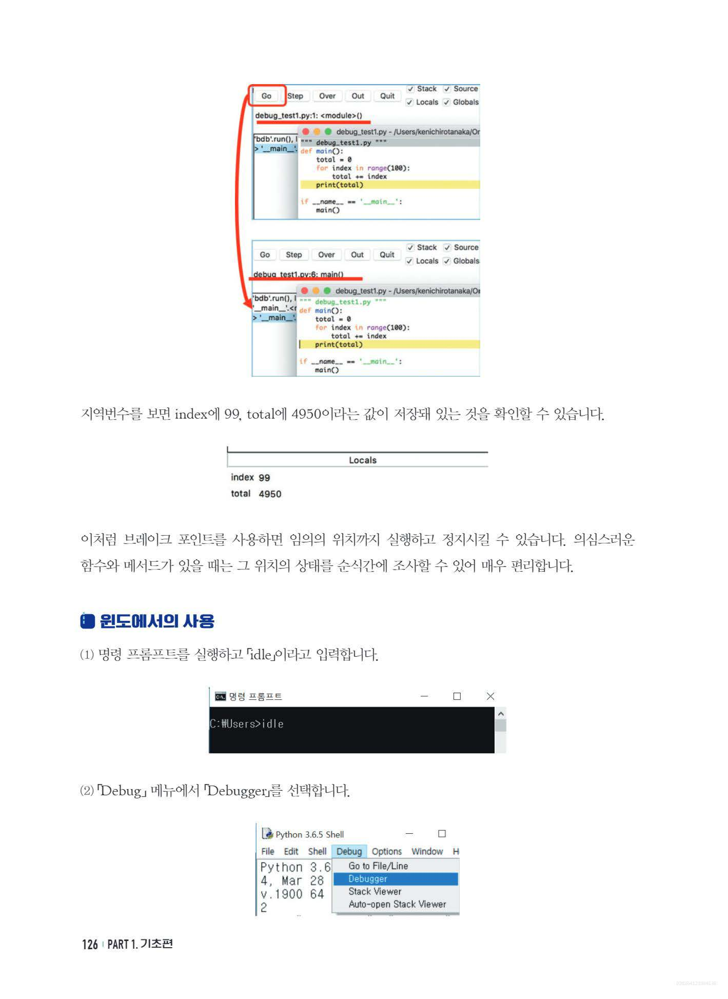

J Stack J Source ✓ Locals ✓ Globals

Go !Step Over Out Quit

debug_test1.e_y_:1: <m여ule>O

bdb'.run(J,•.' debug_test1.py••• - /Users/kenlchlrotanakaf이 > 언 ():

total • 0 index " ronge(100): total - index

print(!_otat)

_nme_ -- ’_moin_.;

``

"기n()

Stack ,1 Source

Go Step Over Out Quit ✓

✓ Lo여Is ✓ Globals.

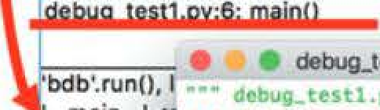

debug_test1.py - /Users/kenichirotanaka/0 'bdb'.runo, I, •• PY •• I,_rnain一'.＜r d moin() : > ' total - 0

or index range(190):

total -+:- index pr

t _name_ •• •__,,,aln_• : moinC)

지역번수를 보면 index에 99, total에 4950이라는 값이 저장돼 있는 것을 확인할 수 있습니다.

###### ’

Locals

index 99 total 4950

###### 수

있습니다. 의심스러운 함수와메서드가 있을 때는 그 위치의 상태를 순식간에 조사할 수 있어매우 편리합니다.

이처럽 브레이크 포인트를 사용하면 임의의 위치까지 실행하고 정지시킬

###### 윈도OIIA’으1 사옹

###### (1) 명령 프롬프트를 실행하고 ~dle」이라고 입력합니다.

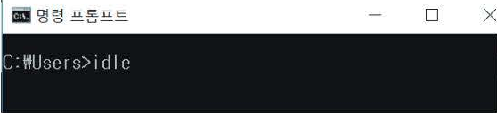

닳 명령 프롬프트 D X

^

###### (2) 「Debug」 메뉴에서 「Debugger훑} 선택합니다.

###### D

[. Python 3.6.5 Shell

H

File Edit Shell6

Window

P4V2 Options

###### y't-hM90aonro326

.84

Go to File/Line

l |

.

Stack Viewer ~to-open Stack Viewer

###### 126 1PART1.기조편

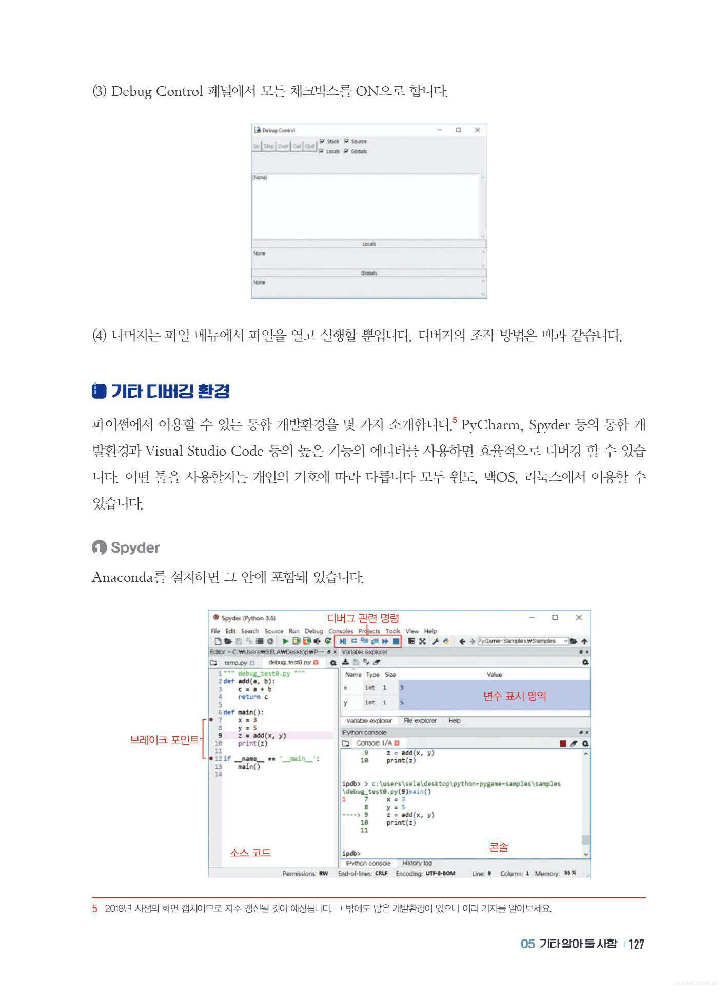

- (3) Debug Control 패널에서 모든 체크박스를 ON으로 합니다.

u""

o,,..lo.t

D X

p"0"'었m e2

u

-

(~

- (4) 나머지는 파일 메뉴에서 파일을 열고 실행할 뿐입니다. 디버거의 조작 방법은 맥과 같습니다.

###### JI타 EIUI김 환경

파이썬에서 이용할 수 었는 통합 개발환경을 몇 가지 소개합니다.5 PyCharm, Spyder 둥의 통합 개 발환경과 Visual Studio Code 등의 높은 기능의 에디터를 사용하면 효율적으로 디버깅 할 수 있습

###### 니다. 어떤 툴을 사용할지는 개인의 있습니다.

기호에 따라 다릅니다 모두 윈도, 맥OS, 리눅스에서 이용할수

###### C)Spyde『

###### Anaconda를 설치하면 그 안에 포함돼 있습니다.

e ~(Fython 3.6)

###### X

□

v.,수

갚' :fffdllJIs;«•►盆;~툰言딴탄컵; XH,

.x

+ +>y(lame-S8n¥)1es~

Edlllr - C.WUSleJsWSEI.A 묘Xll>WP... , 翼 V " x

0.t. - 0, 5

C3 Cemooy d祀_,0．” °

。

x

l--- debULt•ste PY 2d•f 1dd( 홀, b) :

Name Ty댜 &m

v*璋

Int

1 3

3 Csl+b

X

r•turn c

y

』

int 1

~qv터쇼lie elQllor타

6def uin() :

• 7 x• 3

"eoco타 H

a y • 5

’ Z 雪 add(x, y) 18 print(?) 1l

###### ••

_.ain_·:

###### • ,'

- 0 Gm玄*19e /A

1 : ~ add( x, y) print(: )

ipdb> > c:\u'"'\,.h\d"Rop ....＇"dl.，＼"빽》1"

\ d•buLhrt8. py(9)11111n()

- 1 7 x • 3 y • 5 Z 雪 •dd( x, y) print(: )

^

I 12 if l3

길閃T”

14

····>9

- 10
- 11

소스토

ipdb>

、'

Pymmox

"bg

|_

U119; ' ＆虹nr M s"‘ i

p어mIs* 畑 End-of-lines; Cllll Encoding: UTY-•IOM

###### 5

2018년 시점의 화면 갭처이므로 자주 갱신될 것이 예상됩니다. 그 밖에도 많은 개발환경이 였으니 여러 가지를 알아보세요.

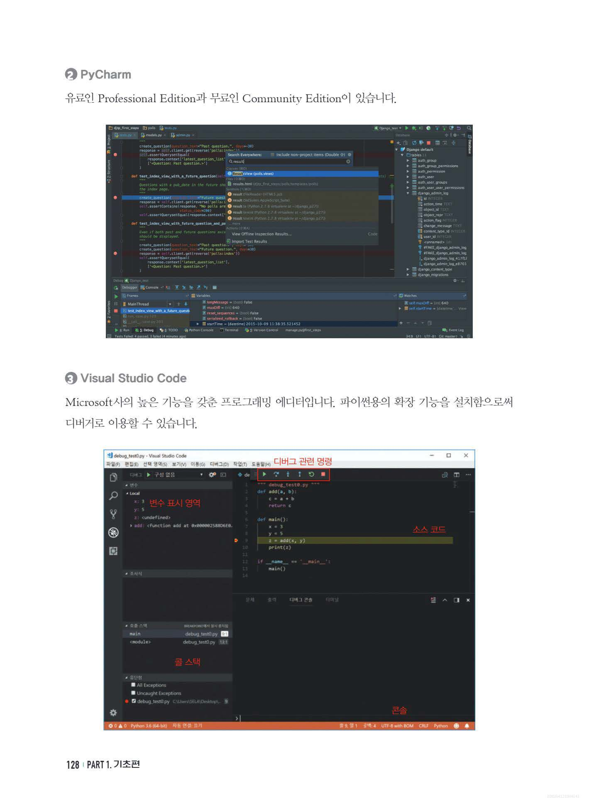

###### ~PyCharm

유료인 Professional Edition과 무료인 Community Edition이 였습니다.

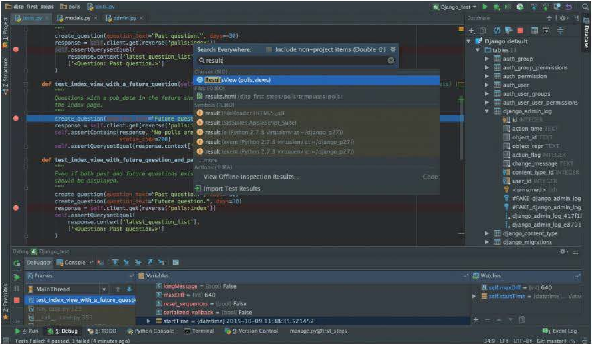

###### 0 Visual Studio Code

###### Microsoft사의 높은 기능을 갖춘 프로그래밍 에디터입니다. 파이썬용의 확장 기능을 설치함으로써 디버거로 이용할 수 였습니다.

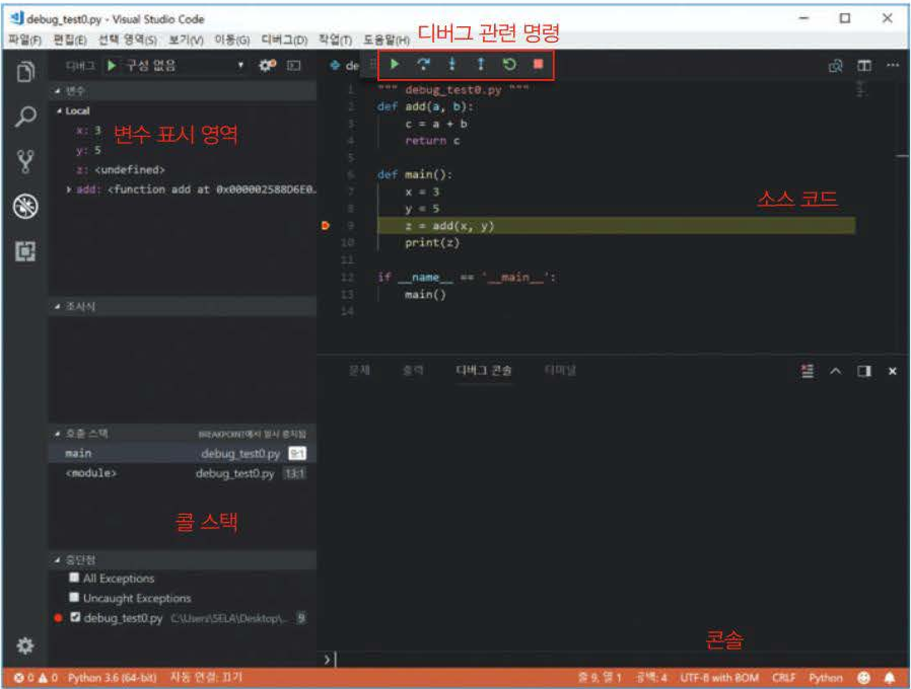

111입m 던E(E) 닌이"m 뽀’lm 0I를向 디터그(l)l 라업(T) 도"(HI 디버그관련 명령

- 0 X

이"'m ·”의요소'“”

###### 128 1PART 1.기조편

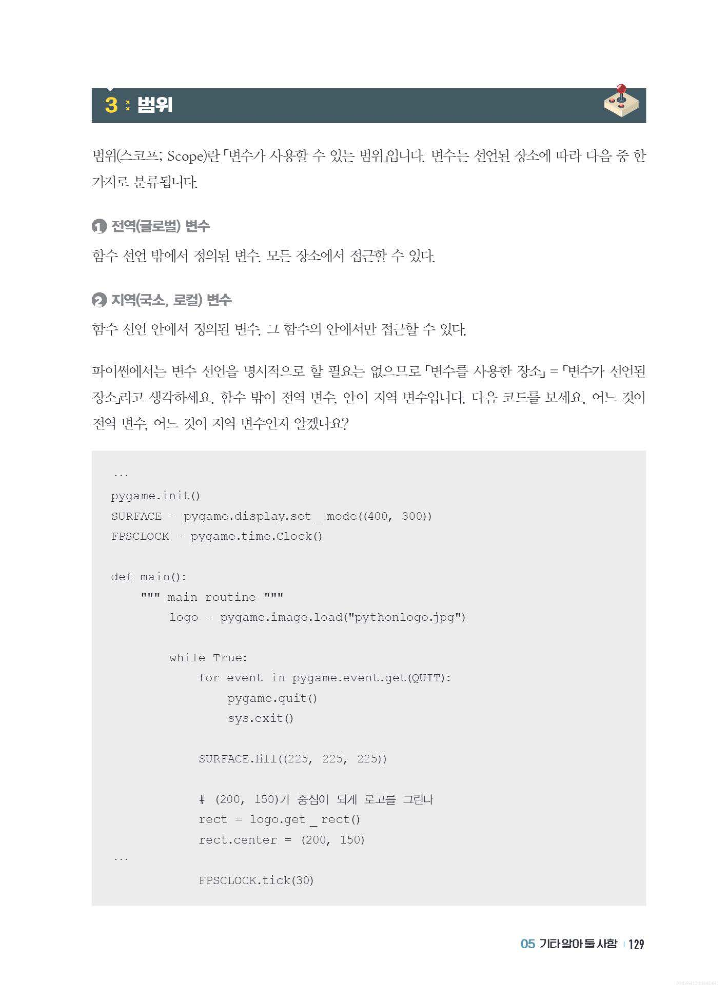

###### 범위(스코프; Scope)란 「변수가 사용할 수 있는 범위」입니다. 변수는 선언된 장소에 따라 다음 중 한

가지로분류됩니다.

###### C) 전역(글로벌) 변수

함수 선언 밖에서 정의된 변수. 모든 장소에서 접근할 수 있다.

###### O 지역(국소, 로컬) 변수

함수 선언 안에서 정의된 변수. 그 함수의 안에서만 접근할 수 있다.

파이썬에서는 변수 선언을 명시적으로 할 필요는 없으므로 「변수를 사용한 장소」 =「변수가 선언된 장소」라고 생각하세요. 함수 밖이 전역 변수. 안이 지역 변수입니다. 다음 코드를 보세요. 어느 것이 전역 변수, 어느 것이 지역 변수인지 알겠냐요?

pygame .init () SURFACE = pygame.display.set mode((400, 300)) FPSCLOCK = pygame.time.Clock()

def main() : 11 1111 main routine 111111

logo = pygame.image.load("pythonlogo.jpg")

while True:

for event in pygame .event .get(QUIT) : pygame .quit () sys.exit()

SURFACE.fill((225, 225, 225) )

# (200, 150)가 중심이 되게 로고를 그린다 rect = logo.get rect () rect.center = (200, 150)

FPSCLOCK.t ick (3 0)

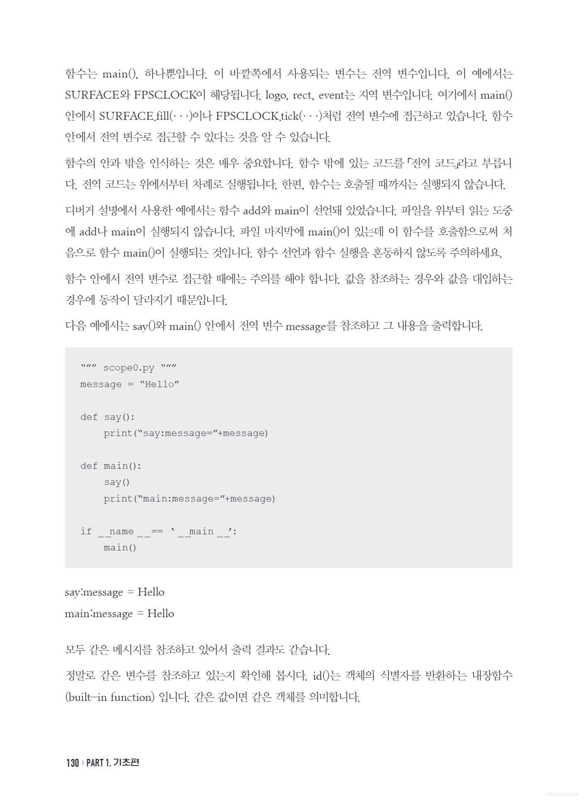

함수는 main(), 하나뿐입니다. 이 바깥쪽에서 사용되는 변수는 전역 변수입니다. 이 예에서는 SURFACE와 FPSCLOCK:이 해당됩니다. logo, rect, event는 지역 변수입니다. 여기에서 mainO 안에서 SURFACE.fill(· · .)이나 FPSCLOCK.tick(· · .）처럼 전역 변수에 접근하고 있습니다. 함수 안에서 전역 변수로 접근할 수 있다는 것을 알 수 있습니다.

함수의 안과 밖울 인식하는 것은 매우 중요합니다. 함수 밖에 있는 코드를 「전역 코드」라고 부릅니

다. 전역 코드는 위에서부터 차례로 실행됩니다. 한편, 함수는 호출될 때까지는 실행되지 않습니다.

디버거 설명에서 사용한 예에서는 함수 add와 main이 선언돼 있었습니다. 파일을 위부터 읽는 도중

에 add냐 main이 실행되지 않습니다. 파일 마지막에 mainO이 있는데 이 함수를 호출함으로써 처 음으로 함수 mainO이 실행되는 것입니다. 함수 선언과 함수 실행을 혼동하지 않도록 주의하세요.

함수 안에서 전역 변수로 접근할 때에는 주의를 해야 합니다. 값을 참조하는 경우와 값을 대입하는 경우에 동작이 달라지기 때문입니다.

다음 예에서는 sayO와 mainO 안에서 전역 변수 message를 참조하고 그 내용을 출력합니다.

"'"' scopeO.py """ message = "Hello"

def say() : print("say:message="+message)

def main() : say() print("main:message="+message)

` •

###### ’

main ••

if name

main()

’

###### say:message =Hello main:message =Hello

모두 같은 메시지를 참조하고 있어서 출력 결과도 같습니다.

정말로 같은 변수를 참조하고 있는지 확인해 봅시다. idO는 객체의 식별자를 반환하는 내장함수

(built—in function) 입니다. 같은값이면 같은 객체를 의미합니다.

###### 130 1PART 1, 기조핀

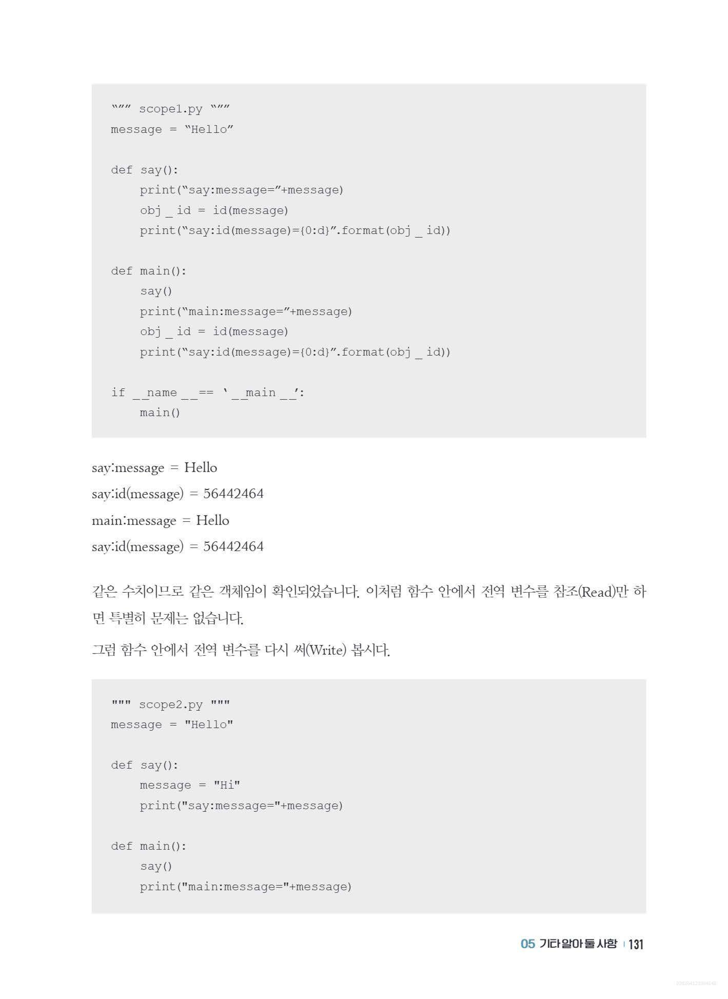

"1111 scopel.py "1111 message = "Hello"

def say() : print ("say:rnessage="+rnessage) obj id = id(message) print ("say:id (message) ={0:d}". format (obj id) )

def main() : say() print("main :rnessage="+rnessage) obj id = id(message) print ("say:id (message) ={0 :d}". format(obj id) )

` rnaln• '.

if name main()’

•

say:message = Hello say:id(message) = 56442464 main:message = Hello say:id(message) = 56442464

###### 같은 수치이므로 같은 객체임이 확인되었습니다. 이처럽 함수 인에서 전역 변수를 참조(Read)만 하 면 특별히 문제는 없습니다. 그럽 함수 안에서 전역 변수를 다시 써(Write) 봅시다.

""" scope2 .py """ message = "Hello"

def say() : message = "Hi" print ("say:rnessage="+rnessage)

def main() : say() print("main:rnessage="+rnessage)

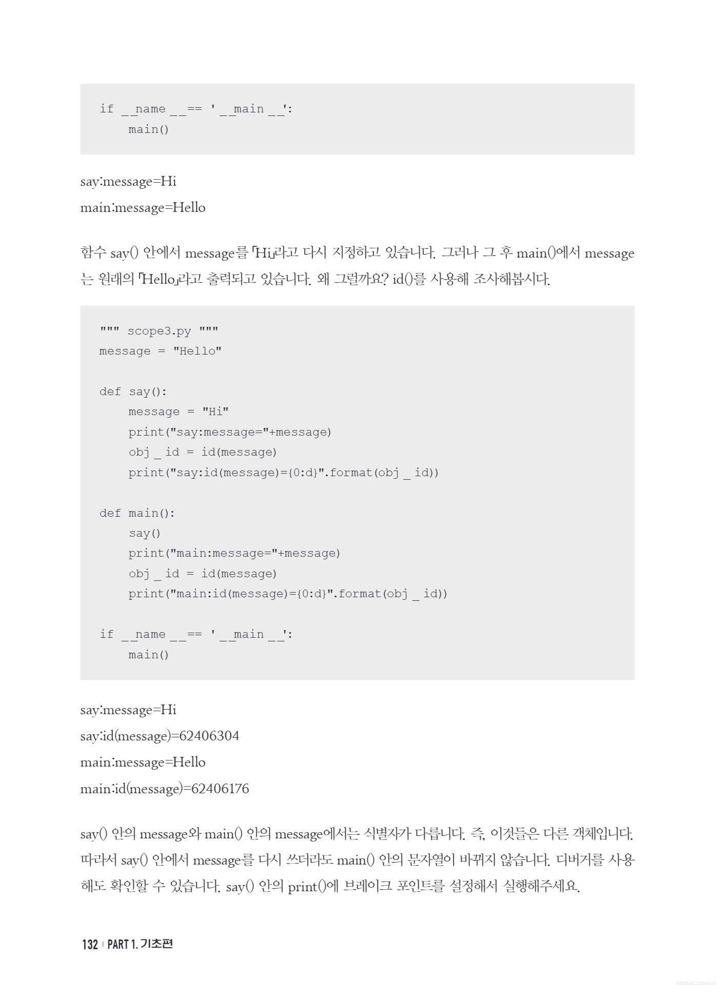

I main•

###### if name

I •

rnaln()

•

###### say:message=Hi main:message=Hello

함수 sayO 안에서 message를 「Hi」라고 디시 지정하고 있습니다. 그러나 그 후 mainO에서 message 는 원래의 「Hello」라고 출력되고 있습니다. 왜 그럴까요? idO를 사용해 조사해봅시다.

""" scope3.py """ message = "Hello"

def say() : message = "Hi" print ("say:rnessage="+rnessage) obj id = id (message) print ("say:id(message) ={0:d}" .format (obj i d) )

def main() : say() print ("main:message="+message) obj id = id(message) print ("main:id(message) ={0:d}".format (obj id) )

I main•

if name

I •

rnaln()

•

say:message=Hi say:id(message)=62406304 main:message=Hello main'.id(message)=62406176

sayO 안의 message와 mainO 안의 message에서는 식별지가 다릅니다. 즉, 이것들은 다른 객체입니다. 따라서 sayO 안에서 message를 다시 쓰더라도 mainO 안의 문자열이 바뀌지 않습니다. 디버거를 사용 해도 확인할 수 있습니다. sayO 안의 printO에 브레이크 포인트를 설정해서 실행해주세요

###### 132 1PART 1.기조편

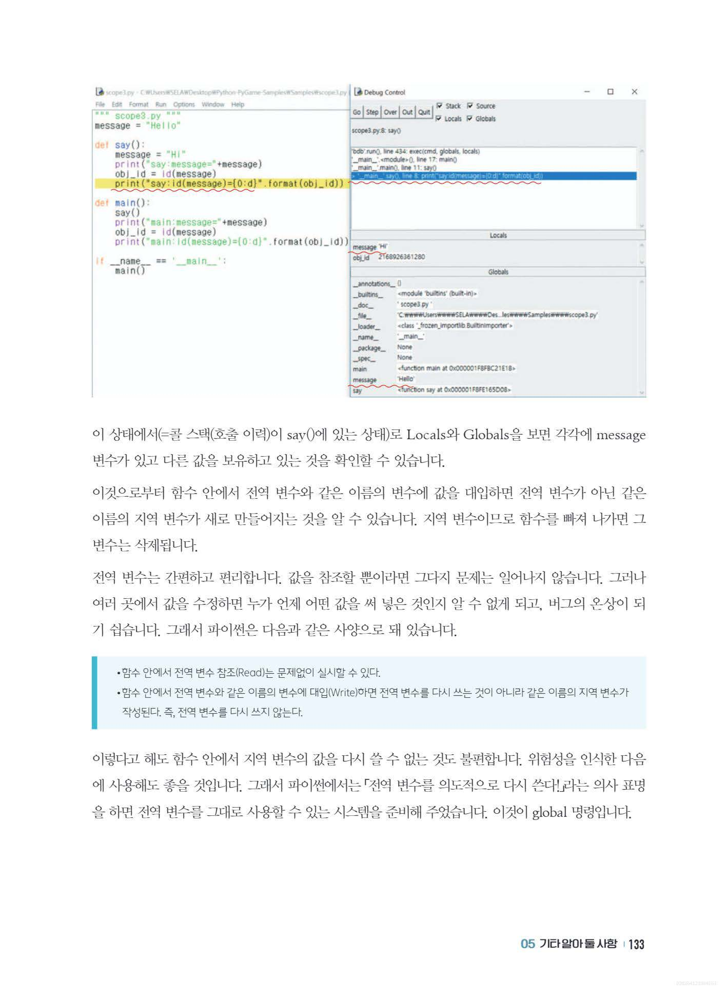

###### b w

###### * # Debug Concrol - 0 X fM £lS4 Run -~ \'~ _Hq>

,w,Ct:다:＊

###### ol S다| 0"'IOUI| Oll F SX` P Sourte

t nn I ”"• message = I Io·

• I 1

P "mh PG

IC0pt3"`”"

say() : message = .,ti I • pr n ( ' ,, 111 간 = +message) obJ_lq ;; l<t{me

급 짜* ms소` m m갑¢虹”됴s

'』mm_＇，mD&0.D" " .m

'_ITIUI_-----ITlal_nO.l111t- ---11 반°

t ('. _ " )~( ) )

,'

111aln() say() or I nt ( I 하) +messaoe) obJ_ld = id(message) Dr nt( ,,, | j ( 'p ...3an ) u a

format(obj_ld))I

”

2,"""'280

f _name_ == '_main_' ; maln()

- -~-JMOt,kt"`_o一u""mu.In}>
- -doc- “아"”.
- -＇보 t msu^一一白一아미 」_ 떠" ．'~mm'"0_»
- -mm._ .'_JNIII_·

- Nont

- -" Nont «uxm"mmnn1F訂BC21E18>

¢

### m~

###### 이 상태에서(=콜 스택(호출 이력)이 sayO에 있는 상태)로 Locals와 Globals을 보면 각각에 message

변수가 있고 다른 값을 보유하고 있는 것을 확인할 수 있습니다.

이것으로부터 함수 안에서 전역 변수와 같은 이름의 변수에 값을 대입하면 전역 변수가 아닌 같은 이름의 지역 변수가 새로 만들어지는 것을 알 수 있습니다. 지역 변수이므로 함수를 빠져 나가면 그

###### 변수는삭제됩니다.

###### 전역 변수는 간편하고 편리합니다. 값을 참조할 뿐이라면 그다지 문제는 일어나지 않습니다. 그러냐 여러 곳에서 값을 수정하면 누가 언제 어떤 값을 써 넣은 것인지 알 수 없게 되고, 버그의 온상이 되 기 쉽습니다. 고래서 파이썬은 다음과 같은 사양으로 돼 있습니다.

- • 암수 안에서 전역 변수 참조(Read)는 문제없이 실시말 수 있다.
- • 암수 안에서 전역 변수와 같은 이름의 변수에 대입(Write)O단면 전역 변수를 다시 쓰는 것이 아니라 같은 이름의 지역 변수가 작성된다. 즉, 전역 변수를 다시 쓰지 않는다.

###### 이렇다고 해도 함수 인에서 지역 변수의 값을 디시 쓸 수 없는 것도 불편합니다. 위험성을 인식한 다음 에 사용해도 좋을 것입니다. 그래서 파이썬에서는 「전역 변수를 의도적으로 다시 쓴다!」라는 의사 표명 을 하면 전역 변수를 그대로 사용할 수 있는 시스템을 준비해 주었습니다. 이것이 global 명령입니다.

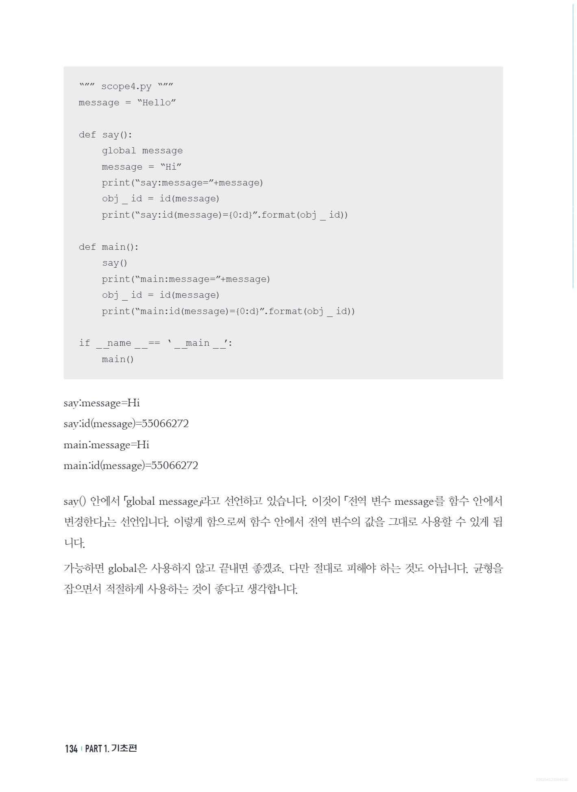

\\1111 scope4.PY """ message = "Hello"

def say() :

global message message = "Hi" print ("say:rnessage="+rnessage)

obj _ id = id (message) print ("say:i d(rnessage) ={0:d}".format (obj id) )

def main(): say() print ("main:message="+message) obj i d = id(message) print ("main:i d (message) ={0:d}". format (obj i d) )

` •

main ,.

if name main()’

•

say:message=Hi say:id(message)=55066272 main'.message=Hi main:id(message)=55066272

###### sayO 안에서 「global message」라고 선언하고 있습니다. 이것이 「전역 변수 message를 함수 안에서

변경한다습근 선언입니다. 이렇게 함으로써 함수 안에서 전역 변수의 값을 그대로 사용할 수 있게 됩

###### 니다.

가능하면 global은 사용하지 않고 끝내면 좋겠죠. 다만 절대로 피해야 하는 것도 아닙니다. 균형을 잡으면서 적절하게 사용하는 것이 좋다고 생각합니다.

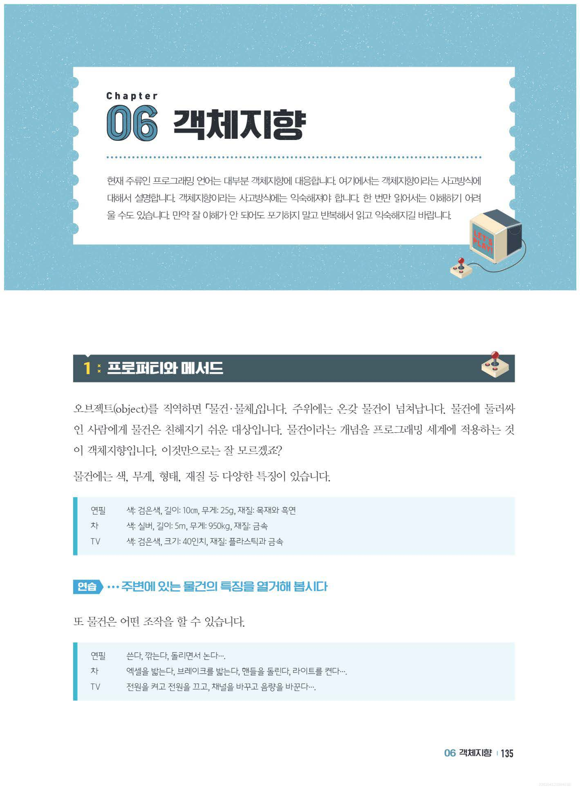

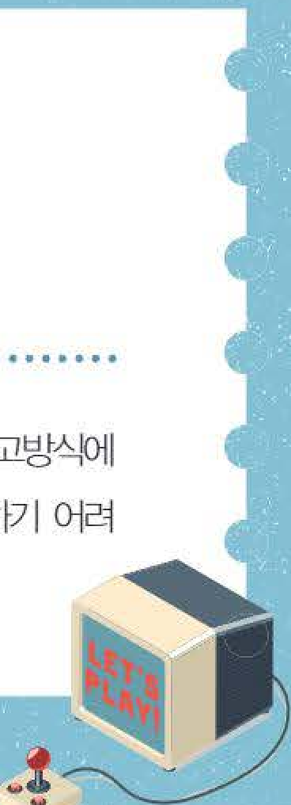

Chapte 『

###### ••••••••••••••••••••••••••••••••••••••••••••••••••••••••••••••••••••••••••••••••••••••••

현재 주류인 끄쿠겨래밍 언어는 대부분 객체지향에 대응합니다. 여기에서는 객체지향이라는 사고방식에

###### 대해서 설명합니다 객체지향이라는 사고방식에는 악숙해져야 합니다. 한 번만 읽어서는 이해하기 어려 울 수도 있습니다 만약 잘 이해가 안 되어도 포기하지 말고 반복해서 읽고 악숙해지길 바랍니다.

~3

9

###### 오브젝트(object)를 직역하면 「물건 ·물체」입니다. 주위에는 온갖 물건이 넘쳐납니다. 물건에 둘러싸

###### 인 사람에게 물건은 친해지기 쉬운 내상입니다. 물건이라는 개념을 프로그래밍 세계에 적용하는 것 이 객체지향입니다. 이것만으로는 잘 모르겠죠? 물건에는 색, 무게, 형태, 재질 둥 다양한 특징이 있습니다.

색: 검은색, 길이: 10cm, 무게: 25g, 재질: 목재와 목연 색: 실버, 길이: Sm, 무게: 950kg, 재질: 금속 색: 검은색, 크기: 40인지, 재질: 플라스틱과 금속

###### 연필

자

TV

###### …주변메있는 록짐을

###### 또 물건은 어떤 조작을 할 수 있습니다.

###### 연필

쓴다, 깎는다, 돌리면서 논다…. 엑셀을 밟는다, 브레이크를 밟는다, 앤들을 돌린다, 라이트를 컨다···, 전원을 켜고 전원을 끄고, 재널을 바꾸고 음량을 바꾼다….

자

TV

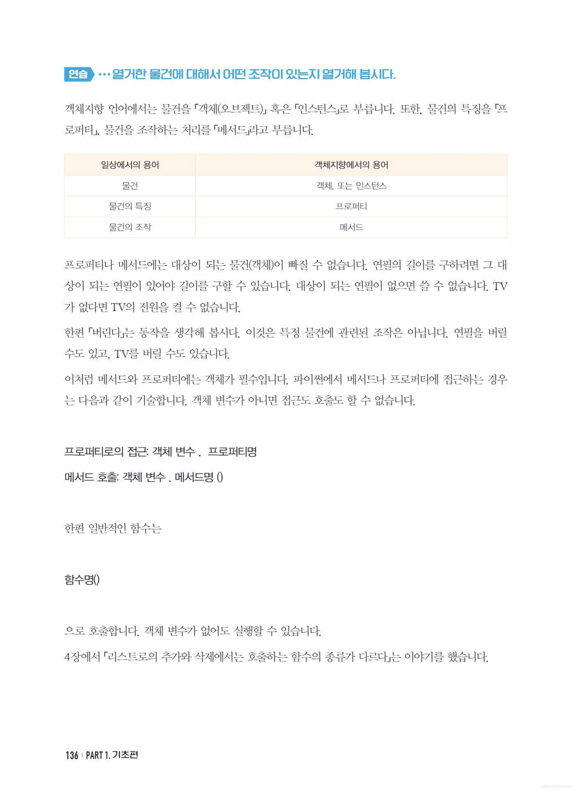

###### …열거란물건에[H해서어떤조작이있는지열거해봅시다

###### 객체지향 언어에서는 물건을 「객체(오브젝트)」 혹은 「인스턴스」로 부릅니다. 또한, 물건의 특징을 「프 로퍼티」, 물건을 조작하는 처리를 「메서드」라고 부릅니다.

일상에서의용어

객체지향에서의용어

객체 또는인스턴스

물건

물건의특징

프로퍼티

물건의조작

메서드

###### 프로퍼티나 메서드에는 대상이 되는 물건(객체)이 빠질 수 없습니다. 연필의 길이를 구하려면 그 대 상이 되는 연필이 있어야 길이를 구할 수 있습니다. 대상이 되는 연필이 없으면 쓸 수 없습니다. TV

- 가 없다면 TV의 전원을 켤 수 없습니다.

###### 한편 「버린다」는 동작을 생각해 봅시다. 이것은 특정 물건에 관련된 조작은 아닙니다. 연필을 버릴

###### 수도 있고, TV를 버릴 수도 있습니다. 이처럽 메서드와 프로퍼티에는 객체가 필수입니다. 파이썬에서 메서드나 프로퍼티에 접근하는 경우 는 다음과 같이 기술합니다. 객체 변수가 아니면 접근도 호출도 할 수 없습니다.

프로퍼티로의 접근: 객체 변수 . 프로퍼티명 메서드 호출 객체 변수 . 메서드명 ()

###### 한편일반적인함수는

함수명()

으로 호출합니다. 객체 변수가 없어도 실행할 수 었습니다.

4장에서 「리스트로의 추가와 삭제에서는 호출하는 함수의 종류가 다르다」는 이야기를 했습니다.

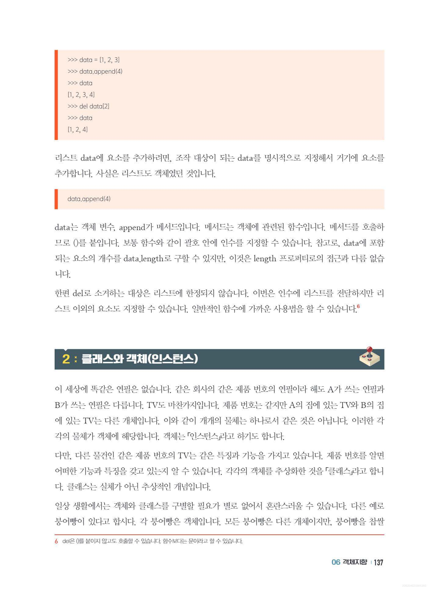

###### >» data = [1, 2, 3] >>> data.append(4) >» data

(1, 2, 3, 4]

###### >» del data[2] >>> data

[l, 2, 4]

리스트 data에 요소를 추가하려면, 조작 대상이 되는 data를 명시적으로 지정해서 거기에 요소를 추가합니다. 사실은 리스트도 객체였던 것입니다.

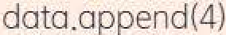

data는 객체 변숙 append가 메서드입니다. 메서드는 객체에 관련된 함수입니다. 메서드를 호출하

###### 므로 O를 붙입니다. 보통 함수와 같이 괄호 안에 인수를 지정할 수 있습니다. 참고로, data에 포함

되는 요소의 개수를 data.length로 구할 수 있지만, 이것은 length 프로퍼티로의 접근과 다름 없습

###### 니다.

한편 del로 소거하는 대상은 리스트에 한정되지 않습니다. 이번은 인수에 리스트를 전달하지만 리

###### 스트 이외의 요소도 지정할 수 있습니다. 일반적인 함수에 가까운 사용법을 할 수 있습니다.6

이 세상에 똑같은 연필은 없습니다. 같은 회사의 같은 제품 번호의 연필이라 해도 A가 쓰는 연필과 B가 쓰는 연필은 다릅니다. TV도 마찬가지입니다. 제품 번호는 같지만 A의 집에 있는 TV와 B의 집 에 있는 TV는 다른 개체입니다. 이와 같이 개개의 물체는 하나로서 같은 것은 아닙니다. 이러한 각 각의 물체가 객체에 해당합니다. 객체는 「인스턴스」라고 하기도 합니다.

###### 다만, 다른 물건인 같은 제품 번호의 TV는 같은 특징과 기능을 가지고 있습니다. 제품 번호를 알면

어떠한 기능과 특징을 갖고 있는지 알 수 있습니다. 각각의 객체를 추상화한 것을 「클래스」라고 합니

###### 다. 클래스는 실체가 아닌 추상적인 개념입니다.

###### 일상 생활에서는 객체와 클래스를 구별할 필요가 별로 없어서 혼란스러울 수 있습니다. 다른 예로 붕어빵이 있다고 합시다. 각 붕어빵은 객체입니다. 모든 붕어빵은 다른 개체이지만, 붕어빵을 찹쌀

del은 (}!릅 붙이지 않고도 호출할 수 있습니다 함수보다는 문이라고 할 수 있습니다.

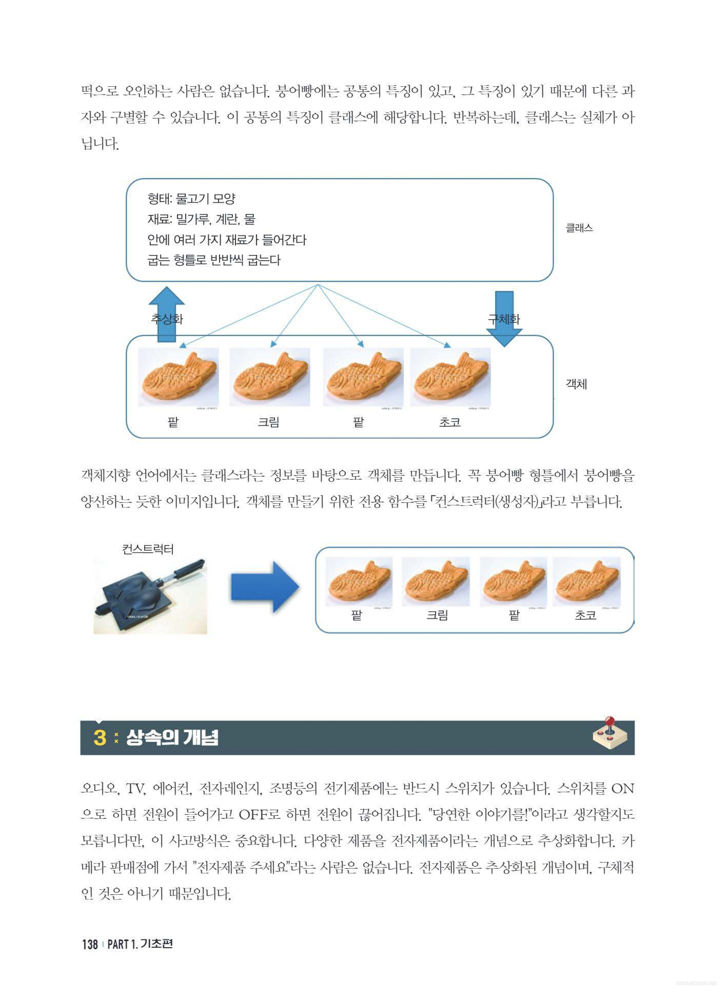

떡으로 오인하는 사람은 없습니다. 붕어빵에는 공통의 특징이 있고, 그 특징이 있기 때문에 다른 과

- 자와 구별할 수 있습니다. 이 공통의 특징이 클래스에 해당합니다. 반복하는데, 클래스는 실체가 아 닙니다.

형태:물고기모앙 재료밀가루계란,울 안에 여러 가지재료가들어간다 굽는 형틀로 반반씩 굽는다

클래스

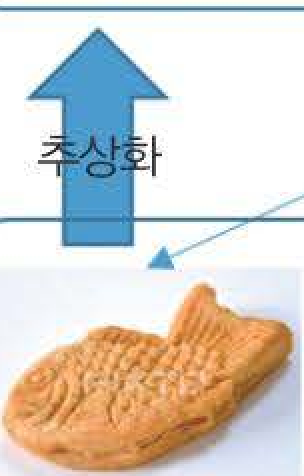

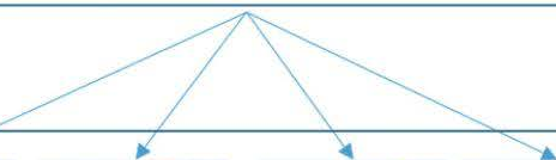

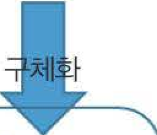

一¢ \r

객체

팥 -•···•· -··- -··-

팥

크림

초코

객체지향 언어에서는 클래스라는 정보를 바탕으로 객체를 만듭니다. 꼭 붕어빵 형틀에서 붕어빵을

###### 양산하는 듯한 이미지입니다. 객체를 만들기 위한 전용 함수를 「컨스트럭터(생성자)」라고 부릅니다.

컨스트럭터

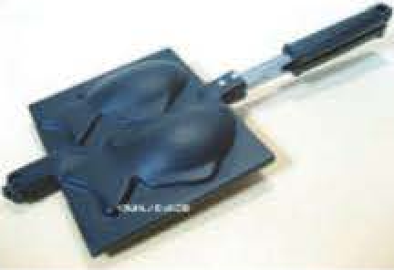

###### ....

###### 팥

팥 ,..-

"－天 -天

크림

초코

오디오, TV, 에어컨, 전자베인지, 조명등의 전기제품에는 반드시 스위치가 있습니다. 스위치를 ON 으로 하면 전원이 들어가고 OFF로 하면 전원이 끊어집니다. "당연한 이야기를!“이라고 생각할지도 모릅니다만, 이 사고방식은 중요합니다. 다양한 제품을 전자제품이라는 개념으로 추상화합니다. 카 메라 판매점에 가서 “전자제품 주세요”라는 사림~ 없습니다. 전자제품은 추상화된 개념이며, 구체적

인 것은 아니기 때문입니다.

###### 138 1PART 1.기조편

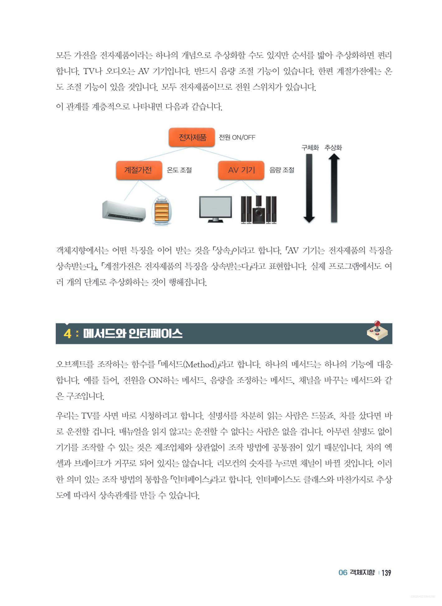

모든 가전을 전자제품이라는 하나의 개념으로 추상화할 수도 있지만 순서를 밟아 추상화하면 편리 합니다. TV나 오디오는 AV 기기입니다. 반드시 음량 조절 기능이 있습니다. 한편 계절가전에는 온 도 조절 기능이 있을 것입니다. 모두 전자제품이므로 전원 스위치가 있습니다.

이 관계를 계층적으로 나타내면 다음과 같습니다.

전원 ON/OFF

구체화 추상화

온도조절 AV 음량조절

객체지향에서는 어떤 특징을 이어 받는 것을 「상속」이라고 합니다. 「AV 기기는 전자제품의 특징을 상속받는다」, 「계절가전은 전자제품의 특징을 상속받는다」라고 표현합니다. 실제 프로그램에서도 여 러 개의 단계로 추상화하는 것이 행해집니다.

###### 오브젝트를 조작하는 함수를 「메서드(Method)」라고 합니다. 하나의 메서드는 하나의 기능에 대웅

합니다. 예를 들어, 전원을 ON하는 메서드, 음량을 조정하는 메서드, 재널을 바꾸는 메서드와 같

###### 은구조입니다.

우리는 TV를 사면 바로 시청하려고 합니다. 설명서를 차분히 읽는 사람은 드물죠. 치를- 샀다면 바

###### 로 운전할 겁니다. 매뉴얼을 읽지 않고는 운전할 수 없다는 사림~ 없을 겁니다. 아무런 설명도 없이

기기를 조작할 수 있는 것은 재조업체와 상관없이 조작 방법에 공통점이 있기 때문입니다. 자의 엑 셀과 브레이크가 거꾸로 되어 있지는 않습니다. 리모컨의 숫자를 누르면 재널이 바뀔 것입니다. 이러 한 의미 있는 조작 방법의 통합을 「인터페이스」라고 합니다. 인터페이스도 클래스와 마찬가지로 추상 도에 따라서 상속관계를 만들 수 있습니다.

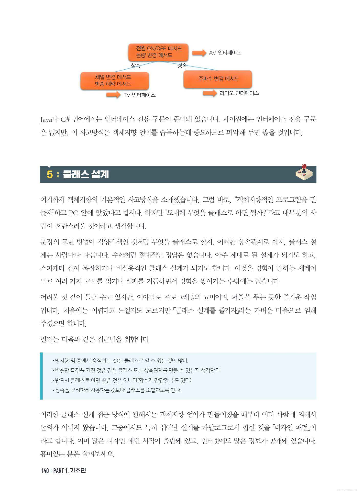

AV 인터페이스

###### 매서드

사급二二=- ___똑

_一

드 TV 인터페이스

라디오인터페이스

###### Java나 C# 언어에서는 인터페이스 전용 구문이 준비돼 있습니다. 파이썬에는 인터페이스 전용 구문

은 없지만, 이 사고방식은 객체지향 언어를 습독하는데 중요하므로 파악해 두면 좋을 것입니다.

여기까지 객체지향의 기본적인 사고방식을 소개했습니다. 그럽 바로, "객체지향적인 프로그램을 만

들자'하고 PC 앞에 앉았다고 합시다. 하지만 "도대체 무엇을 클래스로 하면 될까?”라고 대부분의 사

람이 혼란스러울 것이라고 생각합니다.

문장의 표현 방법이 각양각색인 것처럽 무엇을 클래스로 할지, 어떠한 상속관계로 할지, 클래스 설 계는 사람마다 다릅니다. 수학처럽 절대적인 정답은 없습니다. 아주 제대로 된 설계가 되기도 하고. 스파게티 같이 복잡하거냐 비실용적인 클래스 설계가 되기도 합니다. 이것은 경험이 밀슝t는 세계이 므로 여러 가지 코드를 읽거나 실패를 거듭하면서 경험을 쌓아가는 수밖에는 없습니다.

어려울 것 같이 들릴 수도 있지만, 이야말로 프로그래밍의 묘미이며, 퍼즐을 푸는 듯한 즐거운 작업 입니다. 처음에는 어렵다고 느낄지도 모르지만 「클래스 설계를 줄기자」라는 가벼운 마음으로 임해 주셨으면합니다.

###### 필자는 다음과 같은 접근법을 취합니다.

- •명사(게임 중에서 움직이는 것)는 클래스로 말 수 있는 것이 많다.
- •비슷만 특징을 가진 것은 같은 클래스 또는 상속관계를 만들 수 있는지 생각만다.
- •반드시 클래스로 아면 종은 것은 아니다(암수가 간단말 수도 있다).
- •상속을 무리아게 사용아는 것보다 클래스를 조맙아도록 만다.

이러한 클래스 설계 접근 방식에 관해서는 객체지향 언어가 만들어졌을 때부터 여러 사람에 의해서 논의가 이뤄져 왔습니다. 그중에서도 특히 뛰어난 설계를 카탈로그로서 합한 것을 「디자인 패턴」이 라고 합니다. 이미 많은 디자인 패턴 서적이 출판돼 있고, 인터넷에도 많은 정보가 공개돼 였습니다.

흥미있는 분은 살펴보세요.

###### 140 1PART 1. 기조핀

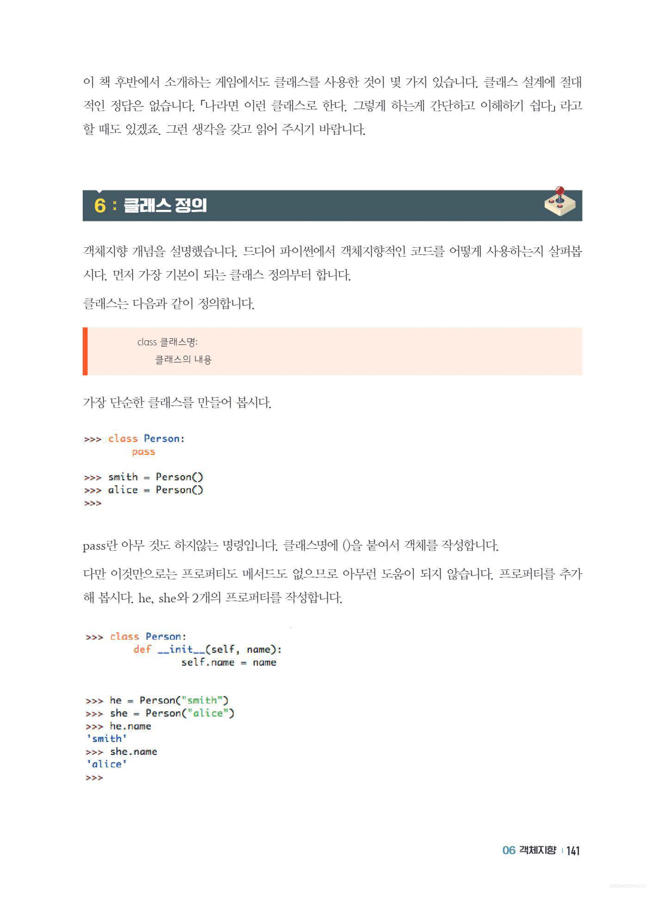

이 책 후반에서 소개하는 게임에서도 클래스를 사용한 것이 몇 가지 있습니다. 클래스 설계에 절대 적인 정답은 없습니다. 「나라면 이런 클래스로 한다. 그렇게 하는게 간단하고 이해하기 쉽다」 라고 할 때도 있겠죠. 그런 생각을 갖고 읽어 주시기 바랍니다.

객체지향 개념을 설명했습니다. 드디어 파이썬에서 객체지향적인 코드를 어떻게 사용하는지 살펴봅

###### 시다. 먼저 가장 기본이 되는 클래스 정의부터 합니다.

###### 클래스는 다음과 같이 정의합니다.

class 클래스명

클래스의 내 용

###### 가장 단순한 클래스를 만들어 봅시다.

>>> class Pers.on :.

pass >>> smith = perso,n( )

x>> alice = Perso:n()

>>::,.

###### pass란 아무 것도 하지않는 명령입니다. 클래스명에 0을 붙여서 객체를 작성합니다.

다만 이것만으로는 프로퍼티도 메서드도 없으므로 아무런 도움이 되지 않습니다. 프로퍼티를 추가 해 봅시다. he, she와 2개의 프로퍼티를 작성합니다.

>>> c s PeFson : def _ .init__(self, nam,e’): s.~l.f •.1rnamt? • mamf!

>>> h혼 = p,훈FSOtil("smi七h") ~>> she = peFson("alice”) >>> he •11'ilorrtt.! , sm1ith"' >>> she•.n,ame 'alic,흔` >>>

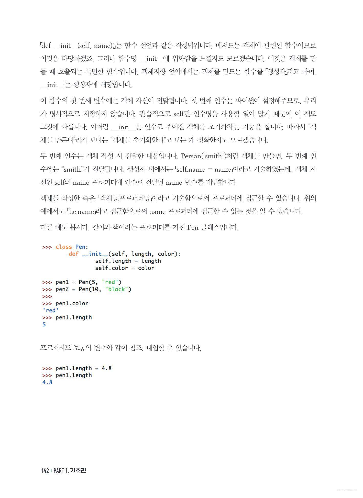

###### 「def —init—(self, name):J는 함수 선언과 같은 작성법입니다. 메서드는 객체에 관련된 함수이므로

이것은 타당하겠죠. 그러나 함수명 _init_에 위화갑을 느낄지도 모르겠습니다. 이것은 객체를 만 들 때 호출되는 특별한 함수입니다. 객체지향 언어에서는 객체를 만드는 함수를 「생성자」라고 하며,

###### —init—는 생성자에 해당합니다.

이 함수의 첫 번째 변수에는 객체 자신이 전달됩니다. 첫 번째 인수는 파이썬이 설정해주므로, 우리

- 가 명시적으로 지정하지 않습니다. 관습적으로 self란 인수명을 사용할 일이 많기 때문에 이 책도 그것에 따릅니다. 이처럽 _init_는 인수로 주어진 객체를 초기화하는 기능~ 합니다. 따라서 "객 체를 만든다라기 보다는 "객체를 초기화한다’고 보는 게 정확한지도 모르겠습니다.

두 번째 인수는 객체 작성 시 전달한 내용입니다. Person("smith"）처럽 객체를 만들면, 두 번째 인

수에는 "smith"가 전달됩니다. 생성자 내에서는 「self.name =name」이라고 기술하였는데, 객체 자

신인 self의 name 프로퍼티에 인수로 전달된 na1ne 변수를 대입합니다. 객체를 작성한 측은 「객체명.프로퍼티명」이라고 기술함으로써 프로퍼티에 접근할 수 있습니다. 위의 예에서도 「he.name」라고 접근함으로써 name 프로퍼티에 접근할 수 있는 것을 알 수 있습니다.

- 다른 예도 봅시다. 길이와 색이라는 프로퍼티를 가진 Pen 클래스입니다.

>>> class Pen:

def __init__(self, length, color) : self.length = length self.color = color

>>> penl = Pen(S, "red") >>> penZ = Pen(10, "black") >>> >>> penl.color ' red' >>> penl.length

5

프로퍼티도 보통의 변수와 같이 찹조, 대입할 수 있습니다.

###### >>> pen1.1ength = 4.8 >>> penl.length

4 .8

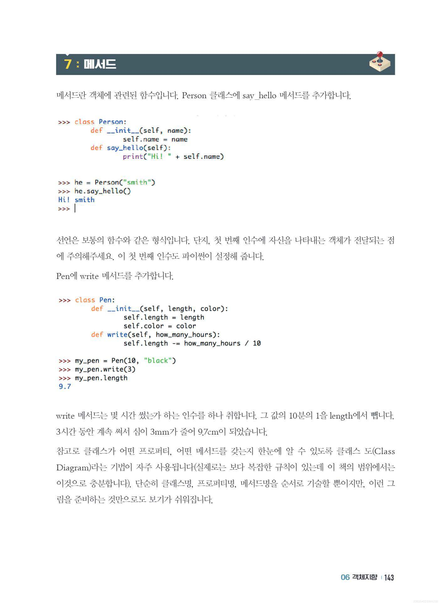

###### 메서드란 객체에 관련된 함수입니다. Person 클래스에 say—hello 메서드를 추가합니다.

'>> class PeI"SOt11': __ini七_」(self"' name):

se1f .':l'ilam e = nam,e

def say」hello(self) ：

pirint( "H l •• + s~lf.m.llm,e)

>>> he = pmFson(＂smi七h"） >>> hti!:..say_Jhi elloO Hi ! smi >>> I

선언은 보통의 함수와 같은 형식입니다. 단지, 첫 번째 인수에 자신을 나타내는 객체가 전달되는 점 에 주의해주세요. 이 첫 번째 인수도 파이썬이 설정해 줍니다. Pen에 write 메서드를 추가합니다.

>>> class Pen :

def __init__(self, length, color) : self .length = length self.color = color

def write(self, how_many_hours) : self .length -= how_many_hours / 10

>>> my_pen = Pen(10, "black") >>> my_pen.write(3) >>> my_pen .length

9.7

W1·ite 메서드는 몇 시간 썼는가 하는 인수를 하나 취합니다. 그 값의 10분의 1을 length에서 땝니다. 3시간 동안 계속 써서 심이 3mm가 줄어 9.7cm이 되었습니다.

###### 참고로 클래스가 어떤 프로퍼티, 어떤 메서드를 갖는지 한눈에 알 수 있도록 클래스 도(Class Diagram)라는 기법이 자주 사용됩니다(실제로는 보다 복잡한 규칙이 었는데 이 책의 범위에서는 이것으로 충분합니다)． 단순히 클래스명, 프로퍼티명, 메서드명을 순서로 기술할 뿐이지만, 이런 그

림을 준비하는 것만으로도 보기가 쉬워집니다.

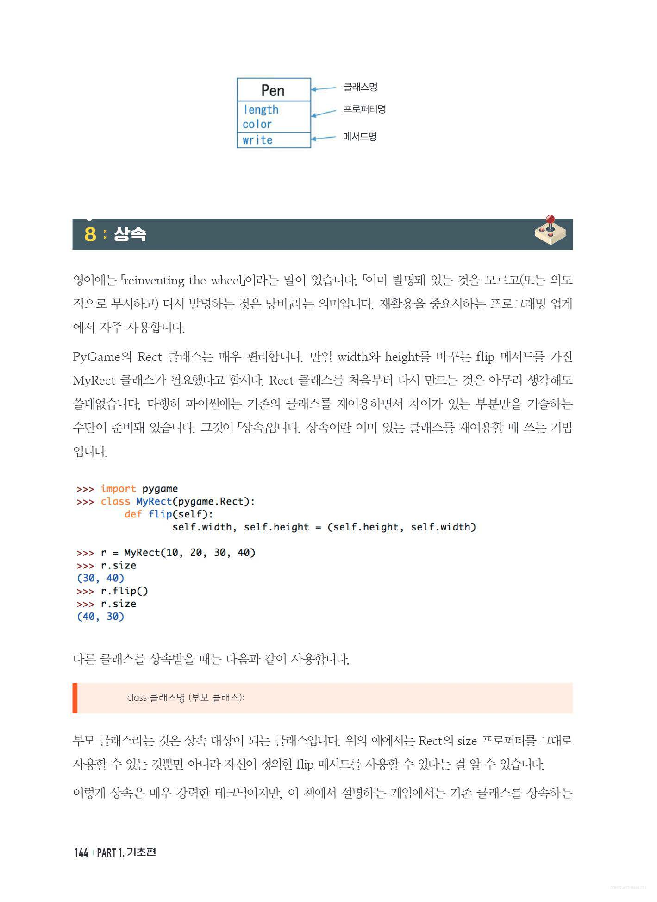

Pen

클래스명

length color

프로퍼티영

wr :ite

머I서드명

영어에는 rreinventing the wheelJ이라는 말이 있습니다. 「이미 발명돼 있는 것을 모르고(또는 의도 적으로 무시하고) 다시 발명하는 것은 낭비」라는 의미입니다. 재활용을 중요시하는 프로그래밍 업계 에서 자주시용합니다.

PyGame의 Rect 클래스는 매우 편리합니다. 만일 width와 height를 바꾸는 flip 메서드를 가진 MyRect 클래스가 필요했다고 합시다. Rect 클래스를 처음부터 다시 만드는 것은 아무리 생각해도 쓸데없습니다. 다행히 파이썬에는 기존의 클래스를 재이용하면서 자이가 있는 부분만을 기술하는 수단이 준비돼 있습니다. 그것이 r,J.J-속」입니다. 상속이란 이미 있는 클래스를 재이용할 때 쓰는 기법 입니다.

>>> pygame >>> MyRect(pygame .Rect):

def fli.p(self) :

self.wi.dth, self.hei.ght = (self.hei.ght, self.wi.dth)

>>> r = MyRect(10, 20, 30, 40) >>> r.s1ze• (30, >>> r .flip() >>> r.s1ze• (40, 30)

다른 클래스를 상속받을 때는 다음과 같이 사용합니다.

class 클래스명 (부모 클래스):

부모 클래스라는 것은 상속 대상이 되는 클래스입니다. 위의 예에서는 Rect의 size 프로퍼티를 그대로 사용할 수 있는 것뿐만 아니라 자신이 정의한 flip 메서드를 시용할 수 있다는 걸 알 수 있습니다. 이렇게 상속은 매우 강력한 데크닉이지만, 이 책에서 설명하는 게임에서는 기존 클래스를 상속하는

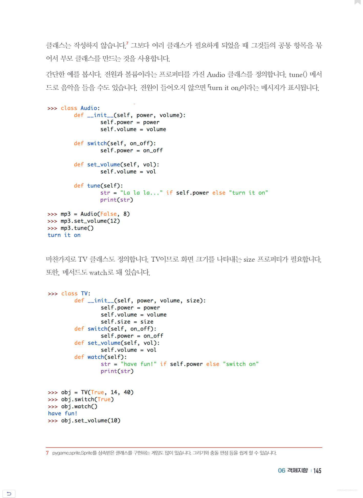

클래스는 작성하지 않습니다.7 그보다 여러 클래스가 필요하게 되었을 때 그것들의 공통 항목을 묶

어서 부모 클래스를 만드는 것을 사용합니다. 간단한 예를 봅시다. 전원과 볼륨이라는 프로퍼티를 가진 Audio 클래스를 정의합니다. tuneO 메서 드로 음악을 들을 수도 있습니다. 전원이 들어오지 않으면 「turn it onJ이라는 메시지가 표시됩니다.

>>> class Audi.o :

__i.ni.t__(self, power, volume): self.power = power self.volume = volume

switch(self, on_off) :

self.power = on_off def set_volume(self, vol):

self.volume = vol

def tune(self): str = "La la la . .. " if self.power else "turn it on" print( str)

>>> mp3 = Audi o(False, 8) >>> mp3 .set_volume(12) >>> mp3 .tune() turn it on

마찬가지로 TV 클래스도 정의합니다. TV이므로 화면 크기를 나타내는 size 프로퍼티가 필요합니다. 또한, 메서드도 watch로 돼 있습니다.

>>> class TV:

def __i.ni.t__(self, power, vol ume, si.ze): self.power = power self.volume = volume self.si.ze = si.ze

def swi.tch(self, on_off) :

self.power = on_off

def set_vol (self, vol):

self.volume = vol def watch(self) :

str = "have fun!" if self.power "swi.tch on"

pri.nt(str)

>>> obj = TV(True , 14, 40) >>> obj .swi.tch(True) >>> obj.watch() have fun ! >>> obj .set_volume(10)

7 pygame.sprile.Sprite률 상속받은 클레스률구현하는 게임도 많이 있습니다. 그리기와충돌판정 등을 쉽계 할수 있습니다.

###### 06 객체지랑 I 145

=

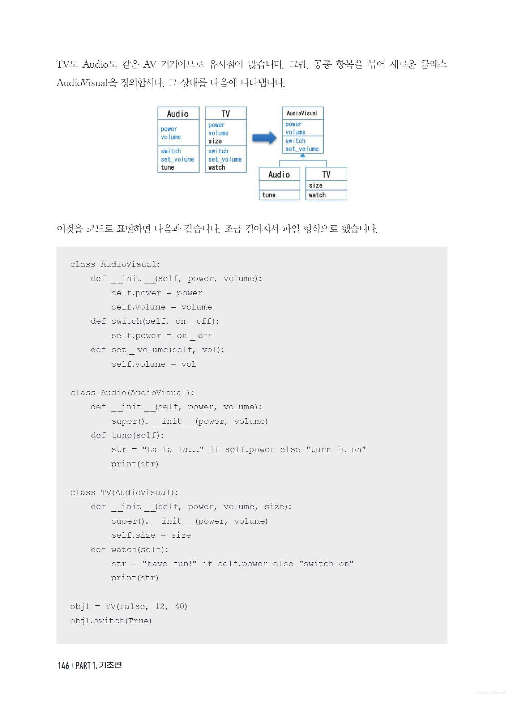

TV도 Audio도 같은 AV 기기이므로 유사점이 많습니다. 그럽, 공통 항목을 묶어 새로운 클래스 AudioVisual을 정의합시다. 그 상태를 다음에 나타냅니다.

|Audio|
|---|
|power volume|
|sw set_volume tune|

|TV|
|---|
|power volume SIZe|
|SWItch set_volume watch|

|AudloVisual|
|---|
|power volume|
|switch set_volume  .,.|

I-

| I

|Audio|
|---|
| |
|tune|

###### TV

size watch

이것을 코드로 표현하면 다음과 같습니다. 조금 길어져서 파일 형식으로 했습니다.

class Audiovisual:

def init (self, power, volume) : self.power = power self.volume = volume

def switch(self, on —off):

self.power = on _ off

def set volume(self, vol) :

self.volume = vol

class Audio (Audiovisual) : def init __(self, power, volume) : super() . init __(power, volume)

def tune (self) : str = "La la la..." if self.power else "turn it on" print(str)

class TV(AudioVisual) : def init• • super() .

(self, power, volume, size) :

init (power, volume) self.size = size

def watch(self) : str = "have fun !" if self.power else "switch on" print(str)

obj l = TV(False, 12, 40)

- obj 1.switch(True)

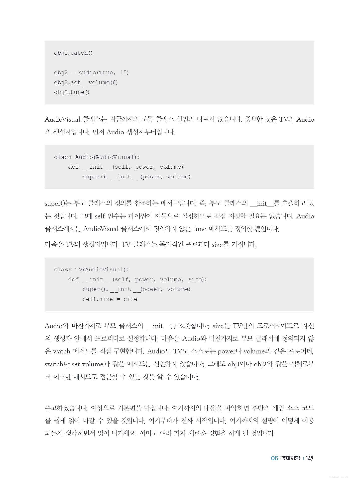

objl.watch()

obj 2 = Audio (True, 15)

- obj 2.set volume (6) obj2.tune()

AudioVisual 클래스는 지금까지의 보통 클래스 선언과 다르지 않습니다. 중요한 것은 TV와 Audio 의 생성자입니다. 먼저 Audio 생성자부터입니다.

class Audio (Audiovisual) : def init __(self, power, volume) : super () . init (power, volume)

###### superO는 부모 클래스의 징의를 참조하는 메서드입니다. 죽, 부모 클레스의 _init—-를 호출하고 있

는 것입니다. 그때 self 인수는 파이썬이 지동으로- 설정하므로 직접 지정할 필요는 없습니다. Audio 클래스에서는 AudioVisual 클래스에서 정의하지 않은 tune 메서드를 정의할 뿐입니다. 다음은 TV의 생성자입니다. TV 클래스는 독자적인 프로퍼티 size를 가집니다.

class TV(AudioVisual) :

def init (self, power, volume, size) : super () . init (power, volume) self.size = size

Audio와 마찬가지로 부모 클래스의 —init_를 호출합니다. size는 TV만의 프로퍼티이므로 자신 의 생성자 안에서 프로퍼더로 설정합니다. 다음은 Audio와 마찬가지로 부모 클래서에 징의되지 않 은 watch 메서드를 직접 구현합니다. Audio도 TV도 스스로는 power나 volume과 같은 프로퍼티, switch나 set_volume과 같은 메서드는 선언하지 않습니다. 그래도 objl이나 obj2와 같은 객체로부 터 이러한 메서드로 접근할 수 였는 것을 알 수 있습니다.

수고하셨습니다. 이상으로 기본편을 마칩니다. 여기까지의 내용을 파악하면 후반의 게임 소스 코드 를 쉽게 읽어 나갈 수 있을 것입니다. 여기부터가 진짜 시작입니다. 여기까지의 설명이 어떻게 이용 되는지 생각하면서 읽어 냐가세요. 아마도 여러 가지 새로운 경험을 하게 될 것입니다.

06 객체지랑 I 147

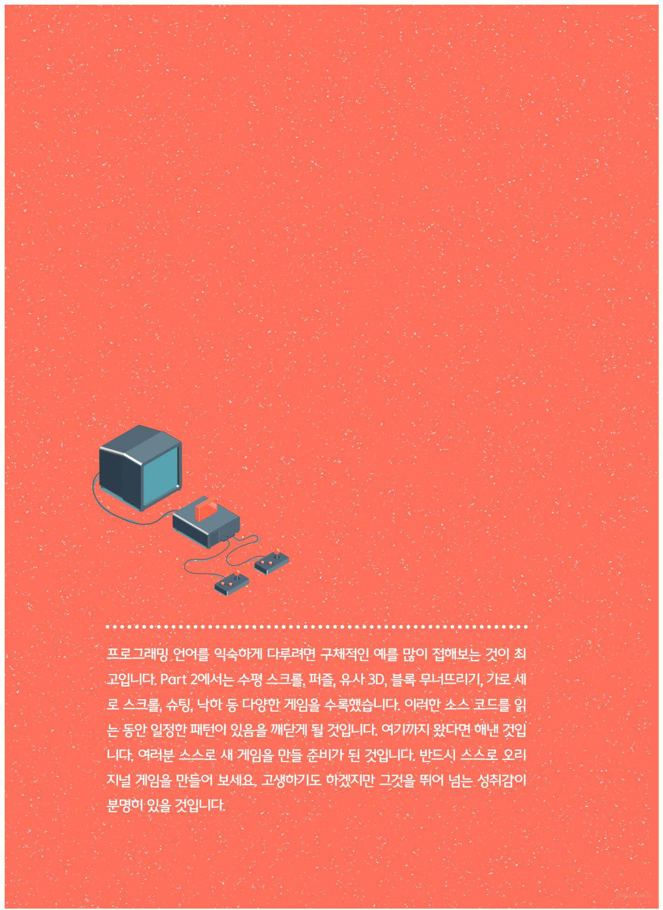

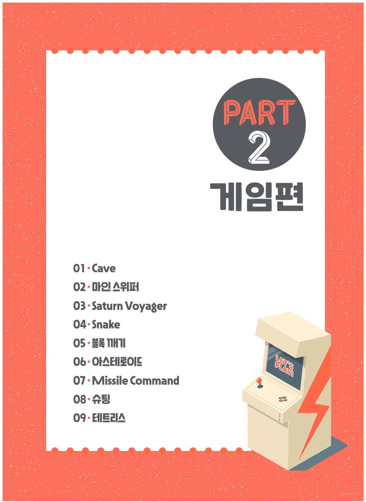

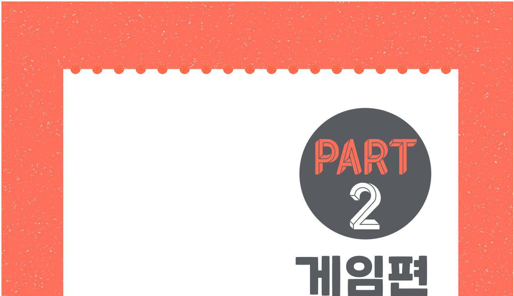

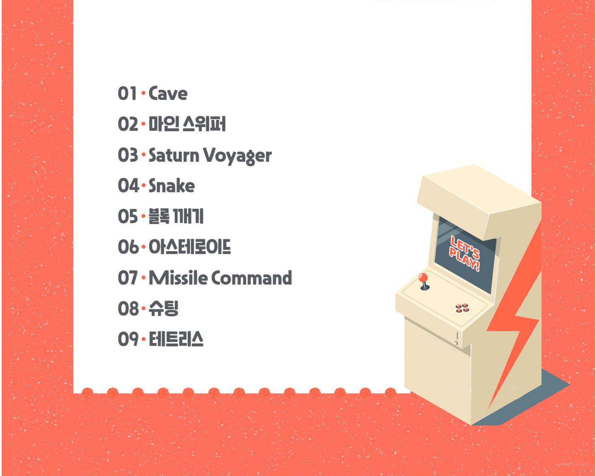

- 01 ·Cave
- 02 · Dt2!~위퍼

03•SaturnVoya3아 04·Snake

05 · 麟 11Hll

Ob•Ot~Etl률011;

i

- 07 •Missile Command
- 08 · 슈팅 oq . 테트ElA

o0

###### ""출

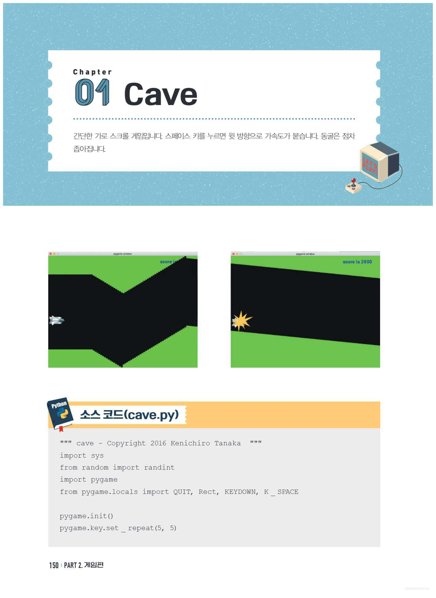

Chapte 『

ave

••••••••••••••••••••••••••••••••••••••••••••••••••••••••••••••••••••••••••••••••••••••••

###### 간단한 가로 스크롤 게임입니다. 스페이스 키를 누르면 윗 방항으로 가속도가 붙습니댜 동굴은 점차

좁0園니다.

23

3

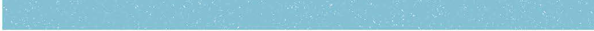

• ".....- --

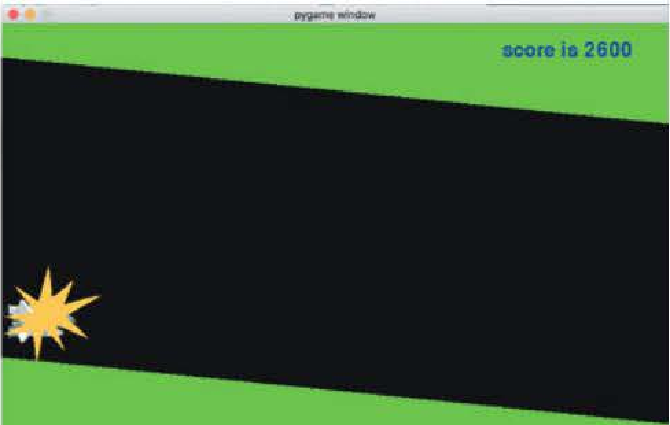

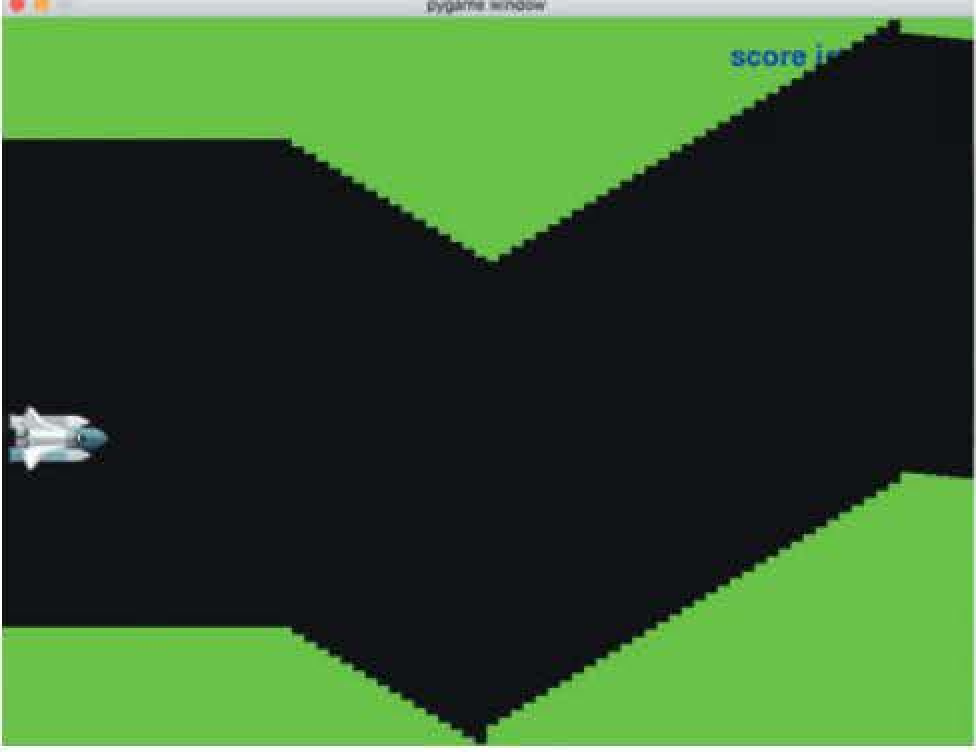

"""’.2600

###### 소스 코드<cave.py)

111111 cave - Copyright 2016 Kenichiro Tanaka import sys from random import randint import pygame from pygame.locals import QUIT, Rect, KEYDOWN, K SPACE

II II II

pygame . i nit () pygame .key. set repeat (5, 5)

###### 150 1PART 2.게임편

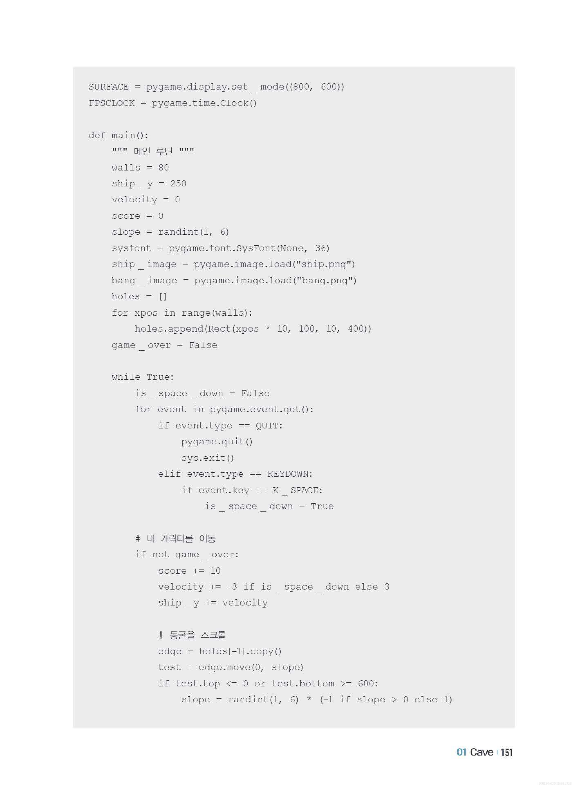

SURFACE = pygarne .display. set mode ((800, 600) ) FPSCLOCK = pygarne.tirne.Clock()

def main() :

" "" 메인 루틴 " ""

walls = 80 ship y = 250 velocity = 0 score 。 slope randint (1, 6) sysfont = pygarne.font. SysFont (None, 36) ship —image = pygarne.irnage.load("ship.png")

bang image = pygame.image.load("bang.png") holes = [] for xpos in range (walls) :

holes.append(Rect(xpos * 10, 100, 10, 400)) game over = False

while True:

is space —down = False

for event in pygame .event.get() :

if event.type == QUIT : pygame .quit () sys .exit()

elif event.type == KEYDOWN:

if event. key == K SPACE: is space down = True

# 내 캐릭터를 이동

if not game over: score += 10 velocity += - 3 if is space down else 3 ship y += velocity

# 동굴을 스크롤

edge = holes[-1] .copy() test = edge.move(O, slope) if test.top <= 0 or test.bottom >= 600:

slope = randint(l, 6) * (-1 if slope > 0 else 1)

###### 01 Cave 1151

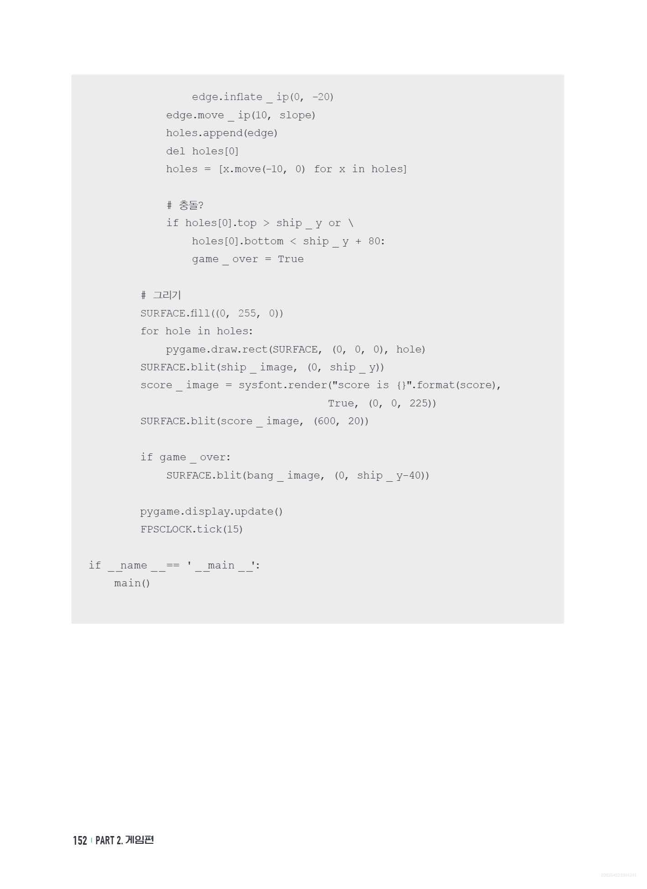

edge .inflate ip(O, - 20) edge .move ip (lO, slope) holes .append(edge) del holes [0] holes = [x.rnove(-10, 0) for x in holes]

# 충돌?

if holes [0] .top > ship y or \ holes[O] .bottom < ship _ y + 80: game over = True

# 그리기

SURFACE .fill((O, 255, 0)) for hole in holes :

pygarne .draw.rect(SURFACE, (0, 0, 0), hole) SURFACE.blit (ship image, (0, shi p y) ) score i mage = sysfont.render("score is {}".forrnat(score),

True, (0, 0, 225) ) SURFACE.blit (score image, (600, 20) )

if game over: SURFACE .blit(bang _ image, (0, ship _ y- 40))

pygame .display.update () FPSCLOCK.tick (15)

’ main• ’..

if name main()’

###### 152 1PART 2. 게임펀

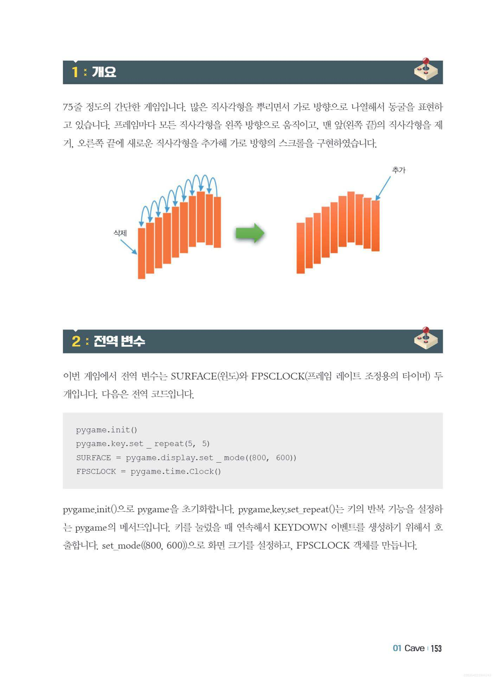

75줄 정도의 간단한 게임입니다. 많은 직사각형을 뿌리면서 가로 방향으로 나열해서 동굴을 표현하

###### 고 있습니다. 프레임마다 모든 직사각형을 왼쪽 방향으로 움직이고, 맨 앞(왼쪽 끝)의 직사각형을 제

###### 거, 오른쪽 끝에 새로운 직사각형을 추가해 가로 방향의 스크롤을 구현하였습니다.

추7~

째\

人

「

###### 이번 게임에서 전역 변수는 SURFACE(윈도)와 FPSCLOCK(프레임 례이트 조정용의 타이머) 두

개입니다. 다음은 전역 코드입니다.

pygame .init () pygame .key.set repeat(5, 5) SURFACE = pygame.display.set mode((BOO, 600)) FPSCLOCK = pygame.time.Clock()

###### pygame.initO으로 pygame을 초기화합니다. pygame.key.set―repeatO는 키의 반복 기능을 설정하

는 pygame의 메서드입니다. 키를 눌렀을 때 연속해서 KEYDOWN 이벤트를 생성하기 위해서 호 출합니다. set_mode((800, 600))으로 화면 크기를 설정하고. FPSCLOCK 객체를 만듭니다.

###### 01 Cave 1 153

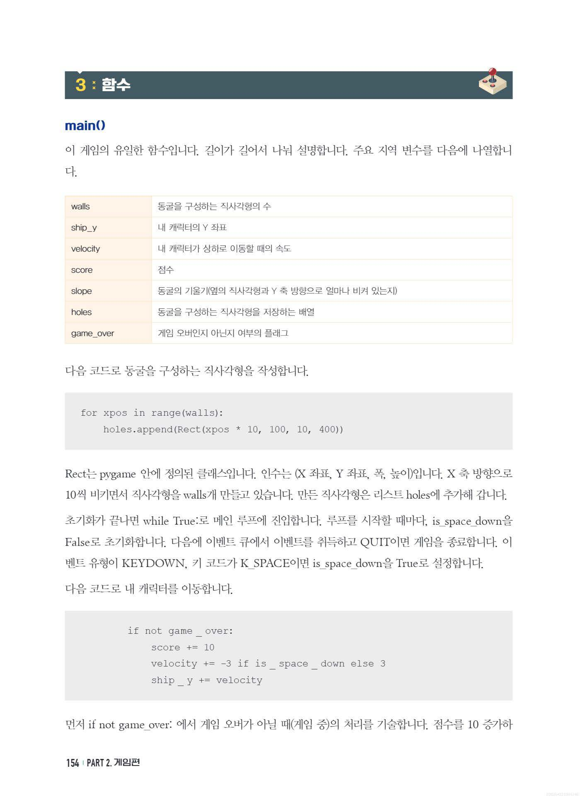

###### mainO

이 게임의 유일한 함수입니다. 길이가 길어서 나눠 설명합니다. 주요 지역 변수를 다음에 나열합니

다.

walls ship_y velocity score slope holes game_over

동굴을 구성하는 직사각형의 수

내 캐릭 터의 Y 좌표

내 캐릭 터가 상하로 이동할 때의 속도

점수

동굴의 기울기(옆의 직사각형과 Y 축 방항으로 얼마나 비켜 있는지)

동굴을 구성하는 직사각형을 저장하는 배열

게임 오버인지 아닌지 여부의 플래그

다음 코드로 동굴을 구성하는 직사각형을 작성합니다.

for xpos in range (walls) :

holes.append(Rect(xpos * 10, 100, 10, 400))

Rect는 pygame 인에 정의된 클래스입니다. 인수는 (X 좌표. Y 좌표, 폭, 높이)입니다. X 축 방향으로

10씩 비키면서 직사각형을 walls개 만들고 있습니다. 만든 직사각형은 리스트 holes에 추가해 갑니다.

초기화가 끝나면 while True:로 메인 루프에 진입합니다. 루프를 시작할 때마다, is_space_down을 False로 초기화합니다. 다음에 이벤트 큐에서 이벤트를 취독하고 QUIT이면 게임을 종료합니다. 이 벤트 유형이 KEYDOWN, 키 코드가 K_SPACE이면 is_space_down을 True로 설정합니다.

다음 코드로 내 캐릭터를 이동합니다.

if not game _ over: score += 10 velocity += - 3 if is space _ down else 3 ship _ y += velocity

먼저 if not game—9ver: 에서 게임 오버가 아닐 때(게임 중)의 처리를 기술합니다. 점수를 10 증가하

###### 154 1PART 2.게임펀

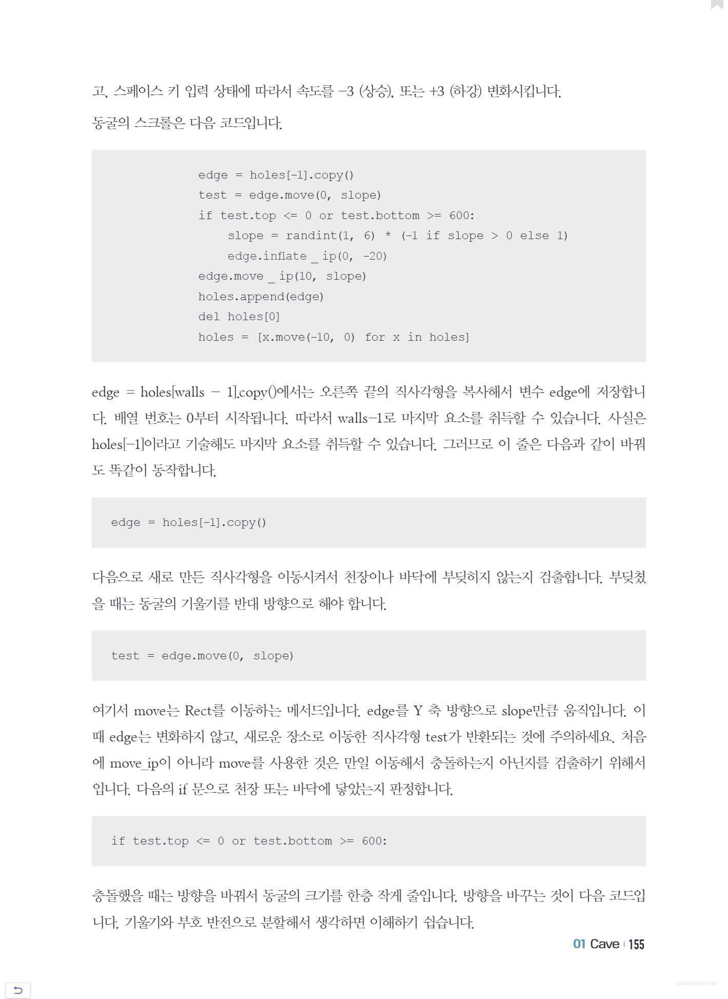

고, 스페이스 키 입력 상태에 따라서 속도를 —3 (상승), 또는 +3 (하강) 변화시킵니다.

동굴의 스크롤은 다음 코드입니다.

edge = holes[-1] .copy() test = edge.move(O, slope) if test.top <= 0 or test.bottom >= 600:

slope = randint(1, 6) * (-1 if slope > 0 else 1)

edge.inflate ip(O, - 20) edge.move ip(lO, slope) holes .append(edge) del holes [OJ holes = [x.move (-10, 0) for x in holes]

###### edge =holes[walls —1]．copy0에서는 오른쪽 끝의 직사각형을 복사해서 변수 edge에 저장합니

다. 배열 번호는 0부터 시작됩니다. 따라서 walls―1로 마지막 요소를 취독할 수 있습니다. 사실은 holes[―1]이라고 기술해도 마지막 요소를 취득할 수 있습니다. 그러므로 이 줄은 다음과 같이 바꿔 도똑같이동작합니다.

###### edge = holes [- 1] .copy()

다음으로 새로 만든 직사각형을 이동시켜서 천장이나 바닥에 부딪히지 않는지 검출합니다. 부딪쳤 을 때는 동굴의 기울기를 반대 방향으로 해야 합니다.

###### test = edge.rnove(O, slope)

여기서 1nove는 Rect를 이동하는 메서드입니다. edge를 Y 축 방향으로 slope만큼 움직입니다. 이 때 edge는 변화하지 않고, 새로운 장소로 이동한 직사각형 test가 반환되는 것에 주의하세요. 처음 에 move_ip이 아니라 move를 사용한 것은 만일 이동해서 충돌하는지 아닌지를 검출하기 위해서 입니다. 다음의 if 문으로 천장 또는 바닥에 낳았는지 판정합니다.

###### i f test.top <= 0 or test.bottom >= 600:

충돌했을 때는 방향을 바꿔서 동굴의 크기를 한층 작게 줄입니다. 방향을 바꾸는 것이 다음 코드입 니다. 기울기와 부호 반전으로 분할해서 생각하면 이해하기 쉽습니다.

###### 01 Cave 1 155

=

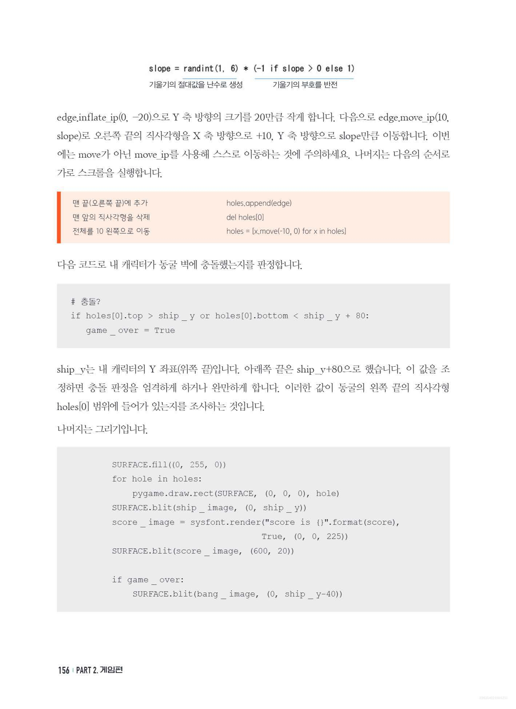

0 * (-1 if sIope >0 eIse 1)

slope = randint(l,

7|울71의 절대값을 난수로 생성 71울71의 부호를 반전

###### edge.inflate_ip(O, ―20)으로Y 축 방향의 크기를 20만큼 작게 합니다. 다음으로 edge.move—ip(lO,

slope)로 오른쪽 끝의 직사각형을 X 축 방향으로 十10, Y 축 방향으로 slope만큼 이동합니다. 이번 에는 move가 아닌 move_ip를 사용해 스스로 이동하는 것에 주의하세요. 나머지는 다음의 순서로 가로 스크롤을 실행합니다.

holes.append(edge) del holes[O] holes = [x.move(-10, 0) for x in holes]

맨 끝(오른쪽 끝)에 주가 맨앞의 직사각령을 삭제

전제를 10 왼쪽으로 이동

다음 코드로 내 캐릭터가 동굴 벽에 충돌했는지를 판정합니다.

# 충돌?

hol es[O].bottom < shi p y + 80:

i f hol es[OJ .t op >

ship y or True

game over =

###### ship―y는 내 캐릭터의 Y 좌표(위쪽 끝)입니다. 아래쪽 끝은 ship_y+80으로 했습니다. 이 값을 조

정하면 충돌 판정을 엄격하게 하거냐 완만하게 합니다. holes[이 범위에 들어가 있는지를 조사하는 것입니다. 냐머지는 그리기입니다.

이러한 값이 동굴의 왼쪽 끝의

직사각형

SURFACE.fill ((0, 255, f or hol e i n hol es :

0) )

###### o,

###### pygame .draw.rect (SURFACE, SURFACE.blit(shi p i mage, score i mage

hol e)

(0,

0) ,

shi p y)) i s

(0,

{}". f or mat(scor e) ,

sysf ont.r ender("score True,

o, 225) )

(0,

SURFACE.blit (score —image, (600, 20))

if game over: SURFACE .blit(bang image, (0, shi p y- 40) )

###### 156 1PART 2. 게임펀

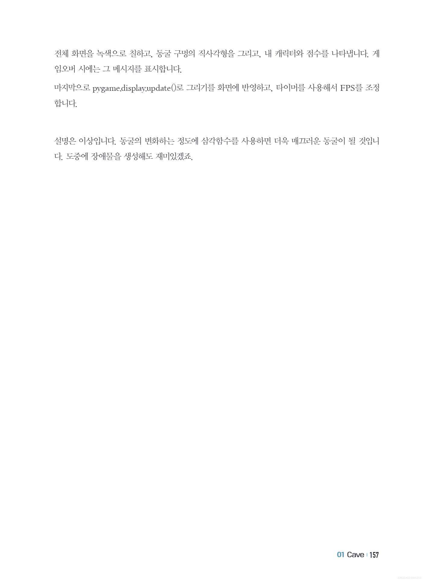

전체 화면을 녹색으로 질하고, 동굴 구멍의 직사각형을 그리고, 내 캐릭터와 점수를 나타냅니다. 게 임오버 시에는 그 메시지를 표시합니다.

###### 마지막으로 pygame.display.update0로 그리기를 화면에 반영하고, 타이머를 사용해서 FPS를 조정

###### 합니다.

설명은 이상입니다. 동굴의 변화하는 정도에 삼각함수를 사용하면 더욱 매끄러운 동굴이 될 것입니

다. 도중에 장애물을 생성해도 재미있겠죠.

###### 01 Cave 1 157

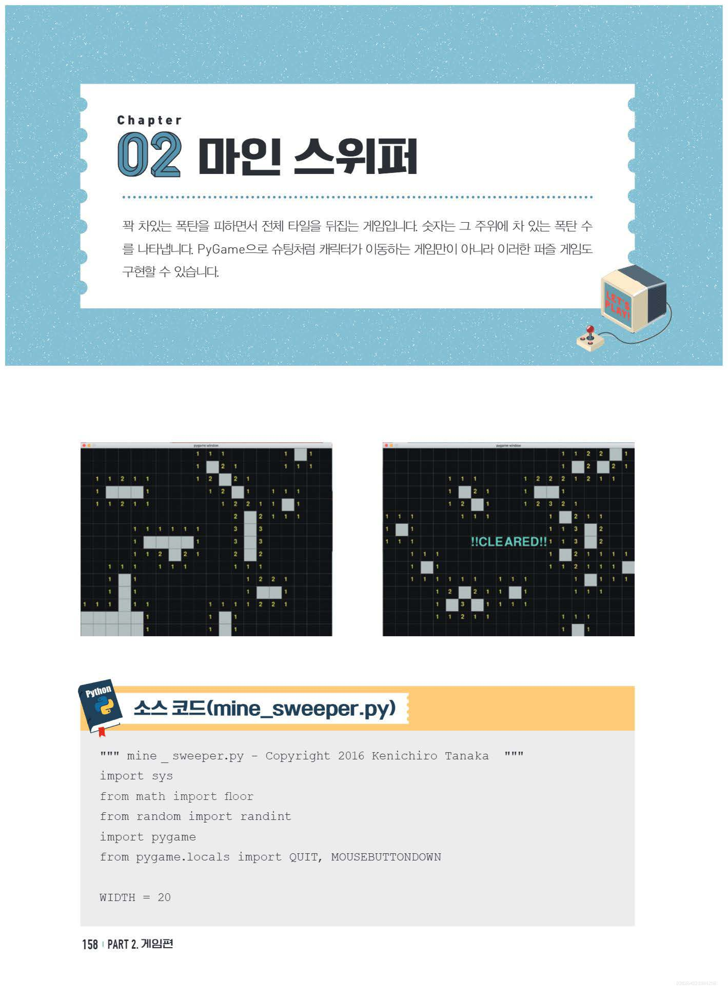

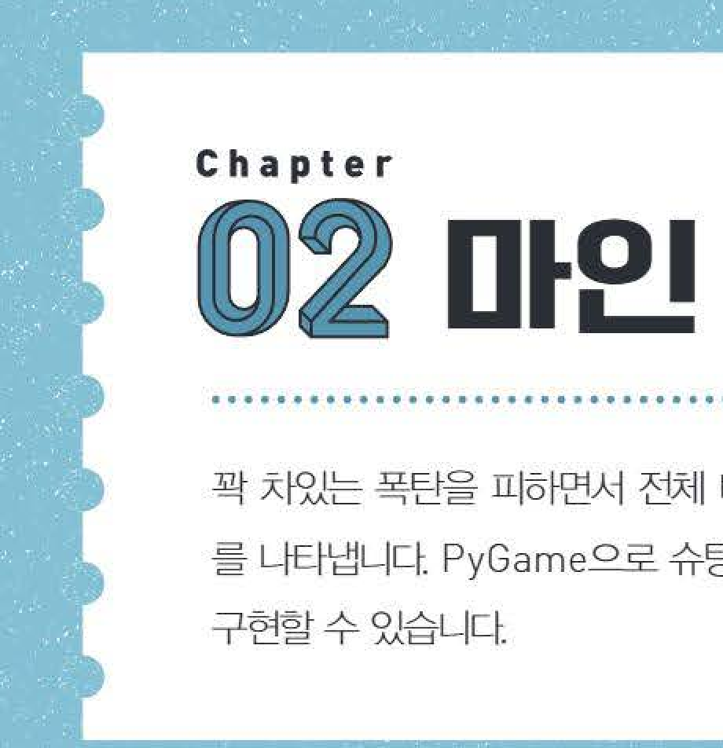

Chapte 『

••••••••••••••••••••••••••••••••••••••••••••••••••••••••••••••••••••••••••••••••••••••••

###### 꽉 차있는 폭탄을 피하면서 전체 타일을 뒤집는 게임입니다. 숫자는 그 주위에 차 있는 폭탄 수

를 나타냅니다. PyGame으로 슈팅처럼 캐릭터가 이동하는 게임만이 아니라 이러한 퍼즐 게임도 구현할수있습니다.

t3

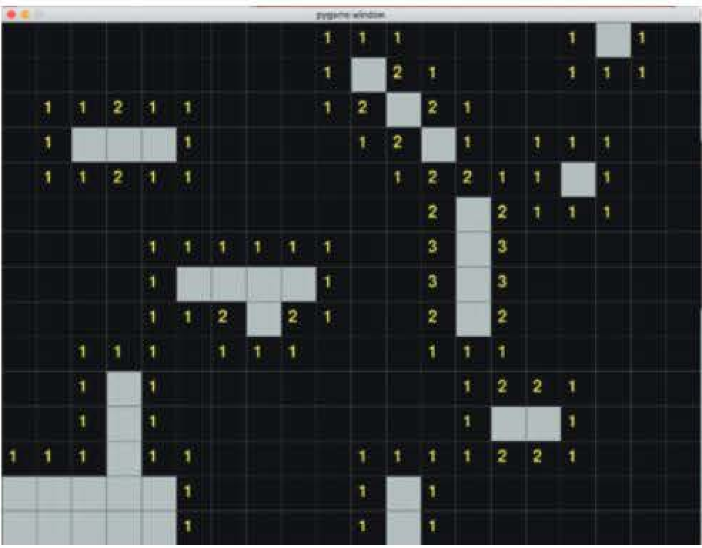

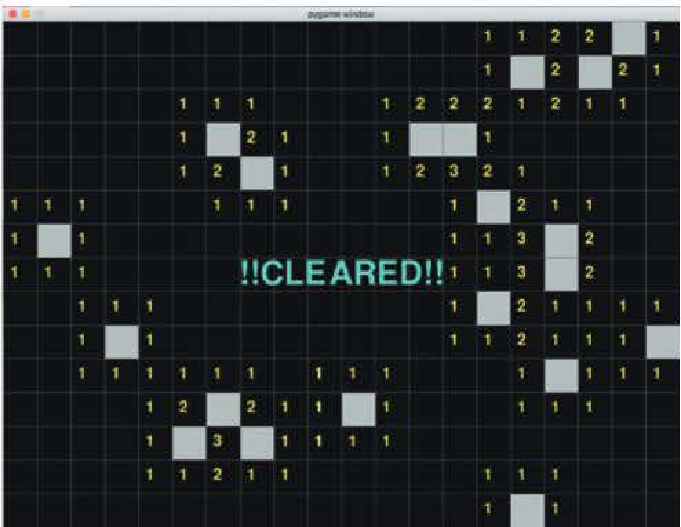

소스 코드{mine_sweeper.py)

IIIIII mlne• sweeper.py - Copyright 2016 Kenichiro Tanaka

II II II

import sys from math import floor from random i mport randint import pygame from pygame .locals import QUI T, MOUSEBUTTONDOWN

WI DTH = 20

###### 158 1PART 2.게임펀

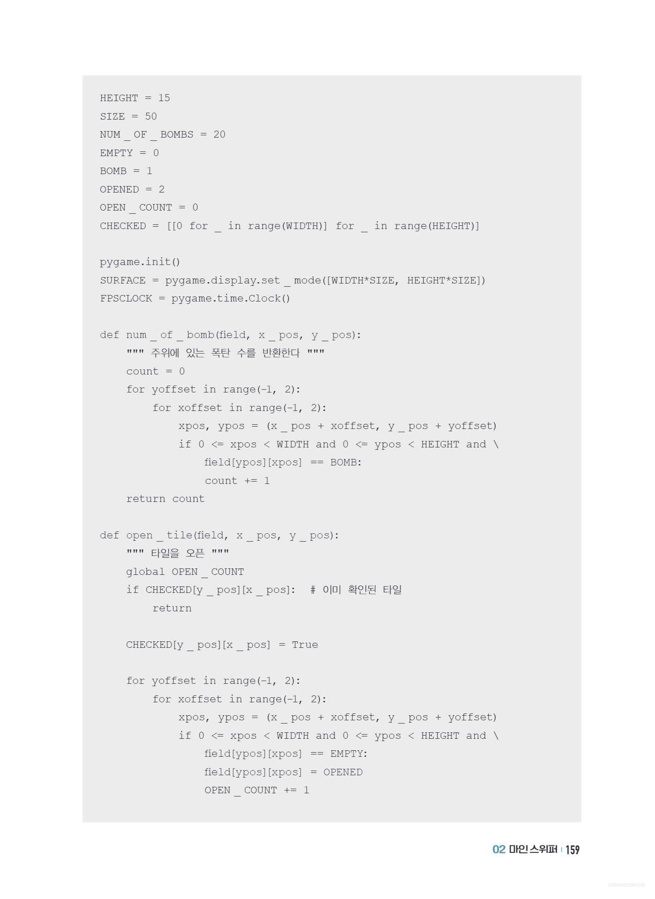

HEI GHT = 15 SI ZE = 50 NUM OF BOMBS = 20 EMPTY = 0 BOMB = 1 OPENED = 2 OPEN COUNT = 0 CHECKED = [ [0 for in range (WIDTH) ] for in range (HEI GHT) ]

pygame .i nit () SURFACE = pygame.di splay. set mode([WIDTH*SIZE, HEI GHT*SIZE] ) FPSCLOCK = pygame.time.Clock()

def num of bomb(field, x pos, y _ pos) :

""“ 주위에 있는 폭탄 수를 반환한다 """

count = 0

for yoffset i n range (- 1, 2) : for xoffset in range (-1, 2) :

xpos, ypos = (x pos + xoff set, y _ pos + yof fset) if O <= xpos < WIDTH and O <= ypos < HEI GHT and \

field [ypos] [xpos] == BOMB:

count += 1 return count

def open _ tile (field, x pos, y _ pos) :

""" 타일을 오픈 """

global OPEN COUNT

if CHECKED[y pos] [x pos] : # 이미 확인된 타일

###### return

CHECKED[y pos] [x pos] = True

for yoffset i n range (-1, 2) : for xoff set in range (-1, 2) :

xpos, ypos = (x pos + xoffset, y _ pos + yof fset) if O <= xpos < WIDTH and O <= ypos < HEI GHT and \

field [ypos] [xpos] == EMPTY:

field [ypos] [xpos] = OPENED

###### OPEN COUNT += 1

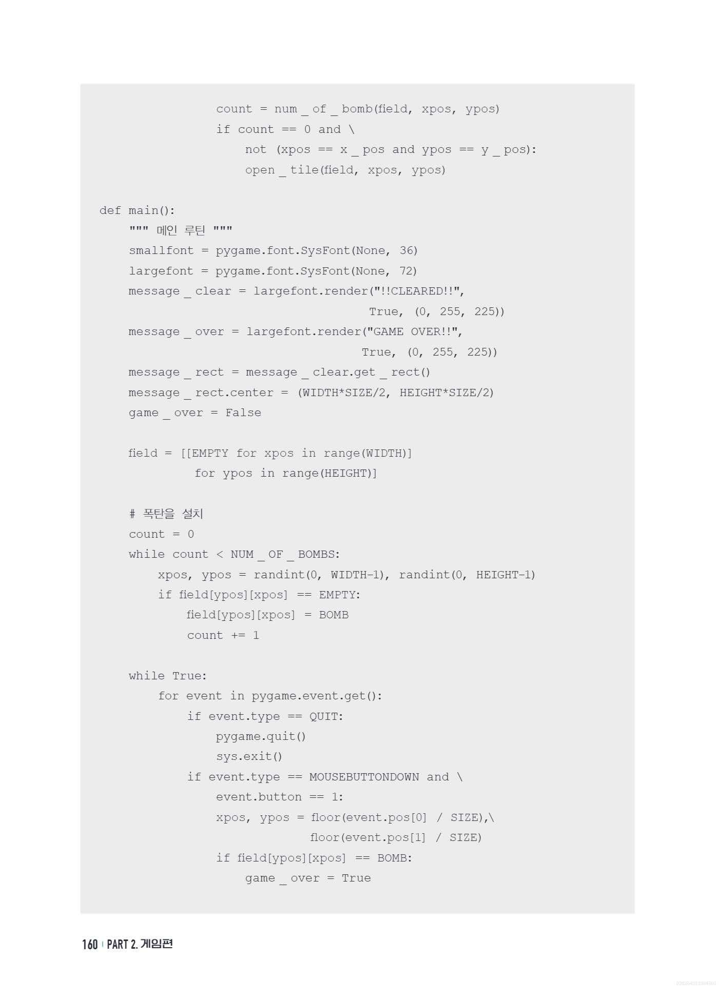

count = num of bomb (fiel d , xpos, ypos) i f count == 0 and \

not (xpos == x pos and ypos open tile (field, xpos, ypos)

y pos) :

def ma i n() :

IIIIII 메인 己티 """

十,_

small font = pygame . font. SysFont(None, 36) largefont = pygame. f ont .SysFont (None, 72) message _ c l ear = l argefont.render(" !!CLEARED!!",

True, (0, 255, 225) ) message over = l argef ont.render ("GAME OVER!!",

Tr ue, (0, 255, 225) ) message r ect = message c l ear.get rect() message r ect.center = (WIDTH*SIZE/2, HEIGHT*SIZE/2) game over = Fal se

field = [[EMPTY for xpos in range (WIDTH) ]

f or ypos in range (HEIGHT)]

# 폭탄을 설치

count = 0 while count < NUM OF BOMBS:

xpos, ypos = randi nt (0, WI DTH-1) , randi nt (0, HEIGHT- 1) i f field [ypos] [xpos] == EMPTY:

field[ypos] [xpos] = BOMB count += 1

while True: f or event in pygame.event .get() : if event .type == QUIT: pygame .qui t ()

sys .exi t()

if event .type MOUSEBUTTONDOWN and \ event.button == 1: xpos, ypos = floor(event.pos[O] / SI ZE),\

floor(event .pos[l] / SI ZE) if field[ypos] [xpos] == BOMB:

game over = True

160 1PART 2.게임편

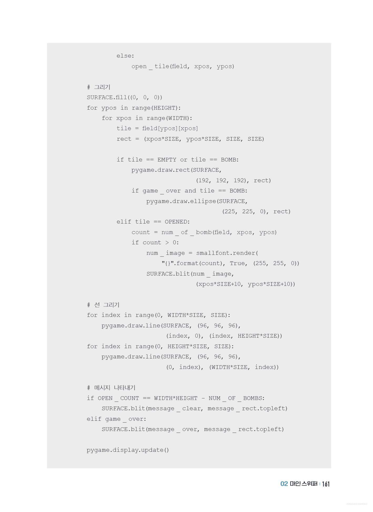

###### else: open tile (field, xpo s , ypos)

# 그리기

SURFACE.fill((0, 0, 0)) for ypos in range (HEIGHT) :

for xpos in range (WIDTH) :

tile = field[ypos] [xpos ]

rect = (xpos*SI ZE, ypos*SI ZE, SI ZE, SI ZE)

if tile == EMPTY or tile == BOMB:

pygarne .draw. rect (SURFACE, (192, 192, 192) , rect)

if game _ over and tile == BOMB:

pygarne.draw.ellipse (SURFACE, (225, 225, 0) , rect)

elif tile == OPENED: c ount = nurn of bomb (field, xpo s, ypos) if count > 0:

nurn _ i mage = smallfont.render(

"{}".forrnat(count), True, (255, 255, 0)) SURFACE .blit (nurn image,•

(xpos*SIZE+lO, ypos*SIZE+lO))

# 선 그리기

for index in range (0, WIDTH*SIZE, SI ZE) : pygame.draw.line (SURFACE, (96, 96, 96) ,

(index, 0) , (i ndex, HEIGHT*SI ZE) ) for index in range (0, HEIGHT*SI ZE, SI ZE) :

pygame.draw.line (SURFACE, (96, 96, 96) , (0, index) , (WIDTH*SI ZE, index) )

# 메시지 나타내기

if OPEN COUNT == WIDTH*HEIGHT - NUM _ OF BOMBS:

SURFACE.blit(rnessage —clear, message rect.topleft)

elif game _ over: SURFACE. blit (message _ over, message _ rect.topleft)

pygarne.display.update ()

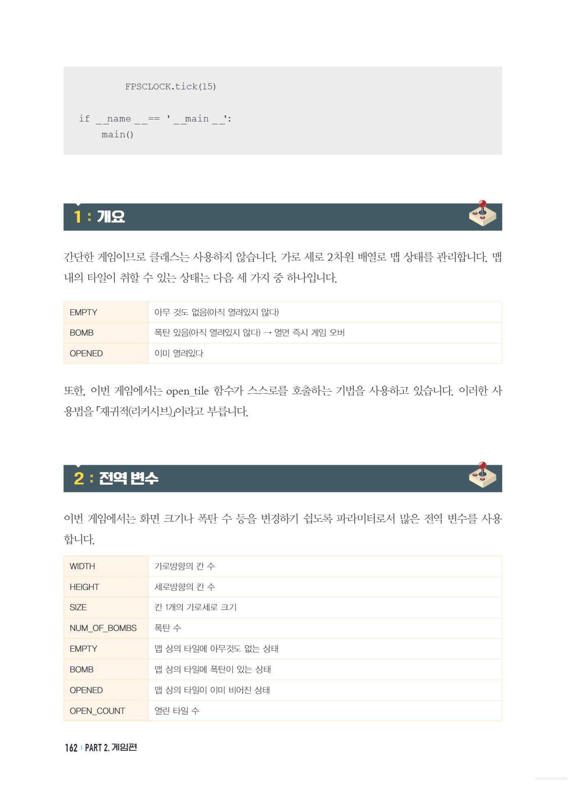

FPSCLOCK.tick (15)

I main•

if name main()’

I •

###### 간단한 게임이므로 클래스는 시용-하지 않습니다. 가로 세로 2자원 배열로 맵 상태를 관리합니다. 맵 내의 타일이 취할 수 있는 상태는 다음 세 가지 중 하나입니다.

###### EMPTY BOMB OPENED

아무 것도 없음(아직 열려있지 않다)

폭탄 있음(아직 열려있지 않다) 一 열먼 즉시 게임 오버

이미 열려있다

또한, 이번 게임에서는 open_tile 함수가 스스로를 호출하는 기법을 시용-하고 있습니다. 이러한 사

###### 용법을 「재귀적(리커시브)」이라고 부릅니다.

이번 게임에서는 화면 크기나 폭탄 수 등을 변경하기 쉽도록 파라미터로서 많은 전역 변수를 사용

###### 합니다.

WIDTH HEIGHT SIZE NUM_OF_BOMBS EMPTY BOMB OPENED OPEN_COUNT

가로방항의칸수

###### 세로방항의칸수

칸 1 개의 가로세로크기

폭탄수

###### 맵 상의 타일에 아무것도 없는 상태

맵 상의 타일에 폭탄이 있는 상태

맵 상의 타일이 이미 비어진 상태

###### 열린 타일수

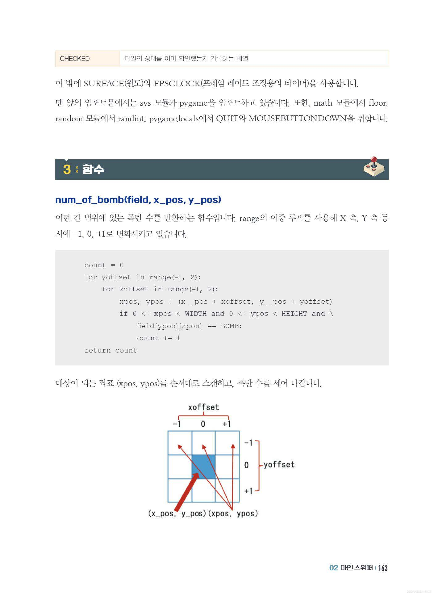

CHECKED 타일의 상태를 이미 확인했는지 기록하는 배열

###### 이 밖에 SURFACE(윈도)와 FPSCLOCK(프레임 레이트 조정용의 타이머)을 사용합니다.

맨 앞의 임포트문에서는 sys 모듈과 pygame을 임포트하고 있습니다. 또한 math 모듈에서 floor, random 모듈에서 randint, pygame.locals에서 QUIT와 MOUSEBUTTONDOWN을 취합니다.

###### num_of_bomb(field, x_pos, y_pos)

어떤 칸 범위에 있는 폭탄 수를 반환하는 함수입니다. range의 이중 루프를 사용해 X 축, Y 축 동

시에 —I, 0, +I로 변화시키고 있습니다.

count = 0 for yoffset in range (-1, 2) :

for xoffset in range (- 1, 2) :

xpos, ypos = (x pos + xoffset, y _ pos + yoffset) if O <= xpos < WIDTH and O <= ypos < HEIGHT and \

field[ypos] [xpos] = = BOMB: count += 1

return count

대상이 되는 좌표 (xpos, ypos)를 순서내로 스캔하고, 폭탄 수를 세어 나갑니다.

xoffset

`' +1

I 1

i

。

-o

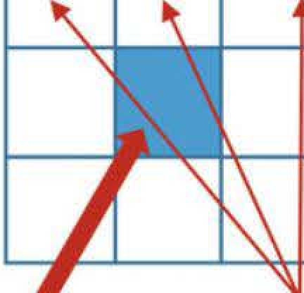

yoffset

+1

(x_pos~ y_pos) (xpos,· ypos)

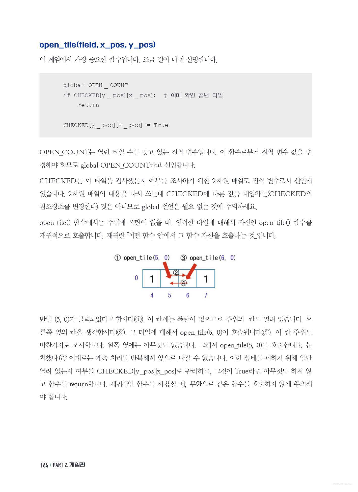

###### open_tile{field, x_pos, y_pos>

이 게임에서 가장 중요한 함수입니다. 조금 길어 나눠 설명합니다.

gl obal OPEN COUNT if CHECKED[y _ pos][x _ pos] : # 이미 확인 끝낸 타일

return

CHECKED[y pos] [x pos] = True

OPEN_COUNT는 열린 타일 수를 갖고 였는 전역 변수입니다. 이 함수로부터 전역 변수 값을 변 경해야 하므로 global OPEN_COUNT라고 선언합니다. CHECKED는 이 타일을 검사했는지 여부를 조사하기 위한 2차원 배열로 전역 변수로서 선언돼

있습니다. 2차원 배열의 내용을 다시 쓰는데 CHECKED에 다른 값을 대입하는(CHECKED의 참조장소를 변경한다) 것은 아니므로 global 선언은 필요 없는 것에 주의하세요. open_tileO 함수에서는 주위에 폭탄이 없을 때, 인접한 타일에 대해서 자신인 open_tileO 함수를

재귀적으로 호출합니다. 재귀란 「어떤 함수 안에서 그 함수 자신을 호출하는 것」입니다.

<D open_t i Ie(5, 0) @ open_t i Ie(6, 0)

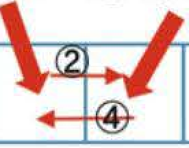

o I 1 1

4 5 6 7

만일 (5, 0)가 클릭되었다고 합시다(CD). 이 칸에는 폭탄이 없으므로 주위의 칸도 열려 있습니다. 오 른쪽 옆의 칸을 생각합시다(®). 그 타일에 대해서 open_tile(6, 0)이 호출됩니다(®). 이 칸 주위도 마찬가지로 조사합니다. 왼쪽 옆에는 아무것도 없습니다. 그래서 open—tile(S, 0)를 호출합니다. 눈

치겠나요? 이대로는 계속 처리를 반복해서 앞으로 냐갈 수 없습니다. 이런 상태를 피하기 위해 일단 열려 있는지 여부를 CHECKED[y_pos][X_pos]로 관리하고, 그것이 True라면 아무것도 하지 않 고 함수를 return합니다. 재귀적인 함수를 사용할 때, 무한으로 같은 함수를 호출하지 않게 주의해

###### 야합니다.

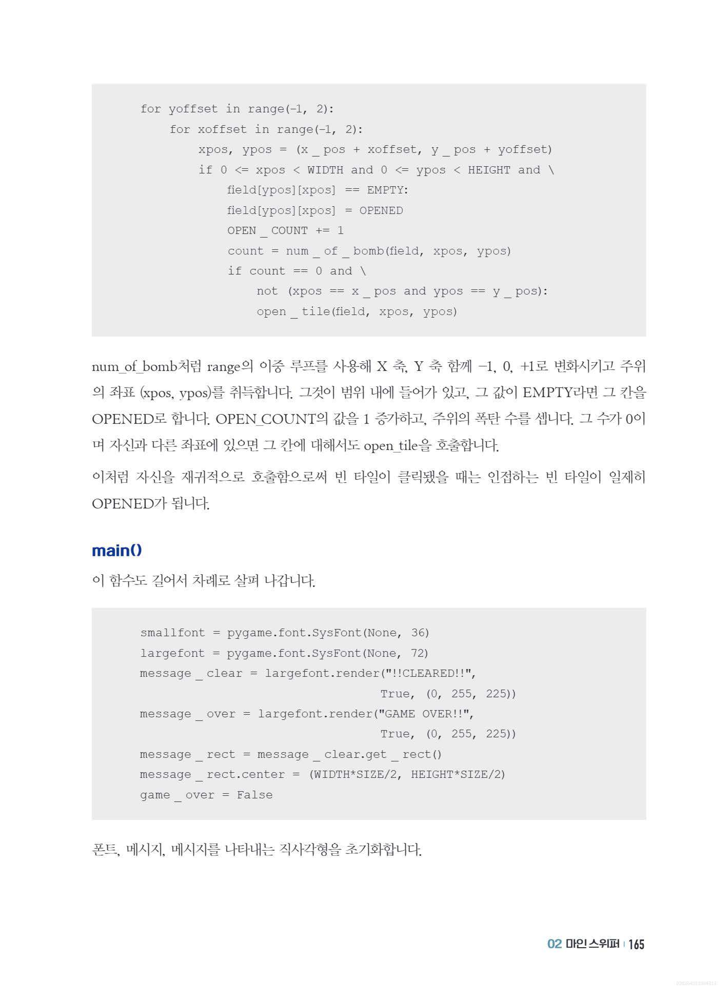

for yoffset i n range (-1, 2) : for xoffset in range (-1, 2) :

xpos, ypos = (x pos + xoffset, y pos + yoffset) if O <= xpos < WIDTH and O <= ypos < HEIGHT and \

field [ypos] [xpos] == EMPTY: field [ypos] [xpos] = OPENED OPEN _ COUNT += 1 count = nurn —of _ bornb(field, xpos, ypos) if count == 0 and \

not (xpos == x pos and ypos open tile (field, xpos, ypos)

y _ pos) :

num_of_bomb처럽 range의 이중 루프를 사용해 X 축, Y 축 함께 —1, 0, +1로 변화시기고 주위

###### 의 좌표 (xpos, ypos)를 취득합니다. 그것이 범위 내에 들어가 있고, 그 값이 EMPTY라면 그 칸을

OPENED로 합니다. OPEN_COUNT의 값을 1 증가하고, 주위의 폭탄 수를 솁니다. 그 수가 0이 며 자신과 다른 좌표에 있으면 그 칸에 대해서도 open_tile을 호출합니다. 이처럽 자신을 재귀적으로 호출함으로써 빈 타일이 클릭됐을 때는 인접하는 빈 타일이 일제히 OPENED가 됩니다.

###### mainO

이 함수도 길어서 차례로 살펴 나갑니다.

smallfont = pygame.font.SysFont(None, 36) largefont = pygame.font. SysFont(None, 72) message clear = largefont.render ("!!CLEARED! !",

True, (0, 255, 225) ) message over = largefont.render("GAME OVER! !",

True, (0, 255, 225) ) message rect = message clear.get rect () message rect.center = (WI DTH*SI ZE/2, HEIGHT*SIZE/2) game over = False

폰트, 메시지, 메시지를 나타내는 직사각형을 초기화합니다.

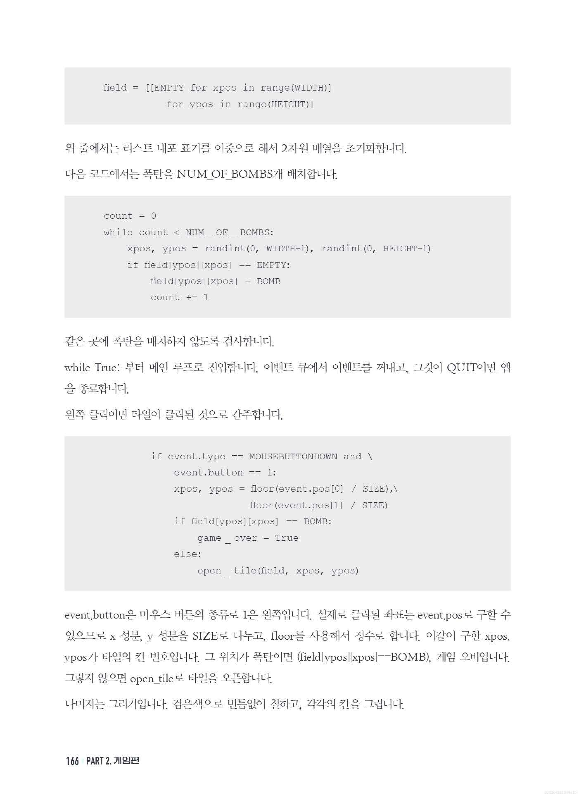

###### field = [ [EMPTY for xpos in range (WIDTH) ] for ypos in range (HEIGHT) ]

위 줄에서는 리스트 내포 표기를 이중으로 해서 2치~ 배열을 초기화합니다.

다음 코드에서는 폭탄을 NUM_OF_BOMBS개 배치합니다.

count = 0 while count < NUM OF BOMBS:

xpos, ypos = randint (0, WIDTH-1) , randint (0, HEIGHT- 1) if field[ypos] [xpos] == EMPTY:

field[ypos] [xpos] = BOMB count += 1

같은 곳에 폭탄올 배치하지 않도록 검사합니다. while True: 부터 메인 루프로 진입합니다. 이벤트 큐에서 이벤트를 꺼내고, 그것이 QUIT이면 앱 을종료합니다. 왼쪽 클릭이면 타일이 클릭된 것으로 간주합니다.

if event .type == MOUSEBUTTONDOWN and \ event.button == 1: xpos, ypos = floor (event.pos[O] / SI ZE) ,\

floor(event .pos[l] / SIZE) if field[ypos] [xpos] == BOMB:

game _ over = True else:

open tile (field, xpos, ypos)

event.button은 마우스 버튼의 종류로 1은 왼쪽입니다. 실제로 클릭된 좌표는 event.pos로 구할 수 있으므로 x 성분, y 성분을 SIZE로 나누고, floor를 사용해서 정수로 합니다. 이같이 구한 xpos, ypos가 타일의 칸 번호입니다. 그 위치가 폭탄이면 (field[ypos][xpos]==BOMB), 게임 오버입니다. 그렇지 않으면 open_tile로 타일을 오픈합니다.

나머지는 그리기입니다. 검은색으로 빈틈없이 질하고, 각각의 칸을 그립니다.

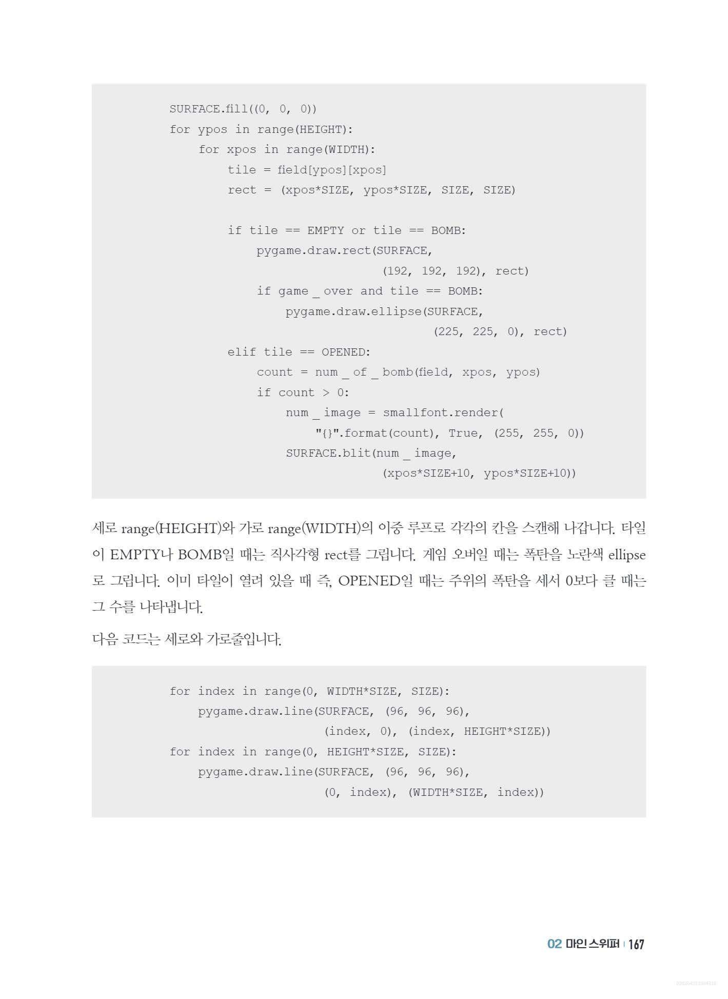

SURFACE.fill((0, 0, 0)) for ypos in range (HEIGHT) :

for xpos in range (WIDTH) : tile = field [ypos] [xpo s ] rect = (xpos*SI ZE, ypos*SI ZE, SI ZE, SI ZE)

if tile == EMPTY or tile == BOMB: pygame.draw. rect (SURFACE,

(192, 192, 192) , rect) if game _ over and tile == BOMB:

pygame .draw.ellipse (SURFACE, (225, 225, 0) , rect)

elif tile == OPENED: count = num of bomb(field, xpos, ypos) if count > 0:

num _image = smallfont.render(

"{}".format(count), True, (255, 255, 0)) SURFACE .blit (num image,

(xpos*SIZE+lO, ypos*SIZE+lO) )

###### 세로 range(HEIGHT)와 가로 range(WIDTH)의 이중 루프로 각각의 칸을 스캔해 냐갑니다. 타일

이 EMPTY나 BOMB일 때는 직사각형 rect를 그립니다. 게임 오버일 때는 폭탄을 노란색 ellipse 로 그립니다. 이미 타일이 열려 있을 때 즉, OPENED일 때는 주위의 폭탄을 세서 0보다 클 때는

###### 그수를나타냅니다.

다음 코드는 세로와 가로줄입니다.

for index in range (0, WIDTH*SIZE, SI ZE) : pygarne.draw.line (SURFACE, (96, 96, 96) ,

(index, 0) , (index, HEIGHT*SI ZE) ) for index in range (0, HEIGHT*SI ZE, SI ZE) :

pygarne.draw.line (SURFACE, (96, 96, 96) , (0, index) , (WIDTH*SI ZE, index) )

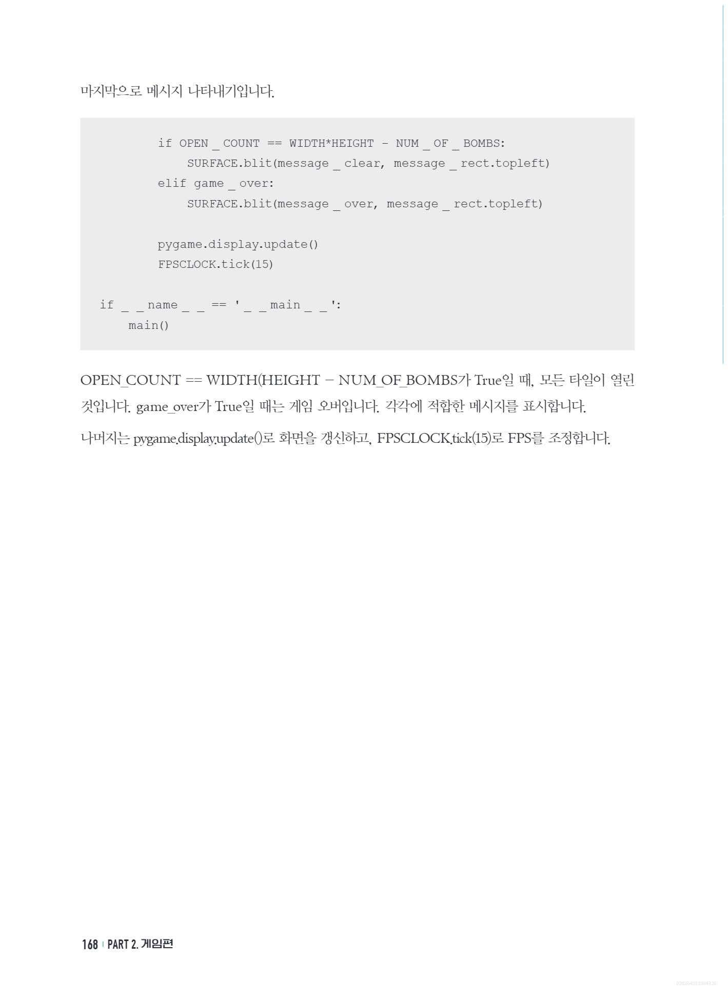

마지막으로 메시지 나타내기입니다.

if OPEN COUNT == WI DTH*HEIGHT - NUM _ OF _ BOMBS:

SURFACE.blit(message _ clear, message rect.topleft) elif game over:

SURFACE.blit(message _ over, message rect .topleft)

pygarne .display.update () FPSCLOCK.tick (15)

I maln• ’••

if name main()

OPEN_COUNT == WIDTH(HEIGHT —NUM_OF_BOMBS가True일 때, 모든 타일이 열린

것입니다. game_over가 True일 때는 게임 오버입니다. 각각에 적합한 메시지를 표시합니다.

###### 냐머지는 pygame.display:updateO로 화면을 갱신하고, FPSCLOCK.tick(15)로 FPS를 조정합니다.

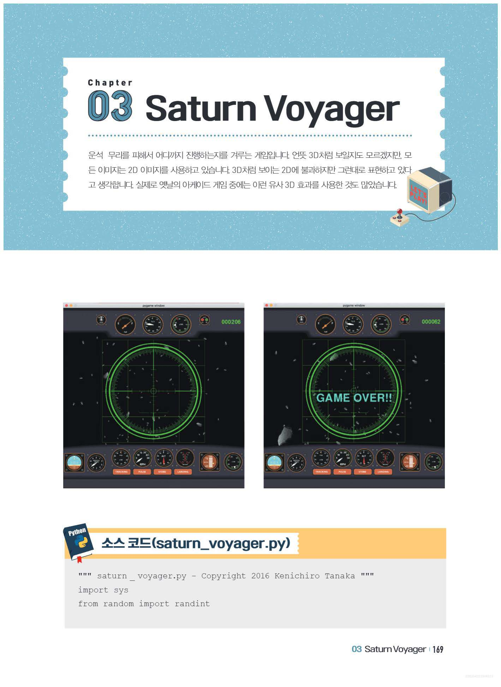

Chapte 『

。 er

••••••••••••••••••••••••••••••••••••••••••••••••••••••••••••••••••••••••••••••••••••••••

운석 무리를 피해서 어디까지 진행하는지를 겨루는 게임입니다 언뜻 30처럼 보일지도 모르겠지만 모

든 이미지는 20 이미자를 사용하고 있습니다 30처럼 보이는 20에 불과하지만 그런[店임 표현하고 있다

고생각합니다. 실저토옛날의 아케이드게임 중에는이런 유사 30 효고壇· 사용한것도 많았습니다

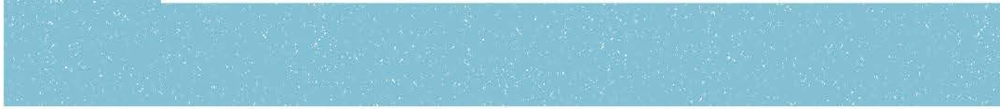

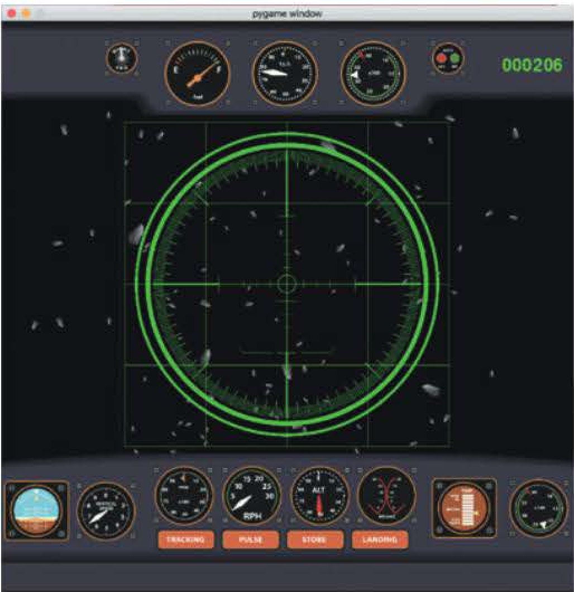

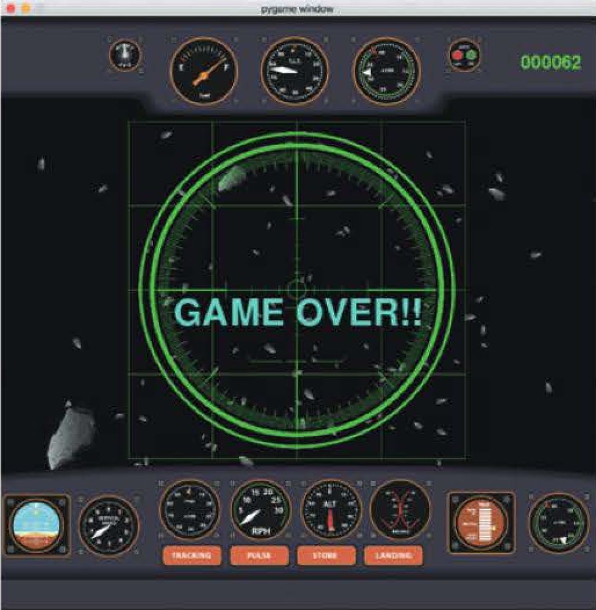

###### 소스 코드<saturn_voyager.py)

111111 saturn _ voyager.py - Copyright 2016 Keni chiro Tanaka 111111 import sys from random import randi nt

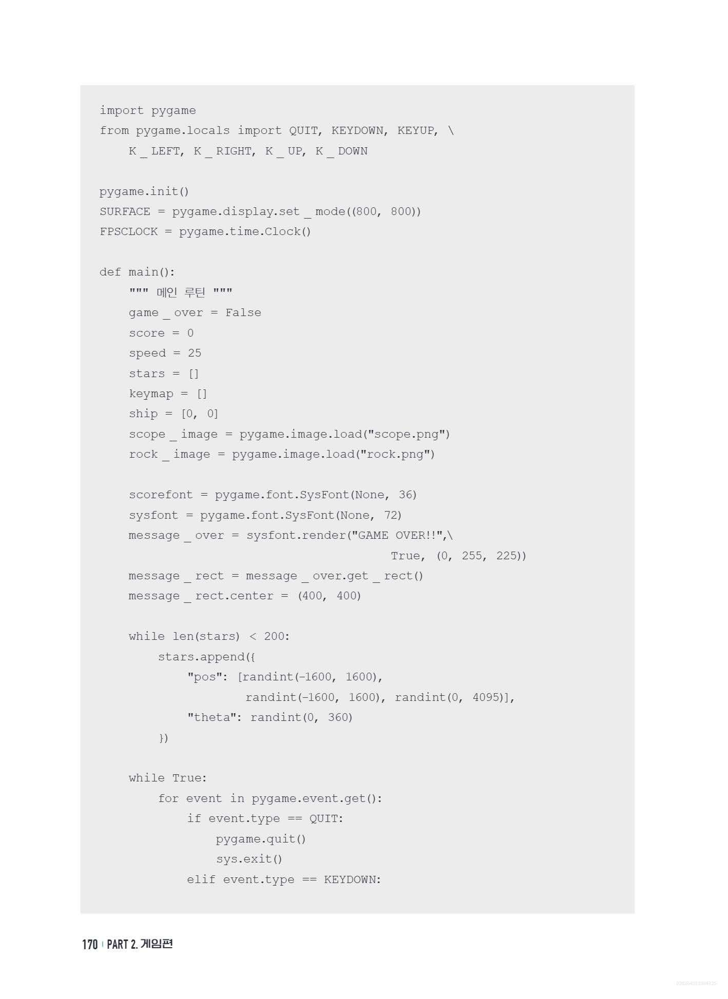

import pygame from pygame.local s import QUI T, KEYDOWN, KEYUP, \

###### K LEFT, K RIGHT, K UP, K DOWN

pygarne. i nit() SURFACE = pygarne .displ ay.set mode((800, 800)) FPSCLOCK = pygame.time.Clock()

def main() :

IIIIII 메인 루틴 II II II

game over = False score = 0 speed = 25 stars = [] keymap = [] ship = (0, 0) scope rock

image• image•

= pygame.i mage.load("s cope.png")

= pygame.image.load("rock.png")

scorefont = pygarne.font.SysFont(None, 36) sysfont = pygarne.font. SysFont(None, 72) message over = sysfont.render("GAME OVER!! ",\

True, (0, 255, 225) ) message _ rect = message _ over.get rect() message rect.center = (400, 400)

while len(stars) < 200: stars .append ({

"pos": [randint (-1600, 1600) ,

randint (-1600, 1600) , randint (0, 4095) ], "theta": randint (0, 360)

})

while True: f or event in pygame.event .get() :

i f event .type == QUIT: pygame .qui t() sys.exit()

elif event .type KEYDOWN:

###### 1701PART 2. 게임편

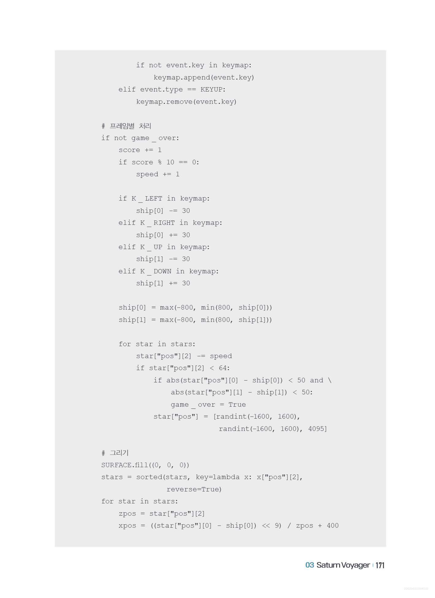

if not event. key in keymap:

keymap.append(event. key) elif event.type == KEYUP:

keymap.remove (event .key)

# 프레임별 처리

if not game _ over: score += 1 if score % 10 == 0: speed += 1

if K LEFT in keyrnap: ship[OJ -= 30

elif K—RIGHT in keyrnap:

ship [OJ += 30 elif K UP in keyrnap: ship [l] -= 30

elif K DOWN in keyrnap: ship [1] += 30

ship[O] = rnax(- 800, rni n (BOO, ship[O]) ) shi p[l] = rnax(-800, min(800, ship[1]))

for star in stars: star["pos"] [2] -= speed if star["pos"] [2] < 64:

if abs(star["pos"][0] - ship[O]) < 50 and \ abs(star["pos"] [1] — ship[l]) < 50: game over = True

star[ "pos"] = [randint(-1600, 1600), randi nt(-1600, 1600) , 4095]

# 그리기

SURFACE.fill ((0, 0, 0)) stars = sorted(stars, key=lambda x : x["pos"] [2],

###### reverse=True)

for star in stars : zpos = star["pos"] [2] xpos = ((star["pos"] [0] - ship[0]) << 9) / zpos + 400

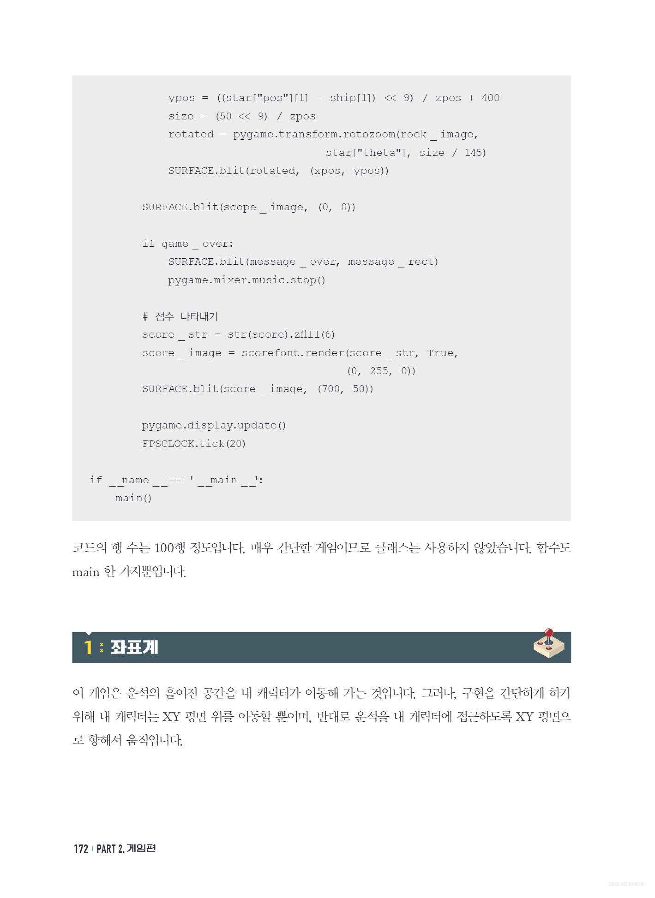

ypos = ((star["pos"] [1] - ship[1]) << 9) / zpos + 400 size = (50 << 9) / zpos rotated = pygarne.transform.rotozoorn(rock image,

star["theta" ], size / 145) SURFACE .blit(rotated, (xpos, ypos))

SURFACE.blit (scope image,• (0, 0) )

if game over: SURFACE .blit(message over, message rect) pygame .mixer.music. stop ()

# 점수 나타내기

score str = str(score) .zfill (6) score image = scorefont.render (score str, True,

(0, 255, 0) ) SURFACE.blit (score image, (700, 50) )

pygame .display.update O FPSCLOCK.tick (20)

I maln• ,.

if name main()•

코드의 행 수는 100행 정도입니다. 매우 간단한 게임이므로 클래스는 사용하지 않았습니다. 함수도

###### main 한 가지뿐입니다.

이 게임은 운석의 흩어진 공간을 내 캐릭터가 이동해 가는 것입니다. 그러나, 구현을 간단하게 하기 위해 내 캐릭터는 XY 평면 위를 이동할 뿐이며, 반대로 운석을 내 캐릭터에 접근하도록 XY 평면으 로향해서 움직입니다.

###### 172 1PART 2. 게임펀

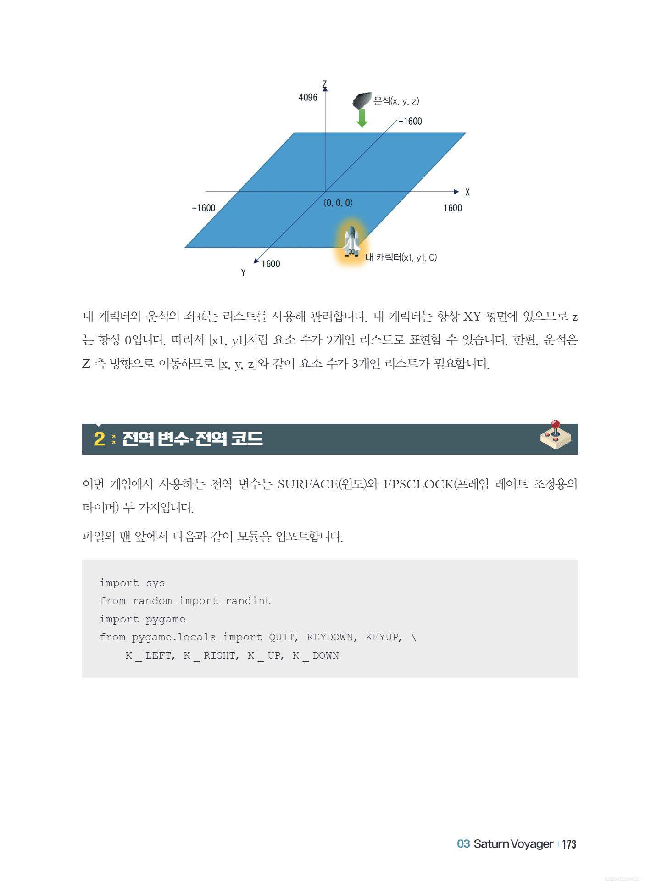

4096 운석(x. Y. z)

-1600

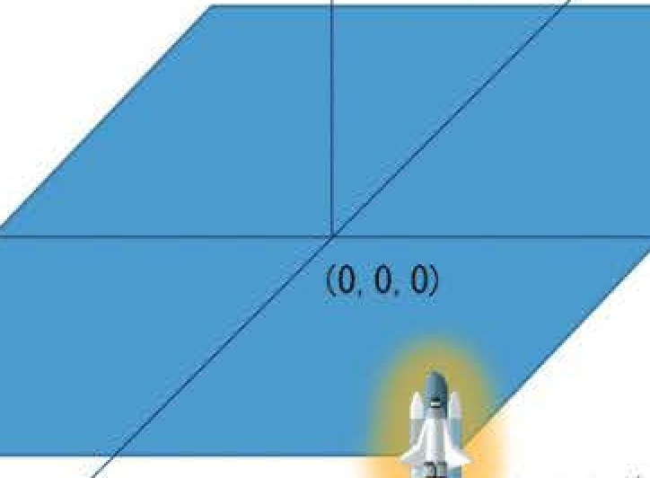

x

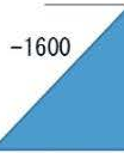

1600

---- 내 캐릭터(x1, y1, 0)

Y 1600

내 캐릭터와 운석의 좌표는 리스트를 사용해 관리합니다. 내 캐릭터는 항상 XY 평면에 있으므로 z 는 항상 0입니다. 따라서 [xl, yl]처럽 요소 수가 2개인 리스트로 표현할 수 있습니다. 한편. 운석은 Z 축 방향으로 이동하므로 [x, y, z]와 같이 요소 수가 3개인 리스트가 필요합니다.

이번 게임에서 사용하는 전역 변수는 SURFACE(윈도)와 FPSCLOCK(프레임 례이트 조정용의

- 타이머) 두 가지입니다.
- 파일의 맨 앞에서 다음과 같이 모듈을 임포트합니다.

import sys from random impor t r andi nt import pygame from pygame.locals import QUIT, KEYDOWN, KEYUP, \

K LEFT, K RI GHT, K UP, K DOWN

###### 03 SaturnVoyager 1 173

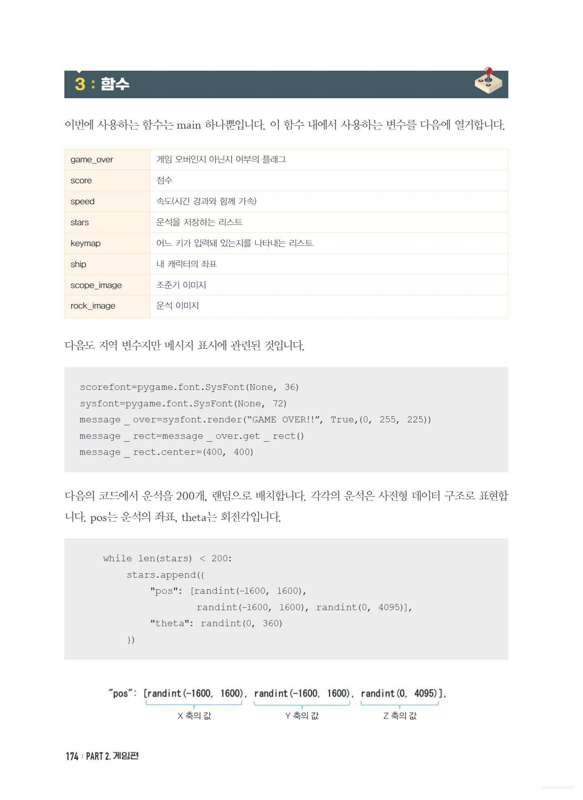

이번에 사용하는 함수는 main 하나뿐입니다. 이 함수 내에서 사용하는 변수를 다음에 열거합니다.

game_over score speed stars keymap ship scope_image rock_image

게임 오버인지 아닌지 여부의 플래그

점수

속도(시간 경과와 함께 가속)

운석을저장하는리스트

어느 키가 입력돼 있는지를 나타내는 리스트

내 캐릭터의 좌표

조준기 이미지

운석이미지

다음도 지역 변수지만 메시지 표시에 관련된 것입니다.

scoref ont=pygame . f ont.SysFont (None, 36) sysf ont=pygame .f ont. SysFont(None, 72) message over=sysfont.render("GAME OVER! !", True, (0, 255, 225)) message rect=message over.get rect () message rect.center= (400, 400)

다음의 코드에서 운석을 200개, 랜덤으로 배치합니다. 각각의 운석은 사전형 데이터 구조로 표현합

###### 니다. pos는 운석의 좌표, theta는 회전각입니다.

###### while len(stars) < 200: stars .append({

"pos" : [randint (-1600, 1600) ,

randi nt (-1600, 1600) , randint (0, 4095) ], "theta" : randint (0, 360)

})

###### "pos": [randint (-1600, 1600), rand int (-1600. 1600), randint (0. 4095)].

x축의값 Y축의값’ z축의값

###### 174 1PART 2.게임펀

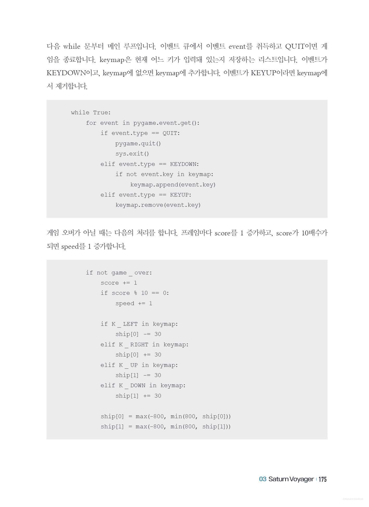

- 다음 while 문부터 메인 루프입니다. 이벤트 큐에서 이벤트 event를 취득하고 QUIT이면 게 임을 종료합니다. keymap은 현재 어느 키가 입력돼 있는지 저장하는 리스트입니다. 이벤트가 KEYDOWN이고, keymap에 없으면 keymap에 추가합니다. 이벤트가 KEYUP이라면 keymap에
- 서 제거합니다.

while True: for event in pygarne .event .get() :

if event.type == QUIT: pygarne .quit () sys .exit()

elif event.type == KEYDOWN: if not event.key i n keymap :

keyrnap .append(event.key) elif event.type == KEYUP:

keymap.remove (event .key)

게임 오버가 아닐 때는 다음의 처리를 합니다. 프레임마다 score를 1 증가하고, score가 10배수가 되면 speed를 1 증가합니다.

if not game over: score += 1 if score % 10 == 0: speed += 1

if K LEFT in keyrnap: ship [0] -= 30

elif K RIGHT in keyrnap:

ship[O] += 30 elif K UP in keyrnap: ship [1] -= 30

elif K_ DOWN i n keyrnap: ship[l] += 30

shi p[O] = rnax(- 800, mi n(800, ship[O])) ship[l] = rnax(- 800, rnin(BOO, ship[l]))

###### 03 SaturnVoyager 1 175

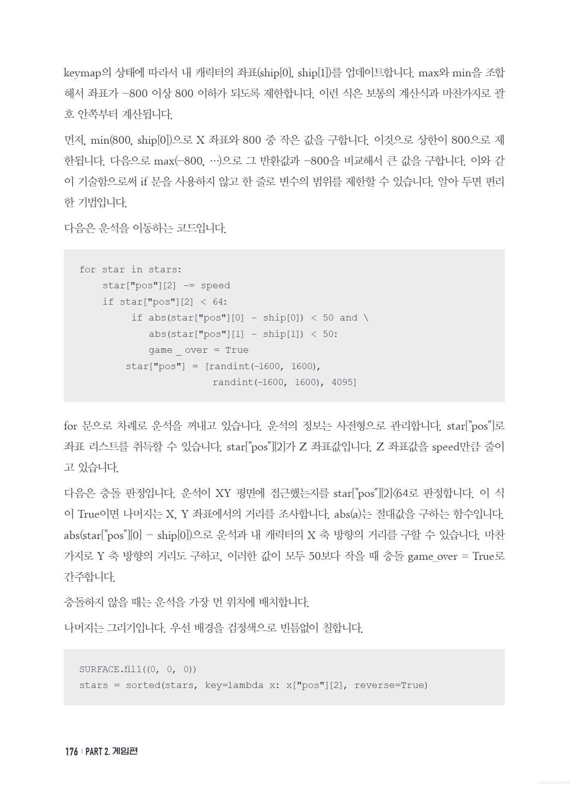

###### keymap의 상태에 따라서 내 캐릭터의 좌표(ship[이, ship[l]）를 업데이트합니다. max와 min을 조합

해서 좌표가 —800 이상 800 이하가 되도록 제한합니다. 이런 식은 보통의 계산식과 마찬가지로 괄

호 안쪽부터 계산됩니다.

먼저, min(800, ship[이)으로 X 좌표와 800 중 작은 값을 구합니다. 이것으로 상한이 800으로 제

한됩니다. 다음으로 max(—800, …)으로 그 반환값과 ―800을 비교해서 큰 값을 구합니다. 이와 같

이 기술함으로써 if 문을 사용하지 않고 한 줄로 변수의 범위를 제한할 수 있습니다. 알아 두면 편리

한기법입니다.

다음은 운석을 이동하는 코드입니다.

for star i n stars: star["pos"] [2] -= speed if star["pos"][2] < 64:

i f abs(star["pos"] [0] - ship[O]) < 50 and \ abs(star["pos"][l] - ship[l]) < 50: game over = True

star["pos"] = [randint(-1600, 1600), randint (-1600, 1600), 4095]

for 문으로 차례로 운석을 꺼내고 있습니다. 운석의 정보는 사전형으로 관리합니다. star["pos,']로

좌표 리스트를 취득할 수 있습니다. star["pos"][2]가 Z 좌표값입니다. Z 좌표값을 speed만콤 줄이

###### 고있습니다.

다음은 충돌 판정입니다. 운석이 XY 평면에 접근했는지를 star["pos"][2]〈64로 판정합니다. 이 식

이 True이면 나머지는 x. y 좌표에서의 거리를 조사합니다. abs(a)는 절대값을 구하는 함수입니다.

abs(star["pos"][O] —ship[O]）으로 운석과 내 캐릭터의 X 축 방향의 거리를 구할 수 있습니다. 마찬

가지로 Y 축 방향의 거리도 구하고, 이러한 값이 모두 50보다 작을 때 충돌 game_over =True로

간주합니다.

충돌하지 않을 때는 운석을 가장 먼 위치에 배치합니다.

냐머지는 그리기입니다. 우선 배경을 검정색으로 빈틈없이 칠합니다.

SURFACE.fill((O, 0, 0)) stars = sorted(stars, key=lambda x : x["pos"] [2], reverse=True)

###### 176 1PART 2.게임펀

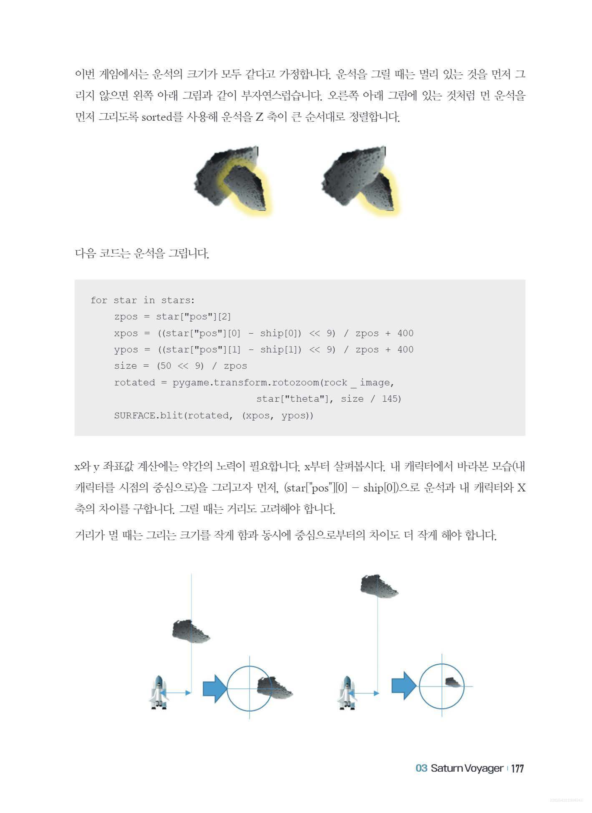

이번 게임에서는 운석의 크기가 모두 같다고 가정합니다. 운석을 그릴 때는 멀리 있는 것을 먼저 그 리지 않으면 왼쪽 아래 그림과 같이 부자연스럽습니다. 오른쪽 아래 그림에 있는 것처럽 먼 운석을 먼저 그리도록 s01ied를 사용해 운석을 Z 축이 큰 순서대로 정렬합니다.

다음 코드는 운석을 그립니다.

for star in stars: zpos = star["pos"][2] xpos = ((star["pos"] [OJ - shi p[O]) << 9) / zpos + 400 ypos = ((star["pos"][l] - ship[1] ) << 9) / zpos + 400 size = (50 << 9) / zpos rotated = pygame.transform.rotozoom(rock image,

star["theta"], size / 145) SURFACE.blit(rotated, (xpos, ypos))

x와 y 좌표값 계산에는 약간의 노력이 필요합니다. x부터 살펴봅시다. 내 캐릭터에서 바라본 모습(내

캐릭터를 시점의 중심으로)을 그리고자 먼저, (star[',POS"］［이 —ship[O])으로 운석과 내 캐릭터와 X

축의 차이를 구합니다. 그릴 때는 거리도 고려해야 합니다.

거리가 멀 때는 그리는 크기를 작게 함과 동시에 중심으로부터의 차이도 더 작게 해야 합니다.

-·

►

3

03 SaturnVoyager 1 177

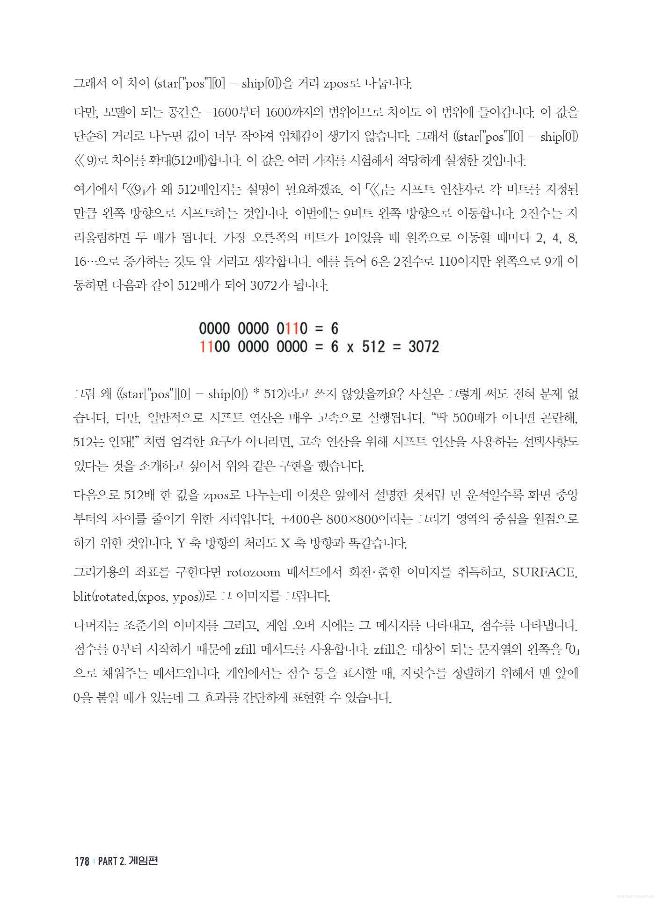

###### 그래서 이 차이 (star["pos’]［이 —ship[O]）을 거리 zpos로 냐눕니다.

다만, 모델이 되는 공간은 -1600부터 1600까지의 범위이므로 차이도 이 범위에 들어갑니다. 이 값을

###### 딘순히 거리로 나누면 값이 너무 작아져 입체갑이 생기지 않습니다. 그래서 ((star「'Pos'J[O] —ship[O])

###### << 9)로 자이를 확대(512배)합니다. 이 값은 여러 가지를 시험해서 적당하게 설정한 것입니다.

여기에서 「〈〈97} 왜 512배인지는 설명이 필요하겠죠. 이 「〈Q는 시프트 연산자로 각 비트를 지정된 만큼 왼쪽 방향으로 시프트하는 것입니다. 이번에는 9비트 왼쪽 방향으로 이동합니다. 2진수는 자 리올림하면 두 배가 됩니다. 가장 오른쪽의 비트가 1이었을 때 왼쪽으로 이동할 때마다 2, 4, 8, 16·· 으로 증가하는 것도 알 거라고 생각합니다. 예를 들어 6은 2진수로 110이지만 왼쪽으로 9개 이 동하면 다음과 같이 512배가 되어 3072가 됩니다.

0000 0000 0110 = 6

1100 0000 0000 =6 X 512 =3072

그럽 왜 ((star["pos”]［이 —ship[이) * 512)라고 쓰지 않았을까요? 사실은 그렇게 써도 전혀 문재 없

습니다. 다만, 일반적으로 시프트 연산은 매우 고속으로 실행됩니다. “딱 500배가 아니면 곤란해, 512는 안돼!” 처럼 엄격한 요구가 아니라면, 고속 연산을 위해 시프트 연산을 사용하는 선택사항도 있다는 것을 소개하고 싶어서 위와 같은 구현을 했습니다.

다음으로 512배 한 값을 zpos로 나누는데 이것은 앞에서 설명한 것처럽 먼 운석일수록 화면 중앙 부터의 차이를 줄이기 위한 처리입니다. +400은 800X800이라는 그리기 영역의 중심을 원점으로 하기 위한 것입니다. Y 축 방향의 처리도 X 축 방향과 똑같습니다.

그리기용의 좌표를 구한다면 rotozoom 메서드에서 회전·줌한 이미지를 취독하고, SURFACE. blit(rotated,(xpos, ypos)）로 그 이미지를 그립니다. 냐머지는 조준기의 이미지를 그리고, 게임 오버 시에는 그 메시지를 나타내고, 점수를 나타냅니다.

점수를 0부더 시작하기 때문에 zfill 메서드를 사용합니다. zfill은 대상이 되는 문자열의 왼쪽을 「0」 으로 재워주는 메서드입니다. 게임에서는 점수 둥을 표시할 때, 자릿수를 정렬하기 위해서 맨 앞에 0을 붙일 때가 있는데 그 효과를 간단하게 표현할 수 있습니다.

###### 178 1PART 2. 게임펀

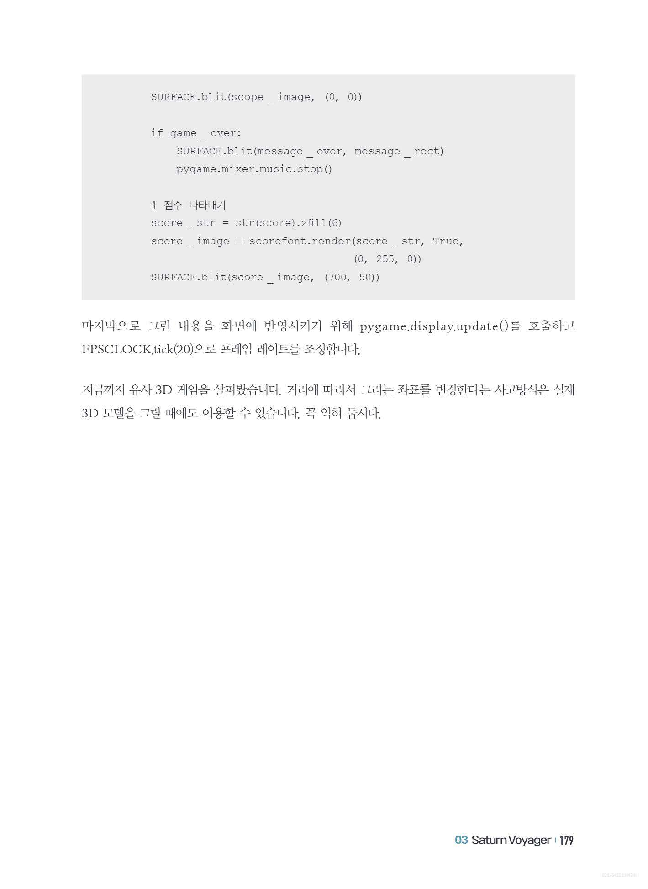

SURFACE.blit(scope image,• (0, 0))

if game over: SURFACE.bli t(message over, message rect) pygame.mixer.music .stop ()

# 점수 나타내기

score str = str(score) .zfill(6) score image = scorefont.render(score str, True,

(0, 255, 0) ) SURFACE .blit(score image, (700, 50) )

###### 마지막으로 그린 내용을 화면에 반영시키기 위해 pygame.display.update(）를 호출하고 FPSCLOCK.tick(20)으로 프레임 례이트를 조정합니다.

지금까지 유사 3D 게임을 살펴봤습니다. 거리에 따라서 그리는 좌표를 변경한다는 사고빙식은 실제 3D 모델을 그릴 때에도 이용할 수 있습니다. 꼭 익혀 둡시다.

###### 03 SaturnVoyager 1 179

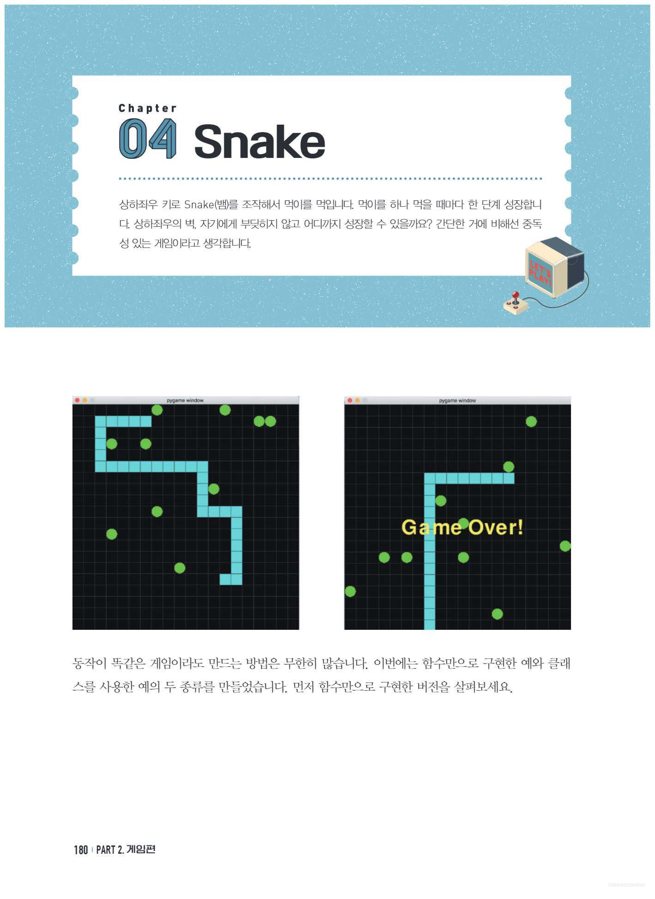

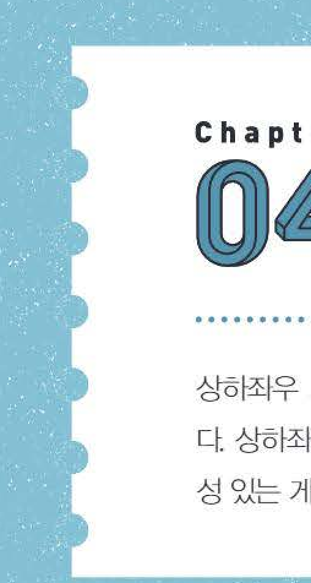

Chapte 『

na

••••••••••••••••••••••••••••••••••••••••••••••••••••••••••••••••••••••••••••••••••••••••

###### 상하좌우 키로 Snake(뱀遷戶E작해서 먹이를 먹입니다 먹이를 하나 먹을 때Oj-C~ 한 단계 성장합니 다 상하좌우의 벽, 자기에게 부딪히지 않고 어디까지 성장할 수 있을까요? 간단한 거에 비해선 중독

성 있는 게임0 라고 생각합니다

2s

3

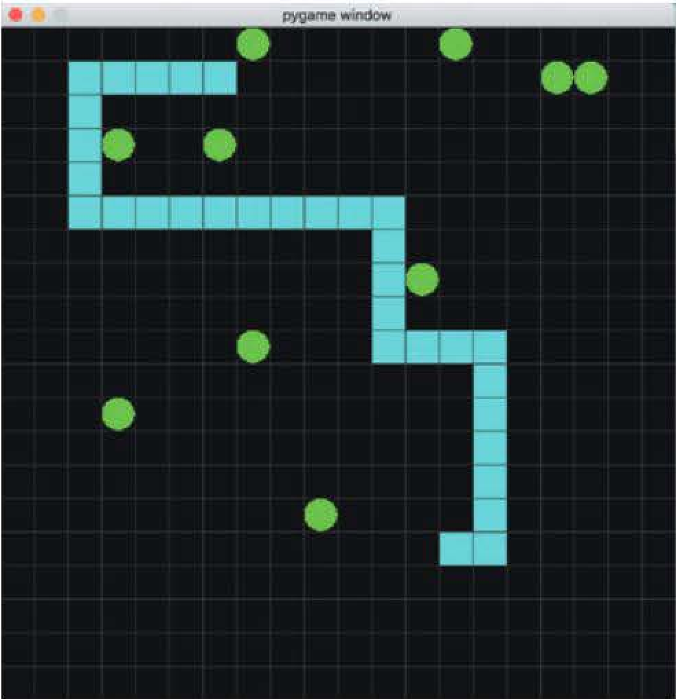

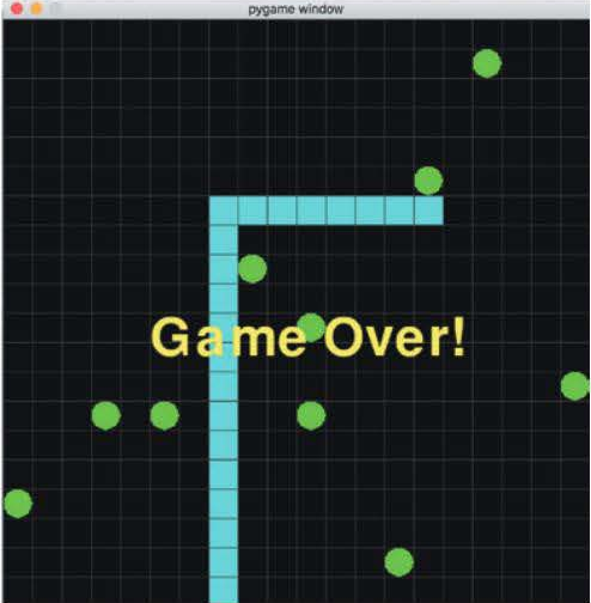

동작이 똑같은 게임이라도 만드는 방법은 무한히 많습니다. 이번에는 함수만으로 구현한 예와 클래 스를 사용한 예의 두 종류를 만들었습니다. 먼저 함수만으로 구현한 버전을 살펴보세요.

###### 180 1PART 2.게임편

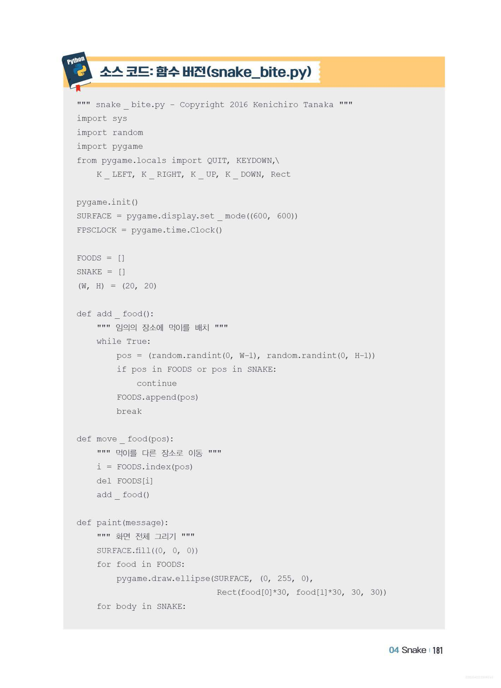

###### 소스 코드: 활수 1:1'전<snake_bite.py)

111111 snake bite.py - Copyri ght 2016 Keni chiro Tanaka 111111 import sys import random import pygame from pygame.locals i mport QUIT, KEYDOWN,\

K LEFT, K RIGHT, K UP, K DOWN, Rect

pygame.init () SURFACE = pygame.display.set mode ((600, 600) ) FPSCLOCK = pygame.time.Clock()

FOODS = [] SNAKE = [] (W, H) = (20, 20)

def add food() :

""" 임의의 장소에 먹이를 배치 """

while True:

pos = (randorn.randint(O, W-1), randorn.randint(O, H-1) )

if pos in FOODS or pos in SNAKE:

continue FOODS .append(pos) break

def move food(pos) :

IIIIII 먹이를 다른 장소로 이동 """

i = FOODS .index(pos) del FOODS [i] add f ood()

def paint (message) :

""" 화면 전체 그리기 ”“”

SURFACE .fill((O, 0, 0)) for food in FOODS:

pygarne .draw.ellipse (SURFACE, (0, 255, 0) ,

Rect(food[O]*30, food[l]*30, 30, 30)) for body in SNAKE:

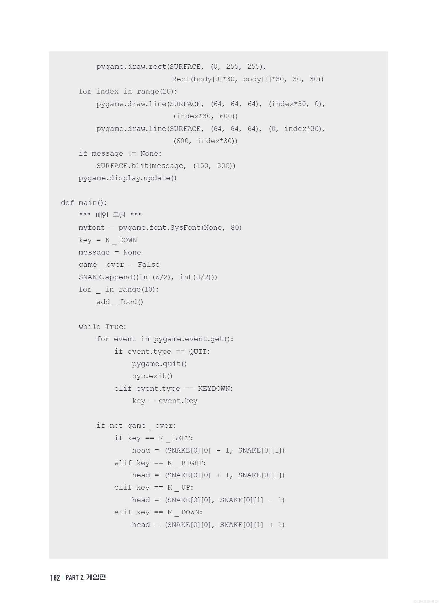

pygarne .draw.rect (SURFACE, (0, 255, 255) ,

Rect (body[0] *30, body[l] *30, 30, 30) ) for index i n range (20) :

pygarne .draw.line (SURFACE, (64, 64, 64) , (index*30, 0) , (i ndex*30, 600) ) pygarne .draw.line (SURFACE, (64, 64, 64) , (0, i ndex*30) ,

(600, index*30) ) if message != None:

SURFACE.blit (message, (150, 300) ) pygarne .display.update ()

###### def main() :

""“ 메인 루틴 """

myfont = pygame. font. SysFont(None, 80) key = K DOWN message = None game over = False SNAKE . append ((int (W/2) , int (H/2) )) for i n range (10) : add f ood()

while True: for event in pygame.event .get() :

i f event .type == QUIT: pygame .quit () sys.exit()

elif event.type == KEYDOWN: key = event.key

if not game over: if key == K LEFT:

head = (SNAKE[O] [0] - 1, SNAKE[0] [1])

elif key == K RIGHT:

head = (SNAKE[O] [0] + 1, SNAKE[0] [1])

elif key == K UP:

head = (SNAKE[O][O], SNAKE[OJ[l] - 1)

elif key == K _ DOWN:

head = (SNAKE[O][0] , SNAKE[0][1] + 1)

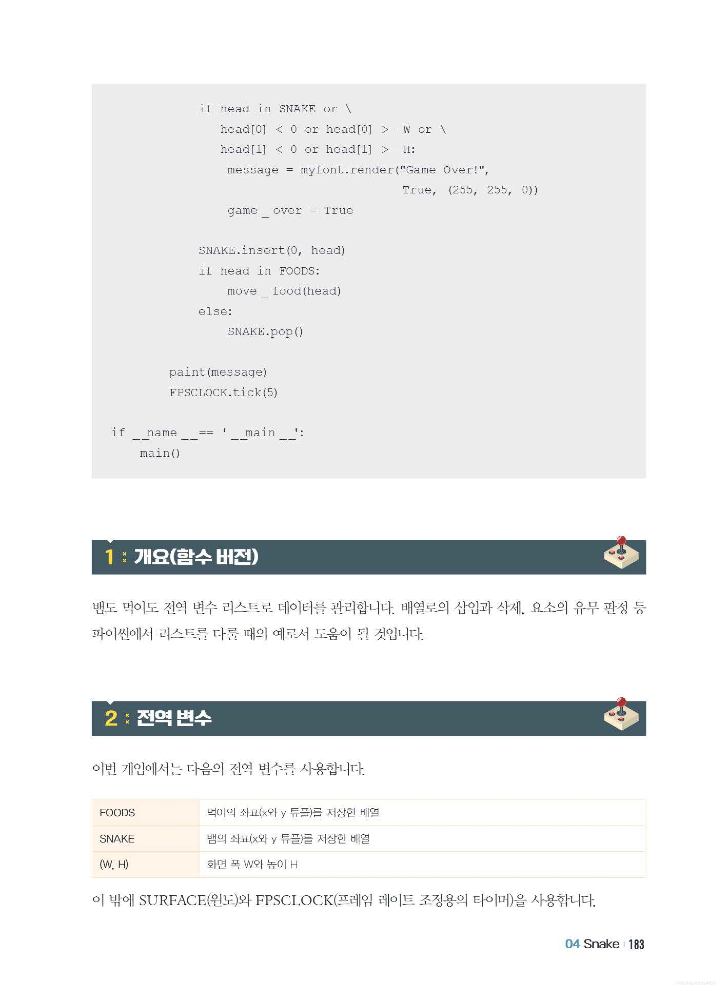

i f head i n SNAKE or \ head[O] < 0 or head[O] >= W or \ head[l] < 0 or head[1] >= H:

message = myfont.render("Game Over! ",

True, (255, 255, 0) ) game over = True

SNAKE. i nsert (0, head) if head i n FOODS:

move f ood(head) else:

SNAKE.p op ()

paint (message) FPSCLOCK.t i ck (S)

’ mai• n ’••

if name mai’ n ()

뱀도 먹이도 전역 변수 리스트로 데이터를 관리합니다. 배열로의 삽입과 삭제, 요소의 유무 판정 둥 파이썬에서 리스트를 디룰- 때의 예로서 도움이 될 것입니다.

###### 이번 게임에서는 다음의 전역 변수를 사용합니다.

FOODS

먹이의 좌표(x와 y 튜플)를 저장한 배열 뱅의 좌표(x와 y 튜플)를 저장한 배열 화면폭 W와높이 H

SNAKE

(W, H)

###### 이 밖에 SURFACE(윈도)와 FPSCLOCK(프레임 레이트 조정용의 타이머)을 사용합니다.

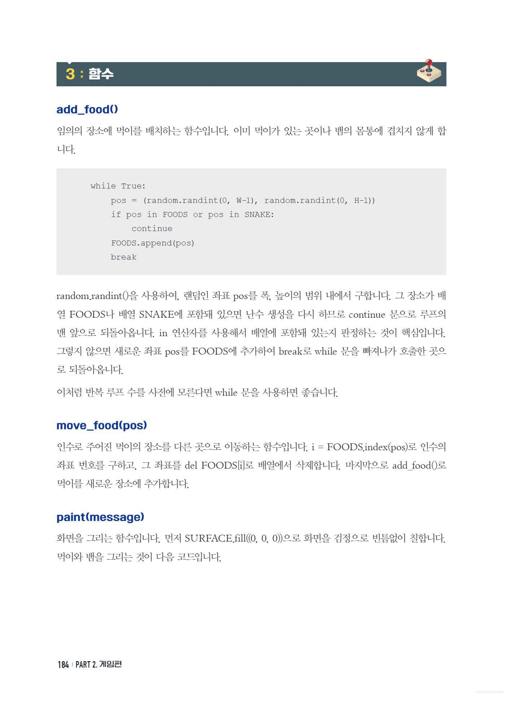

###### add_foodO

임의의 장소에 먹이를 배치하는 함수입니다. 이미 먹이가 있는 곳이나 뱀의 몸통에 겹치지 않게 합

니다.

while True: pos = (random.randint(O, W-1), random.randint(O, H- 1)) if pos in FOODS or pos in SNAKE:

continue FOODS.append(pos) break

random.randintO을 사용하여, 랜덤인 좌표 pos를 폭, 높이의 범위 내에서 구합니다. 그 장소가 배

열 FOODS나 배열 SNAKE에 포함돼 있으면 난수 생성을 다시 하므로 continue 문으로 루프의 맨 앞으로 되돌아옵니다. in 연산자를 사용해서 배열에 포함돼 있는지 판정하는 것이 핵심입니다. 그렇지 않으면 새로운 좌표 pos를 FOODS에 추가하여 break로 while 문을 빠져나가 호출한 곳으 로되돌아옵니다.

이처럽 반복 루프 수를 사전에 모른다면 while 문을 사용하면 좋습니다.

###### move_food(pos>

인수로 주어진 먹이의 장소를 다른 곳으로 이동하는 함수입니다. i =FOODS.index(pos)로 인수의

좌표 번호를 구하고, 그 좌표를 del FOODS[i］로 배열에서 삭제합니다. 마지막으로 add_foodO로

먹이를 새로운 장소에 추가합니다.

###### paint(message)

###### 화면을 그리는 함수입니다. 먼저 SURFACE.fill((O, 0, 0))으로 화면을 검정으로 빈틈없이 칠합니다.

먹이와 뱀을 그리는 것이 다음 코드입니다.

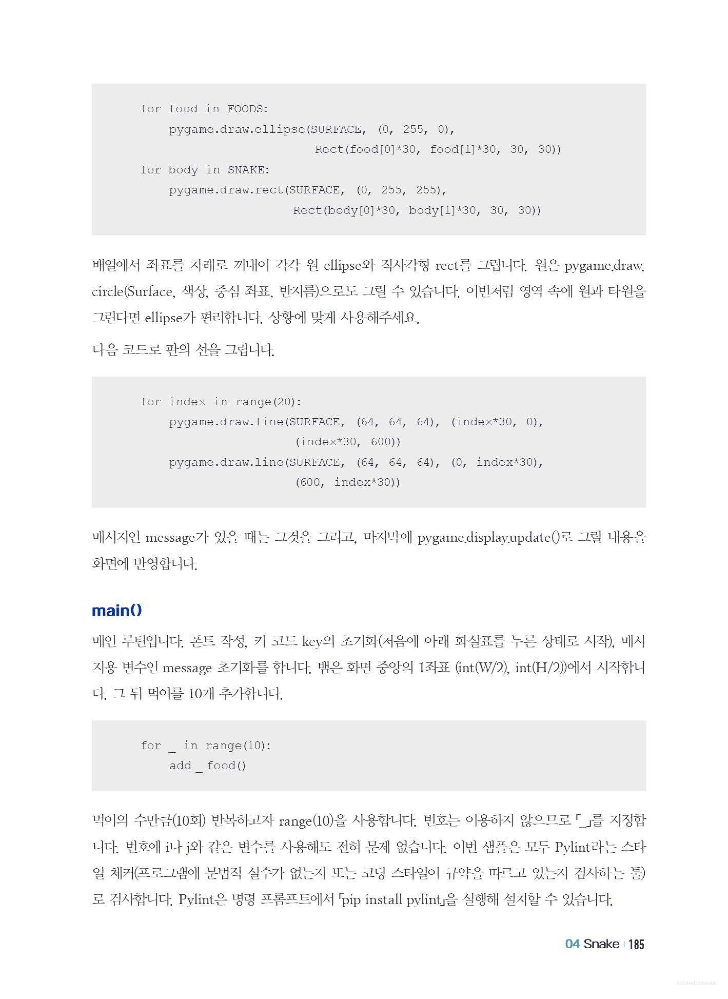

for f ood in FOODS: pygarne.draw.ellipse (SURFACE, (0, 255, 0) ,

Rect(food[0]*30, food[1]*30, 30, 30)) for body in SNAKE:

pygarne .draw.rect (SURFACE, (0, 255, 255) , Rect(body[O] *30, body[l] *30, 30, 30) )

배열에서 좌표를 차례로 꺼내어 각각 원 ellipse와 직사각형 rect를 그립니다. 원은 pygame.draw. circle(Surface, 색상, 중심 좌표, 반지름)으로도 그릴 수 있습니다. 이번치럽 영역 속에 원과 타원을 그린다면 ellipse가 편리합니다. 상황에 맞게 사용해주세요.

다음 코드로 판의 선을 그립니다.

for index in range (20) : pygarne.draw.line (SURFACE, (64, 64, 64) , (i ndex*30, 0) , (index*30, 600) ) pygarne.draw.line (SURFACE, (64, 64, 64) , (0, index*30) , (600, index*30) )

메시지인 message가 있을 때는 그것을 그리고, 마지막에 pygame.display.updateO로 그릴 내용을 화면에 반영합니다.

###### mainO

###### 메인 루틴입니다. 폰트 작성, 기 코드 key의 초기화(처음에 아래 화살표를 누른 상태로 시작)， 메시 지용 변수인 message 초기회를- 합니다. 뱀은 화면 중앙의 1좌표 (int(W/2), int(H/2))에서 시작합니

다. 그 뒤 먹이를 10개 추가합니다.

for in range (10) : add food()

###### 먹이의 수만큼(10회) 반복하고자 range(IO)을 사용합니다. 번호는 이용하지 않으므로 「_」를 지정합

니다. 번호에 i나 j와 같은 변수를 사용해도 전혀 문제 없습니다. 이번 샘플은 모두 Pylint라는 스타

###### 일 체커(프로그램에 문법적 실수가 없는지 또는 코딩 스타일이 규약을 따르고 있는지 검사하는 툴)

로 검사합니다. Pylint은 명령 프롬프트에서 「pip install pylint」을 실행해 설치할 수 있습니다.

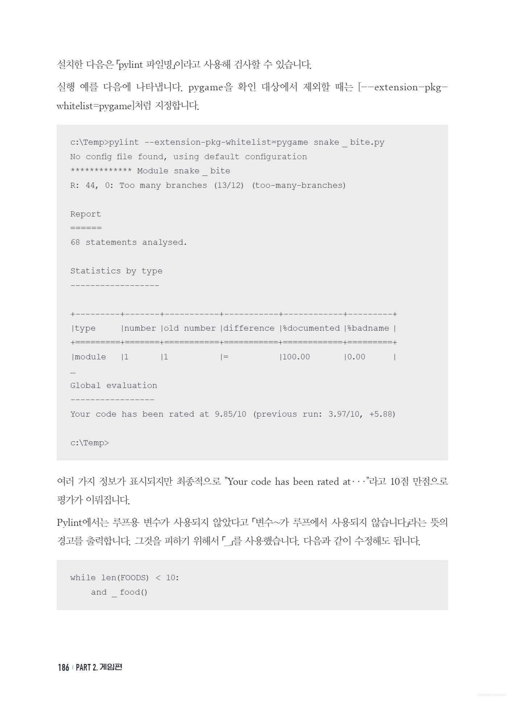

설치한 다음은 「pylint 파일명」이라고 사용해 검사할 수 있습니다. 실행 예를 다음에 나타냅니다. pygame을 확인 대상에서 제외할 때는 [——exten sion—pkgwhitelist=pygame]처럽 지정합니다.

c :\ Temp>pylint --extension- pkg-whiteli st=pygame snake _ bi te .py No config file found, using default configuration

************* Module snake _ bite

R: 44, 0: Too many branches (13/12) (too- many- branches)

Report ====== 68 statements anal ysed.

Statistics by type

+---------+-------+-----------+-----------+------------+---------+ Itype Inumber Iold number Idif ference I%documented I%badname I

+=========+======+===========+===========+============+========+ !module 11 11 i= 1100.00 10.00

Global evaluation

Your code has been rated at 9.85/10 (previous run: 3.97/10, +5.88)

c :\Temp>

여러 가지 정보가 표시되지만 최종적으로 ,'your code has been rated at · · .”라고 10점 만점으로

평가가이뤄집니다. Pylint에서는 루프용 변수가 사용되지 않았다고 「변수~가 루프에서 사용되지 않습니다」라는 뜻의 경고를 출력합니다. 그것을 피하기 위해서 「―」를 사용했습니다. 다음과 같이 수정해도 됩니다.

while len(FOODS) < 10:

and food()

###### 186 1PART 2.게임펀

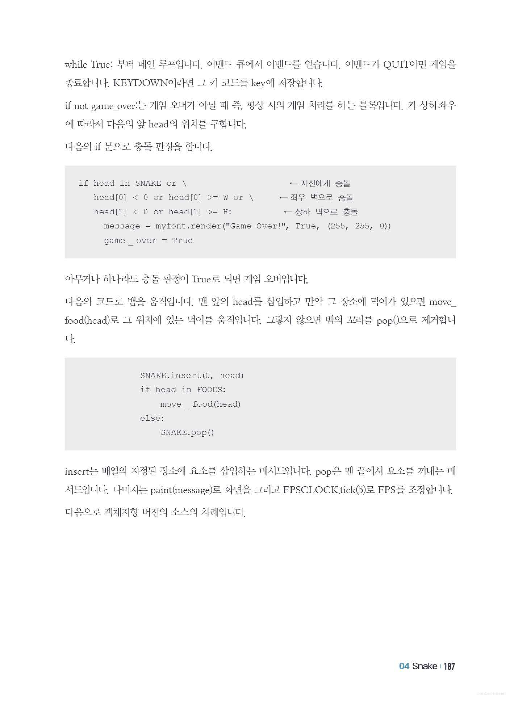

while True: 부터 메인 루프입니다. 이벤트 큐에서 이벤트를 얻습니다. 이벤트가 QUIT이면 게임을 종료합니다. KEYDOWN이라면 그 키 코드를 key에 저장합니다. if not game_over:는 게임 오버가 아닐 때 죽, 평상 시의 게임 처리를 하는 블록입니다. 키 상하좌우 에 따라서 다음의 앞 head의 위치를 구합니다. 다음의 if 문으로 충돌 판정을 합니다.

###### if head in SNAKE or \ head[O] < 0 or head[O] >= W or \ head[l] < 0 or head[l] >= H:

― 자신에게 충돌

― 좌우 벽으로 충돌 상하 벽으로 충돌

message = rnyfont.render ("Garne Over!", True, (255, 255, 0) )

game —over = True

아무거나 하나라도 충돌 판정이 True로 되면 게임 오버입니다.

다음의 코드로 뱀을 움직입니다. 맨 앞의 head를 삽입하고 만약 그 장소에 먹이가 있으면 1nove_

food(head)로 그 위치에 있는 먹이를 움직입니다. 그렇지 않으면 뱀의 꼬리를 popO으로 제거합니 다.

SNAKE.insert (O, head) if head in FOODS:

move food(head) else:

SNAKE.pop ()

insert는 배열의 지정된 장소에 요소를 삽입하는 메서드입니다. pop은 맨 끝에서 요소를 꺼내는 메

###### 서드입니다. 냐머지는 paint(message)로 화면을 그리고 FPSCLOCK.tick(S)로 FPS를 조정합니다.

다음으로 객체지향 버전의 소스의 차례입니다.

###### 04 Snake 1 187

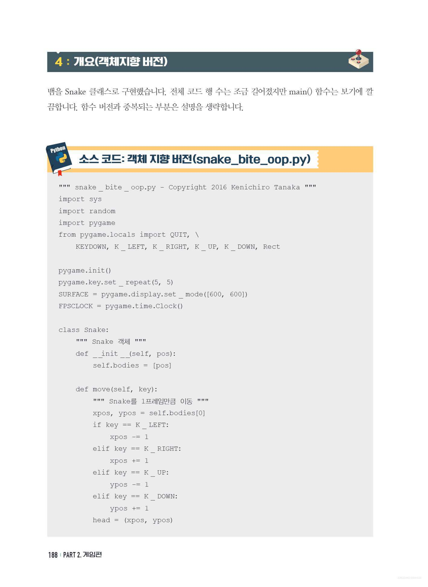

###### 뱀을 Snake 클래스로 구현했습니다. 전체 코드 행 수는 조금 길어졌지만 mainO 함수는 보기에 깔

끔합니다. 함수 버전과 중복되는 부분은 설명을 생략합니다.

###### 소스 코드: 객체 X1량 l:lf전(snake_bite_oop.py)

""" snake bite oop.py - Copyright 2016 Kenichiro Tanaka 111111 import sys import random import pygame from pygame.locals import QUI T, \

KEYDOWN, K LEFT, K — RIGHT, K — UP, K DOWN, Rect

pygame .i nit() pygame.key. set repeat(5, 5) SURFACE = pygame.display. set mode ([600, 600]) FPSCLOCK = pygame .time.Clock()

class Snake:

””” Snake 객체 """

def init (self, pos) : self.bodies = [pos]

def move (self, key) : """ Snake를 1프레임만큼 이동 """ xpos, ypos = self.bodies[O] if key == K—LEFT: xpos —= 1

elif key == K RIGHT: xpos += 1 elif key == K UP: ypos -= 1 elif key K DOWN: ypos += 1

head = (xpos, ypos)

###### 188 1PART 2. 게임펀

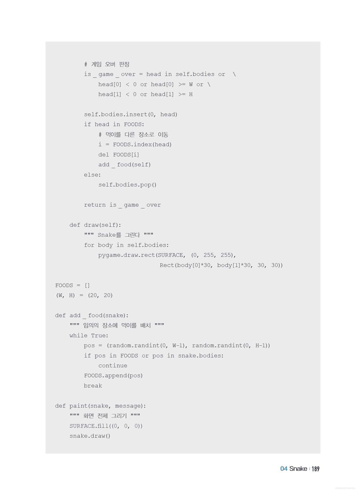

# 게임 오버 판정

is game over = head in self.bodies or \ head[0] < 0 or head[0] >= W or \ head[1] < 0 or head[l] >= H

self.bodies . insert (O, head) if head in FOODS:

# 먹이를 다른 장소로 이동

i = FOODS.index(head) del FOODS [i] add f ood(self)

else:

self.bodies .pop ()

return is game over

def draw (self) :

”“” Snake를 그린다 """

for body in self.bodies: pygarne.draw.rect (SURFACE, (0, 255, 255) , Rect (body[0] *30, body [l] *30, 30, 30) )

FOODS = [] (W, H) = (20, 20)

###### def add food(snake) :

""“ 임의의 장소에 먹이를 배치 """

while Tr ue: pos = (random.randint (0, W-1), random.randint(0, H- 1) ) if pos in FOODS or pos in snake.bodies:

continue FOODS. append (pos) break

def paint (snake, message) :

""“ 화면 전체 그리기 """

###### SURFACE.fill((O, 0, 0)) snake.draw()

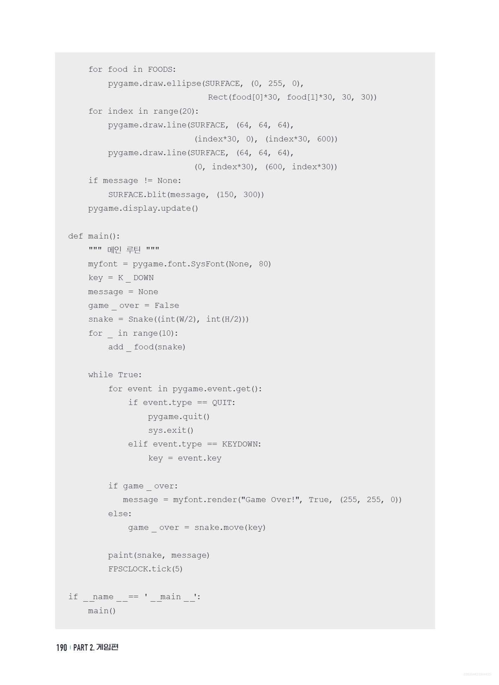

for food in FOODS: pygarne .draw.ellipse (SURFACE, (0, 255, 0) ,

Rect (food[0] *30, food [1] *30, 30, 30) ) for index in range (20) :

pygarne .draw.line (SURFACE, (64, 64, 64) ,

(index*30, 0) , (index*30, 600) ) pygarne .draw.line (SURFACE, (64, 64, 64) ,

(0, index*30) , (600, index*30) ) if message != None:

SURFACE.blit (rnessage, (150, 300) ) pygarne.display. update ()

def main():

""“ 메인 루틴 """

myfont = pygarne. font .SysFont(None, 80) key = K DOWN message = None game over = False snake = Snake((int(W/2), int(H/2))) for in range (10) :

add food (snake)

while True: for event in pygame.event.get() :

i f event .type == QUIT: pygame .quit () sys.exit()

elif event .type == KEYDOWN: key = event . key

if game _ over:

message = rnyfont.render("Garne Over! ", True, (255, 255, 0) ) else:

game over = snake.rnove(key)

paint (snake, message) FPSCLOCK.tick (5)

###### ’

’ maln• ••

if name main()•

190 1PART 2. 게임편

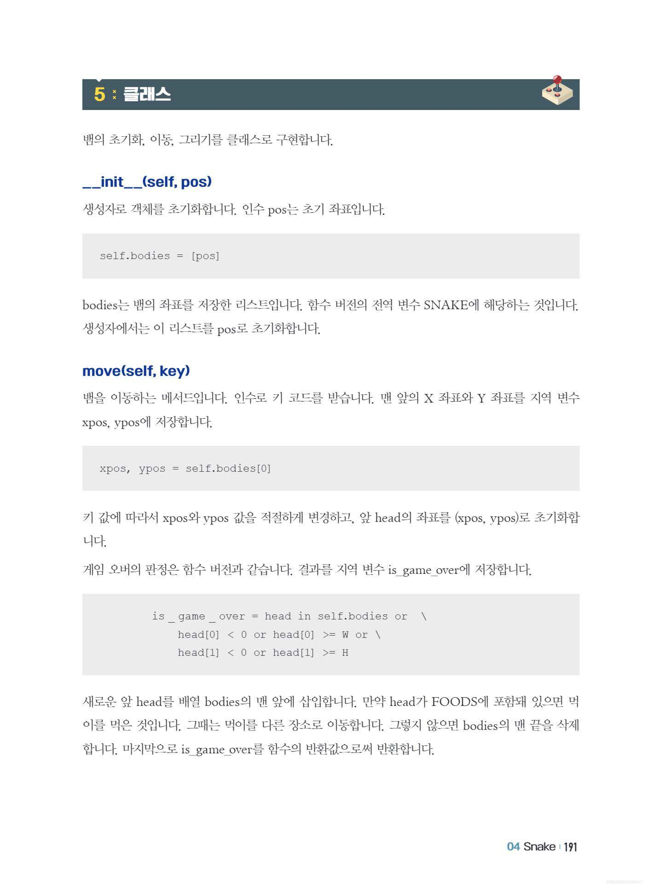

뱀의 초기화, 이동, 그리기를 클래스로 구현합니다.

###### __init__(self, pos>

생성자로 객체를 초기화합니다. 인수 pos는 초기 좌표입니다.

###### self.bodies = [pos]

bodies는 뱀의 좌표를 저장한 리스트입니다. 함수 버전의 전역 변수 SNAKE에 해당하는 것입니다. 생성자에서는 이 리스트를 pos로 초기화합니다.

###### move(self, key}

뱀을 이동하는 메서드입니다. 인수로 키 코드를 받습니다. 맨 앞의 x 좌표와 Y 좌표를 지역 변수

xpos, ypos에 저장합니다.

###### xpos, ypos = self.bodies[O]

키 값에 따라서 xpos와 ypos 값을 적절하게 변경하고, 앞 head의 좌표를 (xpos, ypos)로 초기화합

###### 니다.

게임 오버의 판정은 함수 버전과 같습니다. 결과를 지역 변수 is_game_over에 저장합니다.

###### is game over = head in self.bodies or \ head[0] < 0 or head[0] >= W or \ head[1] < 0 or head[l] >= H

새로운 앞 head를 배열 bodies의 맨 앞에 삽입합니다. 만약 head가 FOODS에 포함돼 있으면 먹 이를 먹은 것입니다. 그때는 먹이를 다른 장소로 이동합니다. 그렇지 않으면 bodies의 맨 끝을 삭제

###### 합니다. 마지막으로 is―game―9ver를 함수의 반흰값으로써 반환합니다.

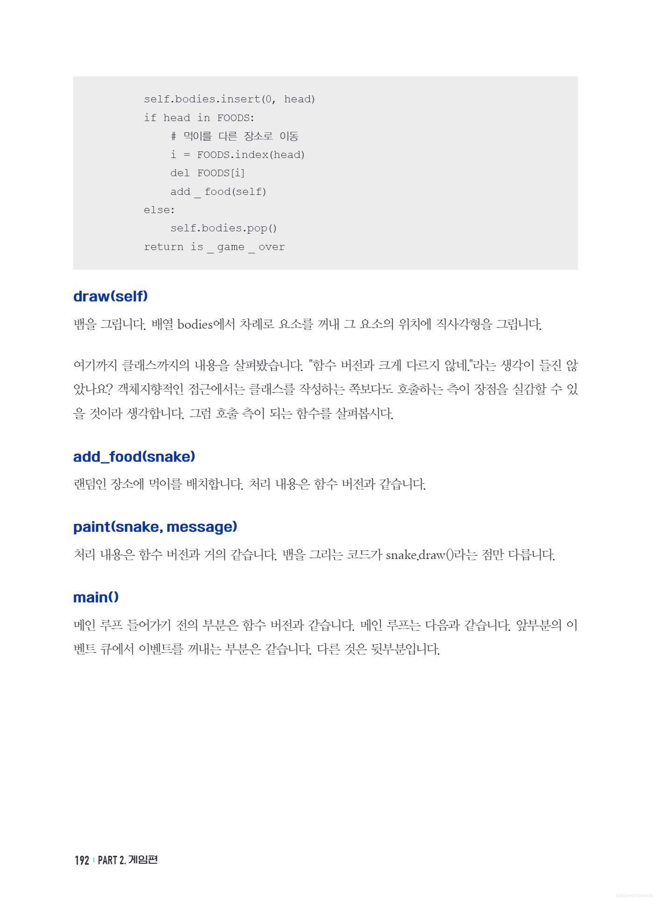

self.bodies .insert(0, head) if head in FOODS:

# 먹이를 다른 장소로 이동

i = FOODS.index(head) del FOODS [i] add food (self)

else:

self.bodies .pop () return is game over

d『aw(self)

뱀을 그립니다. 배열 bodies에서 차례로 요소를 꺼내 그 요소의 위치에 직사각형을 그립니다.

여기까지 클래스까지의 내용을 살펴봤습니다. ’'함수 버전과 크게 다르지 않네.”라는 생각이 들진 않 았나요? 객체지향적인 접근에서는 클래스를 작성하는 쪽보다도 호출하는 측이 장점을 실갑할 수 있 을 것이라 생각합니다. 그럽 호출 측이 되는 함수를 살펴봅시다.

###### add_food(snake>

랜덤인 장소에 먹이를 배치합니다. 처리 내용은 함수 버전과 같습니다.

###### paint(snake, message)

처리 내용은 함수 버전과 거의 같습니다. 뱀을 그리는 코드가 snake.drawO라는 점만 다릅니다.

###### mainO

메인 루프 들어가기 전의 부분은 함수 버전과 같습니다. 메인 루프는 다음과 같습니다. 앞부분의 이

벤트 큐에서 이벤트를 꺼내는 부분은 같습니다. 다른 것은 뒷부분입니다.

###### 192 1PART 2. 게임펀

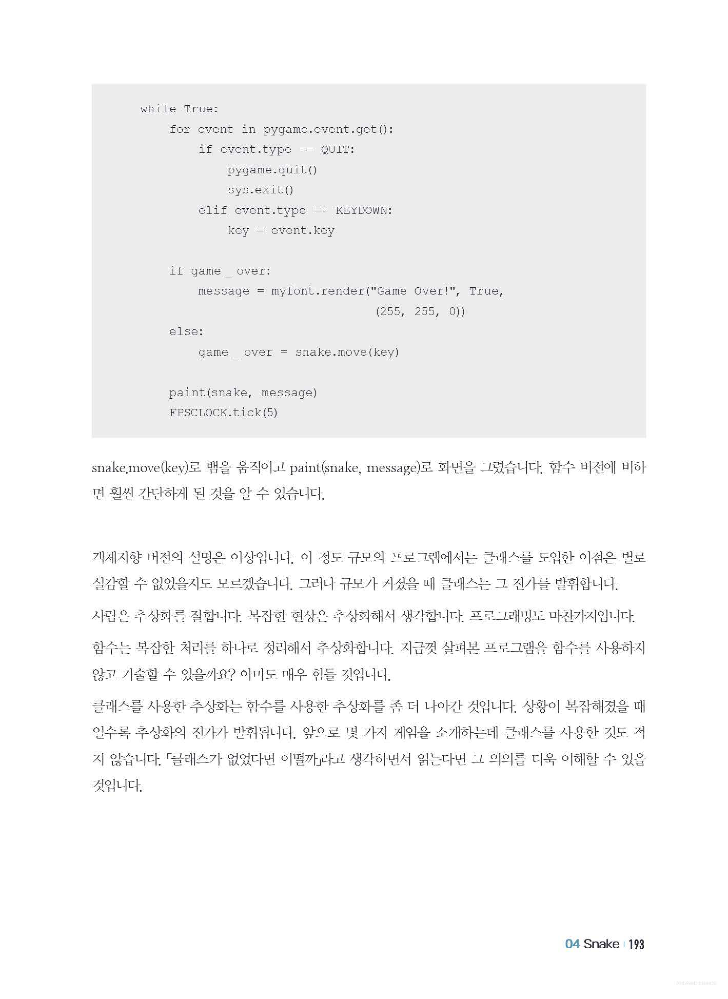

while True: for event in pygame .event.get () :

if event.type == QUIT: pygame .quit () sys .exit()

elif event.type == KEYDOWN:

key = event.key

if game over:

message = myfont.render("Game Over!", True,

(255, 255, 0) ) else:

game over = snake.move (key)

paint (snake, message) FPSCLOCK.t i ck(5)

snake.move(key)로 뱀을 움직이고 paint(snake, message)로 화면을 그렸습니다. 함수 버전에 비하

###### 면 훨씬 간단하게 된 것을 알 수 있습니다.

객체지향 버전의 설명은 이상입니다. 이 정도 규모의 프로그램에서는 클래스를 도입한 이점은 별로 실갑할 수 없었을지도 모르겠습니다. 그러나 규모가 커졌을 때 클래스는 그 진가를 발휘합니다. 사림은 추상화를 잘합니다. 복잡한 현상은 추상화해서 생각합니다. 프로그래밍도 마찬가지입니다.

함수는 복잡한 처리를 하냐로 정리해서 추상화합니다. 지금껏 살펴본 프로그램을 함수를 사용하지 않고 기술할 수 있을까요? 아마도 매우 힘들 것입니다.

클래스를 사용한 추상화는 함수를 사용한 추상화를 좀 더 나아간 것입니다. 상황이 복잡해졌을 때 일수록 추상화의 진가가 발휘됩니다. 앞으로 몇 가지 게임을 소개하는데 클래스를 사용한 것도 적 지 않습니다. 「클래스가 없었다면 어떨까」라고 생각하면서 읽는다면 그 의의를 더욱 이해할 수 있을

###### 것입니다.

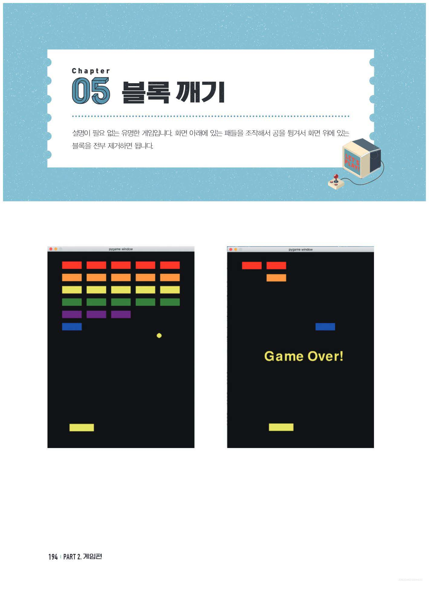

Chapte 『

••••••••••••••••••••••••••••••••••••••••••••••••••••••••••••••••••••••••••••••••••••••••

설명이 필요 없는 유명한 게임입니다 화면 아래에 있는 패들을 조작해서 공을 튕겨서 화면 위에 있는 블록을 전부 제거하면 됩니다.

23

3

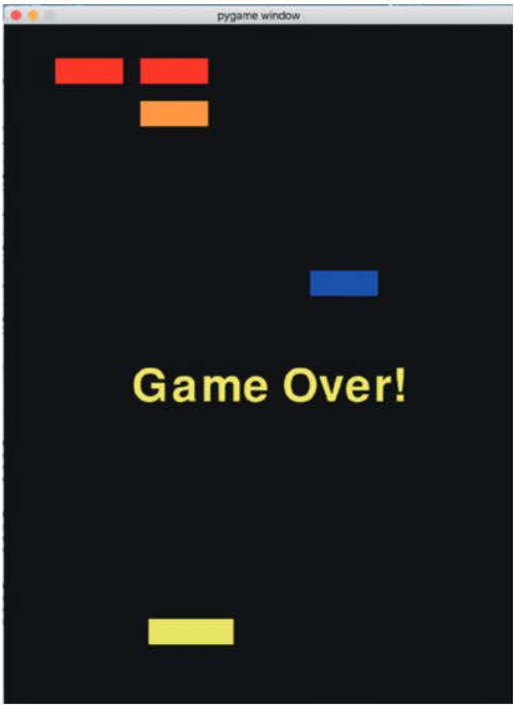

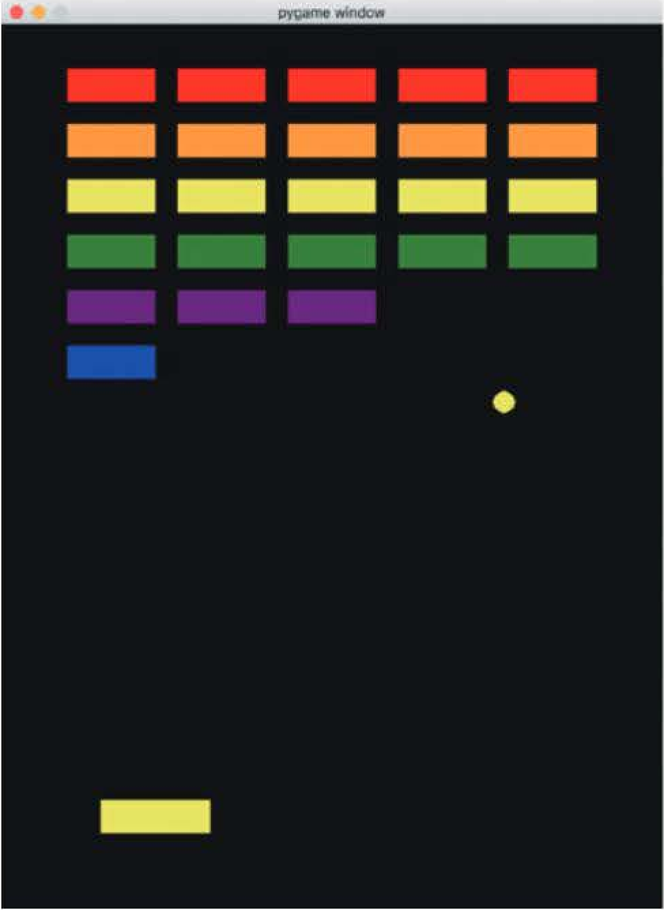

###### 194 1PART 2.게임펀

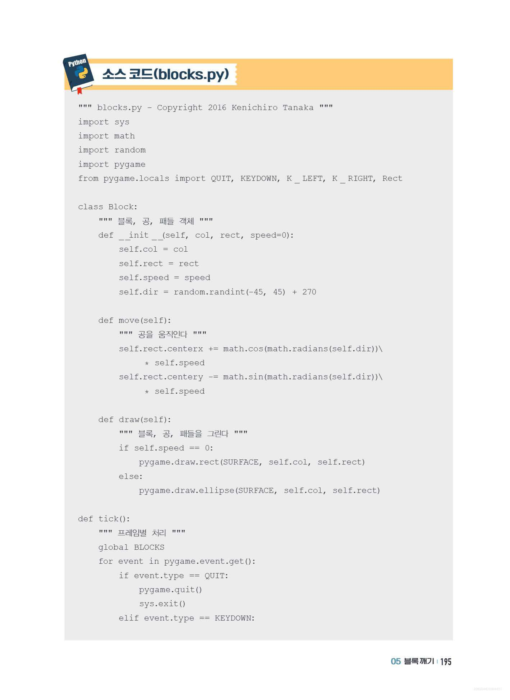

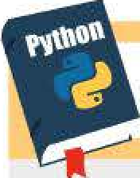

###### 소스 코드{blocks.py)

""" bl ocks .py - Copyri ght 2016 Keni chir o Tanaka """ impor t sys import math import r andom import pygame from pygame .local s i mpor t QUIT, KEYDOWN, K LEFT, K RIGHT, Rect

class Bl ock:

""" 블록, 공, 패들 객체 """

def i ni t (self, col, r ect, speed=O) : self.col = col self.r ect = r ect self. speed = speed self.d i r = r andom.randi nt(- 45, 45) + 270

def move (self) :

111111 공을 움직인다 II II II

self. r ect.center x += math .cos (math.radians (self.d i r) )\

* sel f .speed

self .r ect.center y -= math. s i n(math .radi ans (self.dir) )\

* sel f .speed

def draw(self) :

111111 블록, 공, 패들을 그린다 ”””

if sel f .speed == 0:

pygame .draw. rect (SURFACE, self. col, self. rect) e l se :

pygame .draw.e llipse (SURFACE, self.col, self.rect )

def tick() :

II II II 프레임별 처리 II II II

gl obal BLOCKS f or event i n pygame .event.get() :

if event .type == QUIT: pygame .qui t () sys .exi t()

e lif event.type KEYDOWN:

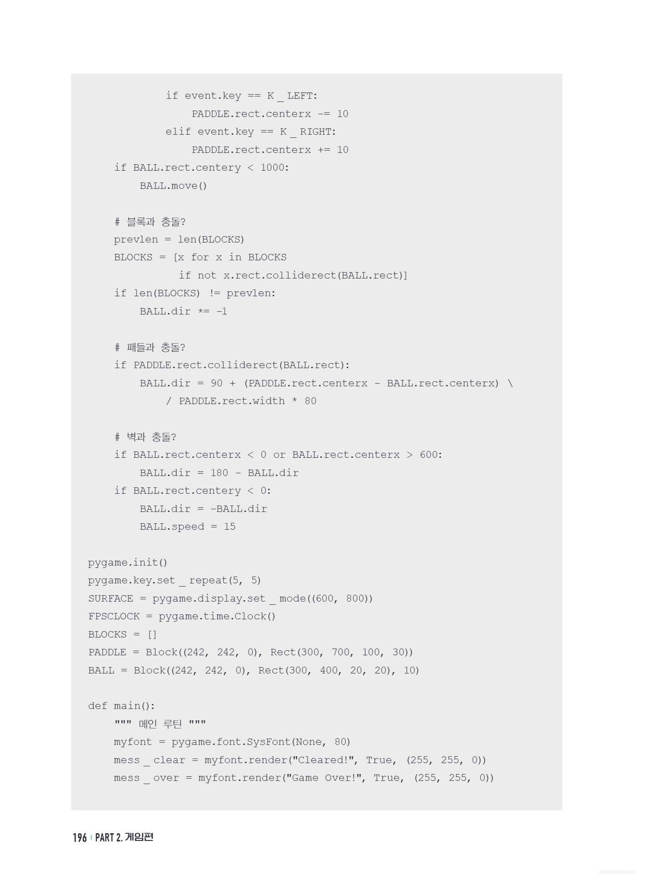

if event .key == K LEFT:

PADDLE .rect.centerx -= 10 elif event .key == K RI GHT:

PADDLE.rect.centerx += 10

if BALL.rect.centery < 1000:

BALL .move ()

# 볼록과 충돌?

prevlen = len (BLOCKS) BLOCKS = [x f or X in BLOCKS

if not x .rect. colliderect(BALL .rect)] if len (BLOCKS) != prevlen :

BALL .dir *= —1

# 패들과 충돌?

if PADDLE.rect.colliderect(BALL.rect) : BALL .d ir = 90 + (PADDLE .rect . centerx - BALL.rect.centerx) \ / PADDLE .rect .width * 80

# 벽과 충돌?

- if BALL.rect.centerx < 0 or BALL.rect.centerx > 600:

BALL .dir = 180 - BALL.dir

- if BALL.rect.centery < 0:

BALL .dir = -BALL.dir BALL . speed = 15

pygarne .init () pygarne .key. set repeat (5, 5) SURFACE = pygarne .d isplay. set mode((600, 800)) FPSCLOCK = pygarne .tirne .Clock() BLOCKS = [] PADDLE = Block((242, 242, 0) , Rect(300, 700, 100, 30)) BALL = Block ((242, 242, 0) , Rect (300, 400, 20, 20) , 10)

def main():

II1111 메인 루틴 """

myfont = pygarne. font . SysFont(None, 80) mess clear = rnyfont.render (" Cleared! ", True, (255, 255, 0) ) mess over = myfont.render (" Game Over! ", True, (255, 255, 0) )

###### 196 1PART 2. 게임펀

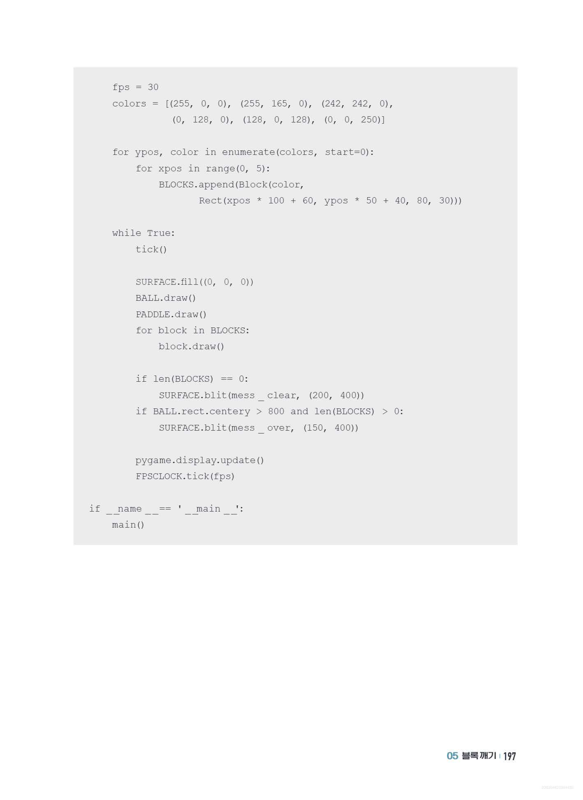

fps = 30 col ors = [(255, 0, 0) , (255, 165, 0) , (242, 242, 0) ,

(0, 128, 0) , (128, o, 128), (0, o, 250)]

for ypos, col or in enumer ate (color s , start=O) : for xpos i n range (O, 5) : BLOCKS .append (Block(col or,

Rect(xpos * 100 + 60, ypos * 50 + 40, 80, 30)))

while Tr ue: tick()

SURFACE .fil l((O, 0, 0)) BALL.draw() PADDLE.d r aw() for block i n BLOCKS: b l ock.d r aw()

if l en(BLOCKS) == 0: SURFACE. blit (mess c l ear, (200, 400) )

if BALL.rect.centery > 800 and l en(BLOCKS) > 0:

SURFACE . blit (mess over, (150, 400) )

pygarne . d i spl ay.updat e () FPSCLOCK.t i ck(f ps)

’ mal• n

if n ame mai’ n()

I •

•

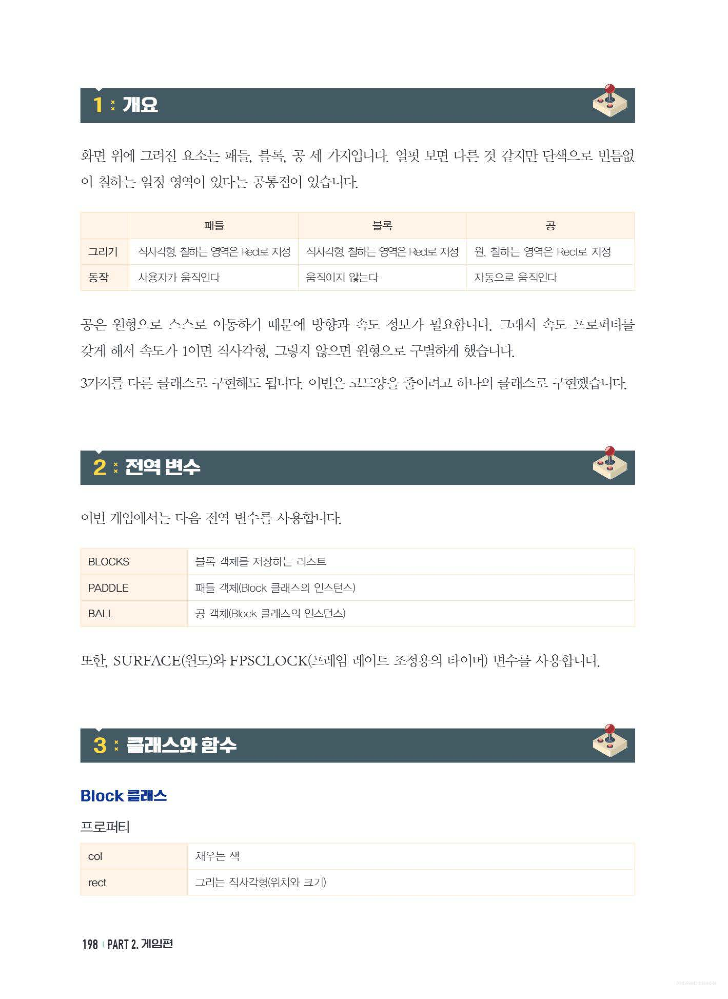

화면 위에 그려진 요소는 패들, 블록, 공 세 가지입니다. 얼핏 보면 다른 것 같지만 단색으로 빈틈없

###### 이 칠하는 일정 영역이 있다는 공통점이 있습니다.

공

패들 눌트l=I로-,

그리기 직사각형 칠하는 영역은 和아로 지정 직사각형 칠하는 영역은 요겼로 지정 원, 칠하는 영역은 Rect로 지정

동작 사용자가 움직인다 움직이지 않는다 자동으로 움직인다

공은 원형으로 스스로 이동하기 때문에 방향과 속도 정보가 필요합니다. 그래서 속도 프로퍼티를 갖게 해서 속도가 1이면 직사각형 그렇지 않으면 원형으로 구별하게 했습니다. 3가지를 다른 클래스로 구현해도 됩니다. 이번은 코드양을 줄이려고 하나의 클래스로 구현했습니다.

이번 게임에서는 다음 전역 변수를 사용합니다.

BLOCKS PADDLE BALL

블록 객체를 저장하는 리스트

패들 객체(Block 클래스의 인스턴스)

공 객체(Block 클래스의 인스턴스)

###### 또한 SURFACE(윈도)와 FPSCLOCK(프레임 레이트 조정용의 타이머) 변수를 사용합니다.

###### 프로퍼티

col

채우는색

rect

그리는 직사각형(위치와 크기)

###### 198 1PART 2.게임펀

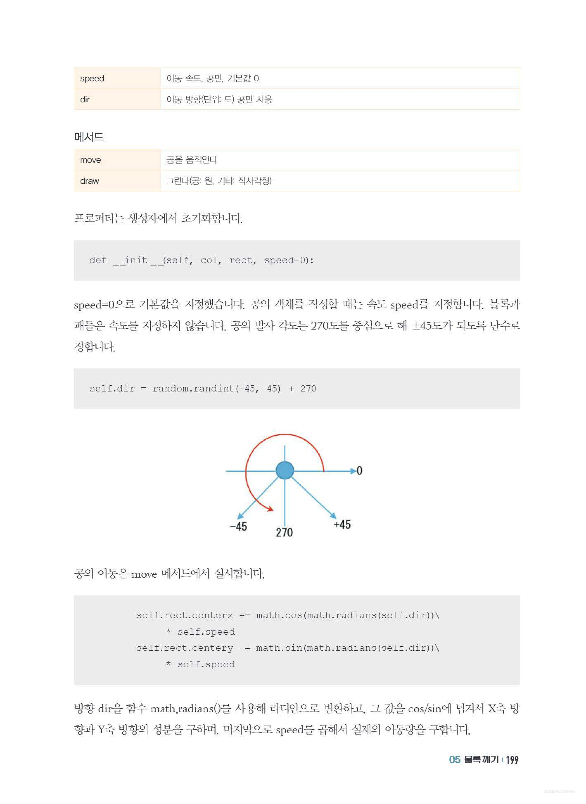

###### speed

이동 속도, 공만, 기본값 0

dir

이동 방항(단위: 도) 공만 사용

###### 메서드

move 공을움직인다

draw 그린다(공 원, 기탸 직사각형)

프로퍼티는 생성자에서 초기화합니다.

###### def init (self, col, rect, speed=O) :

speed=O으로 기본값을 지정했습니다. 공의 객체를 작성할 때는 속도 speed를 지정합니다. 블록과 패들은 속도를 지정하지 않습니다. 공의 발사 각도는 270도를 중심으로 해 土45도가 되도록 난수로

###### 정합니다.

###### self.dir = randorn.randint (- 45, 45) + 270

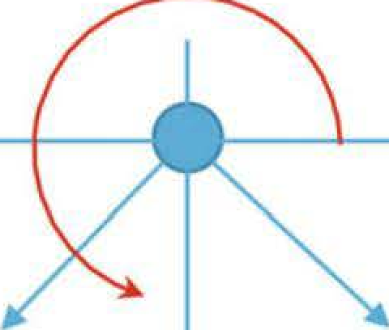

。

+45

-45 270

공의 이동은 n1ove 메서드에서 실시합니다.

- self.rect .centerx += math.cos (math.radians (self.di r) )\

* self.speed

- self.rect .centery -= math. s i n (math.radians (self.dir) )\

* self. speed

###### 방향 di1을 함수 math.radiansO를 사용해 라디안으로 변환하고, 그 값을 cos/sin에 넘겨서 X축 방

향과 Y축 방향의 성분을 구하며, 마지막으로 speed를 곱해서 실제의 이동량을 구합니다.

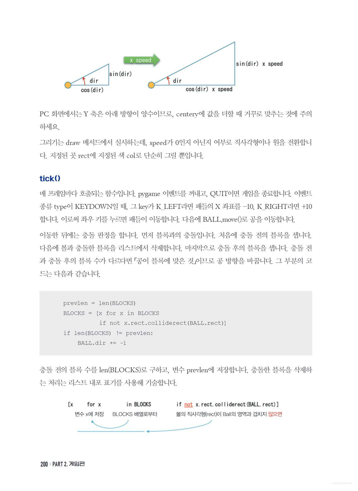

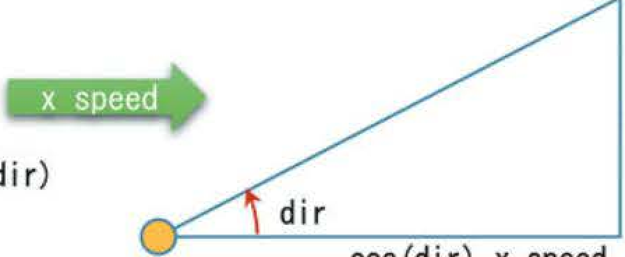

sin (dir) x speed

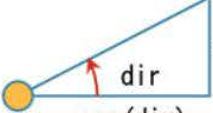

s in (dir)

dir

dir

cos (dir) x speed

cos (dir)

PC 화면에서는 Y 축은 아래 방향이 양수이므로, centery에 값을 더할 때 거꾸로 맞추는 것에 주의 하세요. 고리기는 draw 메서드에서 실시하는데, speed가 0인지 아닌지 여부로 직사각형이냐 원을 전환합니

- 다. 지정된 곳 rect에 지정된 색 col로 단순히 그릴 뿐입니다.

###### tickO

매 프레임마다 호출되는 함수입니다. pygame 이벤트를 꺼내고, QUIT이면 게임을 종료합니다. 이벤트

종류type이 KEYDOWN일 때, 그key가K_LEFT라면 패들의 X 좌표를 —10, K_RIGHT라면 +10

합니다. 이로써 좌우 키를 누르면 패들이 이동합니다. 다음에 BALL.moveO로 공을 이동합니다.

이동한 뒤에는 충돌 판정을 합니다. 먼저 블록과의 충돌입니다. 처음에 충돌 전의 블록을 솁니다.

다음에 볼과 충돌한 블록을 리스트예서 삭제합니다. 마지막으로 충돌 후의 블록을 솁니다. 충돌 전 과 충돌 후의 블록 수가 다르다면 「공이 블록에 맞은 것」이므로 공 방향을 바꿉니다. 그 부분의 코 드는다음과같습니다.

prevlen = len (BLOCKS) BLOCKS = [x for X i n BLOCKS

i f not x .rect.colliderect(BALL.rect)] if len (BLOCKS) != prevlen:

BALL.di r *= -1

충돌 전의 블록 수를 len(BLOCKS)로 구하고. 변수 prevlen에 저장합니다. 충돌한 블록을 삭제하

는 처리는 리스트 내포 표기를 시용해 기술합니다.

###### if x. rect.co11 iderect(BALL. rect)]

###### [x for x

in BLOCKS

BLOCKS 배열로부터

변수 x에저장

볼의 직사각형(rect)이 Ball의 영역과 겹치지

200 1PART 2. 계은편

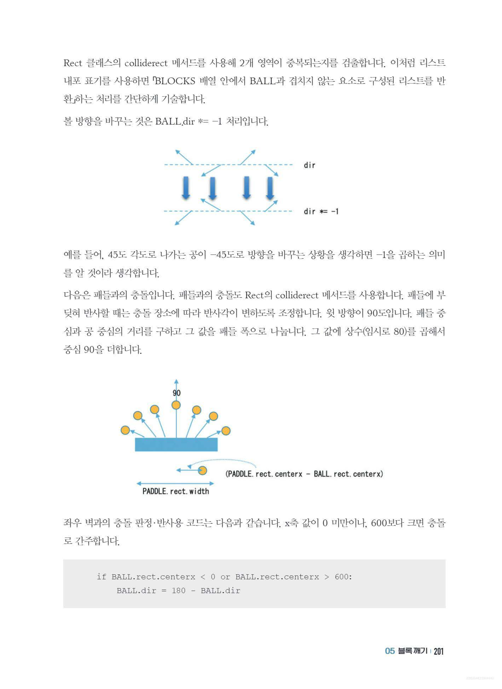

Rect 클래스의 colliderect 메서드를 사용해 2개 영역이 중복되는지를 검출합니다. 이처럽 리스트 내포 표기를 사용하면 「BLOCKS 배열 안에서 BALL과 겹치지 않는 요소로 구성된 리스트를 반

환」하는 처리를 간단하게 기술합니다.

볼 방향을 바꾸는 것은 BALL.dir *= —1 처리입니다.

--~--✓---~-"-__ _

dir

--7---------~-------

dir *= -1

예를 들어, 45도 각도로 나가는 공이 ―45도로 방향을 바꾸는 상황을 생각하면 ―1을 곱하는 의미 를 알 것이라 생각합니다.

다음은 패들과의 충돌입니다. 패들과의 충돌도 Rect의 colliderect 메서드를 사용합니다. 패들에 부 딪혀 반사할 때는 충돌 장소에 따라 반사각이 변하도록 조정합니다. 윗 방향이 90도입니다. 패들 중

###### 심과 공 중심의 거리를 구하고 그 값을 패들 폭으로 냐눕니다. 그 값에 상수(임시로 80)를 곱해서

중심 90을더합니다.

###### Jo

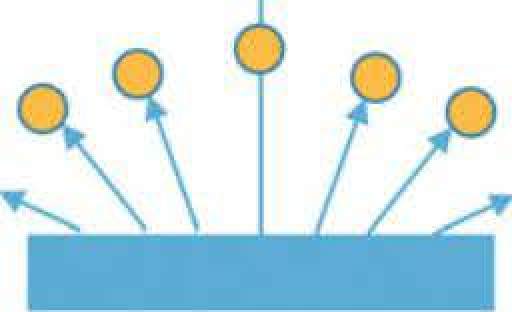

c

.. ...

....... ......

(PADDLE. rect. centerx - BALL rect.centerx) PADDLE. rect.width

좌우 벽과의 충돌 판정 · 반사용 코드는 다음과 같습니다. x축 값이 0 미만이나, 600보다 크면 충돌

로간주합니다.

if BALL.rect.centerx < 0 or BALL.rect.centerx > 600:

BALL.dir = 180 - BALL.dir

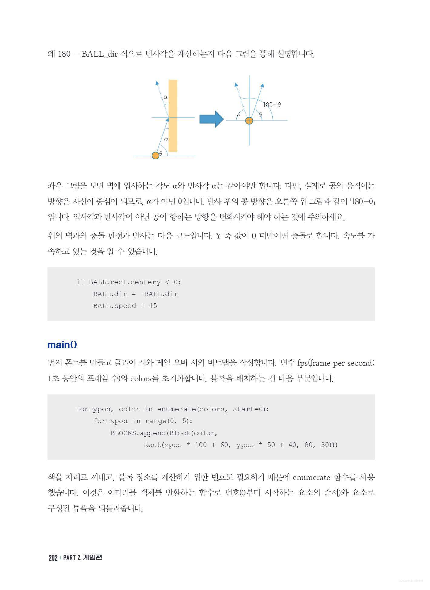

###### 왜 180 —BALL..dir 식으로 반사각을 계산하는지 다음 그림을통해 설명합니다.

»..

느

......

·.

....

',’.a

,....

,-1

.,.

###### •..,.

1

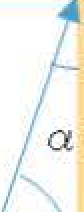

Q:

°

좌우 그림을 보면 벽에 입사하는 각도 a와 반사각 a는 같아야만 합니다. 다만, 실재로 공의 움직이는 방향은 자신이 중심이 되므로, a가 아닌 0입니다. 반사 후의 공 방향은 오른쪽 위 그림과 같이 「180 ―8」 입니다. 입사각과 반사각이 아닌 공이 향하는 방향을 변화시켜야 해야 하는 것에 주의하세요.

위의 벽과의 총돌 판정과 반사는 다음 코드입니다. Y 축 값이 0 미만이면 충돌로 합니다. 속도를 가 속하고 있는 것을 알 수 있습니다.

if BALL.rect.centery < 0: BALL .d i r = -BALL.dir BALL .speed = 15

###### mainO

###### 먼저 폰트를 만들고 클리어 시와 게임 오버 시의 비트맵을 작성합니다. 변수 fps(frame per second: 1초 동안의 프레임 수)와 colors를 초기화합니다. 블록을 배치하는 건 다음 부분입니다.

for ypos, color in enumerate (col ors, start=O) : for xpos in range (0, 5) : BLOCKS.append(Bl ock(color,

Rect(xpos * 100 + 60, ypos * 50 + 40, 80, 30)))

색을 차례로 꺼내고, 블록 장소를 계산하기 위한 번호도 필요하기 때문에 enumerate 함수를 사용

했습니다. 이것은 이터러블 객체를 반환하는 함수로 번호(0부터 시작하는 요소의 순서)와 요소로 구성된 튜플을 되돌려줍니다.

###### 202 1PART 2. 게임편

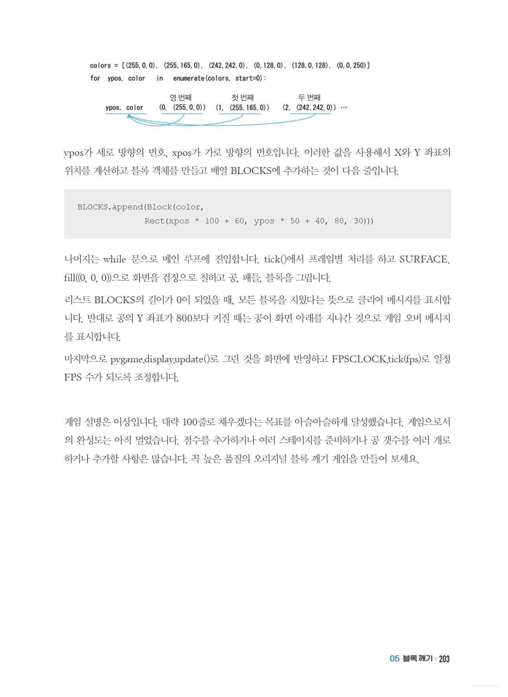

###### coIor s = [(255,0,0). (255. 165.0) . (242,242,0) . (0. 128.0). (128,O. 128). (0.0,250) ] for ypos, color in enunerate(colors. start=O) :

영번째 첫번째 두번째

ypos, coIor (0, (255,0,0)) (1. (255, 165, 0)) (2, (242, 242. 0)) …

`一

ypos가 세로 방향의 번호, xpos가 가로 방향의 번호입니다. 이러한 값을 사용해서 X와 Y 좌표의 위치를 계산하고 블록 객체를 만들고 배열 BLOCKS에 추가하는 것이 다음 줄입니다.

###### BLOCKS.append(Bl ock (color,

Rect(xpos * 100 + 60, ypos * 50 + 40, 80, 30)))

###### 나머지는 while 문으로 메인 루프에 진입합니다. tick(）에서 프레임별 처리를 하고 SURFACE. fill((O, 0, 0)）으로 화면을 검정으로 칠하고 공, 패들, 블록을 그립니다.

리스트 BLOCKS의 길이가 0이 되었을 때, 모든 블록을 지웠다는 뜻으로 클리어 메시지를 표시합 니다. 반대로 공의 Y 좌표가 800보다 커질 때는 공이 화면 아래를 지나간 것으로 게임 오버 메시지 를표시합니다.

###### 마지막으로 pygame.display.updateO로 그린 것을 화면에 반영하고 FPSCLOCK.tick(fps)로 일정

FPS 수가 되도록 조정합니다.

게임 설명은 이상입니다. 대략 100줄로 재우겠다는 목표를 아슬아슬하게 달성했습니다. 게임으로서 의 완성도는 아직 멀었습니다. 점수를 추가하거나 여러 스데이지를 준비하거냐 공 갯수를 여러 개로 하거나 추가할 사항은 많습니다. 꼭 높은 품질의 오리지널 블록 깨기 게임을 만들어 보세요.

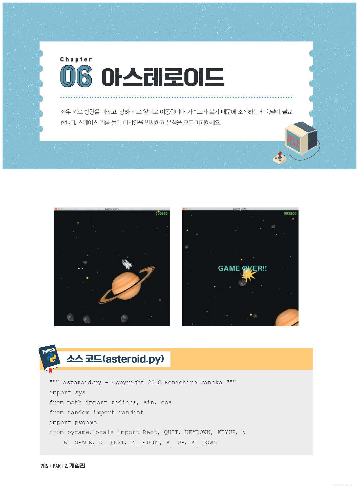

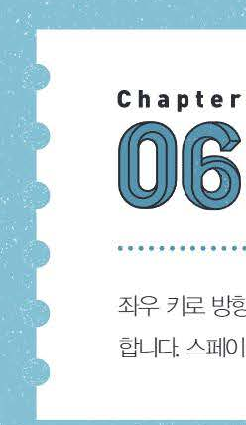

Chapte 『

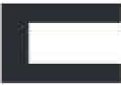

••••••••••••••••••••••••••••••••••••••••••••••••••••••••••••••••••••••••••••••••••••••••

###### 좌우 키로 방항을 바꾸고{ 상하 키로 앞두匡 이동합니다 가속도가 붙기 때문에 조작하는데 숙달이 필요

합니다 스페0~ 7 層 눌러 D|사일을 발사하고 운석을 모두 파고固세요

23

3

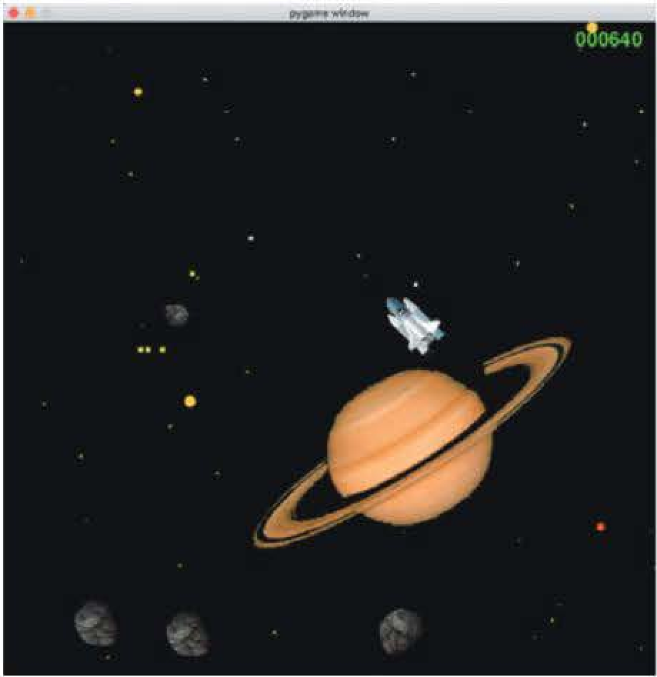

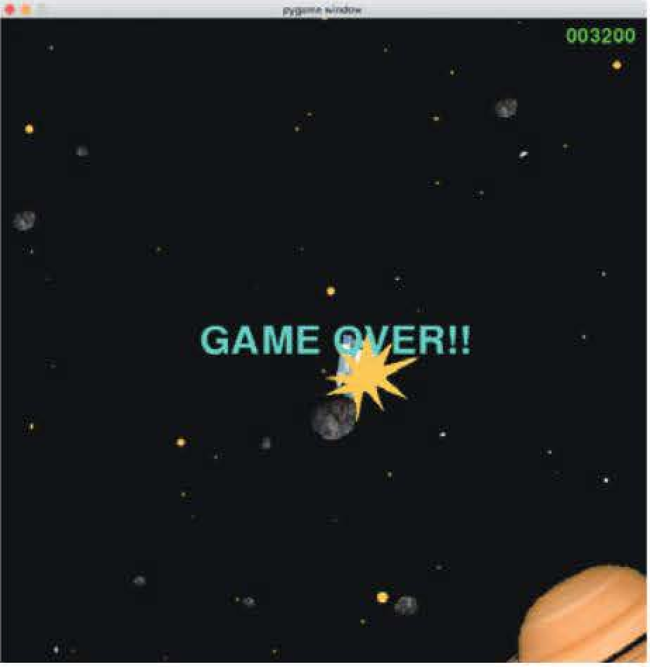

###### 소스 코드<asteroid.py)

111111 asteroid.py - Copyright 2016 Kenichiro Tanaka 1111 11 import sys from math import radians, sin, cos from random import randint import pygame from pygame.locals import Rect, QUIT, KEYDOWN, KEYUP, \

K SPACE, K LEFT, K RIGHT, K UP, K DOWN

###### 204 1PART 2.게임편

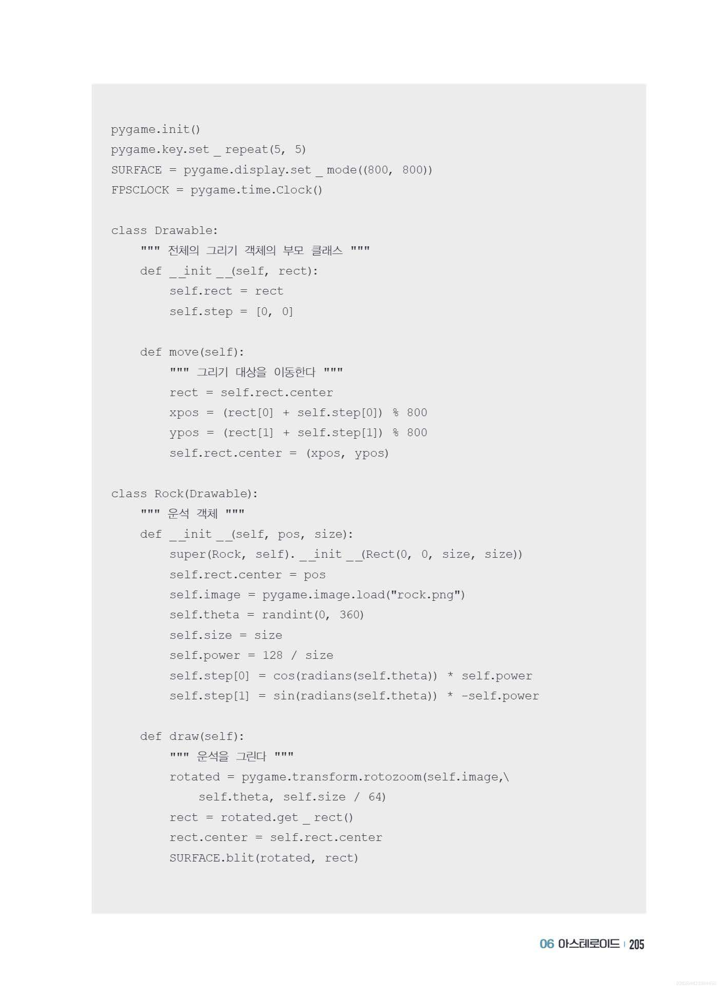

pygame .init () pygame .key.set repeat(5, 5) SURFACE = pygame.display.set mode((BOO, 800)) FPSCLOCK = pygame.time.Clock()

class Drawable:

###### """

###### ”””

전체의 그리기 객체의 부모 클래스

init (self, rect) : self. rect = rect self.step = [O, 0]

def

###### def move (self) :

""" 그리기 대상을 이동한다 """

rect = self.rect.center

xpos = (rect [0] + self.step[O]) ypos = (rect[l] + self. step[l]) self. rect.center = (xpos, ypos)

% 800 % 800

class Rock(Drawable) :

IIIIII 운석 객체 """

def init (self, pos, size) : super (Rock, self) . init (Rect (0, 0, size, size) ) self.rect.center = pos self.image = pygarne.irnage.load("rock.png") self.theta = randint (0, 360) self.size = size self.power = 128 / size self. step[O] = cos (radians (self.theta)) * self.power self. step[l] = sin(radians(self.theta) ) * - self.power

def draw (self) :

""“ 운석을 그린다 IIIIII

rotated = pygame.transform.rotozoom(self.image,\

self.theta, self.size / 64) rect = rotated.get rect () rect.center = self.rect.center SURFACE .blit (rotated, rect)

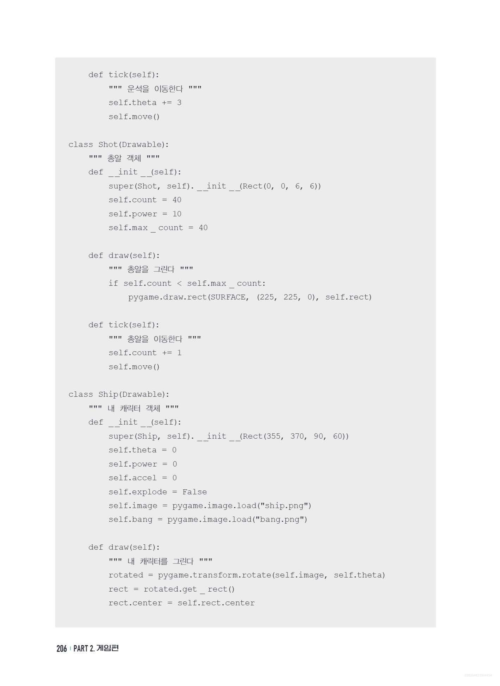

###### def tick(self) :

II II II 운석을 이동한다

II II II

self.theta += 3 self.move ()

###### class Shot (Drawable) :

총알 객체 """

II II II

init (self) : super(Shot, self) . init self.count = 40 self.power = 10 self.max count = 40

def

(Rect (0, 0, 6, 6) )

def draw(self) :

""" 총알을 그린다 ”””

if self.count < self.max count:

pygame .draw.rect (SURFACE, (225, 225, 0) , self.rect)

def tick(self) :

###### ”""

""" 총알을 이동한다

self.count += 1 self.move ()

###### class Ship(Drawable) :

내 캐릭터 객체 """

II 1111

init _(self) : super(Ship, self) . self.theta = 0 self.power = 0 self.accel = 0 self.explode = False

def

init (Rect (355, 370, 90, 60) )

self.image = pygame.image.load("ship.png") self.bang = pygame.image.load("bang.png")

def draw(self) :

111111 내 캐릭터를 그린다 """

rotated = pygarne.transforrn.rotate (self.irnage, self.theta) rect = rotated.get _ rect() rect.center = self.rect.center

###### 206 1PART 2. 게임편

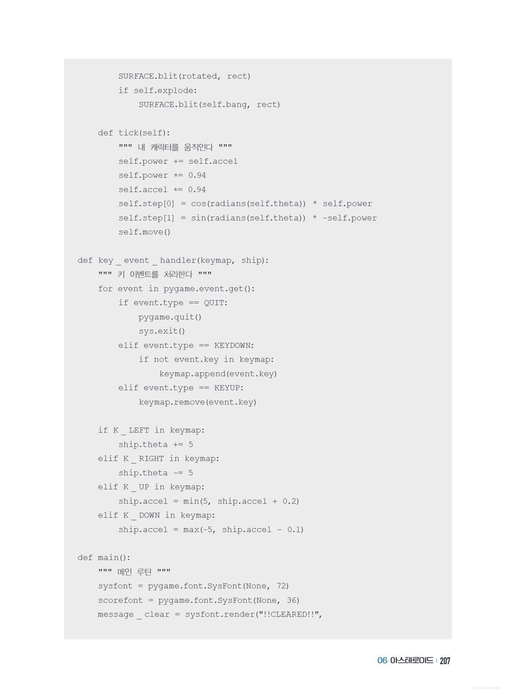

SURFACE.blit(rotated, rect) if self.explode :

SURFACE.blit (self.bang, rect)

def tick (self) :

IIIIII 내 캐릭터를 움직인다 "" "

self.power += self.accel self.power *= 0.94 self.accel *= 0.94 self.step[OJ = cos(radians(self.theta)) * self.power self.step[l] = sin(radians(self.theta)) * - self.power self.move ()

###### def key event handler(keymap, ship) :

""“ 키 이벤트를 처리한다 """

for event in pygame .event .get () :

if event.type == QUI T: pygame.quit() sys .exit()

elif event.type == KEYDOWN:

if not event. key in keymap:

keymap. append (event. key) elif event.type == KEYUP:

keymap.remove (event . key)

if K LEFT in keymap: ship.theta += 5 elif K RIGHT in keymap: ship.theta - = 5 elif K UP in keymap:

ship.accel = min(5, ship.accel + 0.2) elif K DOWN in keymap:

ship.accel = max(-5, ship.accel - 0.1)

###### def main() :

IIIIII 메인 루틴 " ""

###### sysfont = pygarne.font. SysFont(None, 72) scorefont = pygarne.font. SysFont(None, 36) message clear = sysfont.render("!!CLEARED! !",

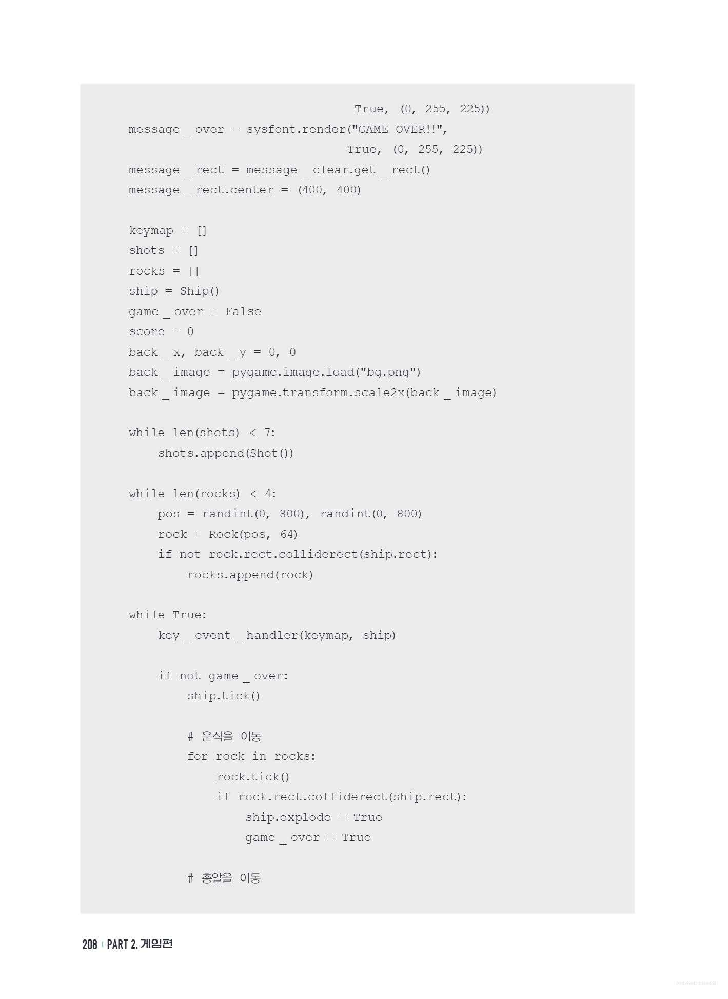

True, (0, 255, message over = sysf ont.render("GAME OVER! !",

###### 225) )

True, (0, 255, c l ear.get rect()

###### 225) )

message rect = message message rect.center =

(400, 400)

keyrnap = [] shots = [] rocks = [] shi p = Ship() game over = False score = 0 back x, back y = 0, 0

###### back image = pygarne.i rnage.load("bg.png") back image = pygame.transform.scale2x(back

i mage)

while len (shots) < 7:

shots .append(Shot ())

while len(rocks) < 4: pos = randint (0, 800), randint (0, 800) rock = Rock (pos, 64) if not rock.rect. colliderect(ship.rect) :

###### rocks .append (rock)

while True: key event handler (keymap, ship)

if not game over: shi p .tick ()

# 운석을 이동

f or rock in rocks : rock.tick()

if rock.rect .col liderect(ship.rect) : ship.expl ode = True game over = True

# 총알을 이동

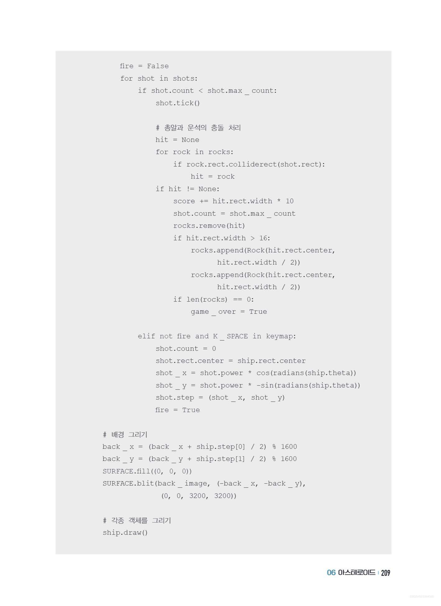

fire = False f or shot i n shots :

if shot.count < shot.max count:

shot.t i c k ()

# 총알과 운석의 충돌 처리

hit = None f or rock in rocks :

i f rock.rect .colliderect(shot.rect) :

hi t = rock

if hit != None: score += hit.rect.wi dth * 10 shot.count = shot.max count r ocks. remove (hi t) i f hit.rect.wi dth > 16:

rocks.append(Rock(hit .rect .center, hit .rect .width / 2) ) rocks.append(Rock(hit .rect .center,

hit .rect.width / 2) ) i f l en(rocks) == 0:

game over = True

elif not fire and K SPACE in keyrnap : shot.count = 0 shot. rect.center = ship.rect.center shot x = shot.power * cos (radi ans (ship.theta)) shot y = shot.power * - si n(radi ans(shi p.theta)) shot.step = (shot x, shot—y) fire = True

# 배경 그리기

- back x = (back x + shi p .step[O] / 2) % 1600
- back y = (back y + shi p .step[1] / 2) % 1600 SURFACE.fill((0, 0, 0)) SURFACE.blit(back _ i mage, (- back _ x, - back _ y),

(0, o, 3200, 3200))

# 각종 객체를 그리기

###### shi p .draw()

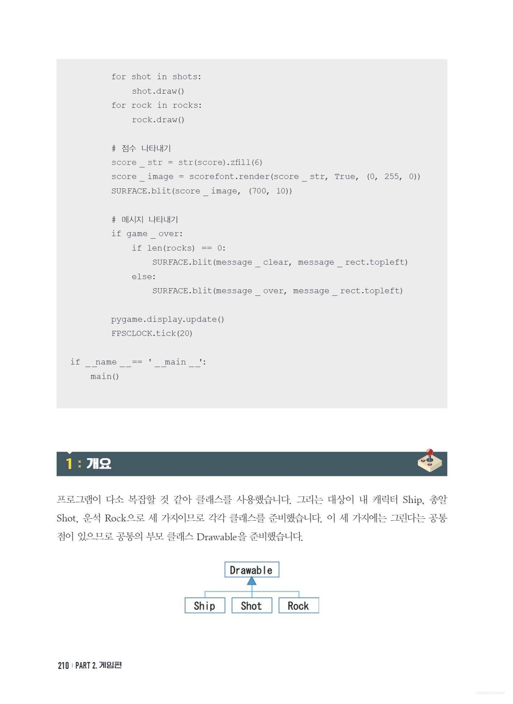

for shot in shots : shot .draw() for rock in rocks: rock.draw()

# 점수 나타내기

score str = str(score) .zfill(6) score image = scorefont.render (score str, True, (0, 255, 0)) SURFACE.blit (score image, (700, 10) )

# 메시지 나타내기

if game over: if len (rocks) == 0:

SURFACE.blit(message —clear, message rect.topleft)

else:

SURFACE.blit(message —over, message rect.topleft)

pygame .display.update () FPSCLOCK.tick (20)

I maln• ’..

if name main()’

프로그램이 다소 복잡할 것 같아 클래스를 사용했습니다. 그리는 대상이 내 캐릭터 Ship, 총알 Shot, 운석 Rock으로 세 가지이므로 각각 클래스를 준비했습니다. 이 세 가지에는 그린다는 공통 점이 였으므로 공통의 부모 클래스 Drawable을 준비했습니다.

Drawable

###### Ship Shot Rock

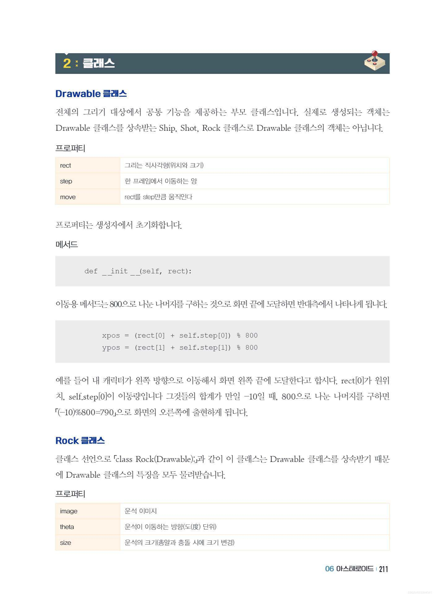

###### 클태스

###### 전체의 그리기 대상에서 공통 기능을 제공하는 부모 클래스입니다. 실제로 생성되는 객체는 Drawable 클래스를 상속받는 Ship, Shot, Rock 클래스로 Drawable 클래스의 객체는 아닙니다.

프로퍼El

###### rect step move

###### 그리는 직사각형(위치와 크기)

한 프레임에서 이동하는 앙

reel를 step만큼 움직인다

###### 프로퍼티는 생성자에서 초기화합니다.

메서드

###### def init (self, rect) :

이동용 메서드는 80따뚝L 냐눈 나머지를구하는 것으로 화면 끝에 도딜하면 반내측에서 나타냐게 됩니다.

###### xpos = (rect[0] + self.step[0]) % 800 ypos = (rect[1] + self.step[l]) % 800

예를 들어 내 캐릭터가 왼쪽 방향으로 이동해서 화면 왼쪽 끝에 도달한다고 합시다. rect[O]가 원위

###### 치. self.step[O]이 이동량입니다 그것들의 합계가 만일 ―10일 때, 800으로 냐눈 나머지를 구하면 「(―10)%800=790~로 화면의 오른쪽에 출현하게 됩니다.

###### 클태스 클래스 선언으로 「class Rock(Drawable)：戶十 같이 이 클래스는 Drawable 클래스를 상속받기 때문 에 Drawable 클래스의 특징을 모두 물려받습니다.

###### 프로퍼티

image 운석이미지 theta 운석이 이동하는 방향(도(度) 단위) size 운석의 크기(총알과 충돌 시에 크기 변경)

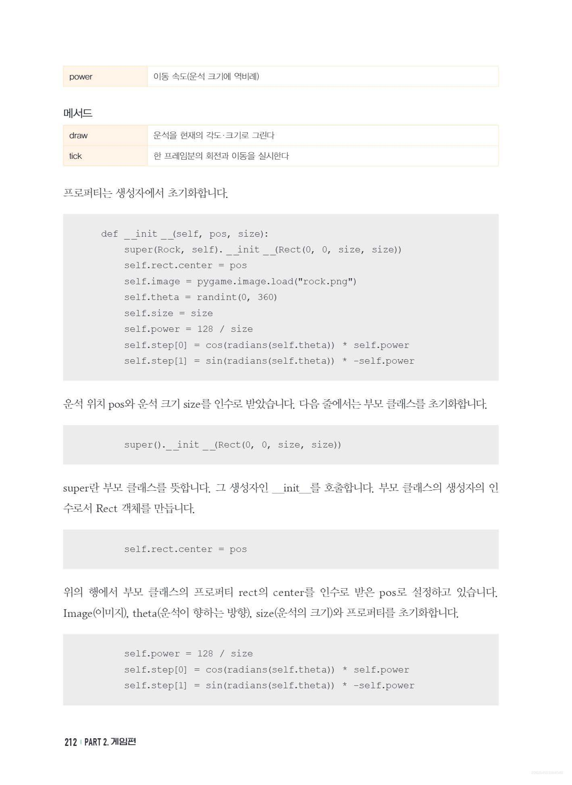

###### power

이동 속도(운석 크기에 역비례)

머l서드

###### draw

운석을 현재의 각도·크기로 그린다

tick

한 프레임분의 희전과 이동을 실시한다

프로퍼티는 생성자에서 초기화합니다.

def i n i t __(self, pos, s i ze) : super(Rock, self). i nit (Rect (O, 0, self. rect.center = pos

s i• ze) )

Sl’ ze

’

self .image = pygame.i mage.load("rock.png") self.theta = randint(O, 360) self.s ize = s i ze self.power = 128 / size

self.step[OJ = cos(radians(self.theta)) * self.power self.step[l] = si n (radians (self.theta)) * - self.power

운석 위치 pos와 운석 크기 size를 인수로 받았습니다. 다음 줄에서는 부모 클래스를 초기화합니다.

super() . init (Rect(O, 0, Slze• ’

size)• )

###### super란 부모 클래스를 뜻합니다. 그 생성자인 _init—-를 호출합니다. 부모 클래스의 생성자의 인

수로서 Rect 객체를 만듭니다.

###### self. rect.center = pos

위의 행에서 부모 클래스의 프로퍼티 rect의 center를 인수로 받은 pos로 설정하고 있습니다.

###### Image(이미지), theta(운석이 향하는 방향), size(운석의 크기)와 프로퍼티를 초기화합니다.

self.power = 128 / size self.step[O] = cos(radi ans(self.theta)) * self.power self.step[1] = si n (radians (self.theta)) * -self.power

###### 2121PART 2. 게임펀

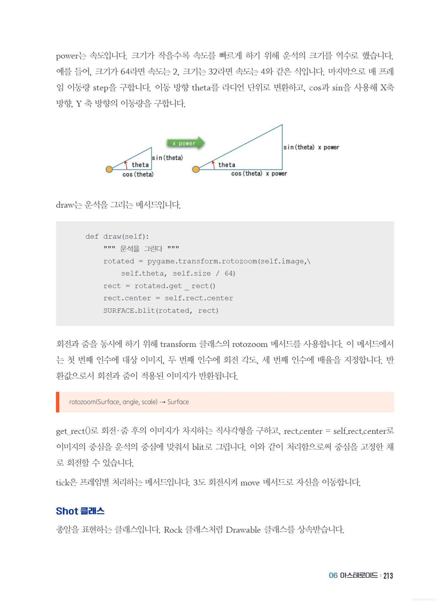

power는 속도입니다. 크기가 작을수록 속도를 빠르게 하기 위해 운석의 크기를 역수로 했습니다.

예를 들어, 크기가 64라면 속도는 2, 크기는 32라면 속도는 4와 같은 식입니다. 마지막으로 매 프레 임 이동량 step을 구합니다. 이동 방향 theta를 라디언 단위로 변환하고, cos과 sin을 사용해 X축 방향 Y 축 방향의 이동량을 구합니다.

s in(theta) x power js in(theta)

theta cos (theta)

###### theta cos (theta) x power

draw는 운석을 그리는 메서드입니다.

###### def draw(self) :

""“ 운석을 그린다 IIIIII

rotated = pygame.transform.rotozoom(self.image,\

self.theta, self. s ize / 64) rect = rotated.get rect() rect.center = self.rect.center SURFACE.blit(rotated, rect)

회전과 줌을 동시에 하기 위해 transform 클래스의 rotozoom 메서드를 사용합니다. 이 메서드에서

###### 는 첫 번째 인수에 대상 이미지, 두 번째 인수에 회전 각도, 세 번째 인수에 배율을 지정합니다. 반

환값으로서 회전과 줌이 적용된 이미지가 반환됩니다.

###### rotozoom(Surface, angle, scale) -+ Surface

get_rectO로 회전줌 후의 이미지가 차지하는 직사각형을 구하고, red.center = self.red.center로 이미지의 중심을 운석의 중심에 맞춰서 blit로 그립니다. 이와 같이 처리함으로써 중심을 고정한 채 로회전할수있습니다. tick은 프레임별 처리하는 메서드입니다. 3도 회전시켜 move 메서드로 자신을 이동합니다.

Shot 클태스 총알을 표현하는 클래스입니다. Rock 클래스처럽 Drawable 클래스를 상속받습니다.

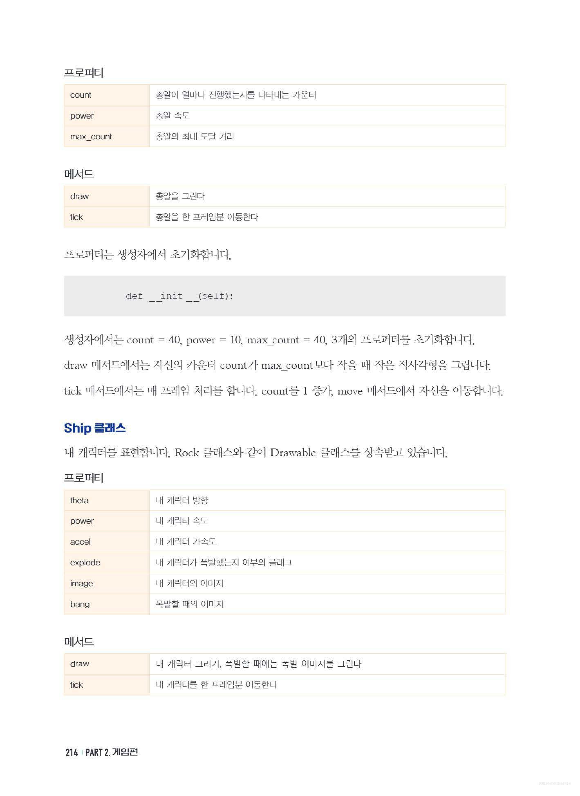

프로퍼티

###### count power max_count

총알이 얼마나 진행했는지를 나타내는 카운터

총알속도

총알의 최대도달거리

머I서드

draw tick

총알을그린다

총알을 한 프레임분 이동한다

###### 프로퍼티는 생성자에서 초기화합니다.

def init (self) :

생성자에서는 count =40, power =10, max_count =40, 3개의 프로퍼티를 초기화합니다. draw 메서드에서는 자신의 카운터 count가 max_count보다 작을 때 직은- 직사각형을 그립니다. tick 메서드에서는 매 프레임 처리를 합니다. count를 1 증가, n1ove 메서드에서 자신을 이동합니다.

Ship 클태스 내 캐릭터를 표현합니다. Rock 클래스와 같이 Drawable 클래스를 상속받고 있습니다.

프로퍼티

theta power accel explode lmage bang

내 캐릭터 방향

내 캐릭터 속도

내 캐릭터 가속도

내 캐릭터가 폭발했는지 여부의 플래그

내 캐릭터의 이미 지

폭발할때의 이미지

머I서드

draw tick

###### 내 캐 릭터 그리 기, 폭발할 때에는 폭발 이미지를 그린다

내 캐릭터를 한 프레임분 이동한다

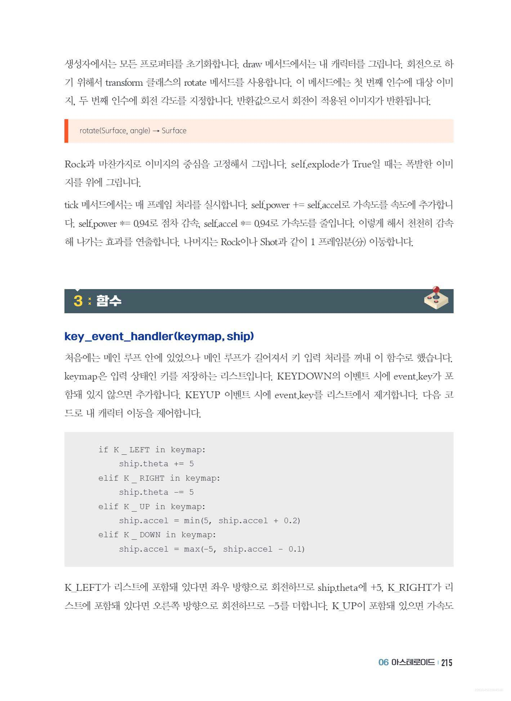

생성자에서는 모든 프로퍼티를 초기화합니다. ch·aw 메서드에서는 내 캐릭터를 그럽니다. 회전으로 하 기 위해서 ti·ansf01m 클래스의 rotate 메서드를 사용합니다. 이 메서드에는 첫 번째 인수에 대상 이미 지, 두 번째 인수에 회전 각도를 지정합니다. 반흰값으로서 회전이 적용된 이미지가 반환됩니다.

Rock과 마찬가지로 이미지의 중심을 고정해서 그립니다. self.explode가 True일 때는 폭발한 이미

지를위에그립니다.

ticl{ 메서드에서는 매 프레임 처리를 실시합니다. self.power += self.accel로 기속도를 속도에 추가합니 다. self.power *= 0.94로 점차 김속, self.accel *= 0.94로 가속도를 줄입니다. 이렇게 해서 천천히 갑속 해 나가는 효과를 연출합니다. 나머지는 Rock이냐 Shot과 같이 1 프레임분(分) 이동합니다.

key_event_handle『Ckeymap, ship)

처음에는 메인 루프 안에 있었으냐 메인 루프가 길어져서 키 입력 처리를 꺼내 이 함수로 했습니다. keymap은 입력 상태인 키를 저장하는 리스트입니다. KEYDOWN의 이벤트 시에 event.key가 포

###### 함돼 있지 않으면 추가합니다. KEYUP 이벤트 시에 event.key를 리스트에서 제거합니다. 다음 코

드로 내 캐릭터 이동을 제어합니다.

if K —LEFT in keyrnap:

ship.theta += 5 elif K RIGHT in keyrnap: ship.theta - = 5 elif K UP in keyrnap:

ship.accel = rnin(5, ship.accel + 0.2) elif K DOWN in keyrnap:

ship.accel = rnax(-5, ship.accel - 0.1)

K_LEFT가 리스트에 포함돼 있다면 좌우 방향으로 회전하므로 ship.theta에 +5, K_RIGHT가 리

스트에 포함돼 있다면 오른쪽 방향으로 회전하므로 ―5를 더합니다. K_UP이 포함돼 있으면 가속도

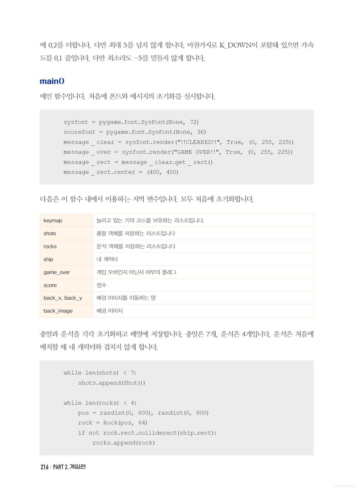

에 0.2를 더합니다. 다만 최대 5를 넘지 않게 합니다. 마찬가지로 K_DOWN이 포함돼 있으면 가속

도를 0.1 줄입니다. 다만 최소라도 ―5를 밑돌지 않게 합니다.

###### mainO

메인 함수입니다. 처음에 폰트와 메시지의 초기화를- 실시합니다.

sysfont = pygarne.font.SysFont (None, 72) scorefont = pygarne.font.SysFont(None, 36) rnessage clear = sysfont.render ("!!CLEARED! !", True, (0, 255, 225) ) message _ over = sysfont.render("GAME OVER! !", True, (0, 255, 225)) message _ rect = message _ clear.get rect () message rect.center = (400, 400)

다음은 이 함수 내에서 이용하는 지역 변수입니다. 모두 처음에 초기화합니다.

keymap

눌리고 있는 키의 코드를 보유하는 리스트입니다.

shots rocks ship

총알 객체를 저장하는 리스트입니다

운석 객체를 저장하는 리스트입니다

내 캐릭터 game_over 게임 오버인지 아닌지 여부의 플래그 score 점수 back_x, back_y back_image

배경 이미지를 이동하는 양

배경 이미지

총알과 운석을 각각 초기화하고 배열에 저장합니다. 총알은 7개, 운석은 4개입니다. 운석은 처음에 배치할 때 내 캐릭터와 겹치지 않게 합니다.

while len(shots) < 7:

shots .append(Shot () )

while len(rocks) < 4: pos = randint (0, 800), randint(0, 800) rock = Rock (pos, 64) if not rock.rect .colliderect(ship.rect):

rocks. append (rock)

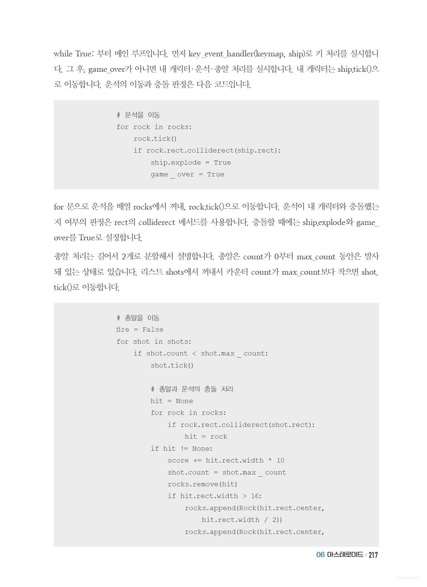

###### while True: 부터 메인 루프입니다. 먼저 key_event_handler(keymap, ship)로 키 처리를 실시합니 다. 그 후, game_over가 아니면 내 캐릭터 ·운석 ·총알 처리를 실시합니다. 내 캐릭터는 ship.tickO으

###### 로 이동합니다. 운석의 이동과 충돌 판정은 다음 코드입니다.

# 운석을 이동

f or rock in rocks: rock.tick() if rock.rect .colliderect(shi p .rect) :

ship.explode = True game over = True

for 문으로 운석을 배열 rocks에서 꺼내, rock.tickO으로 이동합니다. 운석이 내 캐릭터와 충돌했는 지 여부의 판정은 rect의 colliderect 메서드를 사용합니다. 충돌할 때에는 ship.explode와 game_ over를 True로 설정합니다.

###### 총알 처리는 길어서 2개로 분할해서 설명합니다. 총알은 count가 0부터 max_count 동인은 발사 돼 있는 상태로 있습니다. 리스트 shots에서 꺼내서 카운터 count가 max_count보다 작으면 shot. tickO로 이동합니다.

# 총알을 이동

fire = False f or shot i n shots:

if shot.count < shot.max count:

shot.t ick ()

# 총알과 운석의 충돌 처리

hit = None for rock in rocks :

if rock.rect .colliderect(shot. rect) :

hi t = rock

if hit != None: score += hit.rect.width * 10 shot.count = shot.max count r ocks. remove (hi t) if hit.rect.wi dth > 16:

rocks.append(Rock(hit.rect .center, hi t .rect.width / 2)) rocks.append(Rock(hit.rect .center,

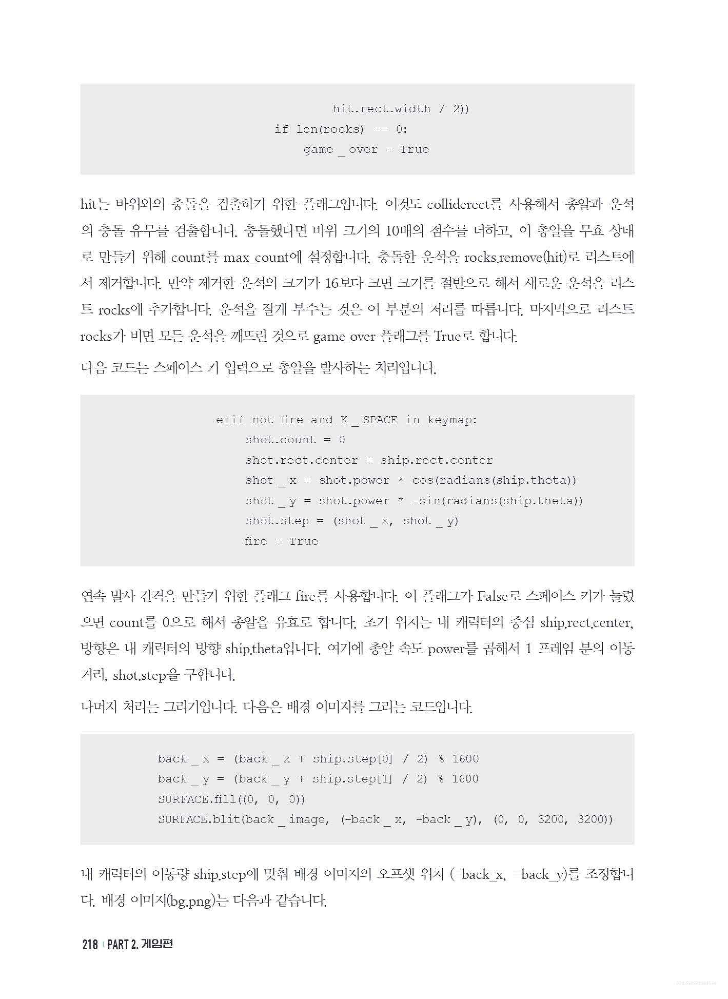

hit.rect.width / 2) ) if len(rocks) == 0:

game over = True

hit는 바위와의 충돌을 검출하기 위한 플래그입니다. 이것도 colliderect를 사용해서 총알과 운석 의 충돌 유무를 검출합니다. 총돌했다면 바위 크기의 10배의 점수를 더하고, 이 총알을 무효 상태

###### 로 만들기 위해 count를 max_count에 설정합니다. 충돌한 운석을 rocks.remove(hit)로 리스트에

- 서 제거합니다. 만약 제거한 운석의 크기가 16보다 크면 크기를 절반으로 해서 새로운 운석을 리스 트 rocks에 추가합니다. 운석을 잘게 부수는 것은 이 부분의 처리를 따릅니다. 마지막으로 리스트 rocks가 비면 모든 운석을 깨뜨린 것으로 game_over 플래그를 True로 합니다.

- 다음 코드는 스페이스 키 입력으로 총일을- 발사하는 처리입니다.

elif not fire and K _ SPACE in keymap: shot.count = 0 shot.rect.center = ship.rect.center

- shot x = shot.power * cos(radians(ship.theta))
- shot y = shot.power * -sin(radians(ship.theta)) shot.step = (shot x, shot y) fire = True

연속 발사 간격을 만들기 위한 플래그 fire를 사용합니다. 이 플래그가 False로 스페이스 기가 눌렸 으면 count를 0으로 해서 총알을 유효로 합니다. 초기 위치는 내 캐릭터의 중심 ship.red.center, 방향은 내 캐릭터의 방향 ship.theta입니다. 여기에 총알 속도 power를 곱해서 1 프레임 분의 이동

###### 거리, shot.step을 구합니다.

냐머지 처리는 그리기입니다. 다음은 배경 이미지를 그리는 코드입니다.

back x = (back x + ship.step[0] / 2) % 1600 back y = (back y + ship.step[l] / 2) % 1600 SURFACE .fill((O, 0, 0)) SURFACE.blit(back image, (-back x, - back y) I (0, 0, 3200, 3200) )

내 캐릭터의 이동량 ship.step에 맞춰 배경 이미지의 오프셋 위치 (—back_x, ―back_y)를 조정합니

###### 다. 배경 이미지(bg.png)는 다음과 같습니다.

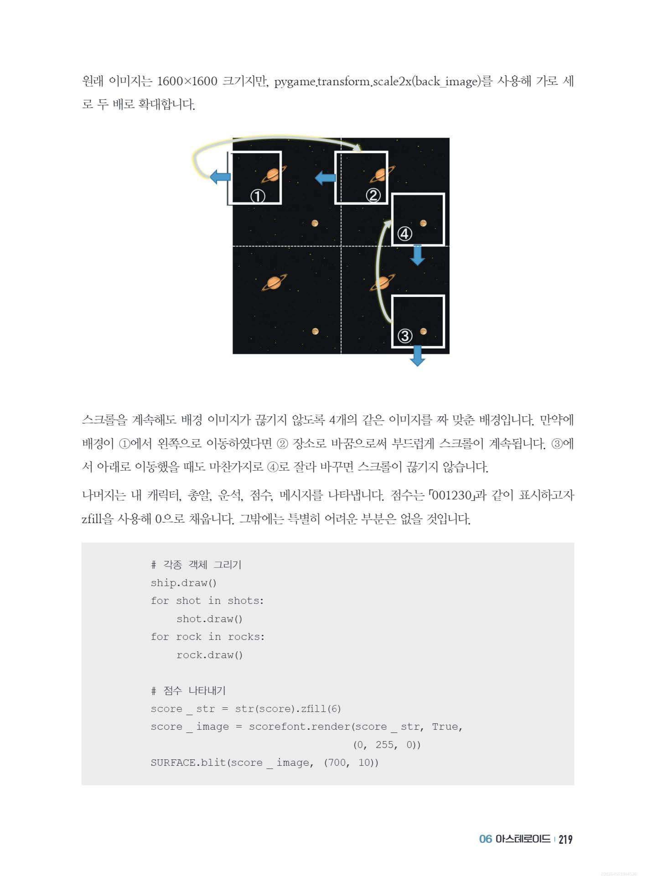

###### 원래 이미지는 1600X1600 크기지만, pygame.transform.scale2x(back_image)를 사용해 가로 세

로두배로확대합니다.

스크롤을 계속해도 배경 이미지가 끊기지 않도록 4개의 같은 이미지를 짜 맞춘 배경입니다. 만약에

배경이 ®에서 왼쪽으로 이동하였다면 ® 장소로 바꿈으로써 부드럽게 스크롤이 계속됩니다. ®에 서 아래로 이동했을 때도 마찬가지로 @로 잘라 바꾸면 스크롤이 끊기지 않습니다. 나머지는 내 캐릭터, 총알, 운석, 점수, 메시지를 나타냅니다. 점수는 「001230묘} 같이 표시하고자 zfill을 사용해 0으로 재웁니다. 그밖에는 특별히 어려운 부분은 없을 것입니다.

# 각종 객체 그리기

ship.draw() for shot in shots: shot.draw() for rock in rocks : r ock.draw()

# 점수 나타내기

score str = str(score) .zfill(6) score image = scorefont.render(score str, True,

(0, 255, 0)) SURFACE.blit(score image, (700, 10))

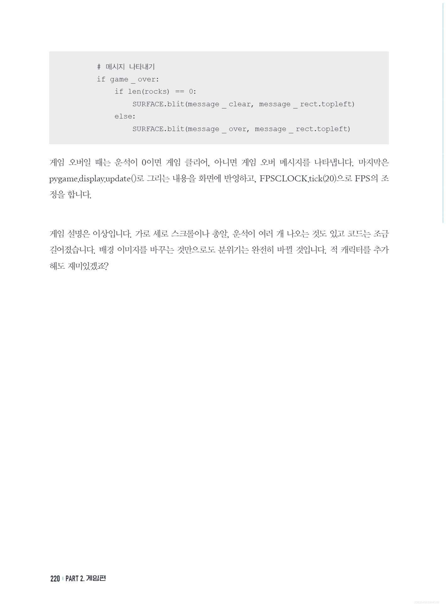

# 메시지 나타내기

if game over: if len(rocks) == 0:

SURFACE .blit(message clear, message rect .topleft) else:

SURFACE .blit(message over, message _ rect .topleft)

게임 오버일 때는 운석이 0이면 게임 클리어, 아니면 게임 오버 메시지를 나타냅니다. 마지막은

###### pygame.display.updateO로 그리는 내용을 화면에 반영하고, FPSCLOCK.tick(20)으로 FPS의 조 정을합니다.

게임 설명은 이상입니다. 가로 세로 스크롤이나 총알, 운석이 여러 개 나오는 것도 있고 코드는 조금 길어졌습니다. 배경 이미지를 바꾸는 것만으로도 분위기는 완전히 바뀔 것입니다. 적 캐릭터를 추가 해도재미있겠죠?

###### 220 1PART 2.게임편

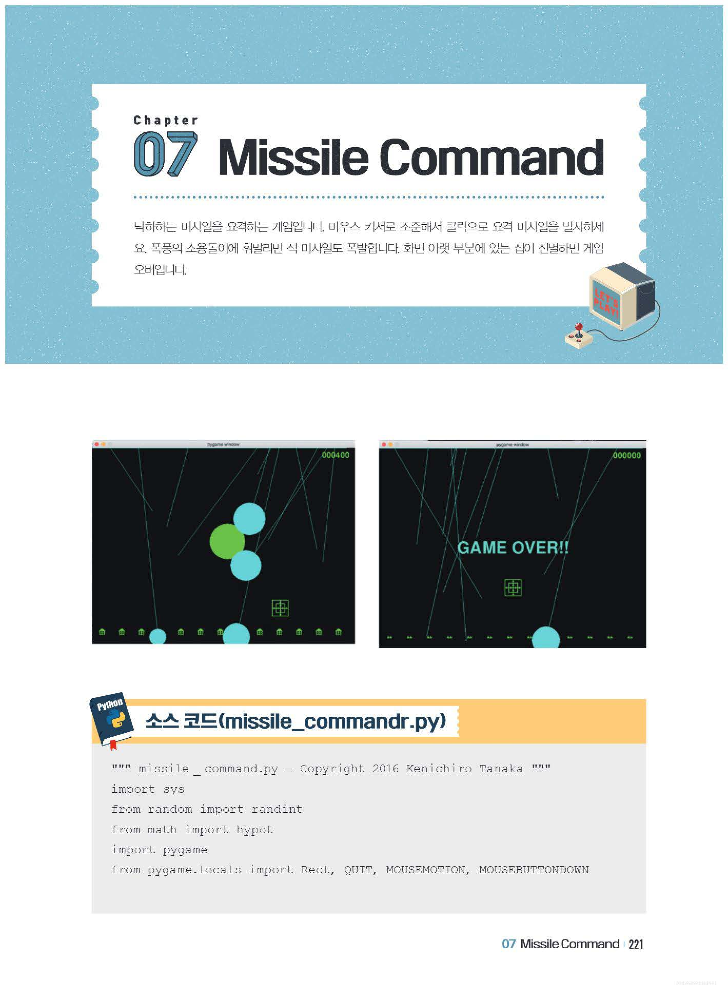

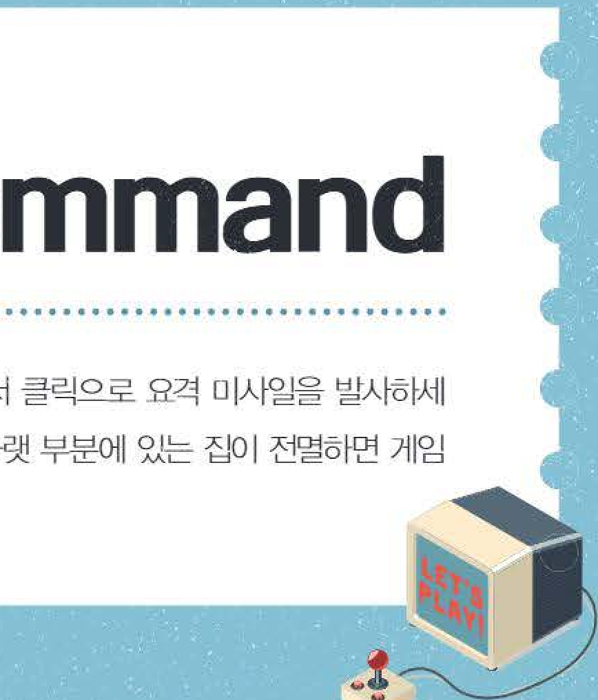

Chapte 『

。

••••••••••••••••••••••••••••••••••••••••••••••••••••••••••••••••••••••••••••••••••••••••

###### 낙하하는 미사일을 요격하는 게임입니다. 마우스 커서로 조준해서 클릭으로 요격 미사일을 발사하세 요 폭풍의 소용돌이에 휘말리면 적 미사일도 폭발합니다. 화면 아랫 부분에 있는 집이 전멸하면 게임

오버입니다

23

3

.

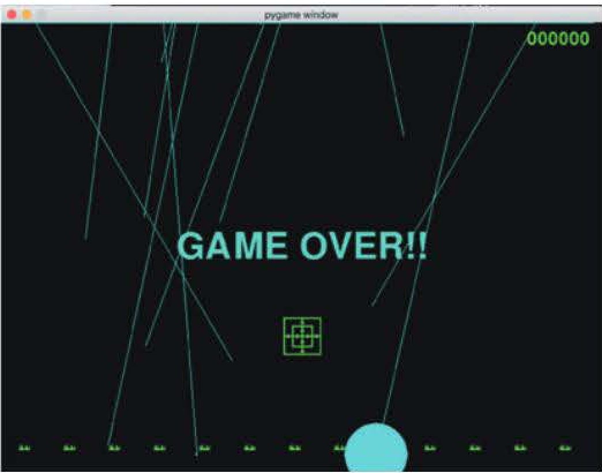

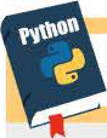

###### 소스 코드{missile_commandr.py)

111111 missile _ command.py - Copyright 2016 Kenichiro Tanaka 111111 import sys from random import randint from math import hypot import pygame from pygame.locals import Rect, QUIT, MOUSEMOTION, MOUSEBUTTONDOWN

07 Missile Command 1 221

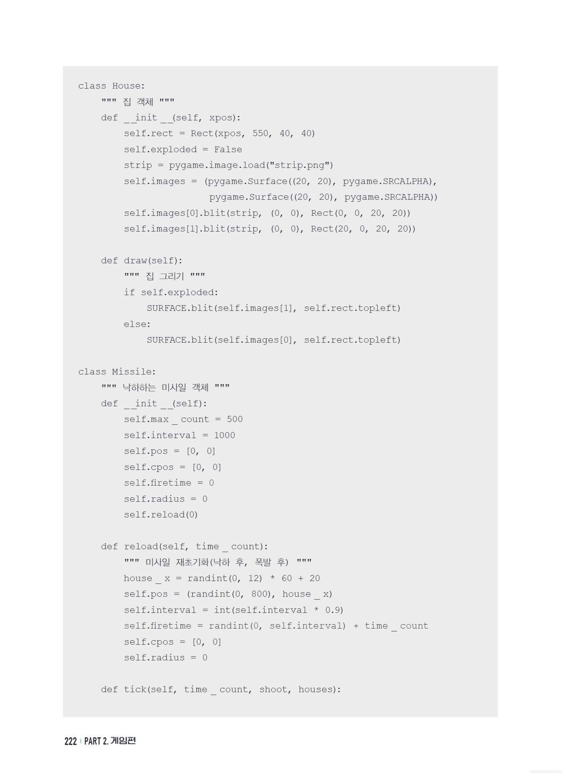

class House :

###### """

###### ”””

집 객체

(self, xpos) : self. rect = Rect (xpos, 550, 40, 40) self.exploded = False strip = pygarne.i rnage.load("strip.png") self.images = (pygarne.Surface ((20, 20) , pygarne.SRCALPHA) ,

def

init

pygarne .Surface ((20, 20) , pygarne .SRCALPHA) ) self.images[0] .blit(strip, (0, 0) , Rect(0, 0, 20, 20)) self.irnages[l] .blit(strip , (0, 0) , Rect(20, 0, 20, 20))

def draw(self) :

""" 집 그리기 ”””

if self.exploded:

SURFACE .blit (self.images [1] , self.rect .topleft) else:

SURFACE .blit (self.images [0] , self.rect .topleft)

class Mi ssile:

낙하하는 미사일 객체 """

II 1111

init (self) : self.max _ count = 500 self.interval = 1000 self.pos = [O, 0] self.cpos = [O, OJ self.firetime = 0

def

self. radius = 0 self.reload(O)

def reload (self, t ime count) :

IIIIII 미사일 재초기화(낙하 후, 폭발 후) """

house x = randint(0, 12) * 60 + 20 self.pos = (randint(O, 800), house x) self.interval = int(self.interval * 0.9) self.firetirne = randint (0, self. interval) + t ime count self.cpos = [O, OJ self. radius = 0

def tick(self, time — count, shoot, houses) :

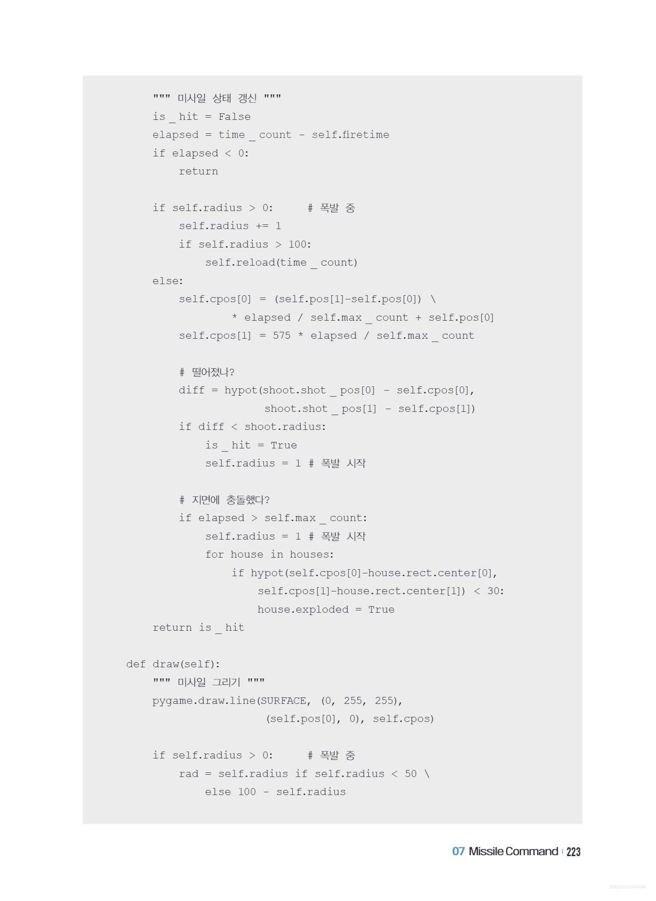

""“ 미사일 상태 갱신

1111 11

is hit = False elapsed = time if elapsed < 0:

count - self.firetime

return

if self.radius > 0: # 폭발 종 self.radius += 1 if self.radius > 100:

self.reload(time count) else:

self.cpos [O] = (self.pos [l]-self.pos[O]) \

* elapsed / self.max count + self.pos[0] self.cpos [l] = 575 * elapsed / self.max count

# 떨어졌나?

diff = hypot (shoot.shot

pos [O] - self.cpos [O], pos[l] - self.cpos[l])

shoot. shot if diff < shoot.radius:

is hit = True self.radius = 1 # 폭발 시작

# 지면에 충둘했다?

if elapsed > self.max _ count: self.radius = 1 # 폭발 시작 for house in houses:

if hypot(self.cpos [0]-house.rect.center[O] , self.cpos[l]- house.rect.center[l]) < 30: house.exploded = True

return is hit

def draw (self) :

###### ”“”

111111 □ |사일 그리기

pygarne .draw.line (SURFACE, (0, 255, 255) , (self.pos [OJ, 0) , self.cpos)

if self.radius > 0: # 폭발 중 rad = self.radius if self.radius < 50 \

else 100 - self.radius

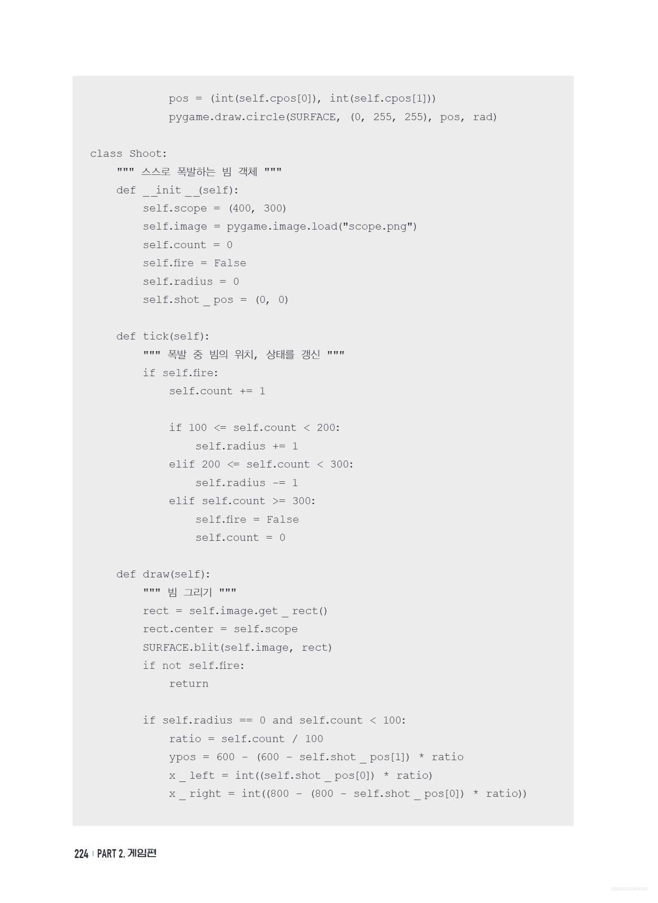

pos = (int(self.cpos[0]), int(self.cpos[l])) pygame .draw.circle (SURFACE, (0, 255, 255) , pos, rad)

class Shoot:

IIIIII 스스로 폭발하는 빔 객체 II II II

def init (self) : self.scope = (400, 300) self.image = pygarne.i mage.load("scope.png") self.count = 0 self.fire = False

self. radius = 0 self.shot pos = (0, 0)

def tick(self) :

""" 폭발 중 빔의 위치, 상태를 갱신 """

if sel f .fire : self.count += 1

if 100 <= self.count < 200:

self.radius += 1

elif 200 <= self.count < 300:

self.radius —= 1

elif self.count >= 300: self .fire = False self.count = 0

###### def draw(self) :

""" 빔 그리기 """

rect = self.image.get rect(} rect.center = self.scope SURFACE.blit (self.irnage, rect) if not self.fire :

return

if self. radius == 0 and self.count < 100: ratio = self.count / 100 ypos = 600 - (600 - self.shot _ pos[l]) * ratio x left = int((self.shot _ pos[0]) * ratio) x right = int((800 - (800 - self.shot pos [0]) * ratio) )

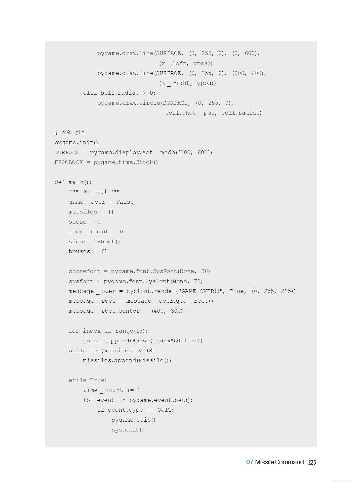

pygarne.draw.line (SURFACE, (0, 255, 0) , (0, 600) , (x left, ypos) ) pygarne.draw.line (SURFACE, (0, 255, 0) , (800, 600) ,

(x right, ypos) ) elif self.radius > 0:

pygarne.draw.circle(SURFACE, (0, 255, 0), self. shot pos, self.radius)

# 전역 변수

pygame . init () SURFACE = pygame .display. set mode ([800, 600)) FPSCLOCK = pygame.time.Clock()

###### def main() :

""“ 메인 루틴 """

game over = False missiles• = [] score = 0 time _ count = 0 shoot = Shoot() houses = []

scorefont = pygarne.font. SysFont(None, 36) sysfont = pygarne.font. SysFont(None, 72) message over = sysfont.render("GAME OVER! !", True, (0, 255, 225)) message rect = message over.get rect() message rect.center = (400, 300)

for index in range (13) :

houses .append(House (index*60 + 20) ) while len(missiles) < 18:

missiles .append (Missile () )

while True: time _ count += 1 for event in pygame .event.get() :

if event.type == QUIT: pygame .quit () sys .exit()

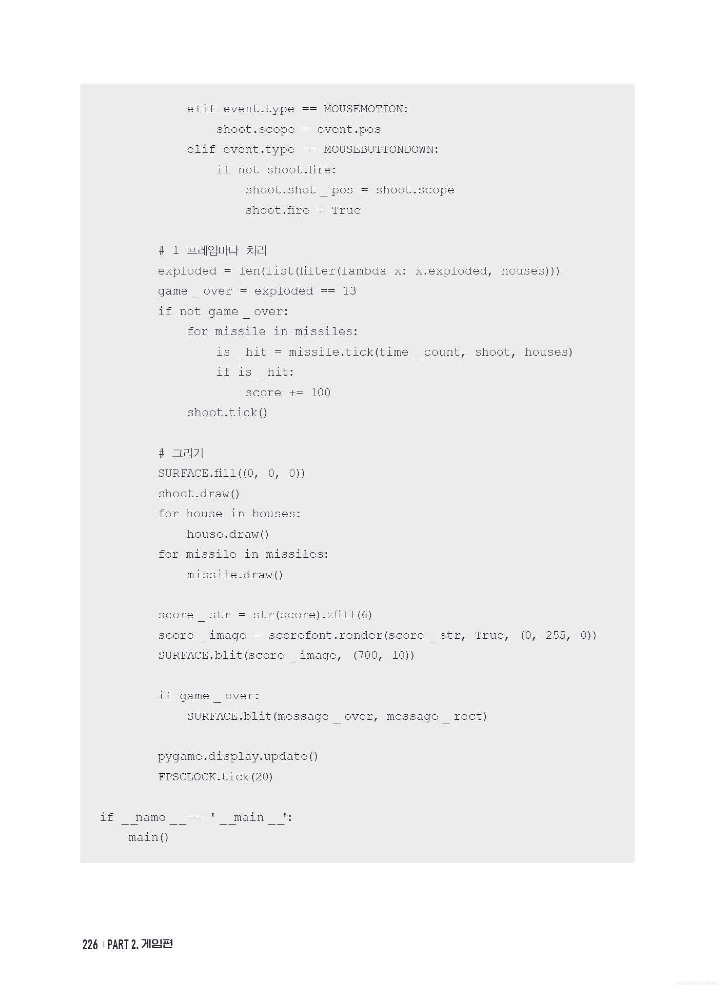

e lif event .type == MOUSEMOTION: shoot . scope = event .pos

e lif event .type == MOUSEBUTTONDOWN:

i f not shoot .fire : shoot .shot pos = shoot.scope shoot .fire = True

# 1 프레임마다 처리

exploded = len(list(filter(larnbda x : x .exploded, houses))) game over = exploded == 13 if not game _ over:

f or missile i n missil es: i s hi t = missile.t i ck(ti me count, shoot, houses) i f i s hi t :

scor e += 100 shoot.tick()

# 그리기

SURFACE.fill ((O, 0, 0)) shoot.draw() f or house i n houses: house .draw()

f or missile i n missiles: missile .d r aw()

score str = str(score) .zfill(6) score i mage = scorefont .r ender (score str, True, (0, 255, 0)) SURFACE.blit(score image, (700, 10))

if game over: SURFACE .blit(message over, message rect )

pygame .display.update O FPSCLOCK.tick (20)

’ • maln ,.

if name mai• n()

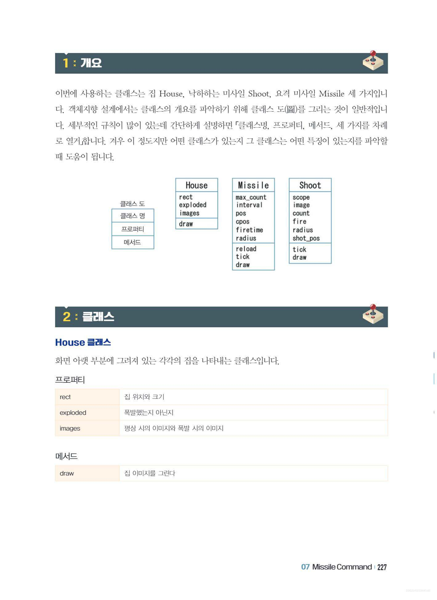

이번에 사용하는 클래스는 집 H ouse, 낙하하는 미사일 Shoot, 요격 미사일 Missile 세 가지입니

###### 다. 객체지향 설계에서는 클래스의 개요를 파악하기 위해 클래스 도(圖)를 그리는 것이 일반적입니

###### 다. 세부적인 규칙이 많이 있는데 간단하게 설명하면 「클래스명, 프로퍼티, 메서드, 섀 가지를 차례 로 열거」합니다. 겨우 이 정도지만 어떤 클래스가 있는지 그 클래스는 어떤 특징이 있는지를 파악할 때 도움이 됩니다.

|House|
|---|
|rect exploded images•|
|draw|

|Missi le|
|---|
|max_count interva l pos cpos firetime radius|
|reload tick draw|

|Shoot|
|---|
|scope i•mage count f i re radius shot_pOS|
|ti ck draw|

클래스도

###### 클래스명

프로퍼티

메서드

House 클태스

###### 화면 아랫 부분에 그려져 있는 각각의 집을 나타내는 클래스입니다.

###### 프로퍼티

rect 집위치와크기 exploded 폭발했는지아닌지 images 평상 시의 이미지와 폭발 시의 이미지

###### 메서드

draw 집 이미지를그린다

###### 07 MissileCommand 1 227

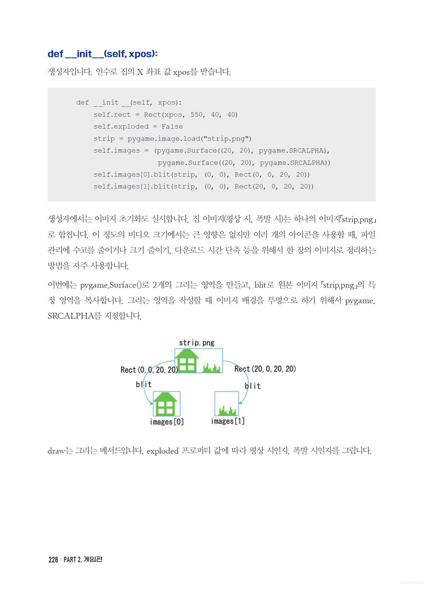

###### def __init__(self, xpos):

생성자입니다. 인수로 집의 X 좌표 값 xpos를 받습니다.

def init (self, xpos) : self. rect = Rect(xpos, 550, 40, 40) self.exploded = False strip = pygarne.irnage.load("strip.png") self.images = (pygame.Surface((20, 20), pygarne.SRCALPHA),

pygame .Surface ((20, 20) , pygame .SRCALPHA) ) self.images[O] .blit(strip, (0, 0), Rect(O, 0, 20, 20)) self.images[1] .blit(strip, (0, 0), Rect(20, 0, 20, 20))

###### 생성자에서는 이미지 초기화도 실시합니다. 집 이미지(평상 시, 폭발 시)는 하나의 이미지「strip.png」

로 합칩니다. 이 정도의 비디오 크기에서는 큰 영향은 없지만 여러 개의 아이콘을 사용할 때, 파일 관리에 수고를 줄이거냐 크기 줄이기, 다운로드 시간 단축 등을 위해서 한 장의 이미지로 정리하는 방법을 자주 시용-합니다.

###### 이번에는 pygame.SurfaceO로 2개의 그리는 영역을 만들고, blit로 원본 이미지 「strip.pngfl-1 특

정 영역을 복사합니다. 고리는 영역을 작성할 때 이미지 배경을 투명으로 하기 위해서 pygame. SRCALPHA를 지정합니다.

strip. png

t(20,0, 20, 20)

Rect (0,

###### bl~t

###### I it

images [O] images [1]

draw는 그리는 메서드입니다. exploded 프로퍼티 값에 따라 평상 시인지, 폭발 시인지를 그립니다.

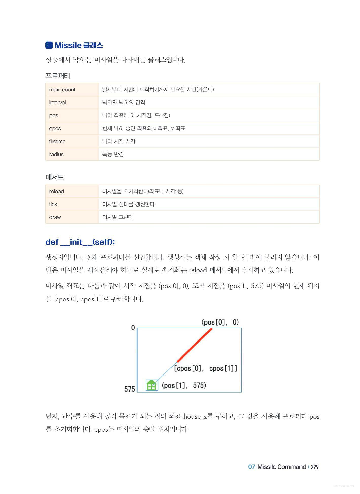

###### (I Missile 클태스

###### 상공에서 낙하는 미사일을 나타내는 클래스입니다.

프로퍼티

###### max_count interval

###### 발사부터 지먼에 도착하기까지 필요한 시간(카운트)

낙하와 낙하의간격

###### pos cpos firetime

낙하 좌표(낙하 시작점. 도착점)

현재 낙하 중인 좌표의 x 좌표. y 좌표

###### 낙하시작시각

radius 폭풍반경

메서드

###### reload tick draw

###### 미사일을 초기화한다(좌표나 시각 등)

미사일상태를갱신한다

미사일그린다

###### def __init__(self):

생성자입니다. 전체 프로퍼티를 선언합니다. 생성자는 객체 작성 시 한 번 밖에 불리지 않습니다. 이 번은 미사일을 재사용해야 하므로 실제로 초기화는 reload 메서드에서 실시하고 있습니다. 미사일 좌표는 다음과 같이 시작 지점을 (pos[O]. 0), 도착 지점을 (pos[l], 575) 미사일의 현재 위치 를 [cpos[O], cpos[l]］로 관리합니다.

(pos [OJ , 0)

。

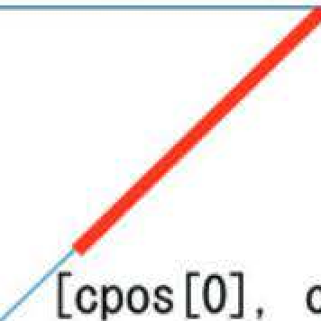

[cpos[OJ , cpos[l]J

/

###### (pos [1] , 575)

575

###### 먼저, 난수를 사용해 공격 목표가 되는 집의 좌표 house_x를 구하고, 그 값을 사용해 프로퍼티 pos 를 초기화합니다. cpos는 미사일의 총알 위치입니다.

07 Missile Command 1 229

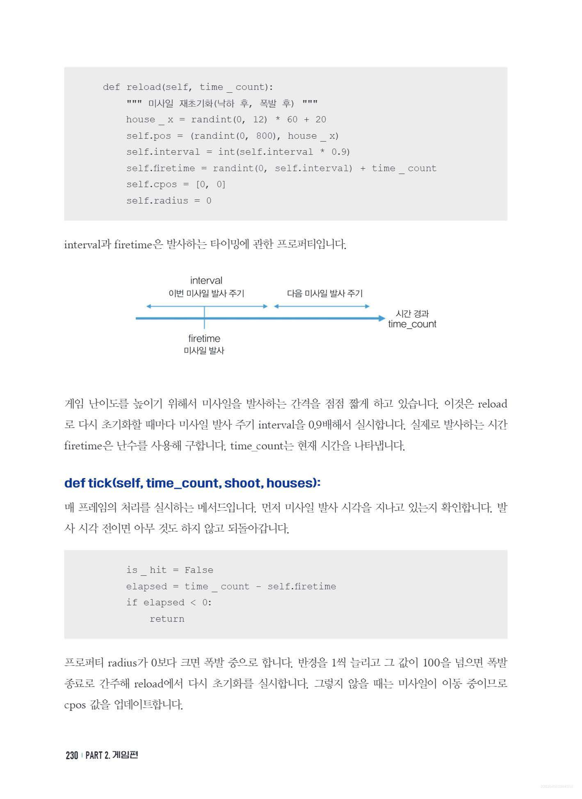

def reload (self, time count) :

IIIIII 미사일 재초기화(낙하 후, 폭발 후) " ""

house x = randint(0, 12) * 60 + 20 self.pos = (randint(O, 800), house x) self.interval = int(self.interval * 0.9) self.firetirne = randint (0, self.interval) + time count self.cpos = [0, OJ self.radius = 0

interval과 firetime은 발사하는 타이밍에 관한 프로퍼티입니다.

###### interval

이번미사일발사주기

E虐 D|사일 발사주7 1

시간경과

###### time_count

###### firetime

미사일발사

게임 난이도를 높이기 위해서 미사일을 발사하는 간격을 점점 짧게 하고 있습니다. 이것은 reload 로 다시 초기화할 때마다 미사일 발사 주기 interval을 0.9배해서 실시합니다. 실제로 발사하는 시간 firetime은 난수를 사용해 구합니다. time_count는 현재 시간을 나타냅니다.

###### deftick{self, time_count, shoot, houses):

매 프레임의 처리를 실시하는 메서드입니다. 먼저 미사일 발사 시각을 지나고 있는지 확인합니다. 발

- 사 시각 전이면 아무 것도 하지 않고 되돌아갑니다.

is hit = False elapsed = time count - self.firetime if elapsed < 0: return

프로퍼티 radius가 0보다 크면 폭발 중으로 합니다. 반경을 1씩 늘리고 그 값이 100을 넘으면 폭발 종료로 간주해 reload에서 다시 초기화를 실시합니다. 그렇지 않을 때는 미사일이 이동 중이므로 cpos 값을 업데이트합니다.

###### 230 1PART 2.게임편

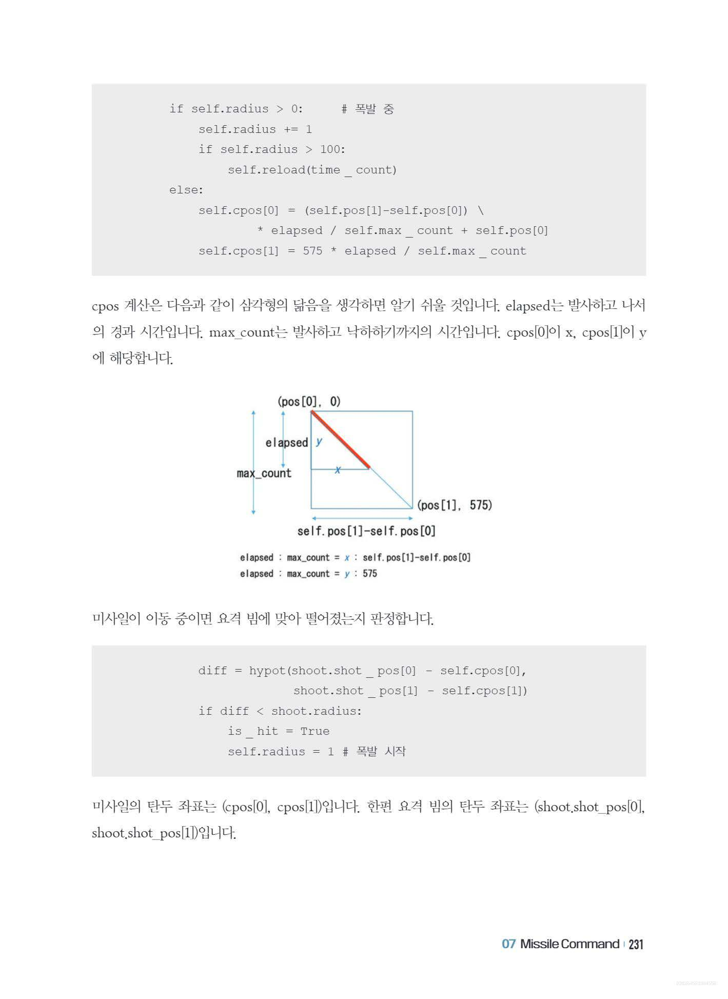

if self.radius > 0: self.radius += 1 if self.radius > 100:

# 폭발 중

self.reload(tirne count) else:

self.cpos [OJ = (self.pos [1] - self.pos[0]) \

* elapsed / self.max _ count + self.pos[OJ self.cpos [1] = 575 * elapsed / self.max count

cpos 계산은 다음과 같이 삼각형의 닮음을 생각하면 알기 쉬울 것입니다. elapsed는 발사하고 나서 의 경과 시간입니다. max_count는 발사하고 낙하하기까지의 시간입니다. cpos[O]이 x, cpos[l]이 y

에 해당합니다.

이 m

h0ts |'

Z

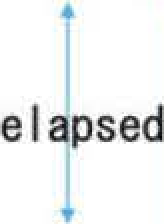

_y|

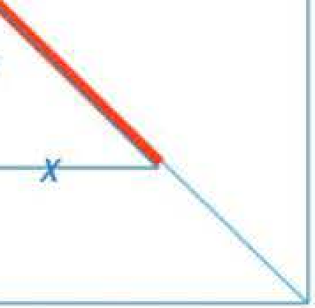

max-c。un

(pos(1 ], 575)

###### • •

###### se lf . pos [l]-se lf . pos [O]

- elapsed : max_count = x : self.pos[l]-self. pos[O]
- elapsed : max_count = y : 575

미사일이 이동 중이면 요격 빔에 맞아 떨어졌는지 판정합니다.

diff = hypot(shoot.shot pos[OJ - self.cpos[OJ , shoot . shot pos[lJ - self.cpos[l])

if diff < shoot.radius: is _ hit = True self.radius = 1 # 폭발 시작

미사일의 탄두 좌표는 (cpos[이, cpos[l]）입니다. 한편 요격 빔의 탄두 좌표는 (shoot.shot_pos[이,

###### shoot.shot_pos[1]）입니다.

07 Miss ile Command 1 231

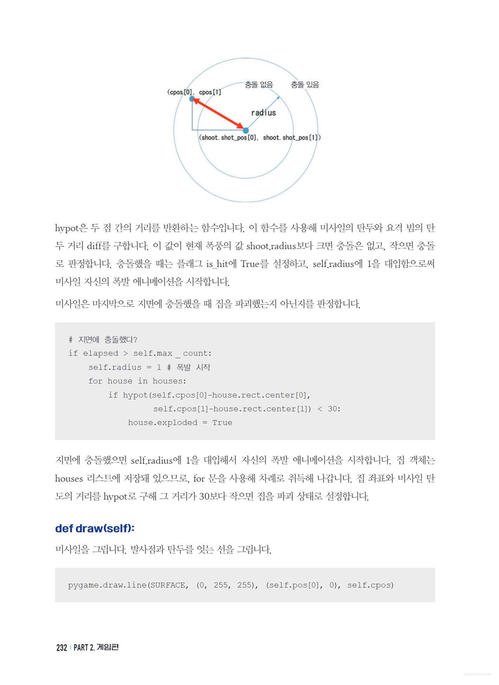

/ /.

\

- 충돌없음

충돌있음

(cpos[Ol, cpos,[t-(

\

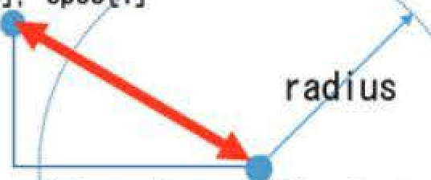

/

###### (shoot. shotJ)os[OJ. shoot. shotJ)os[l})

\

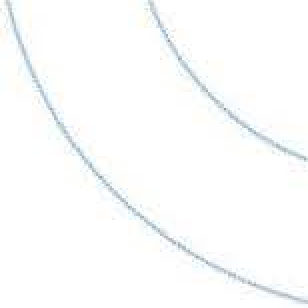

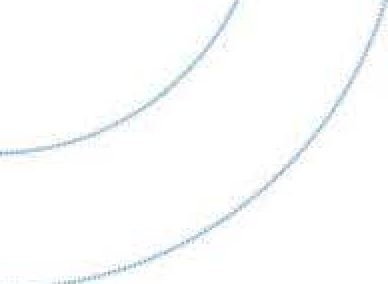

\'-----

hypot은 두 점 간의 거리를 반환하는 함수입니다. 이 함수를 사용해 미사일의 탄두와 요격 빔의 탄 두 거리 diff를 구합니다. 이 값이 현재 폭풍의 값 shoot.radius보다 크면 충돌은 없고, 작으면 충돌 로 판정합니다. 총돌했을 때는 플래그 is_hit에 True를 설정하고, self.radius에 1을 대입함으로써 미사일 자신의 폭발 애니메이션을 시작합니다.

미사일은 마지막으로 지면에 충돌했을 때 집을 파괴했는지 아닌지를 판정합니다.

# 지면에 충돌했다?

if elapsed > self.max count: self.radius = 1 # 폭발 시작 for house i n houses:

if hypot (self.cpos [0] - house .rect. center[O] ,

self.cpos[l]- house.rect.center[l]) < 30: house.exploded = True

지면에 충국물했으면 self.radius에 1을 대입해서 자신의 폭발 애니메이션을 시작합니다. 집 객체는 houses 리스트에 저장돼 있으므로, for 문을 사용해 차례로 취득해 냐갑니다. 집 좌표와 미사일 탄 도의 거리를 hypot로 구해 그 거리가 30보다 작으면 집을 파괴 상태로 설정합니다.

###### def

###### 미사일을 그립니다. 발사점과 탄두를 잇는 선을 그립니다.

pygarne .draw.line (SURFACE, (0, 255, 255) , (self.pos [O], 0) , self.cpos)

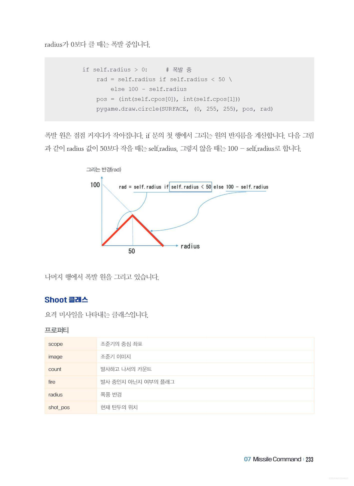

radius가 0보다 클 때는 폭발 중입니다.

if self.radius > 0: # 폭발 중 rad = self.radi us if self.radius < 50 \

else 100 — self. radius pos = (int(self. cpos[0]), int(self. cpos[l]) ) pygame.draw.cir c l e(SURFACE, (0, 255, 255), pos, rad)

폭발 원은 점점 커지다가 작아집니다. if 문의 첫 행에서 그리는 원의 반지름을 계산합니다. 다음 그림

과 같이 radius 값이 50보다작을 때는self.radius, 그렇지 않을 때는 100 —self.radius로합니다.

그리는 반경(rad)

100 \ rad = seIf. radius if| se|f.radius < ~ else 100 - self.radius

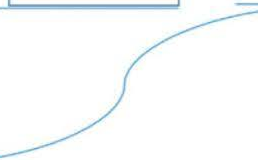

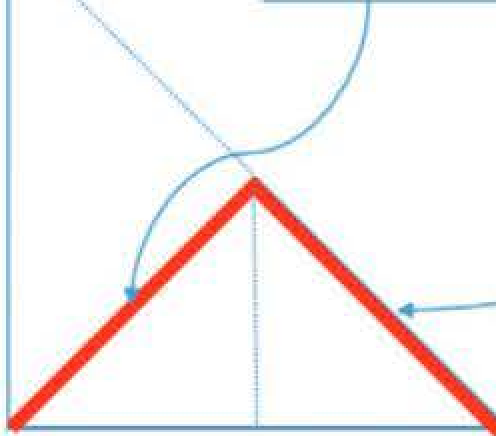

\

###### radius

50

나머지 행에서 폭발 원을 그리고 있습니다.

Shoot 클래스

요격 미사일을 나타내는 클래스입니다.

프로퍼티

scope image count fire radius shot_pos

조준기의중심좌표

###### 조준기 이미지

발사하고나서의 카운트

발사 중인지 아닌지 여부의 플래그

폭풍반경

현재탄두의워치

07 MissileCommand 1 233

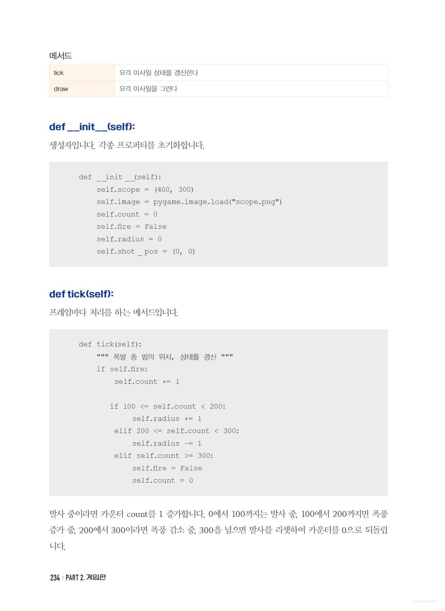

###### 머I서드

tick

요격 미사일 상태를 갱신한다

draw

요격 미사일을그린다

###### def __init__(self):

###### 생성자입니다. 긱종· 프로퍼티를 초기화합니다.

def i n i t (self) : self.scope = (400, 300) self.image = pygame.i mage.load("scope.png") self.count = 0 self.fire = Fa l se self. radi us = 0 self. shot pos = (0, 0)

###### deftick{self):

프레임마다 처리를 하는 메서드입니다.

###### def tick(self):

111111 폭발 중 빔의 위치 , 상태를 갱신 II IIII

if sel f .fire : s e l f .count += 1

i f 100 <= self.count < 200:

self.rad i us += 1

elif 200 <= self.count < 300:

self.rad i us —= 1

elif sel f .count >= 300: self.fire = False self.count = 0

발사 중이라면 카운터 count를 1 증가합니다. 0에서 100까지는 발사 중, 100에서 200까지면 폭풍

증가 중, 200에서 300이라면 폭풍 갑소 중, 300을 넘으면 발사를 리셋하여 카운터를 0으로 되돌립

###### 니다.

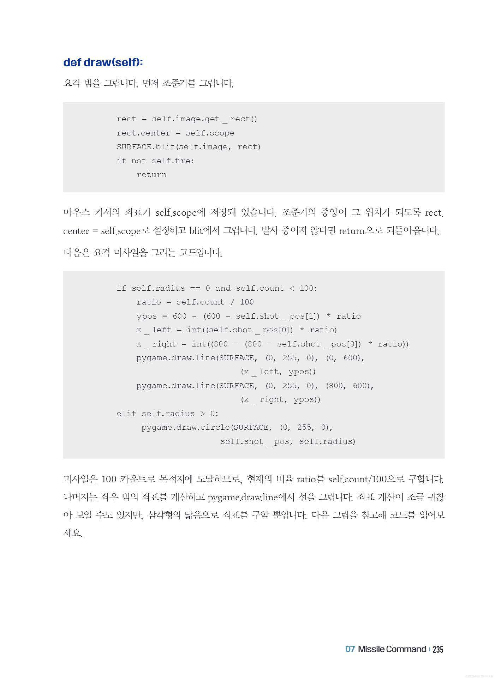

def d『awCself):

요격 빔을 그립니다. 먼저 조준기를 고립니다.

rect = self . image.get rect () rect.center = self.scope SURFACE.blit(self.image, rect) if not self.fire:

ret urn

마우스 커서의 좌표가 self.scope에 저장돼 있습니다. 조준기의 중앙이 그 위치가 되도록 rect. center = self.scope로 설정하고 blit에서 그립니다. 발사 중이지 않다면 return으로 되돌아옵니다. 다음은 요격 미사일을 그리는 코드입니다.

if self.radi us == 0 and self. count < 100: rati o = self.count / 100 ypos = 600 - (600 - self. shot pos[1] ) * rati o x l eft = int((self.shot pos[OJ ) * ratio) x r i ght = i nt((800 - (800 - self.shot _ pos[0]) * ratio) ) pygarne.d r aw.line (SURFACE, (0, 255, 0) , (0, 600) ,

(x _ l e ft, ypos) ) pygarne .draw.line (SURFACE, (0, 255, 0) , (800, 600) ,

(x r i ght, ypos) ) elif self.radi us > 0:

pygarne .draw.circl e(SURFACE, (0, 255, 0) , self.shot pos, self.radius)

미사일은 100 카운트로 목적지에 도달하므로, 현재의 비율 ratio를 self.count/100으로 구합니다.

나머지는 좌우 범의 좌표를 계산하고 pygame.draw.line에서 선을 그립니다. 좌표 계산이 조금 귀찮 아 보일 수도 있지만. 삼각형의 닮음으로 좌표를 구할 뿐입니다. 다음 그림을 참고해 코드를 읽어보 세요.

07 Missile Command 1 235

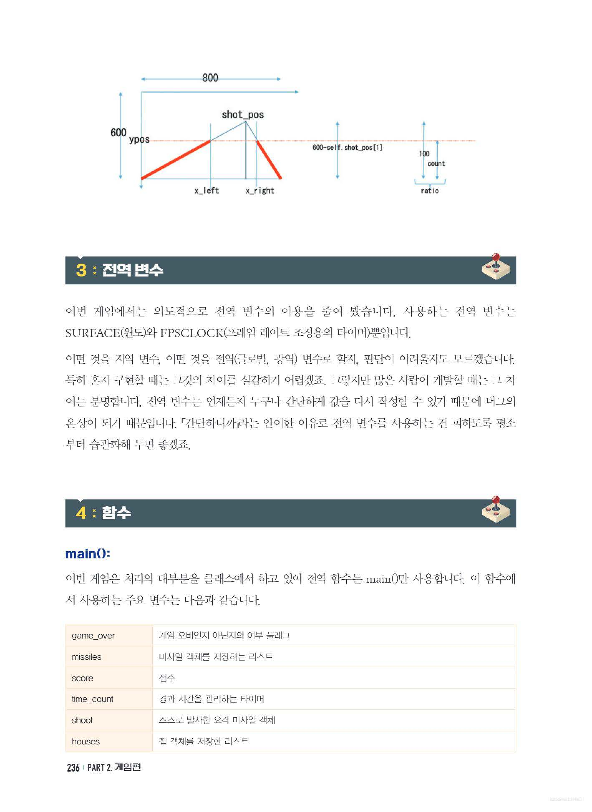

###### --800

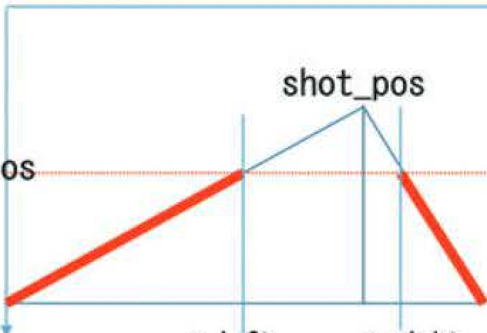

###### shot_pOS 600 ypos

,_ l00

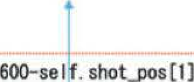

###### ` L .

nt

Co

x_left x_right ratio

이번 게임에서는 의도적으로 전역 변수의 이용을 줄여 봤습니다. 사용하는 전역

변수는

SURFACE(윈도)와 FPSCLOCK(프레임 레이트 조정용의 타이머)뿐입니다.

- 어떤 것을 지역 변수, 어떤 것을 전역(글로벌 광역) 변수로 할지, 판단이 어려울지도 모르겠습니다. 특히 혼자 구현할 때는 그것의 차이를 실갑하기 어렵겠죠. 그렇지만 많은 사람이 개발할 때는 그 차 이는 분명합니다. 전역 변수는 언제든지 누구나 간단하게 값을 다시 작성할 수 있기 때문에 버그의 온상이 되기 때문입니다. 「간단하니까」라는 안이한 이유로 전역 변수를 사용하는 건 피하도록 평소 부터 습관화해 두면 좋겠죠.

###### mainO:

###### 이번 게임은 처리의 대부분을 클래스에서 하고 있어 전역 함수는 mainO만 사용합니다. 이 함수에

###### 서 시용-하는 주요 변수는 다음과 같습니다.

game_over

게임 오버인지 아닌지의 여부 플래그

missiles

미사일 객체를 저장하는 리스트

score 점수

time_count

경과 시간을 관리하는 타이머

shoot

스스로 발사한 요격 미사일 객체

houses

집 객체를저장한리스트

###### 236 1PART 2.게임펀

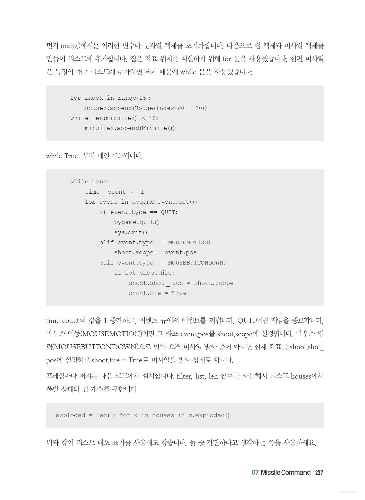

###### 먼저 main(）에서는 이러한 변수나 문자열 객체를 초기화합니다. 다음으로 집 객체와 미사일 객체를

만들어 리스트에 추가합니다. 집은 좌표 위치를 계산하기 위해 for 문을 사용했습니다. 한편 미사일

은 특정의 개수 리스트에 추가하면 되기 때문에 while 문을 사용했습니다.

for index in range (13) :

houses .append(House(index*60 + 20)) while len(missiles) < 18:

missiles .append(Missile () )

·while True: 부터 메인 루프입니다.

while True: time count += 1 for event in pygame .event.get () :

i f event.type == QUIT: pygame .quit () sys.exit()

elif event.type == MOUSEMOTION: shoot.scope = event.pos

elif event.type == MOUSEBUTTONDOWN:

if not shoot.fire: shoot.shot pos = shoot.scope shoot.fire = True

time_count의 값을 1 증가하고, 이벤트 큐에서 이벤트를 꺼냅니다. QUIT이면 게임을 종료합니다.

###### 마우스 이동(MOUSEMOTION)이면 그 좌표 event.pos를 shoot.scope에 설정합니다. 마우스 입

력(MOUSEBUTTONDOWN)으로 만약 요격 미사일 발사 중이 아니면 현재 좌표를shoot.shotpos에 설정하고 shoot.fire =True로 미사일을 발사 상태로 합니다. 프레임마다 처리는 다음 코드에서 실시합니다. filter, list, len 함수를 사용해서 리스트 houses에서 폭발 상태의 집 개수를 구합니다.

###### exploded = len([x for x in houses if x .exploded])

위와 같이 리스트 내포 표기를 사용해도 같습니다. 둘 중 간단하다고 생각하는 쪽을 사용하세요.

###### 07 Missile Command 1 237

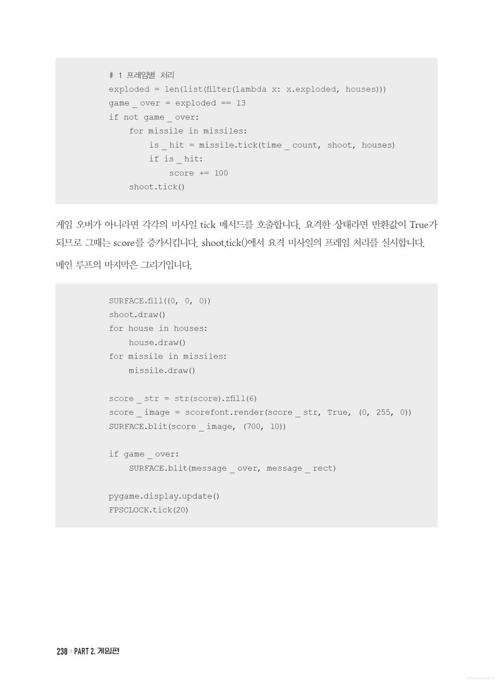

# 1 프레임별 처리

exploded = len(list(filter(lambda x : x .exploded, houses))) game over = exploded == 13 if not game over:

for missile in missiles: is _ hi t = missile.tick(ti me _ count, shoot, houses) if is hit :

score += 100 shoot.tick()

게임 오버가 아니라면 각각의 미사일 t ick 메서드를 호출합니다. 요격한 상태라면 반환값이 True가

###### 되므로 그때는 score를 증가시킵니다. shoot.tickO에서 요격 미사일의 프레임 처리를 실시합니다.

메인 루프의 마지막은 그리기입니다.

SURFACE.fill((O, 0, 0)) shoot.draw() for house in houses: house.draw()

for missile in missiles: missile .draw()

score str = str(score) .zfill(6) score i mage = scorefont.render (score str, True, (0, 255, 0) ) SURFACE.bli t (score image, (700, 10) )

if game over: SURFACE .blit(message over, message rect)

pygame .display.update O FPSCLOCK.tick (20)

###### 238 1PART 2. 게임펀

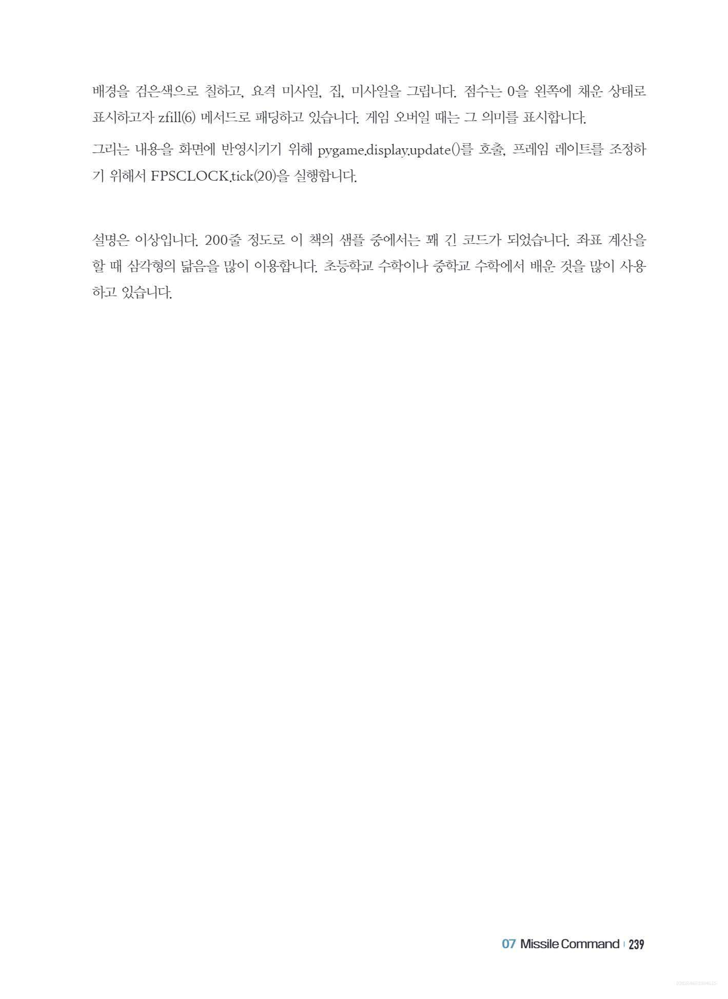

배경을 검은색으로 칠하고, 요격 미사일, 집, 미사일을 그립니다. 점수는 0을 왼쪽에 재운 상태로

###### 표시하고자 zfill(6) 메서드로 패딩하고 있습니다. 게임 오버일 때는 그 의미를 표시합니다. 그리는 내용을 화면에 반영시키기 위해 pygame.display.updateO를 호출, 프레임 례이트를 조정하 기 위해서 FPSCLOCK.tick(20)을 실행합니다.

###### 설명은 이상입니다. 200줄 정도로 이 책의 샘플 중에서는 꽤 긴 코드가 되었습니다. 좌표 계산을 할 때 삼각형의 닮음을 많이 이용합니다. 초등학교 수학이나 중학교 수학에서 배운 것을 많이 사용 하고있습니다.

07 Missile Command 1 239

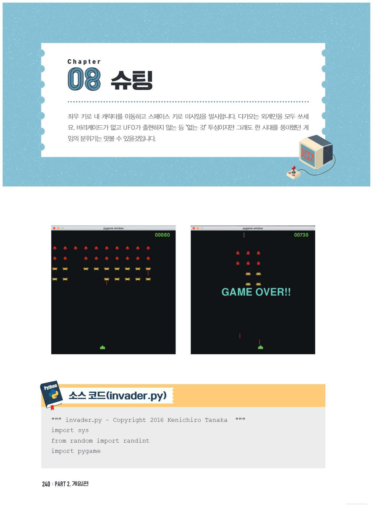

Chapte 『

AEI

###### •• • • • • • • •• • • • • ••• •• •• • • •• • • •• • • • •• • •• • • • • • • • • • •• • • •• • •• •• •• •• • • • • • • •• • •• •• • • ••• • • •• • •• • •

좌우 키로 내 캐릭터를 이동하고 스페이스 키로 미사일을 발사합니다 다가오는 외계인을 모두 쏘세 요 바리케이드가 없고 UFO가 출현하지 않는 등 "없는 것" 투성이지만 그래도 한 시대를 풍미했던 게 임의 분위71는 맛볼 수 있을것입니다.

23

3

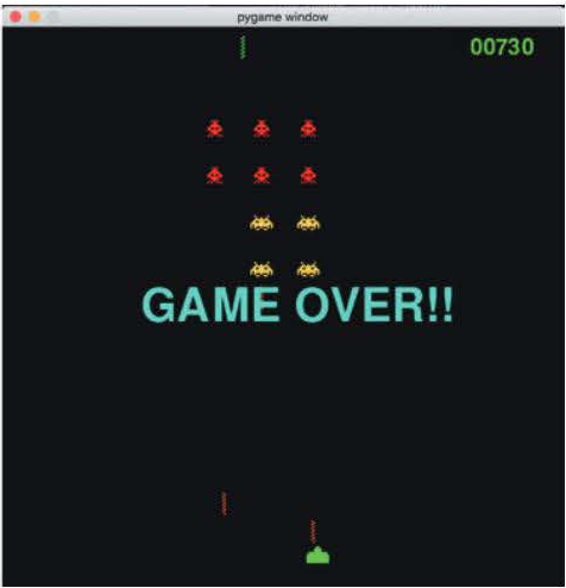

i • 머m..n

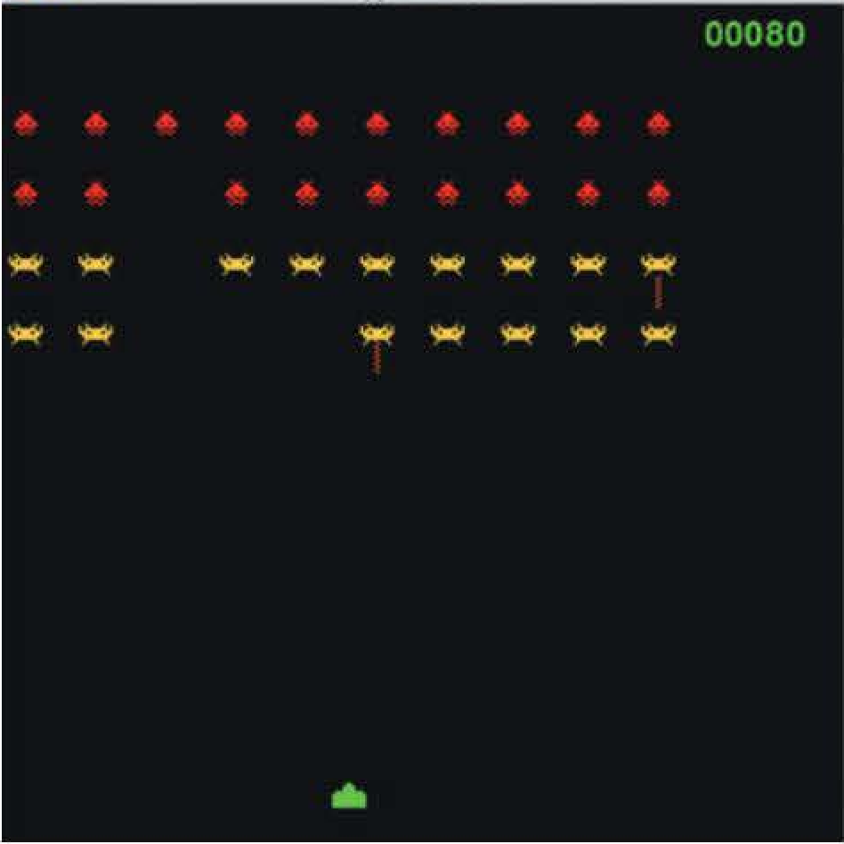

###### 소스 코드(invader.py)

111111 i nvader.py - Copyright 2016 Kenichiro Tanaka import sys f rom random import randi nt import pygame

II II II

###### 240 1PART 2. 게임편

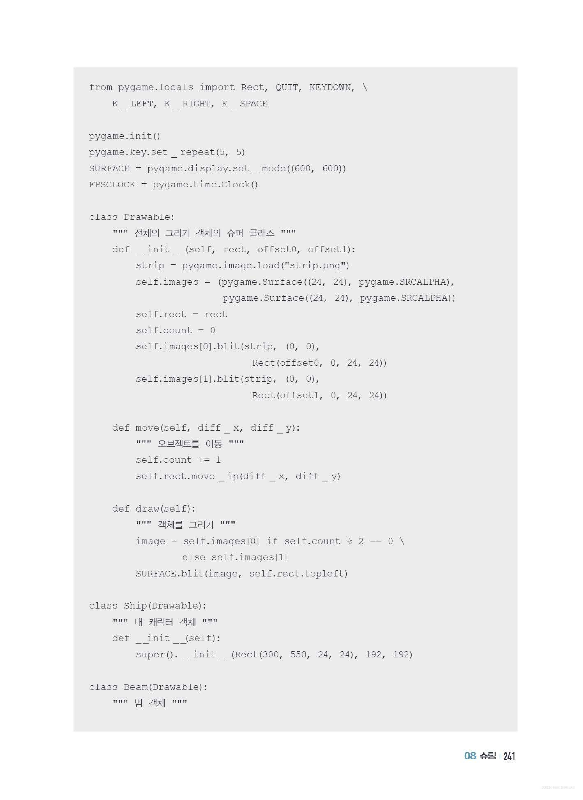

f rom pygame .locals i mport Rect, QUIT, KEYDOWN, \ K LEFT, K RIGHT, K SPACE

pygarne .i ni t () pygarne .key. set repeat (5, 5) SURFACE = pygarne.di spl ay.set rnode ((600, 600) ) FPSCLOCK = pygarne .time.Cl ock()

c l ass Drawable:

전체의 그리기 객체의 슈퍼 클래스 """

###### ”””

def

i n i t (sel f, r ect, off setO, of fsetl) : strip = pygame .image.load("stri p .png") sel f. i mages = (pygame.Surf ace ((24, 24) , pygame.SRCALPHA) ,

pygame . Surface ( (24, 24) , pygame . SRCALPHA) ) sel f .rect = rect sel f. count = 0 sel f . i mages [0] .b lit (stri p, (0, 0) ,

Rect (of fsetO, 0, 24, 24) ) sel f .i mages [l] .b lit (stri p , (0, 0) ,

Rect(of fsetl, 0, 24, 24))

def move (self, d i f f x , d iff y) :

IIIIII 오브젝트를 이동 ”””

sel f .count += 1 sel f.rect .move i p(diff x , d iff y)

def d r aw (self):

""" 객체를 그리기 IIIIII

image = self.images[O] if self.count % 2 == 0 \ e l se self.images [l] SURFACE.blit (image, self.rect.topl eft)

c l ass Ship (Dr awabl e) :

""" 내 캐릭터 객체 """

def i ni t (sel f) : super() . i n i t (Rect (300, 550, 24, 24) , 192, 192)

c l ass Beam(Drawabl e) :

111111 빔 객체 """

###### 08 슈링 I 241

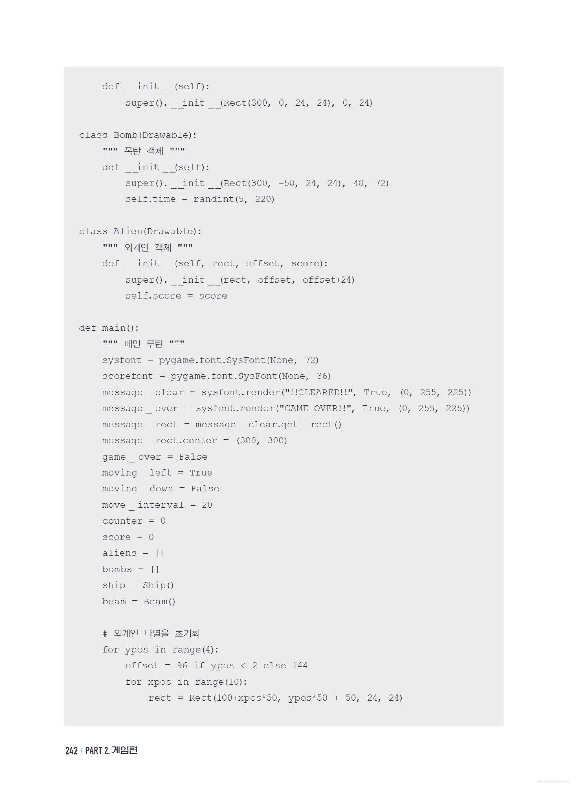

_(self) : init

def init' ' super() .

(Rect (300, 0, 24, 24) , 0, 24)

class Bomb (Drawable) :

IIIIII 폭탄 객체 """

###### def lnlt• •

_(self) : init

(Rect(300, - 50, 24, 24) , 48, 72) self.time = randint(5, 220)

super() .

class Alien(Drawable) :

II 1111 외계인 객체 """

def init' ' (self, rect, offset, score) : super() . init (rect, offset, offset+24) self.score = score

def main() :

II1111 메인 루틴 """

sysfont = pygarne.font.SysFont(None, 72) scorefont = pygarne. font .SysFont(None, 36) rnessage _ clear = sysfont.render ("!!CLEARED! !", True, (0, 255, 225) ) message over = sysfont.render("GAME OVER! !", True, (0, 255, 225) ) message rect = message _ clear.get rect() message rect.center = (300, 300) game over = False moving• left = True moving• down False move interval = 20 counter = 0 score = 0 aliens = [] bombs = [] ship = Ship() beam = Beam()

# 외계인 나열을 초기화

for ypos in range (4) : offset = 96 if ypos < 2 else 144 for xpos in range (10) :

rect = Rect (100+xpos*50, ypos*50 + 50, 24, 24)

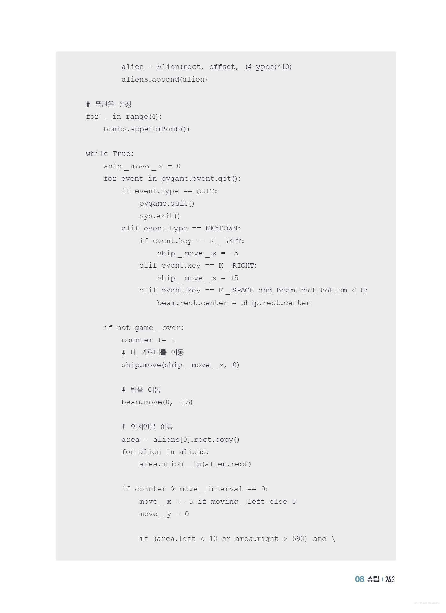

###### alien = Alien (rect, offset, (4-ypos) *10) aliens .append (alien)

# 폭탄을 설정

for in range (4) : bombs .append (Bomb ())

while True: ship move x = 0 for event in pygarne.event.get() :

if event.type == QUIT: pygarne .quit () sys.exit()

elif event.type == KEYDOWN: if event .key == K LEFT:

ship move x = -5 elif event . key == K RIGHT: ship move x = +5

elif event.key == K SPACE and bearn.rect.bottorn < 0:

bearn.rect.center = ship.rect.center

if not game _ over: counter += 1

# 내 캐릭터를 이동

ship.move (ship move x, 0)

# 빔을 이동

###### beam.move(O, -15)

# 외계인을 이동

area = aliens[O] .rect. copy() for alien in aliens:

area.union ip (alien.rect)

if counter % move interval == 0:

- move x = - 5 if moving left else 5
- move y = 0

if (area.left < 10 or area.right > 590) and \

###### 08 슈링 I 243

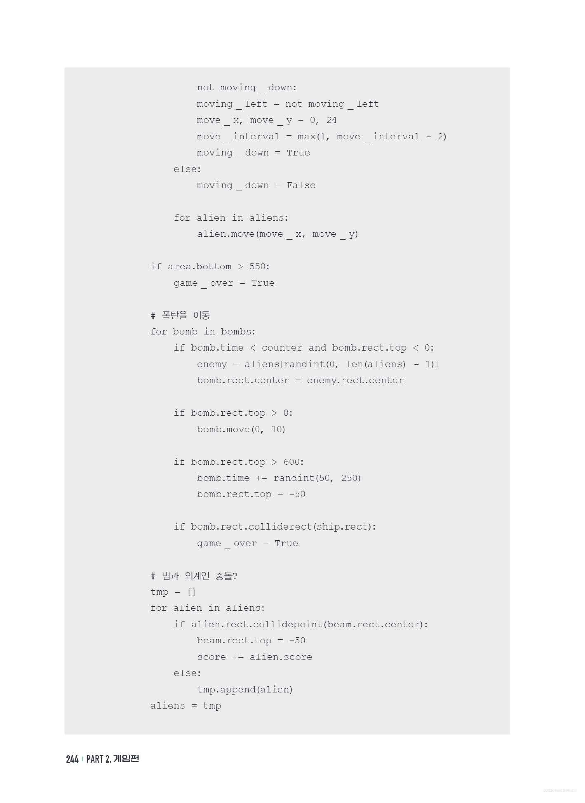

###### not moving down: moving’ left = not moving left move x, move y = o, 24 move interval max(1, move

i.nterval - 2)

•

moving down = True else:

moving’ down False

for alien in aliens: alien.move(move x, move y)

if area.bottom > 550:

game over = True

# 폭탄을 이동

for bomb i n bombs :

if bomb.t i me < counter and bomb.rect.top < 0: enemy = ali ens[randint(0, len(ali ens) —1) ] bomb.rect.center = enemy.rect.center

if bornb.rect.top > 0:

bomb.move (0, 10)

if bornb.rect.top > 600: bomb.time += randint(50, 250) bomb.rect.top = - 50

if bomb.rect.colliderect(ship.rect) :

game over = True

# 빔과 외계인 충돌?

tmp = [] f or alien in aliens:

if alien.rect.colli depoi nt(beam.rect .center) : beam.rect.top = - 50 score += ali en. score

else :

tmp.append(alien) aliens = tmp

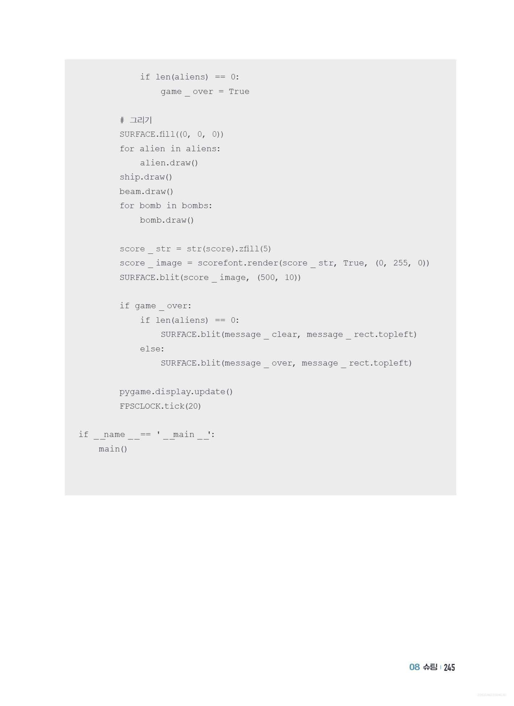

###### if len (aliens) == 0: game over = True

# 그리기

SURFACE.fill((0, 0, 0)) for alien in aliens : alien.draw()

ship.draw() beam.draw() for bomb in bombs: bomb.draw ()

score str = str(score) . zfill(5) score image = scorefont.render(score str, True, (0, 255, 0) ) SURFACE.blit(score image, (500, 10))

if game over: if len (aliens) == 0:

SURFACE.blit(message clear, message rect .topleft) else:

SURFACE.blit(message _ over, message rect.topleft)

pygarne.display. update () FPSCLOCK.t i ck(20)

’ maln•

if name

I •

•

main()

‘

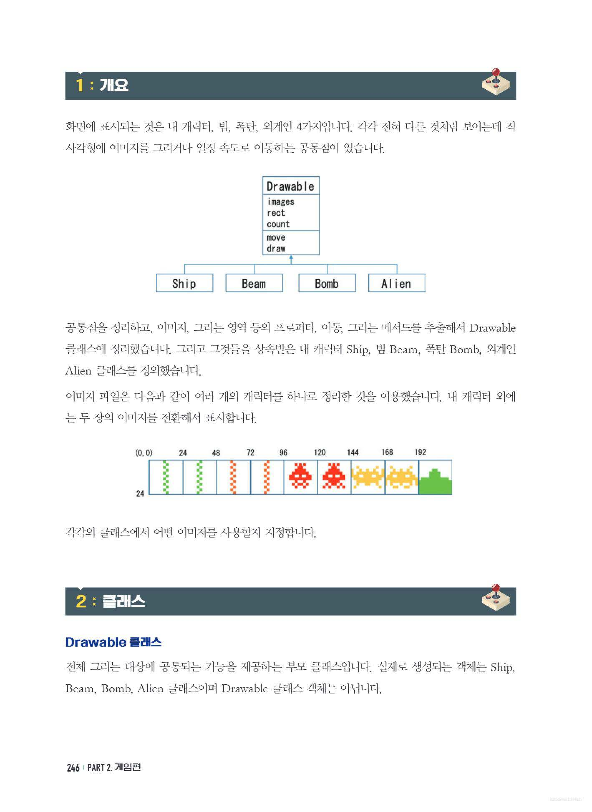

화면에 표시되는 것은 내 캐릭터, 빌 폭탄, 외계인 4가지입니다. 각각 전혀 다른 것처럽 보이는데 직 사각형에 이미지를 그리거나 일정 속도로 이동하는 공통점이 있습니다.

###### Drawable

images•

###### rect count

move

draw

###### Ship Beam Bomb Alien

공통점을 정리하고, 이미지, 그리는 영역 둥의 프로퍼티, 이동, 그리는 메서드를 추출해서 Drawable 클래스에 정리했습니다. 그리고 그것들을 상속받은 내 캐릭터 Ship, 빔 Beam, 폭탄 Bomb, 외계인 Alien 클래스를 정의했습니다.

이미지 파일은 다음과 같이 여러 개의 캐릭터를 하나로 정리한 것을 이용했습니다. 내 캐릭터 외에 는 두 장의 이미지를 전환해서 표시합니다.

(0,0) 24 48 72 96 120 144 168 192

구

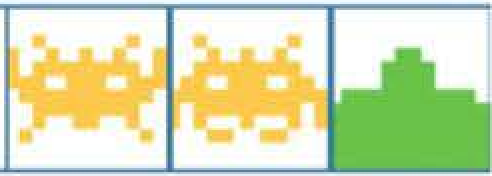

••••••

총 急

\-

24

각각의 클래스에서 어떤 이미지를 사용할지 지정합니다.

###### D『awable 클래스

전체 그리는 대상에 공통되는 기능을 제공하는 부모 클래스입니다. 실제로 생성되는 객체는 Ship, Beam, Bomb, Alien 클래스이며 Drawable 클래스 객체는 아닙니다.

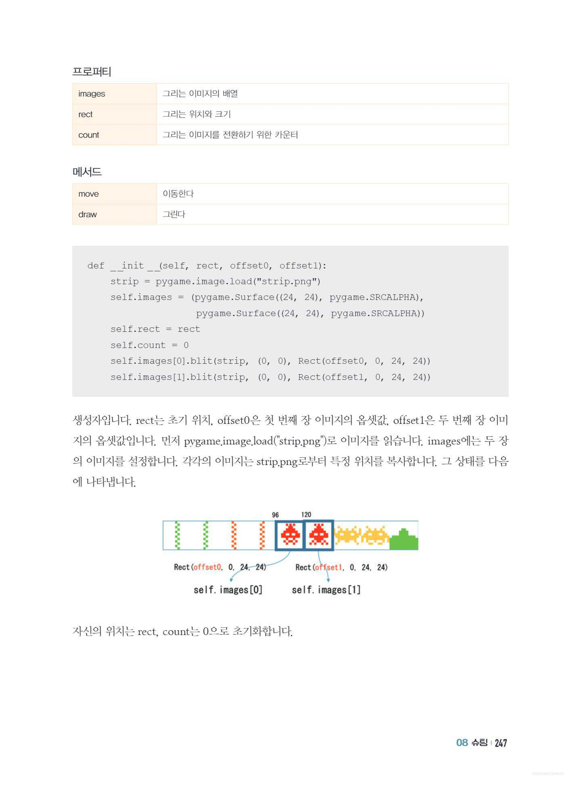

프로퍼El

###### images rect count

그리는 이미지의 배열

그리는위치와크71

그리는 이미지를 전환하기 위한 카운터

메서드

###### move

O|동한다

draw

그린다

def init __(self, rect, off setO, offsetl) : strip = pygame.image.load("strip .png") self.i mages = (pygame.Surface((24, 24), pygame.SRCALPHA),

pygame .Surface ((24, 24) , pygame. SRCALPHA) ) self.rect = rect self.count = 0 self.images [OJ.blit (strip, (0, 0) , Rect (offsetO, 0, 24, 24) ) self.images [1] .blit (strip, (0, 0) , Rect (offsetl, 0, 24, 24) )

생성자입니다. rect는 초기 위치, offsetO은 첫 번째 장 이미지의 옵셋값, offsetl은 두 번째 장 이미

###### 지의 옵셋값입니다. 먼저 pygame.image.load("strip.png"）로 이미지를 읽습니다. images에는 두 장

의 이미지를 설정합니다. 각각의 이미지는 strip.png로부터 특정 위치를 복사합니다. 그 상태를 다음

###### 에 나타냅니다.

.8·- `.....-

96 120

b...%- b.

園

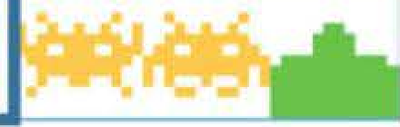

%

Rect(o . 0, 24, 24) se If . images [1]

Rect( . 1/4것

seIf. images 〔이

자신의 위치는 rect, count는 0으로 초기화합니다.

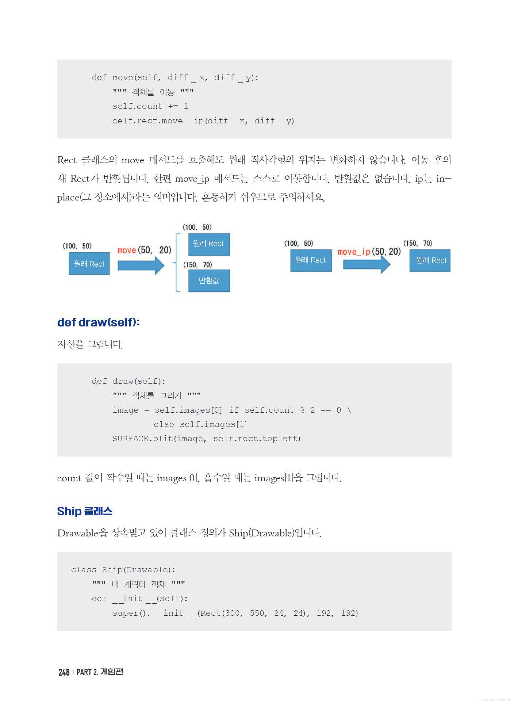

def move (self, diff x, diff y) :

IIIIII 객체를 이동 """

self.count += 1 self. rect .move i p(diff x, diff y)

Rect 클래스의 move 메서드를 호출해도 원래 직사각형의 위치는 변화하지 않습니다. 이동 후의

새 Rect가 반환됩니다. 한편 move_ip 메서드는 스스로 이동합니다. 반흰값은 없습니다. ip는 in—

###### place(그 장소에서)라는 의미입니다. 혼동하기 쉬우므로 주의하세요.

(100, 50)

###### (100. 50) move (50, 20) (100, 50) _ i (5Q,20)

(150, 70)

70)

def d『aw(self):

자신을그립니다.

###### def draw(self) :

""" 객체를 그리기 """

###### image = self.images [O] if self.count % 2 == 0 \ else self. images [l] SURFACE.blit (image, self.rect .topleft)

count 값이 짝수일 때는 images[O], 홀수일 때는 images[l]을 그립니다.

Ship

Drawable을 상속받고 있어 클래스 정의가 Ship(Drawable)입니다.

class Ship(Drawable) :

IIIIII 내 캐릭터 객체 """

def init _(self) : super() . init (Rect (300, 550, 24, 24) , 192, 192)

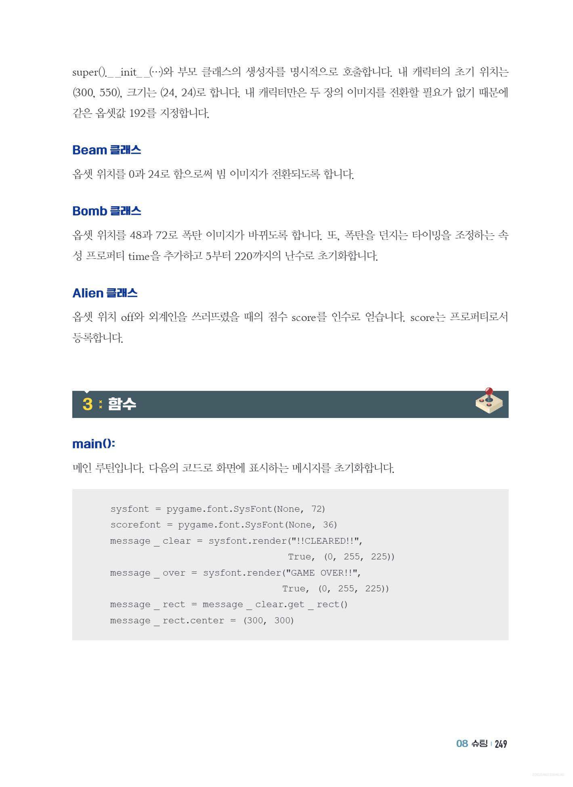

###### superO.__init_＿（…）와 부모 클래스의 생성자를 명시적으로 호출합니다. 내 캐릭터의 초기 위치는 (300, 550), 크기는 (24, 24)로 합니다. 내 캐릭터만은 두 장의 이미지를 전환할 필요가 없기 때문에

같은 옵셋값 192를 지정합니다.

Beam 클겐스

옵셋 위치를 0과 24로 함으로써 빔 이미지가 전환되도록 합니다.

Bomb 옵셋 위치를 48과 72로 폭탄 이미지가 바뀌도록 합니다. 또, 폭탄을 던지는 타이밍을 조정하는 속 성 프로퍼티 time을 추가하고 5부터 220까지의 난수로 초기화합니다.

Alien 클태스 옵셋 위치 off와 외계인을 쓰러뜨렸을 때의 점수 score를 인수로 얻습니다. score는 프로퍼티로서 등록합니다.

###### mainO:

메인 루틴입니다. 다음의 코드로 화면에 표시하는 메시지를 초기화합니다.

sysfont = pygarne.font. SysFont(None, 72) scorefont = pygarne.f ont.SysFont(None, 36) message _ clear = sysfont.render("!!CLEARED! !",

True, (0, 255, 225) ) message _ over = sysfont.render("GAME OVER! !",

True, (0, 255, 225) ) message rect = message _ clear.get rect() message rect.center = (300, 300)

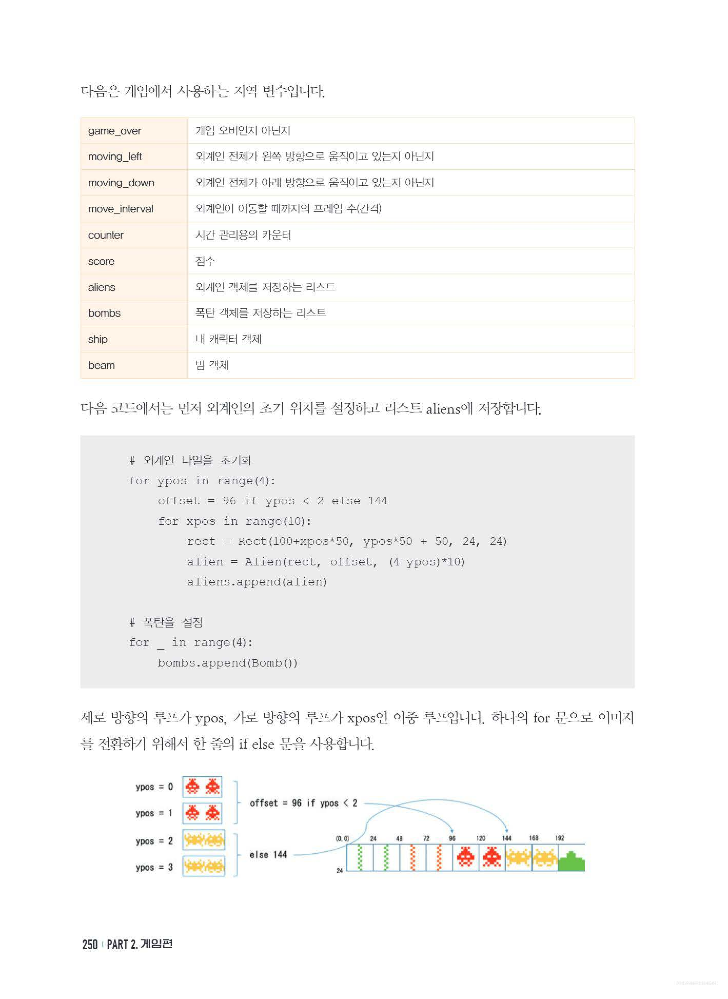

###### 다음은 게임에서 사용하는 지역 변수입니다.

game_over moving_left

게임 오버인지 아닌지

외계인 전체가 왼쪽 방항으로 움직이고 있는지 아닌지

moving_down move_interval counter

외계인 전체가 아래 방향으로 움직이고 있는지 아닌지

외계인이 이동할 때까지의 프레임 수(간격)

시간관리용의 카운터

score aliens bombs

점수

외계인 객체를 저장하는 리스트

폭탄 객체를 저장하는 리스트

ship

###### 내 캐릭터 객체

beam

빔객체

###### 다음 코드에서는 먼저 외계인의 초기 위치를 설정하고 리스트 aliens에 저장합니다.

# 외계인 나열을 초기화

for ypos in range (4) : offset = 96 if ypos < 2 else 144 f or xpos in range (10) :

rect = Rect (100+xpos*50, ypos*50 + 50, 24, 24) alien = Ali en(rect, offset, (4- ypos)*lO) aliens.append(alien)

# 폭탄을 설정

for in range (4) : bombs.append(Bomb ())

###### 세로 방향의 루프가 ypos, 가로 방향의 루프가 xpos인 이중 루프입니다. 하나의 for 문으로 이미지 를 전환하기 위해서 한 줄의 if else 문을 사용합니다.

ypos=O H , ypos=1 HJ ypos =2 、 ypos=3 』

offset = 96 if ypos < 2

;

else144 --」 1:1i |i |싶紀」

192

(0,0) ' 24 48 72 96 120 I◄◄ 168

250 1PART 2.게임편

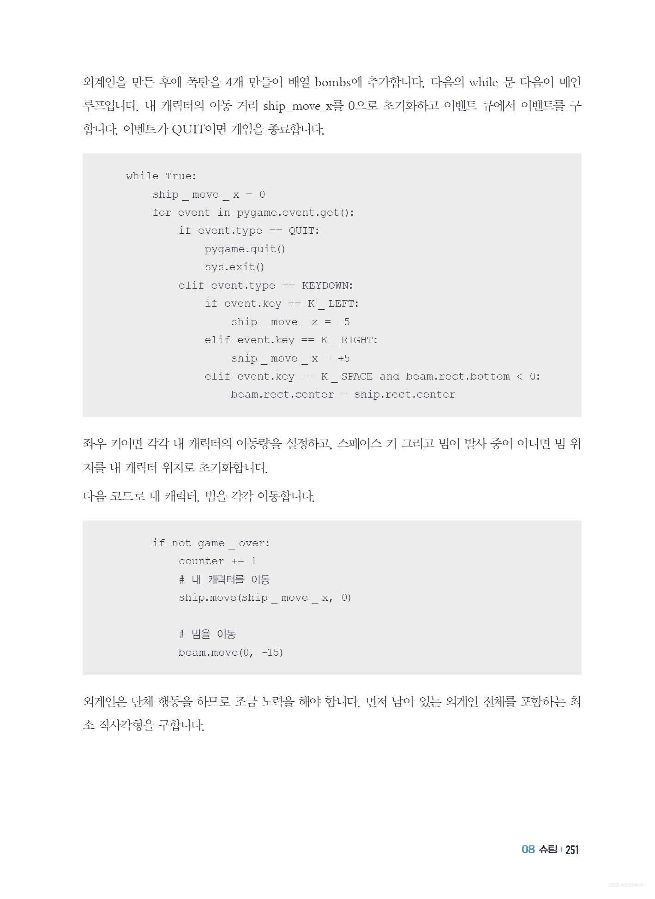

외계인을 만든 후에 폭탄을 4개 만들어 배열 bombs에 추가합니다. 다음의 while 문 다음이 메인 루프입니다. 내 캐릭터의 이동 거리 ship_move_x를 0으로 초기화하고 이벤트 큐에서 이벤트를 구 합니다. 이벤트가 QUIT이면 게임을 종료합니다.

while True: ship move x = 0 for event in pygame .event.get () :

if event.type == QUIT: pygame .quit () sys .exit()

elif event.type == KEYDOWN: if event. key == K_ LEFT:

ship _ move x = - 5 elif event. key == K_ RIGHT: ship move x = +5

elif event.key == K SPACE and bearn.rect.bottorn < 0:

beam.rect.center = ship.rect.center

좌우 키이면 각각 내 캐릭터의 이동량을 설정하고, 스페이스 키 그리고 빔이 발사 중이 아니면 빔 위 치를 내 캐릭터 위치로 초기화합니다. 다음 코드로 내 캐릭터, 빔을 각각 이동합니다.

if not game over: counter += 1

# 내 캐릭터를 이동

ship.move (ship move x, 0)

# 빔을 이동

###### beam.move(O, -15)

외계인은 단체 행동을 하므로 조금 노력을 해야 합니다. 먼저 남아 었는 외계인 전제를 포함하는 최 소 직사각형을 구합니다.

###### 08 슈링 I 251

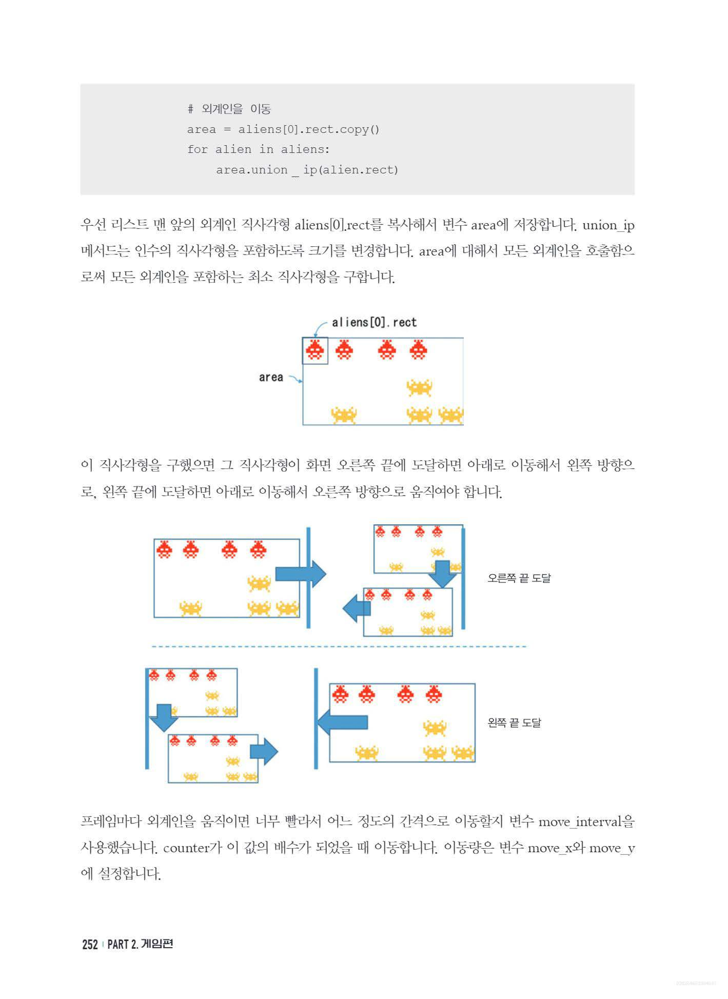

# 외계인을 이동

area = aliens[0] .rect.copy() for alien in aliens:

area .union ip(alien.rect)

우선 리스트 맨 앞의 외계인 직사각형 aliens[O].rect를 복사해서 변수 area에 저장합니다. union_ip 메서드는 인수의 직사각형을 포함하도록 크기를 변경합니다. area에 대해서 모든 외계인을 호출함으 로써 모든 외계인을 포함하는 최소 직사각형을 구합니다.

al iens [O] . rect

총 층 층

area

이 직사각형을 구했으면 그 직사각형이 화면 오른쪽 끝에 도딜숭}면 아래로 이동해서 왼쪽 방향으 로, 왼쪽 끝에 도달하면 아래로 이동해서 오른쪽 방향으로 움직여야 합니다.

###### 충 令 令 令

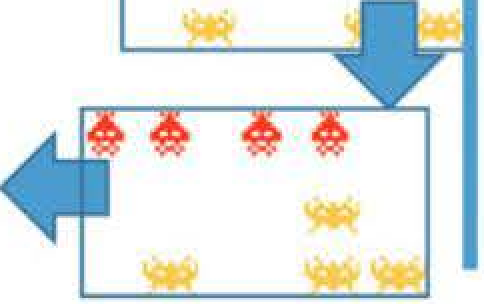

오른쪽끝도달

###### 멜

# ` 달

###### -------- －_－데..

-I |홍 令

令충

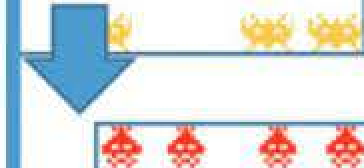

| 왼쪽끝도달

낱

I

-

프레임마다 외계인을 움직이면 너무 빨라서 어느 정도의 간격으로 이동할지 변수 move_interval을 사용했습니다. counter가 이 값의 배수가 되었을 때 이동합니다. 이동량은 변수 1nove_x와 move_y

###### 에 설정합니다.

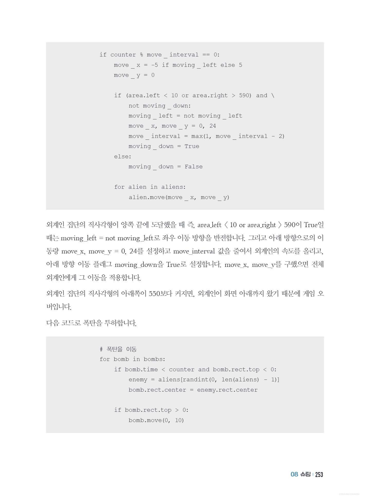

if counter % move interval == 0: move x = -5 if moving left else 5 move y = 0

if (area.left < 10 or area.right > 590) and \ not moving _ down: moving left = not moving left move x, move y = 0, 24 move — interval = max(l, move interval - 2) moving down = True

else:

moving down = False

for alien in aliens: alien.move (move x, move y)

외계인 집단의 직사각형이 양쪽 끝에 도달했을 때 죽, area.left < 10 or area.right > 590이 True일

때는 moving_left =not moving_left로 좌우 이동 방향을 반전합니다. 그리고 아래 방향으로의 이 동량 move_x, movey = 0, 24를 설정하고 move_interval 값을 줄여서 외계인의 속도를 올리고, 아래 방향 이동 플래그 moving_down을 True로 설정합니다. tnove_x, move_쩌룹 구했으면 전체 외계인에게 그 이동을 적용합니다.

외계인 집단의 직사각형의 아래쪽이 550보다 커지면, 외계인이 화면 아래까지 왔기 때문에 게임 오 버입니다. 다음 코드로 폭탄을 투하합니다.

# 폭탄을 이동

for bomb in bombs:

if bomb.time < counter and bomb.rect.top < 0: enemy = aliens[randint(0, len(aliens) - 1)] bomb.rect.center = enemy.rect.center

if bornb.rect.top > 0:

bomb.move (0, 10)

###### 08 슈링 I 253

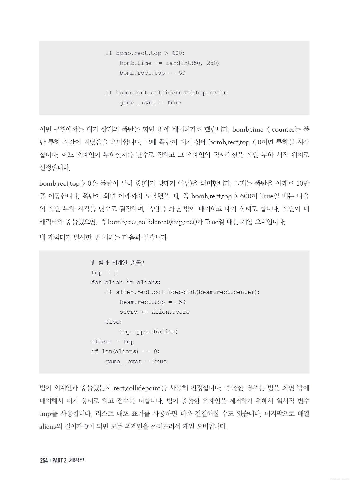

if bornb.rect.top > 600: bomb.time += randint (50, 250) bomb.rect.top = -50

if bomb.rect.colliderect(ship.rect) :

game _ over = True

이번 구현에서는 대기 상태의 폭탄은 화면 밖에 배치하기로 했습니다. bomb.time <counter는 폭 탄 투하 시간이 지났음을 의미합니다. 그때 폭탄이 대기 상태 bomb.red.top <0이면 투하를 시작 합니다. 어느 외계인이 투하할지를 난수로 정하고 그 외계인의 직사각형을 폭탄 투하 시작 위치로

설정합니다.

bomb.red.top > 0은 폭탄이 투하 중(대기 상태가 아님)을 의미합니다. 그때는 폭탄을 아래로 10만 콤 이동합니다. 폭탄이 화면 아래까지 도달했을 때, 즉 bomb.rect.top > 600이 True일 때는 다음 의 폭탄 투하 시각을 난수로 결정하며, 폭탄을 화면 밖에 배치하고 대기 상태로 합니다. 폭탄이 내 캐릭터와 충돌했으면, 즉 bomb.rect.colliderect(ship.rect)가 True일 때는 게임 오버입니다.

내 캐릭터가 발사한 빔 처리는 다음과 같습니다.

# 빔과 외계인 충둘?

trnp = [] for alien in aliens:

if alien.rect.collidepoint(bearn.rect .center) : bearn.rect.top = - 50 score += alien.score

else:

trnp.append(alien) aliens = trnp if len (aliens) == 0:

game over = True

빔이 외계인과 충돌했는지 rect.collidepoint를 사용해 판정합니다. 충돌한 경우는 빔을 화면 밖에

배치해서 대기 상태로 하고 점수를 더합니다. 빔이 충돌한 외계인을 제거하기 위해서 일시적 변수 tmp를 사용합니다. 리스트 내포 표기를 사용하면 더욱 간결해질 수도 있습니다. 마지막으로 배열 aliens의 길이가 0이 되면 모든 외계인을 쓰러뜨려서 게임 오버입니다.

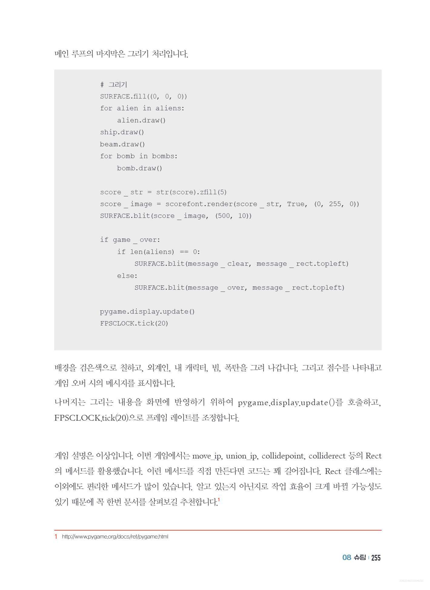

###### 메인 루프의 마지막은 그리기 처리입니다.

# 그리기

SURFACE.fill((O, 0, 0)) for alien in aliens : alien.draw()

ship.draw() beam.draw() for bomb in bombs: bomb.draw()

score str = str (score) . zfill(5) score image = scorefont.render (score str, True, (0, 255, 0) ) SURFACE.blit (score image, (500, 10) )

if game over: if len (aliens) == 0:

SURFACE.blit(message clear, message rect .topleft) else:

SURFACE.blit(message over, message rect.topleft)

pygame .display.update() FPSCLOCK.tick(20)

배경을 검은색으로 질하고, 외계인, 내 캐릭터, 범, 폭탄을 그려 나갑니다. 그리고 점수를 냐타내고 게임 오버 시의 메시지를 표시합니다.

###### 나머지는 그리는 내용을 화면에 반영하기 위하여 pygame.display.update(）를 호출하고, FPSCLOCK.tick(20)으로 프레임 례이트를 조정합니다.

게임 설명은 이상입니다. 이번 게임에서는 move_ip, union_ip, collidepoint, colliderect 둥의 Rect 의 메서드를 활용했습니다. 이런 메서드를 직접 만든다면 코드는 꽤 길어집니다. Rect 클래스에는 이외에도 편리한 메서드가 많이 있습니다. 알고 있는지 아닌지로 작업 효율이 크게 바뀔 가능성도 있기 때문에 꼭 한번 문서를 살펴보길 추천합니다.1

1 http://www.pygame.org/docs/ref/pygame.html

###### 08 슈링 I 255

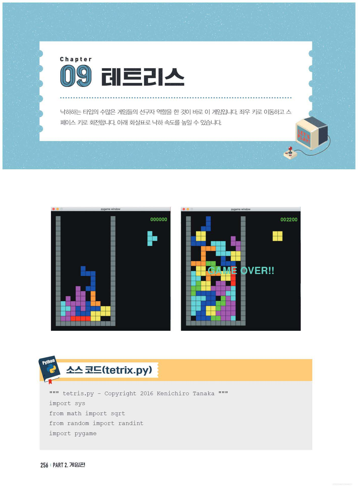

Chapte 『

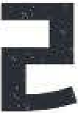

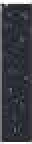

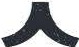

••••••••••••••••••••••••••••••••••••••••••••••••••••••••••••••••••••••••••••••••••••••••

낙하하는 타입의 수많은 게임들의 선구자 역할을 한 것이 바로 이 게임입니다. 좌우 키로 이동등口스 스 페이스 키로 회전합니다. 아래 화살표로 낙하 속도를 높일 수 있습니다

23

3

·,

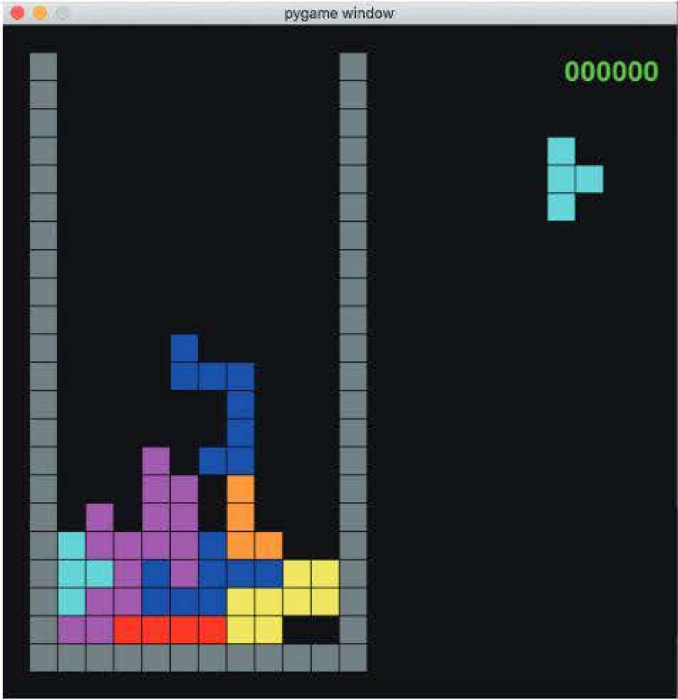

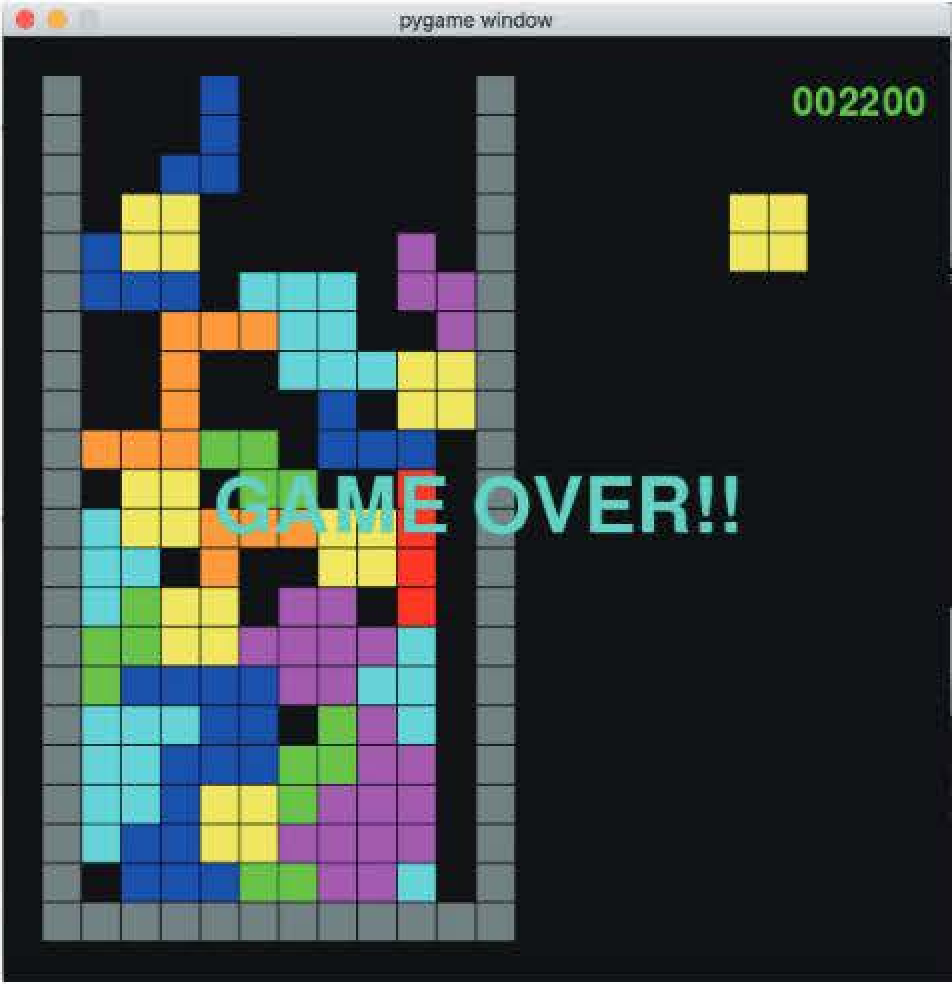

소스 코드<tetrix.py)

111111 tetris .py - Copyright 2016 Kenichiro Tanaka 111111 import sys from math import sqrt from random import randint import pygame

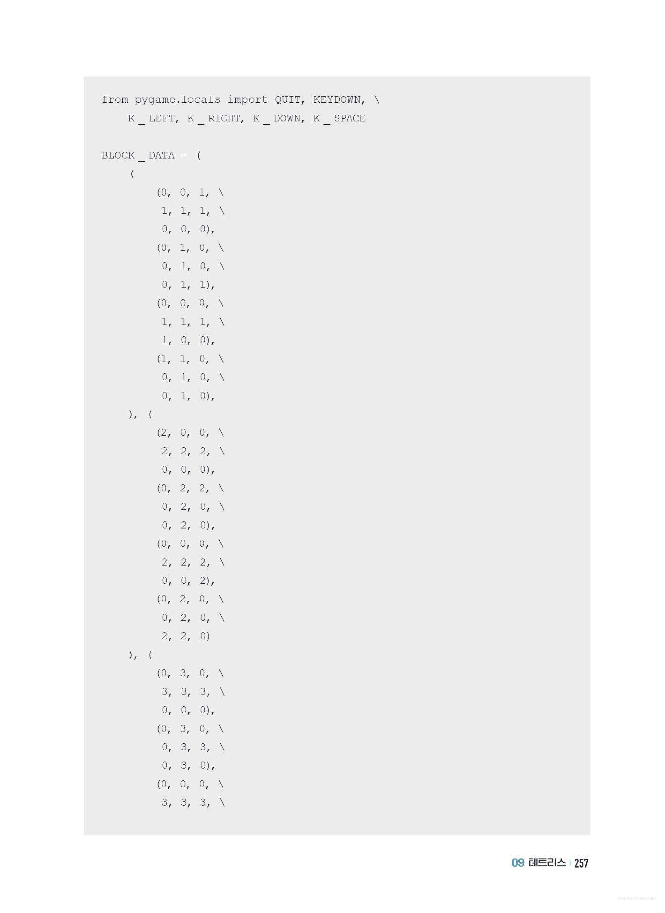

from pygame . locals import QUIT, KEYDOWN, \ K LEFT, K RIGHT, K DOWN, K SPACE

BLOCK DATA (

(

(0, o, 1, \

1, 1, 1, \

o, o, 0)' (0, 1, o, \

0, 1, o, \

- 0, 1, 1) '

- (0, o, o, \

1, 1, 1, \ 1, 0, 0),

- (1, 1, 0, \

###### o, 1, 0, \ o, 1, 0),

)' (

###### (2' o, 0, \

2, 2, 2, \

###### o, o, 0), (0, 2, 2, \ o, 2, o, \ o, 2, 0)I (0, o, 0, \

2, 2, 2, \

###### o, o, 2)/

(0f 2, 0, \ 0, 2, 0, \

###### 2, 2, 0)

)' (

(0, 3, o, \

3, 3, 3, \

###### o, o, 0) ' (0, 3, o, \

- o, 3, 3, \
- o, 3, 0)I

###### (0, o, o, \

###### 3, 3, 3, \

09 테트리스 I 257

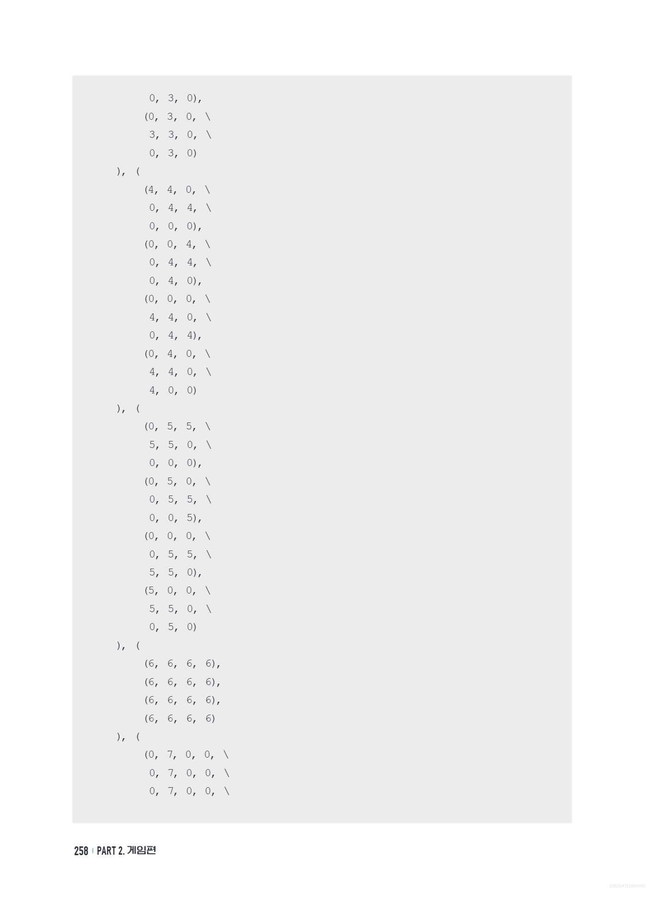

0, 3, 0) ' (0, 3, 0, \

- 3, 3, o, \

- o, 3, 0)

)' (

(4, 4, o, \

- o, 4, 4, \
- o, o, 0), (0, o, 4, \
- o, 4, 4, \
- o, 4, 0) ' (0' o, o, \

4, 4, o, \

0, 4, 4) / (0, 4, 0, \

- 4, 4, 0, \

- 4, 0, 0)

)' (

(0, 5, 5, \

- 5, 5, o, \

- o, o, 0) , (0, 5, o, \
- o, 5, 5, \
- o, o, 5), (0, o, o, \
- o, 5, 5, \

- 5, 5, 0) , (5, 0, 0, \ 5, 5, 0, \ 0, 5, 0)

)' (

(6, 6, 6, 6) ' (6, 6, 6, 6) ' (6, 6, 6, 6) , (6, 6, 6, 6)

)' (

(0, 7, o, o, \

- o, 7, o, o, \
- o, 7, o, o, \

258 1PART 2. 게임펀

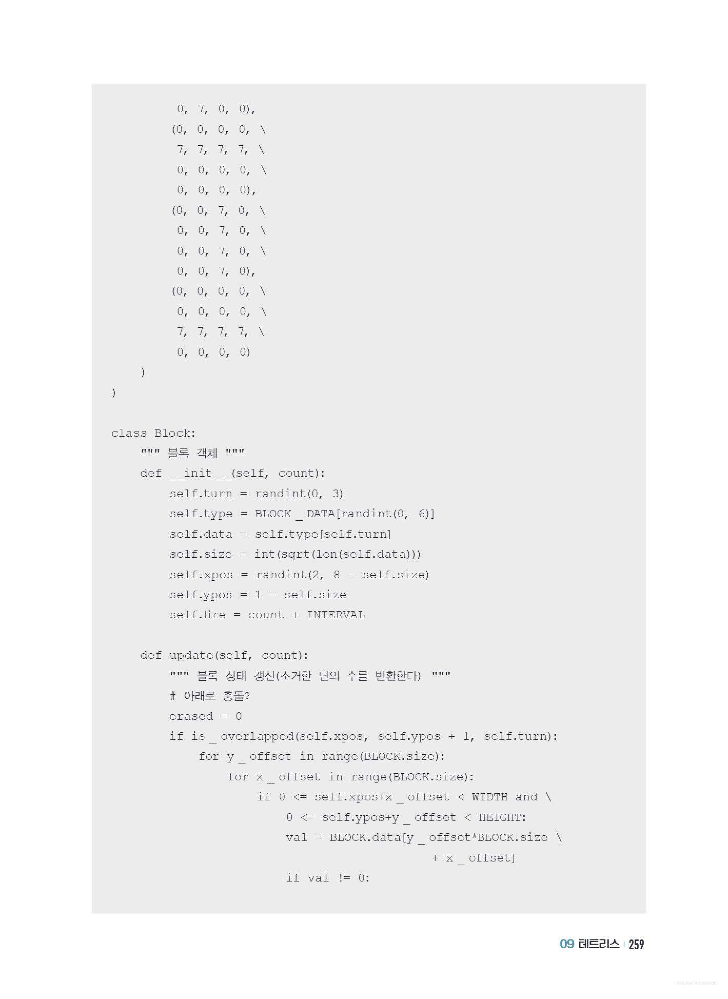

o, 7, o, 0)/ (0, 0, 0, o, \

7, 7, 7, 7, \ o, o, o, o, \ o, o, 0, 0) , (0, o, 7, o, \

- o, o, 7, o, \
- o, o, 7, o, \
- o, o, 7, 0)'

(0, o, 0, o, \ 0, o, o, o, \

7, 7, 7, 7, \

###### o, o, o, 0)

) )

###### c l ass Block:

""" 블록 객체 IIIIII

def i n i t (sel f , count) : sel f .turn = r andi nt (O, 3) sel f .type = BLOCK _ DATA[randi nt (O, 6)) sel f .data = self.type[sel f .turn] sel f .s i ze = i nt(sqrt(l en(sel f .dat a))) sel f .xpos = randi nt(2, 8 - self.si ze) sel f.ypos = 1 - self.si ze sel f.fir e = count + I NTERVAL

def updat e (se l f, count) :

""“ 블록 상태 갱신(소거한 단의 수를 반환한다) """ # 아래로 충돌?

e r ased = 0 if i s overl apped (self.xpos, self.ypos + 1, sel f .turn) :

f or y off set i n range (BLOCK.s i ze) : f or x _ of fset in range (BLOCK. size) :

if O <= self.xpos+x off set < WIDTH and \

0 <= sel f .ypos+y —offset < HEIGHT:

val = BLOCK.data[y of fset *BLOCK.s ize \

+ x off set] i f val != 0:

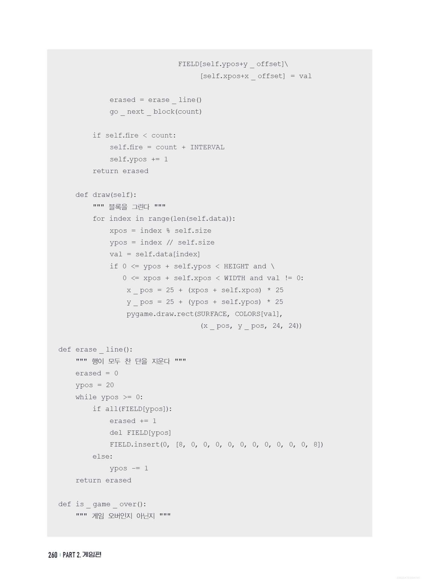

FI ELD[sel f .ypos+y off set]\ [self .xpos+x offse더 = val

erased = erase line () go next bl ock(count )

if sel f .fire < count: self.fire = c ount + I NTERVAL self.ypos += 1

ret urn e rased

def d r aw(self) :

”“” 블록을 그린다 ”“”

f or index i n range (len (self.data) ): xpos = i ndex % self.s i ze ypos = i ndex // self. s ize val = self.data[i ndex] if O <= ypos + self.ypos < HEIGHT and \

0 <= xpos + self.xpos < WI DTH and val

'•= O·•

X pos = 25 + (xpos + self.xpos) * 25 y pos = 25 + (ypos + self.ypos) * 25 pygame .draw.rect (SURFACE, COLORS [val] ,

(x pos, y _ pos, 24, 24) )

def er ase _ line () :

""“ 행이 모두 찬 단을 지운다 """

era sed = 0 ypos = 20 while ypos >= 0:

if a ll(FI ELD[ypos]) : erased += 1 del FI ELD [ypos] FI ELD.insert (0, [8, 0, 0, 0, 0, 0, 0, 0, 0, 0, 0, 8])

e l se:

ypos -= 1 ret urn e r ased

def i s game over() :

II II II

II1111 게임 오버인지 아닌지

260 1PART 2.게임편

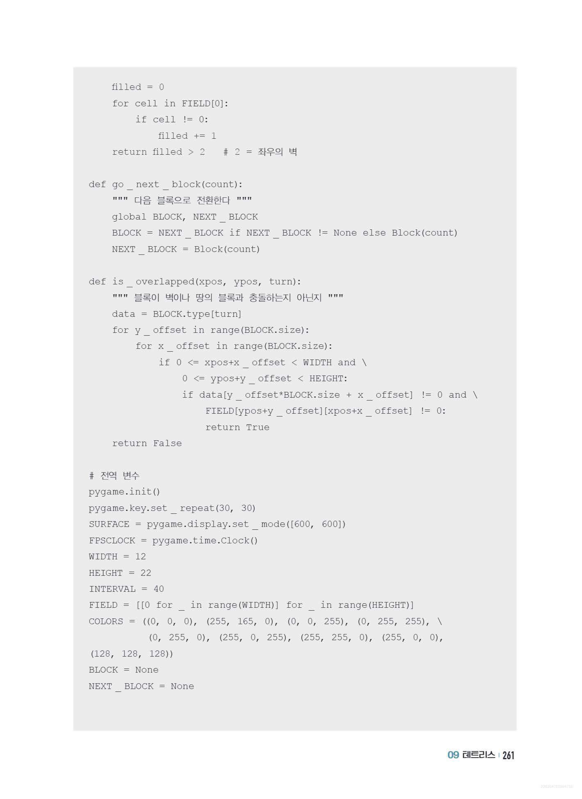

filled = 0 for cell i n FI ELD[O] : if cell != 0:

filled += 1

return fil led > 2 #2 = 좌우의벽

def go next b l ock (count ) :

""" 다움 블록으로 전환한다 """

global BLOCK, NEXT _ BLOCK BLOCK = NEXT BLOCK if NEXT BLOCK != None else Bl ock(count ) NEXT BLOCK = Bl ock(count )

def i s overlapped(xpos, ypos, turn) :

""“ 블록이 벽이나 땅의 블록과 충돌하는지 아닌지

###### ”””

d ata = BLOCK.type[t urn] for y offset i n range (BLOCK.s i ze) :

for x offset i n r ange (BLOCK.s ize) :

if O <= xpos+x offset < WI DTH and \ 0 <= ypos+y o f fset < HEIGHT: if data[y of fset*BLOCK .s ize + x o f fset] != 0 a nd \

FI ELD[ypos+y offse더 [xpos+x of fset] != 0: retur n Tr ue

r eturn Fa l se

# 전역 변수

pygame . i n i t ()

pygame . key. set _ r epeat (30, 30) SURFACE = pyga me .d i spl ay. set mode ([600, 600]) FPSCLOCK = pygame .time.Cl ock() WIDTH = 12 HEIGHT = 22 I NTERVAL = 40 FI ELD = [[0 for in range (WI DTH) ] for in r a nge (HEIGHT)] COLORS = ((0, 0, 0) , (255, 165, 0) , (0, 0, 255) , (0, 255, 255) , \

(0, 255, 0), (255, o, 255), (255, 255, 0) , (255, o, 0) ,

(128, 128, 128) ) BLOCK = None NEXT BLOCK = None

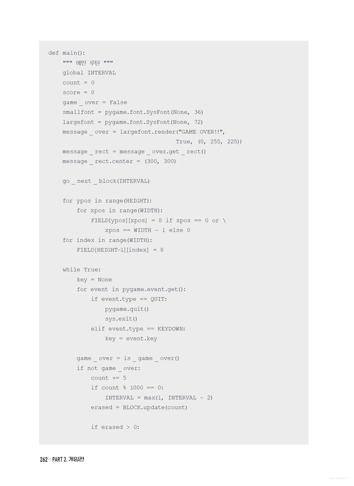

def main() :

IIIIII 메인 루틴 "" "

global I NTERVAL count = 0 score = 0 game over = False srnallfont = pygarne .font. SysFont(None, 36) largefont = pygarne.font .SysFont(None, 72) message over = largefont.render("GAME OVER! !",

True, (0, 255, 225) ) message _ rect = message over.get rect() message rect.center = (300, 300)

go next block(INTERVAL)

for ypos in range (HEIGHT) : for xpos in range (WIDTH) :

FI ELD[ypos] [xpos] = 8 if xpos

0 or \

xpos == WIDTH - 1 else 0 for index in range (WI DTH) :

FI ELD[HEIGHT-1] [index] = 8

while True: key = None for event in pygame.event.get() :

i f event .type == QUIT: pygame .quit() sys.exit()

elif event .type == KEYDOWN:

key = event. key

game over = is game over() if not game over: count += 5 if count % 1000 == 0:

I NTERVAL = max(l, I NTERVAL - 2) erased = BLOCK.update(count)

if erased > 0:

###### 262 1PART 2.게임펀

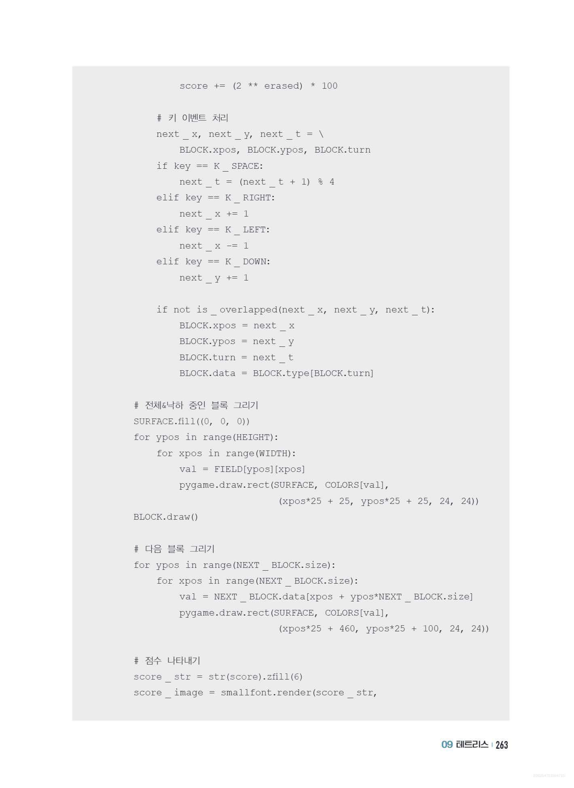

###### score += (2 ** erased) * 100

# 키 이벤트 처리

next x, next y, next t = \

BLOCK.xpos, BLOCK.ypos, BLOCK.turn if key == K _ SPACE:

next _ t = (next —t + 1) % 4

elif key == K RIGHT: next x += 1 elif key == K LEFT: next x —= 1 elif key == K DOWN: next y += 1

t) :

if not is overlapped(next

x, next y,

next

BLOCK.xpos = next X BLOCK.ypos = next y BLOCK.turn = next t

BLOCK.data = BLOCK.type [BLOCK.turn]

# 전체&낙하 종인 블록 그리기

SURFACE.fill((O, 0, 0)) for ypos in range (HEIGHT) :

for xpos in range (WIDTH) :

val = FI ELD[ypos] [xpos]

pygame .draw.rect (SURFACE, COLORS [val] ,

(xpos*25 + 25, ypos*25 + 25, 24, 24) ) BLOCK.draw ()

# 다음 블록 그리기

for ypos in range (NEXT BLOCK. size) : for xpos in range (NEXT BLOCK. size) :

val = NEXT BLOCK.data[xpos + ypos*NEXT BLOCK. size]

pygame .draw.rect (SURFACE, COLORS [val] ,

(xpos*25 + 460, ypos*25 + 100, 24, 24))

# 점수 나타내기

###### score str = str(score) . zfill(6) score image = srnallfont.render (score str,

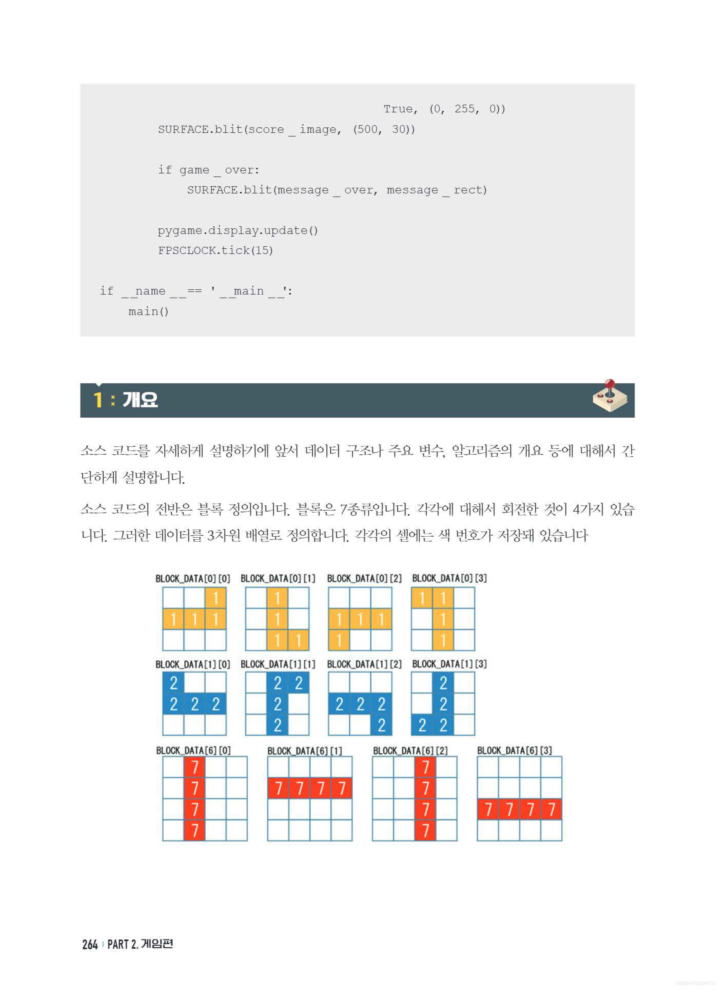

True, (0, 255, 0) ) SURFACE.blit (score image, (500, 30) )

if game over: SURFACE .blit(message _ over, message _ rect)

pygame .display.update () FPSCLOCK.tick(15)

I maln• ,.

if name main()’

•

소스 코드를 지세하게 설명하기에 앞서 데이터 구조나 주요 변수, 알고리즘의 개요 둥에 대해서 간

###### 단하게설명합니다.

###### 소스 코드의 전반은 블록 정의입니다. 블록은 7종류입니다. 각각에 내해서 회전한 것이 4가지 있습 니다. 그러한 데이터를 3치원 배열로 정의합니다. 각각의 셀에는 색 번호가 저장돼 있습니다

BLOCK_DATA[O] [O] BLOCK...DATA[O] [1) BLOCK_OATA[OJ [2] BLOCK_DATA [OJ [3]

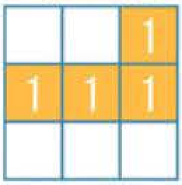

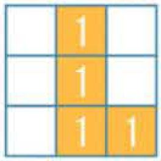

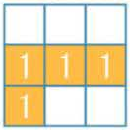

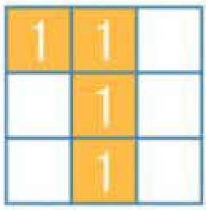

BLOCl(_DATA[I) [OJ BLOCK_DATA[l) [1) BLOCK_OATA[l) (2) BLOCILDATA[l) (3)

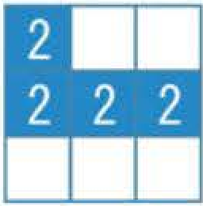

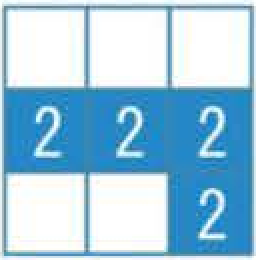

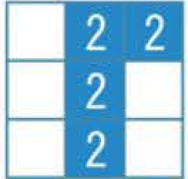

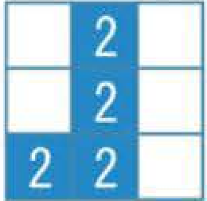

BLOCK_OATA[6][0] BLOCK_OATA[힌 (2) BLOQLDATA_[§][~]

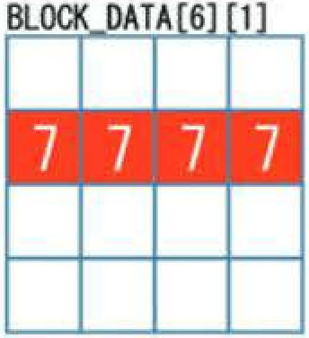

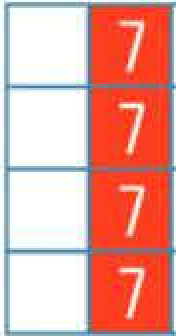

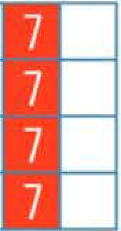

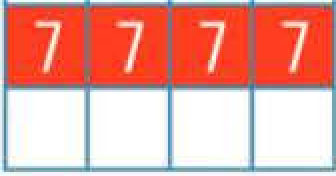

264 1PART2. 게임펀

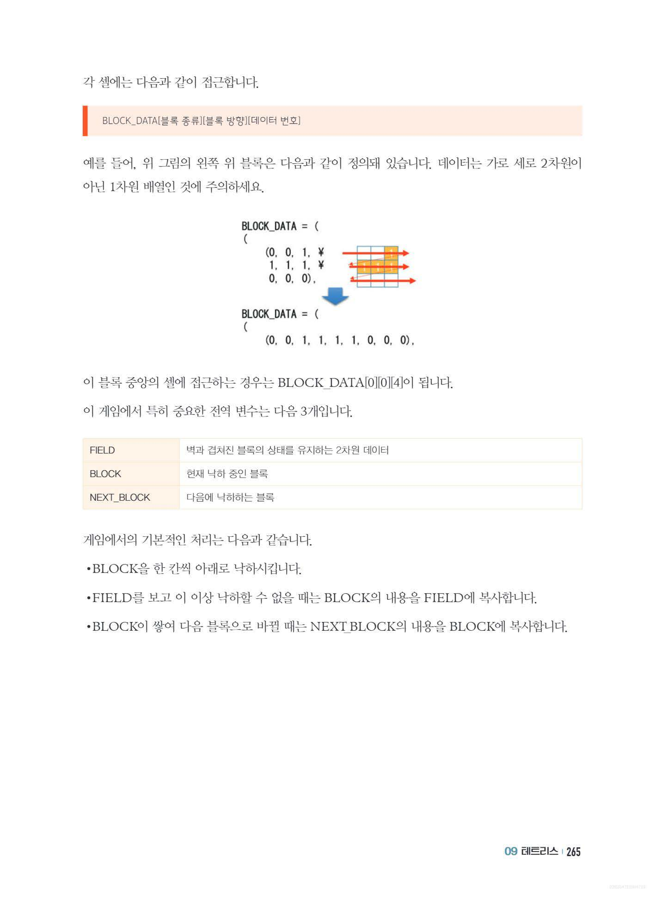

각 셀에는 다음과 같이 접근합니다.

예를 들어, 위 그림의 왼쪽 위 블록은 다음과 같이 정의돼 있습니다. 데이터는 가로 세로 2차원이 아닌 1치원 배열인 것에 주의하세요.

###### BLOCK_DATA = (

(

###### (0. 0, 1. V.

o.1, 0,1, 01) ., V.

###### BLOCK_DATA = (

(

###### (0, o. 1. 1, 1. 1, o. o. 0).

이 블록 중앙의 셀에 접근하는 경우는 BLOCK_DATA[이[0][4]이 됩니다.

이 게임에서 특히 중요한 전역 변수는 다음 3개입니다.

FIELD BLOCK NEXT_BLOCK

벽과 겹쳐진 블록의 상태를 유지하는 2차원 데이터

현재 낙하중인블록

다음에 낙하하는 블록

게임에서의 기본적인 처리는 다음과 같습니다.

- •BLOCK울 한 칸씩 아래로 낙하시킵니다.
- •FIELD를 보고 이 이상 낙하할 수 없을 때는 BLOCK의 내용을 FIELD에 복사합니다.
- •BLOCK:이 쌓여 다음 블록으로 바뀔 때는 NEXT_BLOCK의 내용을 BLOCK:에 복사합니다.

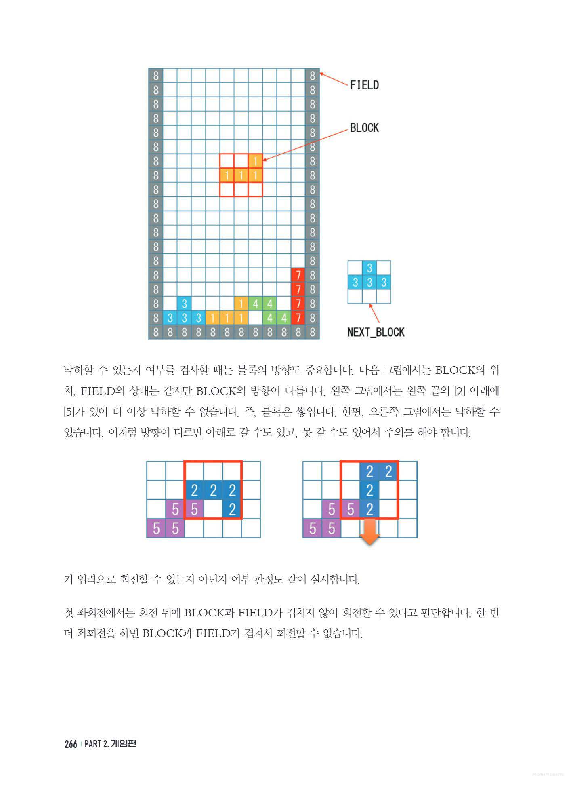

FIELD

BLOCK

NEXT_BLOCK

낙하할 수 있는지 여부를 검사할 때는 블록의 방향도 중요합니다. 다음 그림에서는 BLOCK의 위

치, FIELD의 상태는 같지만 BLOCK의 방향이 다릅니다. 왼쪽 그림에서는 왼쪽 끝의 [2] 아래에 [5]가 있어 더 이상 낙하할 수 없습니다. 즉 블록은 쌓입니다. 한편, 오른쪽 그림에서는 낙하할 수 있습니다. 이처럽 방향이 다르면 아래로 갈 수도 있고, 못 갈 수도 있어서 주의를 해야 합니다.

키 입력으로 회전할 수 있는지 아닌지 여부 판정도 같이 실시합니다.

첫 좌회전에서는 회전 뒤에 BLOCK과 FIELD가 겹치지 않아 회전할 수 있다고 판단합니다. 한 번 더 좌회전을 하면 BLOCK과 FIELD가 겹쳐서 회전할 수 없습니다.

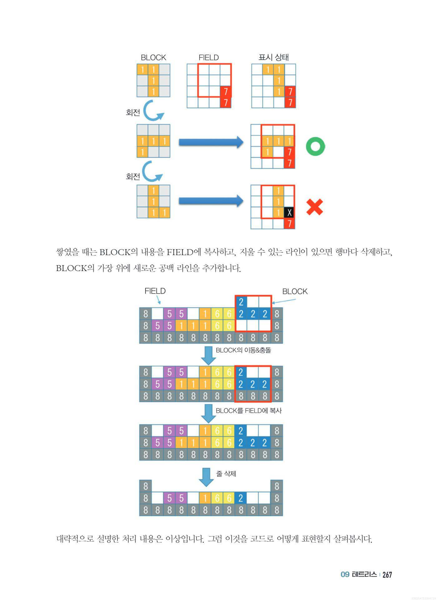

###### BLOCK FIELD 표시상태

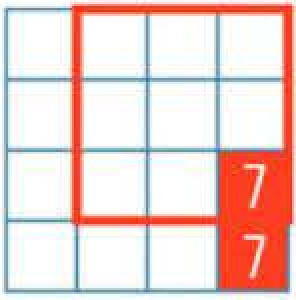

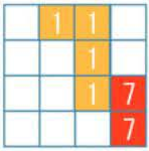

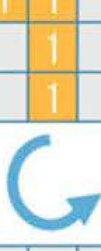

회전

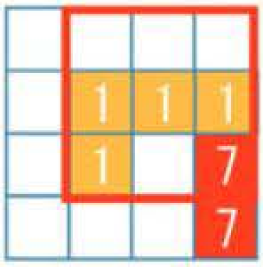

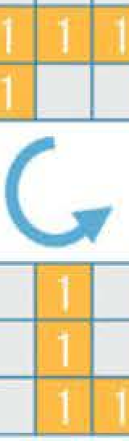

###### 。

회전

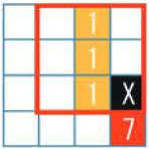

쌓였을 때는 BLOCK의 내용을 FIELD에 복사하고, 지울 수 있는 라인이 였으면 행마다 삭제하고, BLOCK의 가장 위에 새로운 공백 라인을 추가합니다.

FIELD

###### BLOCK

\

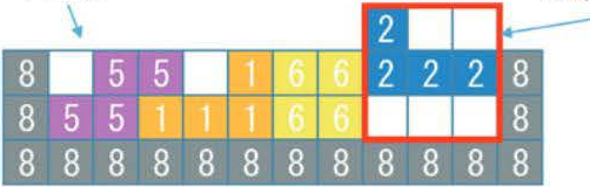

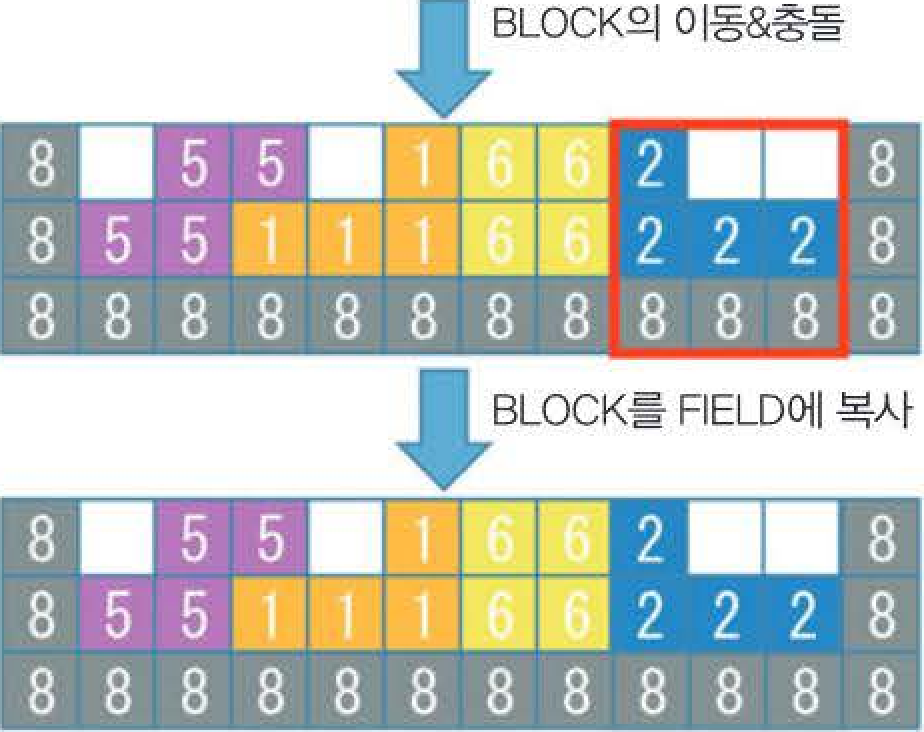

BLOCK의 이동&충돌

BLOCK를 FIELD에 복사

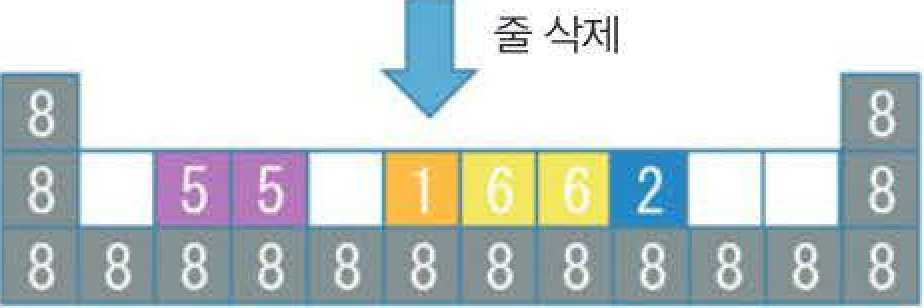

줄 삭제

대략적으로 설명한 처리 내용은 이상입니다. 그럽 이것을 코드로 어떻게 표현할지 살펴봅시다.

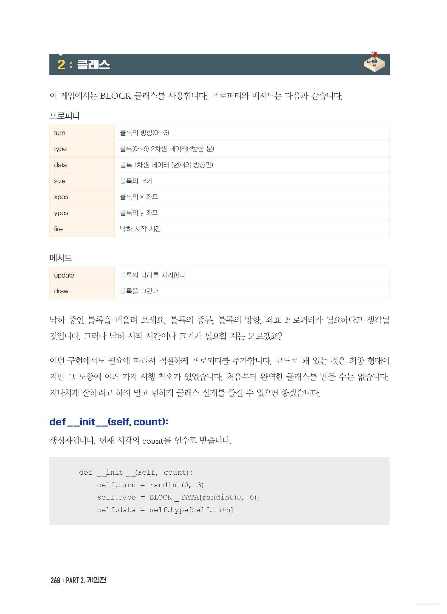

###### 이 게임에서는 BLOCK 클래스를 사용합니다. 프로퍼티와 메서드는 다음과 같습니다.

프로퍼티

turn type data size xpos ypos fire

블록의 방향(0~3)

블록(0~6) 2차원 데이터(4방향 분)

###### 블록 1차원 데이터 (현재의 방항만)

###### 블록의크기

- 블록의 x 좌표
- 블록의 y 좌표

낙하시작시간

머I서드

update draw

블록의낙하를처리한다

블록을그린다

낙하 중인 블록을 떠올려 보세요. 블록의 종류, 블록의 방향, 좌표 프로퍼티가 필요하다고 생각될 것입니다. 그러나 낙하 시작 시간이나 크기가 필요할 지는 모르겠죠?

이번 구현에서도 필요에 따라서 적절하게 프로퍼티를 추가합니다. 코드로 돼 있는 것은 최종 형태이 지만 그 도중에 여러 가지 시행 착오가 있었습니다. 처음부터 완벽한 클래스를 만들 수는 없습니다. 지나치게 잘하려고 하지 말고 편하게 클래스 설계를 줄길 수 있으면 좋겠습니다.

###### def __init__(self, count):

생성자입니다. 현재 시각의 count를 인수로 받습니다.

def i n i t (self, count) :

self.turn = randi nt(O, 3)

self.type = BLOCK—DATA[randi nt(0, 6)]

self.dat a = self.type[self.tur n]

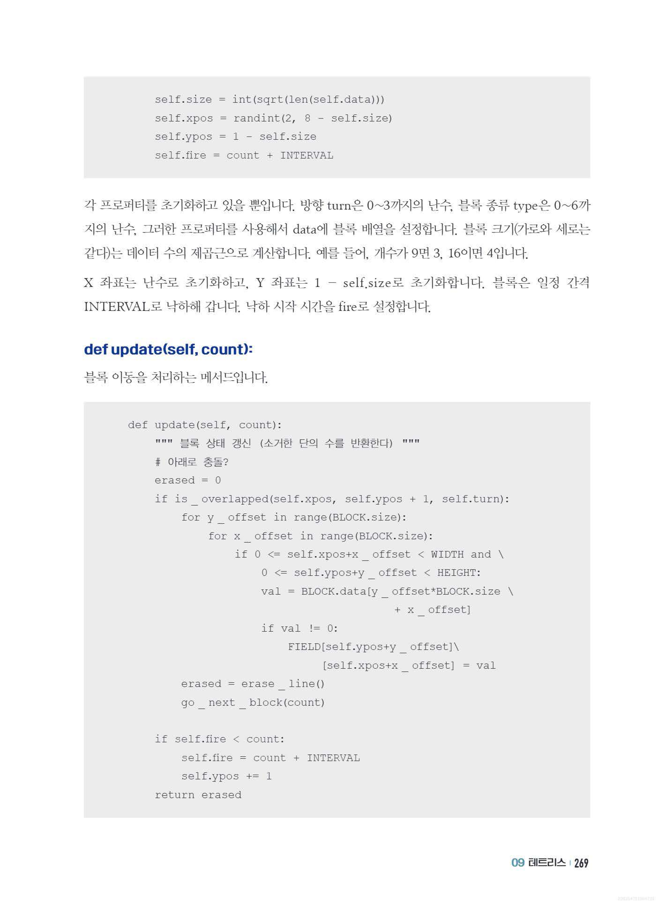

###### self. size = int (sqrt(len (self.data)) ) self.xpos = randint(2, 8 - self. size) self.ypos = 1 — self. size self.fire = count + I NTERVAL

각 프로퍼티를 초기화하고 있을 뿐입니다. 방향 turn은 0~3까지의 난수, 블록 종류 type은 0~6까 지의 난수, 그러한 프로퍼티를 사용해서 data에 블록 배열을 설정합니다. 블록 크기(가로와 세로는 같다)는 데이터 수의 제곱근으로 계산합니다. 예를 들어, 개수가 9면 3, 16이면 4입니다.

X 좌표는 난수로 초기화하고, Y 좌표는 1 —self.size로 초기화합니다.

블록은 일정 간격

INTERVAL로 낙하해 갑니다. 낙하 시작 시간을 fire로 설정합니다.

###### def update(self, count}:

블록 이동을 처리하는 메서드입니다.

###### def update (self, count) :

수를 바화하다)'- """

IIIIII 블록 상태 갱신 (소거한 단의

'- '-

# 아래로 충들?

erased = 0

if is overlapped(self.xpos, self.ypos + 1, self.turn) : for y offset in range (BLOCK. size) : f or x _ offset in range (BLOCK. size) : if O <= self.xpos+x offset < WI DTH and \

0 <= self.ypos+y —offset < HEIGHT:

val = BLOCK.data[y offset*BLOCK. size \

+ x off set] if val != 0:

FIELD[self.ypos+y offse더\ [self.xpos+x offset] = val

erased = erase line () go next block(count)

if self.fire < count: self.fire = count + I NTERVAL self.ypos += 1

return erased

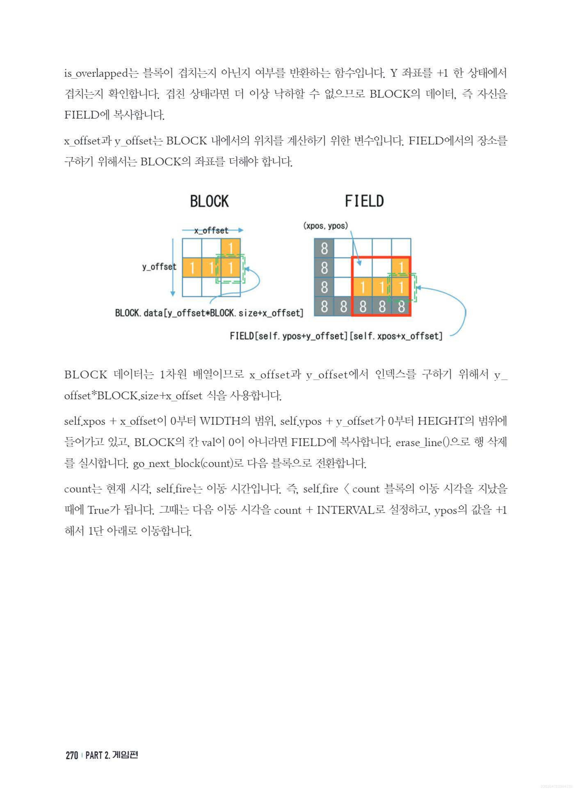

is_overlapped는 블록이 겹치는지 아닌지 여부를 반환하는 함수입니다. Y 좌표를 +1 한 상태에서 겹치는지 확인합니다. 겹친 상태라면 더 이상 낙하할 수 없으므로 BLOCK의 데이터, 즉 자신을 FIELD에 복사합니다. x_offset과 y_offset는 BLOCK 내에서의 위치를 계산하기 위한 변수입니다. FIELD에서의 장소를 구하기 위해서는 BLOCK의 좌표를 더해야 합니다.

###### BLOCK FIELD

###### - x::off-set--. (xpos. ypos)

###### BLOCK. data[y_offset*BLOCK. size+x_offset]

FI EL虹self. ypos+y_offset][self.xpos+x_offset]

###### BLOCK 데이터는 1차원 배열이므로 x_offset과 y―offset에서 인덱스를 구하기 위해서 y _

offset*BLOCK.size十x_offset 식을 사용합니다.

self.xpos 十 x_offset이 0부터 WIDTH의 범위, self.ypos + y_offset가 0부터 HEIGHT의 범위에

###### 들어가고 있고, BLOCK의 칸 val이 0이 아니라면 FIELD에 복사합니다. erase_lineO으로 행 삭제 를 실시합니다. go_next_block(count)로 다음 블록으로 전환합니다.

count는 현재 시각, self.fire는 이동 시간입니다. 즉, self.fire <count 블록의 이동 시각을 지났을 때에 True가 됩니다. 그때는 다음 이동 시각을 count + INTERVAL로 설정하고, ypos의 값을 +1 해서 1단 아래로 이동합니다.

###### 270 1PART 2. 게임편

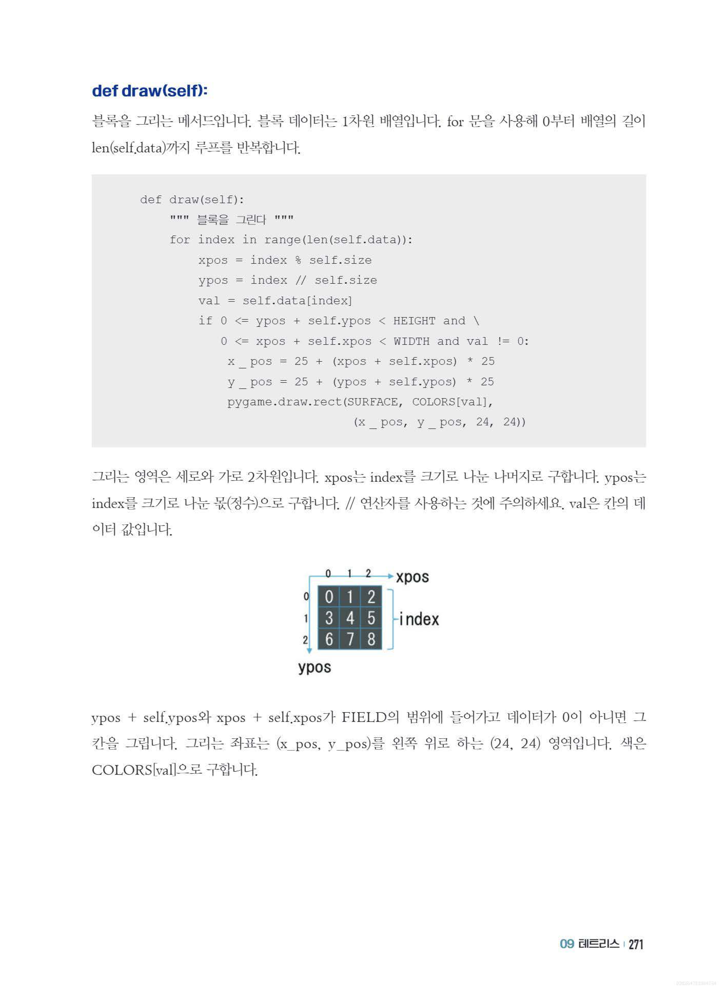

- def d『awCself): 블록을 그리는 메서드입니다. 블록 데이터는 1차원 배열입니다. for 문을 사용해 0부터 배열의 길이

###### len(self.data)까지 루프를 반복합니다.

###### def draw(self) :

""“ 블록을 그린다 ”“”

for index in range (len (self.data) ): xpos = index % self.size ypos = index II self.size val = self.data[index] if O <= ypos + self.ypos < HEIGHT and \

0 <= xpos + self.xpos < WIDTH and val

!= 0:

- x —pos = 25 + (xpos + self.xpos) * 25
- y —pos = 25 + (ypos + self.ypos) * 25

pygame .draw.rect(SURFACE, COLORS[val] , (x pos, y _ pos, 24, 24) )

그리는 영역은 세로와 가로 2치우!입니다. xpos는 index를 크기로 나눈 나머지로 구합니다. ypos는

index를 크기로 냐눈 몫(정수)으로 구합니다. /I 연산지를- 사용하는 것에 주의하세요. val은 칸의 데

이터 값입니다.

2 • xpos

036147258

ypos

ypos 十 self.ypos와 xpos + self.xpos가 FIELD의 범위에 들어가고 데이터가 0이 아니면 그

###### 칸을 그립니다. 그리는 좌표는 (x_ pos, y―pos)를 왼쪽 위로 하는 (24, 24) 영역입니다. 색은

COLORS[val]으로 구합니다.

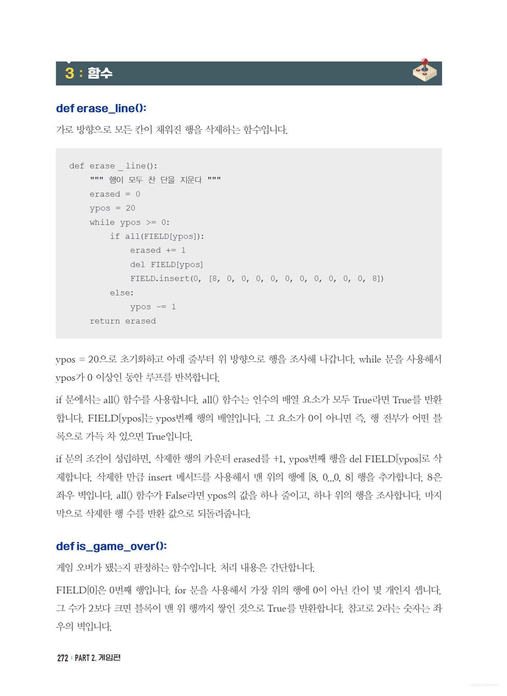

###### def e『ase_lineO:

가로 방향으로 모든 칸이 채워진 행을 삭제하는 함수입니다.

###### def erase line () :

II1111 행이 모두 찬 단을 지운다 """

erased = 0 ypos = 20 while ypos >= 0:

if all(FIELD[ypos]) : erased += 1 del FI ELD[ypos] FIELD.insert(O, [8, 0, 0, 0, 0, 0, 0, 0, 0, 0, 0, 8])

else:

ypos -= 1 return erased

ypos = 20으로 초기화하고 아래 줄부터 위 방향으로 행을 조사해 나갑니다. while 문을 사용해서 ypos가 0 이상인 동안 루프를 반복합니다. if 문에서는 allO 함수를 사용합니다. allO 함수는 인수의 배열 요소가 모두 True라면 True를 반환

합니다. FIELD[ypos]는 ypos번째 행의 배열입니다. 그 요소가 0이 아니면 즉, 행 전부가 어떤 블 록으로 가독 차 있으면 True입니다.

if 문의 조건이 성립하면, 삭제한 행의 카운터 erased를 十1, ypos번째 행을 del FIELD[ypos]로 삭 제합니다. 삭제한 만큼 inseli 메서드를 사용해서 맨 위의 행에 [8, 0...0, 8] 행을 추가합니다. 8은 좌우 벽입니다. allO 함수가 False라면 ypos의 값을 하나 줄이고, 하냐 위의 행을 조사합니다. 마지 막으로 삭제한 행 수를 반환 값으로 되돌려줍니다.

###### def is_game_overO:

게임 오버가 됐는지 판정하는 함수입니다. 처리 내용은 간단합니다.

FIELD[O]은 0번째 행입니다. for 문을 사용해서 가장 위의 행에 0이 아닌 칸이 몇 개인지 솁니다. 그 수가 2보다 크면 블록이 맨 위 행까지 쌓인 것으로 True를 반환합니다. 참고로 2라는 숫자는 좌 우의 벽입니다.

###### 272 1PART 2. 게임펀

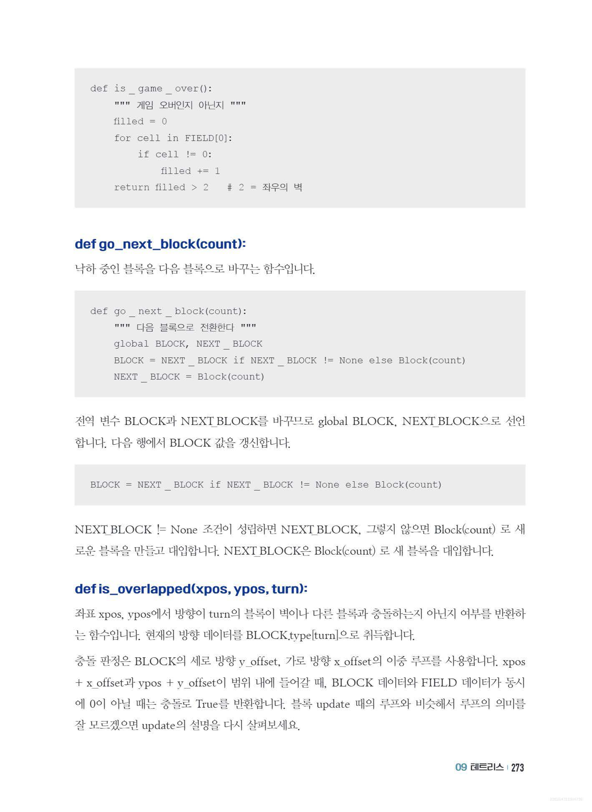

###### def i s game over () :

IIIIII 게임 오버인지 아닌지 """

filled = 0 for cell i n FI ELD[O] : if cell != 0:

filled += 1

return filled > 2 # 2 = 좌우의 벽

###### def go_next_block{count):

낙하 중인 블록을 다음 블록으로 바꾸는 함수입니다.

###### def go next block (count) :

IIIIII 다음 볼록으로 전환한다 " " "

global BLOCK, NEXT _ BLOCK

BLOCK = NEXT BLOCK if NEXT —BLOCK != None else Block(count)

NEXT BLOCK = Block(count)

전역 변수 BLOCK과 NEXT_BLOCK를 바꾸므로 global BLOCK, NEXT_BLOCK으로 선언 합니다. 다음 행에서 BLOCK 값을 갱신합니다.

BLOCK = NEXT BLOCK if NEXT _ BLOCK != None else Block(count)

N EXT_BLOCK != None 조건이 성립하면 NEXT_BLOCK, 그렇지 않으면 Block(count) 로 새

로운 블록을 만들고 대입합니다. NEXT_BLOCK은 Block(count) 로 새 블록을 대입합니다.

###### def is_overlapped(xpos, ypos, turn):

좌표 xpos, ypos에서 방향이 turn의 블록이 벽이나 다른 블록과 충돌하는지 아닌지 여부를 반환하 는 함수입니다. 현재의 방향 데이터를 BLOCK.type[turn]으로 취독합니다. 충돌 판정은 BLOCK의 세로 방향 y_offset, 가로 방향 x_offset의 이중 루프를 사용합니다. xpos

+ x_offset과 ypos + y_offset이 범위 내에 들어갈 때, BLOCK 데이터와 FIELD 데이터가 동시 에 0이 아닐 때는 충돌로 True를 반환합니다. 블록 update 때의 루프와 비슷해서 루프의 의미를 잘 모르겠으면 update의 설명을 다시 살펴보세요.

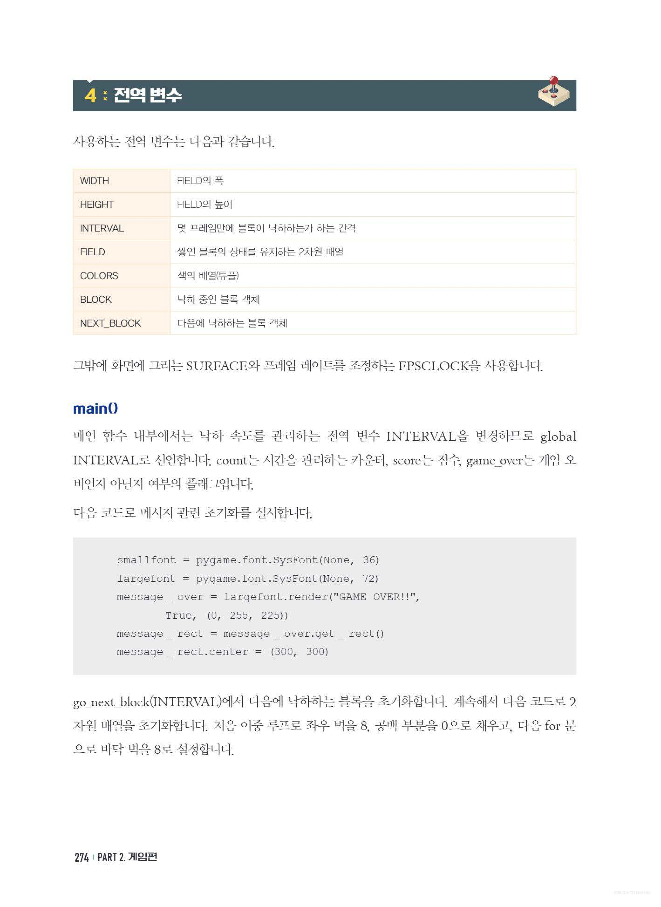

###### 사용하는 전역 변수는 다음과 같습니다.

WIDTH HEIGHT INTERVAL FIELD COLORS BLOCK NEXT BLOCK

FIELD의 폭

FIELD의 높이

몇 프레임만에 블록이 낙하하는가 하는 간격

쌓인 블록의 상태를 유지하는 2차원 배열

색의 배열(튜플)

낙하중인블록객체

다음에 낙하하는 블록 객체

그밖에 화면에 그리는 SURFACE와 프레임 레이트를 조정하는 FPSCLOCK울 사용합니다.

###### mainO

메인 함수 내부에서는 낙하 속도를 관리하는 전역 변수 INTERVAL을 변경하므로 global INTERVAL로 선언합니다. count는 시간을 관리하는 카운터` score는 점令 game_over는 게임 오 버인지 아닌지 여부의 플래그입니다.

다음 코드로 메시지 관련 초기화를 실시합니다.

smallfont = pygarne.font.SysFont(None, 36) largefont = pygarne.font.SysFont(None, 72) message over = largef ont.render ("GAME OVER! !",

True, (0, 255, 225) ) message rect = message over.get rect() message rect.center = (300, 300)

###### go_next_block(INTERVAL)에서 다음에 낙하하는 블록을 초기화합니다. 계속해서 다음 코드로 2

차원 배열을 초기화합니다. 처음 이중 루프로 좌우 벽을 8, 공백 부분을 0으로 재우고, 다음 for 문

으로 바닥 벽을 8로 설정합니다.

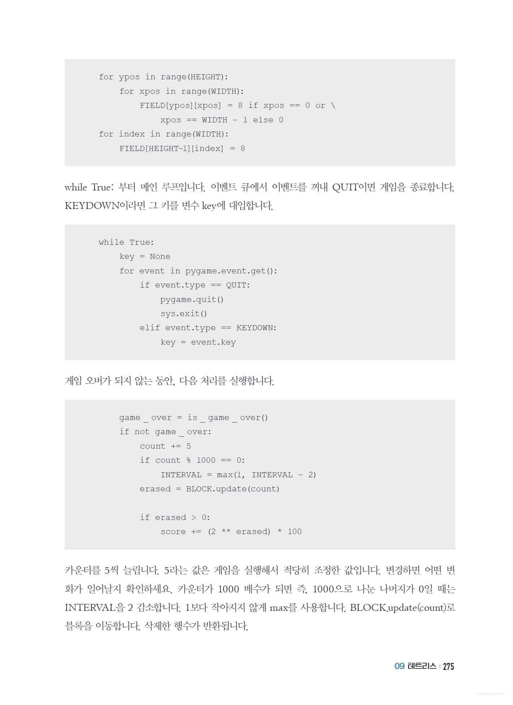

for ypos in range (HEIGHT) : for xpos in range (WIDTH) : FIELD [ypos] [xpos] = 8 if xpos

###### 0 or \

xpos == WIDTH - 1 else 0 for index in range (WI DTH) :

FIELD[HEIGHT-1] [index] = 8

while True: 부터 메인 루프입니다. 이벤트 큐에서 이벤트를 꺼내 QUIT이면 게임을 종료합니다. KEYDOWN이라면 그 키를 변수 key에 대입합니다.

while True: key = None for event in pygame .event.get () :

if event.type == QUIT: pygame .quit () sys .exit()

elif event.type == KEYDOWN:

key = event.key

게임 오버가 되지 않는 동안 다음 처리를 실행합니다.

game _ over = is —game over()

if not game over: count += 5 if count % 1000 == 0:

INTERVAL = rnax(l, INTERVAL - 2) erased = BLOCK.update (count)

if erased > 0:

score += (2 ** erased) * 100

카운터를 5씩 늘립니다. 5라는 값은 게임을 실행해서 적당히 조정한 값입니다. 변경하면 어떤 변

화가 일어날지 확인하세요. 카운터가 1000 배수가 되면 즉, 1000으로 나눈 나머지가 0일 때는 INTERVAL을 2 갑소합니다. 1보다 작아지지 않게 max를 사용합니다. BLOCK.update(count)로 블록을 이동합니다. 삭제한 행수가 반환됩니다.

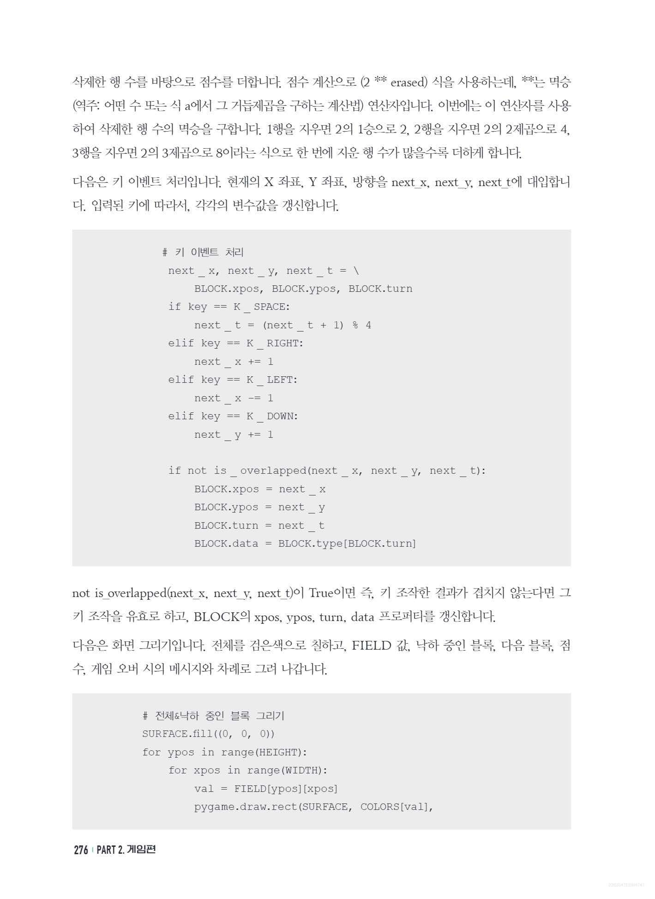

삭제한행 수를 바탕으로 점수를 더합니다. 점수 계산으로 (2 ** erased) 식을 사용하는데, *＊는 멱승

###### (역주: 어떤 수 또는 식 a에서 그 거듭제곱을 구하는 계산법) 연산자입니다. 이번에는 이 연신지를- 사용

하여 삭제한 행 수의 멱승을 구합니다. 1행을 지우면 2의 1승으로 2, 2행을 지우면 2의 2제곱으로 4, 3행을 지우면 2의 3제곱으로 8이라는 식으로 한 번에 지운 행 수가 많을수록 더하게 합니다. 다음은 키 이벤트 처리입니다. 현재의 X 좌표, Y 좌표, 방향을 next_x, next_y, next_t에 대입합니

다. 입력된 키에 따라서, 각각의 변수값을 갱신합니다.

# 키 이벤트 처리

next x, next y, next t = \

BLOCK.xpos, BLOCK.ypos, BLOCK.turn if key == K SPACE:

next t = (next _ t + 1) % 4 elif key == K _ RIGHT: next _ x += 1 elif key == K LEFT: next x -= 1 elif key == K _ DOWN: next y += 1

if not is overlapped(next x, next y, next t) :

BLOCK.xpos = next x BLOCK.ypos = next y BLOCK.turn = next t BLOCK.data = BLOCK.type[BLOCK.turn]

not is_overlapped(next_x, next_y, next_t)이 True이면 죽. 키 조작한 결과가 겹치지 않는다면 그 키 조작을 유효로 하고. BLOCK의 xpos, ypos, turn, data 프로퍼티를 갱신합니다. 다음은 화면 그리기입니다. 전체를 검은색으로 질하고, FIELD 값, 낙하 중인 블록, 다음 블록, 점 숙 게임 오버 시의 메시지와 차례로 그려 나갑니다.

# 전체&낙하 중인 블록 그리기

SURFACE .fill ((0, 0, 0)) for ypos in range (HEIGHT) :

for xpos in range (WI DTH) : val = FIELD [ypos] [xpos] pygame.draw.rect (SURFACE, COLORS [val] ,

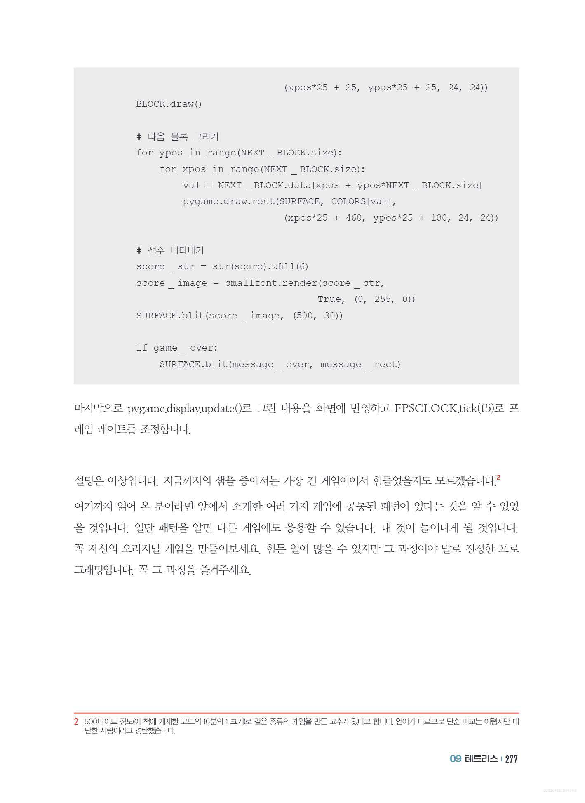

###### (xpos*25 + 25, ypos*25 + 25, 24, 24) ) BLOCK.draw()

# 다음 블록 그리기

for ypos in range (NEXT _ BLOCK. size) :

for xpos in range (NEXT BLOCK. size) : val = NEXT BLOCK.data[xpos + ypos*NEXT BLOCK.size] pygame .draw.rect(SURFACE, COLORS [val] ,

(xpos*25 + 460, ypos*25 + 100, 24, 24) )

# 점수 나타내기

score str = str(score) . zfill(6) score image = smallfont.render (score str,

True, (0, 255, 0) ) SURFACE.blit(score image, (500, 30) )

if game over: SURFACE.blit(message over, message rect)

###### 마지막으로 pygame.display.update(）로 그린 내용을 화면에 반영하고 FPSCLOCK.tick(15)로 프

레임 례이트를 조정합니다.

###### 설명은 이상입니다. 지금까지의 샘플 중에서는 가장 긴 게임이어서 힘들었을지도 모르겠습니다.2

여기까지 읽어 온 분이라면 앞에서 소개한 여러 가지 게임에 공통된 패턴이 있다는 것을 알 수 있었

###### 을 것입니다. 일단 패턴을 알면 다른 게임에도 응용할 수 있습니다. 내 것이 늘어냐게 될 것입니다.

###### 꼭 자신의 오리지널 게임을 만들어보세요. 힘든 일이 많을 수 였지만 그 과정이야 말로 진정한 프로 그래밍입니다. 꼭 그 과정을 즐겨주세요.

2 500바이트 정도(이 잭에 게재한코드의 16분의 1크7D로 같은 종류의 게임을 만든 고수기 있다고 힙니다 언어가 다르므로 단순 비교는 어렵지만 대

단한 사림0 1라고 경탄했습니다.

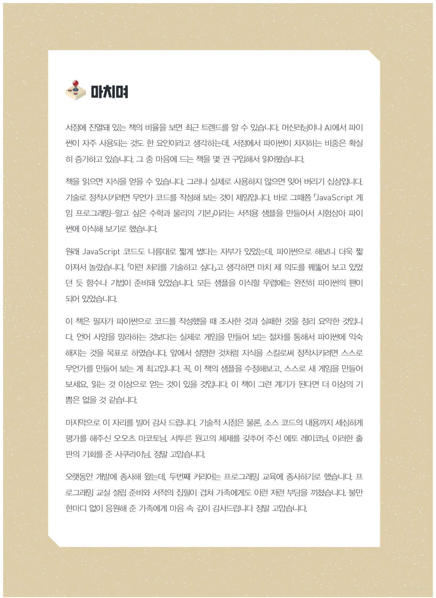

·•

###### . `

’

###### ‘ }.`

•

###### •

’ ‘

###### •

E`

••

23 a

"""1

3

서점에 진열돼 있는 책의 비율을 보면 최근 트렌드를 알 수 있습니다. 머신러닝이나 Al에서 파이 썬이 자주 사용되는 것도 한 요인이라고 생각하는데, 서점에서 따이썬이 차지하는 비중은 확실 히 증가하고 있습니다. 그 중 마음에 드는 책을 몇 권 구입해서 읽어봤습니다.

###### 책을 읽으면 지식을 얻을 수 있습니다. 그러나 실제로 사용하지 않으면 잊어 버리기 십상입니다 기술로 정착시키려면 무언가 코드를 작성해 보는 것이 제일입니다 바로 그때쯤 「JavaScript 게 임 프로그래밍―알고 싶은 수학과 물리의 기본」이라는 서적용 샘플을 만들어서 시험삼아 파이

、

、

###### ..``·

###### 썬에 이식해 보기로 했습니다.

•

###### ..

•. Ar

원래 JavaScript 코드도 나름대로 짧게 썼다는 자부가 있었는데, 파이썬으로 해보니 더욱 짧

`

###### 아져서 놀랐습니다 「이런 처리를 기술히고 싶다」고 생각하면 마치 제 의도를 꿰뚫어 보고 있었 던 듯 함수나 기법이 준비돼 있었습니다. 모든 샘플을 이식할 무렵에는 완전히 파이썬의 팬이

•

되어있었습니다

###### .

이 책은 필자가 파이썬으로 코드를 작성했을 때 조사한 것과 실패한 것을 정리 요약한 것입니 다. 언어 사양을 망라하는 것보다는 실제로 게임을 만들어 보는 절차를 통해서 파이썬에 익숙 해지는 것을 목표로 하였습니다. 앞에서 설명한 것처럼 지식을 스킬로써 정착시키려면 스스로 무언가를 만들어 보는 게 최고입니다 꼭 이 책의 샘플을 수정해보고, 스스로 새 게임을 만들어 보세요. 읽는 것 이상으로 얻는 것이 있을 것입니다. 이 책이 그런 계기가 된다면 더 이상의 기 쁨은없을것같습니다.

마지막으로 이 자리를 빌어 감사 드립니다. 기술적 시점은 물론 소스 코드의 내용까지 세심하게

###### •

평가를 해주신 오오츠 마코토님, 서투른 원고의 체제를 갖추어 주신 에토 레이코님, 이러한 출 판의 7 1회를 준 사쿠라01님, 정말 고맙습니다.

###### 오랫동안 개발에 종사해 왔는데, 두번째 커리어는 프로그래밍 교육에 종사하기로 했습니다 프

로그래밍 교실 설립 준비와 서적의 집필이 겹쳐 가족에게도 이런 저런 부담을 끼쳤습니다. 불만

한마디 없이 응원해 준 가족에게 마음 속 깊이 감사드립니다 정말 고맙습니다.

、

r

###### ... ., ., r .

’

口 ‘

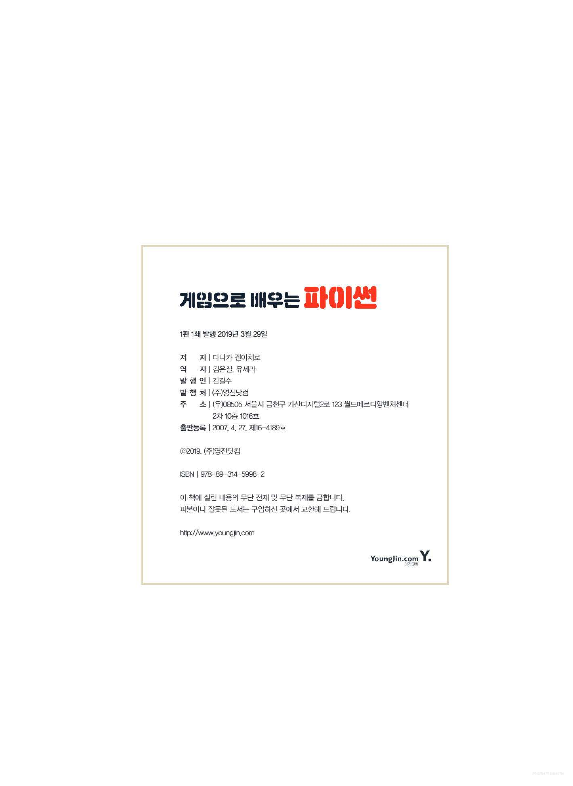

###### 게임으로 HH우는 1tOI썬

###### 1판 1쇄 발행 2019년 3월 29일

저 자 | 다나카겐이치로

역 자 | 김은철유세라 발행 인 김길수 발 행 처 l (주)영진닷컴

주 소 | （우)08505 서울시 금천구 가산디지털즈로 123 월드메르디앙벤처센터

~~1~1016호

출판등록 | 2007. 4. 刃. 제16-4189호

©2019. （주)영진닷컴

###### ISBN I978-~314-5998-2

이 책에 실린 내용의 무단 전재 및 무단 복저層 금합니다. 파본이나 잘못된 도서는 구입하신 곳에서 교환해 드립니다

http://www.youngjin.com

YoungJin.~Q~Y.

잉진딧컵

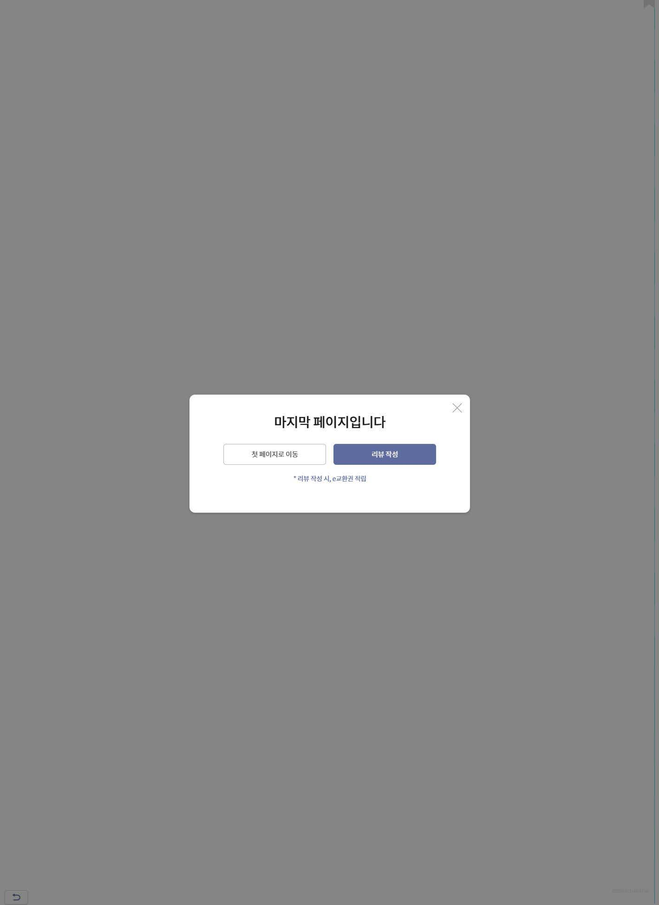

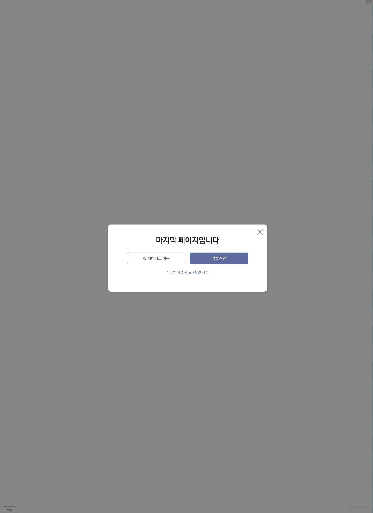

###### X

###### U 因막페 01 지입니다

###### [ 젓페아지로이등 ] 1

·리뷰작성시 ,e교환권적랍

