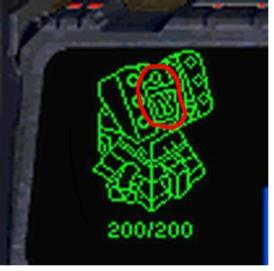

---
id: bj_1002
title: "터렛"
platform: "baekjoon"
is_scraped: true
level: 8
tier: "실버 III"
archived_at: "2026-04-18"
sprout: false 
official: true 
is_solvable: true 
gives_no_rating: false
accepted_user_count: 45377 
average_tries: 4.27 
is_level_locked: false
voted_user_count: 359
time_limit: "2 초"
memory_limit: "128 MB"
has_subtask: false
has_hint: false
contest: []
authors:
  - role: "translator"
    names: ["baekjoon"]
  - role: "author"
    names: ["baemin0103", "koyh1200"]
  - role: "contributor"
    names: ["doju"]
tags: ["수학", "기하학", "많은 조건 분기"]
tag_keys: ["math", "geometry", "case_work"]
source_url: "https://www.acmicpc.net/problem/1002"
---

# [1002번] 터렛

## 1. 문제 설명
조규현과 백승환은 터렛에 근무하는 직원이다. 하지만 워낙 존재감이 없어서 인구수는 차지하지 않는다. 다음은 조규현과 백승환의 사진이다.



이석원은 조규현과 백승환에게 상대편 마린(류재명)의 위치를 계산하라는 명령을 내렸다. 조규현과 백승환은 각각 자신의 터렛 위치에서 현재 적까지의 거리를 계산했다.

조규현의 좌표 $(x\_1, y\_1)$와 백승환의 좌표 $(x\_2, y\_2)$가 주어지고, 조규현이 계산한 류재명과의 거리 $r\_1$과 백승환이 계산한 류재명과의 거리 $r\_2$가 주어졌을 때, 류재명이 있을 수 있는 좌표의 수를 출력하는 프로그램을 작성하시오.

### 제한
* $-10\,000 ≤ x\_1, y\_1, x\_2, y\_2 ≤ 10\,000$
* $1 ≤ r\_1, r\_2 ≤ 10\,000$

---

## 2. 입출력 설명

* **입력:**
첫째 줄에 테스트 케이스의 개수 $T$가 주어진다. 각 테스트 케이스는 다음과 같이 이루어져 있다.

한 줄에 공백으로 구분 된 여섯 정수 $x\_1$, $y\_1$, $r\_1$, $x\_2$, $y\_2$, $r\_2$가 주어진다.

* **출력:**
각 테스트 케이스마다 류재명이 있을 수 있는 위치의 수를 출력한다. 만약 류재명이 있을 수 있는 위치의 개수가 무한대일 경우에는 $-1$ 출력한다.

---

## 3. 예시

### 예시 입력 1
```text
3
0 0 13 40 0 37
0 0 3 0 7 4
1 1 1 1 1 5
```

### 예시 출력 1
```text
2
1
0
```


---


## 5. 힌트
(힌트가 없습니다.)

---


## [정답 및 해설 (Ground Truth)]

### 모범 코드 (Python)
**(백준 크롤러에서는 정답 코드를 긁어올 수 없으므로, 선생님께서 아래에 직접 보충해 주세요)**

```python
A, B = map(int, input().split())
print(A + B)
```
