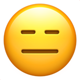
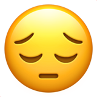

---
id: bj_32666
title: "Emoticons"
platform: "baekjoon"
is_scraped: true
level: 13
tier: "골드 III"
time_limit: "3 초 (추가 시간 없음)"
memory_limit: "1024 MB"
has_subtask: false
has_hint: false
contest: ["ICPC", "Regionals", "North America", "Rocky Mountain Regional", "2024 Rocky Mountain Regional Contest", "Mid-Central Regional", "2024 Mid-Central USA Programming Contest"]
authors:
  - role: "creator"
    names: ["Yosuke Mizutani"]
tags: ["자료 구조", "문자열", "브루트포스 알고리즘", "트리", "스택", "트라이"]
source_url: "https://www.acmicpc.net/problem/32666"
---

# [32666번] Emoticons

## 1. 문제 설명
Emma is a college student who regularly posts messages on her favorite social media, which supports several emoticons--- a pictorial representation of a facial expression using characters.

One day, she noticed that some emoticons in her message were automatically converted to the corresponding emojis by the platform.

For example, if she sends a message "`Hello ;-)`" to the platform, the actual post will be "`Hello` ".

If two or more emoticons overlap in a message, the system always converts the leftmost emoticon first.

Here is the complete list of the supported emoticons on that social media.

| Type | Emoticon | Emoji | Meaning |
| --- | --- | --- | --- |
| Western | `:)` |  | Smiley |
| Western | `:-)` |  | Smiley |
| Western | `:-(` |  | Frown |
| Western | `;-)` |  | Wink |
| Western | `xD` |  | Laughing |
| Eastern | `^_^` |  | Smiley |
| Eastern | `-_-` |  | Expressionless |
| Eastern | `^o^` |  | Screwed |
| Eastern | `^^;` |  | Sweating |
| Eastern | `(..)` |  | Looking down |

She always uses the following "visible" characters and the space character "".

* Digits: `0123456789`
* Uppercase letters: `ABCDEFGHIJKLMNOPQRSTUVWXYZ`
* Lowercase letters: `abcdefghijklmnopqrstuvwxyz`
* Symbols: `!"#$%&'()*+,-./:;<=>?@[\]^_'{|}~`

Today, just before posting, she accidentally replaced all occurrences of one character in her message with another character.

Such characters include space, and she might have replaced a character with the same character, causing no effect.

Now, she wants to know the message length after the platform converts emoticons into emojis, where she counts each emoji as one character.

Can you help her find the minimum and maximum possible message lengths?

---

## 2. 입출력 설명

* **입력:**
The input contains Emma's original text (before she accidentally replaced characters) on one line. The text contains at most $100$ characters, consisting of the visible ASCII characters defined above and the space character.

Her text is not empty, and its first and last characters are visible characters.

* **출력:**
Output two integers, the minimum and the maximum possible message lengths after emoticons in her message are converted into emojis.

---

## 3. 예시

### 예시 입력 1
```text
Hello ;-) world ^^.
```

### 예시 출력 1
```text
15 19
```

### 예시 입력 2
```text
xDEoE_E
```

### 예시 출력 2
```text
4 7
```


---


## 5. 힌트
(힌트가 없습니다.)

---


## [정답 및 해설 (Ground Truth)]

### 모범 코드 (Python)
**(백준 크롤러에서는 정답 코드를 긁어올 수 없으므로, 선생님께서 아래에 직접 보충해 주세요)**

```python
A, B = map(int, input().split())
print(A + B)
```
