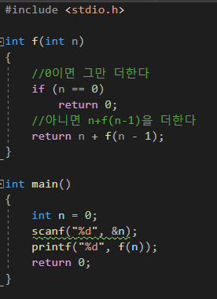

# [ALLv05005번] 05. [재귀함수 - 5] 재귀함수 튜토리얼2 (결과값 반환)

## 1. 문제 설명
이번엔 return에서 재귀함수를 호출하는걸 해봅시다. return에서 재귀함수를 호출하는 것을 꼬리재귀 라고도 합니다. return에서 호출하다보니 void형으로는 실행할 수 없습니다.

이전문제를 꼬리재귀로 해봅시다.



n=10이라고 한다면 10+f(9)를 반환합니다. f(9)는 9+f(8)을 반환, f(8)은 8+f(7)을 반환...

10+9+8+7+6+5+4+3+2+1+0이 됩니다.

천천히 꼬리재귀도 연습해 봅시다.

피보나치 수열이란 앞의 두 수를 더하여 나오는 수열입니다.

첫 번째 수와 두 번째 수는 모두 1이고, 세 번째 수부터는 이전의 두 수를 더하여 나타낸다. 피보나치 수열을 나열해 보면 다음과 같습니다.

1, 1, 2, 3, 5, 8, 13

피보나치 수열의 점화식을 생각해보세요.

자연수 N을 입력받아 N번째 피보나치 수를 출력하는 프로그램을 작성해주세요.

---

## 2. 입출력 설명

* **입력:**
자연수 N이 입력된다. (N은 20보다 같거나 작다.)

* **출력:**
N번째 피보나치 수를 출력한다.

---

## 3. 예시

### 예시 입력 1
```text
7
```

### 예시 출력 1
```text
13
```

---

## 4. 힌트
(힌트가 없습니다.)

---

<!-- ANSWER_START -->
## [정답 및 해설 (Ground Truth)]

### 모범 코드 (Python)
**(백준 크롤러에서는 정답 코드를 긁어올 수 없으므로, 선생님께서 아래에 직접 보충해 주세요)**

```python
A, B = map(int, input().split())
print(A + B)
```
<!-- ANSWER_END -->
