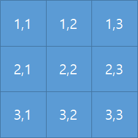
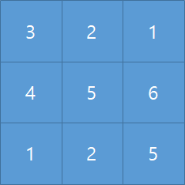

# [ALLv10009번] 12. [재귀함수 - 12] 격자이동

## 1. 문제 설명
n\*n크기의 격자가 있습니다. (n은 3이상 5 이하)

제일 왼쪽 위 격자는 (1,1) 이고 제일 오른쪽 아래는 (3,3) 입니다.



좌상단 (1,1)부터 우하단(3,3)까지 이동하려고 합니다. 이동할 때엔 다음 두 가지 방식으로 가능합니다.

* 오른쪽으로 한 칸 이동하기
* 아래쪽으로 한 칸 이동하기

또한 격자에는 숫자가 하나씩 써있습니다. (숫자는 1 이상 20 이하)



이동할 때, 이동하면서 지나온 격자들에 써 있는 숫자의 합이 최대가 되게 하고 싶습니다.

숫자의 합이 최대일 때 합은 몇일까요?

---

## 2. 입출력 설명

* **입력:**
첫 줄에 격자 크기 n이 입력됩니다.

다음 n개 줄에 n개씩 문자가 입력됩니다.

* **출력:**
이동경로에 있는 숫자의 합이 제일 클 때, 그 합을 출력해주세요.

---

## 3. 예시

### 예시 입력 1
```text
5
1 8 2 5 5 
6 3 3 6 5 
1 10 5 5 5 
5 4 5 2 7 
6 9 6 8 5
```

### 예시 출력 1
```text
54
```

### 예시 입력 2
```text
4
10 2 10 3 
7 6 7 3 
3 10 10 5 
10 9 10 5
```

### 예시 출력 2
```text
58
```

### 예시 입력 3
```text
3
3 9 2 
3 8 10 
7 3 2
```

### 예시 출력 3
```text
32
```

---

## 4. 힌트
(힌트가 없습니다.)

---

<!-- ANSWER_START -->
## [정답 및 해설 (Ground Truth)]

### 모범 코드 (Python)
**(백준 크롤러에서는 정답 코드를 긁어올 수 없으므로, 선생님께서 아래에 직접 보충해 주세요)**

```python
A, B = map(int, input().split())
print(A + B)
```
<!-- ANSWER_END -->
