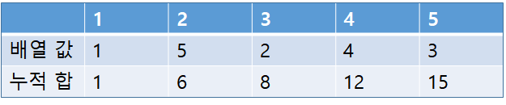
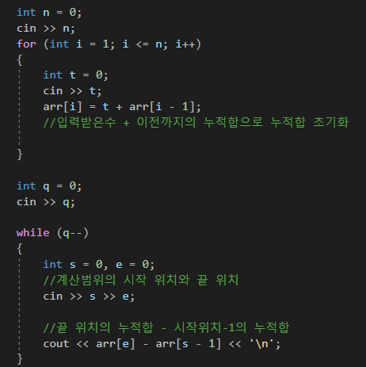

---
id: "ALLv02001"
db_id: 736
legacy_id: "ALLv02001"
title: "01. [누적합 - 1] 누적합 튜토리얼"
platform: "doingcoding"
level: "Mid"
tags:
  - "Lv34 PrefixSum"
  - "ALLv2 PrefixSum"
  - "ALLv2 PrefixSum1"
  - "ALLv02 PrefixSum 1"
authors:
  - "root"
supported_languages:
  - "C"
  - "C++"
  - "Java"
  - "Python3"
time_limit: "1.5s"
memory_limit: "256MB"
accepted_user_count: 106
has_hint: "false"
archived_at: "2026-05-26"
---

# 01. [누적합 - 1] 누적합 튜토리얼

## 1. 문제 설명
배열 안에 숫자를 순서대로 더해봅시다.

1번째 부터 5번째 까지

1번째 부터 3번째 까지

2번째 부터 100번째 까지

for문으로 돌려서 더하면 간단하게 더할 수 있습니다.

더하기를 조금 많이 시키면 어떨까요? for문이 많이 돈다면?

계산량이 너무 많아져서 시간초과가 날 것입니다.

누적합은 지금까지 입력받은 값을 배열에 저장하여 계산량을 줄일 수 있는 알고리즘 입니다.

아래의 표를 봅시다.



1번째 부터 3번째 까지 합은? 누적합 3번인 8입니다.

1번째 부터 4번째 까지는? 누적합 4번인 12입니다.

누적합 배열을 바로바로 꺼내와서 계산량을 줄였습니다.

2번째 부터 5번째까지는 어떻게 계산 할까요?

5번째 누적합인 15,  2번째 전인 1번째의 누적합인 1을 빼면 2번째부터 5번째 까지의 합인 14가 나옵니다.

예시코드 입니다.



문제를 풀며 알고리즘을 익혀봅시다.

---

## 2. 입출력 설명

* **입력:**
첫 행에 원소의 수 N이 입력된다. ( 1 ≤ N ≤ 1,000,000)

다음 행에 N개의 수 Ai가 공백을 구분하여 입력된다. ( -1,000,000 ≤ Ai ≤ 1,000,000)

다음 행에 질문의 수 M이 입력된다. ( 1 ≤ M ≤ 1,000,000)

이어서 M개의 행에 질문의 정보 si, ei가 공백으로 구분되어 입력된다. ( 1≤ si≤ ei≤ N)

* **출력:**
각 질문에 대한 결과를 행으로 구분하여 출력한다.

---

## 3. 예시
### 예시 입력 1
```text
10
7 3 2 4 -5 1 6 -3 0 9
5
1 3
1 10
5 5
7 8
4 6
```

### 예시 출력 1
```text
12
24
-5
3
0
```

---

## 4. 힌트
(힌트가 없습니다.)
---

