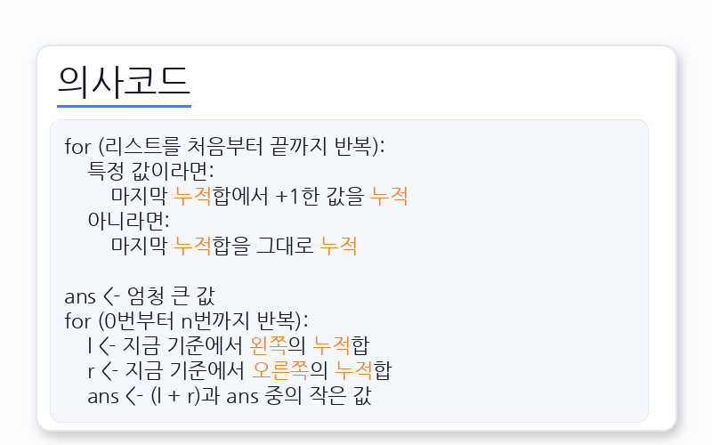
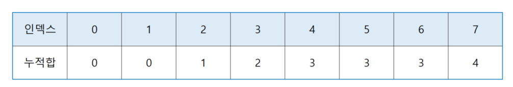
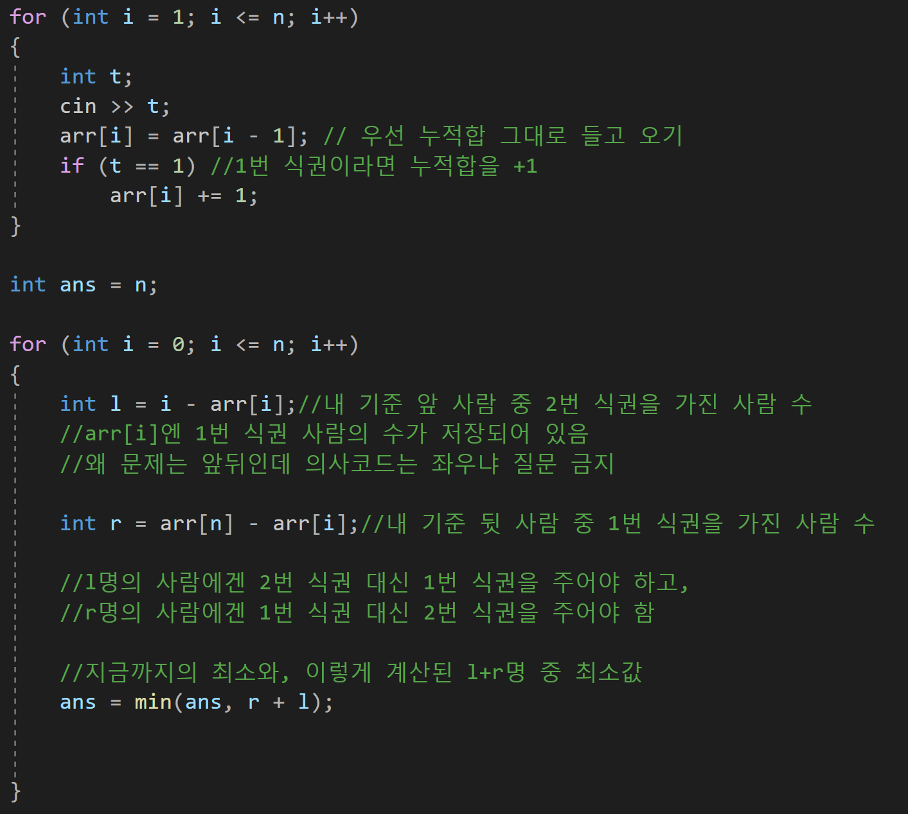
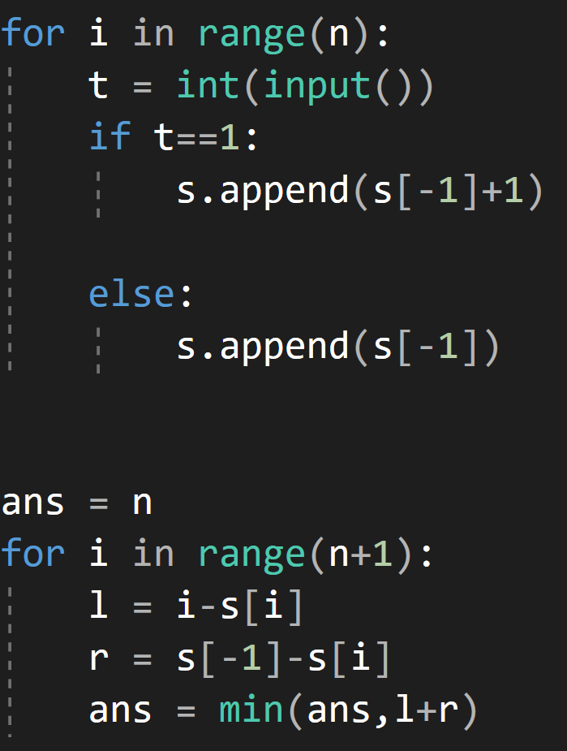

---
id: "ALLv07001"
db_id: 2330
legacy_id: "ALLv07001"
title: "01. [누적합 - 1] 식권 재분배"
platform: "doingcoding"
level: "Mid"
tags:
  - "Bronze"
  - "USACO"
  - "ALLv2 PrefixSum"
  - "ALLv9 PrefixSum2"
  - "ALLv7 PrefixSum2"
  - "ALLv07 PrefixSum 2"
authors:
  - "root"
supported_languages:
  - "C"
  - "C++"
  - "Golang"
  - "Java"
  - "Python2"
  - "Python3"
time_limit: "1s"
memory_limit: "256MB"
accepted_user_count: 1
has_hint: "true"
archived_at: "2026-06-17"
---

# 01. [누적합 - 1] 식권 재분배

## 1. 문제 설명
한 식당에서 1번 식권과 2번 식권을 팔았습니다.

1번 식권을 가진 사람부터 식사를 주고 2번 식권을 가진 사람한테 식사를 주려고 합니다.

그런데 사람들이 줄을 서고 보니 줄이 이상합니다. 2번 식권을 가진 사람과 1번 식권을 가진 사람이 뒤섞여 있습니다.

할 수 없이 식권을 다시 나눠줘서 1번 식권을 부터 식사를 다 받게 하고 2번 식권의 식사를 주려고 합니다. (예를 들어 112222순으로 서거나 111122순으로 서서 1번 사람들과 2번 사람들이 서로 모여있게만 하면 됩니다.)

식권을 다시 받아야하는 사람의 최소 수를 출력해주세요.

---

## 2. 입출력 설명

* **입력:**
사람 수 n이 입력됩니다.(n은 1이상 30,000이하)

그 다음 줄 부터 n번까지 줄 선 사람 순서대로 가지고 있는 식권이 입력됩니다. (식권은 1번 또는 2번)

* **출력:**
식권을 다시 받아야하는 사람의 최소 수를 출력해주세요.

---

## 3. 예시
### 예시 입력 1
```text
7
2
1
1
1
2
2
1
```

### 예시 출력 1
```text
2
```

### 예시 입력 2
```text
9
2
1
2
2
1
2
1
2
1

```

### 예시 출력 2
```text
4

```

---

## 4. 힌트


의사코드입니다. 천천히 하나씩 짚어봅시다.

특정 사람 x를 기준으로 하면, x를 포함해서 x의 앞사람은 전부 1번 식권이어야 하고, x 뒷사람까지는 전부 2번 식권이어야 합니다.

0번 사람부터(모든 사람이 2번 식권을 받는 게 최소일 수 도 있으니까) n번사람까지 기준을 잡고 일일이 확인하기엔 시간이 많이 걸립니다.

특정값을 1로 잡고 해봅시다.  


1을 계속 누적 시킨 결과입니다. 이제 0번 사람부터 7번 사람까지 기준을 잡아가며 계산합시다.

0번 사람 왼쪽엔 아무도 없습니다. 왼쪽의 누적합은 0입니다.

0번 사람의 오른쪽 누적합은 0번부터 7번까지의 누적합인 4입니다.

0 + 4 = 4가 0번 기준으로 식권을 다시 받아야할 사람의 수 입니다.

1번 사람을 기준으로 합시다. 1번 사람의 왼쪽엔 식권을 다시 받야할 사람이 1명 있습니다. 1번 자기 자신이 2번 식권이기 때문입니다.

오른쪽은 4명입니다. 1 + 4 = 5가 나옵니다.

2번 기준으로는 왼쪽 1, 오른쪽 3으로 1 + 3 = 4입니다.

3번은 왼쪽 1, 오른쪽 2로 1 + 2 = 3입니다.

4는 왼쪽 1, 오른쪽 1로 1 + 1 = 2

5는 2 + 1 = 3

6은 3 + 0 = 3

7은 3 + 0 = 3

합의 최소값은 2이므로 답은 2가 됩니다.  
  


이를 CPP 코드로 작성하면 이렇게 됩니다.



파이썬 코드입니다.

해당 코드를 참고하여 문제를 풀어봅시다.
---

