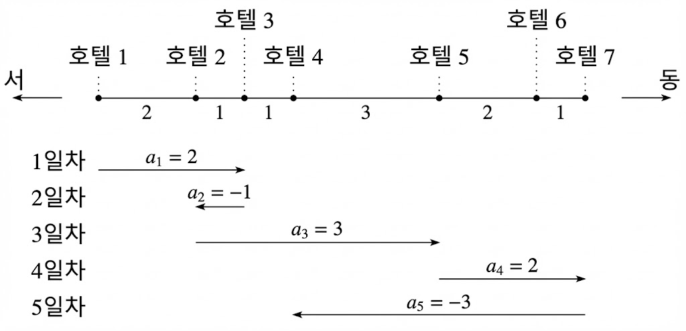

---
id: "SALLv07003"
db_id: 2124
legacy_id: "SALLv07003"
title: "03. [누적합 - 3] 여행"
platform: "doingcoding"
level: "Low"
tags:
  - "SALLv07 PrefixSum 2"
authors:
  - "root"
supported_languages:
  - "C"
  - "C++"
  - "Java"
  - "Python3"
time_limit: "1s"
memory_limit: "128MB"
accepted_user_count: 1
has_hint: "true"
archived_at: "2026-06-17"
---

# 03. [누적합 - 3] 여행

## 1. 문제 설명
당신은 한 도로를 여행하고 있습니다.이 도로는 동서로 곧게 뻗은 도로이며, 도로 위에는 N개의 호텔이 있습니다.역참에는 서쪽에서부터 동쪽까지 1번부터 n번으로 번호가 붙어 있습니다.도로에서 가장 서쪽의 호텔이 1번 호텔, 가장 동쪽의 호텔이 n번 호텔입니다.

당신은 1번 호텔에서 출발하여 m일간 여행을 하게 되었습니다.당신의 여행 일정은 수열 A1, A2, ... Am에 따라 다음과 같이 정해집니다. Ai는 i일째의 이동 방법을 나타내는 0이 아닌 정수입니다.i일째에 당신이 출발하는 호텔을 호텔 k라고 하면, i일째에는 k번 호텔에서 k+Ai번 호텔로 바로 이동한다는 뜻입니다.

호텔의 개수 n 여행 일수 m, 호텔 사이의 거리 정보, 그리고 이동 방법을 나타내는 수열 A1, A2, ... Am이 주어질 때, m일 동안의 여행에서 당신이 이동한 거리의 합을 100000(10의 5제곱)으로 나눈 나머지를 구하는 프로그램을 작성해 주세요.

---

## 2. 입출력 설명

* **입력:**
첫째 줄에 정수 n, m이 공백으로 구분되어 주어집니다. n (2<=n<=100000 (10^5))은 도로 위 호텔의 개수이고 m은 (1<=m<=100000 (10^5))은 여행 일수입니다. 다음 n-1개 줄에는 도로 위 호텔 사이의 거리가 주어집니다. i+1번째 줄(1<=i<=n-1)에는 호텔 i와 호텔 i+1 사이의 거리를 나타내는 정수 Si (1<=Si<=100)가 주어집니다. 다음 m개 줄에는 m일 동안의 이동 방법을 나타내는 수열이 주어집니다. i + n번째 줄 (1<=i<=m)에는 i일째의 이동 방법을 나타내는 0이 아닌 정수 Ai가 주어집니다. 1번 호텔에서 더 서쪽으로 이동하는 경우나, n번 호텔에서 더 동쪽으로 이동하는 경우는 없습니다.

* **출력:**
m일 동안 여행에서 당신이 이동한 거리의 합을 100000 (10^5)로 나눈 나머지를 출력해 주세요.

---

## 3. 예시
### 예시 입력 1
```text
7 5
2
1
1
3
2
1
2
-1
3
2
-3
```

### 예시 출력 1
```text
18
```

---

## 4. 힌트


1일차에 당신은 1번 호텔에서 3번 호텔까지 이동합니다. 2일차에 3번 호텔에서 2번 호텔까지 이동합니다. 3일차에 2번 호텔에서 5번 호텔까지 이동하고, 4일차에 5번 호텔에서 7번 호텔까지 이동하며, 5일차에 7번 호텔에서 4번 호텔까지 이동합니다. 이 5일 동안의 여행에서 당신이 이동한 거리의 총합은 18입니다.
---

