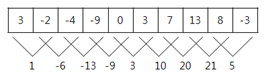
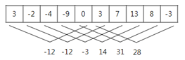

---
id: "SP301v3404"
db_id: 737
legacy_id: "SP301v3404"
title: "04. [누적합 - 4] 수열"
platform: "doingcoding"
level: "Mid"
tags:
  - "SLv34 PrefixSum"
  - "2차초등기출문제"
  - "한국정보올림피아드"
  - "SALLv2 PrefixSum1"
  - "ALLv06 알고리즘 초급 1-1"
authors:
  - "root"
supported_languages:
  - "C"
  - "C++"
  - "Golang"
  - "Java"
  - "Python2"
  - "Python3"
time_limit: "1s"
memory_limit: "256MB"
accepted_user_count: 58
has_hint: "false"
archived_at: "2026-06-17"
---

# 04. [누적합 - 4] 수열

## 1. 문제 설명
매일 아침 9시에 학교에서 측정한 온도가 어떤 정수의 수열로 주어졌을 때,

연속적인 며칠 동안의 온도의 합이 가장 큰 값을 알아보고자 한다.

예를 들어, 아래와 같이 10일 간의 온도가 주어졌을 때,

**3 -2 -4 -9 0 3 7 13 8 -3**

모든 연속적인 이틀간의 온도의 합은 아래와 같다.



이때, 온도의 합이 가장 큰 값은 21이다.

또 다른 예로 위와 같은 온도가 주어졌을 때,

모든 연속적인 5일 간의 온도의 합은 아래와 같으며,



이때, 온도의 합이 가장 큰 값은 31이다.

매일 측정한 온도가 정수의 수열로 주어졌을 때,

연속적인 며칠 동안의 온도의 합이 가장 큰 값을 계산하는 프로그램을 작성하시오.

---

## 2. 입출력 설명

* **입력:**
첫째 줄에는 두 개의 정수 N과 K가 한 개의 공백을 사이에 두고 순서대로 주어진다.

첫 번째 정수 N은 온도를 측정한 전체 날짜의 수이다. N은 2 이상 100,000 이하이다.

두 번째 정수 K는 합을 구하기 위한 연속적인 날짜의 수이다. K는 1과 N 사이의 정수이다.

둘째 줄에는 매일 측정한 온도를 나타내는 N개의 정수가 빈칸을 사이에 두고 주어진다.

이 수들은 모두 -100 이상 100 이하이다.

* **출력:**
첫째 줄에는 입력되는 온도의 수열에서 연속적인 K일의 온도의 합이 최대가 되는 값을 출력한다.

---

## 3. 예시
### 예시 입력 1
```text
10 2
3 -2 -4 -9 0 3 7 13 8 -3
```

### 예시 출력 1
```text
21
```

### 예시 입력 2
```text
10 5
3 -2 -4 -9 0 3 7 13 8 -3
```

### 예시 출력 2
```text
31
```

### 예시 입력 3
```text
9 4
-4 -7 -4 -4 0 -8 -7 -7 10 
```

### 예시 출력 3
```text
-12
```

---

## 4. 힌트
(힌트가 없습니다.)
---

