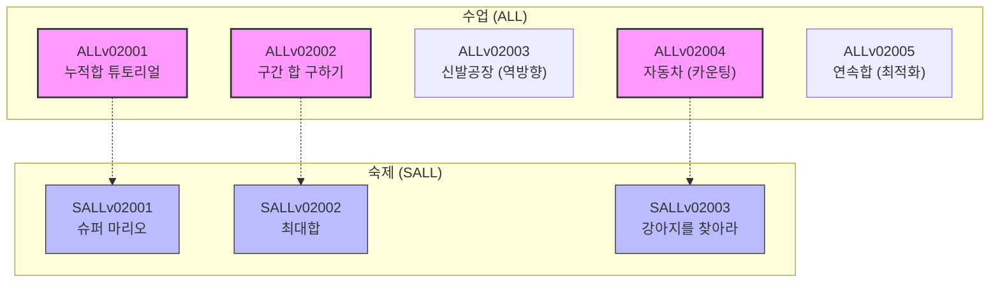

# StepCode DoingCoding — 교육 품질 검수 보고서 (ALLv02_PrefixSum1)

이 보고서는 `ALLv02_PrefixSum1` 단원의 크롤링된 문제들을 분석하고, 학습자의 인지 부하를 최소화하면서 학습 효과를 극대화할 수 있는 **스캐폴딩(Scaffolding) 개편 설계안**을 제안합니다.

---

## 1. 단원 전체 5개 Set 구성 및 난이도 곡선 (스캐폴딩) 분석

### 📈 인지적 사다리 (Difficulty Curve)
기초 개념 학습에서 시작하여 구간 합 공식 체득, 응용 패턴(역방향 누적, 일방향 매칭), 그리고 실전 최적화(최솟값 기억 연속합)에 이르기까지 완만한 $O(N)$ 난이도 상승 곡선을 그리도록 설계했습니다.

```
[난이도]
  ▲
  │                                           ★ 수업 5: 연속합 (Silver II)
  │                                          /
  │                         ★ 수업 4: 자동차 (Low)
  │                        /
  │         ★ 수업 3: 신발공장 (Low)
  │        /
  │  ★ 수업 2: 구간 합 구하기 (Low)
  │ /
  ★ 수업 1: 튜토리얼 (Mid)
  └────────────────────────────────────────────────────────► [진도]
```

### 🏫 수업용(ALL) 5단계 설계 원리
1. **ALLv02001 (기본 개념)**: 누적합을 왜 쓰는지에 대한 시간 복잡도 관점의 이유를 가르칩니다.
2. **ALLv02002 (공식 체득)**: 튜토리얼 직후에 배치하여 $S[R] - S[L-1]$ 공식을 실제 구현하며 실무 손맛을 익힙니다.
3. **ALLv02003 (역방향 누적)**: Suffix Sum 방향으로의 축적과 이를 통한 최적값 탐색(그리디 융합)을 배웁니다.
4. **ALLv02004 (2글자 카운팅)**: 일방향 루프를 돌며 누적 빈도를 상태 정보로 활용하는 카운팅 누적 기법을 배웁니다.
5. **ALLv02005 (동적 최적화)**: 누적합 배열과 최솟값 동적 갱신($S[i] - \min(S[j])$)을 활용해 최대 구간합을 구하는 실전 알고리즘을 마스터합니다.

---

## 2. 수업 문제(ALL)와 숙제 문제(SALL) 간의 학습 연계 매핑

숙제 문제는 수업에서 다룬 개념적 도약을 개별 확인하고 확실하게 복습할 수 있도록 일대일 연계형으로 매핑했습니다.



* **매핑 상세**:
  * **수업 1 $\rightarrow$ 숙제 1**: 1차원 순차 누적 시뮬레이션 복습.
  * **수업 2 $\rightarrow$ 숙제 2**: 임의 구간합 공식을 고정 범위 윈도우($K$) 형태로 꼬아낸 응용 복습.
  * **수업 4 $\rightarrow$ 숙제 3**: 2글자 카운팅(`자동차`) 개념을 문자열 내 2글자 패턴 매칭(`강아지를 찾아라`)으로 확장 복습.

---

## 3. 문제별 품질 진단 결과

| 문제 ID | 제목 | 추정 티어 | 규정 위반 및 개선 방향 |
| :--- | :--- | :---: | :--- |
| **ALLv02001** | 누적합 튜토리얼 | Silver III | - 지문 내 1번째, 2번째 전 등의 띄어쓰기 가독성 개선 필요.<br/>- 대량의 $M$ 쿼리가 들어오므로 입출력 성능 팁 추가 필요. |
| **ALLv02002** | 구간 합 구하기 | Silver III | - 가장 베이직한 형태의 쿼리 조회로 구현 컨벤션 점검에 최적. |
| **ALLv02003** | 신발공장 | Silver IV | - '시장 조사에 따르며느' 등 지문의 오타 수정 필요.<br/>- 1-based index 인지 0-based index 인지 지문 내 명시 필요. |
| **ALLv02004** | 자동차 | Silver IV | - 정답 쌍의 개수가 $O(N^2)$까지 커질 수 있어 `long long` 자료형 필요성을 힌트에 기술해야 함. |
| **ALLv02005** | 연속합 | Silver II | - 수열의 크기 $N \le 100,000$이고 원소에 음수가 포함되므로 갱신 변수 최솟값 설정 주의점을 명시해야 함. |
| **SALLv02001** | 슈퍼 마리오 | Bronze I | - 버섯 점수가 음수가 없으므로 간단히 해결 가능. 초보자용으로 적절. |
| **SALLv02002** | 최대합 | Silver IV | - 입출력 형식에서 줄바꿈으로 입력이 여러 행 주어질 때 파이썬 EOF 처리 유의점 명시 필요. |
| **SALLv02003** | 강아지를 찾아라 | Silver IV | - `((`와 `))` 문자열 매칭 시 오버랩 탐색에 관한 세부 설명 기술 필요. |

---

## 4. 파이썬(Python) 1초 내 해결 가능성 진단 및 대응 전략

수열 크기 $N \le 1,000,000$ 및 질문 수 $M \le 1,000,000$인 고성능 요구 문제들에 대한 파이썬 구동 전략입니다.

1. **ALLv02001 (누적합 튜토리얼)**: 
   * *진단*: $N=10^6, M=10^6$일 때 표준 `input()` 호출 시 100% 시간초과가 발생합니다.
   * *대응*: 지문에 `sys.stdin.readline`을 이용한 빠른 입출력 가이드를 추가하여 파이썬 수험생의 시간초과를 방지합니다.
2. **ALLv02002 (구간 합 구하기)**:
   * *진단*: $N=10^5, M=10^5$로 상대적으로 널널하지만 루프 내 연산 최소화 필요.
   * *대응*: 마찬가지로 빠른 입출력 템플릿 안내를 작성합니다.
3. **ALLv02003 (신발공장) & ALLv02004 (자동차)**:
   * *진단*: $N=10^6$ 단일 패스 루프 연산이므로 파이썬 내장 `sum()`이나 단순 $O(N)$ 루프로 0.1~0.2초 이내 해결 가능.
   * *대응*: 불필요한 이중 루프 사용을 지양하라는 힌트를 추가합니다.

---

## 5. 정규화 및 리팩토링 로드맵 체크리스트

- [ ] `01_raw_scraped/new_allv02` 안의 소스 파일들을 개편안 번호 순서에 맞춰 파일명 변경 (`ALLv02001_736.md` 등)
- [ ] 파일 변경에 맞춰 front-matter의 `id`, `title`, `legacy_id` 수정 및 따옴표 표준화 적용
- [ ] ALLv02005의 정답 코드를 `old_p301v34/P301v3403_738.md` (연속합) 기준으로 완전 교체 및 솔루션 CPP 작성
- [ ] SALLv02003의 지문을 `ALLv02004_1066.md` (강아지를 찾아라) 기반으로 재생성하고, `db_id` 매핑 점검
- [ ] 모든 파일의 표(Table) 형식을 플랫폼 렌더러 호환성 가이드에 따라 화살표(`→`)와 목록형 기호로 치환
