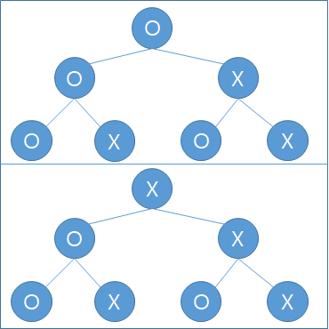
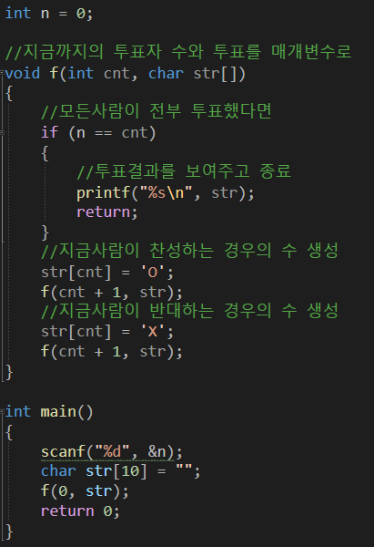

---
id: "P301v2609"
db_id: 816
legacy_id: "P301v2609"
title: "09. [재귀함수 - 9] 재귀함수 튜토리얼3"
platform: "doingcoding"
level: "Mid"
tags:
  - "Lv26 재귀함수"
authors:
  - "root"
supported_languages:
  - "C"
  - "C++"
  - "Golang"
  - "Java"
  - "Python2"
  - "Python3"
time_limit: "1s"
memory_limit: "256MB"
accepted_user_count: 132
has_hint: "false"
archived_at: "2026-06-11"
---

# 09. [재귀함수 - 9] 재귀함수 튜토리얼3

## 1. 문제 설명
재귀함수로 완전탐색을 돌리는 방법을 익혀봅시다.

모든 경우의 수를 전부 따지기 위해서 재귀함수로 구현합니다.

N명이 찬반투표를 한다고 합시다.

1번째사람은 O또는 X를 할 것입니다.

2번째 사람도 역시 O X를, 3번째 사람도 마찬가지 입니다.

(알파벳은 대문자 입니다.)

그림으로 나타내면 이러한 모양이 됩니다.



위 그림을 코드로 작성해봅시다.



문제를 풀며 알고리즘을 익혀봅시다.

찬반투표를 하고 있습니다.

찬성은 O 반대는 X입니다.

투표자 N명이 주어질 때 나올 수 있는 모든 경우의 수를 출력하는 프로그램을 작성해주세요.

예시와 같게 출력하면 됩니다.

---

## 2. 입출력 설명

* **입력:**
투표자 수 N이 입력됩니다.(N은 7 이하)

* **출력:**
나올 수 있는 모든 경우의 수를 출력해주세요.

---

## 3. 예시
### 예시 입력 1
```text
3
```

### 예시 출력 1
```text
OOO
OOX
OXO
OXX
XOO
XOX
XXO
XXX
```

---

## 4. 힌트
(힌트가 없습니다.)
---

