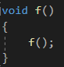
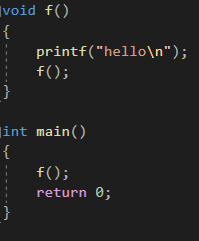
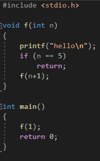
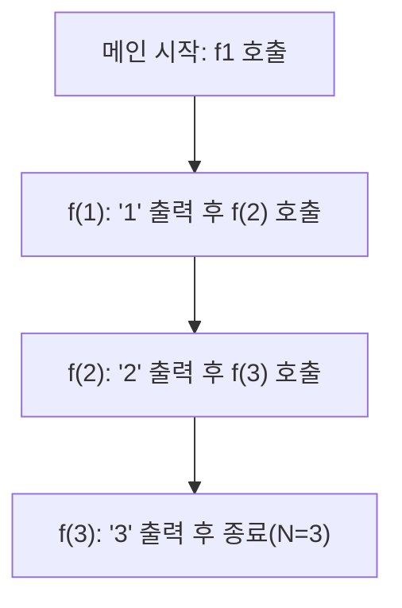

# 01. [재귀1 - 1] 재귀함수 튜토리얼

## 1. 문제 설명
재귀함수란 자기 자신을 부르는 함수 입니다.

함수 f를 만들고, f안에서 f를 불러봅시다.



재귀함수입니다.

그럼 이제 이 함수를 메인에서 불러서 실행해봅시다.

작동유무를 조금 더 쉽게 보기 위해 안에 printf를 넣읍시다.



실행하면 hello가 정말 정말 정말 많이 나옵니다.

hello를 출력하고, 함수실행, hello를 출력하고 함수실행, hello를 출력하고 함수실행... 끝이 없습니다. 무한반복이죠. 무한반복을 막읍시다.

재귀함수는 보통 매개변수를 이용하여 무한반복을 방지합니다.

f를 5번만 실행하게 해봅시다.



메인문에서 f(1)을 실행, hello를 출력합니다. f(1)은 f(2)를 실행하죠.

hello를 출력하고 f(3)을 실행하고... f(5)가 된다면 hello를 출력하고, 5니까 그대로 종료합니다.

1부터 N까지 출력하는 재귀함수를 만들어주세요.

### 📊 재귀 호출 흐름 시각화 (N=3 예시)

재귀 함수가 숫자를 출력하고 다음 함수를 부르는 과정을 시각화하면 다음과 같습니다.




---

## 2. 입출력 설명

* **입력:**
정수 n이 입력된다(n은 1 이상 200 이하)

* **출력:**
1부터 n까지 한 줄에 하나씩 출력한다.

---

## 3. 예시
### 예시 입력 1
```text
10
```

### 예시 출력 1
```text
1
2
3
4
5
6
7
8
9
10
```

---

## 4. 힌트

### 🖥️ 예제 1 추적 (N=10일 때 어떻게 동작하는가?)

재귀함수가 호출될 때마다 어떤 일이 일어나는지 컴퓨터의 시선에서 따라가 봅시다.

| 호출 단계 | 현재 행동 | 다음 행동 | 출력 결과 |
| :--- | :--- | :--- | :--- |
| **f(1)** | `1`을 출력합니다. | `f(2)`를 호출합니다. | 1 |
| **f(2)** | `2`을 출력합니다. | `f(3)`를 호출합니다. | 2 |
| **...** | ... | ... | ... |
| **f(9)** | `9`를 출력합니다. | `f(10)`를 호출합니다. | 9 |
| **f(10)** | `10`을 출력합니다. | (N과 같으므로) 종료합니다. | 10 |

### 💡 힌트 1 (방향) — 무엇을 먼저 생각해야 하나?
재귀함수가 무한히 반복되지 않으려면 **"어느 시점에서 멈출지(Base Case)"**를 결정해야 합니다. N까지 출력해야 한다면, 현재 숫자가 N보다 커졌을 때 멈춰야 할까요, 아니면 N과 같을 때 멈춰야 할까요?

### 💡 힌트 2 (전략) — 어떤 방식으로 접근하나?
1부터 N까지 출력하려면, 현재 숫자 `n`을 출력한 뒤에 **`n+1`을 매개변수로 넘기며** 자기 자신을 다시 호출하는 전략을 사용해 보세요.

### 💡 힌트 3 (구현 방향) — 코드로 어떻게 옮기나?
함수 안에서 현재 값을 출력하고, 아직 목표값에 도달하지 않았다면 다음 단계로 나아가는 구조를 생각해보세요.

```python
# 의사코드(Pseudocode) 예시
함수 출력하기(현재값, 목표값):
    현재값 출력
    만약 현재값 < 목표값:
        출력하기(현재값 + 1, 목표값)
```

---


