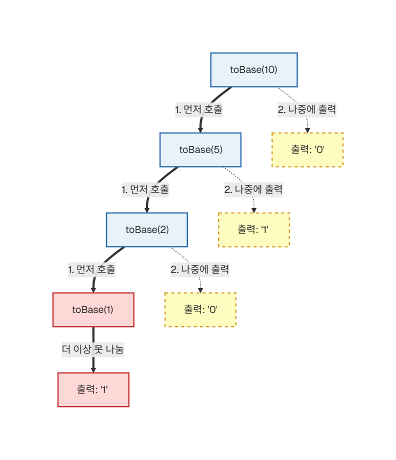
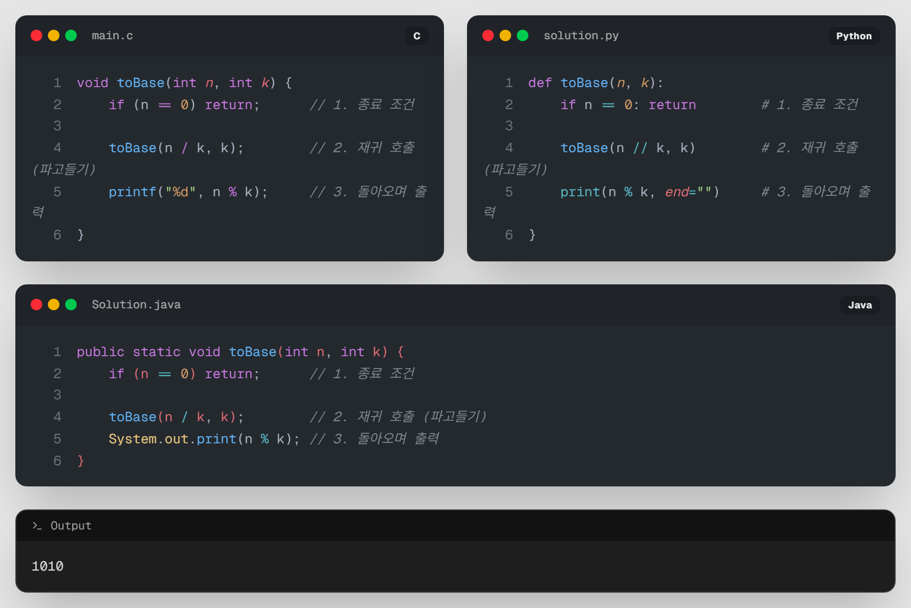

# 05. [재귀1 - 5] 10진수를 N진수로 변환하기

## 1. 문제 설명

10진수를 2진수로 바꿔봅시다.
2진수는 오직 `0`과 `1`로만 이루어져 있기때문에, 2로 나눈 나머지들로만 구성됩니다.

```
  2 )  10
     -----
  2 )   5  ··· 0   ↑
     -----         │ 
  2 )   2  ··· 1   │ 거꾸로
     -----         │ 읽어 올라갑니다
  2 )   1  ··· 0   │ 
     -----         │
        0  ··· 1   │
```
---
### ① 진법 변환의 원리
어떤 수 $n$을 $k$진수로 바꾸는 방법은 다음과 같습니다.
1. $n$을 $k$로 나눈 **나머지**를 구합니다. (이것이 해당 자리의 숫자가 됩니다.)
2. $n$을 $k$로 나눈 **몫**을 가지고 다시 1번 과정을 반복합니다.
3. 몫이 0이 되면 멈춥니다.

### ② 출력의 순서
이번에는 직접 재귀함수에 적용해봅시다.
이 때, **나머지가 0이 되면 멈춘다**가 종료 조건이 되겠죠?


내가 입력한 숫자를 `n`,  바꾸고자 하는 진수를 `k`라 하겠습니다.

(`n=10`,`k=2`라 가정합니다.)


값이 나오지만, 반대로 뒤집혀서 출력됩니다. 대체 왜 일까요?

---

지금의 재귀함수는 **10 (0) -> 5 (1) -> 2 (0) -> 1 (1)** 과 같이 나머지를 바로 출력합니다.

하지만 나머지를 역순으로 읽어야 하는 진법계산은, **마지막에 구한 나머지부터 출력**되는 구조입니다.





`return`은 재귀 함수가 완전히 종료된 것이 아니라, **자신을 호출한 함수로 돌아가는 것**입니다. 이 '돌아가는 경로'에서 출력문이 실행됩니다.  



---

## 2. 입출력 설명

* **입력:**
10진수 정수 $n$과 변환할 진법 $k$가 공백을 두고 입력됩니다. ($0 \le n \le 10,000$, $2 \le k \le 9$)

* **출력:**
$n$을 $k$진수로 변환한 결과를 출력합니다.

---

## 3. 예시

### 예시 입력 1
```text
10 2
```

### 예시 출력 1
```text
1010
```

### 예시 입력 2
```text
25 8
```

### 예시 출력 2
```text
31
```

---

## 4. 힌트
### `n = 0` 입력 처리
`toBase(0, k)`는 조건 `n == 0`에서 즉시 `return` → **화면에 아무것도 출력되지 않습니다.**  

이 경우에는 어떻게 해야 할까요? 


---

