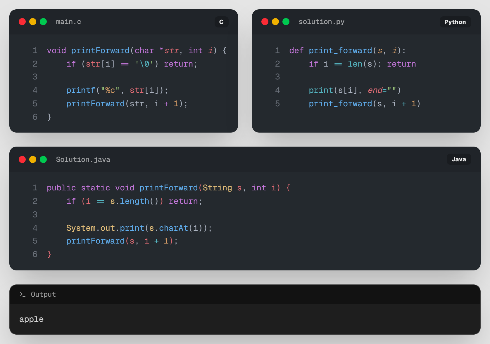

# 06. [재귀1 - 6] 문자열 거꾸로 출력하기

## 1. 문제 설명
이번에는 입력받은 문자열을 재귀를 이용해 거꾸로 출력해 봅시다.

기존에 문자열을 정방향으로 출력하려면, 아래와 같이 함수를 만들면 됩니다.



현재는 함수가 호출되자마자 출력을 해버리기 때문에, 문자열을 거꾸로 출력하려면 재귀함수를 호출하고 **맨 마지막에** 출력을 해야 합니다.

---

## 2. 입출력 설명

* **입력:**
공백이 없는 문자열이 입력됩니다. (최대 길이 100)

* **출력:**
문자열을 거꾸로 뒤집어서 출력합니다.

---

## 3. 예시

### 예시 입력 1
```text
apple
```

### 예시 출력 1
```text
elppa
```

---

## 4. 힌트
문자열의 끝을 나타내는 문자인 `'\0'` (NULL 문자)를 탈출 조건으로 사용해 보세요.

---

