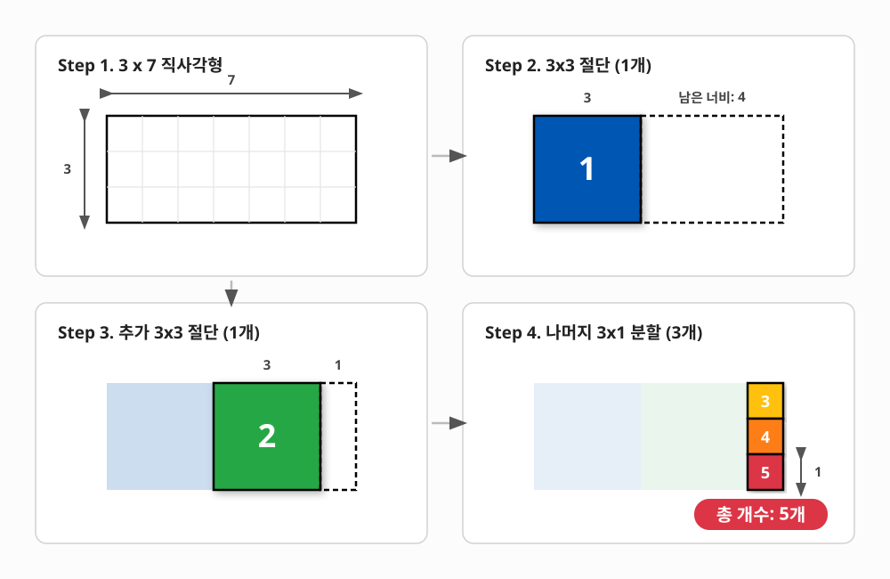

# 10. [재귀1 - 10] 직사각형

## 1. 문제 설명
정훈이는 N \* M 크기의 격자가 그려진 직사각형 종이들을 여러 개의 정사각형으로 자르기로 했습니다. 먼저 한 번의 직선 절단을 통해 (가로 또는 세로로 평행하게) 잘라낼 수 있는 가장 큰 정사각형을 잘라내어 따로 챙깁니다. 그 후, 남은 직사각형 부분에 대해서도 동일한 과정을 반복합니다. 정훈이는 남은 부분이 정사각형이 될 때까지 이 과정을 계속해서 반복합니다.

예를 들어 너비가 3,  높이가 7인 직사각형이 있다고 가정합니다.



위와 같은 과정을 통해 총 5개의 정사각형을 얻을 수 있습니다.

N과 M(1<=N, M, <=10000)의 값이 주어지면 정훈이가 위와 같은 방식으로 직사각형을 잘랐을 때 총 몇 개의 정사각형을 얻는 지 계산해 주세요.

---

## 2. 입출력 설명

* **입력:**
한 줄에 N과 M이 공백으로 구분하여 입력됩니다. (1<=N, M, <=10000)

* **출력:**
얻을 수 있는 정사각형의 총 개수를 출력해 주세요.

---

## 3. 예시
### 예시 입력 1
```text
3 7
```

### 예시 출력 1
```text
5
```

### 예시 입력 2
```text
9999 9999
```

### 예시 출력 2
```text
1
```

---

## 4. 힌트
(힌트가 없습니다.)
---


