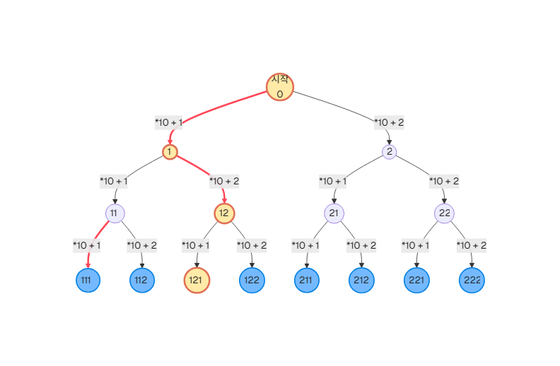
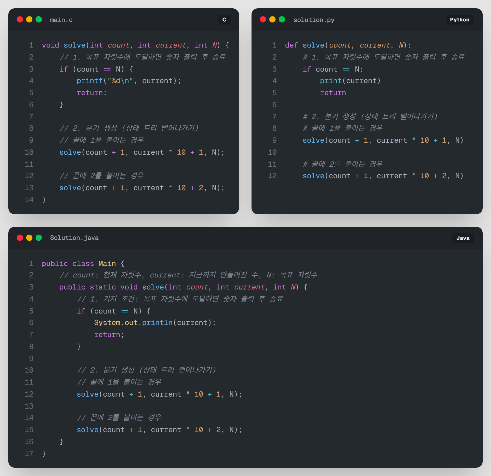

# 04. [재귀2 - 4] 숫자를 붙여 N자리 수 만들기

## 1. 문제 설명
지금까지 우리는 재귀를 이용해 숫자를 더하거나 출력하는 방법을 배웠습니다. 이번에는 재귀를 사용하여 **새로운 숫자를 조합해내는 방법**을 배워보겠습니다.

우리가 숫자를 읽을 때, `1` 다음에 `2`가 오면 `12`가 됩니다. 이것을 수학적으로 표현하면 `(기존 숫자 * 10) + 새로운 숫자`가 됩니다. 

이 원리를 이용하여, 숫자 `1`과 `2`만을 사용하여 만들 수 있는 모든 **$N$자리의 숫자**를 출력하는 프로그램을 작성해 봅시다.

### ① 상태 트리 (State Space Tree) 이해하기
매 순간 우리는 `1`을 붙일지, `2`를 붙일지 선택할 수 있습니다. 
* 1단계: `1`, `2`
* 2단계: `11`, `12`, `21`, `22`
* 3단계: `111`, `112`, `121`, `122`, `211`, `212`, `221`, `222`



이렇게 선택의 가지가 뻗어나가는 구조를 이해하는 것이 백트래킹(응용 재귀)의 시작입니다.

---

## 2. 입출력 설명

* **입력:**
만들고자 하는 숫자의 자릿수 $N$이 입력됩니다. ($1 \le N \le 10$)

* **출력:**
숫자 `1`과 `2`로만 구성된 모든 $N$자리의 숫자를 사전순으로 출력합니다.

---

## 3. 예시

### 예시 입력 1
```text
2
```

### 예시 출력 1
```text
11
12
21
22
```

---

## 4. 힌트


* 재귀 함수의 매개변수로 `(현재까지 만들어진 숫자)`와 `(현재 몇 번째 자리인지)`를 넘겨보세요.
* `solve(count + 1, current * 10 + 1)` 과 같은 형태로 자릿수를 늘릴 수 있습니다.
* N이 3일 때, 1만 붙여서 나오는 과정은 아래 코드처럼 작성할 수 있습니다.


---

