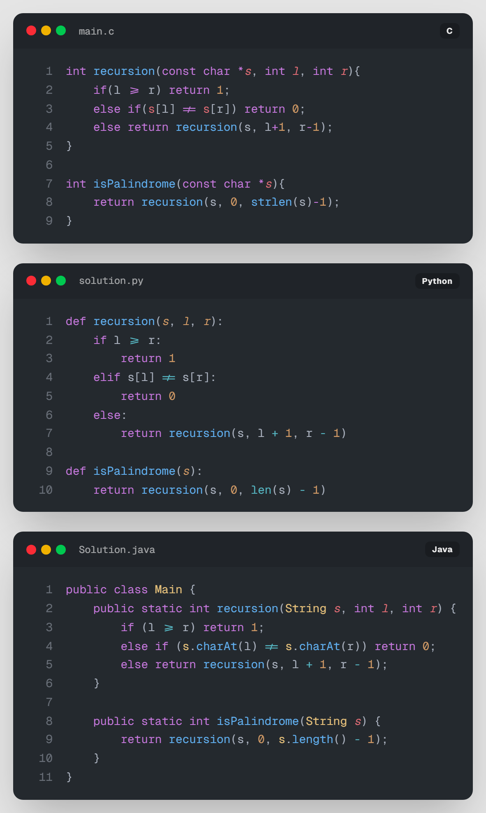

# 05. [재귀2 - 5] 재귀의 귀재 (호출 횟수 측정)

## 1. 문제 설명
재귀 함수를 공부하던 정우는 팰린드롬(Palindrome)을 판별하는 함수에 흥미를 느끼게 되었습니다. 팰린드롬이란 앞에서부터 읽었을 때와 뒤에서부터 읽었을 때가 같은 문자열을 말합니다.

아래는 정우가 작성한 팰린드롬 판별 함수입니다.



정우는 문득 **"이 함수를 실행할 때 `recursion` 함수가 총 몇 번 호출될까?"**라는 궁금증이 생겼습니다. 여러분이 정우를 도와 팰린드롬 여부와 함께 함수의 호출 횟수를 출력하는 프로그램을 작성해 주세요.

---

## 2. 입출력 설명

* **입력:**
첫째 줄에 테스트 케이스의 개수 $T$가 주어집니다. ($1 \le T \le 1,000$)
둘째 줄부터 $T$개의 줄에 걸쳐 알파벳 대문자로 구성된 문자열 $S$가 주어집니다. ($1 \le |S| \le 1,000$)

* **출력:**
각 테스트 케이스마다 팰린드롬 여부(맞으면 1, 아니면 0)와 `recursion` 함수의 호출 횟수를 공백으로 구분하여 출력합니다.

---

## 3. 예시

### 예시 입력 1
```text
5
AAA
ABBA
ABCA
PALINDROME
LEVEL
```

### 예시 출력 1
```text
1 2
1 3
0 2
0 1
1 3
```

---

## 4. 힌트
전역 변수를 하나 선언하고, `recursion` 함수가 시작될 때마다 그 변수의 값을 1씩 증가시켜 보세요. 각 테스트 케이스를 처리하기 전에 전역 변수를 다시 0으로 초기화하는 것을 잊지 마세요!

---

