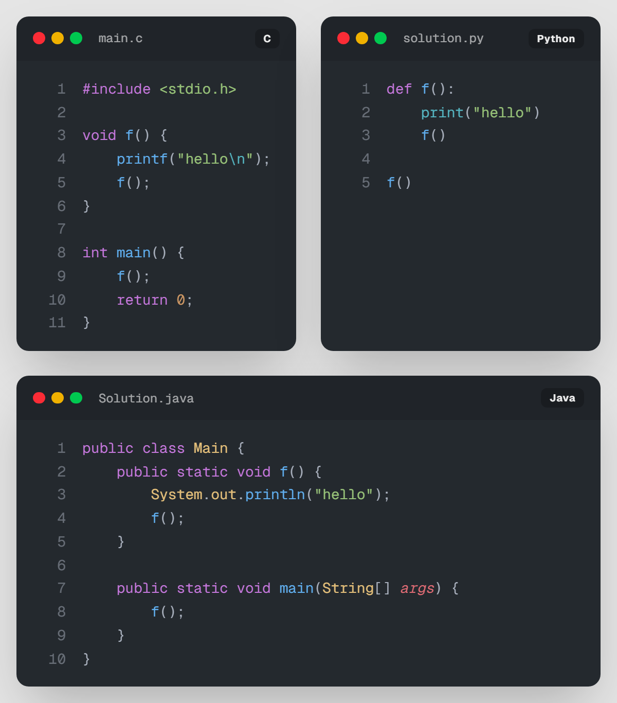
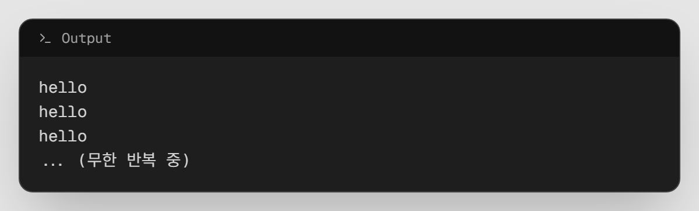
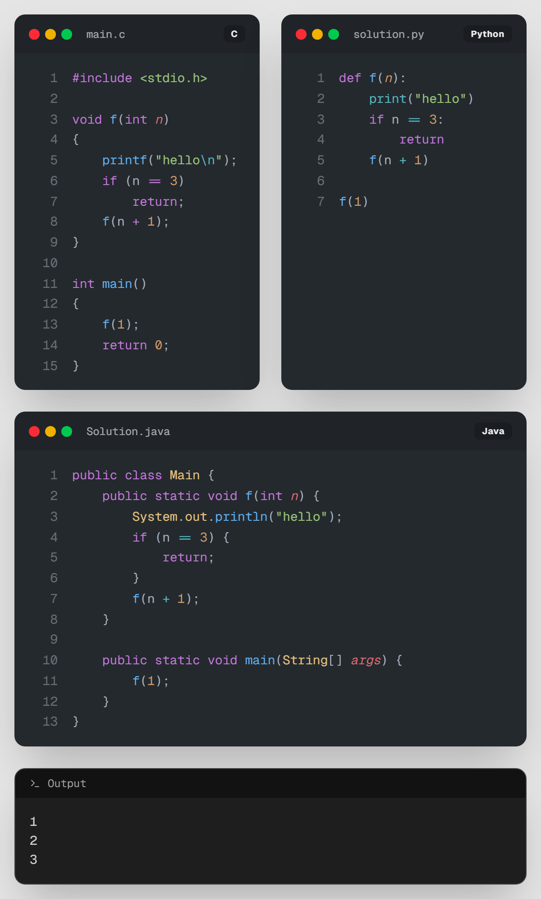
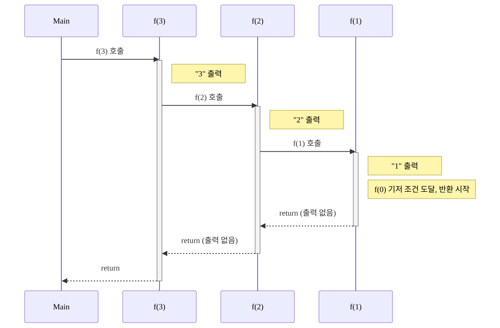
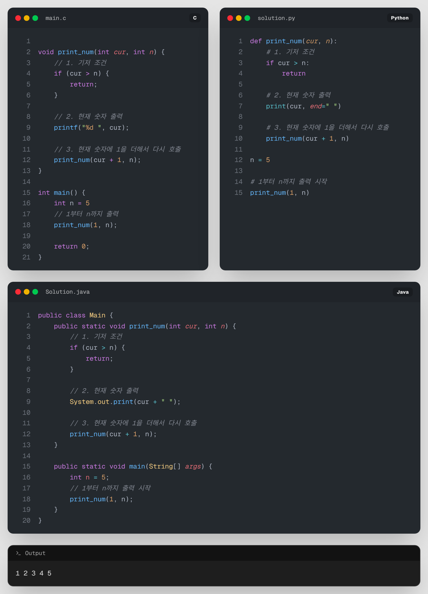

# 01. [재귀1 - 1] 재귀함수 튜토리얼

## 1. 문제 설명
지금까지 함수는 입력값을 받아서 계산을 하거나 값을 반환했습니다.

이번엔 함수가 **자기 자신을 부르는** 새로운 함수에 대해 배워보겠습니다.



*※  작동유무를 조금 더 쉽게 보기 위해 안에 출력문(`print/printf`)을 넣읍시다.*

그럼 이제 이 함수를 메인에서 불러서 실행해봅시다.



실행하면 hello가 정말 정말 정말 많이 나옵니다.

마치 `while(true)`를 짠 것과 같습니다. 무한 반복인 것이죠.

그렇다면, **내가 원하는 횟수나 조건만큼만 호출**하려면 어떻게 해야할까요?

---


재귀함수는 보통 매개변수를 이용하여 무한반복을 방지합니다.

마치 while에서 반복이 성립하면 반복문을 빠져나오듯이, 재귀함수는 재귀를 멈추는 조건을 정해야만 합니다.

*이 때 반복을 멈추는 조건을 **종료조건**이라고 합니다.*

재귀함수 `f()`를 3번만 실행하게 해봅시다.



n이 1부터 종료조건인 3까지 실행시켰습니다.

마치 계단처럼, 재귀함수를 호출할 때마다 매개변수 `n` 이 1씩 증가하고 있습니다.



끝까지 도달했으면, `return`으로 함수를 종료시킵니다.

---

만약 3이 아닌, 내가 원하는 숫자까지 출력하려면 어떻게 해야할까요?

현재 출력하는 숫자가 도달할 때까지 계속 증가해야 하므로, **매개변수**를 하나 더 추가하면 됩니다.
* 마치 `for`문에서 현재 숫자를 증가 시키듯이 말입니다.

현재 숫자를 `cur`, 목표 숫자를 `n`이라고 한다면 



호출될 때 마다 cur을 출력하고, cur이 n보다 작으면 cur+1을 매개변수로 넣고 재귀를 호출합니다.

이제는 목표숫자(`n`)의 값만 바꾸면, 내가 원하는 만큼 출력하는 함수가 되었습니다.

이를 이용하여 문제를 풀어봅시다.

---

## 2. 입출력 설명

* **입력:**
정수 n이 입력됩니다. ($1 \leq n \leq 100$)

* **출력:**
1부터 n까지 한 줄에 하나씩 출력합니다.

---

## 3. 예시
### 예시 입력 1
```text
10
```

### 예시 출력 1
```text
1
2
3
4
5
6
7
8
9
10
```

---

## 4. 힌트
(힌트가 없습니다.)
---


