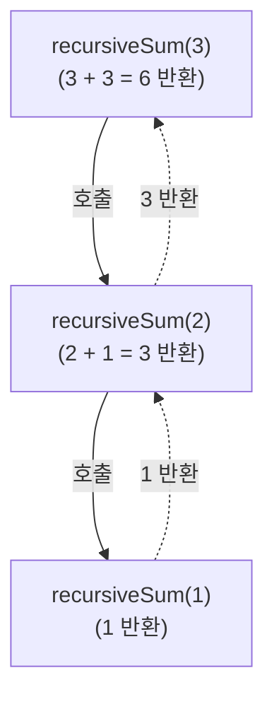

# 02. [재귀1 - 2] 1부터 n까지 합 구하기

## 1. 문제 설명
정수 n이 입력으로 들어오면 1부터 n까지의 합을 구해주세요.

### ① 호출과 반환 흐름 (N = 3일 때)
재귀 함수가 값을 누적하여 반환하는 흐름은 아래 그림과 같이 "호출 단계"를 거쳐 끝까지 도달한 뒤, "반환 단계"를 거쳐 거꾸로 결과가 누적되며 올라갑니다.



### 🖥️ 예제 1 추적 (N = 3일 때)
* **1단계 (recursiveSum(3) 호출)**: $n=3$이므로, $3 + \text{recursiveSum}(2)$를 계산하기 위해 $\text{recursiveSum}(2)$의 결과를 대기합니다.
* **2단계 (recursiveSum(2) 호출)**: $n=2$이므로, $2 + \text{recursiveSum}(1)$을 계산하기 위해 $\text{recursiveSum}(1)$의 결과를 대기합니다.
* **3단계 (recursiveSum(1) 호출)**: 종료 조건인 $n=1$에 도달하여 즉시 `1`을 반환합니다.
* **4단계 (recursiveSum(2) 계산 및 반환)**: 기다렸던 $\text{recursiveSum}(1)$의 결과 `1`을 받아, 자신의 $n=2$와 더해 `3`을 반환합니다.
* **5단계 (recursiveSum(3) 계산 및 최종 반환)**: 기다렸던 $\text{recursiveSum}(2)$의 결과 `3`을 받아, 자신의 $n=3$와 더해 최종 `6`을 반환합니다.

---

## 2. 입출력 설명

* **입력:**
입력으로 자연수 n이 입력됩니다.($1 \le n \le 100$)

* **출력:**
1부터 n까지의 합을 출력합니다.

---

## 3. 예시
### 예시 입력 1
```text
100
```

### 예시 출력 1
```text
5050
```

---

## 4. 힌트
### 💡 팁
return 키워드 뒤에 덧셈 연산과 함께 재귀 호출을 배치하면, 반환값이 자동으로 호출 스택을 따라 누적됩니다.
예를 들어, 1부터 n까지의 합은 "n + (1부터 n-1까지의 합)"으로 쪼개어 생각할 수 있습니다.
`return n + recursiveSum(n - 1);`
---


