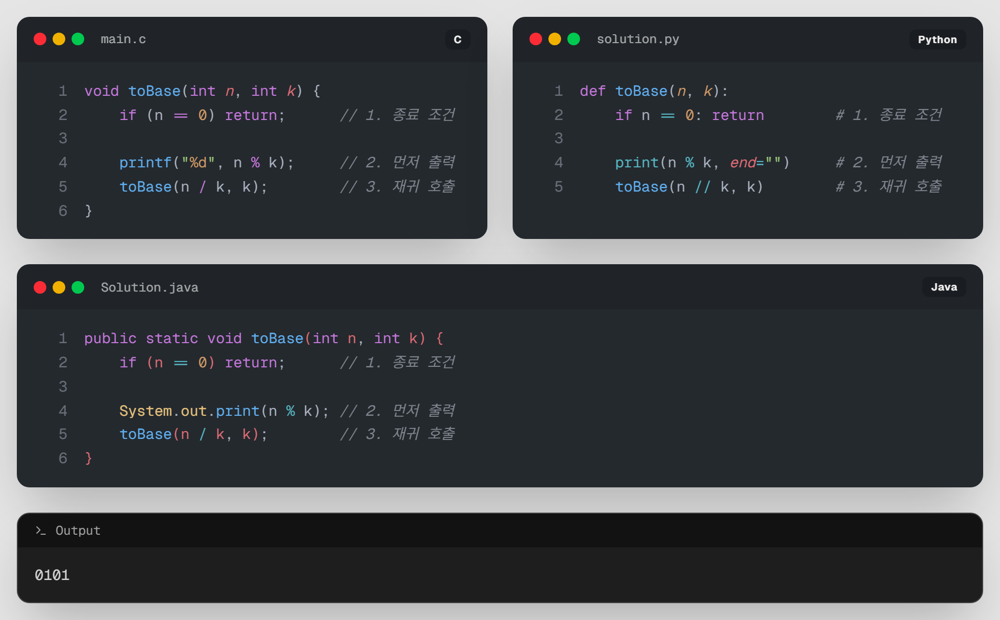

# 04. [재귀1 - 4] 2진수 변환

## 1. 문제 설명

10진수를 2진수로 바꿔봅시다.
2진수는 오직 `0`과 `1`로만 이루어져 있기 때문에, 2로 나눈 나머지들로만 구성됩니다.

```text
  2 )  10
     -----
  2 )   5  ··· 0   ↑
     -----         │ 
  2 )   2  ··· 1   │ 거꾸로
     -----         │ 읽어 올라갑니다
  2 )   1  ··· 0   │ 
     -----         │
        0  ··· 1   │
```
---
### ① 2진수 변환의 원리
어떤 수 $n$을 2진수로 바꾸는 방법은 다음과 같습니다.
1. $n$을 2로 나눈 **나머지**를 구합니다. (이것이 해당 자리의 숫자가 됩니다: $n \% 2$)
2. $n$을 2로 나눈 **몫**을 가지고 다시 1번 과정을 반복합니다.
3. 몫이 0이 되면 멈춥니다.

### ② 출력의 순서
이번에는 직접 재귀함수에 적용해봅시다.
이 때, **몫이 0이 되면 멈춘다**가 종료 조건(Base Case)이 되겠죠?

내가 입력한 숫자를 `n`이라 하겠습니다.

(`n=10`이라 가정합니다.)



위 그림처럼 재귀를 돌리면 값이 나오지만, 반대로 뒤집혀서 `0101`로 출력됩니다. 대체 왜 일까요?

---

지금의 재귀함수는 **10 (0) -> 5 (1) -> 2 (0) -> 1 (1)** 과 같이 나머지를 바로 출력합니다.

하지만 나머지를 역순으로 읽어야 하는 진법계산은, **마지막에 구한 나머지부터 출력**되어야 합니다.



`return`은 재귀 함수가 완전히 종료된 것이 아니라, **자신을 호출한 함수로 돌아가는 것**입니다. 이 '돌아가는 경로'에서 출력문이 실행되도록 배치해야 합니다.  


---

## 2. 입출력 설명

* **입력:**
10진수 정수 n이 입력됩니다. ($0 \le n \le 2,000,000,000$)

* **출력:**
2진수로 변환해서 출력합니다.

---

## 3. 예시
### 예시 입력 1
```text
7
```

### 예시 출력 1
```text
111
```

---

## 4. 힌트
### 💡 팁 — `n = 0` 입력 처리
`toBinary(0)`은 조건 `n == 0`에서 즉시 `return`하면 **화면에 아무것도 출력되지 않습니다.**
하지만 10진수 `0`의 2진수 변환 결과는 `0`이어야 합니다.

따라서 메인 함수나 호출부에서 `n이 0일 때`는 예외적으로 `0`을 바로 출력하도록 예외 처리를 해주어야 합니다.
---
