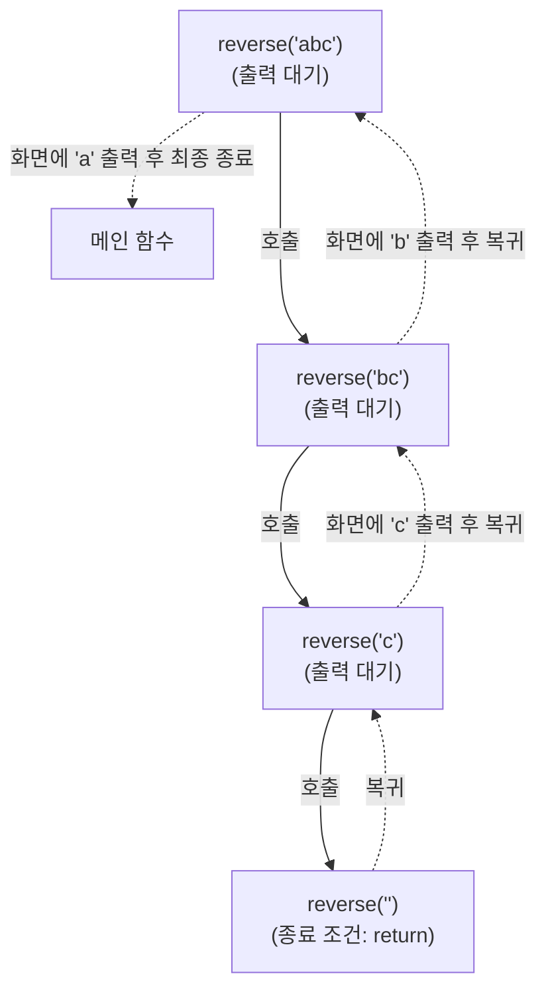

# 05. [재귀1 - 5] 문자열 거꾸로 출력하기

## 1. 문제 설명
이번에는 입력받은 문자열을 재귀를 이용해 거꾸로 출력해 봅시다.

기존에 문자열을 정방향으로 출력하려면, 아래와 같이 함수를 만들면 됩니다.


현재는 함수가 호출되자마자 출력을 해버리기 때문에, 문자열을 거꾸로 출력하려면 재귀함수를 호출하고 **맨 마지막에** 출력을 해야 합니다.

### ① 실행 흐름 시각화 (입력: "abc")
재귀를 먼저 완전히 호출한 뒤, 돌아오면서 출력을 처리하므로 아래 그림과 같이 맨 뒷글자부터 하나씩 화면에 나타납니다.



### 🖥️ 예제 1 추적 (입력: "abc")
* **1단계 (reverse("abc") 호출)**: 첫 문자 `a`를 뒤로 미루고, 다음 문자열인 `reverse("bc")`를 호출하여 실행이 끝날 때까지 대기합니다.
* **2단계 (reverse("bc") 호출)**: `b`를 뒤로 미루고, 다음 문자열인 `reverse("c")`를 호출하여 실행이 끝날 때까지 대기합니다.
* **3단계 (reverse("c") 호출)**: `c`를 뒤로 미루고, 다음 문자열인 `reverse("")` (빈 문자열)을 호출하여 대기합니다.
* **4단계 (reverse("") 호출)**: 종료 조건인 문자열의 끝(`'\0'` 혹은 빈 문자)에 도달하여 바로 `return`으로 직전 함수로 돌아갑니다.
* **5단계 (reverse("c") 출력)**: 기다림이 끝난 `reverse("c")`가 재개되어, 미뤄두었던 문자 `c`를 출력하고 종료됩니다. (출력: `c`)
* **6단계 (reverse("bc") 출력)**: 직전 호출로 복귀하여, 미뤄두었던 문자 `b`를 출력하고 종료됩니다. (출력: `cb`)
* **7단계 (reverse("abc") 출력)**: 최초 호출로 복귀하여, 미뤄두었던 문자 `a`를 출력하고 최종 완료됩니다. (출력: `cba`)

---

## 2. 입출력 설명

* **입력:**
공백이 없는 문자열이 입력됩니다. (최대 길이 100)

* **출력:**
문자열을 거꾸로 뒤집어서 출력합니다.

---

## 3. 예시

### 예시 입력 1
```text
apple
```

### 예시 출력 1
```text
elppa
```

---

## 4. 힌트
문자열의 끝을 나타내는 문자인 `'\0'` (NULL 문자)를 탈출 조건으로 사용해 보세요.

---

