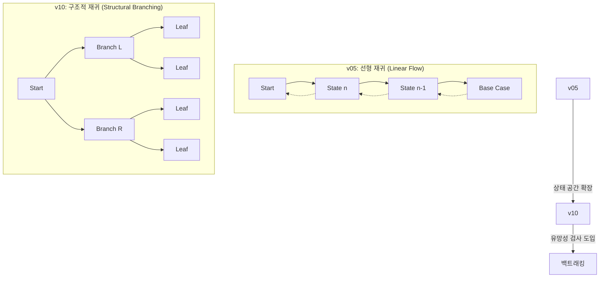
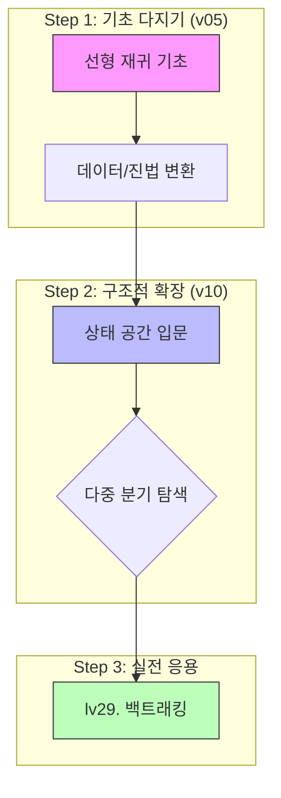

이 단원은 **재귀(Recursion)를 기초부터 심화까지 단계별로 학습할 수 있도록 구성되어 있습니다.
단순히 함수가 자신을 호출하는 것을 넘어, 실행 흐름의 중첩(Stack)과 상태 공간의 탐색(Branching)을 익히는 것이 목표입니다.

> **파일 명명 규칙**: `ALLvXXXXX_{db_id}` (수업) / `SALLvXXXXX_{db_id}` (숙제)  
> **`legacy_id`**: 이전 버전 파일명 또는 외부 출처 (`bj_*`: 백준, `[A-Z]+\d*[v]\d+`: 기존 시스템)

### 📋 범례 (Legend)
- **ID**: `v05` (단일 호출/선형), `v10` (다중 호출/구조적)
- **db_id**: 웹 DB 고유 번호 (**LOCAL**은 업로드 예정 항목)
- **Status**: `[ ]` 대기, `[/]` 작성 중, `[x]` 검증 완료
- **핵심 포인트**: 해당 문제에서 반드시 익혀야 할 기술적 목표

---

## 🚀 재귀 구조의 진화: Linear에서 Structural로

재귀는 문제의 상태를 어떻게 분할하느냐에 따라 두 가지 핵심 단계로 나뉩니다.

---

## 1. [v05 시리즈] 선형 재귀 (Linear Recursion)

v05 시리즈는 재귀의 가장 기본적인 형태인 **선형 재귀(Linear Recursion)**를 다룹니다.
스택의 원리, 매개변수 전달, 반환값 누적의 완벽한 이해를 목표로 합니다.

| **Set** | **구분** | **주제 (Topic)** | **문제 제목 (파일명)** | **id** | **db_id** | **Status** |
| :---: | :--- | :--- | :--- | :--- | :--- | :---: |
| **01** | 수업 | **원리** | [재귀함수 튜토리얼](02_workspace/ALLv05001_519.md) | `ALLv05001` | **519** | `[x]` |
| | 숙제 | | [1부터 n까지 역순 출력](02_workspace/SALLv05001_520.md) | `SALLv05001` | **520** | `[x]` |
| **02** | 수업 | **조건** | [두 수 사이 홀수](02_workspace/ALLv05002_521.md) | `ALLv05002` | **521** | `[x]` |
| | 숙제 | | [두 수 사이 짝수](02_workspace/SALLv05002_721.md) | `SALLv05002` | **721** | `[x]` |
| **03** | 수업 | **합산** | [1부터 n까지 합](02_workspace/ALLv05003_522.md) | `ALLv05003` | **522** | `[x]` |
| | 숙제 | | [팩토리얼 계산](02_workspace/SALLv05003_523.md) | `SALLv05003` | **523** | `[x]` |
| **04** | 수업 | **제어** | [우박수 (3n+1)](02_workspace/ALLv05004_526.md) | `ALLv05004` | **526** | `[x]` |
| | 숙제 | | [우박수 역순 추적](02_workspace/SALLv05004_527.md) | `SALLv05004` | **527** | `[x]` |
| **05** | 수업 | **변환** | [N진수 변환](02_workspace/ALLv05005_LOCAL.md) | `ALLv05005` | **LOCAL** | `[x]` |
| | 숙제 | | [2진수 변환](02_workspace/SALLv05005_525.md) | `SALLv05005` | **525** | `[x]` |
| **06** | 수업 | **문자열** | [문자열 거꾸로](02_workspace/ALLv05006_LOCAL.md) | `ALLv05006` | **LOCAL** | `[x]` |
| | 숙제 | | [재귀적 문자열 포장](02_workspace/SALLv05006_LOCAL.md) | `SALLv05006` | **LOCAL** | `[x]` |

---

## 2. [v10 시리즈] 구조적 재귀 (Structural Branching)

v10 시리즈는 한 함수에서 **자신을 여러 번 호출**하는 구조를 통해 상태 공간 탐색(State Space Search)에 입문합니다.

| **Set** | **구분** | **주제 (Topic)** | **문제 제목 (파일명)** | **id** | **db_id** | **Status** |
| :---: | :--- | :--- | :--- | :--- | :--- | :---: |
| **01** | 수업 | **시각화** | [재귀 챗봇](02_workspace/ALLv10001_LOCAL.md) | `ALLv10001` | **LOCAL** | `[x]` |
| | 숙제 | | [마트료시카](02_workspace/SALLv10001_LOCAL.md) | `SALLv10001` | **LOCAL** | `[x]` |
| **02** | 수업 | **분기** | [재귀함수 튜토리얼2](02_workspace/ALLv10002_524.md) | `ALLv10002` | **524** | `[x]` |
| | 숙제 | | [트리보나치 수열](02_workspace/SALLv10002_LOCAL.md) | `SALLv10002` | **LOCAL** | `[x]` |
| **03** | 수업 | **점화식** | [포비나치 수열](02_workspace/ALLv10003_1499.md) | `ALLv10003` | **1499** | `[x]` |
| | 숙제 | | [가중치 피보나치 수열](02_workspace/SALLv10003_LOCAL.md) | `SALLv10003` | **LOCAL** | `[x]` |
| **04** | 수업 | **상태** | [N자리 수 만들기](02_workspace/ALLv10004_LOCAL.md) | `ALLv10004` | **LOCAL** | `[x]` |
| | 숙제 | | [숫자 만들기](02_workspace/SALLv10004_1501.md) | `SALLv10004` | **1501** | `[x]` |
| **05** | 수업 | **효율성** | [재귀의 귀재 (호출 측정)](02_workspace/ALLv10005_LOCAL.md) | `ALLv10005` | **LOCAL** | `[x]` |
| | 숙제 | | [재귀의 함정 (카운트)](02_workspace/SALLv10005_LOCAL.md) | `SALLv10005` | **LOCAL** | `[x]` |

---

## 3. 학습 경로 및 연계 지도

