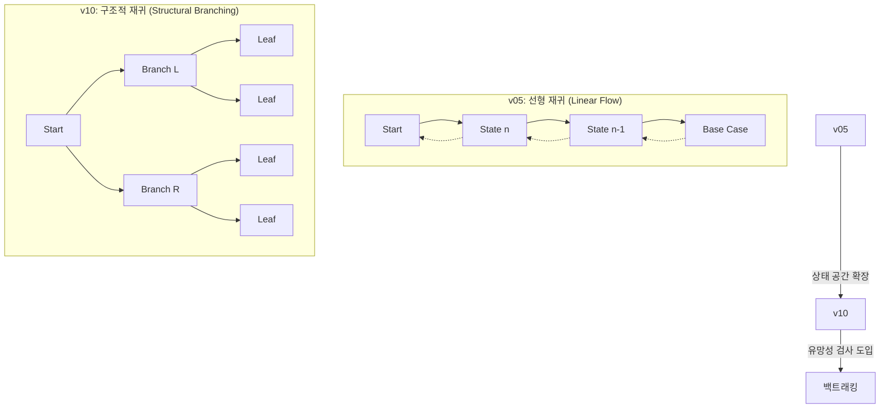
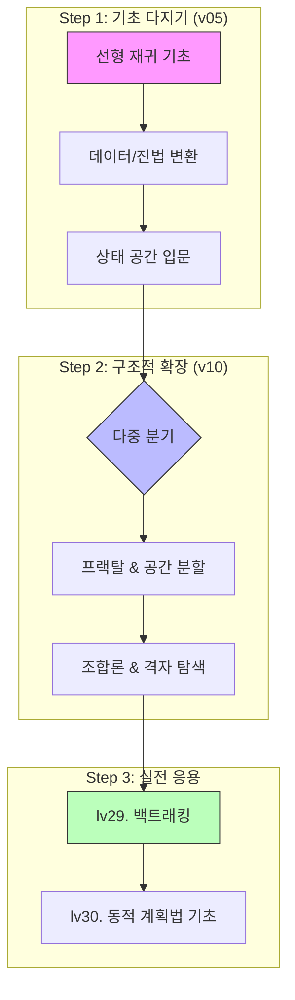

이 단원은 **재귀(Recursion)를 기초부터 심화까지 단계별로 학습할 수 있도록 구성되어 있습니다.
단순히 함수가 자신을 호출하는 것을 넘어, 실행 흐름의 중첩(Stack)과 상태 공간의 탐색(Branching)을 익히는 것이 목표입니다.

> **파일 명명 규칙**: `ALLvXXXXX_{db_id}` (수업) / `SALLvXXXXX_{db_id}` (숙제)  
> **`legacy_id`**: 이전 버전 파일명 또는 외부 출처 (`bj_*`: 백준, `[A-Z]+\d*[v]\d+`: 기존 시스템)

### 📋 범례 (Legend)
- **ID**: `v05` (단일 호출/선형), `v10` (다중 호출/구조적)
- **db_id**: 웹 DB 고유 번호 (**LOCAL**은 업로드 예정 항목)
- **Status**: `[ ]` 대기, `[/]` 작성 중, `[x]` 검증 완료
- **핵심 포인트**: 해당 문제에서 반드시 익혀야 할 기술적 목표

---

## 🚀 재귀 구조의 진화: Linear에서 Structural로

재귀는 문제의 상태를 어떻게 분할하느냐에 따라 두 가지 핵심 단계로 나뉩니다.

---

## 1. [v05 시리즈] 재귀의 기초 — 선형 재귀

v05 시리즈는 재귀의 가장 기본적인 형태인 **선형 재귀(Linear Recursion)**를 다룹니다.
반복문(`for`, `while`)을 재귀로 변환하는 연습부터 시작하여, 함수 호출 전후의 실행 시점 차이를 이해합니다.

| **Set** | **구분** | **주제 (Topic)** | **문제 제목 (파일명)**                                       | **id**       | **db_id** | **Legacy/Source** | **Status** | **핵심 포인트**      |
| :-----: | :----- | :------------- | :---------------------------------------------------- | :----------- | :-------- | :---------------- | :--------: | :-------------- |
| **01**  | 수업     | **재귀의 원리**     | [재귀함수 튜토리얼](02_workspace/ALLv05001_519.md)            | `ALLv05001`  | **519**   | `ALLv05001`       |   `[ ]`    | 탈출 조건과 스택       |
|         | 숙제     |                | [1부터 n까지 역순으로 출력하기](02_workspace/SALLv05001_520.md)   | `SALLv05001` | **520**   | `SP301v2601`      |   `[ ]`    | 호출 이후의 실행       |
| **02**  | 수업     | **조건부 재귀**     | [두 수 사이의 홀수 출력하기](02_workspace/ALLv05002_521.md)      | `ALLv05002`  | **521**   | `P301v2602`       |   `[ ]`    | 매개변수 상태 전달      |
|         | 숙제     |                | [두 수 사이의 짝수 출력하기](02_workspace/SALLv05002_721.md)     | `SALLv05002` | **721**   | `SP301v2602`      |   `[ ]`    | 조건부 재귀 호출       |
| **03**  | 수업     | **시각적 추적**     | [재귀 챗봇](02_workspace/ALLv05003_LOCAL.md)              | `ALLv05003`  | **LOCAL** | `bj_17478`        |   `[ ]`    | 중첩 구조 시각화       |
|         | 숙제     |                | [마트료시카](02_workspace/SALLv05003_LOCAL.md)             | `SALLv05003` | **LOCAL** | _(신규)_            |   `[ ]`    | 깊이에 따른 변화       |
| **04**  | 수업     | **값의 누적**      | [1부터 n까지 합 구하기](02_workspace/ALLv05004_522.md)        | `ALLv05004`  | **522**   | `P301v2603`       |   `[ ]`    | `return`으로 값 누적 |
|         | 숙제     |                | [팩토리얼 계산](02_workspace/SALLv05004_523.md)             | `SALLv05004` | **523**   | `SP301v2603`      |   `[ ]`    | 계승의 재귀적 정의      |
| **05**  | 수업     | **반환값 응용**     | [재귀함수 튜토리얼2](02_workspace/ALLv05005_524.md)           | `ALLv05005`  | **524**   | `ALLv05005`       |   `[ ]`    | 다중 반환값의 조합      |
|         | 숙제     |                | [트리보나치 수열](02_workspace/SALLv05005_LOCAL.md)          | `SALLv05005` | **LOCAL** | _(신규)_            |   `[ ]`    | 3개 항의 합산 구조     |
| **06**  | 수업     | **수열과 점화식**    | [포비나치수열](02_workspace/ALLv05006_1499.md)              | `ALLv05006`  | **1499**  | `P301v2606`       |   `[ ]`    | 점화식의 재귀적 구현     |
|         | 숙제     |                | [가중치 피보나치](02_workspace/SALLv05006_LOCAL.md)          | `SALLv05006` | **LOCAL** | _(신규)_            |   `[ ]`    | 변형된 점화식 적용      |
| **07**  | 수업     | **상태 제어**      | [우박수 (3n+1)](02_workspace/ALLv05007_526.md)           | `ALLv05007`  | **526**   | `P301v2605`       |   `[ ]`    | 가변 분기 점화식       |
|         | 숙제     |                | [우박수 (3n+1)(reverse)](02_workspace/SALLv05007_527.md) | `SALLv05007` | **527**   | `SP301v2605`      |   `[ ]`    | 도달 경로의 역추적      |
| **08**  | 수업     | **복합 규칙**      | [기묘한 수열](02_workspace/ALLv05008_1029.md)              | `ALLv05008`  | **1029**  | `P301v2607`       |   `[ ]`    | 복합 조건 처리        |
|         | 숙제     |                | [계단식 재귀](02_workspace/SALLv05008_LOCAL.md)            | `SALLv05008` | **LOCAL** | _(신규)_            |   `[ ]`    | 단계적 상태 변화       |
| **09**  | 수업     | **출력 패턴**      | [삼각형 출력하기](02_workspace/ALLv05009_529.md)             | `ALLv05009`  | **529**   | `P301v2609`       |   `[ ]`    | 반복 패턴의 재귀화      |
|         | 숙제     |                | [역삼각형 출력하기](02_workspace/SALLv05009_LOCAL.md)         | `SALLv05009` | **LOCAL** | _(신규)_            |   `[ ]`    | 패턴의 반전 구현       |
| **10**  | 수업     | **도형의 재귀**     | [직사각형](02_workspace/ALLv05010_2111.md)                | `ALLv05010`  | **2111**  | `ALLv05004`       |   `[ ]`    | 2D 패턴의 형성       |
|         | 숙제     |                | [정사각형 타일 (GCD)](02_workspace/SALLv05010_LOCAL.md)     | `SALLv05010` | **LOCAL** | _(신규)_            |   `[ ]`    | 2D 패턴 + GCD 응용  |
| **11**  | 수업     | **진법 변환**      | [N진수 변환](02_workspace/ALLv05011_LOCAL.md)             | `ALLv05011`  | **LOCAL** | _(신규)_            |   `[ ]`    | 나머지 역순 출력       |
|         | 숙제     |                | [2진수 변환](02_workspace/SALLv05011_525.md)              | `SALLv05011` | **525**   | `SP301v2604`      |   `[ ]`    | 진법 변환의 원리 이해    |
| **12**  | 수업     | **문자열 처리**     | [문자열 거꾸로](02_workspace/ALLv05012_LOCAL.md)            | `ALLv05012`  | **LOCAL** | _(신규)_            |   `[ ]`    | 호출 전/후 실행 순서    |
|         | 숙제     |                | [재귀적 문자열 포장](02_workspace/SALLv05012_LOCAL.md)        | `SALLv05012` | **LOCAL** | _(신규)_            |   `[ ]`    | 문자열의 재귀적 결합     |
| **13**  | 수업     | **진법 변환 심화**   | [8진수 변환](02_workspace/ALLv05013_LOCAL.md)             | `ALLv05013`  | **LOCAL** | _(신규)_            |   `[ ]`    | 진법 변환 일반화       |
|         | 숙제     |                | [9진수 변환](02_workspace/SALLv05013_2112.md)             | `SALLv05013` | **2112**  | `SALLv05001`      |   `[ ]`    | 다양한 진법 적용       |
| **14**  | 수업     | **상태 공간 도입**   | [N자리 수 만들기](02_workspace/ALLv05014_LOCAL.md)          | `ALLv05014`  | **LOCAL** | _(신규)_            |   `[ ]`    | 탐색 트리의 첫 발걸음    |
|         | 숙제     |                | [숫자 만들기](02_workspace/SALLv05014_1501.md)             | `SALLv05014` | **1501**  | `SALLv05004`      |   `[ ]`    | 상태 공간 생성 체험     |
| **15**  | 수업     | **재귀의 효율성**    | [재귀의 귀재 (호출 횟수 측정)](02_workspace/ALLv05015_LOCAL.md)  | `ALLv05015`  | **LOCAL** | `bj_25501`        |   `[ ]`    | 호출 횟수 측정과 성능 분석 |
|         | 숙제     |                | [재귀의 함정 (피보나치 카운트)](02_workspace/SALLv05015_LOCAL.md) | `SALLv05015` | **LOCAL** | _(신규)_            |   `[ ]`    | 재귀 트리의 기하급수적 팽창 |

---

## 2. [v10 시리즈] 구조적 재귀 — 분기와 공간 분할

v10 시리즈는 한 함수에서 **자신을 여러 번 호출**하는 구조를 통해 프랙탈(Fractal), 2D 공간 분할,
그리고 상태 공간 탐색(State Space Search)을 배웁니다.

| **Set** | **구분** | **주제 (Topic)** | **문제 제목 (파일명)**                                     | **id**       | **db_id** | **Legacy/Source** | **Status** | **핵심 포인트**                      |
| :-----: | :----- | :------------- | :-------------------------------------------------- | :----------- | :-------- | :---------------- | :--------: | :------------------------------ |
| **01**  | 수업     | **다중 분기 기초**   | [재귀함수 튜토리얼3](02_workspace/ALLv10001_816.md)         | `ALLv10001`  | **816**   | `ALLv05005`       |   `[ ]`    | 1개 함수에서 N번 재귀 호출                |
|         | 숙제     |                | [정사면체 주사위](02_workspace/SALLv10001_1510.md)         | `SALLv10001` | **1510**  | `SP301v2606`      |   `[ ]`    | 호출 분기 이해                        |
| **02**  | 수업     | **N갈래 탐색**     | [주사위 문자](02_workspace/ALLv10002_1611.md)            | `ALLv10002`  | **1611**  | `ALLv05006`       |   `[ ]`    | 조건부 N갈래 분기 탐색                   |
|         | 숙제     |                | [단어 나누기](02_workspace/SALLv10002_2113.md)           | `SALLv10002` | **2113**  | `SALLv05002`      |   `[ ]`    | 문자열 분할과 탐색                      |
| **03**  | 수업     | **대칭 프랙탈**     | [알파벳 트리](02_workspace/ALLv10003_LOCAL.md)           | `ALLv10003`  | **LOCAL** | _(신규)_            |   `[ ]`    | 대칭 구조 ($f(n-1)\to출력\to f(n-1)$) |
|         | 숙제     |                | [재귀적 눈금 그리기](02_workspace/SALLv10003_LOCAL.md)      | `SALLv10003` | **LOCAL** | _(신규)_            |   `[ ]`    | 프랙탈 1D 구조 이해                    |
| **04**  | 수업     | **2D 공간 분할**   | [프랙탈 십자 그리기](02_workspace/ALLv10004_LOCAL.md)       | `ALLv10004`  | **LOCAL** | _(신규)_            |   `[ ]`    | 2D 공간 분할 기초                     |
|         | 숙제     |                | [쿼드트리 번호 매기기](02_workspace/SALLv10004_LOCAL.md)     | `SALLv10004` | **LOCAL** | _(신규)_            |   `[ ]`    | 2D 4분할 쿼드트리                     |
| **05**  | 수업     | **격자 공간 탐색**   | [소 배치하기](02_workspace/ALLv10005_1031.md)            | `ALLv10005`  | **1031**  | `ALLv05002`       |   `[ ]`    | 제약 조건이 있는 상태 탐색                 |
|         | 숙제     |                | [암호 해독](02_workspace/SALLv10005_LOCAL.md)           | `SALLv10005` | **LOCAL** | _(신규)_            |   `[ ]`    | 규칙 기반 상태 생성                     |
| **06**  | 수업     | **규칙 기반 열거**   | [로마 숫자 만들기](02_workspace/ALLv10006_LOCAL.md)        | `ALLv10006`  | **2139**  | `ALLv10003`       |   `[ ]`    | 상태 공간의 체계적 열거                   |
|         | 숙제     |                | [숫자 카드 조합](02_workspace/SALLv10006_LOCAL.md)        | `SALLv10006` | **LOCAL** | _(신규)_            |   `[ ]`    | 상태 공간의 확장                       |
| **07**  | 수업     | **구조적 점화식**    | [정사각형 쌓기](02_workspace/ALLv10007_LOCAL.md)          | `ALLv10007`  | **2137**  | `ALLv10004`       |   `[ ]`    | 구조적 패턴의 점화식                     |
|         | 숙제     |                | [타일 채우기 (2×N)](02_workspace/SALLv10007_LOCAL.md)    | `SALLv10007` | **LOCAL** | _(신규)_            |   `[ ]`    | 분할 정복 기초                        |
| **08**  | 수업     | **조합론 기초**     | [로또](02_workspace/ALLv10008_LOCAL.md)               | `ALLv10008`  | **LOCAL** | `ALLv10005`       |   `[ ]`    | 조합(nCr)의 재귀적 구현                 |
|         | 숙제     |                | [국가대표 선발 (nCr)](02_workspace/SALLv10008_LOCAL.md)   | `SALLv10008` | **LOCAL** | _(신규)_            |   `[ ]`    | 조합 생성 실습                        |
| **09**  | 수업     | **2D 경로 최적화**  | [격자이동](02_workspace/ALLv10009_1509.md)              | `ALLv10009`  | **1509**  | `P301v2612`       |   `[ ]`    | 2D 재귀 이동 + 장애물                  |
|         | 숙제     |                | [미로 탐색 기초](02_workspace/SALLv10009_LOCAL.md)        | `SALLv10009` | **LOCAL** | _(신규)_            |   `[ ]`    | 도달 가능성 탐색                       |
| **10**  | 수업     | **다변수 상태 탐색**  | [이상한 주사위](02_workspace/ALLv10010_1500.md)           | `ALLv10010`  | **1500**  | `P301v2613`       |   `[ ]`    | 다변수 복합 상태 탐색                    |
|         | 숙제     |                | [주사위 던지기 (목표합 S)](02_workspace/SALLv10010_LOCAL.md) | `SALLv10010` | **LOCAL** | _(신규)_            |   `[ ]`    | 백트래킹 단원 선수 학습                   |

---

## 3. 학습 경로 및 연계 지도

> [!TIP]
> `v10 Set 09~10`을 마치면 **lv29. 백트래킹** 단원의 유망성 검사(Pruning)와 방문 배열(`visited`)을 활용한 상태 관리 기법을 배울 준비가 완료됩니다.

---

## 🛠️ 문제 관리 지침 (Maintenance Guide)

이 커리큘럼 지도를 유지보수하거나 신규 문제를 추가할 때 다음의 **정합성 규칙**을 반드시 준수해야 합니다.

1.  **ID 명명 규칙**:
    *   `v05`: 재귀 호출이 1회 이하이거나 선형적 흐름인 경우.
    *   `v10`: 재귀 호출이 2회 이상이거나 분할 정복/프랙탈 구조인 경우.
2.  **데이터 동기화**:
    *   모든 Markdown 파일(`.md`)의 YAML Front-matter 내 `id`와 `db_id`는 본 테이블과 **100% 일치**해야 합니다.
    *   `LOCAL` 상태인 문제는 실제 파일 생성 시 이 테이블에 정의된 `id`를 파일명으로 사용합니다.
3.  **인덱스 갱신**:
    *   테이블의 내용이나 파일의 메타데이터를 수정한 후에는 반드시 `scripts/generate_content_indexes.py`를 실행하여 웹 엔진에 반영해야 합니다.
4.  **검증**:
    *   `db_id`가 있는 문제는 `scripts/check_sets_index.ps1`을 통해 중복 여부를 상시 체크합니다.
