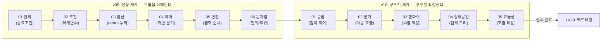

# LV26. 재귀함수 (Recursion)

## 단원 개요

본 단원은 재귀(Recursion)의 원리적 이해를 목표로 설계된 입문~중급 과정입니다.  
단순히 함수가 자기 자신을 호출하는 문법을 익히는 데 그치지 않고,  
**학습자가 실행 흐름의 중첩(Call Stack)과 분기(Branching)를 직접 체득**할 수 있도록 문제 순서를 구성하였습니다.

### 수료 역량

본 단원을 완료한 학습자는 다음 역량을 갖추게 됩니다.

| 역량 | 설명 |
|------|------|
| 재귀적 사고 | 반복 구조를 함수 호출의 연쇄로 변환하는 능력 |
| 실행 흐름 추적 | 호출 순서와 리턴 순서를 구분하여 코드 동작을 예측하는 능력 |
| 상태공간 입문 | 단일 호출에서 다중 호출로 확장하여 탐색 트리를 구성하는 능력 |

> 본 단원의 내용은 이후 **LV29. 백트래킹**, **LV31. 동적 계획법(DP)** 단원의 직접적인 선수 학습입니다.

---

### 현황 요약

| 구분 | 총 문제 수 | 검증 완료(`[x]`) | 플랫폼 등록 완료 | 비고 |
|------|:---:|:---:|:---:|------|
| v05 선형 재귀 | 12 | 12 | 8 | LOCAL 4개 업로드 예정 |
| v10 구조적 재귀 | 10 | 10 | 6 | LOCAL 4개 업로드 예정 |
| **합계** | **22** | **22** | **14** | |

> **`[x]` 검증 기준**: 예시 입·출력 100% 통과, 강사 교차 검수 완료, YAML 메타데이터 정합성 확인.  
> **`LOCAL`**: 콘텐츠 작성 완료 상태이나 플랫폼 DB 업로드 미완료인 항목. 파일명은 `ALLvXXXXX_LOCAL.md` 규칙을 따릅니다.

---

## 커리큘럼 흐름

---

## 1. [v05 시리즈] 선형 재귀 — 재귀적 사고의 확립

한 번의 호출에 한 번만 자신을 부르는 구조입니다.  
반복문(`for`, `while`)과 1:1 대응이 가능하므로, 학습자가 재귀를 처음 접할 때 가장 직관적으로 납득할 수 있는 형태입니다.

**Set 순서의 교수 설계 근거:**

| 단계 | 대상 Set | 학습 목표 |
|------|----------|-----------|
| 1단계 | Set 01~02 | 종료 조건과 매개변수 전달로 무한 호출을 방지하는 구조 이해 |
| 2단계 | Set 03~04 | `return` 값의 누적과 조건에 따른 분기를 통해 반복문보다 재귀가 자연스러운 경우 체험 |
| 3단계 | Set 05~06 | 호출 전후의 실행 시점 차이(전위/후위)로 출력 순서가 제어됨을 체득 |

| **Set** | **구분** | **주제** | **문제 제목** | **id** | **db_id** | **Status** | **핵심 학습 포인트** |
| :---: | :--- | :--- | :--- | :--- | :--- | :---: | :--- |
| **01** | 수업 | **원리** | [재귀함수 튜토리얼](02_workspace/ALLv05001_519.md) | `ALLv05001` | **519** | `[x]` | 종료 조건이 없으면 스택 오버플로우 발생 |
| | 숙제 | | [1부터 n까지 역순 출력](02_workspace/SALLv05001_520.md) | `SALLv05001` | **520** | `[x]` | 재귀 호출 이후의 코드가 실행되는 시점 |
| **02** | 수업 | **조건** | [두 수 사이 홀수 출력](02_workspace/ALLv05002_521.md) | `ALLv05002` | **521** | `[x]` | 매개변수로 현재 상태를 다음 호출에 전달 |
| | 숙제 | | [두 수 사이 짝수 출력](02_workspace/SALLv05002_721.md) | `SALLv05002` | **721** | `[x]` | 조건에 따라 재귀 호출 여부를 결정 |
| **03** | 수업 | **합산** | [1부터 n까지 합 구하기](02_workspace/ALLv05003_522.md) | `ALLv05003` | **522** | `[x]` | `return`으로 누적 값을 상위 호출자에게 전달 |
| | 숙제 | | [팩토리얼 계산](02_workspace/SALLv05003_523.md) | `SALLv05003` | **523** | `[x]` | 수학적 점화식을 재귀 코드로 직역 |
| **04** | 수업 | **제어** | [우박수 (3n+1)](02_workspace/ALLv05004_526.md) | `ALLv05004` | **526** | `[x]` | 조건에 따라 서로 다른 재귀 경로가 선택됨 |
| | 숙제 | | [우박수 역순 추적](02_workspace/SALLv05004_527.md) | `SALLv05004` | **527** | `[x]` | 호출 스택에 경로가 기록되는 원리 |
| **05** | 수업 | **변환** | [N진수 변환](02_workspace/ALLv05005_LOCAL.md) | `ALLv05005` | **LOCAL** | `[x]` | 후위 호출 — `printf` 위치에 따라 출력 순서가 역전됨 |
| | 숙제 | | [2진수 변환](02_workspace/SALLv05005_525.md) | `SALLv05005` | **525** | `[x]` | 진법 변환 원리와 후위 호출의 연계 |
| **06** | 수업 | **문자열** | [문자열 거꾸로](02_workspace/ALLv05006_LOCAL.md) | `ALLv05006` | **LOCAL** | `[x]` | 전위/후위 출력 패턴의 문자열 적용 |
| | 숙제 | | [재귀적 문자열 포장](02_workspace/SALLv05006_LOCAL.md) | `SALLv05006` | **LOCAL** | `[x]` | 문자열의 재귀적 결합 구조 |

---

## 2. [v10 시리즈] 구조적 재귀 — 분기와 상태공간 탐색

v05에서 단일 호출의 흐름을 이해했다면, v10에서는 **하나의 함수에서 자신을 두 번 이상 호출하는 구조**를 다룹니다.  
이때 실행 흐름은 선형이 아닌 트리(Tree) 형태로 확장되며, 호출 횟수는 기하급수적으로 증가합니다.  
이 단계는 이후 백트래킹과 분할 정복의 직접적인 선수 개념입니다.

**Set 순서의 교수 설계 근거:**

| 단계 | 대상 Set | 학습 목표 |
|------|----------|-----------|
| 1단계 | Set 01~02 | 깊이(depth) 매개변수로 중첩 구조를 제어하고, 다중 호출로 분기가 발생함을 시각적으로 확인 |
| 2단계 | Set 03~04 | 점화식을 재귀로 표현하고, 상태공간(State Space)을 트리로 생성하는 구조 설계 |
| 3단계 | Set 05 | 중복 재귀 호출의 비용(호출 횟수)을 직접 측정하여 최적화 필요성을 체감 |

| **Set** | **구분** | **주제** | **문제 제목** | **id** | **db_id** | **Status** | **핵심 학습 포인트** |
| :---: | :--- | :--- | :--- | :--- | :--- | :---: | :--- |
| **01** | 수업 | **중첩** | [재귀 챗봇](02_workspace/ALLv10001_LOCAL.md) | `ALLv10001` | **LOCAL** | `[x]` | 깊이(depth) 매개변수로 중첩 출력 구조를 제어 |
| | 숙제 | | [마트료시카](02_workspace/SALLv10001_LOCAL.md) | `SALLv10001` | **LOCAL** | `[x]` | 깊이에 비례하여 변화하는 출력 패턴 설계 |
| **02** | 수업 | **분기** | [재귀함수 튜토리얼2](02_workspace/ALLv10002_524.md) | `ALLv10002` | **524** | `[x]` | 한 함수에서 재귀를 2회 호출 시 트리 구조로 확장 |
| | 숙제 | | [트리보나치 수열](02_workspace/SALLv10002_LOCAL.md) | `SALLv10002` | **LOCAL** | `[x]` | 3개 항을 합산하는 3-way 재귀 구조 |
| **03** | 수업 | **점화식** | [포비나치 수열](02_workspace/ALLv10003_1499.md) | `ALLv10003` | **1499** | `[x]` | 수학적 점화식을 재귀 함수로 직역하는 패턴 |
| | 숙제 | | [가중치 피보나치 수열](02_workspace/SALLv10003_LOCAL.md) | `SALLv10003` | **LOCAL** | `[x]` | 변형된 점화식에 대한 재귀 적용 연습 |
| **04** | 수업 | **상태공간** | [N자리 수 만들기](02_workspace/ALLv10004_LOCAL.md) | `ALLv10004` | **LOCAL** | `[x]` | 재귀로 상태공간(탐색 트리)을 생성하는 구조 체험 |
| | 숙제 | | [숫자 만들기](02_workspace/SALLv10004_1501.md) | `SALLv10004` | **1501** | `[x]` | 상태공간 생성에 조건 필터(가지치기 전 단계) 적용 |
| **05** | 수업 | **효율성** | [재귀의 귀재 (호출 횟수 측정)](02_workspace/ALLv10005_LOCAL.md) | `ALLv10005` | **LOCAL** | `[x]` | 재귀 호출 횟수를 직접 측정하여 비용 감각 형성 |
| | 숙제 | | [재귀의 함정 (카운트)](02_workspace/SALLv10005_LOCAL.md) | `SALLv10005` | **LOCAL** | `[x]` | 중복 호출 구조에서 호출 횟수가 지수적으로 증가함을 체감 |

---

## 3. 교수 설계 가이드 — 주요 학습 장애 지점 및 대응 전략

본 단원에서 학습자가 반복적으로 어려움을 겪는 지점과 강사의 권장 대응 전략을 정리합니다.

| 해당 Set | 학습 장애 지점 | 강사 대응 전략 |
|----------|--------------|---------------|
| v05-01 | 종료 조건 없이 재귀를 호출하면 왜 프로그램이 종료되는지 이해하지 못함 | `while(true)`와 1:1 비교 — "조건 없는 재귀 = 조건 없는 무한 반복"으로 연결 |
| v05-01 (숙제) | 역순 출력이 왜 가능한지 — 재귀 호출 이후의 코드가 "돌아오면서" 실행됨을 모름 | 호출 스택을 단계별로 그려서 "내려가기"와 "돌아오기"를 분리하여 설명 |
| v05-03~04 | `return`으로 전달한 값이 어디로 가는지, 어떻게 누적되는지 파악하지 못함 | 반환값을 변수에 받아 즉시 출력하는 중간 단계 코드를 추가하여 흐름을 시각화 |
| v05-05 | `printf`의 위치(호출 전/후)에 따라 출력 순서가 역전되는 원인을 이해하지 못함 | [N진수 변환 강사 가이드](02_workspace/ALLv05005_LOCAL_v2.md) 참고 (전위/후위 비교 도식 포함) |
| v10-02 | 재귀를 2번 호출하면 전체 실행 횟수가 어떻게 달라지는지 직관이 없음 | 재귀 트리를 손으로 그려 호출 수를 직접 세는 활동 진행 |
| v10-05 | 중복 재귀 호출의 비용이 왜 문제인지 체감하지 못함 | 카운터 변수를 코드에 삽입하여 실제 호출 횟수를 출력·확인 |

---

## 4. 데이터 관리 정책

본 단원의 콘텐츠 파일은 다음 규칙에 따라 관리합니다.

| 항목 | 규칙 |
|------|------|
| **파일 명명** | `ALLvXXXXX_{db_id}.md` (수업) / `SALLvXXXXX_{db_id}.md` (숙제) |
| **db_id: LOCAL** | 콘텐츠 완성 후 플랫폼 업로드 전 상태. 업로드 시 실제 번호로 파일명 변경 |
| **ID 분류** | `v05`: 재귀 호출 1회 이하(선형) / `v10`: 재귀 호출 2회 이상(구조적) |
| **메타데이터 정합성** | 각 `.md` 파일의 YAML `id`, `db_id` 값은 본 README 테이블과 반드시 일치 |
| **인덱스 갱신** | 파일 추가·수정 후 `scripts/generate_content_indexes.py` 실행 필수 |
| **중복 검증** | `scripts/check_sets_index.ps1`으로 `db_id` 중복 여부 정기 점검 |
| **강사용 교수 가이드** | `*_v2.md` 파일은 강사 수업 준비용 문서 전용으로, 플랫폼 인덱스에 등록하지 않음 |
