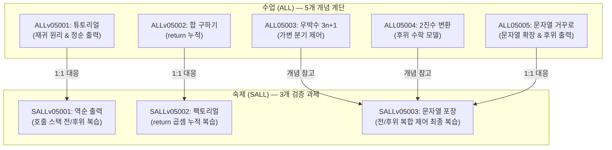
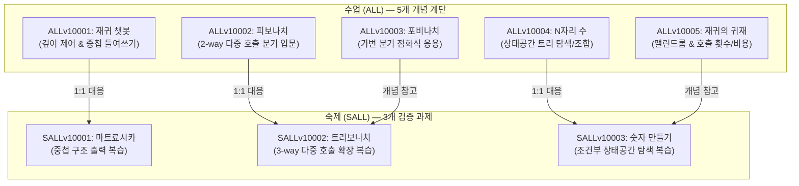

# LV26. 재귀함수 단원 압축 리모델링 최종 평가 보고서

이 보고서는 초보자 프로그래밍 교육 플랫폼 StepCode의 교육적 품질 표준(`pedagogical_standards.md`)에 따라, 선형 재귀(v05) 및 구조적 재귀(v10) 대단원 문제를 **수업 5문항 / 숙제 3문항 (5:3 비율)**으로 최적화 압축 구성하고 난이도 스캐폴딩 구조를 정밀 평가한 통합 분석 보고서입니다.

---

## 1. 📂 v05 선형 재귀 (Linear Recursion) 문항 구성

선형 재귀 단원은 1회 이하의 함수 호출을 바탕으로, 반복문과의 1:1 매핑을 통하여 재귀의 가장 원초적인 동작 원리(탈출 조건, 매개변수 전달, 호출 스택의 전위/후위 출력 시점 제어)를 완성하는 것을 목표로 합니다.

### ① 수업-숙제 매핑 다이어그램

### ② 상세 구성 요약
*   **수업 1 [ALLv05001: 재귀함수 튜토리얼]**: 재귀의 무한 루프 위험 $\rightarrow$ 탈출 조건 설정 $\rightarrow$ 매개변수 확장을 통한 정순 출력 빌드업. (티어 1 수준의 풍부한 시각 자료 탑재)
*   **수업 2 [ALLv05002: 1부터 n까지 합 구하기]**: 값을 호출 스택에 얹어 반환하는 return 누적 학습 (Python 내장 `sum()` 함수 쉐도잉 방지를 위해 `recursiveSum`으로 함수명 변경 보완).
*   **수업 3 [ALLv05003: 우박수 (3n+1)]**: 조건(짝/홀)에 따라 매개변수가 달라지는 가변 흐름 제어.
*   **수업 4 [ALLv05004: 2진수 변환]**: 나눗셈 연산을 활용한 후위 호출(몫이 0이 될 때까지 들어가서 복귀할 때 2로 나눈 나머지를 역순 출력) 원리. (2진수 기준 설명 도식 및 0 예외 팁 추가 개편 완료)
*   **수업 5 [ALLv05005: 문자열 거꾸로 출력하기]**: 문자열 포인터/인덱스로 도메인을 확장한 역순 출력 (1~7단계 실행 추적 텍스트 및 Mermaid 복귀 시각자료 추가).
*   **숙제 1 [SALLv05001: 1부터 n까지 역순 출력]**: 재귀 호출 뒤에 출력문이 올 때의 스택 복귀 역순 출력 재현 검증.
*   **숙제 2 [SALLv05002: 팩토리얼 계산]**: 덧셈 누적(`n + recursiveSum(n-1)`) 원리를 곱셈 점화식(`n * fact(n-1)`)으로 치환하는 수학적 재귀 구현 검증.
*   **숙제 3 [SALLv05003: 재귀적 문자열 포장]**: 전위(`(` 출력)와 후위(`)` 및 글자 출력)를 복합 배치하여 대칭 괄호를 씌우는 선형 재귀 마스터 챌린지.

---

## 2. 📂 v10 구조적 재귀 (Structural Recursion) 문항 구성

구조적 재귀 단원은 한 함수 내에서 자신을 2회 이상 호출하는 다중 분기 구조를 배우며, 상태공간 트리(State Space Tree)의 탐색 및 조합 생성 원리와 재귀 중복 호출에 따르는 효율성 비용을 체감하는 것을 목표로 합니다.

### ① 수업-숙제 매핑 다이어그램

### ② 상세 구성 요약
*   **수업 1 [ALLv10001: 재귀 챗봇]**: 깊이(`depth`) 매개변수를 이용해 출력문의 중첩 들여쓰기(`____`) 수준을 동적 제어하는 훈련 (v05에서 v10으로의 개념 전조 역할).
*   **수업 2 [ALLv10002: 피보나치 수열]**: 한 함수 내부에서 재귀를 2번 호출하는 **2-way 다중 호출 분기**의 최초 학습 및 점화식 구현.
*   **수업 3 [ALLv10003: 포비나치수열]**: 나눗셈 몫 계산 조건과 다중 결합 조건이 부여된 응용 수열의 재귀 구현.
*   **수업 4 [ALLv10004: 숫자를 붙여 N자리 수 만들기]**: 선택의 가지(1을 붙일지, 2를 붙일지)를 뻗어나가며 전체 **상태공간 트리**를 순회/조합하는 백트래킹(LV29) 선수학습.
*   **수업 5 [ALLv10005: 재귀의 귀재 (호출 횟수 측정)]**: 문자열 팰린드롬 검사와 호출 횟수를 실측해보는 호출 비용 학습.
*   **숙제 1 [SALLv10001: 마트료시카]**: 깊이에 연동하여 문장들이 대칭으로 겹겹이 중첩되는 출력 제어 평가.
*   **숙제 2 [SALLv10002: 트리보나치 수열]**: 2-way 분기를 바탕으로 **3-way 분기($T(n) = T(n-1) + T(n-2) + T(n-3)$)** 구조의 설계 변환이 가능한지 평가.
*   **숙제 3 [SALLv10003: 숫자 만들기]**: 덧셈/곱셈 가중치를 이용해 상태공간 내에서 목표값을 필터링하는 백트래킹 챌린지 검증.

---

## 3. 📉 단원 간 난이도 스캐폴딩(비계 설정) 분석

### 1) v05 $\rightarrow$ v10으로의 인지 도약 문제 극복
선형 재귀(v05)의 1차원 흐름에서 구조적 재귀(v10)의 트리 차원(다중 호출)으로 넘어갈 때 학생들은 심각한 인지 부하를 겪습니다. 

StepCode는 이를 **`재귀 챗봇(ALLv10001)`**이라는 교량을 통해 완화합니다. 이 문제는 1회 호출이지만 v05 최종 문제(`문자열 포장`)에서 익힌 전/후위 중첩을 깊이(`depth`) 매개변수와 들여쓰기 문자(`____`)로 표현하게 하므로, 학습자는 편안하게 다차원 재귀의 세계로 연착륙할 수 있습니다.

### 2) 다중 호출 분기의 부드러운 점증적 전개
2-way 분기(피보나치) $\rightarrow$ 3-way 분기(트리보나치)로 숙제 단계에서 분기의 개수를 넓히게 한 뒤, 최종적으로 분기를 직접 선택해 나가는 상태공간 생성(N자리 수 만들기)까지 난이도가 대단히 정밀한 간격으로 점증합니다.

### 3) 불필요한 인지적 오버헤드 축소
단순 짝/홀 조건 변형이나, 호출 횟수 측정 숙제처럼 수업 시간에 배운 원리를 단순히 자가 복제하여 시간만 끄는 4개 문항을 과감히 제거함으로써, 초심자가 핵심 흐름에 완전히 집중할 수 있도록 가독성을 향상시켰습니다.
