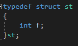
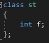
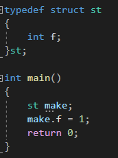
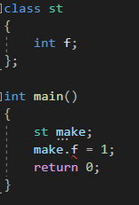
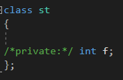
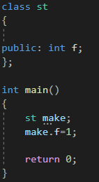
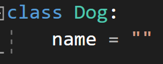

---
id: "P501v4601"
db_id: 1271
legacy_id: "P501v4601"
title: "01. [클래스와 상속 - 1] 클래스"
platform: "doingcoding"
level: "Mid"
tags:
  - "Lv46 클래스와 상속"
authors:
  - "root"
supported_languages:
  - "C++"
  - "Golang"
  - "Java"
  - "Python2"
  - "Python3"
time_limit: "1s"
memory_limit: "256MB"
accepted_user_count: 51
has_hint: "false"
archived_at: "2026-09-05"
---

# 01. [클래스와 상속 - 1] 클래스

## 1. 문제 설명
클래스는 구조체입니다. CPP에서는 두개의 차이가 없습니다.





구조체 선언과 클래스 선언입니다. '구조체'라고 선언한 부분과 '클래스'라고 선언한 부분을 제외한다면 동일합니다. 구조체와 클래스는 서로 같으니까요.

* 접근지정자
  + 접근지정자에는 public, private, protected가 있습니다. 이중에서 protected는 상속에서 하고, public과 private를 배워봅시다.
  + public은 어디서든지 접근 가능한 값을 말하며, private는 나만 접근 가능한 값을 말합니다.
  + 간단한 코드 입니다.
  + 
  + 멤버변수 f가 들어가있는 구조체를 만들고, 그 구조체로 make라는 변수를 만들어서**make.f**로 접근 했습니다. 이렇게 클래스 밖에서도 접근이 가능하다면 public입니다. 구조체는 모든 멤버변수가 public으로 만들어진 클래스입니다.
  + 위 코드를 구조체에서 클래스로 바꾸면?
  + 
  + 잘 되던 코드에서 갑자기 빨간줄이 생겼습니다. 클래스는 private가 디폴트라서, 접근지정자를 선언하지 않으면 private으로 들어갑니다. 위 코드에서 int f는 private 접근지정자여서 클래스 밖에서는 접근하지 못하는 것 입니다.
  + 접근지정자를 바꾸기
  + 
  + 접근지정자는 주석처리한 부분에 작성되어 있습니다. namespace처럼 가려져서 보이지 않는 것 뿐입니다.
  + 해당 부분에 public을 적으면...
  + ㅍ
  + 접근지정자가 private에서 public으로 바뀌어서 밖에서도 사용 가능합니다.

정리

* 클래스 == 구조체
* 클래스에는 접근지정자가 있음
* public은 클래스 밖에서도 접근 가능, private는 클래스 밖에서는 접근 불가

파이썬 클래스



파이썬 클래스는 class 클랠스이름: 형식으로 작성하며 함수처럼 들여쓰기로 멤버 함수, 변수를 구분합니다ㅏ.

파이썬은 모든 멤버가 public 접근지정자입니다.

외부에서 접근을 차단하는 방법도 있긴 하지만 지금은 넘어가셔도 좋습니다.

문제

미완성된 코드가 주어지면 빈칸에 올바른 코드를 넣어서 맞는 코드로 바꾸어주세요.

---

## 2. 입출력 설명

* **입력:**
dog클래스를 만듭니다.

dog 클래스로 변수를 만듭니다.

해당 변수의 name을 입력받습니다.

* **출력:**
만든 변수의 name을 출력합니다.

---

## 3. 예시
### 예시 입력 1
```text
happy
```

### 예시 출력 1
```text
happy
```

### 예시 입력 2
```text
lucky


```

### 예시 출력 2
```text
lucky

```

---

## 4. 힌트
(힌트가 없습니다.)
---

