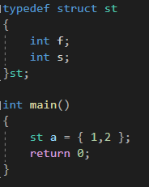
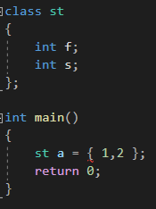
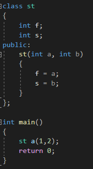
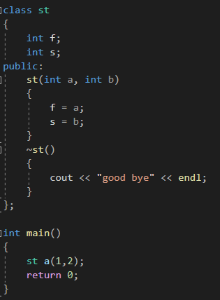
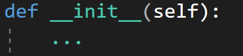
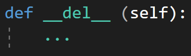

---
id: "P501v4602"
db_id: 1272
legacy_id: "P501v4602"
title: "02. [클래스와 상속 - 2] 생성자와 소멸자"
platform: "doingcoding"
level: "Mid"
tags:
  - "Lv46 클래스와 상속"
authors:
  - "root"
supported_languages:
  - "C++"
  - "Golang"
  - "Java"
  - "Python2"
  - "Python3"
time_limit: "1s"
memory_limit: "256MB"
accepted_user_count: 48
has_hint: "true"
archived_at: "2026-09-05"
---

# 02. [클래스와 상속 - 2] 생성자와 소멸자

## 1. 문제 설명
구조체 객체를 만들어서 초기화 할때는 아래와 같은 방법으로도 했습니다.



비슷하게 클래스로 하면



역시 빨간줄이 생기게 됩니다. public이 아니라서 그런것도 있지만, 여기서는 생성자에 대해 배워봅시다.

* 생성자와 소멸자
  + 클래스에는 생성자와 소멸자라는 것이 있습니다. 생성자는 클래스가 맨 처음 만들어질 때 자동적으로 호출되는 함수, 소멸자는 클래스가 삭제될 때 자동적으로 호출되는 함수 입니다. 클래스 변수를 만드는 st a자체가 함수호출입니다.
  + 생성자는 클래스와 같은 이름을 가진 함수입니다. 또한 따로 리턴 타입이 없습니다. int도 double도 string도 심지어 void도 아닌 함수입니다.
  + 매개변수 두개를 받아 클래스 변수를 초기화하는 생성자 만들기
  + 
  + 생성자함수를 pulbic으로 지정한 뒤 만들었습니다. 두 매개변수 a, b를 받아서 f는 a로 초기화, s는 b로 초기화 시켰습니다.
  + 소멸자는 생성자와는 반대로 클래스가 사라질 때 생성됩니다. 소멸자의 이름 역시 클래스의 이름과 똑같은데, 앞에 ~이 붙습니다.
  + 소멸자 함수의 예시
  + 
  + 위 코드에서 소멸자는 main함수의 return 0를 만났을 때 호출됩니다.

파이썬의 생성자, 소멸자

파이썬도 CPP과 마찬가지로 클래스 객체 생성시에 호출하는 함수가 생성자, 클래스가 삭제될 때 호출되는 함수가 소멸자 입니다.

* 생성자
  + 
  + 파이썬 생성자는 \_\_init\_\_로 구현이 되어있습니다. self는 3번에서 배울 예정으로 함수에 넣어야 한다고 알고 계시면 됩니다.
  + ...는 자리표시자로 아직 구현을 안 했다는 뜻입니다.

* 소멸자
  + 
  + 소멸자는 \_\_del\_\_로 구현되어 있습니다.

문제

미완성된 코드가 주어지면 빈칸에 올바른 코드를 넣어 작동이 되게 해주세요.

---

## 2. 입출력 설명

* **입력:**
dog 클래스를 만듭니다.

강아지의 이름을 입력받습니다.

dog 클래스로 변수를 만드는데, 입력받은 이름을 매개변수로 생성합니다.

* **출력:**
종료하면서 소멸자를 호출하여 Good bye + 이름을 출력합니다.

---

## 3. 예시
### 예시 입력 1
```text
happy
```

### 예시 출력 1
```text
Good bye happy
```

---

## 4. 힌트
자바는**가비지 컬렉션(Garbage Collection)**시스템을 통해 객체의 메모리를 자동으로 관리합니다.

가비지 컬렉션은 더 이상 참조되지 않는 객체를 자동으로 제거하며, 이를 위해 특별히 코드를 작성할 필요가 없습니다.
---

