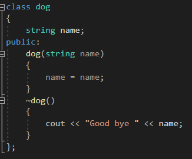
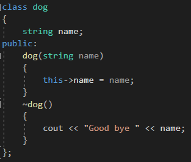
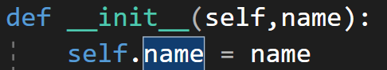

---
id: "P501v4603"
db_id: 1274
legacy_id: "P501v4603"
title: "03. [클래스와 상속 - 3] this"
platform: "doingcoding"
level: "Mid"
tags:
  - "Lv46 클래스와 상속"
authors:
  - "root"
supported_languages:
  - "C++"
  - "Golang"
  - "Java"
  - "Python2"
  - "Python3"
time_limit: "1s"
memory_limit: "256MB"
accepted_user_count: 46
has_hint: "true"
archived_at: "2026-09-05"
---

# 03. [클래스와 상속 - 3] this

## 1. 문제 설명
클래스에는 this라는 포인터가 있습니다.

this 포인터는 생성된 인스턴스(변수)자기 자신을 가리키는 포인터 입니다.

this 포인터는 어떻게 쓸까요?

간단하게, 강아지의 클래스를 만들고, 강아지의 이름을 매개변수로 쓰는 생성자가 있다고 합시다.

그런데 매개변수를 다름 이름으로 하면 헷갈리니, class의 이름 변수와 이름을 같게 만들었습니다.



생성자 안에서 앞의 name은 누구고 뒤의 name은 누굴까요?

cpp에서는 지역 변수의 우선 순위가 더 높습니다. 해당 코드에서는 매개변수로 받는 name이 더 높다는 것 입니다. 안의 name 둘 다 매개변수 name이죠.

매개변수 name이 아니라 class의 name을 쓸려면 this를 쓰면 됩니다.



나의, 이 class의 name이 매개변수 name이다. 라고 쓰면 됩니다.

파이썬

파이썬은 this가 아니라 self라는 명령어를 사용합니다.

생성자 소멸자를 사용할 때 매개변수에 self를 넣었었습니다. 파이썬은 인스턴트 메서드를 호출할 때, 해당 인스턴스가 자동으로 self 매개변수에 전달됩니다. 따라서 파이썬은 첫 번째 매개변수로 꼭 self를 넣어야 합니다.



cpp의 this처럼 이 name은 내가 가진 name이고 저 name은 외부에서 받아온 name이다 하고 구분할 수도 있습니다. self.name이 클래스 객체안의 name이고 뒤의 name이 매개변수로 받아온 name입니다.

문제

미완성된 코드가 주어지면 빈칸을 채워 완성시켜주세요.

만약 빈칸에 쓸 내용이 없다면 빈칸을 비워주세요.

---

## 2. 입출력 설명

* **입력:**
dog 클래스를 만듭니다.

강아지의 이름을 입력 받습니다.

dog 클래스로 변수를 만드는데, 입력받은이름을 매개변수로 생성합니다.

* **출력:**
종료하면서 소멸자를 호출하여 Good bye + 이름을 출력합니다.

---

## 3. 예시
### 예시 입력 1
```text
happy
```

### 예시 출력 1
```text
Good bye happy
```

---

## 4. 힌트
자바는**가비지 컬렉션(Garbage Collection)**시스템을 통해 객체의 메모리를 자동으로 관리합니다.

가비지 컬렉션은 더 이상 참조되지 않는 객체를 자동으로 제거하며, 이를 위해 특별히 코드를 작성할 필요가 없습니다.

파이썬은 self를 사용하면 됩니다.
---

