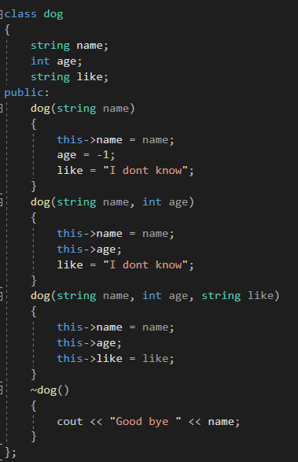
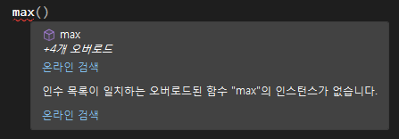

---
id: "P501v4604"
db_id: 1311
legacy_id: "P501v4604"
title: "04. [클래스와 상속 - 4] 오버로딩"
platform: "doingcoding"
level: "Mid"
tags:
  - "Lv46 클래스와 상속"
authors:
  - "root"
supported_languages:
  - "C++"
  - "Golang"
  - "Java"
  - "Python2"
  - "Python3"
time_limit: "1s"
memory_limit: "256MB"
accepted_user_count: 38
has_hint: "false"
archived_at: "2026-09-05"
---

# 04. [클래스와 상속 - 4] 오버로딩

## 1. 문제 설명
파이썬으로 푸는 분들은 넘어가셔도 좋습니다.

클래스의 생성자를 만듭시다.

dog class를 만들고, 생성시에 이름과 나이 좋아하는것을...

만약 나이를 모르면요? 좋아하는걸 모른다면?

그럼 생성할 수 가 없겠네요. 일일이 생성 시 마다 나이에 -1을 넣고 좋아하는 것에 "I dont know"를 넣을수도 없고.

사실 생성자를 더 많이 만들면 됩니다.



name만 매개변수로 받는 생성자, age까지 받는 생성자, like까지 다 받는 생성자, 이렇게 생성자를 많이 만들었습니다.

같은 이름의 함수를 여러개 만드는걸 오버로딩이라고 합니다. 클래스함수에서만 사용하는 것이 아닌, 일반적인 함수에서도 사용 가능합니다.

대표적인 예로 max함수가 있습니다.



max함수를  쓰고 마우스를 올려보면 4개의 오버로드가 있다고 합니다. 같은 이름을 가진 max함수가 네개나 있었습니다.

함수는 함수 이름이 서로 동일하고, 매개변수가 다르다면 오버로딩할 수 있습니다.

문제

미완성된 코드가 주어지면 빈칸에 알맞은 코드를 작성해주세요.

만약 빈칸에 쓸 내용이 없다면 빈칸을 비워주세요.

---

## 2. 입출력 설명

* **입력:**
mymax 클래스가 주어집니다.

mymax 인스턴스를 하나 생성하고

int 형 두개의 max를 찾는 max함수,

double형 두개의 max를 찾는 max함수를 호출합니다.

* **출력:**
각각의 맥스함수를 출력합니다.

---

## 3. 예시
### 예시 입력 1
```text
없음
```

### 예시 출력 1
```text
2
62.800000
```

---

## 4. 힌트
(힌트가 없습니다.)
---

