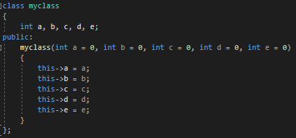
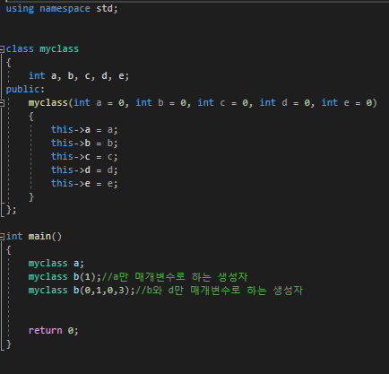
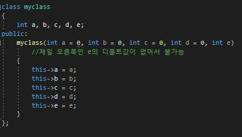
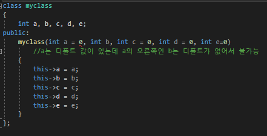
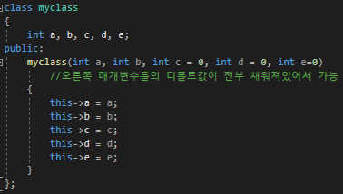
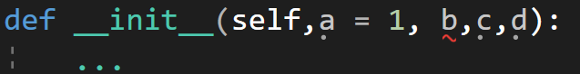
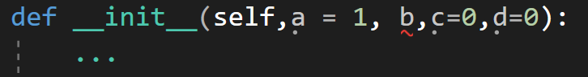
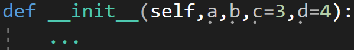

---
id: "P501v4605"
db_id: 1312
legacy_id: "P501v4605"
title: "05. [클래스와 상속 - 5] 디폴트 매개변수"
platform: "doingcoding"
level: "Mid"
tags:
  - "Lv46 클래스와 상속"
authors:
  - "root"
supported_languages:
  - "C++"
  - "Golang"
  - "Java"
  - "Python2"
  - "Python3"
time_limit: "1s"
memory_limit: "256MB"
accepted_user_count: 45
has_hint: "false"
archived_at: "2026-09-05"
---

# 05. [클래스와 상속 - 5] 디폴트 매개변수

## 1. 문제 설명
멤버변수가 5개가 있는 클래스를 상상해봅시다. 각각 이름은 a, b, c, d, e라고 합시다.

클래스 인스턴스를 만들 때 멤버변수를 초기화 할 것 입니다.

a를 받아와 a만 초기화 하는 생성자, b만 초기화 하는 생성자, c만 초기화 하는 생성자, d만 초기화 하는 생성자, e만 초기화 하는 생성자, a b 두개를 초기화 하는 생성자... a b c d e모두를 초기화 하는 생성자까지

경우의 수를 모두 따지면 생성자가 너무 많습니다. 생성자 코드만 100줄이 넘을 것 같습니다. 생성자를 하나만 만들 수는 없을까요?

그럴때 사용하는것이 디폴트 매개변수 입니다.



함수가 우리가 쓰던 함수랑 무언가 살짝 다릅니다. 변수 초기화처럼 옆에 = 0이 붙어있습니다.

매개변수를 초기화 하는것이 바로 디폴트 매개변수로

해당 값이 들어오지 않는다면 지금 써있는 값을 넣은 것으로 간주하겠다라는 뜻 입니다.

디폴트 매개변수는 클래스함수에서만 쓸 수 있는것이 아닌 일반적인 함수에서도 쓸 수 있습니다.

디폴트 매개변수를 통해서 생성자 단 하나로 모든 종류의 생성자를 호출할 수 있습니다.



디폴트값은 부분적으로만 설정할 수도 있습니다.

하지만 반드시 오른쪽 매개변수의 디폴트 값부터 채워야 합니다.







파이썬

파이썬 디폴트 매개변수도 CPP과 마찬가지로 오른쪽부터 순서대로 채워야합니다.



불가능



불가능



오른쪽부터 순서대로 채워서 가능

문제

미완성된 코드가 주어지면 빈칸에 올바른 코드를 넣어서 완성시켜주세요.

만약 빈칸에 쓸 코드가 없다면 빈칸을 비워주세요.

---

## 2. 입출력 설명

* **입력:**
멤버변수가 세개 있는 클래스를 만들고

해당 클래스로 인스턴스를 생성합니다.

생성자에서 멤버변수 셋중 어떤 값이 제일 큰지 출력합니다.

* **출력:**
세 멤버변수중 가장 큰 수를 출력합니다.

---

## 3. 예시
### 예시 입력 1
```text
없음
```

### 예시 출력 1
```text
10
20
30
```

---

## 4. 힌트
(힌트가 없습니다.)
---

