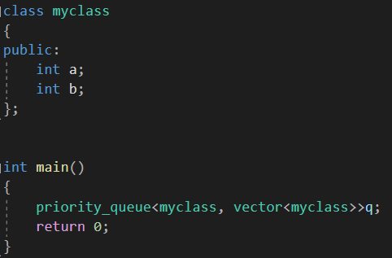
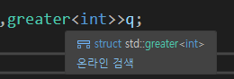
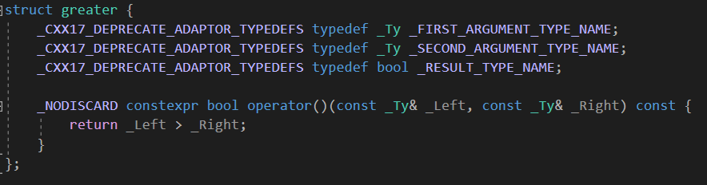
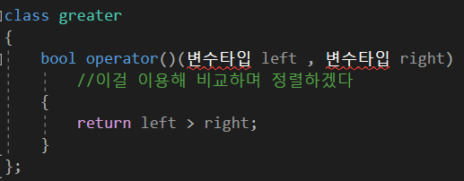
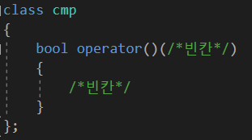
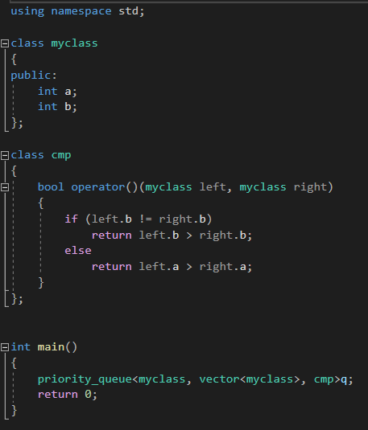

---
id: "P501v4606"
db_id: 1313
legacy_id: "P501v4606"
title: "06. [클래스와 상속 - 6] 우선순위 큐의 우선순위"
platform: "doingcoding"
level: "Mid"
tags:
  - "Lv46 클래스와 상속"
authors:
  - "root"
supported_languages:
  - "C"
  - "C++"
  - "Golang"
  - "Java"
  - "Python2"
  - "Python3"
time_limit: "1s"
memory_limit: "256MB"
accepted_user_count: 34
has_hint: "false"
archived_at: "2026-09-05"
---

# 06. [클래스와 상속 - 6] 우선순위 큐의 우선순위

## 1. 문제 설명
파이썬으로 푸시는 분들은 넘어가셔도 좋습니다.

잠시 다시 알고리즘 문제를 풀어봅시다.

우선순위 큐를 보면 다음과 같은 형식으로 구성되어 있습니다.


간단하게 번역하면

<변수형, 컨테이너, 비교연산자>

입니다.

변수형은 말그대로 변수형입니다. int가 될수도 있고, double이 될 수도 있고,  클래스도 가능합니다.

컨테이너는 변수를 많이 저장하는 저장소입니다. 변수를 많이 저장하는건 뭐가 있을까요?

벡터도 있고, 덱, 셋, 맵 등이 바로 컨테이너 입니다. 일반적으로 컨테이너는 벡터가 디폴트 입니다.

클래스변수를 쓰면서, 벡터 컨테이너를 이용하는 우선순위큐는 이런 형태가 됩니다.



비교연산자는 클래스타입으로 선언합니다. 이전에 배운 greater나 디폴트로 설정된 less 역시 전부 클래스로 선언되어 있습니다.





말이 무척이나 어려워 보이지만 간단합니다. 아래와 같은 뜻입니다.



greater 클래스 안에 sort에서 배운 정렬함수가 선언되어 있는것과 마찬가지 입니다. 정렬함수는 bool operator()가 기본 이름입니다.

우리는 이 bool operator()를 오버로딩할 것 입니다. 빈칸만 채워주면 간단합니다.



위의 myclass 함수로 오버로딩 해봅시다. myclass의 b가 더 큰 쪽으로, b가 똑같다면 a가 더 작은 쪽으로 정렬합시다.

완성된 우선순위 큐



한번 직접 정렬 클래스를 만들어서 우선순위큐를 만들고, 우선순위큐를 활용하는 알고리즘 문제를 풀어봅시다.

문제

멤버변수가 세개 있는 클래스를 만들고

해당 클래스를  사용하는 우선순위큐를 만듭니다.

정렬기준은 첫번째 수가 다르면 첫 번째 수가 큰 순으로,

아니라면 두번째수가 다르다면 두 번째 수가 큰 순으로

역시 아니라면 세번째 수가 큰 순 입니다.

숫자 N이 입력됩니다. (1 <= N <= 100)

이후 N개 줄에 명령 o가 입력됩니다.

명령 o가 i라면 큐에 푸시입니다. 푸시할 값 a, b, c가 이어서 들어옵니다. ( 1 <= a, b, c <= 100)

명령 o가 o라면 팝입니다. o는 큐에 사이즈가 있을 경우에만 입력됩니다.

---

## 2. 입출력 설명

* **입력:**
숫자 N이 입력됩니다. (1 <= N <= 100)

이후 N개 줄에 명령 o가 입력됩니다.

명령 o가 i라면 큐에 푸시입니다. 푸시할 값 a, b, c가 이어서 들어옵니다. ( 1 <= a, b, c <= 100)

명령 o가 o라면 팝입니다. o는 큐에 사이즈가 있을 경우에만 입력됩니다.

* **출력:**
팝할 때 마다 큐에서 나가는 값을 출력해주세요.

---

## 3. 예시
### 예시 입력 1
```text
12
i 72 93 44
i 38 15 9
o
i 61 91 48
i 65 54 43
i 93 88 15
i 27 3 90
i 96 1 51
o
i 74 22 69
o
i 59 96 98

```

### 예시 출력 1
```text
72 93 44
96 1 51
93 88 15
```

### 예시 입력 2
```text
18
i 96 61 73
i 70 54 38
i 91 28 82
i 75 19 61
o
i 59 94 83
i 65 63 9
o
i 35 49 4
i 40 82 67
i 42 88 15
i 58 32 45
i 6 38 96
o
o
i 31 11 88
o
o

```

### 예시 출력 2
```text
96 61 73
91 28 82
75 19 61
70 54 38
65 63 9
59 94 83
```

---

## 4. 힌트
(힌트가 없습니다.)
---

