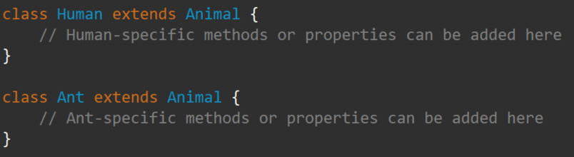

---
id: "P501v4607"
db_id: 1335
legacy_id: "P501v4607"
title: "07. [클래스와 상속 - 7] 상속(inheritance)"
platform: "doingcoding"
level: "Mid"
tags:
  - "Lv46 클래스와 상속"
authors:
  - "root"
supported_languages:
  - "C++"
  - "Java"
  - "Python3"
time_limit: "1s"
memory_limit: "256MB"
accepted_user_count: 49
has_hint: "true"
archived_at: "2026-09-05"
---

# 07. [클래스와 상속 - 7] 상속(inheritance)

## 1. 문제 설명


---

## 2. 입출력 설명

* **입력:**


* **출력:**


---

## 3. 예시
### 예시 입력 1
```text
Grace
Becky
```

### 예시 출력 1
```text
Grace
Becky
```

### 예시 입력 2
```text
Grace
Ellie
```

### 예시 출력 2
```text
Grace
Ellie

```

---

## 4. 힌트
자바에서 상위 클래스로부터 상속을 받으려면 다음과 표현합니다:

class (클래스 이름) extends (상위 클래스 이름)


---

