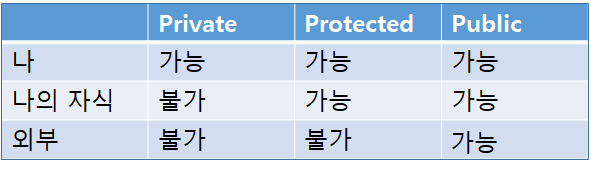
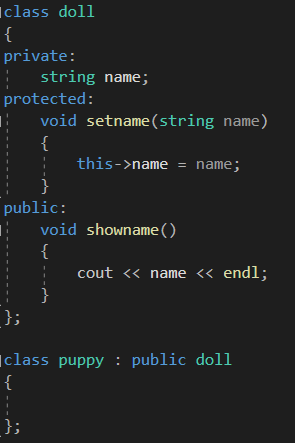
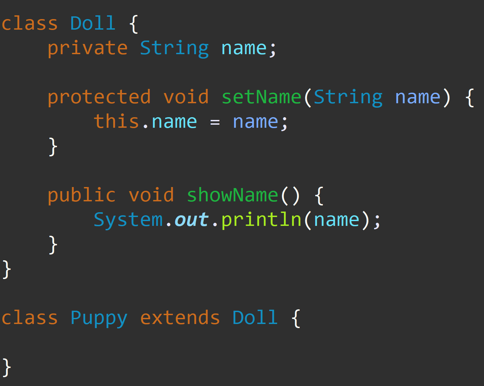
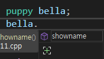
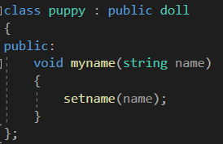
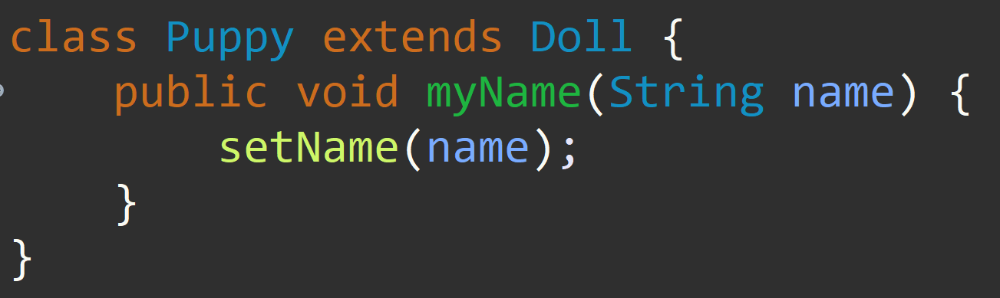

---
id: "P501v4608"
db_id: 1336
legacy_id: "P501v4608"
title: "08. [클래스와 상속 - 8] protected 접근지정자"
platform: "doingcoding"
level: "Mid"
tags:
  - "Lv46 클래스와 상속"
authors:
  - "root"
supported_languages:
  - "C++"
  - "Golang"
  - "Java"
  - "Python2"
  - "Python3"
time_limit: "1s"
memory_limit: "256MB"
accepted_user_count: 41
has_hint: "false"
archived_at: "2026-09-05"
---

# 08. [클래스와 상속 - 8] protected 접근지정자

## 1. 문제 설명
파이썬으로 푸시는 분들은 넘어가셔도 좋습니다.

클래스를 처음 배울 때, 우린 세가지 접근 지정자에 대해 배웠습니다.

private, protected, public

이중 protected는 상속에서 배운다고 넘어갔고, private는 외부에서 접근 불가, public은 외부에서 접근 가능 이었습니다.

protected는 나와, 내 자식까지만 접근할 수 있는 접근지정자 입니다.



---

### 

### **[protected]**

클래스를 만들어봅시다. 인형클래스와, 인형클래스를 상속받은 강아지(인형)클래스 입니다.

**[C언어]                                                         [JAVA]**



퍼피 클래스로 객체를 만들어서 확인해보면



보다시피 public으로 선언한 showname함수밖에 없습니다.

puppy클래스에 public으로 함수를 하나 더 선언합시다.

**[C언어]                                                     [JAVA]**



이번엔 방금전엔 사용되지 않던 setname이 자연스레 사용됩니다.

setname함수는 protected접근지정자이기 때문에 puppy 객체로 만들었을 땐 외부였기 때문에 사용이 불가능했지만, puppy 클래스 안에서 함수를 사용할 땐 상속받은 클래스의 내부이기 때문에 사용이 가능합니다.

클래스를 상속할 때 가만 보면 우린 public 접근 지정자를 사용하여 상속을 하고 있습니다.

private protected도 있긴 하지만, cpp에서 상속을 할 땐 일반적으로 public을 쓴다 라고만 알고 있으면 충분합니다.

문제

미완성된 코드가 주어지면 빈칸에 올바른 코드를 써 코드를 완성시켜 주세요.

---

## 2. 입출력 설명

* **입력:**
인형클래스, 인형클래스를 상속받는 강아지(인형) 클래스가 주어집니다.

강아지인형 객체를 만들고 이름을 입력받습니다.

* **출력:**
입력받은 강아지인형의 이름을 출력합니다.

---

## 3. 예시
### 예시 입력 1
```text
Ellie
```

### 예시 출력 1
```text
Ellie
```

### 예시 입력 2
```text
Grace
```

### 예시 출력 2
```text
Grace

```

---

## 4. 힌트
(힌트가 없습니다.)
---

