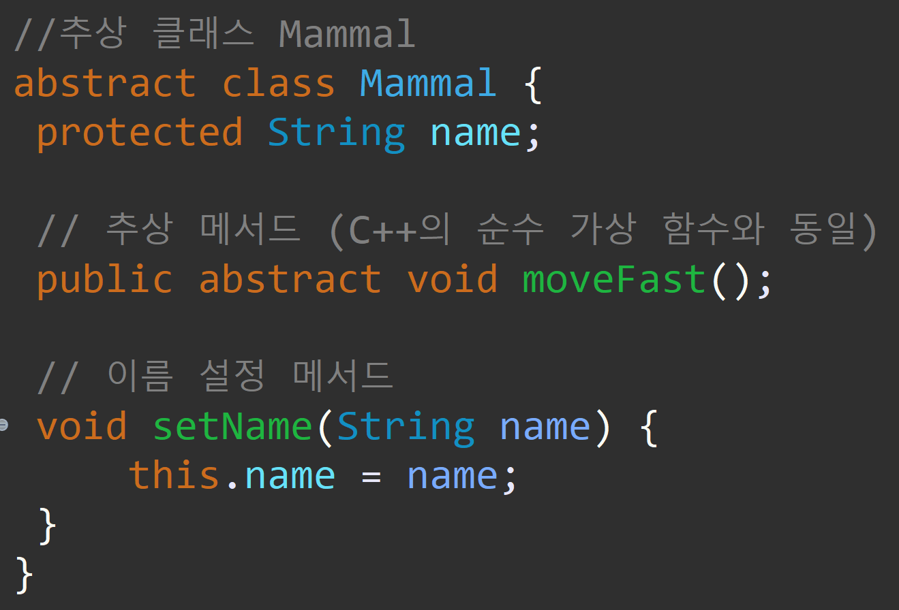

---
id: "P501v4610"
db_id: 1347
legacy_id: "P501v4610"
title: "10. [클래스와 상속 - 10] virtual 함수"
platform: "doingcoding"
level: "Mid"
tags:
  - "Lv46 클래스와 상속"
authors:
  - "root"
supported_languages:
  - "C++"
  - "Java"
  - "Python3"
time_limit: "1s"
memory_limit: "256MB"
accepted_user_count: 49
has_hint: "true"
archived_at: "2026-09-05"
---

# 10. [클래스와 상속 - 10] virtual 함수

## 1. 문제 설명


---

## 2. 입출력 설명

* **입력:**


* **출력:**


---

## 3. 예시
### 예시 입력 1
```text
Aileen
```

### 예시 출력 1
```text
Aileen
I'm flying
```

### 예시 입력 2
```text
Erin
```

### 예시 출력 2
```text
Erin
I'm flying
```

---

## 4. 힌트
자바는**abstract**키워드를 통해서 추상 메서드를 정의할 수 있습니다.


---


## C++ Template

```c++
#include <string>
#include <iostream>

using namespace std;

class Mammal
{
protected:
	string name;
public:
	
	virtual void Move_fast() = 0;
	void Setname(string name)
	{
		this->name = name;
	}

};

class Bet : public Mammal
{
public:
	빈칸
	{
		cout << name << endl;
		cout << "I'm flying" << endl;
	}
};

int main()
{
	Bet bet;
	string name;
	cin >> name;
	bet.Setname(name);
	bet.Move_fast();


	return 0;
}

```

## Java Template

```java
import java.util.Scanner;

//추상 클래스 Mammal
abstract class Mammal {
 protected String name;

 // 추상 메서드 
 public abstract void moveFast();

 // 이름 설정 메서드
 void setName(String name) {
     this.name = name;
 }
}

//Bet 클래스 (Mammal을 상속)
class Bet extends Mammal {
 @Override
 빈칸 {
     System.out.println(name);
     System.out.println("I'm flying");
 }
}

//실행 클래스
public class Main {
 public static void main(String[] args) {
     Scanner scanner = new Scanner(System.in);
     Bet bet = new Bet();

     // 사용자 입력 받기
     String name = scanner.nextLine();
     bet.setName(name);

     // moveFast() 호출
     bet.moveFast();

     scanner.close();
 }
}

```

## Python3 Template

```python3
from abc import abstractmethod

class Mammal:
    name = ''

    @abstractmethod
    def Move_fast(self):
        ...

    def setname(self,name):
        self.name = name

class Bet(Mammal):
    빈칸:
        print(self.name)
        print("I'm flying")

bet = Bet()
name = input()
bet.setname(name)
bet.Move_fast()


```
