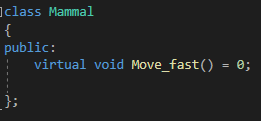
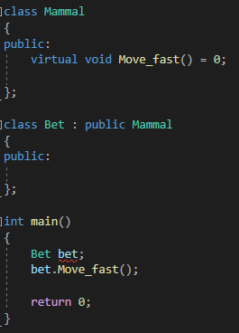
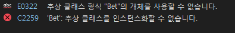
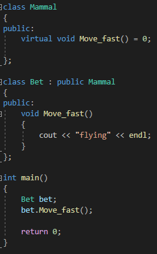
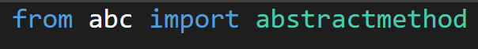
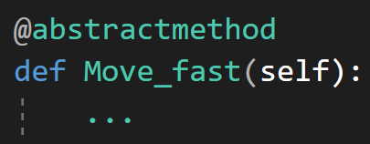

---
id: "P501v4610"
db_id: 1347
legacy_id: "P501v4610"
title: "10. [클래스와 상속 - 10] virtual 함수"
platform: "doingcoding"
level: "Mid"
tags:
  - "Lv46 클래스와 상속"
authors:
  - "root"
supported_languages:
  - "C++"
  - "Java"
  - "Python3"
time_limit: "1s"
memory_limit: "256MB"
accepted_user_count: 49
has_hint: "true"
archived_at: "2026-09-05"
---

# 10. [클래스와 상속 - 10] virtual 함수

## 1. 문제 설명
고래, 박쥐, 사람을 상상해봅시다.

고래가 '빨리 움직인다' 하면 일반적으로 어떤 모습일까요? 물속에서 빠르게 헤엄치겠죠.

박쥐가 '빨리 움직인다' 하면 빠르게 날아다닐 것 입니다.

사람은 두 발로 열심히 뛸거고요.

셋 다 같은 포유류지만, 빨리 움직이는 모습은 전혀 다릅니다.

포유류 클래스에서 '빨리 움직인다' 함수를 만들고, 셋에게 상속시키고 싶지만 오버라이딩으로 만들면 어디선가 실수 할 것 같습니다. 고래가 두 발로 뛰거나, 박쥐가 두 발로 뛰게 되겠죠.

그럴때 필요한것이 바로 virtual 가상함수 입니다.



우리가 지금까지 쓰던 함수의 모습과는 다릅니다.

앞에 virtual이 붙고, 함수의 구현 없이 = 0이라고 합니다.

이러한 형식을 '순수 가상 함수'라고 하며, 함수의 내용이 정의되지 않은 함수 입니다. = 0은 '나는 아직 내용물이 없습니다.'라고 말해주는 것 입니다.

일단, 포유류 클래스로 박쥐 클래스를 만들어서 빨리 움직이게 시켜봅시다.





그림과 같이 빨간 줄이 뜨게돼죠. 추상 클래스를 인스턴스화 시킬 수 없다고 합니다.

추상 클래스란 아직 완성되지 않은 가상 함수를 멤버함수로 가지고 있는 클래스를 말합니다.

박쥐 클래스의 경우 아직 완성되지 않은 포유류 클래스의 '빨리 움직인다' 함수를 그대로 사용하고 있으니 추상클래스라며 사용을 막는거지요.

덕분에 우리는 박쥐가 날개를 두고 굳이 두발로 열심히 뛰어다니는 불상사는 막았습니다. 만약 move\_fast에 '달린다'를 넣어놓고, 박쥐클래스에서 오버라이딩을 했었으면 박쥐는 뛰어다녔을 겁니다.

그럼 이제 박쥐를 날게하면 되겠죠.

가상함수를 오버라이딩하는건 일반적인 오버라이딩과 똑같습니다.



파이썬에서 추상 클래스를 사용하려면 따로 abstractmethod를 임포트 해야합니다.



가상함수를 만들 땐 만들 가상함수 위에 @abstractmethod를 작성하여 가상함수임을 표시해야 합니다.



이렇게 만든 가상함수는 CPP처럼 자식클래스(서브클래스)에서 구현해주면 됩니다.

문제

미완성된 코드가 주어지면 빈칸에 올바른 코드를 적어 완성시켜주세요.

---

## 2. 입출력 설명

* **입력:**
Mammal클래스와Mammal클래스를 상속받는 Bet클래스를 만듭니다.

Mammal클래스에는 name매개변수와 Move\_fast가상함수, Setname가 있습니다.

박쥐클래스의 이름을 입력받고, 이름을 저장한 다음Move\_fast함수를 실행하면 박쥐가 자신의 이름을 외치고 힘차게 날아다닙니다.

* **출력:**
Move\_fast함수를 실행하면 박쥐가 자신의 이름을 외치고 힘차게 날아다닙니다.

---

## 3. 예시
### 예시 입력 1
```text
Aileen
```

### 예시 출력 1
```text
Aileen
I'm flying
```

### 예시 입력 2
```text
Erin
```

### 예시 출력 2
```text
Erin
I'm flying
```

---

## 4. 힌트
자바는**abstract**키워드를 통해서 추상 메서드를 정의할 수 있습니다.


---

