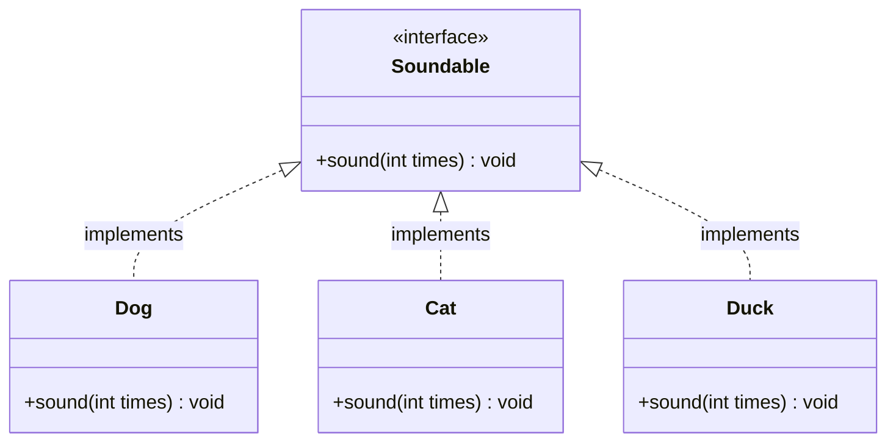

# 11. [클래스와 상속 - 11] 인터페이스의 탄생

## 1. 문제 설명

10번 문제에서 우리는 본문이 없고 선언만 존재하는 **'순수 가상 함수(= 0)'**와 이를 가진 **'추상 클래스'**를 배웠습니다.
만약 어떤 클래스가 일반 멤버변수나 일반 메서드를 전혀 갖지 않고, 오직 **순수 가상 함수로만 이루어진 100% 규격서**라면 어떨까요?

객체지향에서는 이를 **인터페이스(Interface)**라고 부릅니다.
인터페이스는 구체적인 작업 내용이 아니라, "이 클래스를 사용하는 사람은 최소한 이 기능들을 쓸 수 있다"라는 **표준 약속(Contract)**을 정의합니다.

아래는 소리를 내는 공통 규격인 `Soundable` 인터페이스와 이를 구현한 동물들의 관계입니다.



- **언어별 표현**:
  - **Java**: `interface Soundable`로 선언하고, 클래스에서 `implements Soundable` 키워드로 구현합니다.
  - **C++**: 모든 멤버 함수를 `virtual void sound(int times) = 0;`으로 선언한 순수 추상 클래스로 표현하며, `: public Soundable`로 상속받아 구현합니다.
  - **Python**: `abc.ABC`를 상속받고 `@abstractmethod` 데코레이터를 붙여 규격을 정의합니다.

동물 종류와 반복 횟수를 입력받아, `Soundable` 규격을 구현한 객체를 생성하고 소리를 출력하는 프로그램을 작성하세요.

### 🖥️ 예제 1 추적 (동물 = "Dog", 횟수 = 3일 때)
```text
1. "Dog" 입력 확인 -> Dog 객체 생성 (Soundable 인터페이스 구현체)
2. sound(3) 메서드 호출
3. Dog의 고유 소리 "Bark"를 3회 생성
4. 공백으로 구분하여 "Bark Bark Bark" 한 줄 출력
```

## 2. 입출력 설명

- **입력:**
  - 첫 번째 줄에 동물 종류 문자열 `T`가 주어집니다.
  - 두 번째 줄에 소리를 낼 횟수 정수 `N`이 주어집니다. (1 ≤ N ≤ 10)
  - 동물별 고유 소리 매핑:
    - `Dog` → `Bark`
    - `Cat` → `Meow`
    - `Duck` → `Quack`

- **출력:**
  - 해당 동물의 소리를 `N`번 공백으로 구분하여 한 줄에 출력합니다.

## 3. 예시

### 예시 입력 1
```text
Dog
3
```

### 예시 출력 1
```text
Bark Bark Bark
```

### 예시 입력 2
```text
Cat
2
```

### 예시 출력 2
```text
Meow Meow
```

### 예시 입력 3
```text
Duck
1
```

### 예시 출력 3
```text
Quack
```

## 4. 힌트

- **핵심 아이디어**: 인터페이스는 스스로 객체를 만들 수 없으며, 이를 구현(`implements`)한 구체 클래스만 인스턴스를 생성할 수 있습니다.
- **생각해볼 점**:
  1. 규격 인터페이스에 정의된 메서드 시그니처(`sound(int times)`)를 각 클래스가 누락 없이 오버라이딩했는가?
  2. 단순 분기문(`if-else`)만으로 문자열을 찍기보다, 규격을 따르는 객체를 직접 만들고 메서드를 호출했는가?
