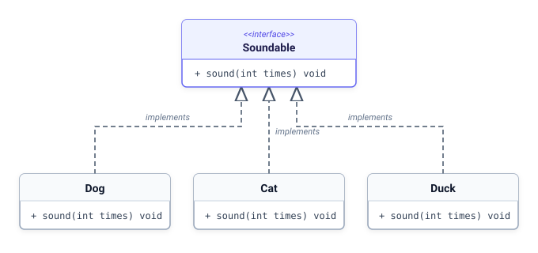

# 11. [클래스와 상속] 인터페이스의 탄생

## 1. 문제 설명

우리는 본문이 없고 선언만 존재하는 **추상 메서드(순수 가상 함수)**와 이를 가진 **추상 클래스**를 배웠습니다.
만약 어떤 클래스가 일반 멤버변수나 일반 구현 메서드를 전혀 갖지 않고, 오직 **추상 메서드로만 이루어진 100% 규격서**라면 어떨까요?

객체지향에서는 이를 **인터페이스(Interface)**라고 부릅니다.
인터페이스는 구체적인 작업 내용이 아니라, "이 클래스를 사용하는 사람은 최소한 이 기능들을 쓸 수 있다"라는 **표준 규격(Contract)**을 정의합니다.

아래는 소리를 내는 공통 규격인 `Soundable` 인터페이스와 이를 구현한 동물들의 관계입니다.



- **언어별 표현**:
  - **Java**: `interface Soundable`로 선언하고, 클래스에서 `implements Soundable` 키워드로 구현합니다.
  - **C++**: 모든 멤버 함수를 `virtual void sound(int times) = 0;`으로 선언한 순수 추상 클래스로 표현하며, `: public Soundable`로 상속받아 구현합니다.
  - **Python**: `abc.ABC`를 상속받고 `@abstractmethod` 데코레이터를 붙여 규격을 정의합니다.

### 🖥️ 예제 1 추적 (`Dog`, `3` 입력 시)
- **1단계 (객체 생성)**: 동물 종류 `Dog`를 확인하고, `Soundable` 인터페이스 규격을 구현한 `Dog` 인스턴스를 생성합니다.
- **2단계 (메서드 호출)**: 규격에 정의된 `sound(3)` 메서드를 실행합니다.
- **3단계 (동작 수행)**: `Dog` 클래스의 구현 로직에 따라 울음소리 `Bark`를 3회 반복 출력합니다: `Bark Bark Bark`

---

## 2. 입출력 설명

* **입력:**
동물의 울음소리 규격인 Soundable 인터페이스를 정의합니다.

Soundable 규격을 따르는 Dog, Cat, Duck 클래스를 만듭니다.
- `Dog` → "Bark"
- `Cat` → "Meow"
- `Duck` → "Quack"

동물 종류와 횟수 N을 입력받아 해당 동물 객체를 생성하고 sound 메서드를 실행합니다.

* **출력:**
해당 동물의 울음소리를 N번 공백으로 구분하여 한 줄에 출력합니다.

---

## 3. 예시

### 예시 입력 1
```text
Dog
3
```

### 예시 출력 1
```text
Bark Bark Bark
```

### 예시 입력 2
```text
Cat
2
```

### 예시 출력 2
```text
Meow Meow
```

### 예시 입력 3
```text
Duck
1
```

### 예시 출력 3
```text
Quack
```

---

## 4. 힌트
- **핵심 아이디어**: 인터페이스는 스스로 직접 객체를 생성할 수 없으며, 규격을 온전히 구현한 구체 클래스를 통해 인스턴스를 생성해야 합니다.
- **생각해볼 점**:
  1. 각 언어별로 클래스가 인터페이스 규격을 구현할 때 어떤 키워드와 문법(`implements`, `: public`, 상속)을 사용하는지 확인해 보세요.
  2. 인터페이스에 선언된 순수 가상/추상 메서드가 구체 클래스에서 빠짐없이 구현되어 있는지 점검해 보세요.

---

## C++ Template

```c++
#include <iostream>
#include <string>

using namespace std;

// 소리를 내는 순수 규격 클래스 (인터페이스)
class Soundable
{
public:
	virtual void sound(int times) 빈칸;
	virtual ~Soundable() {}
};

class Dog : public Soundable
{
public:
	void sound(int times) override
	{
		for (int i = 0; i < times; i++) {
			cout << "Bark" << (i == times - 1 ? "" : " ");
		}
		cout << endl;
	}
};

class Cat : public Soundable
{
public:
	void sound(int times) override
	{
		for (int i = 0; i < times; i++) {
			cout << "Meow" << (i == times - 1 ? "" : " ");
		}
		cout << endl;
	}
};

class Duck : public Soundable
{
public:
	void sound(int times) override
	{
		for (int i = 0; i < times; i++) {
			cout << "Quack" << (i == times - 1 ? "" : " ");
		}
		cout << endl;
	}
};

int main()
{
	string type;
	int n;
	if (!(cin >> type >> n)) return 0;

	Soundable* animal = nullptr;
	if (type == "Dog") animal = new Dog();
	else if (type == "Cat") animal = new Cat();
	else if (type == "Duck") animal = new Duck();

	if (animal != nullptr) {
		animal->sound(n);
		delete animal;
	}

	return 0;
}
```

## Java Template

```java
import java.util.Scanner;

// 소리를 내는 규격 인터페이스
interface Soundable {
    void sound(int times);
}

class Dog 빈칸 Soundable {
    @Override
    public void sound(int times) {
        for (int i = 0; i < times; i++) {
            System.out.print("Bark" + (i == times - 1 ? "" : " "));
        }
        System.out.println();
    }
}

class Cat implements Soundable {
    @Override
    public void sound(int times) {
        for (int i = 0; i < times; i++) {
            System.out.print("Meow" + (i == times - 1 ? "" : " "));
        }
        System.out.println();
    }
}

class Duck implements Soundable {
    @Override
    public void sound(int times) {
        for (int i = 0; i < times; i++) {
            System.out.print("Quack" + (i == times - 1 ? "" : " "));
        }
        System.out.println();
    }
}

public class Main {
    public static void main(String[] args) {
        Scanner sc = new Scanner(System.in);
        if (!sc.hasNext()) return;
        String type = sc.next();
        int n = sc.nextInt();

        Soundable animal = null;
        if (type.equals("Dog")) animal = new Dog();
        else if (type.equals("Cat")) animal = new Cat();
        else if (type.equals("Duck")) animal = new Duck();

        if (animal != null) {
            animal.sound(n);
        }
    }
}
```

## Python3 Template

```python
from abc import ABC, abstractmethod

class Soundable(ABC):
    @abstractmethod
    def sound(self, times: int):
        빈칸

class Dog(Soundable):
    def sound(self, times: int):
        print(" ".join(["Bark"] * times))

class Cat(Soundable):
    def sound(self, times: int):
        print(" ".join(["Meow"] * times))

class Duck(Soundable):
    def sound(self, times: int):
        print(" ".join(["Quack"] * times))

type_str = input().strip()
n = int(input().strip())

animal = None
if type_str == "Dog":
    animal = Dog()
elif type_str == "Cat":
    animal = Cat()
elif type_str == "Duck":
    animal = Duck()

if animal:
    animal.sound(n)
```
