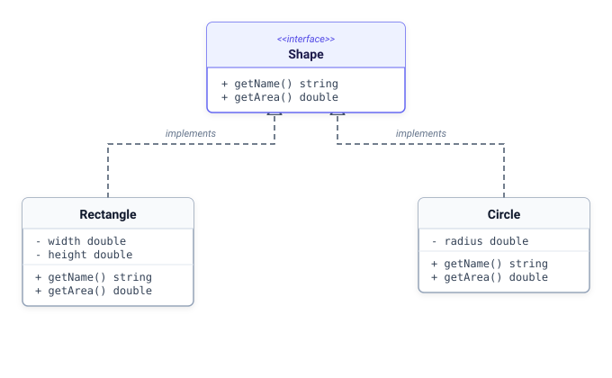

# 13. [클래스와 상속] 인터페이스와 다형성

## 1. 문제 설명

인터페이스의 가장 큰 장점은 **다형성(Polymorphism)**입니다.
인터페이스 타입의 참조 변수 하나로, 그 규격을 구현한 어떤 클래스의 객체라도 가리킬(업캐스팅) 수 있습니다.

호출 코드는 `shape->getArea()` 하나뿐이지만, 실제로 어떤 구현 객체가 연결되어 있느냐에 따라 서로 다른 계산식이 동작합니다.



### 🖥️ 예제 1 추적 (`T = 1`, `5 8` 입력 시)
- **1단계 (다형적 참조 선언)**: 인터페이스 규격인 `Shape` 타입의 참조 변수를 선언합니다.
- **2단계 (객체 생성 및 업캐스팅)**: `T = 1`이므로 가로 5, 세로 8인 `Rectangle` 인스턴스를 생성하여 `Shape` 변수에 연결합니다.
- **3단계 (다형적 호출)**: `shape->getName()`으로 `"Rectangle"`을 얻고, `shape->getArea()`로 사각형 넓이 계산($5 \times 8 = 40.00$)을 실행합니다.

---

## 2. 입출력 설명

* **입력:**
도형 규격 Shape 인터페이스를 정의합니다.
Shape를 구현하는 Rectangle(사각형)과 Circle(원) 클래스를 만듭니다.
- `Rectangle`: 가로 W, 세로 H -> 넓이 = W * H
- `Circle`: 반지름 R -> 넓이 = 3.14 * R * R

도형 종류 코드 T(1: 사각형, 2: 원)와 크기 정보를 입력받습니다.
Shape 타입의 참조 변수를 사용하여 도형 객체를 가리키고 메서드를 실행합니다.

* **출력:**
첫째 줄에 도형 이름(Rectangle 또는 Circle)을 출력합니다.
둘째 줄에 계산된 넓이를 소수점 둘째 자리까지 서식(%.2f)에 맞춰 출력합니다.

---

## 3. 예시

### 예시 입력 1
```text
1
5 8
```

### 예시 출력 1
```text
Rectangle
40.00
```

### 예시 입력 2
```text
2
10
```

### 예시 출력 2
```text
Circle
314.00
```

---

## 4. 힌트
- **핵심 아이디어**: 특정 구체 클래스 타입이 아닌 상위 인터페이스 타입으로 변수를 선언하면, 실행 시점에 다양한 구현 객체를 하나의 변수에 유연하게 연결할 수 있습니다.
- **생각해볼 점**:
  1. 다양한 자식 객체들을 두루 가리킬 참조 변수의 타입으로 무엇을 지정해야 하는지 생각해 보세요.
  2. 객체가 바뀌어도 호출하는 메서드 이름(`getName`, `getArea`)은 왜 동일하게 유지될 수 있는지 다형성의 원리를 점검해 보세요.
---

## C++ Template

```c++
#include <iostream>
#include <string>
#include <iomanip>

using namespace std;

class Shape
{
public:
	virtual string getName() = 0;
	virtual double getArea() = 0;
	virtual ~Shape() {}
};

class Rectangle : public Shape
{
private:
	double width, height;
public:
	Rectangle(double w, double h) : width(w), height(h) {}
	string getName() override { return "Rectangle"; }
	double getArea() override { return width * height; }
};

class Circle : public Shape
{
private:
	double radius;
public:
	Circle(double r) : radius(r) {}
	string getName() override { return "Circle"; }
	double getArea() override { return 3.14 * radius * radius; }
};

int main()
{
	int t;
	if (!(cin >> t)) return 0;

	// Shape 인터페이스 포인터로 다형적 참조
	빈칸* shape = nullptr;

	if (t == 1) {
		double w, h;
		cin >> w >> h;
		shape = new Rectangle(w, h);
	} else if (t == 2) {
		double r;
		cin >> r;
		shape = new Circle(r);
	}

	if (shape != nullptr) {
		cout << shape->getName() << endl;
		cout << fixed << setprecision(2) << shape->getArea() << endl;
		delete shape;
	}

	return 0;
}
```

## Java Template

```java
import java.util.Scanner;

interface Shape {
    String getName();
    double getArea();
}

class Rectangle implements Shape {
    private double width, height;

    public Rectangle(double width, double height) {
        this.width = width;
        this.height = height;
    }

    @Override
    public String getName() {
        return "Rectangle";
    }

    @Override
    public double getArea() {
        return width * height;
    }
}

class Circle implements Shape {
    private double radius;

    public Circle(double radius) {
        this.radius = radius;
    }

    @Override
    public String getName() {
        return "Circle";
    }

    @Override
    public double getArea() {
        return 3.14 * radius * radius;
    }
}

public class Main {
    public static void main(String[] args) {
        Scanner sc = new Scanner(System.in);
        if (!sc.hasNextInt()) return;
        int t = sc.nextInt();

        // 인터페이스 타입 참조 변수 선언
        빈칸 shape = null;

        if (t == 1) {
            double w = sc.nextDouble();
            double h = sc.nextDouble();
            shape = new Rectangle(w, h);
        } else if (t == 2) {
            double r = sc.nextDouble();
            shape = new Circle(r);
        }

        if (shape != null) {
            System.out.println(shape.getName());
            System.out.printf("%.2f\n", shape.getArea());
        }
    }
}
```

## Python3 Template

```python
from abc import ABC, abstractmethod

class Shape(ABC):
    @abstractmethod
    def getName(self) -> str:
        pass

    @abstractmethod
    def getArea(self) -> float:
        pass

class Rectangle(Shape):
    def __init__(self, w: float, h: float):
        self.width = w
        self.height = h

    def getName(self) -> str:
        return "Rectangle"

    def getArea(self) -> float:
        return self.width * self.height

class Circle(Shape):
    def __init__(self, r: float):
        self.radius = r

    def getName(self) -> str:
        return "Circle"

    def getArea(self) -> float:
        return 3.14 * self.radius * self.radius

line = input().strip()
if line:
    t = int(line)
    shape: 빈칸 = None
    if t == 1:
        w, h = map(float, input().split())
        shape = Rectangle(w, h)
    elif t == 2:
        r = float(input().strip())
        shape = Circle(r)

    if shape:
        print(shape.getName())
        print(f"{shape.getArea():.2f}")
```
