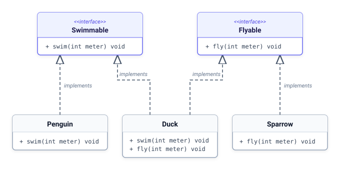

# 15. [클래스와 상속] 다중 구현

## 1. 문제 설명

자바나 파이썬, C++ 등 객체지향 언어에서 클래스 간의 다중 상속은 부모 클래스들 간의 멤버 충돌(다이아몬드 상속 문제)을 유발할 수 있습니다.
하지만 인터페이스는 실제 구현 코드가 없는 순수 규격이므로 충돌 위험이 없어 **한 클래스가 여러 인터페이스를 동시에 구현(다중 구현)**할 수 있습니다.




### 🖥️ 예제 2 추적 (`Penguin`, `fly 20` 입력 시)
- **1단계 (객체 생성)**: 동물 이름 `Penguin`을 확인하고 `Penguin` 인스턴스를 생성합니다.
- **2단계 (규격 지원 검사)**: 요청된 동작 `fly`에 대응하는 `Flyable` 규격을 `Penguin` 객체가 구현하고 있는지 검사합니다.
- **3단계 (예외 분기 처리)**: `Penguin`은 `Swimmable`만 구현하고 `Flyable`은 구현하지 않았으므로, 비행 메서드 대신 불가 메시지를 출력합니다: `Penguin cannot fly!`

---

## 2. 입출력 설명

* **입력:**
Swimmable(수영)과 Flyable(비행) 인터페이스를 정의합니다.
동물별 구현 능력:
- `Duck` → `Swimmable`, `Flyable` 둘 다 구현
- `Penguin` → `Swimmable`만 구현
- `Sparrow` → `Flyable`만 구현

동물 이름과 명령 동작(swim/fly), 거리 D를 입력받습니다.
해당 동물이 지원하는 인터페이스인지 검사한 후 동작 메서드를 호출합니다.

* **출력:**
지원하는 동작인 경우: `[Animal] swims [D]m` 또는 `[Animal] flies [D]m`
지원하지 않는 동작인 경우: `[Animal] cannot [Action]!`

---

## 3. 예시

### 예시 입력 1
```text
Duck
swim 50
```

### 예시 출력 1
```text
Duck swims 50m
```

### 예시 입력 2
```text
Penguin
fly 20
```

### 예시 출력 2
```text
Penguin cannot fly!
```

### 예시 입력 3
```text
Duck
fly 100
```

### 예시 출력 3
```text
Duck flies 100m
```

---

## 4. 힌트
- **핵심 아이디어**: 한 클래스는 여러 개의 인터페이스 규격을 동시에 상속받아 구현할 수 있으며, 런타임에 특정 규격을 만족하는지 타입 검사를 수행할 수 있습니다.
- **생각해볼 점**:
  1. 두 개 이상의 인터페이스를 동시에 상속/구현할 때 선언부에 쉼표(`,`)를 어떻게 배치하는지 확인해 보세요.
  2. 객체가 특정 인터페이스 타입을 만족하는지 판별하는 각 언어의 타입 검사 연산자(`instanceof`, `dynamic_cast`, `isinstance`)를 떠올려 보세요.
---

## C++ Template

```c++
#include <iostream>
#include <string>

using namespace std;

class Swimmable
{
public:
	virtual void swim(int meter) = 0;
	virtual ~Swimmable() {}
};

class Flyable
{
public:
	virtual void fly(int meter) = 0;
	virtual ~Flyable() {}
};

// Duck은 수영과 비행을 모두 다중 상속(구현)합니다.
class Duck : public Swimmable, 빈칸
{
public:
	void swim(int meter) override { cout << "Duck swims " << meter << "m" << endl; }
	void fly(int meter) override { cout << "Duck flies " << meter << "m" << endl; }
};

class Penguin : public Swimmable
{
public:
	void swim(int meter) override { cout << "Penguin swims " << meter << "m" << endl; }
};

class Sparrow : public Flyable
{
public:
	void fly(int meter) override { cout << "Sparrow flies " << meter << "m" << endl; }
};

int main()
{
	string animal_name, action;
	int d;
	if (!(cin >> animal_name >> action >> d)) return 0;

	if (action == "swim") {
		Swimmable* swimmer = nullptr;
		if (animal_name == "Duck") swimmer = new Duck();
		else if (animal_name == "Penguin") swimmer = new Penguin();

		if (swimmer != nullptr) {
			swimmer->swim(d);
			delete swimmer;
		} else {
			cout << animal_name << " cannot swim!" << endl;
		}
	} else if (action == "fly") {
		Flyable* flyer = nullptr;
		if (animal_name == "Duck") flyer = new Duck();
		else if (animal_name == "Sparrow") flyer = new Sparrow();

		if (flyer != nullptr) {
			flyer->fly(d);
			delete flyer;
		} else {
			cout << animal_name << " cannot fly!" << endl;
		}
	}

	return 0;
}
```

## Java Template

```java
import java.util.Scanner;

interface Swimmable {
    void swim(int meter);
}

interface Flyable {
    void fly(int meter);
}

// Duck 클래스는 Swimmable과 Flyable을 모두 구현합니다.
class Duck implements Swimmable, 빈칸 {
    @Override
    public void swim(int meter) {
        System.out.println("Duck swims " + meter + "m");
    }

    @Override
    public void fly(int meter) {
        System.out.println("Duck flies " + meter + "m");
    }
}

class Penguin implements Swimmable {
    @Override
    public void swim(int meter) {
        System.out.println("Penguin swims " + meter + "m");
    }
}

class Sparrow implements Flyable {
    @Override
    public void fly(int meter) {
        System.out.println("Sparrow flies " + meter + "m");
    }
}

public class Main {
    public static void main(String[] args) {
        Scanner sc = new Scanner(System.in);
        if (!sc.hasNext()) return;
        String animalName = sc.next();
        String action = sc.next();
        int d = sc.nextInt();

        Object obj = null;
        if (animalName.equals("Duck")) obj = new Duck();
        else if (animalName.equals("Penguin")) obj = new Penguin();
        else if (animalName.equals("Sparrow")) obj = new Sparrow();

        if (action.equals("swim")) {
            if (obj instanceof Swimmable) {
                ((Swimmable) obj).swim(d);
            } else {
                System.out.println(animalName + " cannot swim!");
            }
        } else if (action.equals("fly")) {
            if (obj instanceof Flyable) {
                ((Flyable) obj).fly(d);
            } else {
                System.out.println(animalName + " cannot fly!");
            }
        }
    }
}
```

## Python3 Template

```python
from abc import ABC, abstractmethod

class Swimmable(ABC):
    @abstractmethod
    def swim(self, meter: int):
        pass

class Flyable(ABC):
    @abstractmethod
    def fly(self, meter: int):
        pass

# Duck은 두 인터페이스를 모두 다중 상속합니다.
class Duck(Swimmable, 빈칸):
    def swim(self, meter: int):
        print(f"Duck swims {meter}m")
    def fly(self, meter: int):
        print(f"Duck flies {meter}m")

class Penguin(Swimmable):
    def swim(self, meter: int):
        print(f"Penguin swims {meter}m")

class Sparrow(Flyable):
    def fly(self, meter: int):
        print(f"Sparrow flies {meter}m")

line1 = input().strip()
if line1:
    animal_name = line1
    action, d_str = input().split()
    d = int(d_str)

    obj = None
    if animal_name == "Duck":
        obj = Duck()
    elif animal_name == "Penguin":
        obj = Penguin()
    elif animal_name == "Sparrow":
        obj = Sparrow()

    if action == "swim":
        if isinstance(obj, Swimmable):
            obj.swim(d)
        else:
            print(f"{animal_name} cannot swim!")
    elif action == "fly":
        if isinstance(obj, Flyable):
            obj.fly(d)
        else:
            print(f"{animal_name} cannot fly!")
```
