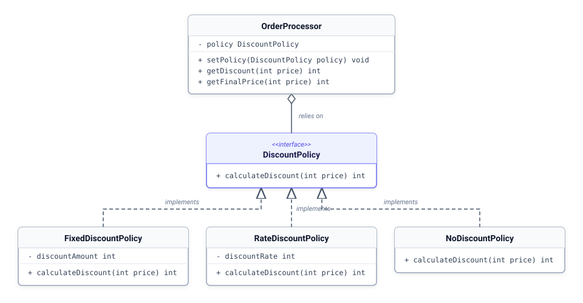

# 18. [클래스와 상속] 실전 응용: 전략 패턴

## 1. 문제 설명

실무에서 인터페이스를 사용하는 가장 결정적인 이유는 **코드 간의 결합도(Coupling)를 낮추어 유지보수성을 극대화하기 위함**입니다.
어떤 클래스가 구체적인 구현 클래스에 직접 의존하지 않고 오직 인터페이스 규격에만 의존하게 만들면, 프로그램 실행 도중에도 알고리즘이나 비즈니스 규칙(전략)을 부품 갈아 끼우듯 자유롭게 교체할 수 있습니다. 이를 객체지향 디자인 패턴에서는 **전략 패턴(Strategy Pattern)** 이라고 부릅니다.





---

## 2. 입출력 설명

* **입력:**
할인 정책 규격 DiscountPolicy 인터페이스를 정의합니다.
- `calculateDiscount(int price)`: 원가를 받아 할인 금액을 계산하여 반환

구체 할인 전략 클래스들을 구현합니다.
- `FixedDiscountPolicy`: 고정 F원 할인 (단, 할인액이 원가를 초과할 경우 원가만큼만 할인)
- `RateDiscountPolicy`: 원가의 R% 정률 할인 (`price * R / 100`)
- `NoDiscountPolicy`: 0원 할인

주문 처리기 OrderProcessor는 DiscountPolicy 인터페이스 타입 멤버를 두고, setPolicy 메서드로 전략을 교체 주입받아 최종 결제 금액을 계산합니다.

상품 가격 Price, 전략 타입 Type(1: 정액, 2: 정률, 3: 없음), 파라미터 Param을 입력받습니다.

* **출력:**
- 1줄: `Discount: [할인금액]`
- 2줄: `Final Price: [최종금액]`

---

## 3. 예시

### 예시 입력 1
```text
50000
1
12000
```

### 예시 출력 1
```text
Discount: 12000
Final Price: 38000
```

### 예시 입력 2
```text
80000
2
15
```

### 예시 출력 2
```text
Discount: 12000
Final Price: 68000
```

### 예시 입력 3
```text
30000
1
50000
```

### 예시 출력 3
```text
Discount: 30000
Final Price: 0
```

### 예시 입력 4
```text
25000
3
0
```

### 예시 출력 4
```text
Discount: 0
Final Price: 25000
```

---

## 4. 힌트
- **핵심 아이디어**: 구체적인 할인 구현 클래스가 아닌 최상위 할인 정책 규격(인터페이스)에 의존해야 런타임에 전략 객체를 유연하게 교체 주입받을 수 있습니다.
- **생각해볼 점**:
  1. `OrderProcessor`가 어떤 특정 전략에 얽매이지 않기 위해 멤버 변수와 setter 메서드 매개변수의 타입을 무엇으로 선언해야 할지 생각해 보세요.
  2. 새로운 할인 정책 클래스가 추가되더라도 `OrderProcessor`의 내부 코드를 전혀 수정할 필요가 없는 이유를 점검해 보세요.
---

## C++ Template

```c++
#include <iostream>
#include <algorithm>

using namespace std;

class DiscountPolicy
{
public:
	virtual int calculateDiscount(int price) = 0;
	virtual ~DiscountPolicy() {}
};

class FixedDiscountPolicy : public DiscountPolicy
{
private:
	int discountAmount;
public:
	FixedDiscountPolicy(int amount) : discountAmount(amount) {}
	int calculateDiscount(int price) override
	{
		return min(price, discountAmount);
	}
};

class RateDiscountPolicy : public DiscountPolicy
{
private:
	int discountRate;
public:
	RateDiscountPolicy(int rate) : discountRate(rate) {}
	int calculateDiscount(int price) override
	{
		return price * discountRate / 100;
	}
};

class NoDiscountPolicy : public DiscountPolicy
{
public:
	int calculateDiscount(int price) override
	{
		return 0;
	}
};

// 인터페이스에 의존하는 주문 처리기
class OrderProcessor
{
private:
	DiscountPolicy* policy;
public:
	OrderProcessor() : policy(nullptr) {}

	// 전략 객체를 동적으로 교체 주입받습니다.
	void setPolicy(빈칸* newPolicy)
	{
		this->policy = newPolicy;
	}

	int getDiscount(int price)
	{
		if (policy == nullptr) return 0;
		return policy->calculateDiscount(price);
	}

	int getFinalPrice(int price)
	{
		return price - getDiscount(price);
	}
};

int main()
{
	int price, type, param;
	if (!(cin >> price >> type >> param)) return 0;

	DiscountPolicy* policy = nullptr;
	if (type == 1) policy = new FixedDiscountPolicy(param);
	else if (type == 2) policy = new RateDiscountPolicy(param);
	else if (type == 3) policy = new NoDiscountPolicy();

	OrderProcessor processor;
	processor.setPolicy(policy);

	cout << "Discount: " << processor.getDiscount(price) << endl;
	cout << "Final Price: " << processor.getFinalPrice(price) << endl;

	if (policy != nullptr) delete policy;

	return 0;
}
```

## Java Template

```java
import java.util.Scanner;

interface DiscountPolicy {
    int calculateDiscount(int price);
}

class FixedDiscountPolicy implements DiscountPolicy {
    private int discountAmount;

    public FixedDiscountPolicy(int amount) {
        this.discountAmount = amount;
    }

    @Override
    public int calculateDiscount(int price) {
        return Math.min(price, discountAmount);
    }
}

class RateDiscountPolicy implements DiscountPolicy {
    private int discountRate;

    public RateDiscountPolicy(int rate) {
        this.discountRate = rate;
    }

    @Override
    public int calculateDiscount(int price) {
        return price * discountRate / 100;
    }
}

class NoDiscountPolicy implements DiscountPolicy {
    @Override
    public int calculateDiscount(int price) {
        return 0;
    }
}

// 인터페이스에 의존하는 주문 처리기
class OrderProcessor {
    // 구체 클래스가 아닌 인터페이스 타입으로 멤버를 선언합니다.
    private DiscountPolicy policy;

    public void setPolicy(빈칸 policy) {
        this.policy = policy;
    }

    public int getDiscount(int price) {
        if (policy == null) return 0;
        return policy.calculateDiscount(price);
    }

    public int getFinalPrice(int price) {
        return price - getDiscount(price);
    }
}

public class Main {
    public static void main(String[] args) {
        Scanner sc = new Scanner(System.in);
        if (!sc.hasNextInt()) return;
        int price = sc.nextInt();
        int type = sc.nextInt();
        int param = sc.nextInt();

        DiscountPolicy policy = null;
        if (type == 1) policy = new FixedDiscountPolicy(param);
        else if (type == 2) policy = new RateDiscountPolicy(param);
        else if (type == 3) policy = new NoDiscountPolicy();

        OrderProcessor processor = new OrderProcessor();
        processor.setPolicy(policy);

        System.out.println("Discount: " + processor.getDiscount(price));
        System.out.println("Final Price: " + processor.getFinalPrice(price));
    }
}
```

## Python3 Template

```python
from abc import ABC, abstractmethod

class DiscountPolicy(ABC):
    @abstractmethod
    def calculateDiscount(self, price: int) -> int:
        pass

class FixedDiscountPolicy(DiscountPolicy):
    def __init__(self, amount: int):
        self.discountAmount = amount

    def calculateDiscount(self, price: int) -> int:
        return min(price, self.discountAmount)

class RateDiscountPolicy(DiscountPolicy):
    def __init__(self, rate: int):
        self.discountRate = rate

    def calculateDiscount(self, price: int) -> int:
        return price * self.discountRate // 100

class NoDiscountPolicy(DiscountPolicy):
    def calculateDiscount(self, price: int) -> int:
        return 0

class OrderProcessor:
    def __init__(self):
        self.policy: 빈칸 = None

    def setPolicy(self, policy: DiscountPolicy):
        self.policy = policy

    def getDiscount(self, price: int) -> int:
        if not self.policy:
            return 0
        return self.policy.calculateDiscount(price)

    def getFinalPrice(self, price: int) -> int:
        return price - self.getDiscount(price)

lines = []
import sys
for line in sys.stdin:
    line = line.strip()
    if line:
        lines.append(line)

if len(lines) >= 3:
    price = int(lines[0])
    policy_type = int(lines[1])
    param = int(lines[2])

    policy = None
    if policy_type == 1:
        policy = FixedDiscountPolicy(param)
    elif policy_type == 2:
        policy = RateDiscountPolicy(param)
    elif policy_type == 3:
        policy = NoDiscountPolicy()

    processor = OrderProcessor()
    processor.setPolicy(policy)

    print(f"Discount: {processor.getDiscount(price)}")
    print(f"Final Price: {processor.getFinalPrice(price)}")
```
