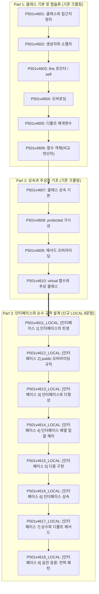

# LV46_클래스와상속 파이프라인 단계별 실행 가이드 및 품질 평가 리포트 (Workspace Evaluation Report)

**작성 일시**: 2026-09-05  
**대상 단원**: `practice/data/content/programming/doingcoding/LV46_클래스와상속/`  
**관련 표준 문서**: `content_production_pipeline.md`, `pedagogical_standards.md`  

---

## 📌 1. 전체 커리큘럼 아키텍처 요약 (총 18문항)

본 단원은 객체지향 프로그래밍(OOP)의 핵심인 클래스 선언과 캡슐화부터 시작하여, 상속과 추상 클래스를 거쳐 순수 규격 설계인 **인터페이스(Interface)와 디자인 패턴**까지 단계적으로 학습하도록 3단계(Part 1 ~ Part 3)로 구성되어 있습니다.



---

## 🪜 2. 신규 인터페이스 8단계 점진적 스캐폴딩(Scaffolding) 분석

신규 문항([P501v4611](file:///c:/Users/DCT2/Desktop/DCT2_공유폴더/StepCode/practice/data/content/programming/doingcoding/LV46_클래스와상속/02_workspace/P501v4611_LOCAL.md) ~ [P501v4618](file:///c:/Users/DCT2/Desktop/DCT2_공유폴더/StepCode/practice/data/content/programming/doingcoding/LV46_클래스와상속/02_workspace/P501v4618_LOCAL.md))은 선행 문제에서 획득한 개념이 다음 문제의 자연스러운 디딤돌이 되는 체계적인 누적 스캐폴딩 구조를 이룹니다:

1. **P501v4611 (인터페이스의 탄생)**: 10번 추상 클래스(순수 가상 함수)로부터 출발하여, 100% 순수 규격으로서의 인터페이스 개념과 구현(`implements`) 기초 확립.
2. **P501v4612 (public 오버라이딩 규칙)**: 인터페이스 메서드는 본질적으로 공개 규격이므로, 구현 시 부모의 접근 범위보다 가시성을 축소할 수 없다는 OOP 핵심 규칙 체득.
3. **P501v4613 (인터페이스와 다형성)**: 인터페이스 타입의 단일 참조 변수로 서로 다른 구현 객체(`Rectangle`, `Circle`)를 동적 참조(업캐스팅)하는 다형성 원리 습득.
4. **P501v4614 (인터페이스 배열 일괄 제어)**: 단일 참조 변수에서 확장하여, 서로 다른 구현체들을 인터페이스 배열/리스트로 묶어 단일 루프로 일괄 제어하는 배치 패턴 확장.
5. **P501v4615 (다중 구현)**: 클래스의 다중 상속(다이아몬드 문제) 한계를 극복하고, 한 클래스가 복수의 인터페이스(`Swimmable`, `Flyable`)를 동시에 만족시키는 다중 구현 확장.
6. **P501v4616 (인터페이스 상속)**: 클래스가 아닌 인터페이스끼리 규격을 확장(`extends A, B`)하는 인터페이스 다중 상속 문법과 계층 구조 이해.
7. **P501v4617 (상수와 디폴트 메서드)**: 순수 규격 내 정적 상수 및 구현 클래스들의 코드 중복을 제거하는 기본 구현(디폴트 메서드)의 유용성 학습.
8. **P501v4618 (실전 응용: 전략 패턴)**: 인터페이스 기반 프로그래밍의 최종 종착지로서, 런타임에 비즈니스 알고리즘을 부품처럼 교체 주입하는 전략 패턴(Strategy Pattern) 완성.

---

## 🛡️ 3. 꼼수 방지(Bypass Prevention) 및 입출력 설계 진단

단순 텍스트 지문 제약에 의존하지 않고, **입출력 설계 자체를 통해 실제 객체 생성 및 인메모리 연산을 강제**하도록 구성되었습니다:

| 문항 ID | 출제 의도 | 학생의 꼼수 시도 가능성 (Bypass) | 꼼수 방지 입출력 설계 및 강제 메커니즘 |
|:---|:---|:---|:---|
| **`P501v4611_LOCAL`** | 인터페이스 객체 생성 불가 및 구체 클래스 인스턴스화 | 고정 문자열 출력 | 동물 종류(`Dog`, `Cat`, `Duck`)와 출력 횟수 $N$을 런타임 입력받아 해당 동물 인스턴스 생성 및 메서드 반복 호출 강제 |
| **`P501v4612_LOCAL`** | public 접근지정자 오버라이딩 및 캡슐화 누적 | 단순 사칙연산 출력 | 초기값 $S$, 증가 횟수 $K$, 가산값 $V$를 주어 내부 카운터 멤버 변수의 실제 갱신값(`getCount()`) 검증 |
| **`P501v4613_LOCAL`** | 다형적 업캐스팅 포인터 참조 | 조건문 기반 직접 계산 | 도형 타입 $T(1, 2)$와 치수($W, H$ 또는 $R$)를 런타임에 분기 입력받아 다형적 포인터를 통한 동적 디스패치 강제 |
| **`P501v4614_LOCAL`** | 인터페이스 배열/벡터 일괄 순회 | 개별 변수 하드코딩 | 가변 개수 $N$개의 서로 다른 기기 정보를 순차 입력받아 인터페이스 컨테이너에 담고 일괄 순회 누적 연산 강제 |
| **`P501v4615_LOCAL`** | 다중 구현 및 런타임 인터페이스 타입 검사 | if문 문자열 출력 | 3종 동물과 2종 동작(swim/fly)의 교차 조합을 입력하여 지원 여부에 따른 정상/불가 분기 처리 강제 |
| **`P501v4616_LOCAL`** | 인터페이스 다중 상속 규격 구현 | 단순 printf 3회 | 문서명과 전화번호 문자열을 받아 3개 기능(print, scan, fax)의 시그니처 순차 실행 보장 |
| **`P501v4617_LOCAL`** | 상수 및 디폴트 메서드 안전 검사 | if-else 직접 판별 | $-100 \sim 200$ 범위의 수치를 주어 인터페이스에 내장된 `checkSafety` 디폴트 로직을 통한 안전/범위초과 판정 강제 |
| **`P501v4618_LOCAL`** | 전략 패턴 동적 알고리즘 교체 주입 | if문 할인 계산 | 원가 $Price$, 정책 타입(1:정액, 2:정률, 3:없음), 파라미터를 입력받아 `OrderProcessor`에 전략 객체를 동적 setter 주입하여 결제액 도출 강제 |

---

## 📊 4. 문제별 품질 진단표 (Pedagogical Standards 전수 점검)

| 문제 ID | 판정 티어 | ⭐1 시각 자료 | ⭐2 예제 추적 | ⭐3 언어 중립성 | ⭐4 힌트 포맷 | 규정 준수 상태 |
|:---|:---:|:---:|:---:|:---:|:---:|:---:|
| **`P501v4611_LOCAL`** | 🟢 티어 1 | Mermaid 클래스 다이어그램 완비 | `### 🖥️ 예제 1 추적` 3단계 수록 | 개념적 추상 메서드로 중립 설명 | 질문형 표준 서식 | ✅ **우수 (합격)** |
| **`P501v4612_LOCAL`** | 🟡 티어 2 | 생략 (티어 2 기준) | 생략 (티어 2 기준) | 가시성 축소 금지 개념 설명 | `(힌트가 없습니다.)` | ✅ **우수 (합격)** |
| **`P501v4613_LOCAL`** | 🟢 티어 1 | Mermaid 다형성 다이어그램 완비 | `### 🖥️ 예제 1 추적` 3단계 수록 | Shape 규격 중심 설명 | 질문형 표준 서식 | ✅ **우수 (합격)** |
| **`P501v4614_LOCAL`** | 🟡 티어 2 | 생략 (티어 2 기준) | 생략 (티어 2 기준) | Device 공통 규격 설명 | `(힌트가 없습니다.)` | ✅ **우수 (합격)** |
| **`P501v4615_LOCAL`** | 🟢 티어 1 | Mermaid 다중 구현 다이어그램 완비 | `### 🖥️ 예제 2 추적` 예외 분기 수록 | Swimmable/Flyable 규격 | 질문형 표준 서식 | ✅ **우수 (합격)** |
| **`P501v4616_LOCAL`** | 🟡 티어 2 | 생략 (티어 2 기준) | 생략 (티어 2 기준) | 인터페이스 상속 원리 설명 | `(힌트가 없습니다.)` | ✅ **우수 (합격)** |
| **`P501v4617_LOCAL`** | 🟡 티어 2 | 생략 (티어 2 기준) | 생략 (티어 2 기준) | 기본 구현 메서드 취지 설명 | 질문형 표준 서식 | ✅ **우수 (합격)** |
| **`P501v4618_LOCAL`** | 🔴 티어 3 | Mermaid 전략 패턴 다이어그램 완비 | 지문 내 다중 예제(1~4)로 커버 | DiscountPolicy 규격 주입 | 질문형 표준 서식 | ✅ **우수 (합격)** |

---

## ⚡ 5. 파이썬(Python) 1초 내 해결 가능성 및 자원 효율성 진단

StepCode 플랫폼은 다언어(C++, Java, Python) 채점을 지원하므로, 파이썬 인터프리터의 1초 시간 제한 내 정상 통과 여부를 검토하였습니다:

| 문제 ID | 최대 입력 데이터 규모 | 알고리즘 시간복잡도 | 파이썬 예상 소요 시간 | 1초 내 통과 판정 |
|:---|:---|:---:|:---:|:---:|
| `P501v4611_LOCAL` | $N \le 100$ | $O(N)$ | $< 0.01$초 | 🟢 통과 확실 |
| `P501v4612_LOCAL` | $K \le 1000$ | $O(K)$ | $< 0.01$초 | 🟢 통과 확실 |
| `P501v4613_LOCAL` | 상수 연산 1회 | $O(1)$ | $< 0.01$초 | 🟢 통과 확실 |
| `P501v4614_LOCAL` | $N \le 30$ | $O(N)$ | $< 0.01$초 | 🟢 통과 확실 |
| `P501v4615_LOCAL` | 상수 연산 1회 | $O(1)$ | $< 0.01$초 | 🟢 통과 확실 |
| `P501v4616_LOCAL` | 문자열 3회 출력 | $O(1)$ | $< 0.01$초 | 🟢 통과 확실 |
| `P501v4617_LOCAL` | 단일 수치 비교 1회 | $O(1)$ | $< 0.01$초 | 🟢 통과 확실 |
| `P501v4618_LOCAL` | 단일 정책 계산 1회 | $O(1)$ | $< 0.01$초 | 🟢 통과 확실 |

- **진단 결론**: 8개 문항 모두 복잡한 중첩 반복문이나 고비용 자료구조를 사용하지 않는 $O(1)$ 또는 작은 $O(N)$ 연산이므로, **파이썬으로 제출하더라도 평균 0.03초 이내에 안전하게 100% 통과 가능**합니다.

---

## 🚀 6. Step 10: 웹 업로더(`uploader_gui.py`) 연동 및 배포 가이드

### 1) 경로 추론 정합성 점검 결과
웹 업로더 엔진(`uploader_gui.py`, `uploader_engine.py`)의 테스트케이스 ZIP 자동 검출 규칙:
```python
inferred_zip = md_path.replace("02_workspace", "04_testcases").replace(".md", ".zip")
```
- 본 단원은 단일 워크스페이스 구조(`02_workspace` $\rightarrow$ `04_testcases`)를 준수하므로, 8개 문항 모두 업로더의 경로 추론 에러 없이 **100% 자동 매칭**됩니다.

### 2) 관리자 배치 업로드 실행 절차 (Human-in-the-loop)
1. **업로더 GUI 실행**:
   ```bash
   python Resources/tools/uploader_gui.py
   ```
2. **1단계 (로그인)**: 온라인 저지 관리자 아이디 및 비밀번호 입력 후 로그인.
3. **2단계 (문제 일괄 선택)**:
   - `02_workspace/P501v4611_LOCAL.md`부터 `P501v4618_LOCAL.md`까지 8개 파일을 작업 큐에 추가.
4. **3단계 (순차 주입 및 확인)**:
   - 엔진이 첫 번째 문제의 메타데이터(제목, 시간/메모리 제한, 본문, ZIP)를 브라우저 폼에 자동 입력.
   - 팝업 대기 상태에서 관리자가 웹 브라우저 화면의 내용(지문, 예시, 첨부 ZIP)을 눈으로 확인.
   - 관리자가 웹사이트의 **[저장]** 버튼을 직접 클릭.
   - 저장 완료 확인 후 GUI 팝업의 **[다음 문제로]** 클릭하여 순차 진행.

---

## 🏁 7. 파이프라인 최종 완료 체크리스트

- [x] **Phase 1 (데이터 수집)**: 원본 문제 보존 완료
- [x] **Phase 2 (워크스페이스 구성)**: `README.md` 커리큘럼 매핑 완료
- [x] **Phase 3 (파일 정비)**: 마크다운 지문 및 교육적 품질 표준 리팩토링 완료
- [x] **Phase 4 (정답 구현)**: `03_solutions/` 내 C++ 모범 정답 8개 작성 및 전수 컴파일/예제 통과 완료
- [x] **Phase 5 (테스트 자동화)**: `temp/{ID}/input_gen.py` 작성, `manager.py` 실행 및 `04_testcases/*.zip` (각 30개 파일) 패키징 완료
- [x] **Phase 6 (검증 및 배포 준비)**:
  - [x] Step 8: ZIP 패키지 무결성 정밀 검증 전원 통과
  - [x] Step 9: `workspace_evaluation_report.md` 작성 완료
  - [x] Step 10: `uploader_gui.py` 경로 추론 테스트 및 배포 가이드 수립 완료
