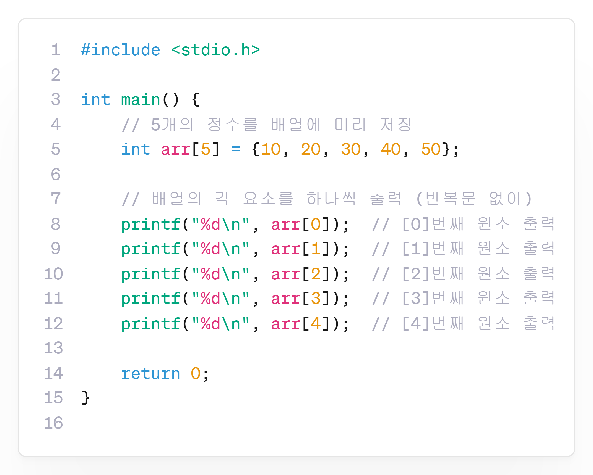
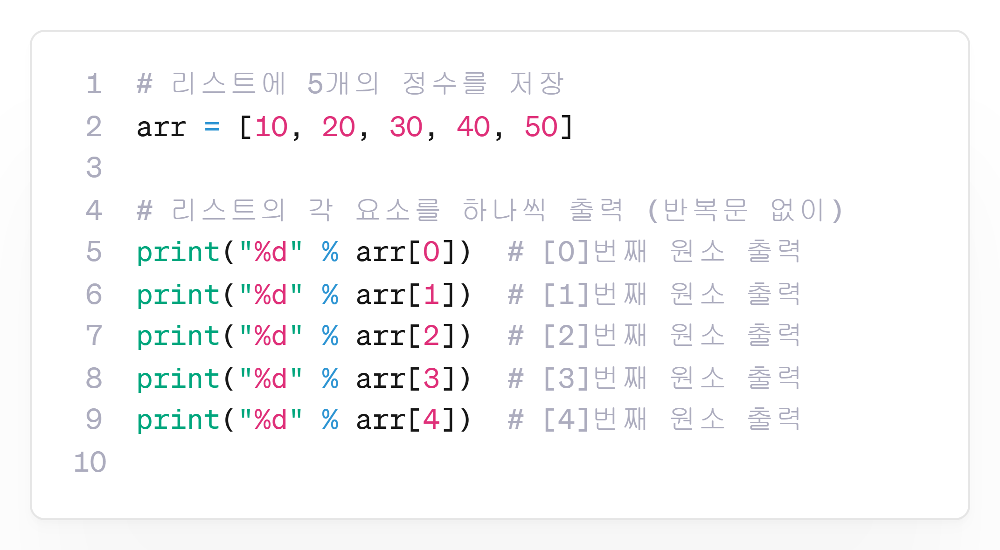
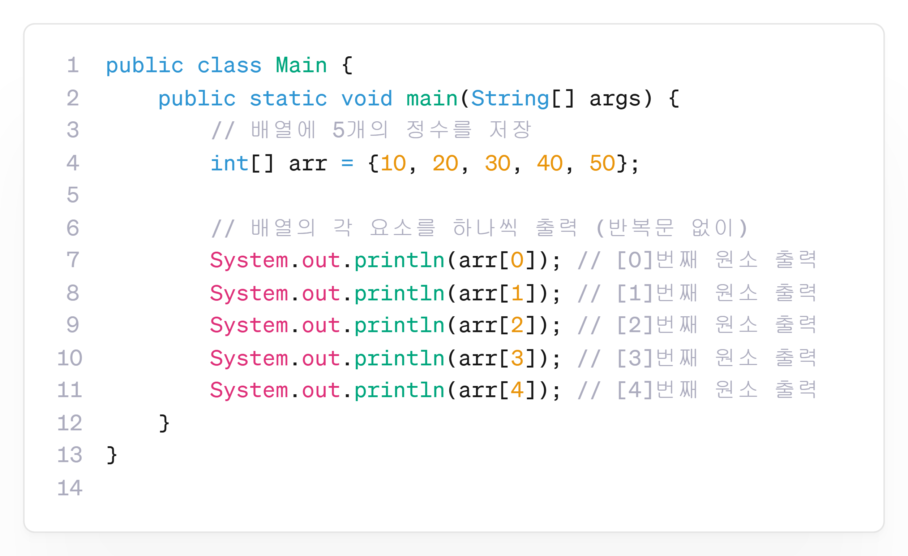

---
id: "P101v1001"
db_id: 1910
legacy_id: "P101v1001"
title: "01. [배열-1] 숫자 5개를 미리 저장하고 출력하기"
platform: "doingcoding"
level: "Low"
tags:
  - "Lv10 배열(1차)"
authors:
  - "root"
supported_languages:
  - "C"
  - "C++"
  - "Golang"
  - "Java"
  - "Python2"
  - "Python3"
time_limit: "1s"
memory_limit: "256MB"
accepted_user_count: 93
has_hint: "true"
archived_at: "2026-06-19"
---

# 01. [배열-1] 숫자 5개를 미리 저장하고 출력하기

## 1. 문제 설명
정수 배열에 5개의 숫자 10, 20, 30, 40, 50을 저장한 뒤, 순서대로 출력하는 프로그램을 작성하세요.

반복문 없이 출력하세요.

---

## 2. 입출력 설명

* **입력:**
입력은 없습니다.

* **출력:**
숫자 5개를 한 줄에 하나씩 출력합니다.

---

## 3. 예시
### 예시 입력 1
```text
  
```

### 예시 출력 1
```text
10  
20  
30  
40  
50
```

---

## 4. 힌트
### **[C 언어]**

배열은`int arr[5] = {10, 20, 30, 40, 50};`처럼 선언합니다.각 요소는`arr[0]`,`arr[1]`, ...,`arr[4]`로 접근할 수 있습니다.`printf`를 이용해 각각 출력하세요.



---

### 

### **[파이썬]**

리스트는`arr = [10, 20, 30, 40, 50]`처럼 선언합니다.`arr[0]`,`arr[1]`, ...,`arr[4]`로 요소를 출력할 수 있습니다.`print()`를 사용해 각각 출력하세요.



---

### **[Java]**

배열은`int[] arr = {10, 20, 30, 40, 50};`로 배열을 선언할 수 있습니다.`System.out.println(arr[0]);`처럼 각 인덱스로 접근하여 출력하세요.


---

