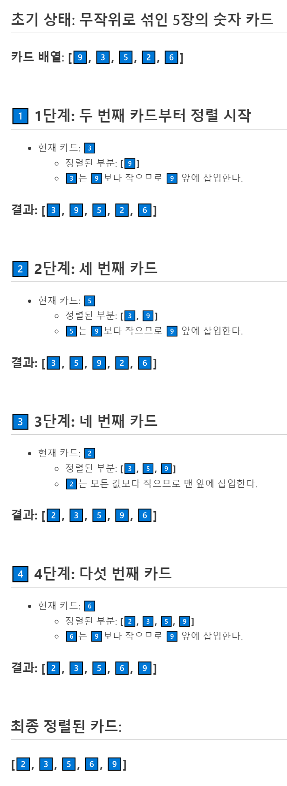
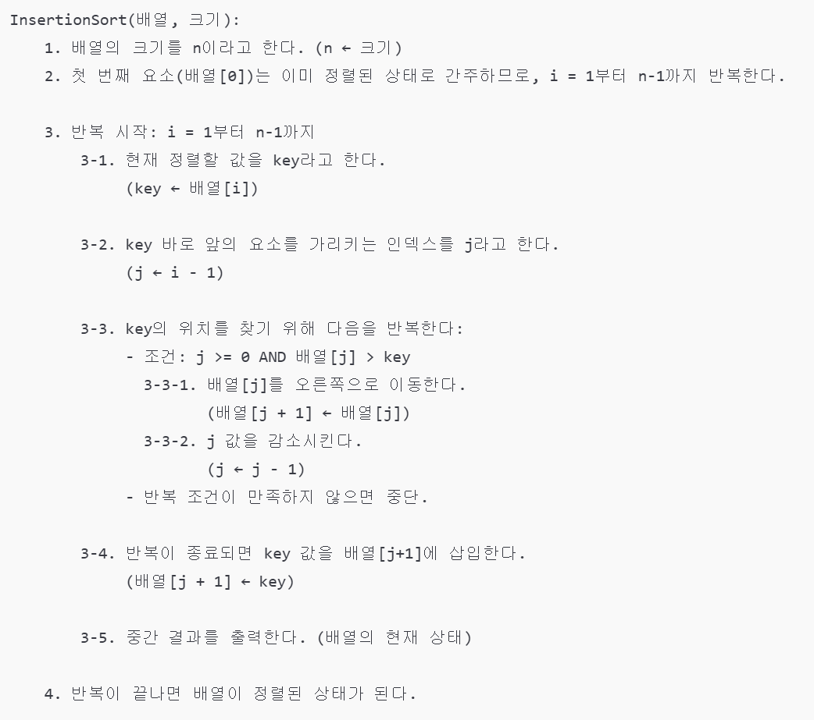
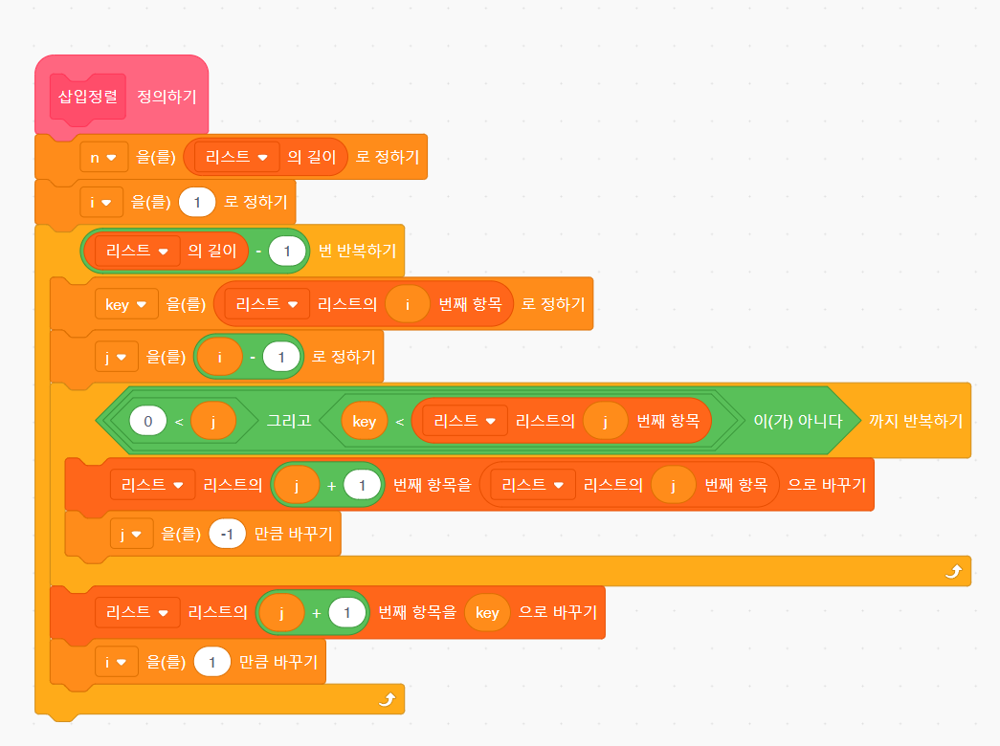

---
id: "P101v1047"
db_id: 1766
legacy_id: "P101v1047"
title: "47. [배열-정렬1] 삽입정렬 튜토리얼"
platform: "doingcoding"
level: "Low"
tags:
  - "Lv10 배열(1차)"
authors:
  - "root"
supported_languages:
  - "C"
  - "C++"
  - "Golang"
  - "Java"
  - "Python2"
  - "Python3"
time_limit: "1s"
memory_limit: "256MB"
accepted_user_count: 65
has_hint: "true"
archived_at: "2026-06-19"
---

# 47. [배열-정렬1] 삽입정렬 튜토리얼

## 1. 문제 설명
배열은 데이터를 여러개를 동시에 저장할 수 있는 자료구조라고 배워왔습니다.

그러나, 데이터를 내부적으로 정렬하기 위해서는 직접 반복문을 사용하여 구현이 필요합니다.

### **[삽입정렬(Insertion Sort)]**

데이터가 순서가 없는 상태로 섞여있다고 가정해봅시다.

이 때, 2번째 데이터부터**기존의 데이터 사이에 올 수 있는 위치를 찾아서 삽입하여 정렬**하는 기법을 삽입정렬이라 합니다.

---

예를 들어,[9️⃣, 3️⃣, 5️⃣, 2️⃣, 6️⃣] 카드 배열을 정렬하려면 다음과 같은 과정이 필요합니다:

### 

---

### 

### **[슈도코드]**

이를 프로그래밍 문법으로 쓰기 전에, 작동 과정을 프로그래밍 규칙에 맞게 언어로 작성해봅시다.

이를**슈도코드(pseudo code)**라고 합니다.

위의 삽입정렬의 과정을 슈도코드라 표현하면 다음과 같습니다:



또한, 다음과 같이 블록코딩으로도 표현이 가능합니다.



---

## 2. 입출력 설명

* **입력:**
첫번째 줄에는 배열의 길이를 나타내는 정수 N이 주어집니다. N은 1 이상 25 이하입니다.

두번째 줄에는 N개수만큼 정수가 추가 입력됩니다.

* **출력:**
첫번째 줄에는입력한 모든 값을 출력합니다.

두번째 줄부터는 삽입정렬이 진행될 때마다 배열을 출력합니다.

**출력의 마지막에는 모두 공백문자가 있어야합니다.**

---

## 3. 예시
### 예시 입력 1
```text
5
9 6 3 2 5
```

### 예시 출력 1
```text
9 6 3 2 5 
6 9 3 2 5 
3 6 9 2 5 
2 3 6 9 5 
2 3 5 6 9 
```

### 예시 입력 2
```text
6
8 1 1 1 1 1
```

### 예시 출력 2
```text
8 1 1 1 1 1 
1 8 1 1 1 1 
1 1 8 1 1 1 
1 1 1 8 1 1 
1 1 1 1 8 1 
1 1 1 1 1 8 
```

---

## 4. 힌트
각 언어(C, PYTHON, JAVA)마다 작성된 템플릿을 읽고 제출해봅시다.
---

