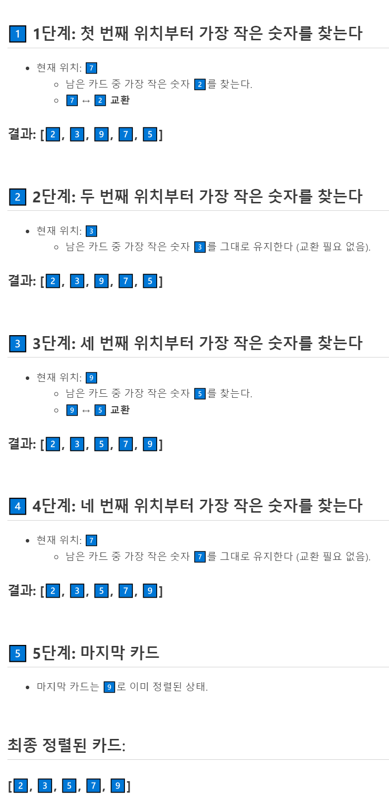
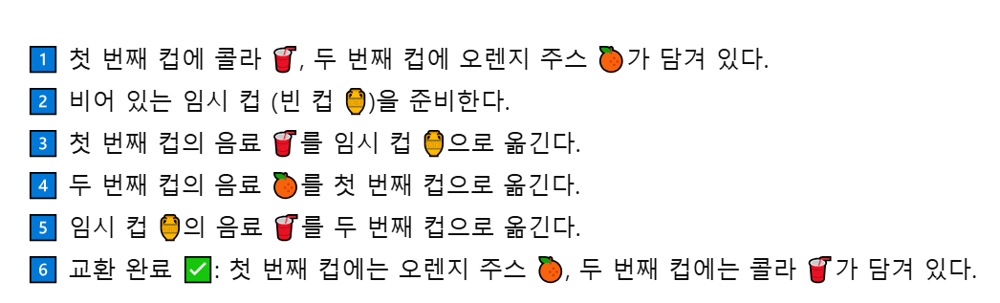
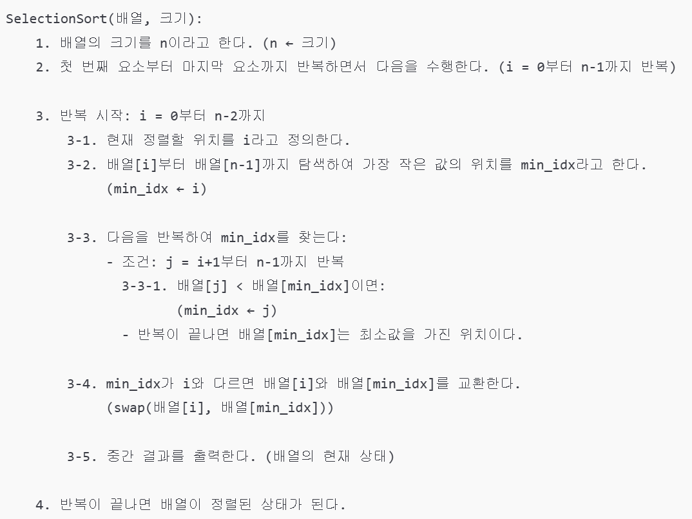

---
id: "P101v1048"
db_id: 1767
legacy_id: "P101v1048"
title: "48. [배열-정렬2] 선택정렬 튜토리얼"
platform: "doingcoding"
level: "Low"
tags:
  - "Lv10 배열(1차)"
authors:
  - "root"
supported_languages:
  - "C"
  - "C++"
  - "Golang"
  - "Java"
  - "Python2"
  - "Python3"
time_limit: "1s"
memory_limit: "256MB"
accepted_user_count: 56
has_hint: "true"
archived_at: "2026-06-19"
---

# 48. [배열-정렬2] 선택정렬 튜토리얼

## 1. 문제 설명
### **[선택 정렬(Selection Sort)]**

데이터가 순서가 없는 상태로 섞여있다고 가정해봅시다.

이 때, 첫번째 데이터 부터 2번째 이후**구간의 최소값과 값을 교환하여 정렬**하는 기법을 선택정렬이라 합니다.

---

예를 들어,[7️⃣, 3️⃣, 9️⃣, 2️⃣, 5️⃣]카드 배열을 정렬하려면 다음과 같은 과정이 필요합니다:



---

### 

### **[교환(swap)]**

변수는 하나의 값만 저장이 가능합니다.

하지만, 두 변수의 값을 각각 교환하려면 어떻게 해야할까요?

예를 들어, 컵 2개에 각각 다른 음료가 들어있다고 가정합시다.

1번 컵에는 콜라, 2번 컵에는 오렌지 주스가 들어있을 때 이 2개를 섞지않고 바꾸려합니다.

임시로 사용할 빈 컵을 추가로 사용하면, 교환이 가능합니다:



위의 과정을 프로그래밍 코드로 표현하면, 다음과 같은 과정으로 표현이 가능합니다:


### **[슈도코드]**

위의 선택정렬의 과정을 슈도코드라 표현하면 다음과 같습니다:



---

## 2. 입출력 설명

* **입력:**
첫번째 줄에는 배열의 길이를 나타내는 정수 N이 주어집니다. N은 1 이상 25 이하입니다.

두번째 줄에는 N개수만큼 정수가 추가 입력됩니다.

* **출력:**
첫번째 줄에는입력한 모든 값을 출력합니다.

두번째 줄부터는 선택정렬이 진행될 때마다 배열을 출력합니다.

**출력의 마지막에는 모두 공백문자가 있어야합니다.**

---

## 3. 예시
### 예시 입력 1
```text
5
7 3 9 2 5
```

### 예시 출력 1
```text
7 3 9 2 5 
2 3 9 7 5 
2 3 9 7 5 
2 3 5 7 9 
2 3 5 7 9 
```

### 예시 입력 2
```text
6
7 3 3 3 3 3
```

### 예시 출력 2
```text
7 3 3 3 3 3 
3 7 3 3 3 3 
3 3 7 3 3 3 
3 3 3 7 3 3 
3 3 3 3 7 3 
3 3 3 3 3 7 
```

---

## 4. 힌트
각 언어(C, PYTHON, JAVA)마다 작성된 템플릿을 읽고 제출해봅시다.
---

