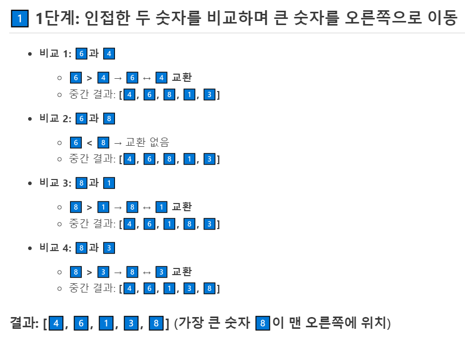
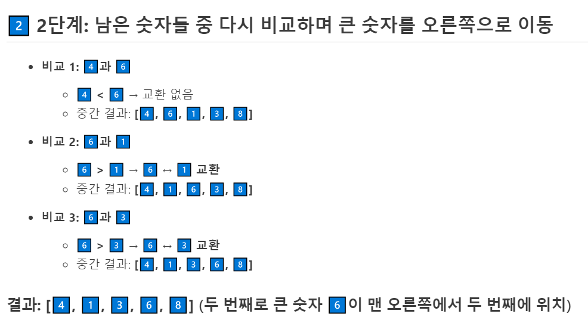
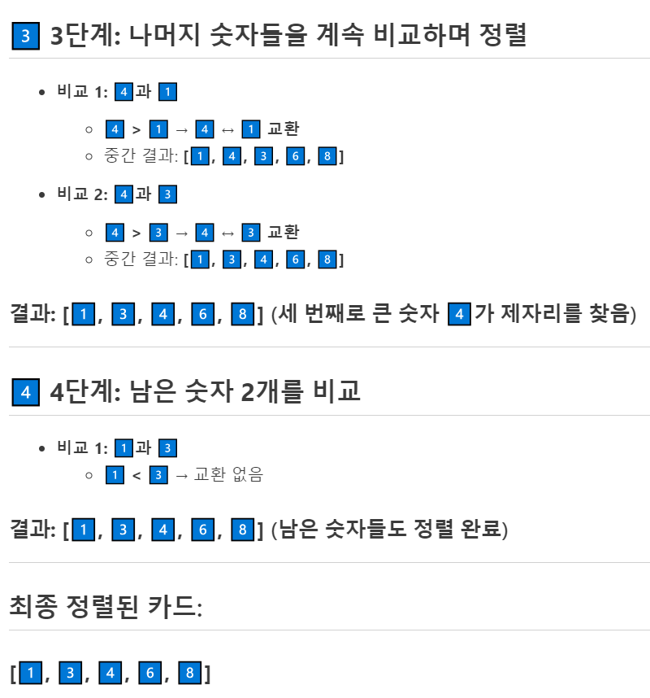
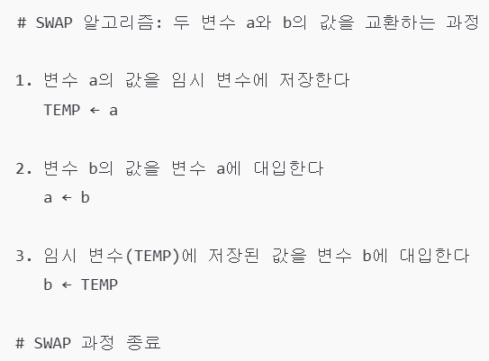
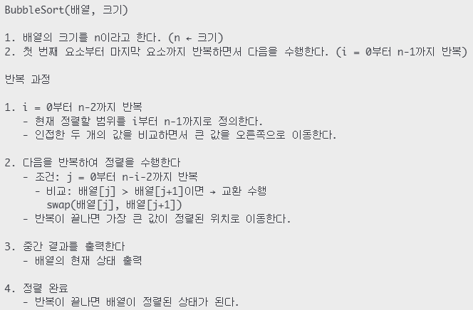

---
id: "P101v1049"
db_id: 1768
legacy_id: "P101v1049"
title: "49. [배열-정렬3] 버블정렬 튜토리얼"
platform: "doingcoding"
level: "Low"
tags:
  - "Lv10 배열(1차)"
authors:
  - "root"
supported_languages:
  - "C"
  - "C++"
  - "Golang"
  - "Java"
  - "Python2"
  - "Python3"
time_limit: "1s"
memory_limit: "256MB"
accepted_user_count: 56
has_hint: "true"
archived_at: "2026-06-19"
---

# 49. [배열-정렬3] 버블정렬 튜토리얼

## 1. 문제 설명
### **[버블 정렬(Bubble Sort)]**

데이터가 순서가 없는 상태로 섞여있다고 가정해봅시다.

이 때, 인접한 두 숫자를 비교 및 교환하여 큰 숫자를 오른쪽으로 이동하는 기법을 버블정렬이라 합니다.

---

예를 들어,[**6️⃣,****4️⃣, 8️⃣, 1️⃣, 3️⃣**]카드 배열을 정렬하려면 다음과 같은 과정이 필요합니다:







지난[선택정렬](http://edu.doingcoding.com/problem/P101v1029)에서도 사용한 교환(SWAP)이 필수적으로 적용됩니다.



### **[슈도코드]**

위의 버블정렬의 과정을 슈도코드라 표현하면 다음과 같습니다:



---

## 2. 입출력 설명

* **입력:**
첫번째 줄에는 배열의 길이를 나타내는 정수 N이 주어집니다. N은 1 이상 25 이하입니다.

두번째 줄에는 N개수만큼 정수가 추가 입력됩니다.

* **출력:**
첫번째 줄에는입력한 모든 값을 출력합니다.

두번째 줄부터는 버블정렬이 진행될 때마다 배열을 출력합니다.

**출력의 마지막에는 모두 공백문자가 있어야합니다.**

---

## 3. 예시
### 예시 입력 1
```text
5
4 2 5 1 3
```

### 예시 출력 1
```text
4 2 5 1 3 
2 4 1 3 5 
2 1 3 4 5 
1 2 3 4 5 
1 2 3 4 5

```

### 예시 입력 2
```text
5
100 2 3000 1 500
```

### 예시 출력 2
```text
100 2 3000 1 500 
2 100 1 500 3000  
2 1 100 500 3000  
1 2 100 500 3000  
1 2 100 500 3000  
1 2 100 500 3000  

```

---

## 4. 힌트
각 언어(C, PYTHON, JAVA)마다 작성된 템플릿을 읽고 제출해봅시다.
---

