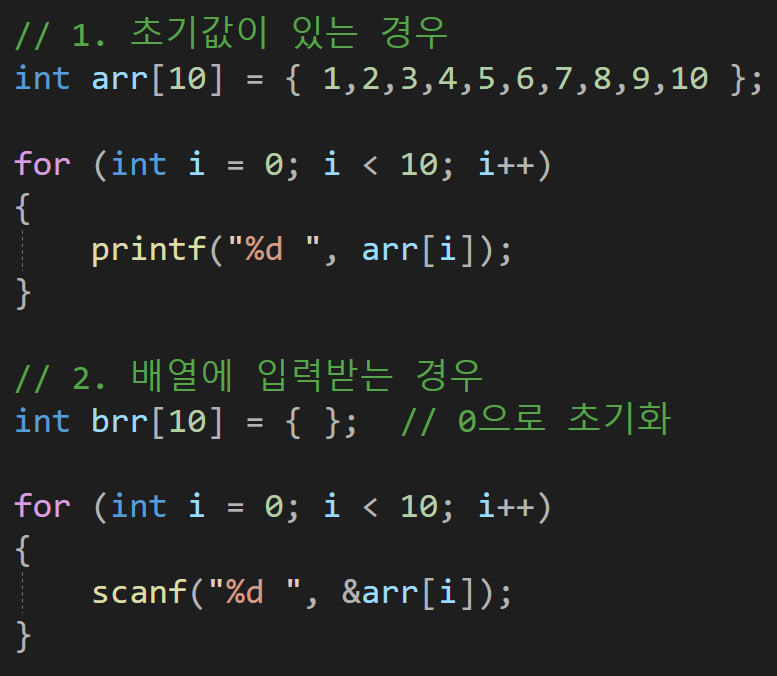
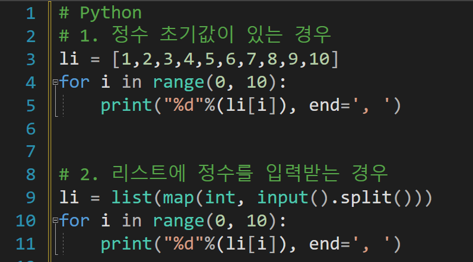
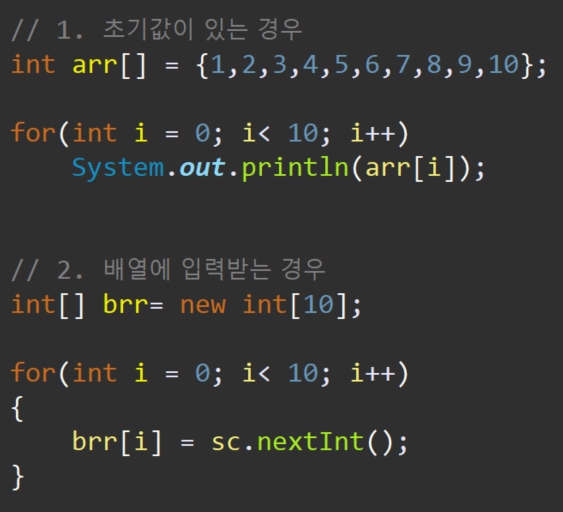

---
id: "SP101v1001"
db_id: 382
legacy_id: "SP101v1001"
title: "01. [배열-1] 정수형 배열변수 초기값지정 후 출력"
platform: "doingcoding"
level: "Low"
tags:
  - "SLv10 배열(1차)"
authors:
  - "root"
supported_languages:
  - "C"
  - "C++"
  - "Golang"
  - "Java"
  - "Python2"
  - "Python3"
time_limit: "1s"
memory_limit: "256MB"
accepted_user_count: 595
has_hint: "true"
archived_at: "2026-06-19"
---

# 01. [배열-1] 정수형 배열변수 초기값지정 후 출력

## 1. 문제 설명
10개의 정수를 저장할 수 있는 배열변수를 만들어서

23, 14, -12, 6, -4, 0, 1, -10, 4, 19

를 저장하고 순서대로 출력합니다.

---

## 2. 입출력 설명

* **입력:**
입력은 없습니다.

* **출력:**
저장되어 있는 초기값을 순서대로 출력합니다.

---

## 3. 예시
### 예시 입력 1
```text
 
```

### 예시 출력 1
```text
23, 14, -12, 6, -4, 0, 1, -10, 4, 19, 
```

---

## 4. 힌트
배열은 변수의 확장개념으로 많은 변수를 한번에 만들기 위함에 있습니다.

배열 변수를 정의하는 방법은

타입 변수이름[개수] = {초기값};

기본 변수에 숫자 또는 문자를 초기화 했다면

여러개의 변수를 묶어서 한번에 저장하기 때문에 중괄호 '{', '}'로 묶어서 초기화 합니다.

사용할때는 변수이름[index]

index는 0부터 카운트 됩니다. 배열은 자료가 많기 때문에 for 반복문을 사용하면 편합니다.

ex( printf("%d", arr[0]);

---

### **[C언어]**

### ****

---

### **[Python]**



---

### **[JAVA]**

****
---

