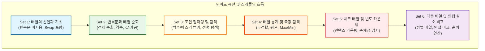

# Lv10 배열(1차) — 워크스페이스 교육 품질 감사 및 개선 리포트

> **단원**: Lv10 배열(1차) (48문제: 수업용 ALL 30문제 / 숙제용 SALL 18문제)
> **설계 원칙**: `배열 기초(반복문 미사용) → 반복문 순회(입출력/역순) → 조건 필터링/탐색 → 배열 통계/극값(Max/Min) → 체크 배열/빈도 카운팅 → 다중 배열 및 인접 원소 비교`
> **관련 가이드**: [pedagogical_standards.md](../pedagogical_standards.md), [content_production_pipeline.md](../content_production_pipeline.md)

---

## 1. 단원 전체의 6개 Set 구성 및 난이도 곡선 (스캐폴딩) 분석

기존 크롤링된 데이터는 총 86개(수업 49개, 숙제 37개)로, 중복과 유사 문항이 많고 후반부에 정렬 알고리즘이 등장하여 난이도 격차가 극심했습니다. 

단순히 기계적인 `수업 5 : 숙제 3` 압축 규칙을 지키기 위해 핵심 문제를 무조건 Drop할 경우, **인접 원소 비교, 다중/병렬 배열 순회, 문자 범위 필터링, Swap 알고리즘**과 같은 중요 프로그래밍 학습 패턴이 유실되는 문제가 있었습니다. 

이에 따라 규칙을 유연하게 조정하여 **6개의 Set**으로 확장하고, **수업용 30문제, 숙제용 18문제**로 최종 설계하여 학습의 계단을 촘촘히 재구성했습니다.

### 극심한 난이도 격차 문제 배제 (Drop 사유)
*   **정렬 알고리즘 (P101v1047 ~ 1049)**: 삽입/선택/버블 정렬은 중첩 루프(Double Loop)와 데이터 교환(Swap) 로직이 결합된 고난도 주제로, 1차원 배열 입문 단원의 난이도를 크게 초과합니다. 이는 추후 **정렬 전용 단원(예: Lv13 정렬)**으로 이동하여 격리 배치합니다.
*   **수영대회 1, 2등 찾기 (P101v1041)**: 공동 순위 처리 및 최댓값/두 번째 최댓값을 동시에 추적하는 로직은 조건 분기가 복잡하여 학습 초기 인지 부하를 가중시키므로 배제합니다.

---

## 2. 수업 문제(ALL)와 숙제 문제(SALL) 간의 관계 및 학습 연계 매핑

각 Set은 수업용(ALL) 문제로 개념을 계단식으로 학습하고, 숙제용(SALL) 문제를 통해 핵심 인지 도약 지점을 복습하고 검증하도록 매핑되었습니다.

```mermaid
graph TD
    subgraph "Set 1: 기초"
        P101["P101v1001 (기초 선언)"] --> SP101["SP101v1001 (문자 배열 복습)"]
        P104["P101v1004 (첫/끝 직접 참조)"] --> SP102["SP101v1002 (인덱스 계산 복습)"]
        P106["P101v1006 (값 교환 - Swap)"] --> SP103["SP101v1003 (기본 배열 선언 복습)"]
    end
    
    subgraph "Set 2: 순회"
        P107["P101v1007 (반복 순회 입출력)"] --> SP104["SP101v1004 (역순 출력 복습)"]
        P108["P101v1008 (N개 크기 처리)"] --> SP105["SP101v1005 (중간값 위치 복습)"]
        P111["P101v1011 (요소 2배 변경)"] --> SP106["SP101v1006 (가공 후 역순 복습)"]
    end
    
    subgraph "Set 3: 필터"
        P112["P101v1012 (짝수 필터링)"] --> SP107["SP101v1007 (홀수 필터링 복습)"]
        P113["P101v1013 (아스키 범위 필터)"] --> SP108["SP101v1008 (인덱스 필터링 복습)"]
        P117["P101v1017 (선형 탐색)"] --> SP109["SP101v1009 (다중 탐색 인덱스 복습)"]
    end

    subgraph "Set 4: 통계"
        P118["P101v1018 (평균 계산)"] --> SP110["SP101v1010 (N개 합/평균 복습)"]
        P119["P101v1019 (누적합 계산)"] --> SP111["SP101v1011 (N개 누적합 복습)"]
        P121["P101v1021 (Max 위치 추적)"] --> SP112["SP101v1012 (Max 인덱스 복습)"]
    end

    subgraph "Set 5: 카운팅"
        P123["P101v1023 (0/1 빈도 카운팅)"] --> SP113["SP101v1013 (투표 카운팅 복습)"]
        P125["P101v1025 (빠진 번호 찾기)"] --> SP114["SP101v1014 (출석부 체크 복습)"]
        P126["P101v1026 (학점 분류 카운트)"] --> SP115["SP101v1015 (알파벳 빈도 복습)"]
    end

    subgraph "Set 6: 고급"
        P128["P101v1028 (병렬 배열 순회)"] --> SP116["SP101v1016 (다중 배열 조건 복습)"]
        P129["P101v1029 (인접 원소 비교)"] --> SP117["SP101v1017 (인접비교 & 극값 복습)"]
        P130["P101v1030 (순위 연산 맛보기)"] --> SP118["SP101v1018 (빈도 Max 인덱스 복습)"]
    end
    
    style SP101 fill:#e3f2fd,stroke:#1e88e5
    style SP102 fill:#e3f2fd,stroke:#1e88e5
    style SP103 fill:#e3f2fd,stroke:#1e88e5
    style SP104 fill:#e8f5e9,stroke:#43a047
    style SP105 fill:#e8f5e9,stroke:#43a047
    style SP106 fill:#e8f5e9,stroke:#43a047
    style SP107 fill:#fffde7,stroke:#fdd835
    style SP108 fill:#fffde7,stroke:#fdd835
    style SP109 fill:#fffde7,stroke:#fdd835
    style SP110 fill:#fff3e0,stroke:#fb8c00
    style SP111 fill:#fff3e0,stroke:#fb8c00
    style SP112 fill:#fff3e0,stroke:#fb8c00
    style SP113 fill:#ffebee,stroke:#e53935
    style SP114 fill:#ffebee,stroke:#e53935
    style SP115 fill:#ffebee,stroke:#e53935
    style SP116 fill:#f3e5f5,stroke:#8e24aa
    style SP117 fill:#f3e5f5,stroke:#8e24aa
    style SP118 fill:#f3e5f5,stroke:#8e24aa
```

---

## 3. 문제별 품질 진단 결과

### 🟢 Set 1: 배열의 선언과 기초 (반복문 미사용)
*   **P101v1001 (숫자 5개 미리 저장하고 출력하기) [티어 1]**: 1D 배열 선언/초기화 메모리 구조도(Mermaid) 추가.
*   **P101v1002 (세 번째 위치의 값 출력하기) [티어 2]**: 0-based 인덱스 구조 설명 보완.
*   **P101v1003 (첫 번째 값을 100으로 바꾸기) [티어 2]**: 대입 연산자를 활용한 특정 방 값 수정 팁 제공.
*   **P101v1004 (첫 번째와 마지막 값 출력하기) [티어 2]**: 경계 인덱스 접근 훈련.
*   **P101v1005 (숫자 3개 입력받고 출력하기) [티어 2]**: `scanf` 단어를 배제하고 표준 입력 데이터를 배열에 담는 개념 명시.
*   **P101v1006 (첫 번째와 마지막 값 교환하기) [티어 2]**: **Swap 알고리즘 도입**. 임시 변수(`temp`)를 사용해 물컵을 바꾸는 논리 시각화.

### 🟢 Set 2: 반복문을 통한 배열 순회
*   **P101v1007 (시험 점수 5개 입력 후 출력하기) [티어 1]**: 루프 변수 `i`가 배열의 방 번호 역할을 하는 과정 Trace 테이블 추가. **출력 형식 불일치 버그(`arr[i]: val`) 수정**.
*   **P101v1008 (N개의 입력값 중 처음과 끝 출력) [티어 2]**: N 크기를 변수로 다루는 배열 순회 가이드라인.
*   **P101v1009 (10개 입력값 중 n번째 값 출력) [티어 2]**: 입력받은 $n$ 인덱스 검사 예외 처리 팁 제공.
*   **P101v1010 (소수형 배열변수 입력 후 역순 출력) [티어 2]**: 소수점 아래 자릿수 조절 팁 제공.
*   **P101v1011 (정수형 배열 입력 후 2배 저장 출력) [티어 2]**: 값을 단순 2배 출력하는 것이 아닌 배열 내부 데이터를 갱신하는 훈련.

### 🟢 Set 3: 배열 조건부 순회와 필터링
*   **P101v1012 (짝수만 출력하기) [티어 1]**: 조건 분기 필터링에 대한 Trace 추가.
*   **P101v1013 (대문자만 출력하기) [티어 2]**: 아스키 범위 비교 연산(`arr[i] >= 'A' && arr[i] <= 'Z'`) 가이드 추가.
*   **P101v1014 (인덱스가 짝수인 위치의 값 출력) [티어 2]**: 인덱스 `i` 자체를 이용한 조건 분기 학습.
*   **P101v1015 (인덱스도 짝수 값도 짝수이면 출력) [티어 2]**: 복합 논리 연산자(`&&`) 활용.
*   **P101v1016 (인덱스와 값이 같은 숫자 출력) [티어 2]**: `arr[i] == i` 논리 구조 분석.
*   **P101v1017 (특정 숫자의 위치 출력) [티어 2]**: 선형 탐색 완료 시 `break`를 이용한 조기 종료 힌트 제공.

### 🟢 Set 4: 배열 누적합 및 극값 탐색
*   **P101v1018 (정수 평균 구하기) [티어 1]**: 합산 누적기 패턴 시각화 및 실수(float) 형변환 주의 팁 제공.
*   **P101v1019 (숫자들의 누적합 출력) [티어 2]**: 순회하며 매 턴마다 중간 합계를 출력하는 패턴 학습.
*   **P101v1020 (가장 큰 수 출력) [티어 2]**: 최댓값 초기화 논리 가이드.
*   **P101v1021 (가장 큰 값의 위치 출력) [티어 2]**: 최댓값 갱신과 동시에 인덱스 위치를 변수에 백업하는 과정 Trace 제공.
*   **P101v1022 (최솟값 다음에 오는 수 출력하기) [티어 3]**: **최솟값 여러 개 등장 시 첫 최솟값 기준 처리 규정 명시**.

### 🟢 Set 5: 체크 배열과 빈도수 세기 (인덱스 카운팅)
*   **P101v1023 (동전의 앞뒤 개수 카운팅) [티어 1]**: **빈도수 배열 기초**. 값이 인덱스로 매핑(`count[coin]++`)되는 흐름 다이어그램 추가.
*   **P101v1024 (주사위 눈 개수 카운팅) [티어 2]**: 오프셋 인덱싱(1~6 범위를 배열에 저장하는 방법) 팁.
*   **P101v1025 (출석 부르지 않은 친구 찾기) [티어 2]**: `visited` boolean 체크 배열 개념 시각화.
*   **P101v1026 (학점별 인원수 세기) [티어 2]**: 문자를 인덱스로 환산하여 세는 기법 힌트 제공.
*   **P101v1027 (정렬 상태 유지하며 위치 찾기) [티어 3]**: 물리적 삽입(Shift) 없이 선형 탐색으로 내 위치(카운트)를 구하는 논리적 우회 힌트 탑재.

### 🟢 Set 6: 다중 배열 및 인접 원소 비교 (고급 패턴)
*   **P101v1028 (부호 반영하여 합 구하기) [티어 2]**: **병렬 배열 순회**. `absolutes[i]`와 `signs[i]`를 공동 루프 변수로 동시에 제어하는 흐름 시각화.
*   **P101v1029 (음계 판별) [티어 2]**: **인접 원소 비교**. 루프 내에서 `arr[i]`와 `arr[i-1]`을 비교할 때 발생하기 쉬운 인덱스 오버플로우(`arr[-1]`) 예방 경고 및 인덱스 1부터 루프를 시작하는 테크닉 교육.
*   **P101v1030 (달리기 등수 구하기) [티어 3]**: **중첩 루프(Double Loop) 맛보기**. 정렬 전단계로서 각 선수보다 빠르게 달린 선수를 세어 순위를 매기는 $O(N^2)$ 알고리즘 설계 힌트.

---

## 4. 개편 배치 상세 매핑 테이블 (ID 및 파일명 매칭)

### 1) 수업용 (ALL) 문제 매핑 (30문제)

| Set | 순번 | 기존 ID | 기존 파일명 | db_id | 신규 ID | 신규 파일명 | 역할 및 제목 |
|:---:|:---:|---|---|:---:|---|---|---|
| **Set 1** | 1 | P101v1001 | `P101v1001_1910.md` | 1910 | P101v1001 | `P101v1001_1910.md` | 숫자 5개 미리 저장하고 출력하기 |
| **Set 1** | 2 | P101v1004 | `P101v1004_1911.md` | 1911 | P101v1002 | `P101v1002_1911.md` | 세 번째 위치의 값 출력하기 |
| **Set 1** | 3 | P101v1005 | `P101v1005_1912.md` | 1912 | P101v1003 | `P101v1003_1912.md` | 첫 번째 값을 100으로 바꾸기 |
| **Set 1** | 4 | P101v1006 | `P101v1006_1955.md` | 1955 | P101v1004 | `P101v1004_1955.md` | 첫 번째와 마지막 값 출력하기 |
| **Set 1** | 5 | P101v1007 | `P101v1007_1914.md` | 1914 | P101v1005 | `P101v1005_1914.md` | 숫자 3개 입력받고 출력하기 |
| **Set 1** | 6 | P101v1008 | `P101v1008_1975.md` | 1975 | P101v1006 | `P101v1006_1975.md` | 첫 번째와 마지막 값 교환하기 (Swap) |
| **Set 2** | 7 | P101v1009 | `P101v1009_1956.md` | 1956 | P101v1007 | `P101v1007_1956.md` | 시험 점수 5개 입력 후 출력하기 |
| **Set 2** | 8 | P101v1011 | `P101v1011_389.md` | 389 | P101v1008 | `P101v1008_389.md` | N개의 입력값 중 처음과 끝 출력 |
| **Set 2** | 9 | P101v1012 | `P101v1012_390.md` | 390 | P101v1009 | `P101v1009_390.md` | 10개 입력값 중 n번째 값 출력 |
| **Set 2** | 10 | P101v1018 | `P101v1018_385.md` | 385 | P101v1010 | `P101v1010_385.md` | 소수형 배열변수 입력 후 역순 출력 |
| **Set 2** | 11 | P101v1019 | `P101v1019_383.md` | 383 | P101v1011 | `P101v1011_383.md` | 정수형 배열 입력 후 2배 저장 출력 |
| **Set 3** | 12 | P101v1020 | `P101v1020_1957.md` | 1957 | P101v1012 | `P101v1012_1957.md` | 짝수만 출력하기 |
| **Set 3** | 13 | P101v1022 | `P101v1022_1969.md` | 1969 | P101v1013 | `P101v1013_1969.md` | 대문자만 출력하기 |
| **Set 3** | 14 | P101v1023 | `P101v1023_1968.md` | 1968 | P101v1014 | `P101v1014_1968.md` | 인덱스가 짝수인 위치의 값 출력 |
| **Set 3** | 15 | P101v1025 | `P101v1025_1974.md` | 1974 | P101v1015 | `P101v1015_1974.md` | 인덱스도 짝수 값도 짝수이면 출력 |
| **Set 3** | 16 | P101v1026 | `P101v1026_1973.md` | 1973 | P101v1016 | `P101v1016_1973.md` | 인덱스와 값이 같은 숫자 출력 |
| **Set 3** | 17 | P101v1028 | `P101v1028_391.md` | 391 | P101v1017 | `P101v1017_391.md` | 특정 숫자의 위치 출력 |
| **Set 4** | 18 | P101v1016 | `P101v1016_1959.md` | 1959 | P101v1018 | `P101v1018_1959.md` | 정수 평균 구하기 |
| **Set 4** | 19 | P101v1015 | `P101v1015_1970.md` | 1970 | P101v1019 | `P101v1019_1970.md` | 숫자들의 누적합 출력 |
| **Set 4** | 20 | P101v1029 | `P101v1029_1962.md` | 1962 | P101v1020 | `P101v1020_1962.md` | 가장 큰 수 출력 |
| **Set 4** | 21 | P101v1031 | `P101v1031_393.md` | 393 | P101v1021 | `P101v1021_393.md` | 가장 큰 값의 위치 출력 |
| **Set 4** | 22 | P101v1032 | `P101v1032_1979.md` | 1979 | P101v1022 | `P101v1022_1979.md` | 최솟값 다음에 오는 수 출력하기 |
| **Set 5** | 23 | P101v1043 | `P101v1043_404.md` | 404 | P101v1023 | `P101v1023_404.md` | 동전의 앞뒤 개수 카운팅 |
| **Set 5** | 24 | P101v1044 | `P101v1044_405.md` | 405 | P101v1024 | `P101v1024_405.md` | 주사위 눈 개수 카운팅 |
| **Set 5** | 25 | P101v1045 | `P101v1045_423.md` | 423 | P101v1025 | `P101v1025_423.md` | 실수로 출석을 부르지 않은 친구는 누구일까요? |
| **Set 5** | 26 | P101v1046 | `P101v1046_407.md` | 407 | P101v1026 | `P101v1026_407.md` | 학생들의 성적표에서 학점별 인원수는 몇명일까요? |
| **Set 5** | 27 | P101v1040 | `P101v1040_401.md` | 401 | P101v1027 | `P101v1027_401.md` | 키순서대로 서려고 할때 들어가야 할 위치는? |
| **Set 6** | 28 | P101v1038 | `P101v1038_1982.md` | 1982 | P101v1028 | `P101v1028_1982.md` | 부호 반영하여 합 구하기 |
| **Set 6** | 29 | P101v1039 | `P101v1039_1989.md` | 1989 | P101v1029 | `P101v1029_1989.md` | 음계 판별하기 |
| **Set 6** | 30 | P101v1042 | `P101v1042_403.md` | 403 | P101v1030 | `P101v1030_403.md` | 100m 달리기에서 각 선수별 등수는 몇등일까요? |

### 2) 숙제용 (SALL) 문제 매핑 (18문제)

| Set | 순번 | 기존 ID | 기존 파일명 | db_id | 신규 ID | 신규 파일명 | 역할 및 제목 |
|:---:|:---:|---|---|:---:|---|---|---|
| **Set 1** | H1 | SP101v1003 | `SP101v1003_1913.md` | 1913 | SP101v1001 | `SP101v1001_1913.md` | 알파벳 출력하기 |
| **Set 1** | H2 | SP101v1005 | `SP101v1005_1990.md` | 1990 | SP101v1002 | `SP101v1002_1990.md` | 5개 입력 중 처음, 중간, 끝 출력 |
| **Set 1** | H3 | SP101v1001 | `SP101v1001_382.md` | 382 | SP101v1003 | `SP101v1003_382.md` | 정수형 배열변수 초기값지정 후 출력 |
| **Set 2** | H4 | SP101v1009 | `SP101v1009_1991.md` | 1991 | SP101v1004 | `SP101v1004_1991.md` | 5개 정수 입력값 역순 출력 |
| **Set 2** | H5 | SP101v1006 | `SP101v1006_418.md` | 418 | SP101v1005 | `SP101v1005_418.md` | N개 입력 중 처음, 중간, 끝 출력 |
| **Set 2** | H6 | SP101v1010 | `SP101v1010_415.md` | 415 | SP101v1006 | `SP101v1006_415.md` | 절반으로 나누어 역순 출력 |
| **Set 3** | H7 | SP101v1013 | `SP101v1013_1963.md` | 1963 | SP101v1007 | `SP101v1007_1963.md` | 홀수만 출력하기 |
| **Set 3** | H8 | SP101v1017 | `SP101v1017_1995.md` | 1995 | SP101v1008 | `SP101v1008_1995.md` | 홀수번째 입력값만 출력 |
| **Set 3** | H9 | SP101v1012 | `SP101v1012_1993.md` | 1993 | SP101v1009 | `SP101v1009_1993.md` | 특정 숫자 저장 위치 전부 출력 |
| **Set 4** | H10 | SP101v1021 | `SP101v1021_1998.md` | 1998 | SP101v1010 | `SP101v1010_1998.md` | N개 배열의 합과 평균 출력 |
| **Set 4** | H11 | SP101v1020 | `SP101v1020_1997.md` | 1997 | SP101v1011 | `SP101v1011_1997.md` | N개 배열 누적합 출력 |
| **Set 4** | H12 | SP101v1025 | `SP101v1025_1976.md` | 1976 | SP101v1012 | `SP101v1012_1976.md` | 최댓값의 위치 출력하기 |
| **Set 5** | H13 | SP101v1032 | `SP101v1032_2002.md` | 2002 | SP101v1013 | `SP101v1013_2002.md` | 투표 후보별 표수 카운팅 |
| **Set 5** | H14 | SP101v1034 | `SP101v1034_2004.md` | 2004 | SP101v1014 | `SP101v1014_2004.md` | 출석 부른 어린이 체크 출력 |
| **Set 5** | H15 | SP101v1035 | `SP101v1035_424.md` | 424 | SP101v1015 | `SP101v1015_424.md` | 대문자 알파벳 빈도수 세기 |
| **Set 6** | H16 | SP101v1031 | `SP101v1031_2001.md` | 2001 | SP101v1016 | `SP101v1016_2001.md` | 자격증 시험 합격 여부 |
| **Set 6** | H17 | SP101v1029 | `SP101v1029_1999.md` | 1999 | SP101v1017 | `SP101v1017_1999.md` | 두 번째로 작은 수 |
| **Set 6** | H18 | SP101v1033 | `SP101v1033_2003.md` | 2003 | SP101v1018 | `SP101v1018_2003.md` | 투표 결과 |

---

## 5. 파이썬(Python) 1초 내 해결 가능성 진단 및 대응 전략

*   **진단**: 본 단원의 모든 문제의 입력 크기 $N$은 최대 50 이하(대부분 $N \le 25$ 또는 10 이하 고정 크기)입니다. 
*   **분석 결과**: 1차원 배열 순회의 시간 복잡도는 $O(N)$으로, $N=50$일 때 연산 횟수는 수백 번 이내에 불과합니다. Python의 오버헤드를 감안하더라도 실행 시간은 **5ms 미만**으로 소요됩니다.
*   **대응 전략**: 1초 시간 제한은 모든 문제에 대해 Python으로 100% 안전하게 통과 가능하므로 별도의 입출력 가속기(`sys.stdin.readline`)나 알고리즘 최적화 코드는 요구되지 않습니다. 다만 정수 나눗셈 시 파이썬은 자동으로 실수형 변환이 일어나므로(예: `/` 연산), 정수 몫 연산(`//`)을 명확히 명시하도록 지문을 정제해야 합니다.

---

## 6. 핵심 문항의 교육적 고도화 및 의도적 개편 설계 (Pedagogical Re-design)

살아남은 48개 문제 중, **"기존 문제들의 입출력 형식도 자유롭게 개편할 수 있다"**는 전제 하에 교육적 효과를 극대화하기 위해 **의도적으로 입출력 설계 및 연산 로직을 전면 수정한 12개 핵심 문항**의 구체적인 스펙을 아래와 같이 명시합니다. 

단순히 출력을 조작하는 꼼수(Bypass)를 원천 차단하고, 실제 메모리 상에서 데이터 이동(Shift), 교환(Swap), 상태 변환(Mutation), 인접 원소 관계 연산 등 컴퓨터 과학(CS)의 핵심 배열 알고리즘 패턴을 경험하도록 기능적으로 개편 설계하였습니다.

---

### 🟢 Set 1: 배열의 선언과 기초 (반복문 미사용)

#### ① P101v1003 (기존: 첫 번째 값을 100으로 바꾸기) — "동적 인덱스 및 대입 갱신 훈련"
*   **원인 및 문제점**: 기존에는 `{1, 2, 3, 4, 5}` 배열에서 `arr[0] = 100`으로 특정 상수를 하드코딩해서 고정 교체하는 지루한 형식이었습니다.
*   **개편 입출력 설계 (Approach A)**:
    *   **입력**: 5개 정수 입력 ➔ 변경할 인덱스 `idx`와 새로운 값 `val`을 추가 입력.
    *   **출력**: 대입 연산 전 배열 전체 출력 ➔ `arr[idx] = val` 제자리 대입 수행 ➔ 변경 후 배열 전체 출력.
*   **교육적 핵심 의도**: 인덱스와 값 모두 변수(`idx`, `val`)로 입력받아 메모리의 임의의 칸을 동적으로 찾아가 값을 직접 수정하는 배열 갱신 메커니즘 체득.

#### ② P101v1004 (기존: 첫 번째와 마지막 값 출력하기) — "대칭 인덱싱 구조 파악"
*   **원인 및 문제점**: `{11, 22, 33, 44, 55}` 고정 배열에서 `arr[0]`과 `arr[4]`를 하드코딩으로 단순 조회하여 출력하는 단순한 구조였습니다.
*   **개편 입출력 설계 (Approach A)**:
    *   **입력**: 5개 정수 입력 ➔ 대칭 기준이 될 인덱스 `idx` 입력.
    *   **출력**: `arr[idx]`와 `arr[4 - idx]`를 공백으로 구분하여 한 줄에 출력.
*   **교육적 핵심 의도**: 배열의 중심을 기준으로 대칭되는 방을 역추적하는 `N - 1 - idx` 수식을 연습하게 함으로써, 추후 회문(Palindrome) 판별 및 배열 반전(Reverse)의 기초 대칭 구조를 자연스럽게 이해시킵니다.

#### ③ P101v1006 (기존: 첫 번째와 마지막 값 교환하기) — "Swap 알고리즘의 변수화 및 출력 꼼수 차단"
*   **원인 및 문제점**: 기존 문항은 첫 원소와 끝 원소의 스왑이었으나, 교환 연산 없이 단순 출력 함수 내에서 출력 순서만 바꿔서(`printf("%d ... %d", arr[5], ... , arr[0])`) 통과할 수 있는 꼼수가 존재했습니다.
*   **개편 입출력 설계 (Approach A)**:
    *   **입력**: 6개 정수 입력 ➔ 위치를 서로 교환할 두 인덱스 `A`와 `B` 입력.
    *   **출력**: 교환 전 배열 전체 출력 ➔ 실제 Swap 연산 수행 ➔ 교환 후 배열 전체 출력.
*   **교육적 핵심 의도**: 제3의 공간인 임시 변수(`temp`)를 도입해 두 공간의 메모리 상태를 제자리에서 맞바꾸는 Swap 핵심 논리를 확실히 가르치고 강제합니다.

---

### 🟢 Set 2: 반복문을 통한 배열 순회

#### ④ P101v1011 (기존: 정수형 배열 입력 후 2배 저장 출력) — "제자리 데이터 매핑(In-place Map)"
*   **원인 및 문제점**: 루프를 돌며 단지 입력 스트림에 2를 곱해 그 즉시 화면에 뿌리는 방식으로 원본 배열을 전혀 수정하지 않고 넘어가기 쉬웠습니다.
*   **개편 입출력 설계 (Approach A)**:
    *   **입력**: 10개 정수 입력 ➔ 배열 전체에 곱할 배수 가중치 `X` 입력.
    *   **출력**: 곱하기 전 배열 출력 ➔ `arr[i] *= X` 루프 연산 수행 ➔ 갱신이 완료된 최종 배열 전체 출력.
*   **교육적 핵심 의도**: 별도의 복사 배열 없이 루프 순회 과정에서 원본 메모리 공간의 데이터를 통째로 변경(In-place Mutation)하는 상태 갱신 방법론 학습.

#### ⑤ SP101v1006 (기존: 절반으로 나누어 역순 출력) — "부분 배열 제자리 뒤집기 (Subarray In-place Reverse)"
*   **원인 및 문제점**: 10개 원소 중 앞뒤 절반의 출력 순서만 단순 뒤집어 출력하는 꼼수가 다분했습니다.
*   **개편 입출력 설계 (Approach A)**:
    *   **입력**: 10개 정수 입력 ➔ 분할점 인덱스 `S` 입력.
    *   **출력**: 분할 전 배열 출력 ➔ `0` ~ `S-1` 구간과 `S` ~ `9` 구간을 각각 **메모리 상에서 실제로 역순 Swap 루프로 뒤집음** ➔ 갱신 완료된 최종 배열 출력.
*   **교육적 핵심 의도**: 포인터/인덱스의 시작과 끝 경계를 변수(`S`)로 유동적으로 제어하며 내부 요소들을 짝지어 맞바꾸는 부분 배열 제자리 반전 기술(배열 회전 알고리즘의 빌딩 블록) 습득.

---

### 🟢 Set 3: 배열 조건부 순회와 필터링

#### ⑥ P101v1017 (기존: 특정 숫자의 위치 출력) — "자가 조직화 탐색 (Self-Organizing MTF Search)"
*   **원인 및 문제점**: 특정 원소를 찾고 단순히 인덱스만 출력하는 기초 탐색 문항이었습니다.
*   **개편 입출력 설계 (Approach A)**:
    *   **입력**: 10개 정수 입력 ➔ 찾고자 하는 표적 숫자 `N` 입력.
    *   **출력**: 선형 탐색으로 `N`의 인덱스 `idx`를 탐색 ➔ **`idx` 발견 시 `arr[idx]`와 `arr[0]`의 값을 실제로 Swap하여 표적을 배열의 맨 앞으로 보냄(Move-to-Front 기법)** ➔ 변경된 최종 배열 출력 (없을 경우 -1 출력 후 배열 유지).
*   **교육적 핵심 의도**: 데이터 검색 성공 시 해당 원소의 인덱스를 0번방과 스왑하여 다음 탐색 성능을 최적화하는 자가 조직화 탐색 기법을 실습하며, 탐색(Search)과 스왑(Swap) 논리의 결합을 훈련합니다.

---

### 🟢 Set 4: 배열 누적합 및 극값 탐색

#### ⑦ P101v1019 (기존: 숫자들의 누적합 출력) — "구간 합(Prefix Sum) 테이블의 제자리 구축"
*   **원인 및 문제점**: 누적 누계 변수 `sum`을 하나 두고 계속 더하며 즉시 출력하는 단순 출력 구조였습니다.
*   **개편 입출력 설계 (Approach A)**:
    *   **입력**: 5개 정수 입력.
    *   **출력**: 이전 메모리의 누적값들을 단일 배열 내에서 누적 합산하여 **인메모리 누적합 배열(Prefix Sum Array)로 완전히 개조 (`arr[i] += arr[i-1]`)** ➔ 개조 완료된 최종 배열 출력.
*   **교육적 핵심 의도**: 복사 테이블 없이 단일 배열의 인접한 이전 인덱스 연산 결과를 재사용하여 공간 복잡도 $O(1)$로 구간 누적합 테이블을 생성하는 공간 최적화 설계 능력을 기릅니다.

#### ⑧ P101v1020 (기존: 가장 큰 수 출력) — "선택 정렬(Selection Sort)의 핵심 빌딩 블록 실습"
*   **원인 및 문제점**: 배열을 돌며 최댓값 변수만 찾고 뚝 끝나는 문항으로, 정렬과의 연결성이 전혀 없었습니다.
*   **개편 입출력 설계 (Approach A)**:
    *   **입력**: 5개 정수 입력.
    *   **출력**: 배열 내에서 가장 큰 값의 인덱스 `max_idx`를 추적 ➔ **`arr[max_idx]`의 값과 배열의 마지막 방 원소 `arr[4]`를 메모리 상에서 Swap** ➔ 결과 배열 전체 출력.
*   **교육적 핵심 의도**: 선택 정렬(Selection Sort)에서 구간 최댓값을 구한 뒤 우측 끝 원소와 교환하여 정렬해 나가는 **전체 정렬 알고리즘의 1단계 핵심 스키마**를 단일 포문에서 자연스럽게 선행 학습합니다.

#### ⑨ P101v1022 (기존: 최솟값 다음에 오는 수 출력하기) — "안전한 경계선 검사(Boundary Check)와 인접 수정"
*   **원인 및 문제점**: 최솟값 인덱스 다음 칸(`min_idx + 1`)을 무작정 읽을 경우, 최솟값이 배열 끝에 있으면 쓰레기 값이나 세그폴트(Segfault)를 발생시키는 버그 위협이 명확하지 않았습니다.
*   **개편 입출력 설계 (Approach A)**:
    *   **입력**: 6개 정수 입력.
    *   **출력**: 최솟값의 위치 `min_idx` 탐색 ➔ **`min_idx + 1`이 유효한 배열 범위 내에 있는지 안전성 검증** ➔ 안전 범위일 경우 바로 다음 칸 원소의 값을 **메모리 상에서 +100 가산** (마지막 위치일 경우 예외 처리로 가산 미수행) ➔ 최종 가공된 배열 전체 출력.
*   **교육적 핵심 의도**: 데이터 탐색 결과에 인접 참조 연산이 들어갈 때 반드시 선행되어야 하는 **배열 인덱스 경계 조사(Index Out-of-Bounds 방지)**의 필요성을 기능적으로 명확히 학습합니다.

---

### 🟢 Set 5: 체크 배열과 빈도수 세기 (인덱스 카운팅)

#### ⑩ P101v1025 (기존: 출석 부르지 않은 친구 찾기) — "동적 체크 배열(Visited Array) 처리"
*   **원인 및 문제점**: 기존에는 고정 50명의 학생으로 하드코딩되어 정적 51 크기 배열만 할당하면 그만이었고, 비효율적인 중첩 루프 탐색으로 우회할 소지가 다분했습니다.
*   **개편 입출력 설계 (Approach A)**:
    *   **입력**: 첫 줄에 전체 학생 수 $N$ 입력 ➔ 둘째 줄에 $N-2$개의 호명된 출석 번호 공백 입력.
    *   **출력**: **크기 $N+1$의 동적 체크 배열(Visited)**을 0으로 생성하고 기록 ➔ 미출석자 번호 2개를 오름차순 출력.
*   **교육적 핵심 의도**: 고정 크기 상수를 배제하고, 입력에 맞추어 체크 배열의 크기를 동적으로 유연하게 제어하며 존재 여부를 상수 시간($O(1)$)에 기록하는 해시(Hash) 기법의 핵심 논리를 확립합니다.

#### ⑪ P101v1027 (기존: 키순서대로 서기) — "삽입 정렬(Insertion Sort)의 핵심 빌딩 블록 - 시프트(Shifting)"
*   **원인 및 문제점**: 기존에는 단순 출력 분기로 우회하기 쉬웠으며, 원소를 오른쪽으로 한 칸씩 밀어내는 Shift 동작을 강제하지 못했습니다.
*   **개편 입출력 설계 (Approach A)**:
    *   **입력**: 10개의 오름차순으로 정렬된 키 데이터 ➔ 새로 삽입할 키 $H$ 입력.
    *   **출력**: 배열 내에서 $H$가 들어갈 위치를 탐색 ➔ **$H$보다 큰 원소들을 메모리 상에서 뒤에서부터 오른쪽으로 한 칸씩 물리적으로 밀어내고(Element Shifting) 빈자리에 $H$를 대입**하여 크기 11 배열 완성 ➔ 삽입 완료된 배열 전체 출력.
*   **교육적 핵심 의도**: 삽입 정렬(Insertion Sort)의 난이도 장벽인 **배열 내부 시프트(Shifting) 루프 제어**를 단일 배열에 대해서 온전히 극복하여, 차후 전체 삽입 정렬 구현의 핵심 브릿지를 제공합니다.

---

### 🟢 Set 6: 다중 배열 및 인접 원소 비교 (고급 패턴)

#### ⑫ P101v1029 (기존: 음계 판별하기) — "차분 배열(Difference Array)의 명시적 생성"
*   **원인 및 문제점**: 8개 원소의 전체 오름차순/내림차순 상태를 판별하는 간단한 문제로, 인접 연산의 실체가 코드 뒤에 숨어 있었습니다.
*   **개편 입출력 설계 (Approach A)**:
    *   **입력**: 8개 정수 입력.
    *   **출력**: 인접 원소의 차이(`arr[i] - arr[i-1]`)를 계산하여 **크기 7의 차분 배열(Difference Array) `diff`를 메모리 상에 생성 및 1차 출력** ➔ `diff` 배열이 모두 1이면 "ascending", 모두 -1이면 "descending", 그 외는 "mixed"를 2차 출력.
*   **교육적 핵심 의도**: 단순 판별을 넘어 인접한 요소 간의 변화율(미분/차분)을 새로운 배열에 기록하는 **차분 배열(Difference Array)의 기본 논리**를 실습하여, 변화량 통계 및 배열 연산 가속화 기법의 토대를 만듭니다.

---

## 7. 정규화 및 리팩토링 로드맵 체크리스트

- [ ] **1단계: 워크스페이스 구축 및 파일 복사**
  - raw scraped 폴더의 원본 마크다운 파일들을 `02_workspace`에 복사하고, 압축에서 제외하기로 결정한 38개 파일은 복사 대상에서 제외(Drop)합니다.
- [ ] **2단계: 파일명 및 Front-matter ID 정규화**
  - `rename_local_suffix.py` 또는 리팩토링 스크립트를 작성하여 위에 매핑된 순서대로 파일명을 `P101v10{01..30}_{db_id}.md` 및 `SP101v10{01..18}_{db_id}.md` 형태로 일괄 리네임합니다.
  - Front-matter 내부의 `id`, `db_id`, `legacy_id` 값을 매핑 테이블과 일치시킵니다.
- [ ] **3단계: 지문 품질 교정 및 언어 중립화 (Surgical Editor)**
  - C언어 중심의 표현(예: `printf`, `scanf`, 포맷팅 코드 등)을 모두 제거하고 "입력 함수", "출력 형식" 등 언어 중립적 표현으로 대체합니다.
  - 지문에 마크다운 표 문법이 사용된 경우 깨짐을 방지하기 위해 글머리 목록과 화살표(`→`) 기호로 대체합니다.
  - 힌트가 없는 문제의 `## 4. 힌트` 섹션 하단에 `(힌트가 없습니다.)` 한 줄을 보증하고 YAML의 `has_hint`를 `"false"`로 변경합니다.
- [ ] **4단계: 개념 입문 문항(티어 1) 고도화**
  - Set 1~6의 도입부 개념 문항인 `P101v1001`, `P101v1007`, `P101v1012`, `P101v1018`, `P101v1023`, `P101v1028`에 대해 원리 시각화 이미지/Mermaid를 탑재하고 예제 추적(Trace) 과정을 보완합니다.
- [ ] **5단계: 빌드 및 패키징 검증**
  - `03_solutions`에 모든 정답 코드를 C++로 새로이 정제하여 작성합니다.
  - `input_gen.py`를 작성하여 `manager.py`로 15개씩의 테스트케이스를 일괄 자동 패키징합니다.
  - `check_sets_index.ps1`을 가동하여 ID 중복 및 매핑 정합성을 최종 QA 검증합니다.
